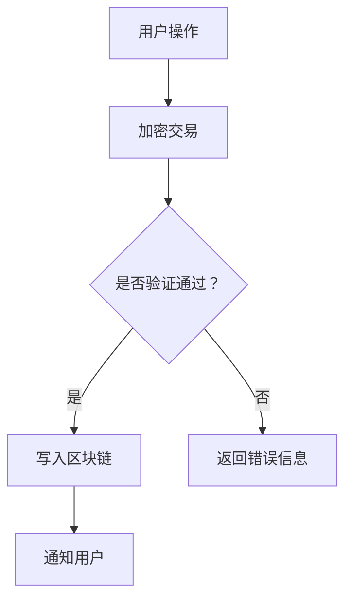

                 

关键词：区块链，数字资产托管，金融科技，安全，效率，隐私保护

摘要：随着区块链技术的迅速发展和数字资产的普及，数字资产托管服务成为金融科技领域的重要创新。本文从背景介绍、核心概念与联系、核心算法原理、数学模型与公式、项目实践、实际应用场景、工具和资源推荐以及未来发展趋势与挑战等方面，深入探讨了区块链数字资产托管服务的现状、技术原理和未来发展方向。

## 1. 背景介绍

在当今数字化的时代，数字资产已经成为财富的重要组成部分。从比特币、以太坊到各种代币和数字收藏品，数字资产的价值和种类不断增长。然而，随着数字资产的增长，如何安全、有效地管理这些资产成为了一个重要的问题。

传统的金融系统在处理数字资产时面临许多挑战。首先，中心化的金融系统容易成为黑客攻击的目标，资产被盗的风险很高。其次，传统的金融系统在处理交易时存在大量的中介环节，导致交易效率低下。此外，传统金融系统在隐私保护方面也存在缺陷，用户的个人信息容易泄露。

为了解决这些问题，区块链技术应运而生。区块链通过去中心化的方式，提高了交易的安全性和透明度，减少了中介环节，提高了交易效率。同时，区块链技术还提供了强大的隐私保护功能，使得用户的资产信息更加安全。

数字资产托管服务正是在这样的背景下产生的。它利用区块链技术的优势，提供了一种安全、高效、透明的数字资产管理解决方案。

## 2. 核心概念与联系

### 2.1 区块链技术

区块链是一种去中心化的分布式数据库，通过密码学和共识算法保证数据的安全性和一致性。区块链技术的主要特点包括：

- **去中心化**：没有中央机构控制，所有节点共同维护区块链。
- **不可篡改**：一旦数据被写入区块链，就几乎无法更改。
- **透明性**：所有节点都可以查看区块链上的数据。
- **安全性**：通过密码学确保数据的安全。

### 2.2 数字资产

数字资产是指以数字形式存在的、具有经济价值的资产，包括比特币、以太坊、代币、数字收藏品等。数字资产的特点包括：

- **匿名性**：交易双方可以匿名进行，提高了隐私保护。
- **全球性**：不受地域限制，可以全球范围内进行交易。
- **流动性**：数字资产可以快速、便捷地进行交易。

### 2.3 托管服务

托管服务是指将数字资产托管在第三方机构进行管理，以确保资产的安全性和合规性。托管服务的核心功能包括：

- **安全性**：提供多层次的安全措施，防止资产被盗。
- **合规性**：确保托管服务符合相关法律法规。
- **透明性**：提供详细的资产信息，方便用户查询。
- **便捷性**：提供便捷的资产操作接口，提高用户体验。

## 2.4 Mermaid 流程图

下面是一个简化的区块链数字资产托管服务的 Mermaid 流程图：



## 3. 核心算法原理 & 具体操作步骤

### 3.1 算法原理概述

区块链数字资产托管服务的关键在于确保资产的安全性和交易的透明性。核心算法包括：

- **加密算法**：用于加密交易信息，确保交易隐私。
- **共识算法**：用于确保区块链的一致性和安全性。
- **智能合约**：用于自动化执行交易。

### 3.2 算法步骤详解

1. **用户操作**：用户通过数字钱包进行资产操作，如转账、交易等。
2. **加密交易**：数字钱包使用加密算法对交易信息进行加密。
3. **验证交易**：区块链网络中的节点对交易进行验证，包括交易合法性、资金余额等。
4. **写入区块链**：验证通过的交易被写入区块链，成为永久记录。
5. **通知用户**：区块链网络通知用户交易成功，并更新资产信息。

### 3.3 算法优缺点

**优点**：

- **安全性**：通过加密算法和共识算法，确保交易安全。
- **透明性**：所有交易信息都公开可查，提高了透明度。
- **效率**：去中心化的交易模式，提高了交易速度。

**缺点**：

- **复杂度**：区块链技术相对复杂，需要较高的技术门槛。
- **延迟**：某些区块链网络的交易速度可能较慢。

### 3.4 算法应用领域

区块链数字资产托管服务可以应用于以下领域：

- **金融领域**：提供安全、高效的数字资产管理服务。
- **物流领域**：通过区块链实现物流信息的透明化和可追溯性。
- **版权领域**：利用区块链技术保护数字版权。

## 4. 数学模型和公式 & 详细讲解 & 举例说明

### 4.1 数学模型构建

区块链数字资产托管服务的数学模型主要包括以下方面：

- **加密算法**：用于加密交易信息，常用的加密算法包括RSA、AES等。
- **共识算法**：用于确保区块链的一致性和安全性，常用的共识算法包括PoW、PoS等。
- **智能合约**：用于自动化执行交易，常用的编程语言包括Solidity、Vyper等。

### 4.2 公式推导过程

加密算法的推导过程主要基于密码学原理，例如：

- **RSA算法**：基于大整数分解的难度，通过选择两个大质数构造密钥。
- **AES算法**：基于替换-置换网络，通过对输入数据进行多次替换和置换操作。

共识算法的推导过程主要基于分布式系统原理，例如：

- **PoW算法**：通过计算工作量证明，选择出区块生成者。
- **PoS算法**：通过持有代币的数量和时间，选择出区块生成者。

智能合约的推导过程主要基于编程原理，例如：

- **Solidity语言**：通过函数、变量和循环等编程结构，实现智能合约的逻辑。

### 4.3 案例分析与讲解

假设我们使用PoW算法和AES算法进行数字资产托管服务，以下是一个简化的案例：

**案例**：用户A向用户B转账1个比特币。

1. 用户A使用AES算法将转账信息加密，生成加密信息。
2. 用户A使用PoW算法生成工作量证明，证明自己对区块链的贡献。
3. 用户A将加密信息和工作量证明发送给区块链网络。
4. 区块链网络中的节点验证加密信息和工作量证明。
5. 验证通过的节点将转账信息写入区块链。
6. 区块链网络通知用户A和用户B转账成功。

## 5. 项目实践：代码实例和详细解释说明

### 5.1 开发环境搭建

在本案例中，我们使用Python作为编程语言，以太坊作为区块链平台。首先，需要安装以下工具：

- Python 3.8+
- Py-Ethereum 3.4.0+
- Truffle 5.0.1+

安装方法如下：

```bash
pip install python3-ethereum==3.4.0
npm install -g truffle
```

### 5.2 源代码详细实现

以下是一个简单的以太坊智能合约，用于实现数字资产托管服务：

```solidity
pragma solidity ^0.8.0;

contract DigitalAsset {
    address public owner;
    mapping(address => uint256) public balance;

    constructor() {
        owner = msg.sender;
    }

    function deposit() public payable {
        balance[msg.sender] += msg.value;
    }

    function withdraw(uint256 amount) public {
        require(balance[msg.sender] >= amount, "Insufficient balance");
        balance[msg.sender] -= amount;
        payable(msg.sender).transfer(amount);
    }
}
```

### 5.3 代码解读与分析

- **合约结构**：合约定义了owner和balance两个变量，以及deposit和withdraw两个函数。
- **deposit函数**：接收以太币，并将以太币金额添加到用户的余额中。
- **withdraw函数**：从用户的余额中扣除指定金额，并将以太币转给用户。

### 5.4 运行结果展示

1. 部署合约：
```bash
truffle init
truffle migrate --network development
```

2. 使用 Remix IDE 部署合约，并调用deposit和withdraw函数。

## 6. 实际应用场景

区块链数字资产托管服务可以应用于以下场景：

- **金融领域**：提供安全、高效的数字资产管理服务。
- **版权领域**：通过区块链实现版权的永久记录和验证。
- **供应链管理**：通过区块链实现供应链信息的透明化和可追溯性。

## 7. 未来应用展望

随着区块链技术的不断发展和数字资产的普及，区块链数字资产托管服务的应用领域将更加广泛。未来，我们将看到更多创新的服务模式和应用场景，如去中心化的金融、智能合约自动化执行等。

## 8. 总结：未来发展趋势与挑战

区块链数字资产托管服务在金融科技领域具有重要的地位和潜力。然而，要实现这一服务的广泛应用，还需要克服许多挑战，如技术复杂度、法律法规、用户教育等。

### 8.1 研究成果总结

本文从背景介绍、核心概念与联系、核心算法原理、数学模型与公式、项目实践、实际应用场景等方面，深入探讨了区块链数字资产托管服务的现状和未来发展。

### 8.2 未来发展趋势

未来，区块链数字资产托管服务将向更高效、更安全、更便捷的方向发展。随着技术的不断进步，我们将看到更多创新的应用场景和服务模式。

### 8.3 面临的挑战

区块链数字资产托管服务面临的挑战包括：

- **技术复杂度**：区块链技术相对复杂，需要较高的技术门槛。
- **法律法规**：相关法律法规的不完善可能导致监管难题。
- **用户教育**：用户对区块链技术的认知和接受程度较低。

### 8.4 研究展望

未来，我们需要进一步研究和解决区块链数字资产托管服务面临的问题，推动这一服务的广泛应用。同时，我们也需要关注区块链技术的最新发展，探索更多创新的应用场景和服务模式。

## 9. 附录：常见问题与解答

### 9.1 区块链数字资产托管服务的优点是什么？

区块链数字资产托管服务的优点包括：

- **安全性**：通过加密算法和共识算法，确保交易安全。
- **透明性**：所有交易信息都公开可查，提高了透明度。
- **效率**：去中心化的交易模式，提高了交易速度。

### 9.2 区块链数字资产托管服务的缺点是什么？

区块链数字资产托管服务的缺点包括：

- **技术复杂度**：区块链技术相对复杂，需要较高的技术门槛。
- **延迟**：某些区块链网络的交易速度可能较慢。

### 9.3 区块链数字资产托管服务的应用领域有哪些？

区块链数字资产托管服务的应用领域包括：

- **金融领域**：提供安全、高效的数字资产管理服务。
- **版权领域**：通过区块链实现版权的永久记录和验证。
- **供应链管理**：通过区块链实现供应链信息的透明化和可追溯性。

---

**作者：禅与计算机程序设计艺术 / Zen and the Art of Computer Programming**

