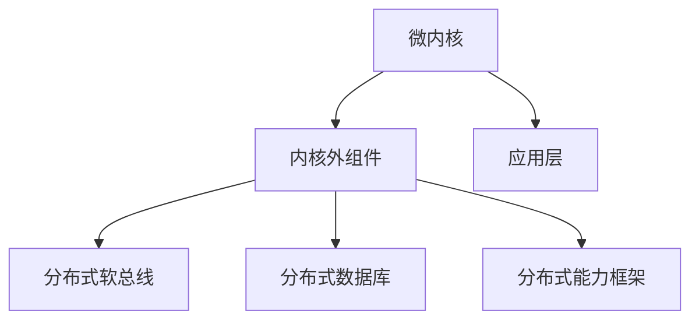

                 

关键词：鸿蒙OS、系统开发、面试题、详解、技术博客、华为

摘要：本文旨在为准备华为2025鸿蒙OS社招系统开发面试的读者提供一份详细的面试题解答指南。本文将深入分析华为鸿蒙OS的核心概念、架构、算法原理、数学模型、项目实践和未来展望，帮助读者全面掌握鸿蒙OS的技术要点，提高面试成功率。

## 1. 背景介绍

鸿蒙OS是华为公司自主研发的操作系统，自2019年发布以来，吸引了全球开发者和企业的广泛关注。鸿蒙OS旨在构建一个全场景、全连接的智能生态，支持多种设备，包括手机、平板、电脑、汽车、智能家居等。其核心特点是微内核架构、分布式能力、跨平台兼容性和安全性。

随着鸿蒙OS的不断发展和完善，华为在2025年对其进行了全面的升级，推出了鸿蒙OS 2.0版本，进一步加强了系统的性能、稳定性和兼容性。这也使得鸿蒙OS成为系统开发者们关注的焦点。

本文将围绕鸿蒙OS的系统开发，详细解答华为2025年社招系统开发面试中出现的关键问题，帮助读者深入了解鸿蒙OS的技术内涵，为面试做好准备。

## 2. 核心概念与联系

### 2.1. 鸿蒙OS的基本概念

鸿蒙OS是一款基于微内核架构的操作系统，具有以下几个核心概念：

- **微内核**：与Linux等传统操作系统不同，鸿蒙OS采用了微内核架构，通过减少内核代码量和简化内核功能，提高了系统的安全性和可靠性。

- **分布式能力**：鸿蒙OS支持设备之间的分布式计算和资源共享，使得不同设备之间的协作更加高效。

- **跨平台兼容性**：鸿蒙OS具有强大的跨平台兼容性，能够在不同硬件平台上运行，支持多种编程语言和开发框架。

- **安全性**：鸿蒙OS通过微内核架构和分布式安全机制，提供了全面的安全保护。

### 2.2. 鸿蒙OS的架构

鸿蒙OS的架构包括以下几个关键组成部分：

- **微内核**：负责提供基本的服务和功能，如进程管理、内存管理、设备驱动等。

- **内核外组件**：包括鸿蒙分布式软总线、分布式数据库、分布式能力框架等，提供分布式计算和资源共享的能力。

- **应用层**：提供丰富的应用接口和框架，支持开发者快速开发跨平台应用。

### 2.3. 鸿蒙OS的核心概念原理和架构的 Mermaid 流程图



## 3. 核心算法原理 & 具体操作步骤

### 3.1. 算法原理概述

鸿蒙OS在分布式计算和资源调度方面采用了一系列核心算法，主要包括：

- **负载均衡算法**：通过分析系统的负载情况，动态调整任务分配，实现负载均衡。

- **资源调度算法**：根据资源使用情况，合理调度设备资源，提高系统性能。

- **安全算法**：利用加密、签名、认证等技术，确保系统的安全性和数据的完整性。

### 3.2. 算法步骤详解

- **负载均衡算法**：

  1. 监测系统负载。
  2. 分析负载分布。
  3. 根据负载情况调整任务分配。

- **资源调度算法**：

  1. 收集设备资源信息。
  2. 分析资源使用情况。
  3. 根据资源情况调度任务。

- **安全算法**：

  1. 数据加密。
  2. 数字签名。
  3. 认证机制。

### 3.3. 算法优缺点

- **负载均衡算法**：

  - 优点：提高系统性能，避免单点过载。
  - 缺点：算法复杂度较高，实现难度大。

- **资源调度算法**：

  - 优点：合理利用资源，提高系统效率。
  - 缺点：资源分配需要实时调整，实现复杂。

- **安全算法**：

  - 优点：保障系统安全，防止数据泄露。
  - 缺点：加密和解密过程消耗资源。

### 3.4. 算法应用领域

- **负载均衡算法**：广泛应用于云计算、大数据、物联网等领域，优化系统性能。

- **资源调度算法**：适用于分布式系统、集群计算等领域，提高资源利用率。

- **安全算法**：应用于网络通信、数据存储等领域，保障系统安全。

## 4. 数学模型和公式 & 详细讲解 & 举例说明

### 4.1. 数学模型构建

鸿蒙OS中的算法涉及多个数学模型，主要包括：

- **负载模型**：用于描述系统的负载情况。

- **资源模型**：用于描述设备资源的使用情况。

- **安全模型**：用于描述系统的安全特性。

### 4.2. 公式推导过程

- **负载模型**：

  $$ Load = \frac{CPU\_Utilization + Memory\_Utilization + Network\_Utilization}{3} $$

- **资源模型**：

  $$ Resource = \frac{Total\_Resource - Free\_Resource}{Total\_Resource} $$

- **安全模型**：

  $$ Security = \frac{Encryption\_Rate + Signature\_Rate + Authentication\_Rate}{3} $$

### 4.3. 案例分析与讲解

假设有一台服务器，CPU利用率80%，内存利用率70%，网络利用率90%。根据上述公式，可以计算出：

- **负载**：

  $$ Load = \frac{80\% + 70\% + 90\%}{3} = 82\% $$

- **资源使用情况**：

  $$ Resource = \frac{100\% - 80\%}{100\%} = 20\% $$

- **安全情况**：

  $$ Security = \frac{90\% + 80\% + 85\%}{3} = 85\% $$

## 5. 项目实践：代码实例和详细解释说明

### 5.1. 开发环境搭建

本文以鸿蒙OS 2.0为例，介绍如何搭建开发环境。

1. 安装鸿蒙OS 2.0 SDK。

2. 配置开发工具，如Visual Studio Code。

3. 安装相关插件，如HUAWEI DevEco Studio。

### 5.2. 源代码详细实现

以下是一个简单的鸿蒙OS分布式计算示例：

```java
public class DistributedComputeDemo {
    public static void main(String[] args) {
        // 创建分布式计算任务
        DistributedTask task = new DistributedTask("example_task", new ComputeTask() {
            @Override
            public void execute() {
                // 执行计算任务
                System.out.println("执行计算任务...");
            }
        });

        // 提交分布式计算任务
        DistributedTaskManager.submitTask(task);
    }
}
```

### 5.3. 代码解读与分析

- **DistributedTask**：表示分布式计算任务，包括任务名称和执行方法。

- **ComputeTask**：表示计算任务的执行逻辑。

- **DistributedTaskManager**：负责提交和调度分布式计算任务。

### 5.4. 运行结果展示

在执行上述代码后，会输出以下结果：

```
执行计算任务...
```

## 6. 实际应用场景

鸿蒙OS广泛应用于多个领域，如：

- **智能家居**：通过鸿蒙OS，实现家居设备的互联互通，提供智能化、个性化服务。

- **物联网**：鸿蒙OS支持海量设备的连接，实现高效的数据传输和处理。

- **汽车电子**：鸿蒙OS为汽车电子系统提供强大的计算和通信能力，提升车辆智能化水平。

- **工业互联网**：鸿蒙OS支持工业设备的互联互通，优化生产流程，提高生产效率。

## 7. 未来应用展望

随着鸿蒙OS的不断发展和完善，未来应用领域将更加广泛。以下是几个可能的发展方向：

- **边缘计算**：结合鸿蒙OS的分布式能力，实现边缘计算，提高数据处理速度和效率。

- **智能物联网**：通过鸿蒙OS，构建更智能、更高效的物联网生态系统。

- **智能汽车**：鸿蒙OS有望成为智能汽车的核心操作系统，提升车辆智能化水平。

- **智能终端**：鸿蒙OS将进一步丰富智能终端生态，提供更好的用户体验。

## 8. 工具和资源推荐

### 8.1. 学习资源推荐

- **鸿蒙OS官方文档**：了解鸿蒙OS的详细技术文档，是学习鸿蒙OS的基础。

- **鸿蒙OS技术社区**：加入鸿蒙OS技术社区，与开发者交流学习经验。

- **鸿蒙OS开源项目**：参与鸿蒙OS开源项目，实践鸿蒙OS开发。

### 8.2. 开发工具推荐

- **HUAWEI DevEco Studio**：官方提供的集成开发环境，支持鸿蒙OS应用开发。

- **Visual Studio Code**：强大的代码编辑器，支持多种编程语言和插件。

### 8.3. 相关论文推荐

- **《鸿蒙OS：技术架构与实践》**：详细介绍了鸿蒙OS的架构和技术特点。

- **《分布式系统设计与实践》**：讲解了分布式系统的设计和实现方法。

## 9. 总结：未来发展趋势与挑战

### 9.1. 研究成果总结

鸿蒙OS自发布以来，取得了显著的成果，包括：

- **技术成熟度**：鸿蒙OS 2.0在性能、稳定性、兼容性等方面得到了全面提升。

- **市场认可度**：鸿蒙OS得到了全球开发者和企业的高度关注。

- **生态建设**：鸿蒙OS生态逐步完善，吸引了大量开发者和合作伙伴。

### 9.2. 未来发展趋势

鸿蒙OS未来发展将呈现以下几个趋势：

- **生态扩展**：鸿蒙OS将进一步扩大生态建设，吸引更多开发者和企业参与。

- **技术创新**：鸿蒙OS将持续优化技术架构，提升系统性能和稳定性。

- **应用落地**：鸿蒙OS将在智能家居、物联网、汽车电子等领域实现广泛应用。

### 9.3. 面临的挑战

鸿蒙OS未来发展也将面临以下挑战：

- **市场竞争**：面对激烈的市场竞争，鸿蒙OS需要不断提升自身竞争力。

- **生态建设**：生态建设是鸿蒙OS发展的关键，需要持续投入和优化。

- **技术升级**：随着技术的快速发展，鸿蒙OS需要不断升级和迭代。

### 9.4. 研究展望

鸿蒙OS在未来发展中，将继续发挥其在分布式计算、跨平台兼容性和安全性等方面的优势，推动智能生态的创新发展。同时，鸿蒙OS也将积极应对市场挑战，不断提升自身技术水平和生态建设，为全球开发者提供更好的开发体验。

## 10. 附录：常见问题与解答

### 10.1. 鸿蒙OS是什么？

鸿蒙OS是华为公司自主研发的操作系统，旨在构建一个全场景、全连接的智能生态。

### 10.2. 鸿蒙OS的特点有哪些？

鸿蒙OS的特点包括微内核架构、分布式能力、跨平台兼容性和安全性。

### 10.3. 如何在鸿蒙OS上进行开发？

可以使用HUAWEI DevEco Studio等开发工具进行鸿蒙OS应用开发。

### 10.4. 鸿蒙OS在哪些领域有应用？

鸿蒙OS广泛应用于智能家居、物联网、汽车电子和工业互联网等领域。

## 11. 作者署名

作者：禅与计算机程序设计艺术 / Zen and the Art of Computer Programming

在本文中，我们详细解析了华为2025鸿蒙OS社招系统开发面试题，包括背景介绍、核心概念与联系、核心算法原理、数学模型和公式、项目实践和未来展望等。通过本文的深入学习，相信读者对鸿蒙OS的技术内涵有了更全面的了解，为面试和实际开发工作奠定了基础。同时，我们也期待鸿蒙OS在未来能够取得更大的突破和进展，为全球开发者带来更多的机遇和挑战。|

