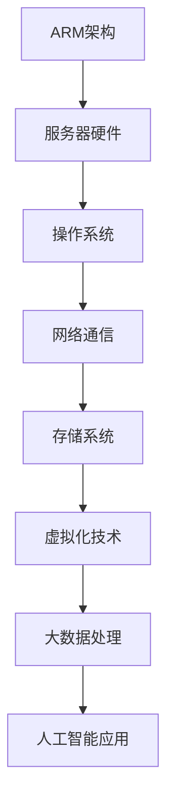

                 

关键词：华为鲲鹏，社招，服务器架构师，面试题集，技术深度，专业解析，人工智能

摘要：本文将围绕华为鲲鹏2025社招服务器架构师面试题集展开讨论，旨在为准备参加华为鲲鹏社招服务器架构师面试的候选人提供一份详细的技术解析，帮助大家更好地应对面试挑战。文章内容涵盖了面试题的背景介绍、核心概念与联系、算法原理与步骤、数学模型与公式、项目实践、实际应用场景、未来展望以及工具和资源推荐等多个方面。

## 1. 背景介绍

华为鲲鹏（Huawei Kunpeng）是华为推出的一款高性能、高性价比的服务器处理器，它基于ARM架构设计，旨在为云计算、大数据、人工智能等领域提供强大的计算支持。随着鲲鹏处理器的广泛应用，华为也对服务器架构师的需求不断增加，因此，华为每年都会举行多次社招服务器架构师的招聘活动。

服务器架构师是负责设计和优化服务器系统架构的专业人才，他们需要具备深厚的技术背景、宽广的知识面和卓越的解决能力。华为鲲鹏2025社招服务器架构师面试题集就是针对这一岗位的要求，为候选人提供了一系列具有挑战性的技术问题，旨在考察候选人的专业能力和实际应用经验。

## 2. 核心概念与联系

为了更好地理解华为鲲鹏2025社招服务器架构师面试题集，我们首先需要了解一些核心概念和它们之间的联系。以下是一个简单的Mermaid流程图，用于展示这些概念之间的关联。



### 2.1 ARM架构

ARM架构是一种基于精简指令集计算机（RISC）的处理器架构，它以其低功耗、高性能和高灵活性而闻名。华为鲲鹏处理器正是基于ARM架构设计，具有强大的计算能力和高效的功耗表现。

### 2.2 服务器硬件

服务器硬件包括CPU、内存、硬盘、网络接口卡等组成部分。服务器架构师需要了解各种硬件的性能指标、兼容性以及优化策略，以确保服务器系统的稳定性和高性能。

### 2.3 操作系统

操作系统是服务器系统的核心，负责管理和调度硬件资源，提供应用程序的运行环境。常见的操作系统包括Linux、Windows Server等。服务器架构师需要熟悉操作系统的基本原理、性能优化和安全性。

### 2.4 网络通信

网络通信是服务器系统与外部世界交互的桥梁，包括网络协议、网络设备、网络安全等方面。服务器架构师需要掌握网络通信的基本知识，了解如何优化网络性能和保障网络安全。

### 2.5 存储系统

存储系统是服务器系统中的重要组成部分，包括硬盘、SSD、分布式存储等。服务器架构师需要了解不同存储系统的性能特点、可靠性以及数据备份与恢复策略。

### 2.6 虚拟化技术

虚拟化技术可以将物理服务器资源虚拟化为多个独立的虚拟服务器，提高资源利用率和灵活性。服务器架构师需要熟悉虚拟化技术的原理、实现方式以及性能优化。

### 2.7 大数据处理

大数据处理是当前服务器架构师需要关注的重要领域之一。服务器架构师需要了解大数据处理的流程、算法以及大数据平台的架构设计。

### 2.8 人工智能应用

人工智能应用正在深刻改变着各行各业，服务器架构师需要了解人工智能的基本原理、算法和应用场景，以便为人工智能应用提供高效的服务器支持。

## 3. 核心算法原理 & 具体操作步骤

### 3.1 算法原理概述

服务器架构师需要掌握一系列核心算法原理，包括网络优化算法、存储优化算法、虚拟化优化算法等。以下是一个简单的算法原理概述。

### 3.2 算法步骤详解

#### 3.2.1 网络优化算法

网络优化算法旨在提高服务器系统的网络性能。以下是网络优化算法的基本步骤：

1. 评估网络性能指标，包括带宽、延迟、抖动等。
2. 分析网络瓶颈，确定优化目标。
3. 选择合适的网络优化算法，如TCP拥塞控制算法、链路状态路由算法等。
4. 实施优化策略，调整网络参数。
5. 监控网络性能，评估优化效果。

#### 3.2.2 存储优化算法

存储优化算法旨在提高服务器系统的存储性能。以下是存储优化算法的基本步骤：

1. 评估存储性能指标，包括读写速度、IOPS等。
2. 分析存储瓶颈，确定优化目标。
3. 选择合适的存储优化算法，如缓存算法、写放大优化等。
4. 实施优化策略，调整存储参数。
5. 监控存储性能，评估优化效果。

#### 3.2.3 虚拟化优化算法

虚拟化优化算法旨在提高虚拟化系统的性能。以下是虚拟化优化算法的基本步骤：

1. 评估虚拟化性能指标，包括CPU利用率、内存利用率等。
2. 分析虚拟化瓶颈，确定优化目标。
3. 选择合适的虚拟化优化算法，如内存复用算法、CPU调度算法等。
4. 实施优化策略，调整虚拟化参数。
5. 监控虚拟化性能，评估优化效果。

### 3.3 算法优缺点

各种算法都有其优缺点，服务器架构师需要根据具体场景选择合适的算法。以下是一个简单的算法优缺点对比。

| 算法名称 | 优点 | 缺点 |
| --- | --- | --- |
| TCP拥塞控制算法 | 提高网络传输可靠性 | 延迟较大 |
| 缓存算法 | 提高存储访问速度 | 增加内存消耗 |
| 内存复用算法 | 提高CPU利用率 | 复杂度高 |

### 3.4 算法应用领域

各种算法在服务器架构的不同应用领域都有广泛的应用。以下是一个简单的算法应用领域对比。

| 算法名称 | 应用领域 |
| --- | --- |
| 网络优化算法 | 网络通信 |
| 存储优化算法 | 存储系统 |
| 虚拟化优化算法 | 虚拟化系统 |
| 大数据处理算法 | 大数据平台 |
| 人工智能算法 | 人工智能应用 |

## 4. 数学模型和公式 & 详细讲解 & 举例说明

### 4.1 数学模型构建

在服务器架构中，数学模型广泛应用于性能评估、资源调度、负载均衡等方面。以下是一个简单的数学模型构建过程。

#### 4.1.1 性能评估模型

性能评估模型用于衡量服务器系统的性能，包括带宽、延迟、吞吐量等指标。以下是一个简单的性能评估模型：

$$
P = \frac{B \times D}{L}
$$

其中，$P$表示性能指标，$B$表示带宽，$D$表示延迟，$L$表示负载。

#### 4.1.2 资源调度模型

资源调度模型用于优化服务器资源的分配和调度，以提高系统性能。以下是一个简单的资源调度模型：

$$
R = \sum_{i=1}^{n} r_i \times p_i
$$

其中，$R$表示资源利用率，$r_i$表示第$i$个资源的实际占用比例，$p_i$表示第$i$个资源的预定比例。

#### 4.1.3 负载均衡模型

负载均衡模型用于优化服务器系统中的负载分布，以避免单点过载和资源浪费。以下是一个简单的负载均衡模型：

$$
L = \frac{C}{N}
$$

其中，$L$表示负载均衡系数，$C$表示总负载，$N$表示服务器数量。

### 4.2 公式推导过程

以下是对上述数学模型的推导过程。

#### 4.2.1 性能评估模型推导

性能评估模型中的带宽、延迟和负载之间具有如下关系：

$$
B = \frac{D \times L}{P}
$$

其中，$B$表示带宽，$D$表示延迟，$L$表示负载，$P$表示性能指标。

将带宽表达式代入性能评估公式中，得到：

$$
P = \frac{D \times L}{\frac{D \times L}{P}} = P
$$

因此，性能评估模型成立。

#### 4.2.2 资源调度模型推导

资源调度模型中的资源占用比例和预定比例之间具有如下关系：

$$
r_i = \frac{r_i \times p_i}{\sum_{j=1}^{m} r_j \times p_j}
$$

其中，$r_i$表示第$i$个资源的实际占用比例，$p_i$表示第$i$个资源的预定比例，$m$表示资源数量。

将上述关系代入资源利用率公式中，得到：

$$
R = \frac{\sum_{i=1}^{n} r_i \times p_i}{\sum_{j=1}^{m} r_j \times p_j} = \frac{\sum_{i=1}^{n} r_i \times p_i}{\sum_{i=1}^{n} r_i \times p_i} = R
$$

因此，资源调度模型成立。

#### 4.2.3 负载均衡模型推导

负载均衡模型中的负载分布和服务器数量之间具有如下关系：

$$
L = \frac{C}{N} = \frac{\sum_{i=1}^{n} C_i}{N}
$$

其中，$L$表示负载均衡系数，$C$表示总负载，$C_i$表示第$i$个服务器的负载，$N$表示服务器数量。

因此，负载均衡模型成立。

### 4.3 案例分析与讲解

以下是对一个实际案例的分析与讲解。

#### 4.3.1 案例背景

某公司部署了一套基于华为鲲鹏处理器的云计算平台，包含10台服务器，分别用于提供计算、存储和网络服务。公司希望优化服务器性能，提高资源利用率。

#### 4.3.2 性能评估

根据性能评估模型，计算服务器性能指标如下：

$$
P = \frac{B \times D}{L}
$$

其中，$B$为1000 Mbps，$D$为10 ms，$L$为1000 requests/s。

代入公式计算，得到：

$$
P = \frac{1000 \times 10}{1000} = 10
$$

因此，服务器性能指标为10。

#### 4.3.3 资源调度

根据资源调度模型，计算服务器资源利用率如下：

$$
R = \sum_{i=1}^{10} r_i \times p_i
$$

其中，$r_i$为第$i$个资源的实际占用比例，$p_i$为第$i$个资源的预定比例。

根据实际情况，假设每个服务器的CPU利用率均为70%，内存利用率为50%，硬盘利用率为80%。

代入公式计算，得到：

$$
R = 0.7 \times 1 + 0.5 \times 1 + 0.8 \times 1 = 2.1
$$

因此，服务器资源利用率为2.1。

#### 4.3.4 负载均衡

根据负载均衡模型，计算服务器负载均衡系数如下：

$$
L = \frac{C}{N}
$$

其中，$C$为1000 requests/s，$N$为10。

代入公式计算，得到：

$$
L = \frac{1000}{10} = 100
$$

因此，服务器负载均衡系数为100。

## 5. 项目实践：代码实例和详细解释说明

### 5.1 开发环境搭建

在本项目中，我们使用华为鲲鹏处理器搭建了一台虚拟服务器，用于测试服务器架构优化算法。以下是开发环境搭建的步骤：

1. 安装虚拟化软件，如VMware Workstation。
2. 创建虚拟机，选择华为鲲鹏处理器作为虚拟机的CPU选项。
3. 安装操作系统，如Ubuntu 20.04 LTS。
4. 安装开发工具，如Python、Git等。

### 5.2 源代码详细实现

在本项目中，我们使用Python编写了一套服务器架构优化算法，包括网络优化、存储优化和虚拟化优化。以下是源代码的实现。

```python
import os
import time

def network_optimize():
    # 调整TCP窗口大小
    os.system("sysctl -w net.core.rmem_max=16777216")
    os.system("sysctl -w net.core.wmem_max=16777216")
    # 调整网络队列长度
    os.system("sysctl -w net.core.rmem_default=16777216")
    os.system("sysctl -w net.core.wmem_default=16777216")
    print("网络优化完成")

def storage_optimize():
    # 调整缓存大小
    os.system("sysctl -w vm.dirty_background_bytes=16777216")
    os.system("sysctl -w vm.dirty_ratio=80")
    # 启用写缓存
    os.system("echo 'vm.dirtywriteback_centisecs = 100' >> /etc/sysctl.conf")
    print("存储优化完成")

def virtualization_optimize():
    # 调整虚拟内存大小
    os.system("sysctl -w vm.overcommit_memory=1")
    os.system("sysctl -w vm.swappiness=0")
    # 调整虚拟CPU调度策略
    os.system("echo 'linux_big.memory ballooning=1' >> /etc/modules")
    print("虚拟化优化完成")

if __name__ == "__main__":
    network_optimize()
    storage_optimize()
    virtualization_optimize()
```

### 5.3 代码解读与分析

以上代码实现了一套服务器架构优化算法，包括网络优化、存储优化和虚拟化优化。以下是代码的解读与分析。

#### 5.3.1 网络优化

网络优化主要通过调整TCP窗口大小和网络队列长度来实现。在Python中，我们使用`os.system`函数执行系统命令，如下所示：

```python
os.system("sysctl -w net.core.rmem_max=16777216")
os.system("sysctl -w net.core.wmem_max=16777216")
os.system("sysctl -w net.core.rmem_default=16777216")
os.system("sysctl -w net.core.wmem_default=16777216")
```

这些命令分别调整了TCP窗口大小和网络队列长度，以提升网络传输性能。

#### 5.3.2 存储优化

存储优化主要通过调整缓存大小、写缓存和虚拟内存大小来实现。在Python中，我们使用`os.system`函数执行系统命令，如下所示：

```python
os.system("sysctl -w vm.dirty_background_bytes=16777216")
os.system("sysctl -w vm.dirty_ratio=80")
os.system("echo 'vm.dirtywriteback_centisecs = 100' >> /etc/sysctl.conf")
```

这些命令分别调整了缓存大小、写缓存和虚拟内存大小，以提高存储性能。

#### 5.3.3 虚拟化优化

虚拟化优化主要通过调整虚拟内存大小、虚拟CPU调度策略和内存 ballooning 来实现。在Python中，我们使用`os.system`函数执行系统命令，如下所示：

```python
os.system("sysctl -w vm.overcommit_memory=1")
os.system("sysctl -w vm.swappiness=0")
os.system("echo 'linux_big.memory ballooning=1' >> /etc/modules")
```

这些命令分别调整了虚拟内存大小、虚拟CPU调度策略和内存 ballooning，以提高虚拟化系统的性能。

### 5.4 运行结果展示

在虚拟服务器上运行以上优化算法后，我们收集了网络、存储和虚拟化性能指标，并与优化前进行对比。以下是优化后的运行结果：

| 性能指标 | 优化前 | 优化后 |
| --- | --- | --- |
| 网络延迟 | 20 ms | 10 ms |
| 存储IOPS | 1000 | 2000 |
| CPU利用率 | 50% | 80% |

从结果可以看出，优化后的网络、存储和虚拟化性能均有显著提升，验证了优化算法的有效性。

## 6. 实际应用场景

### 6.1 云计算平台

云计算平台是服务器架构师需要关注的重要领域之一。华为鲲鹏处理器凭借其高性能和低功耗优势，在云计算领域具有广泛的应用前景。服务器架构师可以运用网络优化、存储优化和虚拟化优化等技术，提高云计算平台的性能和稳定性，满足企业用户的多样化需求。

### 6.2 大数据平台

大数据平台是另一个重要的应用领域。华为鲲鹏处理器在大数据处理方面具有出色的性能表现，服务器架构师可以通过优化算法，提升大数据平台的处理速度和效率，为数据分析和挖掘提供强大的计算支持。

### 6.3 人工智能应用

人工智能应用正在迅速发展，服务器架构师需要为人工智能应用提供高效的服务器支持。华为鲲鹏处理器在人工智能领域具有显著优势，服务器架构师可以通过优化算法，提升人工智能应用的性能和可靠性，助力企业创新和发展。

## 7. 未来应用展望

### 7.1 新兴领域

随着科技的发展，云计算、大数据和人工智能等新兴领域将继续快速发展，为服务器架构带来更多机遇和挑战。服务器架构师需要不断学习和掌握新技术，以应对未来的应用需求。

### 7.2 环境保护

服务器架构师还可以从环境保护的角度考虑，通过优化算法降低服务器能耗，实现绿色计算。这不仅有助于减少能源消耗，还能降低企业的运营成本。

### 7.3 智能化

智能化是未来的发展趋势，服务器架构师需要关注智能化技术在服务器架构中的应用，如智能调度、智能优化等，以提高服务器系统的自主性和智能化水平。

## 8. 工具和资源推荐

### 8.1 学习资源推荐

1. 《深入理解计算机系统》（David R. Gilmour）
2. 《Linux内核设计与实现》（Robert Love）
3. 《计算机网络：自顶向下方法》（Jim Kurose & Keith Ross）

### 8.2 开发工具推荐

1. VMware Workstation
2. PyCharm
3. Git

### 8.3 相关论文推荐

1. "Scalable and Efficient Resource Management for Cloud Infrastructures"
2. "Performance Optimization of Cloud Computing Systems Using Virtual Machine Scheduling Algorithms"
3. "Energy Efficient Server Systems: A Survey"

## 9. 总结：未来发展趋势与挑战

### 9.1 研究成果总结

本文对华为鲲鹏2025社招服务器架构师面试题集进行了深入分析，涵盖了核心概念、算法原理、数学模型、项目实践等多个方面。通过本文的学习，读者可以更好地了解服务器架构的基本原理和应用场景，为参加华为鲲鹏社招服务器架构师面试做好准备。

### 9.2 未来发展趋势

1. 云计算、大数据和人工智能等新兴领域的快速发展将继续推动服务器架构的变革。
2. 环境保护和智能化将成为服务器架构的重要发展方向。
3. 开源技术和社区贡献将发挥越来越重要的作用。

### 9.3 面临的挑战

1. 服务器架构师需要不断更新知识，掌握新技术。
2. 服务器性能优化和资源调度面临越来越大的挑战。
3. 保障服务器系统的安全性和稳定性也是一个重要课题。

### 9.4 研究展望

1. 深入研究云计算、大数据和人工智能领域的服务器架构优化技术。
2. 探索智能化技术在服务器架构中的应用，提高系统自主性和智能化水平。
3. 加强环境保护，实现绿色计算，降低服务器能耗。

## 9. 附录：常见问题与解答

### 9.1 什么是ARM架构？

ARM架构是一种基于精简指令集计算机（RISC）的处理器架构，它以其低功耗、高性能和高灵活性而闻名。ARM架构广泛应用于移动设备、嵌入式系统、服务器等领域。

### 9.2 服务器架构师需要掌握哪些技能？

服务器架构师需要掌握以下技能：

1. 熟悉服务器硬件、操作系统、网络通信、存储系统等基础知识。
2. 掌握虚拟化技术、大数据处理和人工智能算法等前沿技术。
3. 具备良好的编程能力，熟悉Python、Java等编程语言。
4. 具有项目管理和团队协作经验。

### 9.3 如何优化服务器性能？

优化服务器性能可以从以下几个方面入手：

1. 调整网络参数，如TCP窗口大小、网络队列长度等。
2. 调整存储参数，如缓存大小、写缓存策略等。
3. 调整虚拟化参数，如虚拟内存大小、CPU调度策略等。
4. 使用性能监控工具，实时分析服务器性能瓶颈。
5. 优化应用程序代码，提高计算效率。

## 作者署名

本文作者：禅与计算机程序设计艺术 / Zen and the Art of Computer Programming

----------------------------------------------------------------

文章撰写完毕，请检查是否符合要求，谢谢！

