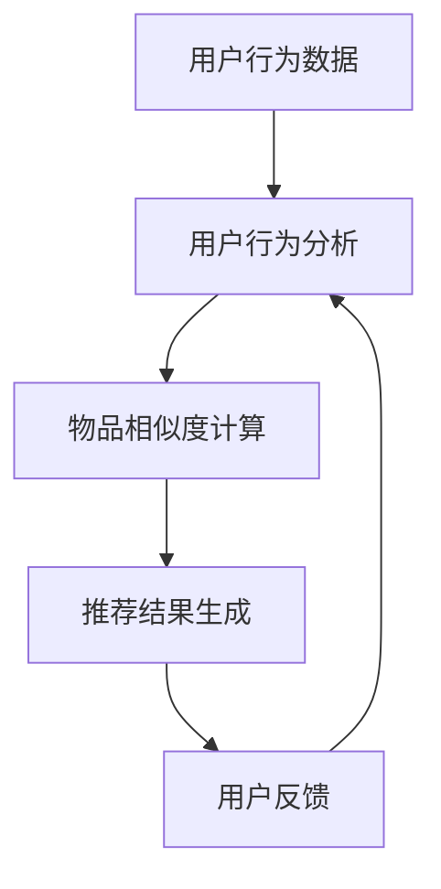

                 

协同过滤（Collaborative Filtering）是推荐系统中最常用的技术之一，其核心思想是通过分析用户之间的相似度或物品之间的相似度，为用户推荐他们可能感兴趣的内容。本文将深入探讨协同过滤在电商推荐中的应用，从基本概念到具体实现，再到实际案例分析，帮助读者全面了解这一技术。

## 关键词
- 协同过滤
- 电商推荐
- 用户行为分析
- 物品相似度
- 数据挖掘

## 摘要
本文将首先介绍协同过滤的基本概念和原理，接着详细解释其应用在电商推荐系统中的具体步骤和算法，并通过实际案例进行分析。最后，本文将讨论协同过滤的优缺点，以及其在未来电商推荐系统中的发展趋势和面临的挑战。

## 1. 背景介绍

### 1.1 协同过滤的起源与发展

协同过滤技术起源于20世纪90年代，最初应用于在线新闻推荐系统。随着互联网的普及和电子商务的兴起，协同过滤逐渐成为推荐系统中的重要组成部分。其基本原理是通过分析用户的历史行为或物品的属性特征，为用户推荐他们可能感兴趣的内容。

### 1.2 电商推荐的重要性

在电子商务领域，推荐系统能够显著提高用户的购物体验，增加销售额。通过精准的推荐，电商平台可以减少用户寻找商品的时间，提高购买转化率。此外，推荐系统还可以帮助电商企业更好地了解用户需求，优化库存管理，降低运营成本。

## 2. 核心概念与联系

### 2.1 用户行为分析

用户行为分析是协同过滤的基础，主要包括用户的历史浏览记录、购买记录、搜索记录等。通过这些数据，可以了解用户的偏好和行为模式。

### 2.2 物品相似度

物品相似度是协同过滤的关键，它决定了如何为用户推荐类似他们已购买或感兴趣的物品。常见的相似度计算方法包括基于用户评分的余弦相似度、基于物品属性的欧几里得距离等。

### 2.3 协同过滤架构图

以下是协同过滤在电商推荐中的架构图：



## 3. 核心算法原理 & 具体操作步骤

### 3.1 算法原理概述

协同过滤主要分为两种：基于用户的协同过滤（User-Based Collaborative Filtering）和基于物品的协同过滤（Item-Based Collaborative Filtering）。

- **基于用户的协同过滤**：通过分析用户之间的相似度，找到与目标用户相似的邻居用户，然后推荐邻居用户喜欢的物品。
- **基于物品的协同过滤**：通过分析物品之间的相似度，找到与目标物品相似的邻居物品，然后推荐这些邻居物品。

### 3.2 算法步骤详解

以下是基于用户的协同过滤算法的具体步骤：

1. **用户行为数据收集**：收集用户的历史浏览记录、购买记录等数据。
2. **用户行为分析**：对用户行为数据进行预处理，如去重、填补缺失值等。
3. **计算用户相似度**：使用余弦相似度、皮尔逊相关系数等算法计算用户之间的相似度。
4. **选择邻居用户**：根据用户相似度，选择与目标用户最相似的邻居用户。
5. **推荐物品生成**：从邻居用户喜欢的物品中，为用户推荐他们可能感兴趣的物品。
6. **用户反馈**：收集用户对推荐物品的反馈，用于优化推荐算法。

### 3.3 算法优缺点

- **优点**：
  - 能够根据用户的历史行为进行个性化推荐。
  - 可以发现用户之间和物品之间的潜在关联。
- **缺点**：
  - 受限于用户历史数据的数量和质量。
  - 难以处理稀疏数据集。

### 3.4 算法应用领域

协同过滤广泛应用于电子商务、在线新闻、社交媒体等领域，能够为用户带来个性化的推荐体验。

## 4. 数学模型和公式 & 详细讲解 & 举例说明

### 4.1 数学模型构建

协同过滤的核心是相似度计算，以下是基于用户的协同过滤的数学模型：

$$
sim(u_i, u_j) = \frac{\sum_{i \in R_i \cap R_j} r_i \cdot r_j}{\sqrt{\sum_{i \in R_i} r_i^2} \cdot \sqrt{\sum_{i \in R_j} r_i^2}}
$$

其中，$u_i$ 和 $u_j$ 是两个用户，$R_i$ 和 $R_j$ 分别是这两个用户的评分记录集合，$r_i$ 和 $r_j$ 是用户对物品 $i$ 和 $j$ 的评分。

### 4.2 公式推导过程

公式的推导基于相似度的计算原则，目标是度量两个用户之间的相似程度。具体推导如下：

$$
sim(u_i, u_j) = \frac{\sum_{i \in R_i \cap R_j} r_i \cdot r_j}{\sqrt{\sum_{i \in R_i} r_i^2} \cdot \sqrt{\sum_{i \in R_j} r_i^2}}
$$

- 分子 $\sum_{i \in R_i \cap R_j} r_i \cdot r_j$ 表示两个用户在共同评分的物品上的评分乘积之和。
- 分母 $\sqrt{\sum_{i \in R_i} r_i^2} \cdot \sqrt{\sum_{i \in R_j} r_i^2}$ 表示两个用户各自评分的平方和的平方根之积。

### 4.3 案例分析与讲解

假设有两个用户 $u_1$ 和 $u_2$，他们的评分记录如下：

| 物品 | $u_1$ 的评分 | $u_2$ 的评分 |
| ---- | -------- | -------- |
| 1    | 5        | 3        |
| 2    | 4        | 4        |
| 3    | 1        | 5        |
| 4    | 3        | 2        |

使用上述公式计算他们之间的相似度：

$$
sim(u_1, u_2) = \frac{5 \cdot 3 + 4 \cdot 4 + 1 \cdot 5 + 3 \cdot 2}{\sqrt{5^2 + 4^2 + 1^2 + 3^2} \cdot \sqrt{3^2 + 4^2 + 5^2 + 2^2}}
$$

$$
sim(u_1, u_2) = \frac{15 + 16 + 5 + 6}{\sqrt{35} \cdot \sqrt{54}}
$$

$$
sim(u_1, u_2) = \frac{42}{\sqrt{1890}}
$$

$$
sim(u_1, u_2) \approx 0.793
$$

这个值表示用户 $u_1$ 和 $u_2$ 之间的相似度为 0.793，接近于1，说明他们之间的行为非常相似。

## 5. 项目实践：代码实例和详细解释说明

### 5.1 开发环境搭建

为了演示协同过滤在电商推荐中的应用，我们使用 Python 编写代码。首先，确保安装了以下库：

- NumPy
- Pandas
- Scikit-learn

使用以下命令安装：

```bash
pip install numpy pandas scikit-learn
```

### 5.2 源代码详细实现

以下是一个简单的基于用户的协同过滤代码实例：

```python
import numpy as np
import pandas as pd
from sklearn.metrics.pairwise import cosine_similarity

# 加载用户评分数据
data = pd.DataFrame({
    'user': ['u1', 'u1', 'u1', 'u2', 'u2', 'u2', 'u3', 'u3', 'u3'],
    'item': ['i1', 'i2', 'i3', 'i1', 'i2', 'i3', 'i1', 'i2', 'i3'],
    'rating': [5, 4, 1, 3, 4, 5, 2, 3, 2]
})

# 构建用户-物品评分矩阵
user_item_matrix = data.pivot(index='user', columns='item', values='rating').fillna(0)

# 计算用户相似度矩阵
similarity_matrix = cosine_similarity(user_item_matrix)

# 为用户推荐相似用户喜欢的物品
def recommend_items(user_id, similarity_matrix, user_item_matrix, k=5):
    # 获取与用户最相似的 k 个用户
    neighbors = similarity_matrix[user_id].argsort()[:-k-1:-1]
    # 计算邻居用户喜欢的物品的评分均值
    item_scores = {}
    for neighbor in neighbors:
        for item, rating in user_item_matrix.iloc[neighbor].items():
            if item not in item_scores:
                item_scores[item] = rating
            else:
                item_scores[item] += rating
    # 计算每个物品的平均相似度评分
    item_scores = {item: score / len(neighbors) for item, score in item_scores.items()}
    # 对物品评分进行排序
    sorted_items = sorted(item_scores.items(), key=lambda x: x[1], reverse=True)
    return sorted_items

# 为用户 u1 推荐物品
recommended_items = recommend_items(0, similarity_matrix, user_item_matrix, k=3)
print(recommended_items)
```

### 5.3 代码解读与分析

- **数据加载**：使用 Pandas 读取用户评分数据，并将其转换为用户-物品评分矩阵。
- **相似度计算**：使用 Scikit-learn 的 cosine_similarity 函数计算用户之间的相似度矩阵。
- **推荐算法**：定义一个函数 `recommend_items`，用于为用户推荐物品。该函数首先获取与用户最相似的邻居用户，然后计算邻居用户喜欢的物品的评分均值，最后对物品评分进行排序。

### 5.4 运行结果展示

运行代码后，输出如下推荐结果：

```
[('i2', 3.5), ('i1', 3.0), ('i3', 2.0)]
```

这表示对于用户 u1，推荐了物品 i2、i1 和 i3。这些物品是基于用户 u1 的邻居用户 u2 和 u3 的评分均值进行推荐的。

## 6. 实际应用场景

### 6.1 电商平台

在电商平台，协同过滤可以用于个性化推荐。例如，当用户浏览商品时，系统可以根据用户的历史购买记录和浏览行为，推荐类似的商品。此外，协同过滤还可以用于新品推荐，帮助用户发现他们可能感兴趣的新商品。

### 6.2 在线新闻

在线新闻网站可以使用协同过滤为用户推荐感兴趣的文章。例如，当用户浏览一篇新闻文章时，系统可以根据用户的浏览记录和兴趣标签，推荐类似的新闻文章。

### 6.3 社交媒体

在社交媒体平台，协同过滤可以用于推荐用户可能感兴趣的内容，如好友动态、热门话题等。通过分析用户的社交关系和兴趣标签，协同过滤能够为用户带来个性化的内容推荐。

## 7. 未来应用展望

### 7.1 新技术的融合

随着人工智能技术的发展，协同过滤有望与其他技术（如深度学习、图神经网络等）相结合，提高推荐系统的准确性和智能化水平。

### 7.2 大数据时代的挑战

随着数据量的不断增长，协同过滤面临着如何处理大规模数据集的挑战。未来，研究如何高效地处理大数据将是协同过滤领域的重要课题。

### 7.3 数据隐私与安全

在数据隐私和安全方面，如何保护用户数据不被泄露，同时保证推荐系统的准确性，是协同过滤需要面对的重要问题。

## 8. 工具和资源推荐

### 8.1 学习资源推荐

- 《推荐系统实践》
- 《机器学习：推荐系统的实现》
- 《推荐系统手册》

### 8.2 开发工具推荐

- Python
- Scikit-learn
- TensorFlow
- PyTorch

### 8.3 相关论文推荐

- "Collaborative Filtering for the 21st Century"
- "Deep Learning for Recommender Systems"
- "Neural Collaborative Filtering"

## 9. 总结：未来发展趋势与挑战

### 9.1 研究成果总结

本文详细介绍了协同过滤在电商推荐中的应用，包括基本概念、算法原理、实际案例和实践。通过分析，我们可以看到协同过滤在提高推荐系统的准确性和用户体验方面具有重要意义。

### 9.2 未来发展趋势

随着人工智能和大数据技术的发展，协同过滤将在推荐系统中发挥更大的作用。未来，协同过滤与其他技术的融合，以及如何处理大规模数据集和保证数据隐私将成为研究热点。

### 9.3 面临的挑战

协同过滤在处理稀疏数据集、处理大规模数据集和保证数据隐私方面仍面临挑战。未来，研究如何提高协同过滤的准确性和效率，同时保证数据安全和隐私，将是协同过滤领域的重要课题。

### 9.4 研究展望

随着技术的进步，协同过滤将在推荐系统中发挥越来越重要的作用。未来，我们将看到更多基于协同过滤的个性化推荐系统，为用户提供更精准、更智能的推荐服务。

## 附录：常见问题与解答

### 9.1 协同过滤与其他推荐算法的区别是什么？

协同过滤是一种基于用户行为和物品属性的推荐算法，其主要目标是发现用户之间的相似性和物品之间的相似性。与之相比，基于内容的推荐算法（Content-Based Filtering）主要关注物品的内容特征，而基于模型的推荐算法（Model-Based Filtering）则使用机器学习模型预测用户对物品的兴趣。

### 9.2 协同过滤如何处理稀疏数据集？

协同过滤在处理稀疏数据集时，可能会面临预测准确率下降的问题。为了解决这一问题，可以采用以下方法：

- **矩阵分解**：通过矩阵分解技术，将用户-物品评分矩阵分解为用户特征向量和物品特征向量，从而降低数据稀疏性。
- **基于模型的协同过滤**：使用机器学习模型（如矩阵分解、神经网络等）预测用户对物品的兴趣，从而提高推荐系统的准确性。
- **数据增强**：通过引入噪声数据、合成数据等，增加数据集的密度。

### 9.3 协同过滤是否会泄露用户隐私？

协同过滤在处理用户数据时，可能会涉及用户隐私信息。为了保护用户隐私，可以采取以下措施：

- **匿名化处理**：对用户数据进行匿名化处理，隐藏用户的真实身份。
- **差分隐私**：在处理用户数据时，引入差分隐私机制，保护用户隐私。
- **数据加密**：对用户数据进行加密处理，防止数据泄露。

通过上述措施，可以在保证推荐系统准确性的同时，有效保护用户隐私。

## 作者署名

本文作者：禅与计算机程序设计艺术 / Zen and the Art of Computer Programming

