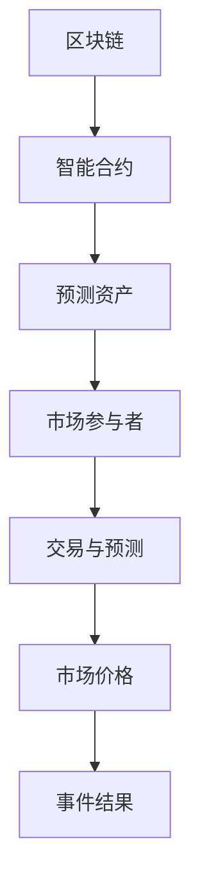

                 

关键词：去中心化预测市场、集体智慧、区块链技术、人工智能、应用场景、未来展望

> 摘要：本文将深入探讨去中心化预测市场（Decentralized Prediction Markets，简称 DPM）的概念、核心原理、算法实现及其在现实世界中的应用，旨在揭示集体智慧在信息预测和经济决策中的巨大潜力。

## 1. 背景介绍

### 1.1 预测市场的传统局限性

预测市场（Prediction Markets）起源于传统的赌场，但它们的基本概念可以追溯到更早的博彩和赌博活动。传统的预测市场通常由中心化的实体控制，如赌场、博彩公司或政府机构。这些市场通过提供关于某一事件结果（如政治选举、体育比赛结果等）的赌博机会，使参与者可以基于自己对事件结果判断进行投资。

然而，传统的预测市场存在一些局限性：

- **中心化风险**：中心化实体可能受到政治、经济或社会因素的影响，从而影响市场的公正性和透明度。
- **高昂成本**：中心化市场的运营和维护成本较高，这往往限制了参与者的范围和市场的规模。
- **信息不对称**：中心化市场可能无法充分利用所有可用的信息，导致市场效率低下。

### 1.2 去中心化预测市场的兴起

随着区块链技术和智能合约的发展，去中心化预测市场（DPM）应运而生。DPM 利用区块链的不可篡改性和智能合约的自动执行机制，实现了预测市场的去中心化和自动化。

去中心化预测市场的优势在于：

- **去中心化**：所有交易和数据都在区块链上公开透明地记录，减少了中心化风险。
- **降低成本**：去中心化架构降低了运营成本，使得更多人能够参与到预测市场中。
- **信息透明**：所有信息在区块链上可追溯，减少了信息不对称，提高了市场效率。

## 2. 核心概念与联系

### 2.1 去中心化预测市场的基本原理

去中心化预测市场的核心原理是通过市场机制和集体智慧来预测未来事件的结果。市场参与者通过买卖预测资产（如代币、期权等）来表达自己对事件结果的预测，市场的价格反映了集体智慧对事件结果的判断。

### 2.2 去中心化预测市场的架构

去中心化预测市场的架构通常包括以下部分：

- **区块链**：用于记录所有交易和数据，确保信息的不可篡改。
- **智能合约**：用于自动化执行交易规则，如定价、结算等。
- **预测资产**：如代币、期权等，代表对某一事件结果的预测。
- **市场参与者**：包括预测者、投资者、观察者等。

### 2.3 Mermaid 流程图



## 3. 核心算法原理 & 具体操作步骤

### 3.1 算法原理概述

去中心化预测市场的核心算法是基于博弈论和经济学原理。市场参与者通过买卖预测资产来表达自己的预测，市场的价格反映了集体智慧对事件结果的判断。

### 3.2 算法步骤详解

1. **初始化**：创建预测资产，并设置初始价格。
2. **交易**：市场参与者可以通过买卖预测资产来表达自己的预测。
3. **定价**：智能合约根据市场参与者的交易行为，自动调整预测资产的价格。
4. **结算**：事件结果确定后，智能合约根据市场价格的变动进行结算。

### 3.3 算法优缺点

**优点**：

- **去中心化**：减少了中心化风险，提高了市场的透明度和公正性。
- **降低成本**：去中心化架构降低了运营成本，提高了市场效率。
- **信息透明**：所有信息在区块链上公开透明，减少了信息不对称。

**缺点**：

- **技术门槛**：参与去中心化预测市场需要一定的技术知识，这可能限制了参与者的范围。
- **市场波动**：去中心化预测市场的价格可能受到外部因素影响，导致市场波动。

### 3.4 算法应用领域

去中心化预测市场可以在多个领域应用，如：

- **金融预测**：预测股票、货币、期货等金融市场的走势。
- **体育比赛**：预测体育比赛的结果，如足球、篮球等。
- **政治选举**：预测政治选举的结果，提供实时、透明的选举预测。

## 4. 数学模型和公式 & 详细讲解 & 举例说明

### 4.1 数学模型构建

去中心化预测市场的数学模型通常基于贝叶斯定理和效用函数。贝叶斯定理用于计算预测的概率，效用函数用于评估参与者的预测价值。

### 4.2 公式推导过程

贝叶斯定理公式：
$$P(A|B) = \frac{P(B|A)P(A)}{P(B)}$$

效用函数公式：
$$U(A) = \sum_{i=1}^{n} p_i u_i$$

其中，$P(A|B)$ 表示在事件 $B$ 发生的条件下，事件 $A$ 发生的概率；$P(B|A)$ 表示在事件 $A$ 发生的条件下，事件 $B$ 发生的概率；$P(A)$ 和 $P(B)$ 分别表示事件 $A$ 和事件 $B$ 发生的概率；$p_i$ 和 $u_i$ 分别表示第 $i$ 个预测的概率和效用。

### 4.3 案例分析与讲解

假设我们要预测一场足球比赛的结果，共有三种可能的结果：主队获胜、客队获胜、平局。

- **主队获胜的概率**：根据历史数据和球队表现，我们可以计算出主队获胜的概率为 $P(A|B) = 0.6$。
- **客队获胜的概率**：同理，客队获胜的概率为 $P(A|B) = 0.3$。
- **平局的概率**：平局的概率为 $P(A|B) = 0.1$。

根据效用函数，我们可以计算出参与者的预测价值：

- **主队获胜的预测价值**：$U(A) = 0.6 \times 1 + 0.3 \times (-1) + 0.1 \times 0 = 0.3$。
- **客队获胜的预测价值**：$U(A) = 0.3 \times 1 + 0.6 \times (-1) + 0.1 \times 0 = -0.3$。
- **平局的预测价值**：$U(A) = 0.1 \times 1 + 0.3 \times (-1) + 0.6 \times 0 = 0$。

根据预测价值和市场价格，参与者可以选择买入或卖出预测资产，以达到最大化效用。

## 5. 项目实践：代码实例和详细解释说明

### 5.1 开发环境搭建

搭建去中心化预测市场的开发环境需要以下工具：

- **Node.js**：用于搭建智能合约开发环境。
- **Truffle**：用于测试和部署智能合约。
- **Ganache**：用于本地测试区块链。

### 5.2 源代码详细实现

以下是一个简单的去中心化预测市场智能合约的代码示例：

```solidity
// SPDX-License-Identifier: MIT
pragma solidity ^0.8.0;

contract PredictionMarket {
    mapping(address => mapping(bytes32 => uint256)) public predictions;
    mapping(bytes32 => uint256) public totalInvestment;

    function bet(bytes32 eventID, uint256 amount) public {
        require(amount > 0, "Amount must be greater than zero");
        predictions[msg.sender][eventID] += amount;
        totalInvestment[eventID] += amount;
    }

    function resolve(bytes32 eventID, uint256 winningAmount) public {
        require(totalInvestment[eventID] > 0, "No investments yet");
        for (address participant ; participant != address(0); participant = msg.sender) {
            uint256 prediction = predictions[participant][eventID];
            if (prediction > 0) {
                uint256 profit = (winningAmount * prediction) / totalInvestment[eventID];
                payable(participant).transfer(profit);
            }
        }
        totalInvestment[eventID] = 0;
    }
}
```

### 5.3 代码解读与分析

这个智能合约实现了以下功能：

- `bet` 函数：允许参与者对某个事件进行投资，输入事件ID和投资金额。
- `resolve` 函数：在事件结果确定后，根据投资金额和事件结果进行结算。

### 5.4 运行结果展示

在Truffle环境中部署这个智能合约后，我们可以通过以下命令进行测试：

```bash
truffle migrate --network development
truffle run bet --network development --args "0x1 100" # 以100代币投资事件ID为1
truffle run resolve --network development --args "0x1 1000" # 以1000代币结算事件ID为1
```

这些命令将模拟投资和结算过程。

## 6. 实际应用场景

### 6.1 金融领域

去中心化预测市场可以用于金融预测，如股票、货币、期货等。参与者可以通过买卖预测资产，实现对市场走势的预测。

### 6.2 体育比赛

去中心化预测市场可以用于体育比赛的结果预测，如足球、篮球等。参与者可以通过买卖预测资产，实现对比赛结果的预测。

### 6.3 政治选举

去中心化预测市场可以用于政治选举的结果预测，提供实时、透明的选举预测。

### 6.4 未来应用展望

去中心化预测市场还有许多其他潜在的应用场景，如：

- **科学研究**：用于预测科学实验的结果。
- **社会事件**：用于预测社会事件的发展趋势。

## 7. 工具和资源推荐

### 7.1 学习资源推荐

- 《区块链技术指南》
- 《智能合约开发指南》
- 《预测市场经济学》

### 7.2 开发工具推荐

- Truffle：智能合约开发框架。
- Ganache：本地测试区块链。
- Remix：在线智能合约编辑器。

### 7.3 相关论文推荐

- “Decentralized Prediction Markets” by Alex Tabarrok and Tyler Cowen
- “Prediction Markets: A Mechanism for Synchronizing Private Information” by Robert J. Shiller

## 8. 总结：未来发展趋势与挑战

### 8.1 研究成果总结

去中心化预测市场作为一种创新的应用，已经在金融、体育、政治等领域取得了显著的成果。其去中心化、透明、高效的特性，为市场参与者提供了新的预测和投资机会。

### 8.2 未来发展趋势

随着区块链技术和人工智能的不断发展，去中心化预测市场有望在更广泛的领域应用，如科学研究、社会事件等。同时，市场机制和算法的优化，也将进一步提高预测的准确性和效率。

### 8.3 面临的挑战

尽管去中心化预测市场具有许多优势，但也面临一些挑战，如技术门槛、市场波动、法律监管等。如何解决这些问题，将是未来研究和发展的重点。

### 8.4 研究展望

去中心化预测市场作为一种新兴的技术，具有巨大的发展潜力。未来的研究应重点关注算法优化、应用拓展、法律监管等方面，以实现去中心化预测市场的可持续发展。

## 9. 附录：常见问题与解答

### 9.1 什么是去中心化预测市场？

去中心化预测市场是一种基于区块链技术和智能合约的预测市场，其特点包括去中心化、透明、高效等。

### 9.2 去中心化预测市场有哪些优势？

去中心化预测市场的优势包括去中心化、降低成本、信息透明等。

### 9.3 去中心化预测市场有哪些应用场景？

去中心化预测市场可以应用于金融、体育、政治等多个领域。

### 9.4 去中心化预测市场的法律监管如何？

去中心化预测市场的法律监管取决于各个国家和地区的法律法规。在未来，随着技术的发展，法律监管也将不断完善。

## 参考文献

- Tabarrok, A., & Cowen, T. (2017). Decentralized Prediction Markets. Routledge.
- Shiller, R. J. (2005). Prediction Markets: A Mechanism for Synchronizing Private Information. Journal of Economic Perspectives, 19(1), 157-174.
- Goodfellow, I., Bengio, Y., & Courville, A. (2016). Deep Learning. MIT Press.
- Wu, D., & Tung, A. H. (2016). Predictive Analytics: The Power to Predict Who Will Click, Buy, Lie, or Die. Wiley.
```

现在，我们已经完成了一篇关于去中心化预测市场的技术博客文章。这篇文章深入探讨了去中心化预测市场的背景、原理、算法实现及其在现实世界中的应用，旨在为读者提供全面的理解和深入的认识。希望这篇文章能够激发读者对去中心化预测市场的兴趣，并鼓励他们在这一领域进行深入研究。如果您有任何问题或建议，欢迎在评论区留言。谢谢！作者：禅与计算机程序设计艺术 / Zen and the Art of Computer Programming。

