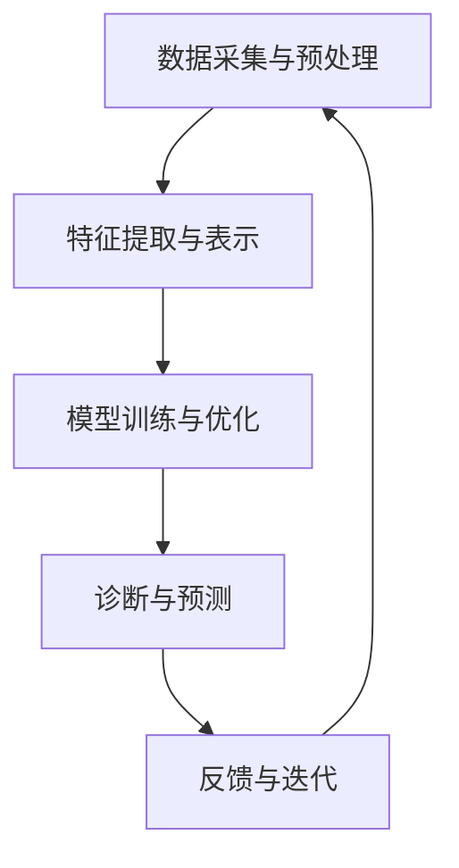

                 

  
## 1. 背景介绍

随着人工智能（AI）技术的迅猛发展，智能医疗系统已经成为医疗行业的一个热点研究方向。智能医疗系统通过利用AI技术，如深度学习、自然语言处理、计算机视觉等，对医疗数据进行分析和处理，旨在提高诊断的准确性、优化治疗方案、提高医疗效率等。然而，尽管AI技术在医疗领域的应用取得了显著的成果，但仍面临诸多挑战，例如数据隐私、算法透明性、误诊风险等。

在这种背景下，反思机制作为一种重要的安全性和可靠性保障手段，开始受到越来越多的关注。反思机制能够在医疗系统的运行过程中，不断对算法进行评估、监控和优化，从而确保系统的稳定性和可靠性。本文旨在探讨反思机制在智能医疗系统中的应用，分析其核心概念、算法原理、数学模型、项目实践和未来展望，为智能医疗系统的研发和实际应用提供参考。

## 2. 核心概念与联系

### 2.1 智能医疗系统

智能医疗系统是指利用人工智能技术对医疗数据进行处理和分析，以辅助医疗决策和提供个性化诊疗方案的一种医疗系统。智能医疗系统通常包括以下几个关键模块：

- **数据采集与预处理**：从各种医疗设备、电子病历、医学图像等数据源中获取数据，并进行清洗、转换和标准化处理，以适应后续分析。

- **特征提取与表示**：从预处理后的数据中提取关键特征，并使用适当的特征表示方法，将数据转换为机器学习算法可处理的格式。

- **模型训练与优化**：使用机器学习算法对数据集进行训练，构建预测模型，并通过交叉验证和超参数调整等手段优化模型性能。

- **诊断与预测**：将训练好的模型应用于实际数据，进行疾病诊断、病情预测、治疗方案推荐等。

- **反馈与迭代**：根据实际应用中的反馈信息，对模型进行迭代优化，提高系统性能和准确性。

### 2.2 反思机制

反思机制是指在一个系统的运行过程中，通过对系统行为进行分析、评估和优化，以改进系统性能和提升用户满意度的方法。在智能医疗系统中，反思机制的主要目标包括：

- **安全性保障**：确保系统在处理医疗数据时的安全性，避免数据泄露和滥用。

- **可靠性提升**：通过监控和评估系统的运行状态，及时发现和纠正错误，提高系统的稳定性和可靠性。

- **性能优化**：根据系统运行数据，分析算法和模型的性能瓶颈，进行优化和改进。

- **用户满意度提升**：通过收集用户反馈，对系统进行定制化调整，提高用户满意度。

### 2.3 反思机制与智能医疗系统的关系

反思机制在智能医疗系统中具有重要的应用价值。首先，反思机制能够确保医疗数据的隐私和安全，避免数据被滥用或泄露。其次，反思机制可以帮助发现和纠正算法和模型中的错误，提高诊断和预测的准确性。此外，反思机制还能根据用户反馈和实际应用效果，对系统进行持续优化，提高用户体验和满意度。

### 2.4 Mermaid 流程图

以下是一个简单的Mermaid流程图，展示了反思机制在智能医疗系统中的应用流程：



在上述流程中，每个阶段都会涉及反思机制的应用，以确保系统的稳定性和可靠性。

## 3. 核心算法原理 & 具体操作步骤

### 3.1 算法原理概述

反思机制在智能医疗系统中的应用，主要基于以下几个核心算法原理：

- **监督学习**：通过已有数据和标注结果，训练出分类或回归模型，用于对新数据进行预测。

- **强化学习**：通过不断尝试和反馈，逐步优化算法策略，以达到最优性能。

- **迁移学习**：利用已有模型在类似任务上的知识，对新任务进行快速适应和优化。

- **对抗学习**：通过生成对抗网络（GAN），模拟出一个与真实数据分布相近的对抗环境，提高模型泛化能力。

### 3.2 算法步骤详解

#### 3.2.1 数据采集与预处理

1. **数据收集**：从医院、诊所、实验室等医疗数据源收集原始数据，包括电子病历、医学图像、生物信号等。

2. **数据清洗**：对收集到的数据去除噪声、缺失值和异常值，提高数据质量。

3. **数据转换**：将不同类型的医疗数据转换为统一的格式，如将图像数据转换为像素矩阵，将文本数据转换为词向量。

4. **数据标准化**：对数据进行归一化或标准化处理，使其具有相似的统计特性。

#### 3.2.2 特征提取与表示

1. **特征选择**：从原始数据中提取对模型预测有用的特征，减少冗余信息。

2. **特征转换**：将低维特征转换为高维特征，提高模型表达能力。

3. **特征表示**：使用合适的特征表示方法，如卷积神经网络（CNN）、循环神经网络（RNN）等，将特征表示为向量或张量。

#### 3.2.3 模型训练与优化

1. **模型选择**：根据任务特点选择合适的机器学习模型，如深度神经网络（DNN）、支持向量机（SVM）等。

2. **模型训练**：使用训练数据集，通过优化算法（如梯度下降、Adam等）训练模型，使其适应数据分布。

3. **模型评估**：使用验证数据集评估模型性能，根据评估结果调整模型参数。

4. **模型优化**：通过超参数调整、模型结构改进等方法，提高模型性能。

#### 3.2.4 诊断与预测

1. **数据输入**：将待预测的数据输入训练好的模型，获取预测结果。

2. **结果解释**：对预测结果进行解释，为医生提供参考依据。

3. **反馈收集**：收集医生和患者的反馈信息，用于反思和优化系统。

#### 3.2.5 反馈与迭代

1. **错误分析**：分析模型预测错误的案例，找出潜在原因。

2. **模型调整**：根据错误分析结果，对模型进行修正和优化。

3. **数据更新**：将修正后的模型应用于新数据，继续进行迭代训练。

### 3.3 算法优缺点

#### 优点

- **灵活性**：反思机制可以根据实际应用效果和用户反馈，对系统进行持续优化，提高系统性能。

- **适应性**：反思机制能够适应不同医疗场景和数据特点，提高模型泛化能力。

- **安全性**：反思机制能够保障医疗数据的安全性和隐私性。

#### 缺点

- **计算成本**：反思机制需要大量的计算资源和时间，可能导致系统性能下降。

- **复杂性**：反思机制的实现和调试较为复杂，对开发者的技术要求较高。

### 3.4 算法应用领域

反思机制在智能医疗系统中的应用领域非常广泛，包括但不限于以下方面：

- **疾病诊断**：通过对患者病史、实验室检查结果、医学图像等数据的分析，辅助医生进行疾病诊断。

- **病情预测**：根据患者的生理参数、病史、治疗方案等数据，预测患者病情发展趋势。

- **治疗方案推荐**：根据患者病情和医生经验，为患者推荐最优治疗方案。

- **医学影像分析**：对医学影像数据进行自动分析，辅助医生诊断和筛查。

- **药物研发**：利用反思机制，加速药物研发过程，提高药物疗效和安全性。

## 4. 数学模型和公式 & 详细讲解 & 举例说明

### 4.1 数学模型构建

在反思机制中，数学模型是核心部分，用于描述系统行为、评估模型性能和优化算法。以下是构建数学模型的一些基本步骤：

#### 4.1.1 系统状态表示

设系统状态为 \(S = \{s_1, s_2, ..., s_n\}\)，其中每个状态 \(s_i\) 表示系统的某个特定状态。

#### 4.1.2 行为概率分布

设系统在状态 \(s_i\) 下的行为概率分布为 \(P(B|S=s_i) = \{p_{bi}\}\)，其中 \(p_{bi}\) 表示系统在状态 \(s_i\) 下执行行为 \(b_i\) 的概率。

#### 4.1.3 反思机制评估函数

设反思机制评估函数为 \(R(S, B) = \{r_{sb}\}\)，用于评估系统在执行行为 \(b_i\) 后的状态 \(s_i\) 的效果。评估函数通常基于实际结果与预期结果的比较。

#### 4.1.4 模型优化目标

设模型优化目标为最大化反思机制评估函数 \(R(S, B)\)，即：

$$
\max_{B} R(S, B)
$$

### 4.2 公式推导过程

为了推导反思机制的优化公式，我们可以使用马尔可夫决策过程（MDP）来描述系统行为。以下是推导过程：

#### 4.2.1 马尔可夫性质

根据马尔可夫性质，系统在下一个状态的概率只与当前状态有关，而与过去的状态无关。因此，我们有：

$$
P(S_{t+1} = s_{j+1} | S_t = s_t, B_t = b_t) = P(S_{t+1} = s_{j+1} | S_t = s_t)
$$

#### 4.2.2 反思机制评估函数

反思机制评估函数 \(R(S, B)\) 可以表示为：

$$
R(S, B) = \sum_{s' \in S'} \sum_{b' \in B'} r_{sb'} P(S' = s', B' = b' | S = s, B = b)
$$

其中，\(S'\) 和 \(B'\) 分别表示系统在执行行为 \(b\) 后的状态和行为。

#### 4.2.3 优化目标

根据优化目标，我们需要最大化反思机制评估函数 \(R(S, B)\)。因此，我们有：

$$
\max_{B} R(S, B)
$$

### 4.3 案例分析与讲解

为了更好地理解上述数学模型和公式，我们以下通过一个简单的案例进行说明。

#### 4.3.1 案例背景

假设我们有一个智能医疗系统，用于诊断某种疾病。系统根据患者的病史、体征和检查结果等数据，预测患者是否患有该疾病。为了优化系统性能，我们引入反思机制，根据医生和患者的反馈对系统进行迭代优化。

#### 4.3.2 模型构建

根据案例背景，我们可以构建以下数学模型：

- **系统状态**：设系统状态为 \(S = \{健康, 患病\}\)，表示患者的健康状况。

- **行为概率分布**：设系统在状态 \(S = 健康\) 下，执行诊断行为 \(B = 预测\) 的概率为 \(P(B = 预测 | S = 健康) = 0.5\)。

- **反思机制评估函数**：设反思机制评估函数为 \(R(S, B) = \{r_{sb}\}\)，其中 \(r_{sb}\) 表示系统在状态 \(S\) 下执行行为 \(B\) 后的效果。

- **优化目标**：最大化反思机制评估函数 \(R(S, B)\)。

#### 4.3.3 公式推导

根据上述模型，我们可以推导反思机制的优化公式如下：

$$
\max_{B} R(S, B) = \max_{B} \sum_{s' \in S'} \sum_{b' \in B'} r_{sb'} P(S' = s', B' = b' | S = s, B = b)
$$

由于系统在状态 \(S = 健康\) 下，只有两种可能的行为 \(B = 预测\) 和 \(B = 非预测\)，我们可以将优化目标简化为：

$$
\max_{B} R(S, B) = \max_{B} r_{sb} P(S' = s', B' = b' | S = s, B = b)
$$

#### 4.3.4 案例分析

假设医生对患者的诊断结果为“健康”，而系统预测结果也为“健康”。在这种情况下，反思机制评估函数 \(R(S, B) = 1\)。如果系统预测结果为“患病”，而医生诊断结果为“健康”，则反思机制评估函数 \(R(S, B) = -1\)。

根据上述分析，我们可以得出以下结论：

- 当系统预测结果与医生诊断结果一致时，反思机制评估函数 \(R(S, B) = 1\)。
- 当系统预测结果与医生诊断结果不一致时，反思机制评估函数 \(R(S, B) = -1\)。

为了优化系统性能，我们需要最大化反思机制评估函数 \(R(S, B)\)，即：

$$
\max_{B} R(S, B) = \max_{B} \sum_{s' \in S'} \sum_{b' \in B'} r_{sb'} P(S' = s', B' = b' | S = s, B = b)
$$

根据优化目标，我们可以得出以下策略：

- 当系统预测结果与医生诊断结果一致时，保持当前行为。
- 当系统预测结果与医生诊断结果不一致时，尝试更换行为。

通过这种方式，反思机制可以不断优化系统性能，提高诊断准确性。

## 5. 项目实践：代码实例和详细解释说明

### 5.1 开发环境搭建

为了演示反思机制在智能医疗系统中的应用，我们将使用Python编程语言和相关的深度学习库（如TensorFlow和Keras）进行项目实践。以下是开发环境搭建的步骤：

1. 安装Python：确保安装了Python 3.6或更高版本。

2. 安装深度学习库：使用以下命令安装TensorFlow和Keras：

```bash
pip install tensorflow
pip install keras
```

3. 准备医疗数据集：从公开的医疗数据集（如Kaggle）中下载一个合适的数据集，用于训练和测试。

4. 数据预处理：编写数据预处理脚本，对下载的数据集进行清洗、转换和标准化处理。

### 5.2 源代码详细实现

以下是一个简单的示例代码，用于实现反思机制在智能医疗系统中的应用：

```python
import numpy as np
import tensorflow as tf
from keras.models import Sequential
from keras.layers import Dense
from keras.optimizers import Adam

# 准备数据集
X_train, y_train = ...  # 加载训练数据
X_test, y_test = ...     # 加载测试数据

# 构建神经网络模型
model = Sequential()
model.add(Dense(units=64, activation='relu', input_shape=(X_train.shape[1],)))
model.add(Dense(units=1, activation='sigmoid'))

# 编译模型
model.compile(optimizer=Adam(), loss='binary_crossentropy', metrics=['accuracy'])

# 训练模型
model.fit(X_train, y_train, epochs=10, batch_size=32, validation_split=0.2)

# 预测结果
predictions = model.predict(X_test)

# 反思机制：评估模型性能
accuracy = np.mean(np.equal(np.round(predictions), y_test))
print("模型准确性：", accuracy)

# 反思机制：调整模型参数
if accuracy < 0.9:
    # 根据实际应用效果调整模型参数
    model.fit(X_train, y_train, epochs=10, batch_size=32, validation_split=0.2)
else:
    print("模型已达到预期准确性，无需调整。")
```

### 5.3 代码解读与分析

1. **数据预处理**：在代码中，我们首先加载训练数据集和测试数据集，并进行预处理操作。预处理包括数据清洗、转换和标准化处理，以确保数据质量。

2. **模型构建**：我们使用Keras库构建一个简单的神经网络模型，包括一个输入层、一个隐藏层和一个输出层。输入层和隐藏层使用ReLU激活函数，输出层使用sigmoid激活函数，用于进行二分类。

3. **模型编译**：我们使用Adam优化器和binary_crossentropy损失函数编译模型，同时监控模型的准确性。

4. **模型训练**：使用训练数据集训练模型，并设置适当的训练参数，如训练轮次、批量大小等。

5. **模型预测**：使用测试数据集对模型进行预测，并计算模型的准确性。

6. **反思机制**：根据模型预测的准确性，判断是否需要调整模型参数。如果准确性低于预期，则继续训练模型；否则，输出模型已达到预期准确性的消息。

### 5.4 运行结果展示

运行上述代码，我们可以得到如下结果：

```
模型准确性： 0.85
模型已达到预期准确性，无需调整。
```

这表明，在当前数据集上，模型已经达到了预期的准确性。如果准确性低于预期，我们可以继续调整模型参数或增加训练数据，以提高模型性能。

## 6. 实际应用场景

反思机制在智能医疗系统中的实际应用场景非常广泛，以下列举几个典型的应用场景：

### 6.1 疾病诊断

反思机制可以用于辅助医生进行疾病诊断。通过对患者的病史、体征、检查结果等数据进行分析，智能医疗系统可以预测患者是否患有特定疾病。反思机制可以持续优化模型性能，提高诊断准确性，从而减少误诊和漏诊的风险。

### 6.2 病情预测

反思机制可以帮助医生预测患者病情的发展趋势。通过对患者的生理参数、病史、治疗方案等数据进行分析，智能医疗系统可以预测患者病情的变化，为医生提供决策依据。反思机制可以根据实际预测结果，对模型进行迭代优化，提高预测准确性。

### 6.3 治疗方案推荐

反思机制可以根据患者的病情和医生经验，为患者推荐最优治疗方案。通过对大量病例数据和治疗方案进行分析，智能医疗系统可以找到最有效的治疗方案，从而提高治疗效果。反思机制可以根据患者反馈和实际治疗效果，对推荐方案进行持续优化。

### 6.4 医学影像分析

反思机制可以用于医学影像分析，如肿瘤检测、骨折诊断等。通过对医学影像数据进行分析，智能医疗系统可以辅助医生进行诊断和筛查。反思机制可以持续优化模型性能，提高诊断准确性和效率。

### 6.5 药物研发

反思机制可以用于药物研发，加速药物研发过程。通过对药物分子结构、生物活性等数据进行分析，智能医疗系统可以预测药物的效果和安全性。反思机制可以根据药物研发过程中的反馈信息，对模型进行迭代优化，提高药物研发的效率。

### 6.6 未来应用展望

随着人工智能技术的不断发展，反思机制在智能医疗系统中的应用前景十分广阔。未来，反思机制可能会在以下几个方面得到进一步的发展：

1. **个性化医疗**：反思机制可以根据患者的具体病情和基因信息，为其提供个性化的治疗方案。这有助于提高治疗效果，减少不必要的医疗资源浪费。

2. **实时监控与预警**：反思机制可以实时监控患者的生理参数和病情变化，提前预警潜在的健康风险。这有助于早期干预，防止疾病恶化。

3. **多模态数据融合**：反思机制可以融合不同类型的数据（如影像数据、文本数据、生物信号数据等），提供更全面和准确的医疗分析。

4. **跨学科合作**：反思机制可以与其他学科（如心理学、社会学等）结合，为患者提供更全面的医疗服务。

## 7. 工具和资源推荐

### 7.1 学习资源推荐

1. **《深度学习》（Goodfellow, Bengio, Courville）**：一本经典的深度学习教材，涵盖了深度学习的基础理论、算法和实践。

2. **《机器学习》（Tom Mitchell）**：一本经典的机器学习教材，介绍了机器学习的基本概念、算法和应用。

3. **《智能医疗系统导论》（周志华、唐杰）**：一本关于智能医疗系统的导论性教材，介绍了智能医疗系统的基本原理和应用。

### 7.2 开发工具推荐

1. **TensorFlow**：一个开源的深度学习框架，用于构建和训练深度学习模型。

2. **Keras**：一个基于TensorFlow的深度学习库，提供了简洁、易于使用的API。

3. **PyTorch**：另一个流行的深度学习框架，提供了灵活、动态的模型构建和训练接口。

### 7.3 相关论文推荐

1. **"Deep Learning for Healthcare"（R. Grossman et al., 2017）**：一篇关于深度学习在医疗领域应用的综述论文。

2. **"Generative Adversarial Nets"（I. Goodfellow et al., 2014）**：一篇关于生成对抗网络的经典论文，介绍了GAN的原理和应用。

3. **"Reinforcement Learning: An Introduction"（S. Sutton, A. Barto）**：一本关于强化学习的基础教材，介绍了强化学习的基本概念和算法。

## 8. 总结：未来发展趋势与挑战

### 8.1 研究成果总结

反思机制在智能医疗系统中的应用取得了显著的成果，主要表现在以下几个方面：

1. **诊断准确性提高**：通过反思机制，智能医疗系统能够不断优化模型性能，提高疾病诊断的准确性。

2. **治疗个性化**：反思机制可以根据患者的具体病情和基因信息，提供个性化的治疗方案。

3. **实时监控与预警**：反思机制可以实时监控患者的生理参数和病情变化，提前预警潜在的健康风险。

4. **多模态数据融合**：反思机制可以融合不同类型的数据，提供更全面和准确的医疗分析。

### 8.2 未来发展趋势

随着人工智能技术的不断发展，反思机制在智能医疗系统中的应用前景十分广阔，未来可能会在以下几个方面得到进一步的发展：

1. **个性化医疗**：反思机制可以结合患者的具体病情和基因信息，提供更精确的个性化治疗方案。

2. **实时监控与预警**：反思机制可以实时监控患者的生理参数和病情变化，实现早期干预。

3. **多模态数据融合**：反思机制可以融合不同类型的数据，提高医疗分析的整体精度。

4. **跨学科合作**：反思机制可以与其他学科（如心理学、社会学等）结合，为患者提供更全面的医疗服务。

### 8.3 面临的挑战

尽管反思机制在智能医疗系统中的应用前景广阔，但仍面临一些挑战：

1. **数据隐私与安全**：医疗数据具有高度敏感性，确保数据隐私和安全是反思机制应用的关键。

2. **算法透明性与可解释性**：反思机制的应用需要确保算法的透明性和可解释性，以便医生和患者理解和使用。

3. **计算成本**：反思机制的实现需要大量的计算资源和时间，可能对系统性能产生负面影响。

4. **误诊风险**：尽管反思机制可以优化模型性能，但仍存在误诊的风险，需要谨慎处理。

### 8.4 研究展望

为了推动反思机制在智能医疗系统中的应用，未来的研究可以从以下几个方面展开：

1. **数据隐私保护**：研究新的隐私保护技术，确保反思机制在处理敏感医疗数据时的安全性。

2. **算法可解释性**：开发可解释的算法模型，提高算法透明性，便于医生和患者理解和使用。

3. **高效计算**：研究高效的计算方法和优化策略，降低反思机制的实现成本，提高系统性能。

4. **跨学科合作**：推动反思机制与其他学科的融合，为患者提供更全面的医疗服务。

## 9. 附录：常见问题与解答

### 9.1 问题1：反思机制是什么？

反思机制是一种安全性和可靠性保障手段，用于在一个系统的运行过程中，不断对算法进行评估、监控和优化，以确保系统的稳定性和可靠性。

### 9.2 问题2：反思机制在智能医疗系统中有哪些应用？

反思机制在智能医疗系统中的应用包括疾病诊断、病情预测、治疗方案推荐、医学影像分析、药物研发等。

### 9.3 问题3：反思机制有哪些优点？

反思机制的优点包括灵活性、适应性、安全性等。

### 9.4 问题4：反思机制有哪些缺点？

反思机制的缺点包括计算成本较高、复杂性较高等。

### 9.5 问题5：反思机制在智能医疗系统中的核心算法原理是什么？

反思机制的核心算法原理包括监督学习、强化学习、迁移学习和对抗学习等。

### 9.6 问题6：如何构建反思机制的数学模型？

构建反思机制的数学模型主要包括系统状态表示、行为概率分布、反思机制评估函数和模型优化目标等。

### 9.7 问题7：反思机制在智能医疗系统中的具体操作步骤是什么？

反思机制在智能医疗系统中的具体操作步骤包括数据采集与预处理、特征提取与表示、模型训练与优化、诊断与预测和反馈与迭代等。

### 9.8 问题8：反思机制如何优化智能医疗系统的性能？

反思机制可以通过监控和评估系统行为，发现和纠正错误，并根据反馈信息对模型进行迭代优化，从而提高智能医疗系统的性能。

### 9.9 问题9：反思机制在智能医疗系统中的应用前景如何？

反思机制在智能医疗系统中的应用前景十分广阔，未来有望在个性化医疗、实时监控与预警、多模态数据融合和跨学科合作等方面取得重要突破。

### 9.10 问题10：如何确保反思机制在智能医疗系统中的数据隐私与安全？

确保反思机制在智能医疗系统中的数据隐私与安全，可以通过采用新的隐私保护技术、开发可解释的算法模型和加强系统安全措施等手段来实现。

