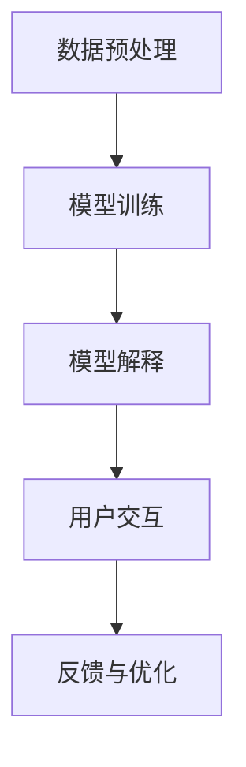

                 

关键词：可解释人工智能，原理，代码实例，深度学习，模型可解释性，神经网络，数据处理，算法实现，应用领域

> 摘要：本文将深入探讨可解释人工智能（XAI）的基本原理，重点介绍其实现方法、代码实例，以及在实际应用中的重要性。通过对可解释人工智能的深入理解，我们能够更好地理解深度学习模型的决策过程，提升模型的可信度和可接受度，为人工智能在各个领域的应用提供坚实的基础。

## 1. 背景介绍

随着深度学习技术的迅猛发展，人工智能（AI）已经渗透到我们生活的方方面面。然而，深度学习模型由于其复杂的结构和大量的参数，往往被称为“黑箱”模型，其决策过程难以理解和解释。这引发了一系列问题，包括模型的不透明性、缺乏可信度和用户对AI决策的抵触情绪。为了解决这些问题，可解释人工智能（Explainable AI，简称XAI）应运而生。

可解释人工智能旨在提高深度学习模型的可理解性和可解释性，使人类能够直观地理解模型的决策过程。这不仅有助于提高模型的信任度，还能够帮助研究人员和工程师优化模型，解决实际应用中的问题。

## 2. 核心概念与联系

### 2.1 定义

可解释人工智能（XAI）是指通过提供解释和可视化工具，使人工智能模型的决策过程变得透明和可理解的技术。它旨在填补传统机器学习模型中的透明度缺口，使人类用户能够理解和信任AI系统的决策。

### 2.2 架构

一个完整的可解释人工智能系统通常包括以下关键组件：

- **数据预处理**：确保输入数据的质量和一致性，为后续模型训练和解释提供基础。
- **模型训练**：使用深度学习算法训练模型，以实现预测或分类任务。
- **模型解释**：通过可视化工具和解释算法，展示模型的决策过程和关键特征。
- **用户交互**：提供一个直观的界面，使用户能够与模型进行交互，理解模型的工作原理。

### 2.3 Mermaid 流程图

下面是一个简化的可解释人工智能流程图：



## 3. 核心算法原理 & 具体操作步骤

### 3.1 算法原理概述

可解释人工智能的核心在于如何从复杂的深度学习模型中提取可解释的信息。常见的算法包括：

- **敏感性分析**：评估模型对输入数据的微小变化的反应。
- **特征重要性分析**：确定模型决策过程中最重要的特征。
- **可视化技术**：通过图像、热图等形式，直观地展示模型的决策过程。
- **本地解释方法**：针对单个样本，提供详细的解释和决策路径。

### 3.2 算法步骤详解

#### 3.2.1 数据预处理

数据预处理是确保模型性能和解释能力的关键步骤。主要步骤包括：

- **数据清洗**：去除噪音和异常值。
- **数据归一化**：将数据缩放到相同的范围。
- **特征选择**：选择对模型决策最重要的特征。

#### 3.2.2 模型训练

使用深度学习算法训练模型，以实现特定的预测或分类任务。常见的深度学习模型包括：

- **神经网络**：通过多层感知器（MLP）实现。
- **卷积神经网络（CNN）**：适用于图像处理任务。
- **循环神经网络（RNN）**：适用于序列数据处理。

#### 3.2.3 模型解释

模型解释的关键在于如何从复杂的模型中提取可解释的信息。以下是几种常见的解释方法：

- **全局解释**：分析模型在整体数据集上的决策过程。
- **局部解释**：针对单个样本，提供详细的解释。
- **基于规则的解释**：将模型决策转化为可理解的自然语言规则。

### 3.3 算法优缺点

**优点**：

- 提高模型的可理解性和可解释性。
- 增强用户对AI系统的信任度。
- 有助于优化模型，提高性能。

**缺点**：

- 解释模型的计算成本较高。
- 可能会降低模型的准确性。
- 解释结果的可靠性可能受限制。

### 3.4 算法应用领域

可解释人工智能在多个领域具有重要应用：

- **金融领域**：风险评估、信用评分、反欺诈等。
- **医疗领域**：疾病诊断、治疗方案推荐、药物研发等。
- **自动驾驶**：理解自动驾驶系统的决策过程，提高安全性。
- **安防领域**：视频监控、人脸识别、行为分析等。

## 4. 数学模型和公式 & 详细讲解 & 举例说明

### 4.1 数学模型构建

在可解释人工智能中，常用的数学模型包括：

- **线性回归**：用于预测连续值。
- **逻辑回归**：用于分类任务。
- **神经网络**：通过多层感知器实现复杂函数的映射。

### 4.2 公式推导过程

以线性回归为例，其公式推导如下：

- **目标函数**：最小化预测值与实际值之间的误差平方和。
- **梯度下降**：通过迭代计算模型参数，以最小化目标函数。

### 4.3 案例分析与讲解

以一个简单的房价预测为例，使用线性回归模型进行分析：

- **数据集**：包含房屋面积和价格的数据。
- **特征选择**：选择房屋面积作为唯一特征。
- **模型训练**：使用梯度下降算法训练线性回归模型。
- **模型解释**：通过可视化工具展示模型决策过程。

## 5. 项目实践：代码实例和详细解释说明

### 5.1 开发环境搭建

- **Python**：作为主要编程语言。
- **NumPy**：用于数据处理。
- **Pandas**：用于数据预处理。
- **Scikit-learn**：用于模型训练和评估。

### 5.2 源代码详细实现

以下是一个简单的线性回归代码示例：

```python
import numpy as np
import pandas as pd
from sklearn.linear_model import LinearRegression

# 读取数据
data = pd.read_csv('house_price.csv')
X = data[['area']]
y = data['price']

# 模型训练
model = LinearRegression()
model.fit(X, y)

# 模型解释
print(model.coef_)
print(model.intercept_)
```

### 5.3 代码解读与分析

- **数据读取**：使用Pandas读取数据。
- **特征选择**：选择房屋面积作为唯一特征。
- **模型训练**：使用Scikit-learn的线性回归模型进行训练。
- **模型解释**：输出模型参数，包括斜率和截距。

### 5.4 运行结果展示

运行代码后，将输出模型的斜率和截距。这些参数可以用于预测房屋价格。

## 6. 实际应用场景

可解释人工智能在实际应用中具有广泛的应用前景：

- **医疗领域**：帮助医生理解AI系统的诊断结果，提高医疗决策的准确性。
- **金融领域**：增强金融模型的透明度，提高风险管理能力。
- **自动驾驶**：确保自动驾驶系统的安全性和可靠性。
- **安防领域**：分析监控视频，提高公共安全水平。

## 7. 工具和资源推荐

### 7.1 学习资源推荐

- **书籍**：《深度学习》（Goodfellow et al.）。
- **在线课程**：Coursera、edX等平台上的深度学习和可解释人工智能课程。

### 7.2 开发工具推荐

- **Python库**：Scikit-learn、TensorFlow、PyTorch等。
- **可视化工具**：matplotlib、seaborn等。

### 7.3 相关论文推荐

- **“Understanding Deep Learning: From Simple Concepts to Complex Systems”**。
- **“Explainable AI: Concept, Technologies, and Applications”**。

## 8. 总结：未来发展趋势与挑战

### 8.1 研究成果总结

可解释人工智能在提高模型透明度和可信度方面取得了显著成果，但在计算成本、模型准确性和解释结果的可靠性方面仍面临挑战。

### 8.2 未来发展趋势

- **算法优化**：提高解释算法的效率和准确性。
- **跨领域应用**：拓展可解释人工智能在不同领域的应用。

### 8.3 面临的挑战

- **计算资源**：解释算法的高计算成本。
- **模型准确性**：解释模型可能降低模型准确性。
- **解释结果的可靠性**：解释结果的可靠性和一致性。

### 8.4 研究展望

可解释人工智能将继续在人工智能领域发挥重要作用，为模型的透明性和可信度提供强有力的支持。未来研究将重点关注算法优化、跨领域应用和解释结果的可靠性。

## 9. 附录：常见问题与解答

### 9.1 什么是可解释人工智能？

可解释人工智能（XAI）是指通过提供解释和可视化工具，使人工智能模型的决策过程变得透明和可理解的技术。

### 9.2 可解释人工智能有哪些应用领域？

可解释人工智能在医疗、金融、自动驾驶和安防等领域具有重要应用。

### 9.3 如何提高可解释人工智能的效率？

可以通过优化算法、使用高效的计算资源和引入先进的可视化技术来提高可解释人工智能的效率。

----------------------------------------------------------------

本文由禅与计算机程序设计艺术 / Zen and the Art of Computer Programming 撰写，旨在深入探讨可解释人工智能的基本原理、实现方法、代码实例及其在实际应用中的重要性。希望通过本文，读者能够更好地理解可解释人工智能的核心概念，掌握其实际应用技巧，为人工智能技术的发展贡献力量。

