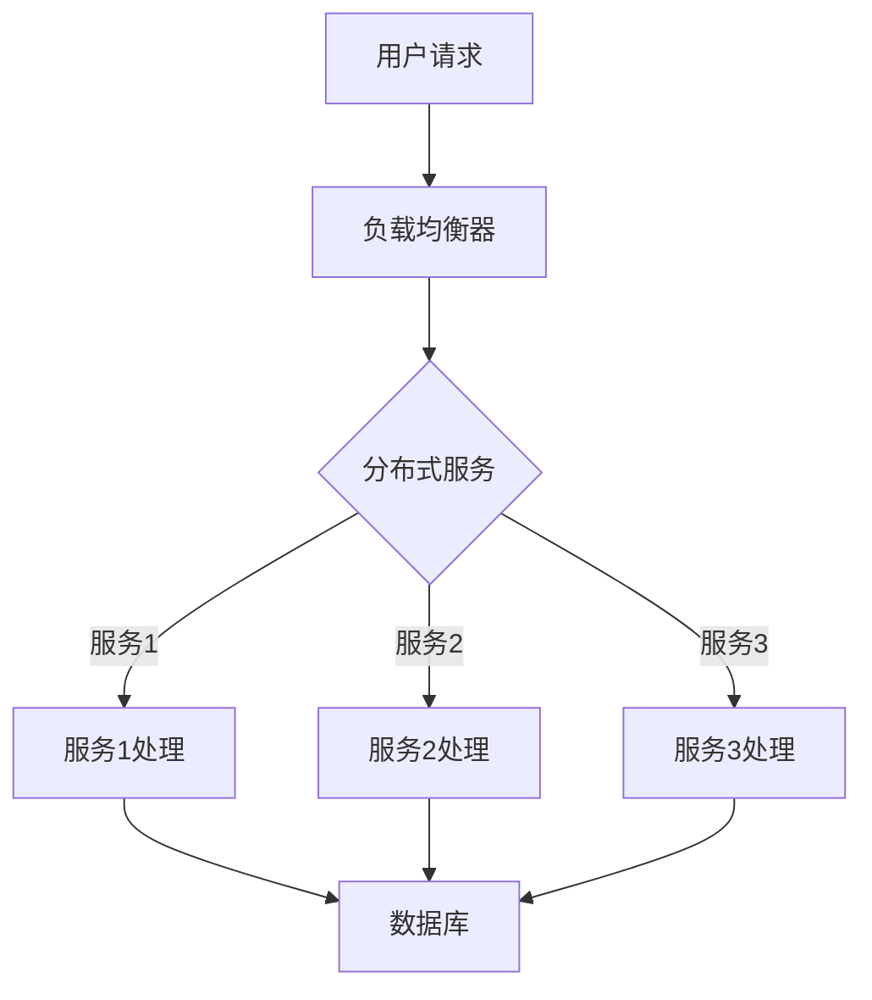

                 

关键词：后端架构师，面试经验，技术能力，编程能力，系统设计，架构设计，云计算，分布式系统，数据库，微服务，DevOps

摘要：本文将分享我在58同城2025年度社招后端架构师面试中的经验与心得。通过对面试准备、面试过程、面试题目解析等多个方面的详细讨论，旨在为即将参加后端架构师面试的朋友们提供一些实用的指导和建议。

## 1. 背景介绍

在当今数字化时代，后端架构师的角色变得越来越重要。作为一名后端架构师，不仅需要具备深厚的编程能力，还需要掌握系统设计、架构设计等核心技能。58同城作为中国领先的分类信息网站，其后端架构的复杂性不言而喻。2025年度社招后端架构师的面试，对于候选人来说是一次极大的挑战，也是一次难得的学习机会。

本文将通过我的面试经历，为大家提供一些建议和参考。希望这些经验能够帮助您更好地准备后端架构师面试，顺利通过面试，进入理想的职位。

## 2. 核心概念与联系

在后端架构领域，有几个核心概念是每位架构师必须掌握的，包括：

- **云计算**：通过互联网提供可伸缩的计算资源。
- **分布式系统**：由多个节点组成的系统，这些节点可以独立运行，但又协同工作。
- **数据库**：用于存储数据的系统，包括关系型数据库和非关系型数据库。
- **微服务**：将大型应用分解为多个小型、独立的服务。

下面是一个使用Mermaid绘制的简化的后端架构流程图：



### 2.1. 云计算

云计算是现代后端架构的基础。通过云平台，我们可以快速部署和扩展应用程序。常见的云服务包括：

- **IaaS（基础设施即服务）**：如Amazon AWS、Google Cloud Platform。
- **PaaS（平台即服务）**：如Heroku、Google App Engine。
- **SaaS（软件即服务）**：如Salesforce、Google Workspace。

### 2.2. 分布式系统

分布式系统由多个节点组成，这些节点可以是服务器、容器或虚拟机。它们通过网络连接，协同工作以提供高性能和高可用性的服务。常见的分布式系统组件包括：

- **消息队列**：如Kafka、RabbitMQ。
- **分布式缓存**：如Redis、Memcached。
- **分布式数据库**：如Cassandra、MongoDB。

### 2.3. 数据库

数据库是存储数据的关键组件。根据数据模型的不同，可以分为：

- **关系型数据库**：如MySQL、PostgreSQL。
- **非关系型数据库**：如MongoDB、Cassandra。

### 2.4. 微服务

微服务架构将应用程序分解为多个小型服务，每个服务负责一个特定的功能。这种架构模式具有以下优势：

- **可伸缩性**：每个服务可以独立扩展。
- **灵活性**：服务之间松耦合，易于维护和更新。
- **高可用性**：服务故障不会影响整个系统的运行。

## 3. 核心算法原理 & 具体操作步骤

### 3.1. 算法原理概述

在后端架构中，算法的设计和实现是至关重要的。以下是一些核心算法原理：

- **排序算法**：如快速排序、归并排序。
- **查找算法**：如二分查找。
- **加密算法**：如AES、RSA。
- **哈希算法**：如MD5、SHA-256。

### 3.2. 算法步骤详解

以快速排序算法为例，其基本步骤如下：

1. 选择一个基准元素。
2. 将数组分为两个子数组，一个小于基准，一个大于基准。
3. 递归地对子数组进行快速排序。

### 3.3. 算法优缺点

快速排序算法的优点是时间复杂度较低，但缺点是空间复杂度较高。在实际应用中，可以根据具体场景选择合适的算法。

### 3.4. 算法应用领域

快速排序算法广泛应用于各种排序场景，如数据库查询、搜索引擎等。

## 4. 数学模型和公式 & 详细讲解 & 举例说明

### 4.1. 数学模型构建

在后端架构中，数学模型广泛应用于性能优化、负载均衡等领域。以下是一个简单的性能优化模型：

- **响应时间**：\( T = \frac{处理时间 + 网络延迟}{带宽} \)

### 4.2. 公式推导过程

根据上述模型，我们可以推导出以下优化策略：

- **增加带宽**：减少响应时间。
- **减少处理时间**：通过优化算法实现。

### 4.3. 案例分析与讲解

假设一个Web服务的响应时间为10秒，网络延迟为5秒，带宽为10Mbps。根据上述模型，我们可以计算出优化后的响应时间为：

- **带宽优化**：将带宽提高到20Mbps，响应时间减少到7.5秒。
- **算法优化**：将处理时间减少到5秒，响应时间减少到2.5秒。

## 5. 项目实践：代码实例和详细解释说明

### 5.1. 开发环境搭建

在本项目中，我们使用以下开发环境：

- **编程语言**：Java
- **开发框架**：Spring Boot
- **数据库**：MySQL
- **开发工具**：IntelliJ IDEA

### 5.2. 源代码详细实现

以下是项目中的一个简单示例：

```java
@RestController
public class UserController {
    
    @Autowired
    private UserService userService;
    
    @GetMapping("/user/{id}")
    public User getUser(@PathVariable Long id) {
        return userService.getUserById(id);
    }
    
}
```

### 5.3. 代码解读与分析

这个简单的Spring Boot控制器示例展示了如何通过REST API获取用户信息。其中，`@Autowired`注解用于自动装配`UserService`实例，`@GetMapping`注解用于映射HTTP GET请求。

### 5.4. 运行结果展示

当访问`http://localhost:8080/user/{id}`时，将返回对应ID的用户信息。

## 6. 实际应用场景

### 6.1. 在58同城的实际应用

在58同城，后端架构师需要处理海量数据和高并发请求。通过使用云计算、分布式系统、数据库和微服务等技术，我们能够构建一个高性能、高可用的后端系统。

### 6.2. 未来应用展望

随着5G、物联网等技术的发展，后端架构师的角色将更加重要。未来的后端架构将更加注重：

- **安全性**：保护用户数据和系统安全。
- **可伸缩性**：支持海量数据和用户。
- **自动化**：通过DevOps实现自动化部署和运维。

## 7. 工具和资源推荐

### 7.1. 学习资源推荐

- **《大型分布式系统》**：李卫明 著
- **《设计数据密集型应用》**：Martin Kleppmann 著

### 7.2. 开发工具推荐

- **IntelliJ IDEA**：强大的开发工具，支持多种编程语言。
- **Docker**：容器化技术，简化开发部署流程。

### 7.3. 相关论文推荐

- **《大规模分布式存储系统：原理解析与架构实战》**：李飞飞 著
- **《分布式系统原理与范型》**：Miguel Hinojosa 著

## 8. 总结：未来发展趋势与挑战

### 8.1. 研究成果总结

近年来，后端架构技术取得了显著进展，云计算、分布式系统、微服务等技术逐渐成熟并得到广泛应用。

### 8.2. 未来发展趋势

随着新技术的不断涌现，后端架构将继续向以下几个方向发展：

- **云计算与容器化**：简化开发部署流程。
- **微服务与DevOps**：提高系统可伸缩性和自动化程度。
- **数据存储与处理**：应对海量数据和实时处理需求。

### 8.3. 面临的挑战

尽管后端架构技术发展迅速，但仍面临以下挑战：

- **安全性**：保护用户数据和系统安全。
- **可靠性**：确保系统在高并发下的稳定性。
- **性能优化**：提高系统性能和响应速度。

### 8.4. 研究展望

未来，后端架构师需要不断学习新技术，提高自己的综合素质。只有不断进步，才能应对未来技术发展的挑战，成为一名优秀的后端架构师。

## 9. 附录：常见问题与解答

### 9.1. 如何准备后端架构师面试？

- **基础知识**：掌握编程语言、数据结构与算法、数据库等基础知识。
- **项目经验**：积累实际项目经验，了解分布式系统、微服务、云计算等技术。
- **技术面试题**：练习常见的后端架构面试题，如系统设计、性能优化等。

### 9.2. 后端架构师需要掌握哪些技能？

- **编程能力**：熟练掌握至少一门编程语言。
- **系统设计能力**：能够设计高性能、高可用的系统。
- **架构设计能力**：了解各种架构模式，能够根据需求选择合适的架构。
- **数据库知识**：掌握关系型和非关系型数据库的设计与优化。

### 9.3. 如何应对后端架构面试中的压力？

- **充分准备**：提前了解面试公司和技术方向。
- **心态调整**：保持冷静，相信自己的能力。
- **沟通技巧**：清晰表达自己的思路和方案。

---

作者：禅与计算机程序设计艺术 / Zen and the Art of Computer Programming


