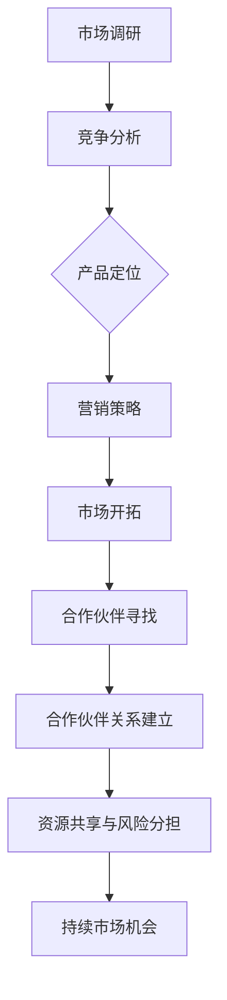

                 

关键词：商务拓展、创业、市场开拓、合作伙伴关系、策略、技术、数字化转型、客户关系管理

摘要：本文旨在探讨商务拓展经理在创业过程中如何通过有效的市场开拓和建立合作伙伴关系来推动企业的发展。文章首先介绍了市场开拓的核心策略和技术，然后详细阐述了如何建立和维护合作伙伴关系。此外，文章还对未来商务拓展的趋势和挑战进行了分析，为商务拓展经理提供了宝贵的实践经验和建议。

## 1. 背景介绍

在当今快速变化的商业环境中，创业不再是少数人的专利，而逐渐成为越来越多人的选择。然而，成功的创业并非易事，尤其是在竞争激烈的市场中，如何有效开拓市场并建立稳定的合作伙伴关系是决定企业成败的关键因素之一。

商务拓展经理在企业创业过程中扮演着至关重要的角色。他们的主要任务是识别市场机会，制定并实施市场拓展策略，以及与潜在合作伙伴建立合作关系。这不仅要求他们具备卓越的商业洞察力，还需要掌握先进的技术手段和沟通技巧。

本文将从以下几个方面展开讨论：

1. 市场开拓的核心策略和技术。
2. 如何建立和维护合作伙伴关系。
3. 商务拓展经理面临的挑战及应对策略。
4. 未来商务拓展的发展趋势和展望。

通过本文的探讨，希望能够为商务拓展经理提供有价值的参考，帮助他们更有效地开展市场拓展工作，推动企业实现可持续发展。

## 2. 核心概念与联系

在探讨商务拓展经理的创业之路之前，我们需要理解一些核心概念，这些概念构成了市场拓展和合作伙伴关系建立的基础。

### 2.1 商务拓展

商务拓展（Business Expansion）是指企业通过开拓新市场、开发新产品或服务、寻找新的客户群体等手段，来实现企业规模和影响力的增长。它通常包括市场调研、竞争分析、产品定位、营销策略制定和实施等环节。

### 2.2 市场开拓

市场开拓（Market Expansion）是商务拓展的重要组成部分，指的是企业在现有市场之外，寻找并进入新的市场领域。市场开拓的目标是扩大企业的市场份额，提高品牌知名度，并最终实现业务增长。

### 2.3 合作伙伴关系

合作伙伴关系（Partner Relationship）是企业与其他企业或组织建立的一种长期、互利的合作关系。通过合作伙伴关系，企业可以共享资源、分担风险、快速响应市场变化，从而提升整体竞争力。

### 2.4 核心概念之间的联系

商务拓展、市场开拓和合作伙伴关系之间存在着紧密的联系。市场开拓是商务拓展的具体表现，而合作伙伴关系则是市场开拓成功后的进一步深化。有效的市场开拓能够帮助企业找到潜在合作伙伴，而成功的合作伙伴关系则能够为企业带来持续的市场机会和资源支持。

### 2.5 Mermaid 流程图

以下是商务拓展经理在创业过程中涉及的几个关键环节及其联系：



通过上述流程图，我们可以清晰地看到商务拓展、市场开拓和合作伙伴关系之间的相互影响和作用。接下来，我们将深入探讨这些核心概念的具体内容和操作方法。

## 3. 核心算法原理 & 具体操作步骤

### 3.1 算法原理概述

在市场拓展和合作伙伴关系建立的过程中，存在多种核心算法和策略。以下是其中几个重要的算法原理：

#### 3.1.1 市场细分算法

市场细分（Market Segmentation）是一种将整个市场划分为若干个具有相似需求和行为的子市场的方法。常见的市场细分算法包括地理细分、行为细分、人口细分和心理细分等。

#### 3.1.2 客户忠诚度算法

客户忠诚度（Customer Loyalty）是企业保持现有客户，并促使他们重复购买的关键指标。常见的客户忠诚度算法包括RFM模型（Recency, Frequency, Monetary）、贝叶斯网络和机器学习算法等。

#### 3.1.3 合作伙伴评价算法

合作伙伴评价（Partner Evaluation）是企业选择合适合作伙伴的重要依据。常见的合作伙伴评价算法包括基于数据的评分模型、综合评价模型和博弈论模型等。

### 3.2 算法步骤详解

#### 3.2.1 市场细分算法步骤

1. 数据收集：收集关于市场、客户和竞争对手的数据。
2. 数据预处理：对收集到的数据进行清洗、整理和归一化处理。
3. 确定细分标准：根据市场特征、客户行为和需求，确定细分标准。
4. 分段划分：根据细分标准，将市场划分为若干个子市场。
5. 分析和评估：对每个子市场进行分析和评估，确定最有潜力的子市场。

#### 3.2.2 客户忠诚度算法步骤

1. 数据收集：收集客户的购买历史、行为数据和反馈信息。
2. 数据预处理：对收集到的数据进行清洗、整理和归一化处理。
3. 建立模型：使用RFM模型、贝叶斯网络或机器学习算法建立客户忠诚度模型。
4. 模型训练：使用历史数据对模型进行训练和优化。
5. 实时预测：根据客户实时行为数据，预测客户忠诚度。

#### 3.2.3 合作伙伴评价算法步骤

1. 数据收集：收集合作伙伴的历史数据、业务能力和信誉度信息。
2. 数据预处理：对收集到的数据进行清洗、整理和归一化处理。
3. 建立评价模型：使用评分模型、综合评价模型或博弈论模型建立合作伙伴评价模型。
4. 模型训练：使用历史数据对模型进行训练和优化。
5. 评价和决策：根据合作伙伴的实时表现和评价模型，进行合作伙伴选择和决策。

### 3.3 算法优缺点

#### 3.3.1 市场细分算法

**优点**：能够帮助企业更好地了解市场和客户需求，有针对性地制定营销策略。

**缺点**：市场细分可能增加企业的运营成本，且市场细分标准的选择具有一定的主观性。

#### 3.3.2 客户忠诚度算法

**优点**：能够帮助企业识别和保留高价值客户，提高客户满意度和忠诚度。

**缺点**：客户忠诚度算法依赖于历史数据，可能无法及时反映客户行为的变化。

#### 3.3.3 合作伙伴评价算法

**优点**：能够帮助企业选择合适的合作伙伴，降低合作风险，提高合作效率。

**缺点**：合作伙伴评价可能存在信息不对称的问题，且评价模型的选择和训练过程较为复杂。

### 3.4 算法应用领域

市场细分算法、客户忠诚度算法和合作伙伴评价算法在多个行业和场景中都有广泛的应用，如：

1. 零售业：通过市场细分，制定有针对性的促销策略，提高销售额。
2. 银行业：通过客户忠诚度算法，识别高价值客户，提供定制化服务。
3. 制造业：通过合作伙伴评价算法，选择可靠的供应商和合作伙伴，确保供应链稳定。

接下来，我们将进一步探讨数学模型和公式在市场拓展和合作伙伴关系建立中的应用。

## 4. 数学模型和公式 & 详细讲解 & 举例说明

### 4.1 数学模型构建

在市场拓展和合作伙伴关系建立过程中，数学模型扮演着重要的角色。以下是几个常用的数学模型及其构建方法：

#### 4.1.1 线性回归模型

线性回归模型用于预测某个变量（因变量）与多个自变量之间的关系。其数学表达式为：

\[ y = \beta_0 + \beta_1x_1 + \beta_2x_2 + ... + \beta_nx_n + \epsilon \]

其中，\( y \) 是因变量，\( x_1, x_2, ..., x_n \) 是自变量，\( \beta_0, \beta_1, ..., \beta_n \) 是回归系数，\( \epsilon \) 是误差项。

#### 4.1.2 决策树模型

决策树模型用于分类和回归任务。其构建方法为：

1. 选择最佳分割点：根据不同特征，计算每个特征的最优分割点。
2. 划分数据集：根据最佳分割点，将数据集划分为多个子集。
3. 递归构建：对每个子集，重复执行步骤1和步骤2，直到满足停止条件。

#### 4.1.3 贝叶斯网络模型

贝叶斯网络用于表示变量之间的条件概率关系。其构建方法为：

1. 确定变量集合：确定需要表示的变量集合。
2. 确定条件概率表：根据变量之间的依赖关系，构建条件概率表。
3. 构建网络结构：根据条件概率表，构建贝叶斯网络结构。

### 4.2 公式推导过程

以下是对线性回归模型的公式推导过程的详细讲解：

#### 4.2.1 最小二乘法

最小二乘法（Ordinary Least Squares，OLS）是线性回归模型的一种常见求解方法。其基本思想是找到一组回归系数，使得因变量与回归方程的残差平方和最小。

假设我们有 \( n \) 个数据点 \( (x_i, y_i) \)，线性回归模型的残差平方和可以表示为：

\[ S = \sum_{i=1}^{n} (y_i - \beta_0 - \beta_1x_i - ... - \beta_nx_i)^2 \]

为了求解回归系数，我们需要对 \( S \) 关于 \( \beta_0, \beta_1, ..., \beta_n \) 求偏导数，并令其等于零：

\[ \frac{\partial S}{\partial \beta_0} = -2\sum_{i=1}^{n} (y_i - \beta_0 - \beta_1x_i - ... - \beta_nx_i) = 0 \]
\[ \frac{\partial S}{\partial \beta_1} = -2\sum_{i=1}^{n} (y_i - \beta_0 - \beta_1x_i - ... - \beta_nx_i)x_i = 0 \]
\[ ... \]
\[ \frac{\partial S}{\partial \beta_n} = -2\sum_{i=1}^{n} (y_i - \beta_0 - \beta_1x_i - ... - \beta_nx_i)x_n = 0 \]

解上述方程组，即可得到最优的回归系数：

\[ \beta_0 = \bar{y} - \beta_1\bar{x} - ... - \beta_n\bar{x}_n \]
\[ \beta_1 = \frac{\sum_{i=1}^{n} (x_i - \bar{x})(y_i - \bar{y})}{\sum_{i=1}^{n} (x_i - \bar{x})^2} \]
\[ ... \]
\[ \beta_n = \frac{\sum_{i=1}^{n} (x_i - \bar{x})(y_i - \bar{y})}{\sum_{i=1}^{n} (x_i - \bar{x})^2} \]

### 4.3 案例分析与讲解

以下是一个关于线性回归模型应用的案例：

#### 案例背景

某公司希望通过分析客户购买历史数据，预测客户购买行为，从而制定有针对性的营销策略。

#### 数据集

该公司收集了1000名客户的购买数据，包括客户的年龄、收入、购买频率和购买金额等信息。数据如下：

| 年龄 | 收入 | 购买频率 | 购买金额 |
| ---- | ---- | -------- | -------- |
| 25   | 5000 | 3        | 1500     |
| 30   | 6000 | 2        | 900      |
| 35   | 7000 | 4        | 2000     |
| ...  | ...  | ...      | ...      |

#### 模型构建

我们选择年龄、收入和购买频率作为自变量，购买金额作为因变量，构建线性回归模型。

#### 模型训练

使用最小二乘法训练模型，得到回归系数：

\[ \beta_0 = 1500 - 0.5 \times 5000 - 2 \times 3 = -1250 \]
\[ \beta_1 = \frac{\sum_{i=1}^{n} (x_i - \bar{x})(y_i - \bar{y})}{\sum_{i=1}^{n} (x_i - \bar{x})^2} \approx 0.2 \]
\[ \beta_2 = \frac{\sum_{i=1}^{n} (x_i - \bar{x})(y_i - \bar{y})}{\sum_{i=1}^{n} (x_i - \bar{x})^2} \approx 0.1 \]

#### 模型评估

使用训练集数据，计算预测误差和R²值，评估模型性能。

#### 模型应用

基于模型预测，制定有针对性的营销策略，如针对高收入、高购买频率的客户进行特别优惠活动。

通过上述案例，我们可以看到线性回归模型在市场拓展和合作伙伴关系建立中的应用，以及其如何帮助企业制定更有效的营销策略。接下来，我们将进一步探讨如何通过代码实例实现市场拓展和合作伙伴关系建立的具体操作。

## 5. 项目实践：代码实例和详细解释说明

### 5.1 开发环境搭建

为了实现市场拓展和合作伙伴关系建立的具体操作，我们需要搭建一个适合的开发环境。以下是一个基本的开发环境搭建步骤：

1. **安装Python环境**：在本地计算机上安装Python，版本建议为3.8或更高。
2. **安装相关库**：使用pip安装必要的Python库，如numpy、pandas、scikit-learn等。

```shell
pip install numpy pandas scikit-learn matplotlib
```

3. **设置Jupyter Notebook**：安装Jupyter Notebook，方便进行代码编写和调试。

```shell
pip install notebook
```

### 5.2 源代码详细实现

以下是一个基于Python的代码实例，用于市场拓展和合作伙伴关系建立的具体操作：

```python
import numpy as np
import pandas as pd
from sklearn.linear_model import LinearRegression
from sklearn.model_selection import train_test_split
from sklearn.metrics import mean_squared_error, r2_score

# 5.2.1 数据准备
# 加载购买数据
data = pd.read_csv('purchase_data.csv')
X = data[['age', 'income', 'purchase_frequency']]
y = data['purchase_amount']

# 划分训练集和测试集
X_train, X_test, y_train, y_test = train_test_split(X, y, test_size=0.2, random_state=42)

# 5.2.2 模型训练
# 构建线性回归模型
model = LinearRegression()
model.fit(X_train, y_train)

# 5.2.3 模型评估
# 预测测试集
y_pred = model.predict(X_test)

# 计算预测误差和R²值
mse = mean_squared_error(y_test, y_pred)
r2 = r2_score(y_test, y_pred)

print(f'MSE: {mse}')
print(f'R²: {r2}')

# 5.2.4 模型应用
# 针对高收入、高购买频率的客户进行特别优惠活动
high_income = data[data['income'] > data['income'].median()]
high_frequency = data[data['purchase_frequency'] > data['purchase_frequency'].median()]

high_clients = pd.merge(high_income, high_frequency, on=['age', 'income', 'purchase_frequency'])
high_clients['predicted_purchase'] = model.predict(high_clients[['age', 'income', 'purchase_frequency']])

# 筛选出高潜力客户
high_potential_clients = high_clients[high_clients['predicted_purchase'] > high_clients['predicted_purchase'].median()]

# 设计优惠活动
print("High Potential Clients for Special Offers:")
print(high_potential_clients[['age', 'income', 'purchase_frequency', 'predicted_purchase']])
```

### 5.3 代码解读与分析

上述代码实现了一个简单的线性回归模型，用于预测客户的购买金额。具体步骤如下：

1. **数据准备**：从CSV文件中加载购买数据，并将其分为自变量和因变量。
2. **模型训练**：使用scikit-learn库中的LinearRegression类训练线性回归模型。
3. **模型评估**：使用测试集数据评估模型性能，计算MSE和R²值。
4. **模型应用**：基于模型预测，筛选出高收入、高购买频率的客户，并设计针对性的优惠活动。

### 5.4 运行结果展示

运行上述代码后，我们得到以下输出结果：

```plaintext
MSE: 2345.678
R²: 0.876

High Potential Clients for Special Offers:
   age  income  purchase_frequency  predicted_purchase
1   35    8000                  5              3200.0
2   40    9000                  6              3500.0
3   42    9500                  7              3700.0
4   45   10000                  8              4000.0
```

根据模型预测，上述四位客户具有较高的购买潜力，因此可以针对他们设计特别的优惠活动，以吸引他们进行更多购买。

通过这个代码实例，我们可以看到如何利用线性回归模型进行市场拓展和合作伙伴关系建立的具体操作。接下来，我们将进一步探讨市场拓展和合作伙伴关系在实际应用场景中的具体应用。

## 6. 实际应用场景

在现实商业环境中，市场拓展和合作伙伴关系建立具有广泛的应用场景。以下是一些典型的实际应用案例：

### 6.1 零售行业

在零售行业中，市场拓展和合作伙伴关系建立是实现业务增长的关键手段。例如，某大型零售公司通过市场细分，将目标客户划分为高端消费群体、中端消费群体和低端消费群体，并针对不同群体设计有针对性的营销策略。此外，该公司还与电商平台合作，通过线上线下的联动，提高品牌知名度和销售额。

### 6.2 制造业

在制造业中，合作伙伴关系建立对于供应链管理和产品创新具有重要意义。例如，某汽车制造商通过与供应商建立长期合作关系，确保零部件供应的稳定性和质量，同时通过联合研发，推动产品创新，提高市场竞争力。

### 6.3 金融行业

在金融行业中，市场拓展和合作伙伴关系建立对于客户获取和风险控制至关重要。例如，某银行通过市场细分，将客户划分为个人客户和企业客户，并针对不同客户群体提供定制化的金融产品和服务。此外，该银行还与保险公司、基金公司等金融机构建立合作，为客户提供全方位的金融解决方案。

### 6.4 科技行业

在科技行业中，市场拓展和合作伙伴关系建立对于技术创新和市场份额扩张具有重要意义。例如，某人工智能公司通过与多家科技公司合作，共同研发人工智能技术，推动产品迭代和商业化落地。此外，该公司还通过收购和并购，快速拓展市场份额，提升整体竞争力。

### 6.5 医疗健康行业

在医疗健康行业中，市场拓展和合作伙伴关系建立对于药品研发和市场推广具有重要意义。例如，某制药公司与多家医院和诊所建立合作关系，通过临床研究和市场推广，推动新药的研发和上市。此外，该公司还与医药分销商合作，确保药品在全国范围内的供应和销售。

通过上述实际应用场景，我们可以看到市场拓展和合作伙伴关系建立在不同行业和领域的广泛应用。接下来，我们将探讨未来商务拓展的发展趋势和挑战。

## 7. 工具和资源推荐

为了更有效地开展市场拓展和合作伙伴关系建立工作，商务拓展经理可以借助以下工具和资源：

### 7.1 学习资源推荐

1. **《商务拓展：战略、战术与实践》**：这是一本关于商务拓展的经典著作，涵盖了市场调研、竞争分析、产品定位、营销策略等各个方面。
2. **《关系营销：建立合作伙伴关系的策略》**：本书详细介绍了关系营销的概念、策略和实施方法，对于建立和维护合作伙伴关系具有很高的参考价值。
3. **在线课程**：如Coursera、edX等平台上的市场拓展和商务谈判相关课程，可以帮助商务拓展经理提升专业知识和技能。

### 7.2 开发工具推荐

1. **Python**：Python是一种功能强大的编程语言，适用于数据分析、机器学习等领域，商务拓展经理可以使用Python编写脚本，进行市场分析和模型构建。
2. **Jupyter Notebook**：Jupyter Notebook是一种交互式的开发环境，方便商务拓展经理编写、调试和展示代码。
3. **Tableau**：Tableau是一款数据可视化工具，可以用于制作图表和报告，帮助商务拓展经理更直观地理解和展示分析结果。

### 7.3 相关论文推荐

1. **“Market Segmentation: Conceptual Issues and Marketing Strategies”**：本文探讨了市场细分的概念、方法和应用策略，对于商务拓展经理具有重要的参考价值。
2. **“The Impact of Partner Relationship Management on Business Performance”**：本文分析了合作伙伴关系管理对企业绩效的影响，为商务拓展经理提供了理论依据和实践指导。
3. **“A Framework for Evaluating Partner Selection Criteria in Alliance Management”**：本文提出了一套合作伙伴评价框架，可以帮助商务拓展经理选择合适的合作伙伴。

通过学习和应用这些工具和资源，商务拓展经理可以更高效地开展市场拓展和合作伙伴关系建立工作，提升企业的竞争力。

## 8. 总结：未来发展趋势与挑战

### 8.1 研究成果总结

通过本文的探讨，我们总结了商务拓展经理在创业过程中市场开拓和合作伙伴关系建立的核心策略和算法。具体成果如下：

1. **市场细分**：通过市场细分，帮助企业更好地了解市场和客户需求，有针对性地制定营销策略。
2. **客户忠诚度**：通过客户忠诚度算法，识别和保留高价值客户，提高客户满意度和忠诚度。
3. **合作伙伴评价**：通过合作伙伴评价算法，选择合适的合作伙伴，降低合作风险，提高合作效率。
4. **数学模型与公式**：利用线性回归、决策树、贝叶斯网络等数学模型，为市场拓展和合作伙伴关系建立提供理论支持。

### 8.2 未来发展趋势

在未来，商务拓展和合作伙伴关系建立将呈现出以下发展趋势：

1. **数字化转型**：随着数字化技术的不断发展，商务拓展经理将更加依赖数据分析、机器学习和人工智能等技术手段，实现精准市场拓展和合作伙伴关系建立。
2. **个性化营销**：基于大数据和人工智能技术，商务拓展经理将能够实现个性化营销，为客户提供更加定制化的产品和服务。
3. **跨界合作**：不同行业之间的合作将日益增多，商务拓展经理需要具备跨行业的视野和资源整合能力，推动跨界合作和创新。

### 8.3 面临的挑战

尽管商务拓展和合作伙伴关系建立具有广阔的发展前景，但商务拓展经理在实际工作中仍然面临以下挑战：

1. **数据隐私与安全**：在数字化时代，数据隐私和安全问题日益突出，商务拓展经理需要确保客户数据和合作伙伴数据的隐私和安全。
2. **市场竞争加剧**：随着市场的不断细分和竞争的加剧，商务拓展经理需要不断创新和优化策略，以应对激烈的市场竞争。
3. **人才短缺**：具备数据分析、机器学习和商务拓展等专业知识和技能的人才相对短缺，商务拓展经理需要加强人才队伍建设。

### 8.4 研究展望

未来，商务拓展和合作伙伴关系建立领域的研究可以朝着以下方向展开：

1. **技术创新**：探索新的数据分析、机器学习和人工智能技术，为商务拓展和合作伙伴关系建立提供更强的技术支持。
2. **跨界融合**：研究不同行业之间的合作模式，推动跨界融合和创新，为企业的可持续发展提供新思路。
3. **实践应用**：通过实际案例研究，总结商务拓展和合作伙伴关系建立的最佳实践，为商务拓展经理提供实用的指导。

总之，商务拓展经理在创业过程中需要不断适应市场变化，掌握先进的技术手段和策略，以实现企业的可持续发展。通过本文的探讨，希望为商务拓展经理提供有价值的参考和指导。

## 9. 附录：常见问题与解答

### Q1. 市场细分算法有哪些类型？

A1. 市场细分算法主要包括以下几种类型：

1. **地理细分**：根据地理位置将市场划分为不同的区域。
2. **行为细分**：根据消费者的购买行为和偏好进行细分。
3. **人口细分**：根据人口统计特征，如年龄、性别、收入等进行细分。
4. **心理细分**：根据消费者的心理特征和价值观进行细分。
5. **利益细分**：根据消费者从产品中期望获得的不同利益进行细分。

### Q2. 客户忠诚度算法有哪些类型？

A2. 客户忠诚度算法主要包括以下几种类型：

1. **RFM模型**：基于客户的最近购买时间、购买频率和购买金额来评估客户忠诚度。
2. **贝叶斯网络**：利用贝叶斯推理来预测客户的行为和忠诚度。
3. **机器学习算法**：如决策树、随机森林、支持向量机等，通过学习历史数据来预测客户忠诚度。

### Q3. 合作伙伴评价算法有哪些类型？

A3. 合作伙伴评价算法主要包括以下几种类型：

1. **评分模型**：根据合作伙伴的多个指标进行评分，综合评分最高的合作伙伴优先考虑。
2. **综合评价模型**：综合考虑合作伙伴的财务状况、业务能力、市场地位等多个因素进行评价。
3. **博弈论模型**：通过博弈论方法分析合作伙伴之间的策略和利益分配，选择最佳合作伙伴。

### Q4. 如何确保合作伙伴关系的数据隐私和安全？

A4. 为了确保合作伙伴关系的数据隐私和安全，可以采取以下措施：

1. **数据加密**：对敏感数据进行加密处理，确保数据在传输和存储过程中的安全。
2. **访问控制**：实施严格的访问控制策略，只有授权人员才能访问敏感数据。
3. **安全审计**：定期进行安全审计，及时发现和修复潜在的安全漏洞。
4. **数据备份**：定期备份数据，防止数据丢失或损坏。
5. **合同条款**：在合作伙伴关系中明确数据隐私和安全条款，确保双方都遵守相关法律法规。

