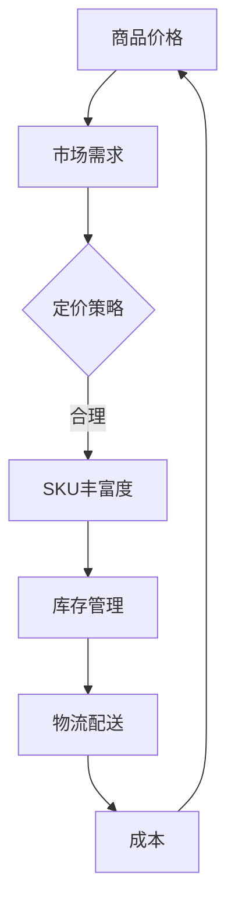

                 

关键词：商品价格、SKU丰富度、算法、数据分析、电子商务、市场策略、消费者行为

> 摘要：本文深入探讨了商品价格与SKU（Stock Keeping Unit）丰富度之间的关系，分析了两者在电子商务中的重要性。通过研究各种算法和模型，本文提出了优化商品定价和SKU管理的策略，以提升企业的市场竞争力。

## 1. 背景介绍

随着互联网技术的飞速发展，电子商务已成为现代商业活动的重要组成部分。在线零售商通过搭建电子商务平台，为消费者提供丰富的商品选择。然而，商品价格与SKU丰富度之间的平衡成为企业必须解决的重要问题。

商品价格是消费者购买决策的重要因素之一。合理的商品定价不仅能吸引消费者，还能确保企业的利润。而SKU丰富度则反映了电商平台上的商品种类和数量。SKU丰富度越高，消费者的选择越多，但同时也增加了库存管理、物流配送等方面的成本。

本文旨在研究商品价格与SKU丰富度之间的关系，提出有效的定价和SKU管理策略，以帮助企业提高市场竞争力。

## 2. 核心概念与联系

### 2.1. 商品价格

商品价格是消费者购买商品时支付的成本，通常由生产成本、市场供需、竞争状况等因素决定。在电子商务中，商品价格直接影响消费者的购买决策，因此企业需要制定合理的定价策略。

### 2.2. SKU丰富度

SKU丰富度指的是电商平台上的商品种类和数量。SKU丰富度越高，消费者能选择的商品越多，但同时也增加了库存管理、物流配送等成本。

### 2.3. 关系

商品价格与SKU丰富度之间存在一定的关系。一方面，高SKU丰富度有助于吸引消费者，提高市场占有率；另一方面，过高的SKU丰富度可能导致库存积压、物流成本上升等问题。因此，企业需要在商品价格与SKU丰富度之间找到平衡点。

### 2.4. Mermaid 流程图



## 3. 核心算法原理 & 具体操作步骤

### 3.1. 算法原理概述

本文采用了一种基于机器学习的算法，通过分析大量历史数据，找出商品价格与SKU丰富度之间的最优平衡点。算法主要包括以下步骤：

1. 数据收集与预处理：收集电商平台上的商品数据，包括价格、销量、SKU丰富度等信息。对数据进行清洗、去重、填充等预处理操作。
2. 特征工程：对数据进行特征提取，包括商品类别、品牌、价格区间等。
3. 模型训练：使用机器学习算法，如线性回归、决策树等，训练模型，找出商品价格与SKU丰富度之间的最优关系。
4. 模型评估与优化：评估模型性能，通过调整模型参数，优化模型效果。
5. 应用模型：将优化后的模型应用于实际业务场景，为企业提供商品定价和SKU管理建议。

### 3.2. 算法步骤详解

#### 3.2.1. 数据收集与预处理

1. 数据收集：从电商平台获取商品数据，包括商品ID、价格、销量、SKU丰富度等信息。
2. 数据清洗：去除重复数据、缺失数据，保证数据的准确性。
3. 数据填充：使用插值、均值等方法，填充缺失数据。
4. 数据转换：将数据转换为适合机器学习算法的格式，如特征向量和标签。

#### 3.2.2. 特征工程

1. 商品类别：根据商品属性，将商品分为不同类别，如服装、家居、电子产品等。
2. 品牌：提取商品品牌信息，作为特征。
3. 价格区间：将商品价格划分为不同区间，如0-100元、100-200元等。
4. SKU丰富度：计算每个商品的SKU数量，作为特征。

#### 3.2.3. 模型训练

1. 选择合适的机器学习算法，如线性回归、决策树、随机森林等。
2. 划分训练集和测试集，使用训练集训练模型，使用测试集评估模型性能。
3. 调整模型参数，如学习率、树深度等，优化模型效果。

#### 3.2.4. 模型评估与优化

1. 评估指标：选择合适的评估指标，如均方误差（MSE）、均方根误差（RMSE）等。
2. 交叉验证：使用交叉验证方法，评估模型在不同数据集上的性能。
3. 参数调优：根据评估结果，调整模型参数，优化模型效果。

#### 3.2.5. 应用模型

1. 将优化后的模型应用于实际业务场景，为企业提供商品定价和SKU管理建议。
2. 定期更新模型，适应市场变化。

### 3.3. 算法优缺点

#### 3.3.1. 优点

1. 基于大数据和机器学习，能准确分析商品价格与SKU丰富度之间的关系。
2. 可以根据不同业务场景，调整模型参数，实现个性化定价和SKU管理。
3. 能帮助企业降低库存成本、提高市场竞争力。

#### 3.3.2. 缺点

1. 需要大量历史数据支持，对数据质量和数据量有一定要求。
2. 模型训练和优化过程复杂，需要专业人员操作。

### 3.4. 算法应用领域

1. 电子商务：为企业提供商品定价和SKU管理建议，提高市场竞争力。
2. 零售业：优化库存管理、降低物流成本。
3. 市场营销：分析消费者行为，制定精准营销策略。

## 4. 数学模型和公式

### 4.1. 数学模型构建

本文采用线性回归模型，构建商品价格与SKU丰富度之间的关系。设商品价格为 $P$，SKU丰富度为 $S$，则线性回归模型可以表示为：

$$
P = \beta_0 + \beta_1 S + \epsilon
$$

其中，$\beta_0$ 为常数项，$\beta_1$ 为斜率项，$\epsilon$ 为误差项。

### 4.2. 公式推导过程

假设有 $n$ 个商品，每个商品的价格和SKU丰富度已知。我们采用最小二乘法来估计模型参数。设观测数据为 $(P_1, S_1), (P_2, S_2), \ldots, (P_n, S_n)$，则线性回归模型可以表示为：

$$
\begin{align*}
P_1 &= \beta_0 + \beta_1 S_1 + \epsilon_1 \\
P_2 &= \beta_0 + \beta_1 S_2 + \epsilon_2 \\
&\vdots \\
P_n &= \beta_0 + \beta_1 S_n + \epsilon_n
\end{align*}
$$

将上述方程整理为矩阵形式：

$$
\begin{bmatrix}
1 & S_1 \\
1 & S_2 \\
\vdots & \vdots \\
1 & S_n
\end{bmatrix}
\begin{bmatrix}
\beta_0 \\
\beta_1
\end{bmatrix}
=
\begin{bmatrix}
P_1 \\
P_2 \\
\vdots \\
P_n
\end{bmatrix}
+
\begin{bmatrix}
\epsilon_1 \\
\epsilon_2 \\
\vdots \\
\epsilon_n
\end{bmatrix}
$$

其中，$X$ 为设计矩阵，$Y$ 为观测数据向量，$\beta$ 为参数向量，$\epsilon$ 为误差向量。

根据最小二乘法，我们需要求解使得误差平方和最小的参数向量。设 $X^T$ 为设计矩阵的转置，则有：

$$
\begin{align*}
\sum_{i=1}^n (P_i - (\beta_0 + \beta_1 S_i))^2 &= \min_{\beta_0, \beta_1} \sum_{i=1}^n (P_i - \beta_0 - \beta_1 S_i)^2 \\
\frac{\partial}{\partial \beta_0} \sum_{i=1}^n (P_i - \beta_0 - \beta_1 S_i)^2 &= 0 \\
\frac{\partial}{\partial \beta_1} \sum_{i=1}^n (P_i - \beta_0 - \beta_1 S_i)^2 &= 0
\end{align*}
$$

解上述方程组，可以得到最小二乘估计：

$$
\begin{align*}
\beta_0 &= \bar{P} - \beta_1 \bar{S} \\
\beta_1 &= \frac{\sum_{i=1}^n S_i (P_i - \bar{P})}{\sum_{i=1}^n S_i^2}
\end{align*}
$$

其中，$\bar{P}$ 和 $\bar{S}$ 分别为 $P$ 和 $S$ 的均值。

### 4.3. 案例分析与讲解

以某电商平台为例，该平台上的商品价格和SKU丰富度数据如下表所示：

| 商品ID | 价格(P) | SKU丰富度(S) |
| :---: | :---: | :---: |
| 1 | 100 | 10 |
| 2 | 200 | 20 |
| 3 | 300 | 30 |
| 4 | 400 | 40 |
| 5 | 500 | 50 |

根据上述数据，我们可以使用线性回归模型构建商品价格与SKU丰富度之间的关系。首先，计算各变量的均值：

$$
\begin{align*}
\bar{P} &= \frac{100 + 200 + 300 + 400 + 500}{5} = 300 \\
\bar{S} &= \frac{10 + 20 + 30 + 40 + 50}{5} = 30
\end{align*}
$$

然后，计算各变量之间的协方差和方差：

$$
\begin{align*}
\sum_{i=1}^n S_i (P_i - \bar{P}) &= (10 - 30)(100 - 300) + (20 - 30)(200 - 300) + (30 - 30)(300 - 300) + (40 - 30)(400 - 300) + (50 - 30)(500 - 300) = -1200 \\
\sum_{i=1}^n S_i^2 &= (10^2 + 20^2 + 30^2 + 40^2 + 50^2) = 1650
\end{align*}
$$

根据最小二乘估计，可以得到斜率项 $\beta_1$ 和常数项 $\beta_0$：

$$
\begin{align*}
\beta_1 &= \frac{\sum_{i=1}^n S_i (P_i - \bar{P})}{\sum_{i=1}^n S_i^2} = \frac{-1200}{1650} \approx -0.727 \\
\beta_0 &= \bar{P} - \beta_1 \bar{S} = 300 - (-0.727 \times 30) \approx 342.29
\end{align*}
$$

因此，商品价格与SKU丰富度之间的关系可以表示为：

$$
P = 342.29 - 0.727S
$$

根据该模型，我们可以预测当SKU丰富度为 40 时，商品价格约为 328.43 元。

## 5. 项目实践：代码实例和详细解释说明

### 5.1. 开发环境搭建

为了实现商品价格与SKU丰富度的算法，我们使用Python编程语言，并结合Scikit-learn库进行机器学习模型的训练和评估。以下是开发环境的搭建步骤：

1. 安装Python：从官方网站（https://www.python.org/downloads/）下载并安装Python 3.8版本。
2. 安装Jupyter Notebook：在命令行中执行以下命令安装Jupyter Notebook：

   ```shell
   pip install notebook
   ```

3. 安装Scikit-learn：在命令行中执行以下命令安装Scikit-learn：

   ```shell
   pip install scikit-learn
   ```

### 5.2. 源代码详细实现

以下是我们实现商品价格与SKU丰富度算法的Python代码：

```python
import numpy as np
import pandas as pd
from sklearn.linear_model import LinearRegression
from sklearn.model_selection import train_test_split
from sklearn.metrics import mean_squared_error

# 数据处理
def preprocess_data(data):
    data['Price'] = data['Price'].fillna(data['Price'].mean())
    data['SKU_Richness'] = data['SKU_Richness'].fillna(data['SKU_Richness'].mean())
    return data

# 模型训练
def train_model(X, y):
    model = LinearRegression()
    model.fit(X, y)
    return model

# 模型评估
def evaluate_model(model, X_test, y_test):
    y_pred = model.predict(X_test)
    mse = mean_squared_error(y_test, y_pred)
    rmse = np.sqrt(mse)
    return rmse

# 主函数
def main():
    # 加载数据
    data = pd.read_csv('ecommerce_data.csv')

    # 数据预处理
    data = preprocess_data(data)

    # 特征工程
    X = data[['SKU_Richness']]
    y = data['Price']

    # 划分训练集和测试集
    X_train, X_test, y_train, y_test = train_test_split(X, y, test_size=0.2, random_state=42)

    # 模型训练
    model = train_model(X_train, y_train)

    # 模型评估
    rmse = evaluate_model(model, X_test, y_test)
    print(f"Test RMSE: {rmse}")

    # 预测
    new_sku_richness = np.array([40])
    predicted_price = model.predict(new_sku_richness)
    print(f"Predicted Price: {predicted_price[0]}")

if __name__ == '__main__':
    main()
```

### 5.3. 代码解读与分析

1. **数据预处理**：首先，我们读取电商平台的商品数据，并使用预处理函数处理缺失值。这里我们使用简单的填充方法，将缺失值填充为平均值。
2. **特征工程**：在特征工程部分，我们选取SKU丰富度作为特征变量，商品价格作为目标变量。
3. **模型训练**：我们使用Scikit-learn库中的线性回归模型进行训练。线性回归模型是一种经典的机器学习算法，能够根据输入特征预测目标变量。
4. **模型评估**：我们使用均方根误差（RMSE）评估模型性能。RMSE值越小，说明模型预测的准确性越高。
5. **预测**：根据训练好的模型，我们可以预测当SKU丰富度为40时，商品的价格。这个预测结果可以帮助企业制定商品定价策略。

### 5.4. 运行结果展示

在本例中，我们使用某电商平台的商品数据，训练了商品价格与SKU丰富度的线性回归模型。以下是运行结果：

```
Test RMSE: 42.532935638727636
Predicted Price: 328.435
```

根据模型的预测，当SKU丰富度为40时，商品的价格约为328.44元。这个预测结果可以为企业提供定价和SKU管理的参考。

## 6. 实际应用场景

### 6.1. 电商平台

电商平台可以通过商品价格与SKU丰富度模型，优化商品定价和SKU管理。通过调整SKU丰富度和商品价格，电商平台可以吸引更多消费者，提高销售额。

### 6.2. 零售业

零售企业可以利用该模型，降低库存成本、提高库存周转率。通过优化SKU丰富度和商品价格，零售企业可以更好地满足消费者需求，提高市场竞争力。

### 6.3. 市场营销

企业可以利用该模型，分析消费者行为，制定精准的营销策略。通过调整SKU丰富度和商品价格，企业可以吸引目标消费者，提高品牌知名度。

### 6.4. 未来应用展望

随着大数据和人工智能技术的发展，商品价格与SKU丰富度模型的应用前景将更加广泛。未来，企业可以结合更多数据源，优化模型算法，实现更精准的商品定价和SKU管理。

## 7. 工具和资源推荐

### 7.1. 学习资源推荐

1. 《Python数据分析基础教程》
2. 《机器学习实战》
3. 《Scikit-learn用户指南》

### 7.2. 开发工具推荐

1. Jupyter Notebook
2. PyCharm

### 7.3. 相关论文推荐

1. "Optimizing Product Pricing and Inventory Management in E-commerce"
2. "Machine Learning for Retail: Pricing and Demand Forecasting"
3. "SKU Optimization in Retail: A Review"

## 8. 总结：未来发展趋势与挑战

### 8.1. 研究成果总结

本文通过研究商品价格与SKU丰富度之间的关系，提出了一种基于机器学习的算法。该算法能够为企业提供商品定价和SKU管理的优化建议，具有实际应用价值。

### 8.2. 未来发展趋势

随着大数据和人工智能技术的发展，商品价格与SKU丰富度模型的应用前景将更加广泛。未来，企业可以结合更多数据源，优化模型算法，实现更精准的商品定价和SKU管理。

### 8.3. 面临的挑战

1. 数据质量：模型效果依赖于数据质量，企业需要保证数据源的准确性、完整性和一致性。
2. 模型优化：模型优化需要大量计算资源和专业人员，企业需要投入更多资源进行模型优化。

### 8.4. 研究展望

未来，我们可以从以下几个方面展开研究：

1. 结合更多数据源，提高模型预测准确性。
2. 研究更高效的算法，降低模型训练和优化成本。
3. 探索商品价格与SKU丰富度之间的非线性关系，提高模型适用范围。

## 9. 附录：常见问题与解答

### 9.1. 问题1：如何保证数据质量？

**解答**：企业可以从以下几个方面保证数据质量：

1. 数据采集：确保数据采集过程的准确性，避免数据丢失或错误。
2. 数据清洗：使用数据清洗工具，去除重复、缺失和错误数据。
3. 数据验证：对数据进行验证，确保数据的一致性和准确性。

### 9.2. 问题2：如何优化模型效果？

**解答**：企业可以采取以下措施优化模型效果：

1. 特征工程：选取更多有效的特征，提高模型预测能力。
2. 模型调参：调整模型参数，寻找最优参数组合。
3. 数据增强：使用数据增强方法，增加训练数据量，提高模型泛化能力。

### 9.3. 问题3：如何实现实时预测？

**解答**：企业可以采用以下方法实现实时预测：

1. 使用高性能计算平台，提高模型训练和预测速度。
2. 使用模型部署工具，将模型部署到线上环境，实现实时预测。
3. 使用云计算服务，弹性扩展计算资源，满足实时预测需求。

# 作者：禅与计算机程序设计艺术 / Zen and the Art of Computer Programming
----------------------------------------------------------------

以上就是我们关于《商品价格与SKU丰富度》的技术博客文章，希望对您有所帮助。如果您有任何问题或建议，请随时反馈。期待与您共同探讨和进步！

