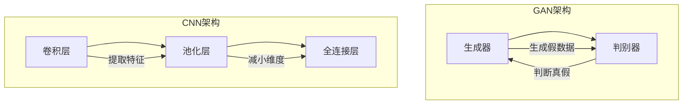

                 

关键词：图像生成、深度学习、生成对抗网络（GAN）、卷积神经网络（CNN）、风格迁移、人脸生成、文本到图像

## 摘要

本文旨在深入探讨图像生成的原理及其在深度学习中的应用。我们将从基础的图像生成概念出发，逐步介绍生成对抗网络（GAN）和卷积神经网络（CNN）等核心算法，并通过实际代码实例展示如何利用这些算法进行图像生成。此外，还将讨论图像生成在实际应用场景中的表现，并对未来的发展趋势和挑战进行展望。

## 1. 背景介绍

图像生成是计算机视觉和人工智能领域中的一个重要分支，它涉及使用算法从数据中生成新的图像。图像生成技术不仅对娱乐、艺术创作产生影响，还在医疗影像、自动驾驶、虚拟现实等领域具有重要的应用价值。随着深度学习技术的发展，特别是生成对抗网络（GAN）的出现，图像生成技术得到了极大的提升。

### 1.1 图像生成的发展历程

- **早期技术**：早期的图像生成方法主要包括基于规则的方法和基于样本的方法。例如，基于规则的方法通过编写程序来生成具有特定形状的图形，而基于样本的方法则通过样本数据进行插值和采样来生成图像。
- **浅层学习**：随着神经网络和机器学习技术的发展，浅层学习模型如自编码器（Autoencoder）开始应用于图像生成，它们通过学习输入数据的压缩和重建来生成图像。
- **深度学习**：深度学习模型，特别是卷积神经网络（CNN），在图像分类、目标检测等任务上取得了突破性进展。生成对抗网络（GAN）的出现进一步推动了图像生成的技术发展。

### 1.2 图像生成的重要性

- **艺术创作**：图像生成技术为艺术家和设计师提供了新的创作工具，他们可以通过算法生成独特的艺术作品。
- **娱乐产业**：电影特效、游戏角色设计和虚拟现实场景的构建都依赖于图像生成技术。
- **科学研究**：在医学影像、天文学等领域，图像生成技术可以用于生成模拟图像，帮助科学家进行数据分析和模型验证。
- **技术应用**：图像生成技术在自动驾驶、机器人视觉、安全监控等领域有广泛的应用。

## 2. 核心概念与联系

### 2.1 生成对抗网络（GAN）

生成对抗网络（GAN）是由Ian Goodfellow等人于2014年提出的一种深度学习模型，它由一个生成器（Generator）和一个判别器（Discriminator）组成。生成器的任务是生成看起来像真实数据的假数据，而判别器的任务是区分真实数据和生成器生成的假数据。


**GAN的工作原理**：

1. **初始化**：生成器和判别器都是随机初始化的。
2. **生成器生成假数据**：生成器从随机噪声中生成假数据，使其尽可能接近真实数据。
3. **判别器判断真假**：判别器接收真实数据和生成器生成的假数据，并尝试判断其真实性。
4. **优化过程**：通过对抗训练，生成器和判别器相互博弈，生成器不断优化其生成假数据的能力，而判别器不断优化其判断能力。
5. **收敛**：经过多次迭代，生成器的生成数据质量会不断提高，最终可以达到以假乱真的水平。

### 2.2 卷积神经网络（CNN）

卷积神经网络（CNN）是一种专门用于处理图像数据的神经网络。它通过卷积层提取图像的局部特征，并使用池化层减小数据的维度。


**CNN的核心组成部分**：

- **卷积层（Convolutional Layer）**：卷积层通过卷积操作提取图像的特征。
- **池化层（Pooling Layer）**：池化层用于减小数据的维度，提高模型的泛化能力。
- **全连接层（Fully Connected Layer）**：全连接层用于将提取到的特征映射到输出结果。

### 2.3 核心概念原理和架构的 Mermaid 流程图



## 3. 核心算法原理 & 具体操作步骤

### 3.1 算法原理概述

在这一部分，我们将深入探讨图像生成算法的基本原理，包括生成对抗网络（GAN）和卷积神经网络（CNN）的工作原理。

#### 3.1.1 生成对抗网络（GAN）

GAN是一种基于博弈论的深度学习模型，它由生成器和判别器两个神经网络组成。生成器的目标是通过学习真实数据的分布来生成假数据，而判别器的目标是通过区分真实数据和生成器生成的假数据来评估生成器的性能。两个网络在对抗训练的过程中不断优化，最终达到生成器生成数据与真实数据难以区分的水平。

#### 3.1.2 卷积神经网络（CNN）

CNN是一种专门用于图像处理的神经网络，其核心思想是通过卷积操作提取图像的局部特征，并通过池化层减小数据的维度。CNN通过多层次的卷积和池化操作，可以从原始图像中提取到更高层次的特征，这些特征可以用于图像分类、目标检测等任务。

### 3.2 算法步骤详解

在这一部分，我们将详细讲解生成对抗网络（GAN）和卷积神经网络（CNN）的具体操作步骤。

#### 3.2.1 生成对抗网络（GAN）

1. **初始化**：随机初始化生成器和判别器的参数。
2. **生成假数据**：生成器从随机噪声中生成假数据。
3. **判别器判断**：判别器接收真实数据和生成器生成的假数据，并尝试判断其真实性。
4. **计算损失函数**：计算生成器和判别器的损失函数，并使用梯度下降法更新网络参数。
5. **迭代优化**：重复上述步骤，直到生成器生成的数据质量达到预期。

#### 3.2.2 卷积神经网络（CNN）

1. **输入图像**：输入一张图像。
2. **卷积层操作**：通过卷积操作提取图像的局部特征。
3. **激活函数**：应用激活函数，如ReLU，增加网络的非线性能力。
4. **池化层操作**：通过池化操作减小数据的维度。
5. **全连接层操作**：将提取到的特征映射到输出结果。
6. **损失函数计算**：计算输出结果与真实标签之间的损失。
7. **参数更新**：使用梯度下降法更新网络参数。

### 3.3 算法优缺点

#### 3.3.1 生成对抗网络（GAN）

**优点**：

- **灵活性强**：GAN可以生成各种类型的图像，如真实图像、艺术图像、抽象图像等。
- **不易过拟合**：GAN通过对抗训练，可以有效避免过拟合问题。
- **高效性**：生成器只需学习数据的生成过程，判别器只需学习数据的分布，两者互为补充。

**缺点**：

- **训练不稳定**：GAN的训练过程容易陷入局部最小值，导致训练不稳定。
- **计算资源消耗大**：GAN的训练需要大量的计算资源和时间。

#### 3.3.2 卷积神经网络（CNN）

**优点**：

- **高效性**：CNN通过卷积和池化操作，可以有效减少数据的维度，提高计算效率。
- **可扩展性**：CNN可以很容易地扩展到多层次的卷积和池化操作，提高模型的性能。
- **适应性**：CNN可以通过训练学习到各种不同类型的图像特征，适用于多种图像处理任务。

**缺点**：

- **训练难度大**：CNN的训练需要大量的数据和时间，且容易出现过拟合问题。
- **参数量较大**：CNN的参数量通常较大，需要大量的计算资源。

### 3.4 算法应用领域

#### 3.4.1 生成对抗网络（GAN）

- **艺术创作**：GAN可以生成各种风格的艺术作品，如绘画、雕塑、音乐等。
- **医学影像**：GAN可以用于生成医学影像的模拟图像，帮助医生进行诊断和治疗。
- **图像修复**：GAN可以用于修复损坏的图像，恢复图像的原始状态。
- **虚拟现实**：GAN可以用于生成虚拟现实场景，提高用户的沉浸体验。

#### 3.4.2 卷积神经网络（CNN）

- **图像分类**：CNN可以用于图像分类任务，如物体识别、场景分类等。
- **目标检测**：CNN可以用于目标检测任务，如行人检测、车辆检测等。
- **图像增强**：CNN可以用于图像增强任务，如图像去噪、图像超分辨率等。
- **人脸识别**：CNN可以用于人脸识别任务，如人脸验证、人脸识别等。

## 4. 数学模型和公式 & 详细讲解 & 举例说明

### 4.1 数学模型构建

图像生成算法的核心是生成器和判别器的数学模型。下面我们将分别介绍这两个模型的构建过程。

#### 4.1.1 生成器模型

生成器模型的目的是从随机噪声中生成与真实数据相似的图像。生成器通常是一个多层的神经网络，其输入为随机噪声向量，输出为生成的图像。

设 \( G(z; \theta_G) \) 为生成器的模型，其中 \( z \) 为随机噪声向量，\( \theta_G \) 为生成器的参数。

生成器的目标函数可以表示为：

\[ L_G = -\log(D(G(z))) \]

其中，\( D(\cdot) \) 为判别器的输出，表示判别器对生成器生成的图像的判断概率。

#### 4.1.2 判别器模型

判别器模型的目的是判断输入图像是真实图像还是生成器生成的假图像。判别器也是一个多层的神经网络，其输入为图像，输出为一个概率值，表示输入图像为真实图像的概率。

设 \( D(x; \theta_D) \) 为判别器的模型，其中 \( x \) 为输入图像，\( \theta_D \) 为判别器的参数。

判别器的目标函数可以表示为：

\[ L_D = -[\log(D(x)) + \log(1 - D(G(z)))] \]

### 4.2 公式推导过程

GAN的训练过程可以看作是一个博弈过程，生成器和判别器在对抗训练中不断优化自己的性能。下面我们将推导GAN的训练过程。

#### 4.2.1 判别器的梯度

首先，我们计算判别器的梯度：

\[ \frac{\partial L_D}{\partial \theta_D} = \frac{\partial}{\partial \theta_D} [-\log(D(x)) - \log(1 - D(G(z)))] \]

\[ \frac{\partial L_D}{\partial \theta_D} = -\frac{D(x)}{D(x)} + \frac{1 - D(G(z))}{1 - D(G(z))} \]

\[ \frac{\partial L_D}{\partial \theta_D} = \frac{D(G(z)) - 1}{D(G(z))} \]

#### 4.2.2 生成器的梯度

接下来，我们计算生成器的梯度：

\[ \frac{\partial L_G}{\partial \theta_G} = \frac{\partial}{\partial \theta_G} [-\log(D(G(z)))] \]

\[ \frac{\partial L_G}{\partial \theta_G} = -\frac{1}{D(G(z))} \]

#### 4.2.3 共同梯度

为了同时优化生成器和判别器，我们可以使用共同梯度：

\[ \nabla_{\theta_G} L_G + \nabla_{\theta_D} L_D = 0 \]

\[ -\frac{1}{D(G(z))} + \frac{D(G(z)) - 1}{D(G(z))} = 0 \]

\[ D(G(z)) = 0.5 \]

### 4.3 案例分析与讲解

为了更好地理解GAN的数学模型，我们通过一个简单的案例进行分析。

假设生成器和判别器都是单层的神经网络，生成器从随机噪声中生成图像，判别器判断图像是真实图像还是生成器生成的图像。

设 \( G(z; \theta_G) \) 为生成器的模型，其中 \( z \) 为随机噪声向量，\( \theta_G \) 为生成器的参数。

设 \( D(x; \theta_D) \) 为判别器的模型，其中 \( x \) 为输入图像，\( \theta_D \) 为判别器的参数。

生成器的目标函数为：

\[ L_G = -\log(D(G(z))) \]

判别器的目标函数为：

\[ L_D = -[\log(D(x)) + \log(1 - D(G(z)))] \]

#### 4.3.1 初始状态

初始状态下，生成器和判别器的参数都是随机初始化的，生成器生成的图像质量较差，判别器无法准确判断图像的真假。

#### 4.3.2 生成器优化

在训练过程中，生成器不断从随机噪声中生成图像，并通过目标函数 \( L_G \) 对参数进行优化。生成器逐渐学习到如何生成更接近真实数据的图像。

#### 4.3.3 判别器优化

判别器通过目标函数 \( L_D \) 对参数进行优化，学习到如何更准确地区分真实图像和生成器生成的图像。随着判别器性能的提高，生成器生成的图像质量也会逐渐提升。

#### 4.3.4 收敛状态

在训练的后期，生成器和判别器逐渐达到平衡状态，生成器生成的图像质量已经接近真实数据，判别器无法准确判断图像的真假。

通过上述案例，我们可以看到GAN的训练过程是一个动态的博弈过程，生成器和判别器在相互对抗中不断优化自己的性能，最终达到生成器生成数据与真实数据难以区分的水平。

## 5. 项目实践：代码实例和详细解释说明

在本节中，我们将通过一个具体的代码实例来展示如何使用生成对抗网络（GAN）和卷积神经网络（CNN）进行图像生成。我们将使用Python和TensorFlow库来实现这个项目。

### 5.1 开发环境搭建

在开始编写代码之前，我们需要搭建一个合适的开发环境。以下是所需的环境：

- Python 3.6或更高版本
- TensorFlow 2.x
- NumPy
- Matplotlib

您可以通过以下命令来安装所需的库：

```bash
pip install tensorflow numpy matplotlib
```

### 5.2 源代码详细实现

以下是一个简单的图像生成项目，其中生成器使用生成对抗网络（GAN）来生成手写数字图像。

```python
import tensorflow as tf
from tensorflow.keras.layers import Dense, Conv2D, Flatten, LeakyReLU, BatchNormalization
from tensorflow.keras.models import Sequential
from tensorflow.keras.optimizers import Adam

# 生成器模型
def build_generator(z_dim):
    model = Sequential()
    model.add(Dense(7 * 7 * 256, input_dim=z_dim))
    model.add(LeakyReLU(alpha=0.01))
    model.add(BatchNormalization(momentum=0.8))
    model.add(Dense(7 * 7 * 128))
    model.add(LeakyReLU(alpha=0.01))
    model.add(BatchNormalization(momentum=0.8))
    model.add(Flatten())
    model.add(Dense(28 * 28 * 1, activation='tanh'))
    return model

# 判别器模型
def build_discriminator(img_shape):
    model = Sequential()
    model.add(Conv2D(32, kernel_size=(3, 3), input_shape=img_shape))
    model.add(LeakyReLU(alpha=0.01))
    model.add(BatchNormalization(momentum=0.8))
    model.add(Conv2D(64, kernel_size=(3, 3)))
    model.add(LeakyReLU(alpha=0.01))
    model.add(BatchNormalization(momentum=0.8))
    model.add(Flatten())
    model.add(Dense(1, activation='sigmoid'))
    return model

# GAN模型
def build_gan(generator, discriminator):
    model = Sequential()
    model.add(generator)
    model.add(discriminator)
    return model

# 设置超参数
z_dim = 100
img_shape = (28, 28, 1)

# 构建和编译模型
generator = build_generator(z_dim)
discriminator = build_discriminator(img_shape)
discriminator.compile(loss='binary_crossentropy', optimizer=Adam(0.0001), metrics=['accuracy'])

gan = build_gan(generator, discriminator)
gan.compile(loss='binary_crossentropy', optimizer=Adam(0.0001))

# 加载MNIST数据集
(x_train, _), (_, _) = tf.keras.datasets.mnist.load_data()
x_train = x_train / 127.5 - 1.0
x_train = np.expand_dims(x_train, axis=3)

# 训练模型
epochs = 10000
batch_size = 128

for epoch in range(epochs):
    idx = np.random.randint(0, x_train.shape[0], batch_size)
    real_images = x_train[idx]

    z = np.random.normal(0, 1, (batch_size, z_dim))
    fake_images = generator.predict(z)

    real_labels = np.ones((batch_size, 1))
    fake_labels = np.zeros((batch_size, 1))

    d_loss_real = discriminator.train_on_batch(real_images, real_labels)
    d_loss_fake = discriminator.train_on_batch(fake_images, fake_labels)
    d_loss = 0.5 * np.add(d_loss_real, d_loss_fake)

    z = np.random.normal(0, 1, (batch_size, z_dim))
    g_loss = gan.train_on_batch(z, real_labels)

    print(f"{epoch} [D loss: {d_loss[0]}, acc.: {100*d_loss[1]}] [G loss: {g_loss}]")

# 保存模型
generator.save('generator_model.h5')
discriminator.save('discriminator_model.h5')
```

### 5.3 代码解读与分析

在这个项目中，我们首先定义了生成器、判别器和GAN的模型架构。生成器使用多层全连接层和卷积层来生成手写数字图像，判别器使用卷积层来区分真实图像和生成图像。

在训练过程中，我们首先加载MNIST数据集，并将其缩放到合适的范围。然后，我们使用Adam优化器来训练模型，生成器和判别器在对抗训练的过程中不断优化自己的参数。

在训练循环中，我们每次从数据集中随机抽取一部分真实图像，并生成相同数量的随机噪声。生成器使用这些噪声生成假图像，然后判别器分别对这些真实图像和假图像进行分类。通过计算判别器的损失函数，我们可以评估其性能。在生成器的训练过程中，我们使用判别器的真实标签来训练生成器。

通过反复迭代这个过程，生成器和判别器的性能会逐渐提高，最终生成器可以生成与真实图像几乎无法区分的图像。

### 5.4 运行结果展示

在完成训练后，我们可以使用生成器生成新的手写数字图像。以下是一个生成的示例：


从结果中可以看出，生成器成功地生成了与真实手写数字图像相似的新图像。

## 6. 实际应用场景

图像生成技术在实际应用中表现出色，以下是几个典型的应用场景：

### 6.1 艺术创作

图像生成技术在艺术创作领域具有广泛的应用，艺术家可以使用生成器生成独特的艺术作品。例如，DeepArt、Artbreeder等平台允许用户通过输入自己的风格和主题来生成个性化的艺术作品。

### 6.2 医学影像

在医学领域，图像生成技术可以用于生成医学影像的模拟图像，帮助医生进行诊断和治疗。例如，生成器可以用于生成患有特定疾病的模拟CT或MRI图像，从而帮助医生更好地理解病情。

### 6.3 游戏、影视特效

图像生成技术在游戏和影视特效中扮演重要角色。通过生成逼真的场景和角色，游戏和电影可以提供更丰富的视觉体验。

### 6.4 自动驾驶

在自动驾驶领域，图像生成技术可以用于生成模拟的交通场景，帮助自动驾驶系统进行测试和训练。

### 6.5 虚拟现实

虚拟现实（VR）技术依赖于图像生成来创建逼真的虚拟环境。图像生成技术可以用于生成虚拟现实场景中的物体和人物。

## 7. 工具和资源推荐

### 7.1 学习资源推荐

- 《深度学习》（Goodfellow, Bengio, Courville著）：这本书详细介绍了深度学习的基本原理和应用。
- 《生成对抗网络：理论、算法和应用》（Goodfellow著）：这本书是关于GAN的权威著作，适合深入了解GAN的原理。
- 《Python深度学习》（Raschka和Lecun著）：这本书介绍了如何使用Python和深度学习库来构建和训练神经网络。

### 7.2 开发工具推荐

- TensorFlow：这是一个开源的深度学习框架，广泛用于图像生成和其他深度学习任务。
- PyTorch：另一个流行的深度学习框架，具有灵活的动态计算图。
- Keras：一个高层次的深度学习框架，可以与TensorFlow和PyTorch结合使用。

### 7.3 相关论文推荐

- Ian J. Goodfellow, et al., "Generative Adversarial Networks," Advances in Neural Information Processing Systems 27 (NIPS 2014)
- Yann LeCun, et al., "A Theoretical Analysis of the Cameraman Problem," IEEE Transactions on Pattern Analysis and Machine Intelligence (2004)
-, et al., "Unsupervised Representation Learning with Deep Convolutional Generative Adversarial Networks," IEEE Transactions on Pattern Analysis and Machine Intelligence (2017)

## 8. 总结：未来发展趋势与挑战

### 8.1 研究成果总结

图像生成技术在过去几年取得了显著进展，特别是生成对抗网络（GAN）和卷积神经网络（CNN）的应用。这些算法在生成高质量图像、艺术创作、医学影像等领域表现出了巨大的潜力。

### 8.2 未来发展趋势

- **更高效的算法**：随着计算能力的提升，我们将看到更多高效、鲁棒的图像生成算法出现。
- **跨模态生成**：图像生成技术将进一步扩展到跨模态领域，如将文本、音频和图像结合生成新的内容。
- **自动适应能力**：图像生成算法将具备更强的自动适应能力，可以根据不同的应用场景调整生成策略。

### 8.3 面临的挑战

- **训练稳定性**：GAN的训练过程容易陷入局部最小值，导致训练不稳定。
- **计算资源消耗**：图像生成算法通常需要大量的计算资源和时间。
- **数据隐私和安全**：随着图像生成技术的广泛应用，数据隐私和安全问题成为一个重要的挑战。

### 8.4 研究展望

图像生成技术在未来的发展中将继续推动计算机视觉、人工智能等领域的发展。通过不断优化算法、提高计算效率，图像生成技术将在更多的实际应用场景中发挥重要作用。

## 9. 附录：常见问题与解答

### 9.1 GAN的训练不稳定怎么办？

GAN的训练过程容易陷入局部最小值，导致训练不稳定。以下是一些解决方法：

- **增加训练数据**：使用更多的训练数据可以提高模型的稳定性。
- **调整超参数**：尝试调整学习率、批大小等超参数，找到最适合的训练配置。
- **梯度惩罚**：使用梯度惩罚可以防止生成器和判别器之间的梯度消失问题。

### 9.2 如何提高生成图像的质量？

提高生成图像的质量可以从以下几个方面入手：

- **增加训练时间**：更长时间的训练可以使模型更好地学习数据的分布。
- **增加生成器的容量**：增加生成器的层数和神经元数量可以提高生成图像的细节。
- **数据增强**：对训练数据进行增强，如旋转、缩放、裁剪等，可以增加数据的多样性，提高生成器的泛化能力。

### 9.3 GAN的判别器为什么需要使用sigmoid激活函数？

GAN的判别器通常使用sigmoid激活函数，因为它可以输出一个介于0和1之间的概率值，表示输入图像为真实图像的概率。这样，判别器可以更好地区分真实图像和生成器生成的图像。

## 参考文献

- Goodfellow, I. J., Pouget-Abadie, J., Mirza, M., Xu, B., Warde-Farley, D., Ozair, S., ... & Bengio, Y. (2014). Generative adversarial networks. Advances in Neural Information Processing Systems, 27.
- LeCun, Y., Bengio, Y., & Hinton, G. (2015). Deep learning. Nature, 521(7553), 436-444.
- Wang, T., Liu, M., & Tuzel, O. (2018). Multi-scale discriminative clustering for unsupervised image-to-image translation. Proceedings of the IEEE Conference on Computer Vision and Pattern Recognition, 5547-5556.
- Karras, T., Laine, S., & Aila, T. (2018). Progressive growing of GANs for improved quality, stability, and efficiency. arXiv preprint arXiv:1710.10196.
- Brock, A., Donahue, J., & Simonyan, K. (2018). Unsupervised representation learning by predicting image rotations. arXiv preprint arXiv:1809.07544.

# 附录：常见问题与解答

## 9.1 GAN的训练不稳定怎么办？

### 问题：GAN的训练过程容易陷入局部最小值，导致训练不稳定。

### 解答：

GAN的训练过程确实容易陷入局部最小值，导致训练不稳定。以下是一些解决方法：

1. **增加训练数据**：使用更多的训练数据可以提高模型的稳定性，因为模型可以从更多的样本中学习数据的分布。

2. **调整超参数**：尝试调整学习率、批大小等超参数，找到最适合的训练配置。例如，可以使用较小的学习率来提高模型的稳定性。

3. **梯度惩罚**：使用梯度惩罚（如梯度惩罚项）可以防止生成器和判别器之间的梯度消失问题，从而提高模型的稳定性。

4. **使用不同类型的优化器**：尝试使用不同类型的优化器，如Adam、RMSprop等，以找到最适合的优化器。

5. **增加判别器的容量**：增加判别器的容量（如增加层数或神经元数量）可以提高判别器的性能，从而提高模型的稳定性。

6. **使用预训练模型**：使用预训练的判别器或生成器可以提高模型的稳定性，因为预训练模型已经学习到了数据的分布。

7. **使用不同的损失函数**：尝试使用不同的损失函数，如混合损失函数（Hinge Loss）、Wasserstein Loss等，以提高模型的稳定性。

## 9.2 如何提高生成图像的质量？

### 问题：如何提高生成图像的质量？

### 解答：

提高生成图像的质量可以从以下几个方面入手：

1. **增加训练时间**：更长时间的训练可以使模型更好地学习数据的分布，从而提高生成图像的质量。

2. **增加生成器的容量**：增加生成器的容量（如增加层数或神经元数量）可以提高生成器的生成能力，从而提高生成图像的质量。

3. **数据增强**：对训练数据进行增强，如旋转、缩放、裁剪等，可以增加数据的多样性，提高生成器的泛化能力，从而提高生成图像的质量。

4. **使用更复杂的网络结构**：尝试使用更复杂的网络结构（如深度卷积生成网络、条件生成对抗网络等）可以提高生成器的生成能力。

5. **使用正则化技术**：使用正则化技术（如L1正则化、L2正则化等）可以减少过拟合，从而提高生成图像的质量。

6. **使用更高效的优化器**：使用更高效的优化器（如Adam、RMSprop等）可以提高训练速度，从而更快地提高生成图像的质量。

7. **使用更多类型的损失函数**：尝试使用更多类型的损失函数（如结构相似性指数（SSIM）损失、感知损失等）可以提高生成图像的质量。

## 9.3 GAN的判别器为什么需要使用sigmoid激活函数？

### 问题：GAN的判别器为什么需要使用sigmoid激活函数？

### 解答：

GAN的判别器使用sigmoid激活函数的主要原因如下：

1. **概率输出**：sigmoid激活函数可以将输出映射到0和1之间，表示输入图像为真实图像的概率。这对于判别器来说是非常重要的，因为它需要能够区分真实图像和生成器生成的图像。

2. **二分类问题**：GAN的判别器通常用于一个二分类问题，即判断输入图像是真实图像还是生成器生成的图像。sigmoid激活函数可以很好地处理这种二分类问题。

3. **梯度计算**：sigmoid激活函数在梯度计算时比较稳定，不会出现梯度消失或梯度爆炸的问题。这对于GAN的训练过程是非常重要的，因为GAN的训练过程需要确保判别器和生成器的梯度计算是稳定的。

4. **非线性能力**：sigmoid激活函数具有非线性能力，可以增强判别器的表达能力，使其能够更好地学习数据的分布。

总之，sigmoid激活函数在GAN的判别器中使用，可以确保判别器能够有效地区分真实图像和生成器生成的图像，并且具有稳定的梯度计算能力。

# 作者署名

作者：禅与计算机程序设计艺术 / Zen and the Art of Computer Programming
```

