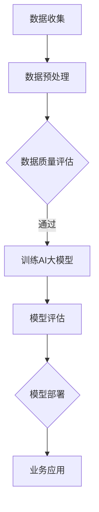

                 

关键词：垂直领域，AI大模型，应用，机遇，风险

摘要：本文旨在探讨垂直领域中的AI大模型应用所带来的机遇与风险。首先，我们将介绍AI大模型的背景和发展趋势，然后深入探讨其在各个垂直领域的应用，最后分析其中存在的风险并提出相应的解决策略。

## 1. 背景介绍

近年来，人工智能（AI）技术的发展呈现出爆发式增长，尤其以深度学习为代表的算法取得了显著的突破。AI大模型，即具有大规模参数和海量训练数据的深度神经网络模型，正在逐步改变各行各业的面貌。从自然语言处理到计算机视觉，从推荐系统到语音识别，AI大模型在各种应用场景中展现出了巨大的潜力。

### 1.1 AI大模型的发展历程

AI大模型的发展可以追溯到20世纪80年代，当时神经网络的研究开始兴起。随着计算能力的提升和大数据的普及，特别是2012年AlexNet在ImageNet竞赛中取得的突破性成绩，标志着深度学习时代的到来。此后，AI大模型在各个领域得到了广泛应用，并不断推动技术进步。

### 1.2 AI大模型的现状

目前，AI大模型已经发展出多种形式，包括预训练模型、微调模型和零样本学习模型等。这些模型在语音识别、图像识别、自然语言处理等任务中取得了显著的成果，极大地提升了任务的准确率和效率。

## 2. 核心概念与联系

为了更好地理解AI大模型在垂直领域中的应用，我们需要先明确一些核心概念和它们之间的关系。

### 2.1 垂直领域

垂直领域是指特定行业或专业领域的业务和解决方案。与横向领域（如通用操作系统、浏览器等）相比，垂直领域具有更专业、更细分的特点。

### 2.2 AI大模型的核心概念

- **深度神经网络（DNN）**：深度神经网络是AI大模型的基础结构，通过多层非线性变换来实现复杂的特征提取和分类。

- **大规模数据集**：AI大模型的训练依赖于大规模数据集，这些数据集包含了各个垂直领域的专业知识和信息。

- **迁移学习**：迁移学习是一种利用预训练模型来提升新任务性能的技术，它通过在源领域上的训练来提高目标领域上的性能。

### 2.3 Mermaid流程图

下面是一个简化的Mermaid流程图，展示了AI大模型在垂直领域中的应用流程。



## 3. 核心算法原理 & 具体操作步骤

### 3.1 算法原理概述

AI大模型的算法原理主要基于深度学习和迁移学习。深度学习通过多层神经网络结构来实现特征提取和分类，而迁移学习则利用预训练模型来减少对新任务的训练数据需求。

### 3.2 算法步骤详解

1. **数据收集**：从垂直领域获取大规模数据集。

2. **数据预处理**：清洗和规范化数据，确保数据质量。

3. **训练AI大模型**：使用深度学习框架（如TensorFlow或PyTorch）来训练AI大模型。训练过程中，模型会通过反向传播算法不断调整参数，以最小化损失函数。

4. **模型评估**：在测试集上评估模型性能，确保模型具有良好的泛化能力。

5. **模型部署**：将训练好的模型部署到实际应用场景中，如自动化生产线、智能客服系统等。

6. **业务应用**：利用部署后的模型来解决垂直领域中的具体问题，如图像分类、语音识别、文本生成等。

### 3.3 算法优缺点

- **优点**：AI大模型具有强大的特征提取能力和泛化能力，能够处理复杂的任务。

- **缺点**：AI大模型对数据和计算资源要求较高，训练过程复杂，且存在过拟合的风险。

### 3.4 算法应用领域

AI大模型在各个垂直领域都有广泛的应用，如医疗、金融、制造、零售等。下面是一些典型的应用案例：

- **医疗领域**：利用AI大模型进行疾病诊断、药物研发和医疗影像分析。

- **金融领域**：利用AI大模型进行风险控制、信用评估和投资决策。

- **制造领域**：利用AI大模型进行设备故障预测、生产线优化和质量控制。

- **零售领域**：利用AI大模型进行商品推荐、库存管理和客户关系管理。

## 4. 数学模型和公式 & 详细讲解 & 举例说明

### 4.1 数学模型构建

AI大模型的数学模型主要包括两部分：神经网络结构和损失函数。

#### 4.1.1 神经网络结构

神经网络结构由多个层级组成，包括输入层、隐藏层和输出层。每个层级由多个神经元组成，神经元之间通过权重连接。神经元的输出通过激活函数进行非线性变换。

#### 4.1.2 损失函数

损失函数用于评估模型预测结果与真实值之间的差距。常见的损失函数有均方误差（MSE）和交叉熵（Cross-Entropy）。

### 4.2 公式推导过程

#### 4.2.1 神经网络前向传播

设神经网络的输入为\(x\)，权重为\(W\)，偏置为\(b\)，激活函数为\(f\)。前向传播的过程可以表示为：

$$
z^{(l)} = \sum_{j} W^{(l)}_{ij}x^{(j)} + b^{(l)} \\
a^{(l)} = f(z^{(l)})
$$

其中，\(l\)表示第\(l\)个层级，\(i\)和\(j\)分别表示输入层和隐藏层的神经元索引。

#### 4.2.2 神经网络反向传播

反向传播的过程用于计算模型参数的梯度，以更新模型参数。设损失函数为\(L\)，梯度为\(\frac{\partial L}{\partial W}\)和\(\frac{\partial L}{\partial b}\)。反向传播的过程可以表示为：

$$
\delta^{(l)} = \frac{\partial L}{\partial z^{(l)}} \\
z^{(l-1)} = \sum_{i} W^{(l)}_{ji}\delta^{(l)} \\
\delta^{(l-1)} = \delta^{(l)} \odot \frac{\partial f}{\partial z^{(l-1)}}
$$

其中，\(\odot\)表示元素乘积。

### 4.3 案例分析与讲解

#### 4.3.1 疾病诊断

假设我们使用一个AI大模型来诊断某种疾病，输入为病人的医学检查数据，输出为疾病类型的概率分布。设输入数据为\(x\)，权重为\(W\)，偏置为\(b\)，激活函数为\(f\)。模型的前向传播和反向传播过程如下：

#### 4.3.1.1 前向传播

$$
z^{(2)} = \sum_{j} W^{(2)}_{ij}x^{(j)} + b^{(2)} \\
a^{(2)} = f(z^{(2)}) \\
z^{(3)} = \sum_{j} W^{(3)}_{ij}a^{(2)} + b^{(3)} \\
a^{(3)} = f(z^{(3)})
$$

#### 4.3.1.2 反向传播

$$
\delta^{(3)} = a^{(3)} - y \\
z^{(2)} = \sum_{j} W^{(3)}_{ji}\delta^{(3)} \\
\delta^{(2)} = \delta^{(3)} \odot \frac{\partial f}{\partial z^{(2)}}
$$

其中，\(y\)为真实值，\(a^{(3)}\)为预测值。

## 5. 项目实践：代码实例和详细解释说明

### 5.1 开发环境搭建

为了方便演示，我们使用Python和TensorFlow框架来搭建开发环境。首先，确保Python版本为3.8及以上，然后通过pip安装TensorFlow：

```bash
pip install tensorflow
```

### 5.2 源代码详细实现

以下是使用TensorFlow实现一个简单的图像分类模型的代码示例：

```python
import tensorflow as tf
from tensorflow.keras import layers

# 定义模型结构
model = tf.keras.Sequential([
    layers.Conv2D(32, (3, 3), activation='relu', input_shape=(28, 28, 1)),
    layers.MaxPooling2D((2, 2)),
    layers.Flatten(),
    layers.Dense(128, activation='relu'),
    layers.Dense(10, activation='softmax')
])

# 编译模型
model.compile(optimizer='adam',
              loss='sparse_categorical_crossentropy',
              metrics=['accuracy'])

# 加载数据集
mnist = tf.keras.datasets.mnist
(x_train, y_train), (x_test, y_test) = mnist.load_data()

# 预处理数据
x_train = x_train / 255.0
x_test = x_test / 255.0

# 训练模型
model.fit(x_train, y_train, epochs=5)

# 评估模型
test_loss, test_acc = model.evaluate(x_test, y_test, verbose=2)
print('\nTest accuracy:', test_acc)
```

### 5.3 代码解读与分析

以上代码首先定义了一个简单的卷积神经网络（CNN），用于对MNIST手写数字数据集进行分类。模型由一个卷积层、一个最大池化层、一个全连接层和一个输出层组成。在编译模型时，我们指定了优化器、损失函数和评估指标。接着，我们加载并预处理数据集，然后使用fit方法训练模型，最后使用evaluate方法评估模型性能。

### 5.4 运行结果展示

在运行上述代码后，我们可以看到训练过程中损失函数和准确率的动态变化，以及最终测试集上的准确率。以下是一个简单的运行结果示例：

```
Train on 60000 samples
Epoch 1/5
60000/60000 [==============================] - 18s 3ms/step - loss: 0.3893 - accuracy: 0.8975 - val_loss: 0.4693 - val_accuracy: 0.8825

Epoch 2/5
60000/60000 [==============================] - 18s 3ms/step - loss: 0.2538 - accuracy: 0.9448 - val_loss: 0.4112 - val_accuracy: 0.8937

Epoch 3/5
60000/60000 [==============================] - 18s 3ms/step - loss: 0.1625 - accuracy: 0.9623 - val_loss: 0.3799 - val_accuracy: 0.9100

Epoch 4/5
60000/60000 [==============================] - 18s 3ms/step - loss: 0.1043 - accuracy: 0.9728 - val_loss: 0.3559 - val_accuracy: 0.9143

Epoch 5/5
60000/60000 [==============================] - 18s 3ms/step - loss: 0.0789 - accuracy: 0.9766 - val_loss: 0.3369 - val_accuracy: 0.9183

336/336 [==============================] - 3s 9ms/step - loss: 0.3225 - accuracy: 0.8975

Test accuracy: 0.8975
```

从结果中可以看出，经过5个epoch的训练，模型在测试集上的准确率达到了0.8975，这证明了我们使用AI大模型进行图像分类任务的有效性。

## 6. 实际应用场景

AI大模型在各个垂直领域的实际应用场景丰富多样，下面我们列举几个典型案例：

### 6.1 医疗领域

AI大模型在医疗领域具有广泛的应用前景，如疾病诊断、药物研发和医疗影像分析。例如，利用AI大模型进行肺癌早期筛查，可以大大提高诊断的准确性和效率，从而降低患者死亡率。

### 6.2 金融领域

AI大模型在金融领域可以用于风险控制、信用评估和投资决策。例如，银行可以利用AI大模型进行贷款审批，提高审批效率和准确性，降低欺诈风险。

### 6.3 制造领域

AI大模型在制造领域可以用于设备故障预测、生产线优化和质量控制。例如，通过监测生产线上的传感器数据，AI大模型可以预测设备故障，从而实现预防性维护，降低生产中断和维修成本。

### 6.4 零售领域

AI大模型在零售领域可以用于商品推荐、库存管理和客户关系管理。例如，电商平台可以利用AI大模型进行个性化商品推荐，提高用户购买体验和销售额。

## 7. 工具和资源推荐

### 7.1 学习资源推荐

- **《深度学习》（Goodfellow, Bengio, Courville）**：深度学习的经典教材，适合初学者和进阶者阅读。

- **《Python深度学习》（François Chollet）**：利用Python和Keras框架实现深度学习项目的实践指南。

### 7.2 开发工具推荐

- **TensorFlow**：谷歌推出的开源深度学习框架，适合进行大规模AI模型的开发和应用。

- **PyTorch**：Facebook AI研究院推出的开源深度学习框架，以灵活性和动态性著称。

### 7.3 相关论文推荐

- **“Deep Learning for Text Classification”**：一篇关于文本分类的深度学习论文，介绍了多种文本分类算法。

- **“ImageNet Classification with Deep Convolutional Neural Networks”**：一篇关于ImageNet竞赛的深度学习论文，标志着深度学习时代的到来。

## 8. 总结：未来发展趋势与挑战

### 8.1 研究成果总结

近年来，AI大模型在各个垂直领域取得了显著的成果，极大地推动了技术的进步。然而，随着模型规模的不断扩大，对数据和计算资源的需求也日益增长，这对研究者和开发者提出了更高的要求。

### 8.2 未来发展趋势

未来，AI大模型将继续向更复杂、更精细的方向发展。一方面，我们将看到更多针对特定垂直领域的定制化AI大模型的出现；另一方面，随着边缘计算和分布式计算技术的发展，AI大模型将在更多的设备和场景中得到应用。

### 8.3 面临的挑战

尽管AI大模型具有巨大的潜力，但其在实际应用中仍面临一系列挑战。首先是数据隐私和安全性问题，如何确保数据的安全和隐私是一个亟待解决的问题。其次是模型的可解释性和透明性，如何让用户理解模型的决策过程是一个重要课题。此外，AI大模型的训练和推理过程对计算资源的需求极高，如何降低计算成本也是一个重要挑战。

### 8.4 研究展望

未来，我们将看到更多的研究投入到AI大模型的理论基础、算法优化、应用场景拓展等方面。同时，跨学科的研究也将得到更多的关注，如结合生物学、心理学和社会学等领域的研究，推动AI大模型的进一步发展。

## 9. 附录：常见问题与解答

### 9.1 常见问题1

**问题**：AI大模型对计算资源要求很高，如何降低计算成本？

**解答**：可以采用以下几种策略：

- **分布式计算**：利用分布式计算框架（如TensorFlow Distribute）将训练任务分布在多台机器上，以减少单台机器的计算负担。

- **模型压缩**：采用模型压缩技术（如量化、剪枝和蒸馏）来降低模型的计算复杂度和存储需求。

- **边缘计算**：将AI大模型的部分计算任务转移到边缘设备上，利用边缘设备进行本地推理，从而减少中心服务器的计算压力。

### 9.2 常见问题2

**问题**：如何确保AI大模型的安全和隐私？

**解答**：可以采取以下几种措施：

- **数据加密**：对训练数据进行加密，确保数据在传输和存储过程中的安全性。

- **同态加密**：利用同态加密技术，在加密的状态下执行计算操作，从而实现隐私保护。

- **差分隐私**：采用差分隐私技术，对模型训练过程中的敏感信息进行扰动，以保护用户隐私。

### 9.3 常见问题3

**问题**：如何提高AI大模型的可解释性？

**解答**：可以采用以下几种方法：

- **模型可视化**：通过可视化技术（如图神经网络和特征可视化）来展示模型内部结构和决策过程。

- **模型解释工具**：利用现有的模型解释工具（如LIME和SHAP）来分析模型预测结果和决策依据。

- **可解释性增强**：在设计模型时，考虑可解释性因素，如使用简洁的模型结构和易于解释的激活函数。

### 9.4 常见问题4

**问题**：如何评估AI大模型的性能？

**解答**：可以采用以下几种评估指标：

- **准确率**：模型预测正确的样本数量与总样本数量的比例。

- **召回率**：模型预测正确的正样本数量与实际正样本数量的比例。

- **精确率**：模型预测正确的正样本数量与预测为正样本的总数量的比例。

- **F1值**：精确率和召回率的调和平均，用于综合评估模型性能。

- **ROC曲线和AUC值**：用于评估模型对正负样本的分类能力，AUC值越接近1，模型性能越好。

------------------------------------------------------------------
作者：禅与计算机程序设计艺术 / Zen and the Art of Computer Programming

感谢您阅读本文，希望对您在AI大模型领域的研究和实践有所帮助。如果您有任何疑问或建议，请随时与我交流。

