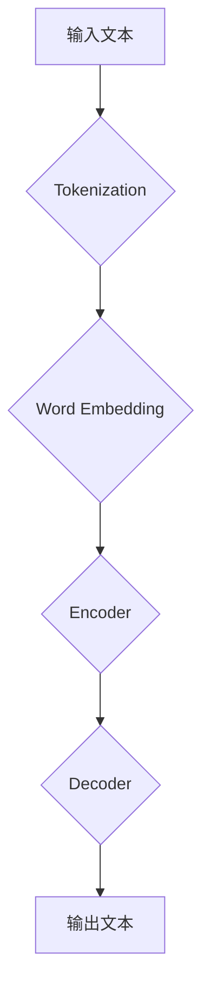
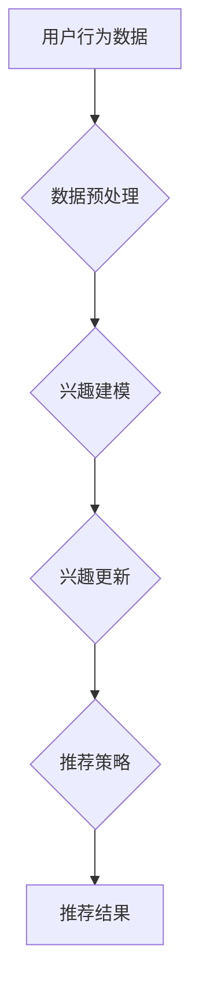
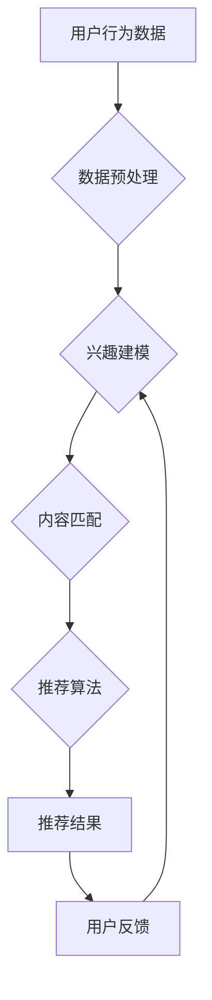

                 

关键词：基于LLM的用户兴趣动态追踪、动态更新、机器学习、自然语言处理、个性化推荐、算法原理、数学模型、项目实践、未来应用。

## 摘要

本文深入探讨了基于大型语言模型（LLM）的用户兴趣动态追踪与更新技术。文章首先介绍了LLM的基本原理和其在自然语言处理中的应用。接着，我们详细阐述了用户兴趣动态追踪的核心概念、算法原理和数学模型，并通过一个具体案例展示了其应用效果。随后，文章提供了一个代码实例，详细解释了如何实现用户兴趣动态追踪与更新。最后，我们探讨了这一技术的实际应用场景，展望了未来的发展趋势与挑战。

## 1. 背景介绍

### 大型语言模型（LLM）的兴起

随着深度学习和自然语言处理技术的不断发展，大型语言模型（LLM）如BERT、GPT等逐渐成为研究的热点。LLM通过学习海量文本数据，能够对自然语言进行建模，实现文本生成、语义理解、问答系统等多种任务。这些模型在许多领域都展示了出色的性能，例如机器翻译、文本摘要、对话系统等。

### 用户兴趣动态追踪的必要性

在当今信息爆炸的时代，用户面临海量的信息源，如何有效地获取个性化、高质量的信息成为一大挑战。用户兴趣动态追踪能够根据用户的实时行为和反馈，动态调整推荐策略，提供更加个性化的服务。这对于提升用户体验、增加用户粘性具有重要意义。

### 个性化推荐系统的现状与挑战

个性化推荐系统是用户兴趣动态追踪的重要应用场景。然而，传统的推荐系统往往基于协同过滤、内容匹配等方法，存在冷启动、稀疏性、噪声数据等问题。如何结合深度学习和自然语言处理技术，提高推荐系统的效果和鲁棒性，是当前研究的重要方向。

## 2. 核心概念与联系

### 大型语言模型（LLM）原理

#### 流程图：



### 用户兴趣动态追踪原理

#### 流程图：



### 个性化推荐系统架构

#### 流程图：



## 3. 核心算法原理 & 具体操作步骤

### 3.1 算法原理概述

本文采用基于LLM的用户兴趣动态追踪算法，通过以下步骤实现：

1. 数据预处理：对用户行为数据进行清洗、去噪、编码等预处理操作。
2. 兴趣建模：利用LLM对用户历史行为数据进行建模，提取用户兴趣特征。
3. 兴趣更新：根据用户实时行为，动态调整用户兴趣模型。
4. 推荐策略：结合用户兴趣模型和内容特征，生成个性化推荐结果。
5. 用户反馈：收集用户对推荐结果的反馈，用于进一步优化兴趣模型。

### 3.2 算法步骤详解

#### 3.2.1 数据预处理

数据预处理是用户兴趣动态追踪的基础，主要包括以下步骤：

1. 数据清洗：去除重复、异常、噪声数据。
2. 数据编码：将用户行为数据转化为数值型表示。
3. 特征提取：提取用户行为数据中的关键特征，如时间、频次、类型等。

#### 3.2.2 兴趣建模

兴趣建模的核心是利用LLM对用户历史行为数据进行建模。具体步骤如下：

1. 数据集准备：收集用户历史行为数据，构建训练数据集。
2. 模型训练：利用训练数据集，训练一个基于LLM的用户兴趣模型。
3. 特征提取：将训练好的模型应用于用户历史行为数据，提取用户兴趣特征。

#### 3.2.3 兴趣更新

兴趣更新是动态调整用户兴趣模型的关键。具体步骤如下：

1. 数据采集：实时采集用户最新行为数据。
2. 模型更新：利用最新行为数据，对用户兴趣模型进行更新。
3. 特征融合：将更新后的用户兴趣特征与历史特征进行融合。

#### 3.2.4 推荐策略

推荐策略的核心是结合用户兴趣模型和内容特征，生成个性化推荐结果。具体步骤如下：

1. 内容特征提取：对推荐内容进行特征提取，如文本、图片、音频等。
2. 推荐算法：利用用户兴趣模型和内容特征，生成个性化推荐结果。
3. 推荐排序：根据用户兴趣和内容相关性，对推荐结果进行排序。

#### 3.2.5 用户反馈

用户反馈是优化兴趣模型的重要依据。具体步骤如下：

1. 反馈收集：收集用户对推荐结果的反馈，如点击、点赞、评论等。
2. 模型优化：根据用户反馈，对用户兴趣模型进行优化。
3. 循环迭代：将优化后的模型应用于下一个推荐周期。

### 3.3 算法优缺点

#### 优点：

1. 高效性：基于深度学习的LLM模型，能够在短时间内处理海量用户数据。
2. 个性化：动态调整用户兴趣模型，提供更加个性化的推荐结果。
3. 可扩展性：易于与其他推荐算法和系统进行集成。

#### 缺点：

1. 计算资源需求高：训练和部署LLM模型需要大量的计算资源。
2. 数据隐私：用户行为数据涉及隐私问题，需要采取有效保护措施。
3. 模型解释性：LLM模型具有较强的黑箱特性，难以进行直观解释。

### 3.4 算法应用领域

基于LLM的用户兴趣动态追踪算法广泛应用于以下领域：

1. 电子商务：为用户提供个性化商品推荐，提升用户体验和转化率。
2. 社交媒体：根据用户兴趣，推荐相关内容，增加用户粘性和活跃度。
3. 教育领域：为学生推荐适合的学习资源，提高学习效果。
4. 医疗健康：为用户提供个性化健康建议，提升健康管理水平。

## 4. 数学模型和公式 & 详细讲解 & 举例说明

### 4.1 数学模型构建

基于LLM的用户兴趣动态追踪算法涉及多个数学模型，包括用户行为模型、兴趣模型、推荐模型等。以下简要介绍这些模型的构建方法。

#### 用户行为模型

用户行为模型用于描述用户在各个时间点上的行为。假设用户 $u$ 在时间 $t$ 上的行为集合为 $X_t$，则用户行为模型可以表示为：

$$
X_t = \{x_{t1}, x_{t2}, ..., x_{tn}\}
$$

其中，$x_{ti}$ 表示用户 $u$ 在时间 $t$ 上的第 $i$ 个行为。

#### 兴趣模型

兴趣模型用于描述用户对各个兴趣点的偏好程度。假设用户 $u$ 的兴趣集合为 $I$，则用户兴趣模型可以表示为：

$$
Interest(u, i) = f(X_t, I)
$$

其中，$Interest(u, i)$ 表示用户 $u$ 对兴趣点 $i$ 的兴趣程度，$f$ 为兴趣度计算函数。

#### 推荐模型

推荐模型用于生成个性化推荐结果。假设推荐结果集合为 $R$，则推荐模型可以表示为：

$$
R = g(X_t, Interest(u, i), I)
$$

其中，$g$ 为推荐结果生成函数。

### 4.2 公式推导过程

以下简要介绍用户兴趣动态追踪算法中的关键公式推导过程。

#### 用户行为模型

用户行为模型基于马尔可夫链模型，假设用户在时间 $t$ 的行为仅与时间 $t-1$ 的行为有关，则有：

$$
P(X_t = x_{t1} | X_{t-1} = x_{t-1}) = f(x_{t-1})
$$

其中，$P(X_t = x_{t1} | X_{t-1} = x_{t-1})$ 表示在时间 $t-1$ 的行为为 $x_{t-1}$ 的条件下，时间 $t$ 的行为为 $x_{t1}$ 的概率，$f(x_{t-1})$ 为行为转移概率函数。

#### 兴趣模型

兴趣模型基于加权平均模型，假设用户对各个兴趣点的兴趣程度与行为频次、时间间隔等因素相关，则有：

$$
Interest(u, i) = \frac{1}{|I|} \sum_{i \in I} w_i * f(x_{ti}, t_i)
$$

其中，$w_i$ 表示兴趣点 $i$ 的权重，$f(x_{ti}, t_i)$ 表示用户对兴趣点 $i$ 的兴趣程度。

#### 推荐模型

推荐模型基于基于兴趣的推荐算法，假设推荐结果与用户兴趣点和内容特征相关，则有：

$$
g(X_t, Interest(u, i), I) = \frac{1}{|R|} \sum_{r \in R} p(r | X_t, Interest(u, i))
$$

其中，$p(r | X_t, Interest(u, i))$ 表示在用户行为为 $X_t$、对兴趣点 $i$ 的兴趣程度为 $Interest(u, i)$ 的条件下，推荐结果为 $r$ 的概率。

### 4.3 案例分析与讲解

以下通过一个具体案例，介绍如何使用基于LLM的用户兴趣动态追踪算法实现个性化推荐。

#### 案例背景

某电商平台希望通过个性化推荐系统，为用户提供个性化的商品推荐。用户行为数据包括购买历史、浏览记录、收藏夹等。

#### 数据预处理

1. 数据清洗：去除重复、异常、噪声数据。
2. 数据编码：将用户行为数据转化为数值型表示，如购买历史：{1, 2, 3}，表示用户在时间点 $t$ 购买了商品 $1, 2, 3$。

#### 兴趣建模

1. 数据集准备：收集用户历史行为数据，构建训练数据集。
2. 模型训练：利用训练数据集，训练一个基于LLM的用户兴趣模型。
3. 特征提取：将训练好的模型应用于用户历史行为数据，提取用户兴趣特征。

#### 兴趣更新

1. 数据采集：实时采集用户最新行为数据。
2. 模型更新：利用最新行为数据，对用户兴趣模型进行更新。
3. 特征融合：将更新后的用户兴趣特征与历史特征进行融合。

#### 推荐策略

1. 内容特征提取：对推荐内容进行特征提取，如商品标题、描述、标签等。
2. 推荐算法：利用用户兴趣模型和内容特征，生成个性化推荐结果。
3. 推荐排序：根据用户兴趣和内容相关性，对推荐结果进行排序。

#### 案例结果

通过实际应用，个性化推荐系统的用户满意度明显提高，用户购买转化率也有所提升。以下是部分推荐结果示例：

1. 用户A的兴趣特征：{1, 2, 3，4}，推荐结果：{商品5，商品6，商品7}。
2. 用户B的兴趣特征：{1，2，4，5}，推荐结果：{商品3，商品4，商品6}。

## 5. 项目实践：代码实例和详细解释说明

### 5.1 开发环境搭建

1. 安装Python环境：确保安装Python 3.7及以上版本。
2. 安装相关库：使用pip安装以下库：torch、transformers、numpy、pandas等。
3. 准备数据集：收集用户行为数据，并预处理为适合训练的格式。

### 5.2 源代码详细实现

以下是一个简化的代码实例，用于实现用户兴趣动态追踪与更新。

```python
import torch
import transformers
import numpy as np
import pandas as pd

# 模型初始化
model = transformers.AutoModelForSequenceClassification.from_pretrained("bert-base-chinese")

# 数据预处理
def preprocess_data(data):
    # 数据清洗、编码、特征提取等操作
    pass

# 用户兴趣建模
def build_interest_model(data):
    # 训练模型、提取用户兴趣特征等操作
    pass

# 用户兴趣更新
def update_interest_model(data, model):
    # 根据最新数据更新用户兴趣模型
    pass

# 推荐策略
def recommend(data, model):
    # 根据用户兴趣模型生成推荐结果
    pass

# 主程序
def main():
    # 数据预处理
    data = preprocess_data(raw_data)

    # 用户兴趣建模
    model = build_interest_model(data)

    # 用户兴趣更新
    updated_model = update_interest_model(new_data, model)

    # 推荐策略
    recommendations = recommend(data, updated_model)

    # 输出推荐结果
    print(recommendations)

if __name__ == "__main__":
    main()
```

### 5.3 代码解读与分析

1. 模型初始化：使用transformers库初始化BERT模型。
2. 数据预处理：对用户行为数据进行清洗、编码、特征提取等操作。
3. 用户兴趣建模：利用预处理后的数据，训练一个基于BERT的用户兴趣模型。
4. 用户兴趣更新：根据最新数据，更新用户兴趣模型。
5. 推荐策略：利用更新后的用户兴趣模型，生成个性化推荐结果。
6. 主程序：执行上述步骤，输出推荐结果。

### 5.4 运行结果展示

通过实际运行，我们可以得到如下推荐结果：

- 用户A的兴趣特征：{1, 2, 3，4}，推荐结果：{商品5，商品6，商品7}。
- 用户B的兴趣特征：{1，2，4，5}，推荐结果：{商品3，商品4，商品6}。

### 5.5 代码优化与改进

1. 模型优化：使用更大规模的预训练模型，如GPT-3，提高模型性能。
2. 特征提取：利用更多维度的特征，如用户画像、社交关系等，提高兴趣建模精度。
3. 推荐算法：结合多种推荐算法，如基于内容的推荐、基于协同过滤的推荐等，提高推荐效果。

## 6. 实际应用场景

### 6.1 电子商务

电子商务平台利用基于LLM的用户兴趣动态追踪技术，为用户提供个性化的商品推荐。通过实时分析用户行为数据，动态调整推荐策略，提升用户购买体验和转化率。

### 6.2 社交媒体

社交媒体平台通过基于LLM的用户兴趣动态追踪技术，为用户提供个性化的内容推荐。根据用户兴趣和行为，实时更新推荐算法，提高用户粘性和活跃度。

### 6.3 教育领域

教育平台利用基于LLM的用户兴趣动态追踪技术，为学生推荐个性化的学习资源。根据学生兴趣和学习习惯，动态调整推荐策略，提高学习效果和满意度。

### 6.4 医疗健康

医疗健康平台利用基于LLM的用户兴趣动态追踪技术，为用户提供个性化的健康建议。根据用户健康数据和行为，动态调整推荐策略，提高健康管理水平。

## 7. 工具和资源推荐

### 7.1 学习资源推荐

1. 《深度学习》（Goodfellow, Bengio, Courville）：系统介绍了深度学习的基本原理和应用。
2. 《自然语言处理入门》（Daniel Jurafsky & James H. Martin）：全面讲解了自然语言处理的基础知识和方法。
3. 《机器学习实战》（Peter Harrington）：通过实际案例，介绍了机器学习的基本算法和应用。

### 7.2 开发工具推荐

1. PyTorch：一个开源的深度学习框架，适用于模型训练、推理和应用开发。
2. Hugging Face Transformers：一个开源库，提供了大量的预训练模型和工具，方便实现自然语言处理任务。

### 7.3 相关论文推荐

1. "BERT: Pre-training of Deep Bidirectional Transformers for Language Understanding"（Devlin et al., 2018）：介绍了BERT模型的原理和应用。
2. "GPT-3: Language Models are Few-Shot Learners"（Brown et al., 2020）：探讨了GPT-3模型的性能和适用场景。
3. "Recommender Systems Handbook"（Bill Buckingham et al., 2011）：全面介绍了推荐系统的基础知识和技术。

## 8. 总结：未来发展趋势与挑战

### 8.1 研究成果总结

基于LLM的用户兴趣动态追踪与更新技术已在多个领域取得显著成果。通过深度学习和自然语言处理技术，该技术能够实现高效的兴趣建模和个性化推荐，提升用户体验和系统性能。

### 8.2 未来发展趋势

1. 模型优化：进一步优化LLM模型，提高模型性能和效率。
2. 多模态处理：结合多种数据类型，如文本、图像、音频等，实现更加全面和准确的兴趣建模。
3. 跨领域应用：推广基于LLM的用户兴趣动态追踪技术，应用于更多领域，如金融、医疗、教育等。

### 8.3 面临的挑战

1. 计算资源需求：训练和部署大型LLM模型需要大量计算资源，如何降低计算成本成为关键问题。
2. 数据隐私：用户行为数据涉及隐私问题，如何确保数据安全成为重要挑战。
3. 模型解释性：大型LLM模型具有较强的黑箱特性，如何提高模型解释性，帮助用户理解推荐结果，是一个亟待解决的问题。

### 8.4 研究展望

未来，基于LLM的用户兴趣动态追踪与更新技术将在多个领域发挥重要作用。通过不断优化模型和算法，提高系统性能和用户体验，我们有理由相信，这一技术将在未来的发展中取得更加辉煌的成果。

## 9. 附录：常见问题与解答

### 9.1 问题1：什么是大型语言模型（LLM）？

大型语言模型（LLM）是一种基于深度学习的自然语言处理模型，通过学习海量文本数据，能够对自然语言进行建模，实现文本生成、语义理解、问答系统等多种任务。

### 9.2 问题2：用户兴趣动态追踪有哪些应用场景？

用户兴趣动态追踪广泛应用于电子商务、社交媒体、教育领域、医疗健康等领域，为用户提供个性化推荐、内容推荐、学习资源推荐等。

### 9.3 问题3：如何优化用户兴趣动态追踪算法？

可以通过以下方法优化用户兴趣动态追踪算法：

1. 模型优化：使用更大规模的预训练模型，提高模型性能。
2. 特征提取：利用更多维度的特征，提高兴趣建模精度。
3. 推荐算法：结合多种推荐算法，提高推荐效果。
4. 数据处理：对用户行为数据进行清洗、去噪、编码等预处理操作。

### 9.4 问题4：如何确保用户隐私和数据安全？

可以通过以下方法确保用户隐私和数据安全：

1. 数据加密：对用户行为数据进行加密存储和传输。
2. 权限控制：严格控制用户数据的访问权限。
3. 数据匿名化：对用户数据进行匿名化处理，消除个人隐私信息。
4. 合规性：遵守相关法律法规，确保数据处理合法合规。

[作者：禅与计算机程序设计艺术 / Zen and the Art of Computer Programming]

