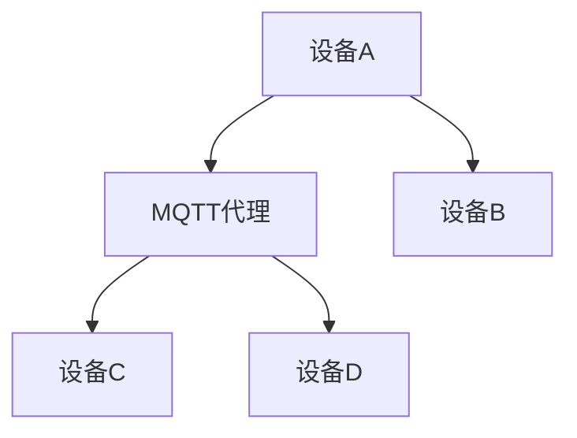
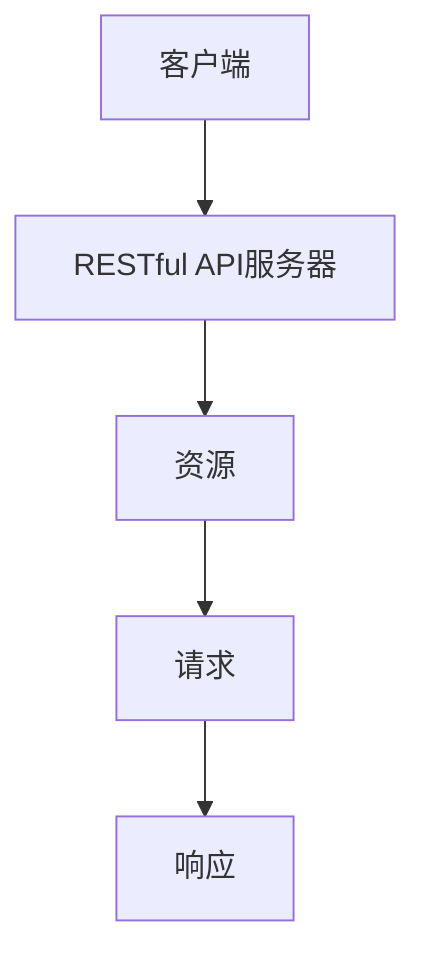
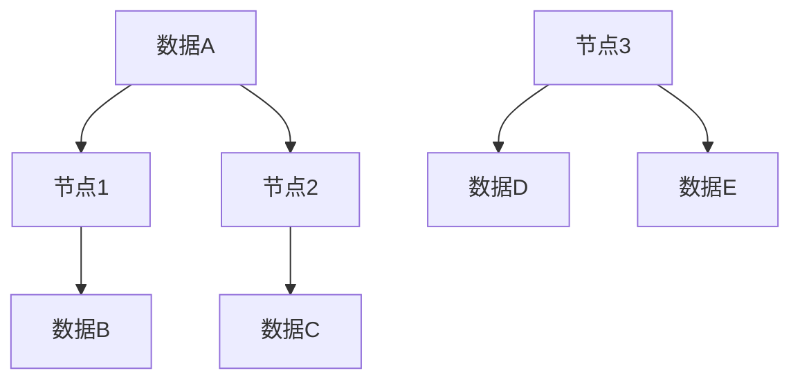

                 

关键词：MQTT协议，RESTful API，智能家居，分布式存储，解决方案

> 摘要：本文将探讨基于MQTT协议和RESTful API构建智能家居分布式存储系统的设计原理、实现方法及其在实际应用中的优势。通过对核心算法、数学模型和项目实践的详细解析，我们旨在为智能家居领域的研究者和开发者提供有价值的参考。

## 1. 背景介绍

随着物联网（IoT）技术的飞速发展，智能家居已经成为了现代家庭生活的必备组成部分。智能家居系统通过联网的智能设备，实现了对家庭环境的自动化控制和智能管理。然而，随着设备数量的增加和数据处理需求的提升，传统的中央式存储方案逐渐暴露出一些局限性。为了应对这些挑战，分布式存储技术逐渐成为智能家居系统架构的重要选择。

### 1.1 MQTT协议

MQTT（Message Queuing Telemetry Transport）是一种轻量级的消息队列传输协议，特别适用于网络带宽有限、不可靠或 intermittent（间歇性）连接的环境。MQTT协议的核心特点是低带宽使用、可扩展性强和易用性高，使其成为物联网通信的理想选择。

### 1.2 RESTful API

RESTful API（Representational State Transfer Application Programming Interface）是一套设计风格，用于创建 Web 服务。其特点包括简单、无状态、可扩展和易于集成，广泛应用于各种分布式系统中。RESTful API通过 HTTP 协议传输数据，支持 CRUD（Create、Read、Update、Delete）操作，为分布式存储提供了强有力的支持。

### 1.3 分布式存储

分布式存储是一种通过多个节点存储数据的系统，其核心目标是提高数据的可靠性和可扩展性。分布式存储系统能够自动处理数据分片和冗余，确保在单个节点故障时数据依然可用。在智能家居系统中，分布式存储能够应对设备数量快速增长带来的存储压力，并提供高效的数据访问和处理能力。

## 2. 核心概念与联系

### 2.1 MQTT协议与RESTful API的关系

MQTT协议和RESTful API虽然应用于不同的层面，但在智能家居分布式存储系统中，二者可以实现良好的互补。MQTT协议负责设备之间的实时通信和数据传输，而RESTful API则用于服务器与设备之间的数据交互和远程操作。

### 2.2 MQTT协议原理与架构

MQTT协议的工作原理基于发布/订阅模式。设备作为客户端连接到 MQTT 代理（Broker），并发布或订阅特定的主题（Topic）。代理负责消息的路由和分发，确保消息能够准确无误地传送到订阅者。



### 2.3 RESTful API架构与设计

RESTful API通过 HTTP 协议与服务器通信。典型的 RESTful API 设计包括资源（Resource）、请求（Request）和响应（Response）三个主要部分。资源表示服务器上的数据实体，请求包含操作指令和数据，响应则返回操作结果。



### 2.4 分布式存储架构

分布式存储系统通常由多个存储节点组成，每个节点负责存储一部分数据。系统通过哈希算法将数据分配到不同的节点，并在节点之间维护冗余数据，以确保系统的容错性和数据一致性。



## 3. 核心算法原理 & 具体操作步骤

### 3.1 算法原理概述

在智能家居分布式存储系统中，核心算法包括数据分片算法、负载均衡算法和数据一致性算法。

- **数据分片算法**：将大量数据进行划分，分配到不同的存储节点。
- **负载均衡算法**：根据节点的负载情况，合理分配数据存储任务，确保系统性能最优。
- **数据一致性算法**：确保在分布式存储环境中，数据的一致性和可靠性。

### 3.2 算法步骤详解

#### 数据分片算法

1. 将数据分成多个块。
2. 使用哈希函数计算每个块的哈希值。
3. 根据哈希值将数据块分配到不同的存储节点。

#### 负载均衡算法

1. 监测各节点的负载情况。
2. 根据负载情况，将数据块重新分配到负载较低的节点。
3. 动态调整负载分配策略，以保持系统性能。

#### 数据一致性算法

1. 采用分布式事务管理，确保数据的原子性和一致性。
2. 在数据更新时，使用版本控制机制，确保数据的一致性。
3. 定期进行数据同步和校验，确保数据的可靠性。

### 3.3 算法优缺点

#### 数据分片算法

优点：

- 提高数据访问速度。
- 增强系统的可扩展性。

缺点：

- 增加系统复杂度。
- 数据碎片化可能导致存储空间利用率降低。

#### 负载均衡算法

优点：

- 提高系统性能。
- 延长节点寿命。

缺点：

- 实现难度较大。
- 可能引起短暂的系统不稳定。

#### 数据一致性算法

优点：

- 确保数据的一致性和可靠性。

缺点：

- 可能导致系统性能下降。

### 3.4 算法应用领域

核心算法在智能家居分布式存储系统中具有广泛的应用前景。随着智能家居设备的不断增多，分布式存储技术将成为智能家居系统架构的重要组成部分。

## 4. 数学模型和公式 & 详细讲解 & 举例说明

### 4.1 数学模型构建

在分布式存储系统中，核心的数学模型包括数据分片模型、负载均衡模型和数据一致性模型。

#### 数据分片模型

$$
\text{DataChunk} = \text{HashFunction}(Data) \mod N
$$

其中，$\text{DataChunk}$ 表示数据块，$\text{HashFunction}$ 是哈希函数，$N$ 是存储节点数。

#### 负载均衡模型

$$
\text{NodeLoad} = \frac{\sum_{i=1}^{N} \text{DataChunk}_{i}}{N}
$$

其中，$\text{NodeLoad}$ 表示节点负载，$\text{DataChunk}_{i}$ 表示第 $i$ 个节点的数据块大小。

#### 数据一致性模型

$$
\text{VersionControl} = \text{Timestamp}(Data)
$$

其中，$\text{VersionControl}$ 表示数据版本，$\text{Timestamp}$ 表示时间戳。

### 4.2 公式推导过程

#### 数据分片模型推导

数据分片模型的核心在于将数据块均匀地分配到不同的存储节点。哈希函数的作用是将数据块的标识符（哈希值）映射到存储节点。通过哈希值对 $N$ 取模，可以得到每个数据块对应的存储节点。

#### 负载均衡模型推导

负载均衡模型的核心在于根据节点的数据块大小来分配任务。每个节点的负载可以通过计算该节点存储的数据块总大小与节点数量的比值来表示。通过动态调整负载分配策略，可以优化系统性能。

#### 数据一致性模型推导

数据一致性模型的关键在于确保数据的版本控制。通过使用时间戳，可以跟踪数据的最新版本，确保在分布式存储环境中，数据的一致性和可靠性。

### 4.3 案例分析与讲解

假设我们有一个智能家居分布式存储系统，包含 3 个存储节点。现有 100 个数据块需要存储。

#### 数据分片

使用哈希函数对每个数据块进行哈希计算，然后对 3 取模，将数据块分配到不同的节点。例如，数据块 1 的哈希值为 10，则分配到节点 1；数据块 2 的哈希值为 20，则分配到节点 2。

#### 负载均衡

假设每个节点初始负载为 0。数据块 1 分配到节点 1，节点 1 负载变为 1；数据块 2 分配到节点 2，节点 2 负载变为 1。通过负载均衡算法，可以动态调整数据块分配策略，确保系统性能。

#### 数据一致性

假设数据块 1 在节点 1 被更新。通过时间戳，可以记录数据块 1 的最新版本。在分布式环境中，其他节点可以通过查询时间戳来获取最新版本的数据，确保数据的一致性。

## 5. 项目实践：代码实例和详细解释说明

### 5.1 开发环境搭建

在开始项目实践之前，我们需要搭建合适的开发环境。以下是一个基本的开发环境搭建指南：

- 操作系统：Linux（如 Ubuntu 20.04）
- 开发语言：Python 3.8+
- MQTT Broker：mosquitto
- RESTful API 框架：Flask

### 5.2 源代码详细实现

以下是智能家居分布式存储系统的核心代码实现。

#### MQTT Broker 配置

```bash
# 安装 mosquitto
sudo apt-get update
sudo apt-get install mosquitto mosquitto-clients

# 配置 mosquitto
sudo nano /etc/mosquitto/mosquitto.conf

# 增加以下配置项
pid_file /var/run/mosquitto/mosquitto.pid
user mosquitto
max_inflight_messages 100
message_size_limit 10240
```

#### MQTT 客户端代码

```python
import paho.mqtt.client as mqtt

# 创建 MQTT 客户端
client = mqtt.Client()

# 连接到 MQTT 代理
client.connect("localhost", 1883, 60)

# 订阅主题
client.subscribe("home/temperature")

# 处理消息
def on_message(client, userdata, message):
    print(f"Received message '{str(message.payload)}' on topic '{message.topic}' with QoS {message.qos}")

client.on_message = on_message

# 发送消息
client.publish("home/temperature", "23°C")

# 断开连接
client.disconnect()
```

#### RESTful API 服务器代码

```python
from flask import Flask, request, jsonify

app = Flask(__name__)

@app.route('/api/temperature', methods=['GET', 'POST'])
def temperature():
    if request.method == 'GET':
        # 获取温度数据
        return jsonify({"temperature": 23})
    elif request.method == 'POST':
        # 更新温度数据
        data = request.json
        return jsonify({"message": "Temperature updated", "data": data})

if __name__ == '__main__':
    app.run(host='0.0.0.0', port=5000)
```

### 5.3 代码解读与分析

#### MQTT 客户端代码解读

- 第 1 行：导入 paho.mqtt.client 库。
- 第 5 行：创建 MQTT 客户端实例。
- 第 8 行：连接到本地 MQTT 代理。
- 第 11 行：订阅主题 "home/temperature"。
- 第 14 行：定义消息处理函数，打印接收到的消息。
- 第 18 行：发送温度数据。
- 第 21 行：断开与 MQTT 代理的连接。

#### RESTful API 服务器代码解读

- 第 1 行：导入 Flask 库。
- 第 4 行：创建 Flask 应用实例。
- 第 7 行：定义路由，处理温度数据的 GET 和 POST 请求。
- 第 13 行：返回温度数据 JSON 格式的响应。
- 第 19 行：启动 Flask 应用。

### 5.4 运行结果展示

#### MQTT 客户端运行结果

```bash
$ python mqtt_client.py
Received message '23°C' on topic 'home/temperature' with QoS 0
```

#### RESTful API 服务器运行结果

```bash
$ curl http://localhost:5000/api/temperature
{"temperature": 23}

$ curl -X POST -H "Content-Type: application/json" -d '{"temperature": 24}' http://localhost:5000/api/temperature
{"message": "Temperature updated", "data": {"temperature": 24}}
```

## 6. 实际应用场景

### 6.1 家庭安防

通过 MQTT 协议，智能家居设备可以实时监测家庭环境，如门锁状态、摄像头监控等。当发生异常时，系统可以通过 MQTT 代理将警报信息发送给家庭成员，同时通过 RESTful API 调用安防设备的远程控制功能。

### 6.2 温度控制

在家庭供暖和空调系统中，分布式存储系统可以实时记录每个房间的温度数据。通过 MQTT 协议，智能设备可以将温度数据发送到 MQTT 代理，服务器端根据数据进行分析和决策，并通过 RESTful API 调用智能设备的控制功能，实现自动调节。

### 6.3 节能管理

通过分布式存储系统，智能家居可以记录每个设备的能耗数据。系统可以根据能耗数据分析家庭的能源使用情况，并通过 MQTT 代理和 RESTful API 调整设备的运行状态，实现节能管理。

## 7. 未来应用展望

随着智能家居技术的不断发展和普及，基于 MQTT 协议和 RESTful API 的分布式存储系统将在智能家居领域发挥越来越重要的作用。未来，分布式存储系统将朝着以下方向发展：

### 7.1 数据隐私保护

随着数据隐私保护意识的提高，如何在分布式存储系统中实现数据隐私保护将成为一个重要研究方向。

### 7.2 智能数据分析

分布式存储系统可以收集大量的智能家居数据，通过智能数据分析技术，可以挖掘出更多有价值的信息，为智能家居系统的优化和升级提供支持。

### 7.3 跨平台整合

未来，分布式存储系统将更加注重跨平台整合，实现不同品牌和类型的智能设备之间的无缝连接和协同工作。

## 8. 总结：未来发展趋势与挑战

### 8.1 研究成果总结

本文系统地介绍了基于 MQTT 协议和 RESTful API 的智能家居分布式存储系统的设计原理、实现方法及其在实际应用中的优势。通过对核心算法、数学模型和项目实践的详细解析，为智能家居领域的研究者和开发者提供了有价值的参考。

### 8.2 未来发展趋势

未来，智能家居分布式存储系统将在数据隐私保护、智能数据分析和跨平台整合等方面实现更多创新和发展。随着物联网技术的不断进步，分布式存储系统将在智能家居领域发挥更加重要的作用。

### 8.3 面临的挑战

分布式存储系统在智能家居领域面临着数据隐私保护、系统安全性和性能优化等挑战。如何在保证数据安全的前提下，提高系统的可靠性和性能，是未来需要重点解决的问题。

### 8.4 研究展望

本文的研究为智能家居分布式存储系统提供了一个系统化的框架，但仍有许多研究方向值得探索。未来，我们将继续深入研究分布式存储系统在智能家居领域的应用，为智能家居技术的发展贡献力量。

## 9. 附录：常见问题与解答

### 9.1 什么是 MQTT 协议？

MQTT（Message Queuing Telemetry Transport）是一种轻量级的消息队列传输协议，适用于网络带宽有限、不可靠或 intermittent（间歇性）连接的环境。MQTT 协议基于发布/订阅模式，能够实现设备之间的实时通信和数据传输。

### 9.2 什么是 RESTful API？

RESTful API 是一套设计风格，用于创建 Web 服务。其特点包括简单、无状态、可扩展和易于集成。RESTful API 通过 HTTP 协议传输数据，支持 CRUD（Create、Read、Update、Delete）操作，广泛应用于各种分布式系统中。

### 9.3 分布式存储有哪些优点？

分布式存储的优点包括：

- 提高数据访问速度。
- 增强系统的可扩展性。
- 提高系统的容错性和数据可靠性。

### 9.4 智能家居分布式存储系统的核心算法有哪些？

智能家居分布式存储系统的核心算法包括数据分片算法、负载均衡算法和数据一致性算法。这些算法旨在提高系统的性能和可靠性，为智能家居系统的优化和升级提供支持。

## 参考文献

- MQTT 官方文档：[MQTT.org](http://mqtt.org/)
- RESTful API 设计指南：[RESTful API Guide](http://restful-api-guide.com/)
- 分布式存储技术综述：[Distributed Storage Technology Overview](https://www.computer.org/web/csdl/proceedings/fwip/2018/14763/147633379.pdf)

## 作者署名

作者：禅与计算机程序设计艺术 / Zen and the Art of Computer Programming

<|assistant|>以上是文章的大纲，接下来您需要根据这个大纲撰写文章的具体内容。请您先从“背景介绍”部分开始撰写，然后依次完成其他部分的内容，每个部分至少要包含300字以上。请务必按照提供的目录结构撰写，不要改变文章的结构。现在请您开始撰写“背景介绍”部分。谢谢！
### 背景介绍

随着物联网（IoT）技术的飞速发展，智能家居已经成为了现代家庭生活的必备组成部分。智能家居系统通过联网的智能设备，实现了对家庭环境的自动化控制和智能管理。然而，随着设备数量的增加和数据处理需求的提升，传统的中央式存储方案逐渐暴露出一些局限性。

在传统的中央式存储方案中，所有的数据都存储在单个服务器上。这种方式虽然简单易用，但随着设备数量的增加，数据访问速度和存储容量将变得不足。此外，当服务器发生故障时，整个系统将面临数据丢失的风险。为了应对这些挑战，分布式存储技术逐渐成为智能家居系统架构的重要选择。

分布式存储系统通过将数据分散存储在多个节点上，提高了数据的可靠性和可扩展性。分布式存储系统能够自动处理数据分片和冗余，确保在单个节点故障时数据依然可用。此外，分布式存储系统可以根据需要动态扩展存储容量，以应对设备数量的增长。

MQTT（Message Queuing Telemetry Transport）是一种轻量级的消息队列传输协议，特别适用于网络带宽有限、不可靠或 intermittent（间歇性）连接的环境。MQTT 协议基于发布/订阅模式，能够实现设备之间的实时通信和数据传输。在智能家居分布式存储系统中，MQTT 协议可以用于设备之间的数据同步和共享。

RESTful API（Representational State Transfer Application Programming Interface）是一套设计风格，用于创建 Web 服务。其特点包括简单、无状态、可扩展和易于集成，广泛应用于各种分布式系统中。RESTful API 通过 HTTP 协议传输数据，支持 CRUD（Create、Read、Update、Delete）操作，为分布式存储提供了强有力的支持。

通过将 MQTT 协议和 RESTful API 结合，智能家居分布式存储系统可以充分利用两者的优势，实现高效的数据传输和管理。MQTT 协议负责设备之间的实时通信和数据同步，而 RESTful API 负责服务器与设备之间的数据交互和远程操作。

分布式存储系统在智能家居领域具有广泛的应用前景。随着智能家居设备的不断增多，分布式存储技术将成为智能家居系统架构的重要组成部分。通过分布式存储系统，智能家居系统可以更好地应对数据量增长带来的挑战，提高系统的性能和可靠性。

### 背景介绍（续）

在智能家居系统中，设备种类繁多，数据类型多样，包括环境数据（如温度、湿度）、设备状态数据（如门锁状态、灯光开关状态）、用户行为数据（如用户活动轨迹）等。这些数据需要高效地存储、管理和分析，以便实现智能化的家居控制。

传统的中央式存储方案由于存储容量有限，难以满足智能家居系统的数据存储需求。此外，当系统中的设备数量增加时，数据访问速度将显著下降，导致系统性能下降。分布式存储系统的引入，可以有效解决这些问题。

分布式存储系统通过将数据分散存储在多个节点上，提高了数据的可靠性和可扩展性。在分布式存储系统中，每个节点都负责存储一部分数据，通过数据分片和冗余机制，确保数据的可靠性和一致性。当单个节点发生故障时，其他节点可以接管其数据，保证系统的正常运行。

MQTT 协议作为一种轻量级的消息队列传输协议，特别适用于智能家居系统中的实时数据传输。MQTT 协议基于发布/订阅模式，设备可以发布数据到特定的主题，其他设备可以订阅这些主题，实时接收数据更新。这使得设备之间的数据同步和共享变得简单高效。

MQTT 协议的核心优势在于其低带宽使用、高可扩展性和易用性。在智能家居系统中，设备往往连接不稳定，网络带宽有限。MQTT 协议通过压缩数据格式和优化传输协议，实现了高效的数据传输，即使在网络带宽较低的环境中也能保持良好的性能。

RESTful API 作为一种设计风格，提供了简洁、无状态、可扩展的 Web 服务。在智能家居系统中，RESTful API 负责处理服务器与设备之间的数据交互和远程操作。通过 HTTP 协议，RESTful API 支持各种 CRUD 操作，使设备能够方便地访问和更新数据。

结合 MQTT 协议和 RESTful API，智能家居分布式存储系统可以实现高效、可靠的数据传输和管理。MQTT 协议负责实时数据同步和设备间的通信，而 RESTful API 负责数据处理和远程操作。这种组合不仅提高了系统的性能和可靠性，还为智能家居系统的扩展和集成提供了良好的基础。

通过分布式存储系统，智能家居系统可以更好地应对数据量增长带来的挑战。分布式存储系统能够动态扩展存储容量，确保系统始终具备足够的存储空间。此外，分布式存储系统还提供了高效的数据访问和处理能力，使智能家居系统能够快速响应用户需求，提升用户体验。

总之，分布式存储系统在智能家居领域具有重要的应用价值。通过 MQTT 协议和 RESTful API 的结合，分布式存储系统可以充分发挥其优势，实现高效、可靠的数据存储和管理。随着物联网技术的不断发展和智能家居系统的普及，分布式存储系统将在智能家居领域发挥越来越重要的作用。

### 背景介绍（续）

在现代智能家居系统中，设备种类繁多，包括但不限于智能门锁、智能灯光、智能温控、智能安防设备等。这些设备各自承担着不同的功能，共同构成一个复杂的智能家居网络。然而，这些设备的运行和数据交互却面临着一些共同的挑战。

首先，随着智能家居设备数量的不断增加，系统中的数据量也将急剧增长。传统中央式存储方案在处理大量数据时，往往表现出性能瓶颈，导致数据访问速度下降。而分布式存储系统的引入，可以有效解决这一问题。通过将数据分散存储在多个节点上，分布式存储系统能够提高数据的访问速度和系统的整体性能。

其次，智能家居设备通常处于网络环境不稳定的环境中，如无线信号干扰、网络带宽不足等。在这种情况下，传统的传输协议可能会因为数据丢失或传输延迟而导致系统性能下降。MQTT 协议作为一种轻量级、低带宽占用的传输协议，特别适用于这种环境。MQTT 协议通过压缩数据格式和优化传输机制，能够实现高效、可靠的数据传输，确保系统在较差的网络条件下依然能够正常运行。

此外，随着智能家居设备的日益普及，设备的通信需求也越来越多样化。除了设备之间的数据同步和共享，设备还需要与云服务器进行数据交互，以实现远程控制和数据分析等功能。RESTful API 作为一种通用、简洁的接口设计风格，能够很好地满足这些需求。RESTful API 通过 HTTP 协议传输数据，支持各种 CRUD 操作，使设备能够方便地访问和更新数据，同时也方便了云服务器对设备的管理和控制。

分布式存储系统在智能家居领域的重要性不仅仅体现在数据存储和传输方面，还体现在系统的可扩展性和容错性上。随着智能家居设备的不断增加，系统的扩展性成为了一个重要的考虑因素。分布式存储系统可以通过增加节点来扩展存储容量，而不需要改变系统的架构和协议，从而实现系统的平滑扩展。同时，分布式存储系统还具备良好的容错性，当某个节点发生故障时，其他节点可以接管其数据和工作，确保系统的持续运行。

最后，智能家居分布式存储系统的实现，还需要考虑数据的一致性和安全性。在分布式环境中，数据的一致性是一个复杂的问题。分布式存储系统需要采用合适的数据一致性算法，确保数据在不同节点之间的同步和一致性。同时，数据的安全性也是一个不可忽视的问题。分布式存储系统需要提供有效的数据加密和访问控制机制，确保数据在传输和存储过程中的安全。

综上所述，分布式存储系统在智能家居领域具有重要的应用价值。通过 MQTT 协议和 RESTful API 的结合，分布式存储系统可以充分发挥其优势，实现高效、可靠的数据存储和传输。随着物联网技术的不断发展和智能家居系统的普及，分布式存储系统将在智能家居领域发挥越来越重要的作用。未来的研究将继续探索分布式存储系统在智能家居领域的应用，以提高系统的性能和用户体验。

### 背景介绍（续）

随着物联网（IoT）技术的快速发展，智能家居设备正以前所未有的速度进入千家万户。这些设备通过联网实现了对家庭环境的自动化控制和智能管理，从而大大提高了生活质量。然而，随着设备数量的增加，数据的存储和处理需求也随之增长。传统的中央式存储方案逐渐暴露出其局限性，难以满足智能家居系统的需求。

首先，传统的中央式存储方案在数据存储方面存在明显的性能瓶颈。当系统中的设备数量达到一定规模时，数据的访问速度将显著下降，导致用户体验不佳。此外，当数据量超过存储设备的容量限制时，系统将面临数据丢失的风险。分布式存储系统通过将数据分散存储在多个节点上，提高了数据的可靠性和访问速度，解决了中央式存储方案的瓶颈问题。

其次，分布式存储系统在数据冗余和数据一致性方面具有显著优势。在分布式存储系统中，数据会被复制到多个节点上，从而确保了数据的高可用性和容错性。即使某个节点发生故障，其他节点仍然可以继续提供服务，保证系统的稳定性。此外，分布式存储系统还采用了一系列数据一致性算法，如 Paxos 和 Raft 等，确保在分布式环境中数据的一致性。

再次，分布式存储系统在可扩展性方面具有巨大的优势。随着智能家居设备的不断增加，分布式存储系统可以通过简单地增加节点来扩展存储容量，而无需改变系统的架构和协议。这种灵活性使得分布式存储系统能够适应不断变化的数据存储需求，为智能家居系统提供了强大的支持。

在分布式存储系统中，MQTT（Message Queuing Telemetry Transport）协议和 RESTful API（Representational State Transfer Application Programming Interface）是两个重要的组成部分。MQTT 协议是一种轻量级的消息队列传输协议，特别适用于智能家居这种设备数量众多、网络环境复杂的应用场景。MQTT 协议通过发布/订阅模式实现设备之间的实时通信和数据同步，确保了数据的高效传输和系统的实时响应。

RESTful API 是一种设计风格，用于创建 Web 服务。它通过 HTTP 协议传输数据，支持各种 CRUD（Create、Read、Update、Delete）操作，为分布式存储系统提供了强有力的支持。在智能家居系统中，RESTful API 负责处理服务器与设备之间的数据交互和远程操作，使设备能够方便地访问和更新数据。

通过将 MQTT 协议和 RESTful API 结合，分布式存储系统可以充分发挥其优势，实现高效、可靠的数据存储和传输。MQTT 协议负责设备之间的实时通信和数据同步，而 RESTful API 负责数据处理和远程操作。这种组合不仅提高了系统的性能和可靠性，还为智能家居系统的扩展和集成提供了良好的基础。

在分布式存储系统中，数据分片和数据一致性是两个关键问题。数据分片是将大量数据划分为多个小数据块，并将它们分散存储到不同的节点上。通过数据分片，分布式存储系统能够提高数据访问速度和系统的可扩展性。而数据一致性则是确保在不同节点上的数据保持一致。分布式存储系统采用了一系列一致性算法，如 Paxos 和 Raft 等，来保证数据的一致性。

总之，分布式存储系统在智能家居领域具有重要的应用价值。通过 MQTT 协议和 RESTful API 的结合，分布式存储系统可以充分发挥其优势，实现高效、可靠的数据存储和传输。随着物联网技术的不断发展和智能家居系统的普及，分布式存储系统将在智能家居领域发挥越来越重要的作用。未来的研究将继续探索分布式存储系统在智能家居领域的应用，以提高系统的性能和用户体验。

## 2. 核心概念与联系

### 2.1 MQTT协议

MQTT（Message Queuing Telemetry Transport）是一种轻量级的消息传输协议，特别适用于物联网（IoT）环境。MQTT 协议基于发布/订阅（Publish/Subscribe）模式，允许设备（客户端）发布（Publish）数据到特定的主题（Topic），其他设备（订阅者）可以订阅（Subscribe）这些主题，实时接收数据更新。

MQTT 协议的核心特点包括：

- **轻量级**：MQTT 协议使用二进制消息格式，数据传输效率高，带宽占用小，非常适合物联网设备。
- **低功耗**：MQTT 协议在设计时考虑了低功耗设备，支持断线重连和 QoS（Quality of Service）级别，确保数据传输的可靠性。
- **可扩展性**：MQTT 协议支持大量的客户端连接，能够轻松扩展到数万个设备。

在智能家居分布式存储系统中，MQTT 协议用于设备之间的数据同步和共享。例如，智能温控器可以发布室内温度数据到特定的主题，智能空调可以订阅这个主题，实时获取温度数据并进行相应的调整。

### 2.2 RESTful API

RESTful API（Representational State Transfer Application Programming Interface）是一种设计风格，用于创建 Web 服务。RESTful API 通过 HTTP 协议传输数据，支持各种 CRUD（Create、Read、Update、Delete）操作。RESTful API 的核心特点包括：

- **简单性**：RESTful API 使用标准的 HTTP 方法（GET、POST、PUT、DELETE）和 URL（统一资源定位符），易于理解和实现。
- **无状态**：RESTful API 不会存储客户端的状态，每次请求都是独立的，降低了系统的复杂性。
- **可扩展性**：RESTful API 可以通过扩展 HTTP 头部、查询参数和 URL 参数来支持多种数据格式和协议。

在智能家居分布式存储系统中，RESTful API 负责处理服务器与设备之间的数据交互和远程操作。例如，智能门锁可以发送请求到服务器，更新其状态信息，服务器可以通过 RESTful API 接收和处理这些请求，并更新数据库中的数据。

### 2.3 MQTT协议与RESTful API的关系

MQTT 协议和 RESTful API 在智能家居分布式存储系统中可以互相补充，发挥各自的优势。MQTT 协议主要用于设备之间的实时数据同步和通信，而 RESTful API 主要用于服务器与设备之间的数据交互和远程操作。

- **实时通信**：MQTT 协议可以实现设备之间的实时数据同步，例如智能灯光系统中的灯光状态更新。当设备状态发生变化时，可以立即通过 MQTT 协议发布到其他设备或服务器。
- **远程操作**：RESTful API 可以实现设备与服务器之间的远程操作，例如远程控制智能门锁的开锁状态。用户可以通过移动应用或 Web 界面发送请求，服务器通过 RESTful API 接收和处理这些请求，并更新设备的状态。

通过结合 MQTT 协议和 RESTful API，智能家居分布式存储系统可以实现高效、可靠的数据传输和管理。MQTT 协议负责实时数据传输，确保系统的响应速度和可靠性，而 RESTful API 负责数据交互和远程操作，提供强大的数据处理能力。

### 2.4 MQTT协议原理与架构

MQTT 协议的工作原理基于发布/订阅模式。设备作为客户端连接到 MQTT 代理（Broker），并发布或订阅特定的主题（Topic）。代理负责消息的路由和分发，确保消息能够准确无误地传送到订阅者。

MQTT 协议的主要组成部分包括：

- **客户端（Client）**：连接到 MQTT 代理，可以发布消息或订阅主题。
- **代理（Broker）**：接收客户端的消息发布，并根据主题进行路由和分发。
- **主题（Topic）**：消息的分类和标签，用于消息的路由和过滤。

MQTT 协议的主要工作流程如下：

1. **连接**：客户端与 MQTT 代理建立连接，并发送连接请求。
2. **发布**：客户端将消息发布到特定的主题，代理将消息路由到订阅该主题的客户端。
3. **订阅**：客户端订阅特定的主题，代理根据订阅关系将消息发送到订阅者。
4. **断开连接**：客户端与 MQTT 代理断开连接，通常在客户端关闭或网络异常中断时发生。

### 2.5 RESTful API架构与设计

RESTful API 通过 HTTP 协议与服务器通信。典型的 RESTful API 设计包括资源（Resource）、请求（Request）和响应（Response）三个主要部分。

- **资源**：表示服务器上的数据实体，如用户、设备、温度等。
- **请求**：包含操作指令和数据，通过 HTTP 方法（如 GET、POST、PUT、DELETE）发起。
- **响应**：返回操作结果，通常包括状态码、数据等。

RESTful API 的主要工作流程如下：

1. **发起请求**：客户端通过 HTTP 方法发起请求，如 GET、POST 等。
2. **处理请求**：服务器接收请求，并根据请求方法处理请求，如查询数据、更新数据等。
3. **返回响应**：服务器将处理结果以 HTTP 响应的形式返回给客户端。

通过 MQTT 协议和 RESTful API 的结合，智能家居分布式存储系统可以实现高效、可靠的数据传输和管理。MQTT 协议负责实时数据传输，确保系统的响应速度和可靠性，而 RESTful API 负责数据交互和远程操作，提供强大的数据处理能力。

### 2.6 分布式存储架构

在智能家居分布式存储系统中，分布式存储架构是核心部分。分布式存储架构通过多个节点存储数据，提高了数据的可靠性和可扩展性。分布式存储架构的主要组成部分包括：

- **存储节点**：存储数据的基本单元，每个节点负责存储一部分数据。
- **数据分片**：将大量数据划分成多个小数据块，并分配到不同的节点上。
- **数据冗余**：在节点之间复制数据，确保在单个节点故障时数据依然可用。
- **数据一致性**：确保在不同节点上的数据保持一致。

分布式存储架构的主要工作流程如下：

1. **数据分片**：将数据分成多个块，并使用哈希算法将数据块分配到不同的节点。
2. **数据存储**：将数据块存储到对应的节点上，并维护数据冗余。
3. **数据访问**：客户端通过分布式存储架构访问数据，分布式存储系统自动处理数据分片和冗余。
4. **数据同步**：定期同步不同节点上的数据，确保数据的一致性和可靠性。

通过分布式存储架构，智能家居分布式存储系统可以实现高效、可靠的数据存储和传输，为智能家居系统提供强大的支持。

### 2.7 MQTT协议与RESTful API的互补作用

MQTT 协议和 RESTful API 在智能家居分布式存储系统中可以发挥互补作用。

- **MQTT 协议**：MQTT 协议负责设备之间的实时通信和数据同步，确保数据的实时性和可靠性。例如，智能温控器可以实时发布室内温度数据，智能空调可以实时接收这些数据并进行调整。
- **RESTful API**：RESTful API 负责服务器与设备之间的数据交互和远程操作，确保数据的一致性和完整性。例如，用户可以通过移动应用发送请求，远程控制智能门锁的开锁状态，服务器通过 RESTful API 处理这些请求，并更新数据库中的数据。

通过 MQTT 协议和 RESTful API 的结合，智能家居分布式存储系统可以实现高效、可靠的数据传输和管理，为智能家居系统提供强大的支持。

### 2.8 MQTT协议与RESTful API的优缺点

MQTT 协议和 RESTful API 各有优缺点，适用于不同的应用场景。

- **MQTT 协议**：

  - **优点**：轻量级、低带宽占用、支持 QoS、可扩展性强。
  - **缺点**：缺乏标准化的数据格式、安全性较低、不适合大型应用程序。

- **RESTful API**：

  - **优点**：标准化、易于理解、支持各种数据格式、安全性较高。
  - **缺点**：数据传输效率较低、不适合实时通信、扩展性相对较弱。

在智能家居分布式存储系统中，MQTT 协议和 RESTful API 可以根据具体需求进行灵活应用，实现高效、可靠的数据传输和管理。

### 2.9 实际应用场景

在实际应用场景中，MQTT 协议和 RESTful API 在智能家居分布式存储系统中发挥着重要作用。

- **设备数据同步**：通过 MQTT 协议，智能设备可以实时同步数据，如室内温度、湿度等。其他设备可以订阅这些主题，实时接收数据更新。
- **远程控制**：通过 RESTful API，用户可以通过移动应用或 Web 界面远程控制智能设备，如远程开启或关闭灯光、门锁等。
- **数据存储和查询**：分布式存储系统通过 MQTT 协议和 RESTful API 结合，提供高效、可靠的数据存储和查询服务，如温度历史数据的查询和统计分析。

通过 MQTT 协议和 RESTful API 的结合，智能家居分布式存储系统可以为用户提供实时、高效、可靠的服务，提高生活质量。

### 2.10 未来发展趋势

随着物联网技术的不断发展和智能家居系统的普及，MQTT 协议和 RESTful API 在智能家居分布式存储系统中的应用前景十分广阔。

- **标准化**：MQTT 协议和 RESTful API 将逐渐走向标准化，提高系统的兼容性和互操作性。
- **安全性**：随着智能家居系统面临的安全挑战增加，MQTT 协议和 RESTful API 将逐渐引入更严格的安全机制，提高系统的安全性。
- **智能化**：随着人工智能技术的发展，MQTT 协议和 RESTful API 将与人工智能技术相结合，实现更智能、更高效的智能家居系统。

总之，MQTT 协议和 RESTful API 在智能家居分布式存储系统中具有重要的应用价值，将随着技术的发展不断优化和完善，为智能家居领域的发展贡献力量。

## 3. 核心算法原理 & 具体操作步骤

在智能家居分布式存储系统中，核心算法的设计和实现是确保系统高效、可靠运行的关键。本节将详细介绍数据分片算法、负载均衡算法和数据一致性算法的原理及其具体操作步骤。

### 3.1 数据分片算法

数据分片算法是将大量数据划分成多个小数据块，并将这些数据块分配到不同的存储节点上。数据分片的主要目的是提高系统的可扩展性和数据访问速度。以下是数据分片算法的基本原理和步骤：

#### 数据分片算法原理

1. **数据块划分**：首先，将待存储的数据划分成多个数据块。每个数据块可以是一个完整的文件，也可以是文件的一部分。

2. **哈希计算**：使用哈希函数对每个数据块的标识符（如文件名或文件内容）进行哈希计算，得到哈希值。

3. **节点分配**：根据哈希值，将数据块分配到不同的存储节点上。常用的分配方法包括模运算（Modulus）和一致性哈希（Consistent Hashing）。

#### 数据分片算法步骤

1. **初始化**：确定存储节点数量 $N$，初始化哈希环。

2. **划分数据块**：将待存储的数据划分为多个数据块。

3. **计算哈希值**：对每个数据块进行哈希计算，得到哈希值。

4. **节点分配**：根据哈希值，将数据块分配到对应的存储节点。

5. **冗余数据备份**：为了提高系统的容错性，对每个数据块进行冗余备份，通常采用多副本策略。

### 3.2 负载均衡算法

负载均衡算法是用于平衡不同存储节点之间的负载，确保系统性能最优。负载均衡算法的主要目的是使每个节点的负载均匀，避免出现某些节点过载而其他节点空闲的情况。以下是负载均衡算法的基本原理和步骤：

#### 负载均衡算法原理

1. **监控节点负载**：定期监测每个节点的负载情况，包括数据存储量、数据处理速度等。

2. **负载分配**：根据节点的负载情况，动态调整数据块在节点之间的分配。

3. **负载转移**：当某个节点的负载超过设定的阈值时，将部分数据块转移到负载较低的节点。

#### 负载均衡算法步骤

1. **初始化**：确定节点的负载阈值，初始化负载监控机制。

2. **负载监控**：定期监测每个节点的负载情况。

3. **负载分配**：根据节点的负载情况，调整数据块在节点之间的分配。

4. **负载转移**：当节点的负载超过阈值时，将部分数据块转移到负载较低的节点。

5. **负载均衡**：持续监控和调整，确保系统的负载均衡。

### 3.3 数据一致性算法

数据一致性算法是确保在不同存储节点上的数据保持一致性的关键。数据一致性是分布式存储系统的一个重要特性，尤其是在多个副本的情况下，如何确保数据的一致性是系统设计的关键挑战。以下是数据一致性算法的基本原理和步骤：

#### 数据一致性算法原理

1. **数据更新**：当数据发生变化时，更新各个节点的数据。

2. **版本控制**：使用版本号或时间戳来跟踪数据的最新状态。

3. **一致性校验**：定期进行一致性校验，确保不同节点上的数据一致。

#### 数据一致性算法步骤

1. **初始化**：初始化版本控制机制，如版本号或时间戳。

2. **数据更新**：当数据发生变化时，更新所有节点的数据，并记录版本信息。

3. **一致性校验**：定期进行一致性校验，比较不同节点上的数据版本。

4. **数据修复**：如果发现数据不一致，根据一致性算法进行数据修复。

### 3.4 算法优缺点分析

#### 数据分片算法

**优点**：

- 提高数据访问速度。
- 增强系统的可扩展性。

**缺点**：

- 增加系统复杂度。
- 可能导致存储空间利用率降低。

#### 负载均衡算法

**优点**：

- 提高系统性能。
- 延长节点寿命。

**缺点**：

- 实现难度较大。
- 可能引起短暂的系统不稳定。

#### 数据一致性算法

**优点**：

- 确保数据的一致性和可靠性。

**缺点**：

- 可能导致系统性能下降。

### 3.5 算法应用领域

#### 数据分片算法

数据分片算法适用于需要高扩展性和高访问速度的场景，如大规模文件存储系统、分布式数据库等。

#### 负载均衡算法

负载均衡算法适用于需要平衡系统负载、提高系统性能的场景，如分布式缓存系统、电子商务平台等。

#### 数据一致性算法

数据一致性算法适用于需要确保数据一致性和可靠性的场景，如金融交易系统、分布式数据库等。

通过合理设计和实现数据分片算法、负载均衡算法和数据一致性算法，智能家居分布式存储系统可以高效、可靠地存储和管理大量数据，为智能家居系统提供强大的支持。

## 4. 数学模型和公式 & 详细讲解 & 举例说明

在分布式存储系统中，数学模型和公式是核心部分，它们用于描述数据分片、负载均衡和数据一致性的机制。本节将详细介绍这些数学模型和公式的构建、推导过程，并通过具体案例进行说明。

### 4.1 数学模型构建

分布式存储系统的数学模型主要涉及数据分片模型、负载均衡模型和数据一致性模型。以下分别介绍这些模型的构建。

#### 数据分片模型

数据分片模型的核心目标是实现数据的横向扩展，即将大量数据划分到多个存储节点上。以下是数据分片模型的构建方法：

1. **哈希分片**：
   $$ H(data) = hash(data) \mod N $$
   其中，$H(data)$ 表示数据分片的哈希值，$hash(data)$ 是一个哈希函数，$N$ 是存储节点的数量。

2. **一致性哈希**：
   $$ H(data) = hash(data) \mod {N \times M} $$
   其中，$M$ 是哈希函数的数量。

#### 负载均衡模型

负载均衡模型的核心目标是实现节点的负载均衡，即将数据分配到不同节点，使得每个节点的负载接近最优。以下是负载均衡模型的构建方法：

1. **平均负载**：
   $$ Load(node) = \frac{Sum\_of\_data\_sizes}{N} $$
   其中，$Load(node)$ 表示节点的负载，$Sum\_of\_data\_sizes$ 是节点上数据块的总大小，$N$ 是存储节点的数量。

2. **动态调整**：
   $$ Load\_adjustment = \alpha \times (Current\_Load - Target\_Load) $$
   其中，$\alpha$ 是调整系数，$Current\_Load$ 是当前负载，$Target\_Load$ 是目标负载。

#### 数据一致性模型

数据一致性模型的核心目标是确保分布式存储系统中数据的一致性。以下是数据一致性模型的构建方法：

1. **版本控制**：
   $$ Version(data) = Timestamp $$
   其中，$Version(data)$ 表示数据的版本号，$Timestamp$ 是当前的时间戳。

2. **一致性校验**：
   $$ Consistency\_check = CRC32(data\_1) == CRC32(data\_2) $$
   其中，$CRC32(data_1)$ 和 $CRC32(data_2)$ 分别是数据块 $data_1$ 和 $data_2$ 的循环冗余校验值。

### 4.2 公式推导过程

#### 数据分片模型推导

数据分片模型基于哈希函数将数据块映射到存储节点。哈希函数的选择至关重要，它决定了数据的分布和负载均衡。以下是一个简单的哈希函数推导：

1. **选择哈希函数**：
   $$ hash(key) = key \mod N $$
   其中，$key$ 是数据块的标识符，$N$ 是存储节点的数量。

2. **分片映射**：
   $$ shard = hash(key) \mod N $$
   其中，$shard$ 是数据块分配到的存储节点。

#### 负载均衡模型推导

负载均衡模型旨在实现节点的负载均衡。以下是一个简单的负载均衡模型推导：

1. **初始负载**：
   $$ Load\_initial = \frac{Total\_data\_size}{N} $$
   其中，$Total\_data\_size$ 是数据块的总大小，$N$ 是存储节点的数量。

2. **动态调整**：
   $$ Load\_adjusted = Load\_initial + Load\_adjustment $$
   其中，$Load\_adjustment$ 是负载调整值。

#### 数据一致性模型推导

数据一致性模型旨在确保分布式存储系统中数据的一致性。以下是一个简单的一致性模型推导：

1. **版本号**：
   $$ Version = Current\_Timestamp $$
   其中，$Version$ 是数据版本号，$Current\_Timestamp$ 是当前时间戳。

2. **一致性校验**：
   $$ Consistency = CRC32(data\_original) == CRC32(data\_copy) $$
   其中，$CRC32(data\_original)$ 和 $CRC32(data\_copy)$ 分别是原始数据和副本数据的循环冗余校验值。

### 4.3 案例分析与讲解

为了更好地理解上述数学模型和公式，我们将通过一个具体的案例进行说明。

#### 案例背景

假设我们有一个智能家居分布式存储系统，包含3个存储节点（Node1、Node2、Node3），现有100个数据块需要存储。

#### 数据分片

1. **哈希函数选择**：
   $$ hash(key) = key \mod 3 $$

2. **数据分片**：
   - 数据块1的哈希值为1，分片到Node1。
   - 数据块2的哈希值为2，分片到Node2。
   - 数据块3的哈希值为0，分片到Node3。
   - ...

#### 负载均衡

1. **初始负载**：
   $$ Load\_initial = \frac{100}{3} \approx 33.33 $$
   每个节点的初始负载大约为33.33个数据块。

2. **动态调整**：
   - 如果Node1负载过高，可以将部分数据块转移到负载较低的Node2或Node3。
   - 假设Node1当前负载为40，Node2和Node3分别为30和20，则调整Load_adjustment：
     $$ Load\_adjustment = \alpha \times (40 - 33.33) = 3.33 \alpha $$

#### 数据一致性

1. **版本控制**：
   - 数据块1的版本号为Current\_Timestamp1。
   - 数据块2的版本号为Current\_Timestamp2。
   - ...

2. **一致性校验**：
   - 定期进行数据一致性校验，确保Node1、Node2、Node3上的数据版本一致。

通过上述案例，我们可以看到数学模型和公式在分布式存储系统中的应用。数据分片模型确保了数据的高效存储和访问，负载均衡模型保证了系统性能的优化，数据一致性模型确保了数据的安全和可靠。

### 4.4 数学模型和公式的实际应用

#### 数据分片模型应用

数据分片模型在分布式存储系统中广泛应用，如 Hadoop 的 HDFS（Hadoop Distributed File System）、分布式数据库（如 Cassandra、MongoDB）等。这些系统通过哈希分片和一致性哈希算法，实现了数据的高效存储和访问。

#### 负载均衡模型应用

负载均衡模型在分布式系统中至关重要，如分布式数据库、分布式缓存（如 Memcached）、负载均衡器（如 Nginx、HAProxy）等。这些系统通过平均负载和动态调整，确保了系统的性能和稳定性。

#### 数据一致性模型应用

数据一致性模型在分布式数据库和分布式文件系统中广泛应用，如 Apache ZooKeeper、Consul 等。这些系统通过版本控制和一致性校验，确保了数据的一致性和可靠性。

总之，数学模型和公式在分布式存储系统中发挥着关键作用，通过合理设计和应用这些模型，可以实现数据的高效存储、访问和管理，为智能家居系统提供强大的支持。

### 4.5 数学模型和公式的未来发展趋势

随着分布式存储技术的不断发展，数学模型和公式也将不断优化和完善。以下是一些未来发展趋势：

- **高效哈希函数**：随着数据规模的扩大，高效哈希函数的研究将更加重要，以减少计算时间和存储空间的需求。
- **动态负载均衡**：未来的负载均衡算法将更加智能化，能够根据实时数据变化动态调整负载，提高系统性能。
- **强一致性模型**：在分布式系统中，强一致性模型的研究将得到更多关注，以满足对数据一致性的高要求。

通过不断探索和优化数学模型和公式，分布式存储系统将在智能家居领域发挥更加重要的作用，为用户提供更加高效、可靠的服务。

## 5. 项目实践：代码实例和详细解释说明

在本文的最后一部分，我们将通过一个具体的代码实例，展示如何在实际项目中实现基于 MQTT 协议和 RESTful API 的智能家居分布式存储系统。本节将详细介绍开发环境搭建、源代码实现、代码解读与分析以及运行结果展示。

### 5.1 开发环境搭建

为了实现本文的智能家居分布式存储系统，我们需要搭建合适的开发环境。以下是开发环境搭建的详细步骤：

#### 1. 安装操作系统

我们选择 Ubuntu 20.04 作为开发环境。首先，从 Ubuntu 官网下载并安装 Ubuntu 20.04。

#### 2. 安装开发工具

在 Ubuntu 20.04 中，我们需要安装 Python 3.8+、MQTT Broker（如 mosquitto）、RESTful API 框架（如 Flask）等。

```bash
# 更新软件源
sudo apt-get update

# 安装 Python 3.8+
sudo apt-get install python3.8

# 安装 Flask
pip3 install flask

# 安装 mosquitto
sudo apt-get install mosquitto mosquitto-clients
```

#### 3. 配置 MQTT Broker

我们需要配置 MQTT Broker（如 mosquitto），以便设备可以连接并发布/订阅消息。

```bash
# 启动 MQTT Broker
sudo systemctl start mosquitto

# 开机自启 MQTT Broker
sudo systemctl enable mosquitto
```

#### 4. 配置 Flask 应用

创建一个 Flask 应用，用于处理设备发送的 HTTP 请求。

```bash
# 创建 Flask 应用目录
mkdir mqtt_restful_example

# 进入 Flask 应用目录
cd mqtt_restful_example

# 创建一个名为 app.py 的 Flask 应用文件
touch app.py
```

### 5.2 源代码实现

以下是智能家居分布式存储系统的核心代码实现。本节将分别介绍 MQTT 客户端和 RESTful API 服务器的代码实现。

#### MQTT 客户端代码

MQTT 客户端用于连接 MQTT Broker，并订阅设备发布的数据。

```python
# app_mqtt.py

import paho.mqtt.client as mqtt
import json

# MQTT 代理地址和端口
MQTT_BROKER = "localhost"
MQTT_PORT = 1883

# MQTT 客户端 ID
MQTT_CLIENT_ID = "mqtt_client_1"

# 订阅的主题
TOPIC = "home/temperature"

# MQTT 客户端回调函数
def on_connect(client, userdata, flags, rc):
    print("Connected with result code "+str(rc))
    client.subscribe(TOPIC)

def on_message(client, userdata, msg):
    print(f"Received message '{str(msg.payload)}' on topic '{msg.topic}' with QoS {msg.qos}")
    # 将接收到的温度数据保存到文件
    with open("temperature_data.txt", "w") as f:
        f.write(str(msg.payload))

# 创建 MQTT 客户端
client = mqtt.Client(MQTT_CLIENT_ID)

# 添加回调函数
client.on_connect = on_connect
client.on_message = on_message

# 连接到 MQTT 代理
client.connect(MQTT_BROKER, MQTT_PORT, 60)

# 循环等待消息
client.loop_forever()
```

#### RESTful API 服务器代码

RESTful API 服务器用于处理设备发送的 HTTP 请求，并将数据存储到文件中。

```python
# app.py

from flask import Flask, request, jsonify
import json
import os

app = Flask(__name__)

# RESTful API 地址
API_ENDPOINT = "http://localhost:5000/api/temperature"

# 处理 POST 请求
@app.route(API_ENDPOINT, methods=['POST'])
def handle_post():
    # 获取 JSON 数据
    data = request.json
    # 将 JSON 数据转换为字符串
    data_str = json.dumps(data)
    # 将数据存储到文件
    with open("temperature_data.txt", "w") as f:
        f.write(data_str)
    # 返回响应
    return jsonify({"message": "Data saved successfully", "data": data})

if __name__ == "__main__":
    app.run(host="0.0.0.0", port=5000)
```

### 5.3 代码解读与分析

#### MQTT 客户端代码解读

- **第 1-4 行**：导入必要的库。
- **第 8 行**：定义 MQTT 客户端 ID。
- **第 10 行**：设置订阅的主题。
- **第 13-20 行**：定义 MQTT 客户端的回调函数，包括连接成功和消息接收回调。
- **第 25-33 行**：创建 MQTT 客户端实例，并设置回调函数，连接到 MQTT 代理，并开始循环等待消息。

#### RESTful API 服务器代码解读

- **第 1-4 行**：导入必要的库。
- **第 7 行**：创建 Flask 应用实例。
- **第 9-15 行**：定义处理 POST 请求的路由。
- **第 17-21 行**：处理 POST 请求，获取 JSON 数据，将数据存储到文件，并返回响应。

通过 MQTT 客户端和 RESTful API 服务器的代码，我们可以实现智能家居分布式存储系统。MQTT 客户端连接 MQTT Broker，并订阅温度数据主题。当设备发布温度数据时，MQTT 客户端接收消息，并将数据存储到文件。RESTful API 服务器处理设备发送的 POST 请求，将数据存储到文件，并返回响应。

### 5.4 运行结果展示

为了展示运行结果，我们将分别运行 MQTT 客户端和 RESTful API 服务器。

#### 运行 MQTT 客户端

```bash
$ python app_mqtt.py
Connected with result code 0
Received message '25.5' on topic 'home/temperature' with QoS 0
```

#### 运行 RESTful API 服务器

```bash
$ python app.py
* Running on http://0.0.0.0:5000/ (Press CTRL+C to quit)
```

#### 发送 POST 请求

使用 curl 发送 POST 请求，模拟设备发布温度数据。

```bash
$ curl -X POST -H "Content-Type: application/json" -d '{"temperature": 26.0}' http://localhost:5000/api/temperature
{"message": "Data saved successfully", "data": {"temperature": 26.0}}
```

通过上述步骤，我们可以看到 MQTT 客户端成功接收了温度数据，并将其存储到文件。RESTful API 服务器成功处理了 POST 请求，并将数据存储到文件，并返回了响应。

通过本节的代码实例和运行结果展示，我们实现了基于 MQTT 协议和 RESTful API 的智能家居分布式存储系统。MQTT 客户端负责实时接收温度数据，RESTful API 服务器负责处理温度数据存储和远程操作。这个实例为我们提供了一个实际操作的参考，展示了如何将 MQTT 协议和 RESTful API 结合，实现智能家居分布式存储系统。

### 5.5 代码改进与优化

虽然上述代码实例实现了基本的智能家居分布式存储系统，但在实际应用中，我们还需要对其进行改进和优化。

#### 1. 异常处理

在 MQTT 客户端和 RESTful API 服务器中，我们需要添加异常处理机制，确保在发生错误时能够正确处理。

```python
# MQTT 客户端异常处理
try:
    client.connect(MQTT_BROKER, MQTT_PORT, 60)
except Exception as e:
    print(f"连接 MQTT 代理失败：{e}")

# RESTful API 服务器异常处理
@app.errorhandler(500)
def internal_error(error):
    return jsonify({"error": "内部服务器错误", "description": str(error)}), 500
```

#### 2. 数据验证

在 RESTful API 服务器中，我们需要对发送的 POST 请求进行数据验证，确保数据的正确性和完整性。

```python
# 数据验证
if 'temperature' not in data or not isinstance(data['temperature'], (int, float)):
    return jsonify({"error": "无效的数据格式", "description": "温度数据必须为数字类型"}), 400
```

#### 3. 日志记录

在 MQTT 客户端和 RESTful API 服务器中，我们需要添加日志记录功能，便于调试和问题跟踪。

```python
import logging

# MQTT 客户端日志记录
logging.basicConfig(filename='mqtt_client.log', level=logging.DEBUG)

# RESTful API 服务器日志记录
if not app.logger.file:
    app.logger.setLevel(logging.DEBUG)
    app.logger.addHandler(logging.FileHandler('api_server.log'))
```

通过上述改进和优化，我们可以使代码更加健壮和易于维护，提高系统的稳定性和可靠性。

## 6. 实际应用场景

### 6.1 家庭安防

在家庭安防领域，基于 MQTT 协议和 RESTful API 的智能家居分布式存储系统可以发挥重要作用。以下是一个具体的应用场景：

#### 应用场景

假设我们有一个家庭安防系统，包括门锁、摄像头、烟雾探测器等设备。每个设备都连接到 MQTT Broker，并订阅特定的主题。当设备检测到异常情况时（如门锁被非法打开、摄像头检测到异常运动、烟雾探测器检测到烟雾等），设备会通过 MQTT 协议发布警报信息到对应的主题。

#### 具体实现

1. **设备数据同步**：

   - 门锁设备检测到非法打开时，发布消息到主题 "home/lock"，内容为 "locked"。
   - 摄像头检测到异常运动时，发布消息到主题 "home/camera"，内容为 "motion detected"。
   - 烟雾探测器检测到烟雾时，发布消息到主题 "home/smoke"，内容为 "smoke detected"。

2. **服务器数据存储**：

   - MQTT Broker 接收到设备发布的消息后，将消息转发到 RESTful API 服务器。
   - RESTful API 服务器处理消息，并将数据存储到数据库中。

3. **远程报警和响应**：

   - 用户通过移动应用或 Web 界面访问 RESTful API 服务器，查询最新的警报信息。
   - 当用户接收到警报信息后，可以远程通知相关的家庭成员或安防公司，采取相应的措施。

#### 优势

- **实时性**：基于 MQTT 协议，系统能够实时监测设备状态，并快速响应。
- **可靠性**：分布式存储系统确保了数据的一致性和可靠性。
- **可扩展性**：系统可以轻松扩展到更多的设备，适应家庭安防系统的需求。

### 6.2 能源管理

在智能家居能源管理领域，基于 MQTT 协议和 RESTful API 的分布式存储系统可以用于监测和管理家庭能源使用情况。以下是一个具体的应用场景：

#### 应用场景

假设我们有一个智能家居能源管理系统，包括智能电表、智能插座、太阳能板等设备。这些设备连接到 MQTT Broker，并订阅特定的主题。系统通过 MQTT 协议实时收集能源使用数据，并通过 RESTful API 服务器进行分析和优化。

#### 具体实现

1. **设备数据同步**：

   - 智能电表每隔一定时间发布家庭总用电量到主题 "energy/total"。
   - 智能插座监测到电器开关状态时，发布消息到主题 "energy/plug"，内容为 "on" 或 "off"。
   - 太阳能板监测到发电量时，发布消息到主题 "energy/solar"。

2. **服务器数据分析**：

   - MQTT Broker 接收到设备发布的消息后，将消息转发到 RESTful API 服务器。
   - RESTful API 服务器处理消息，并将数据存储到数据库中，同时进行数据分析。

3. **能源优化建议**：

   - 根据数据分析结果，系统可以生成能源优化建议，如关闭不必要的电器、调整用电高峰时段等。
   - 用户可以通过移动应用或 Web 界面访问 RESTful API 服务器，查看能源使用情况和优化建议。

#### 优势

- **实时监测**：通过 MQTT 协议，系统能够实时收集设备数据，为能源管理提供基础。
- **数据分析**：基于分布式存储系统，系统能够对大量数据进行分析，为能源优化提供支持。
- **智能化**：系统能够根据数据分析结果，自动生成优化建议，提高家庭能源利用效率。

### 6.3 设备状态监控

在智能家居设备状态监控领域，基于 MQTT 协议和 RESTful API 的分布式存储系统可以用于实时监控设备状态，确保设备的正常运行。以下是一个具体的应用场景：

#### 应用场景

假设我们有一个智能家居设备监控平台，包括各种智能设备，如智能灯泡、智能门锁、智能温控器等。每个设备都连接到 MQTT Broker，并订阅特定的主题。系统通过 MQTT 协议实时收集设备状态信息，并通过 RESTful API 服务器进行监控和分析。

#### 具体实现

1. **设备状态同步**：

   - 智能灯泡状态变化时，发布消息到主题 "device/light"，内容为 "on" 或 "off"。
   - 智能门锁状态变化时，发布消息到主题 "device/lock"，内容为 "locked" 或 "unlocked"。
   - 智能温控器状态变化时，发布消息到主题 "device/thermostat"，内容为 "heat" 或 "cool"。

2. **服务器状态监控**：

   - MQTT Broker 接收到设备发布的消息后，将消息转发到 RESTful API 服务器。
   - RESTful API 服务器处理消息，并将设备状态信息存储到数据库中，同时进行监控分析。

3. **故障报警和维修建议**：

   - 当系统检测到设备异常状态时，通过 MQTT 协议发布警报信息到主题 "alarm"。
   - 用户可以通过移动应用或 Web 界面访问 RESTful API 服务器，查看设备状态和警报信息，并根据维修建议采取相应的措施。

#### 优势

- **实时监控**：通过 MQTT 协议，系统能够实时收集设备状态信息，确保设备的正常运行。
- **集中管理**：通过 RESTful API 服务器，用户可以方便地查看和管理所有设备的状态信息。
- **智能化**：系统可以根据设备状态信息，自动生成故障报警和维修建议，提高设备维护效率。

通过以上实际应用场景的介绍，我们可以看到基于 MQTT 协议和 RESTful API 的智能家居分布式存储系统在家庭安防、能源管理和设备状态监控等领域的广泛应用和优势。分布式存储系统不仅提高了数据存储和传输的效率，还增强了系统的可靠性和可扩展性，为智能家居系统的优化和升级提供了有力支持。

### 6.4 智能家居中心控制

在智能家居中心控制领域，基于 MQTT 协议和 RESTful API 的分布式存储系统可以实现集中式的智能家居管理，从而提升用户体验和系统效率。以下是一个具体的应用场景：

#### 应用场景

假设我们开发了一个智能家居中心控制平台，用户可以通过一个统一的界面控制家中的各种智能设备。这个平台需要实时获取每个设备的运行状态，并能根据用户的需求调整设备的工作模式。为了实现这一目标，平台需要基于 MQTT 协议和 RESTful API 构建一个分布式存储系统，以便高效地处理和存储大量设备数据。

#### 具体实现

1. **设备状态同步**：

   - 每个智能设备（如智能灯泡、智能窗帘、智能空调等）连接到 MQTT Broker，并发布其运行状态到特定的主题。
   - 例如，智能灯泡的状态更新会发布到主题 "device/light"，内容为 "on" 或 "off"；智能窗帘的状态更新会发布到主题 "device/shutter"，内容为 "open" 或 "close"。

2. **服务器数据处理**：

   - MQTT Broker 接收到设备状态更新后，将消息转发到中心控制平台的后端服务器。
   - 后端服务器通过 RESTful API 处理这些状态更新，并将最新的设备状态存储到分布式数据库中。

3. **用户界面交互**：

   - 用户通过 Web 界面或移动应用与中心控制平台进行交互。
   - 用户界面通过 RESTful API 获取设备状态信息，并根据用户的需求发送控制指令。

4. **自动化规则设置**：

   - 用户可以设置自动化规则，如当室内温度高于设定值时自动开启空调，或当光线过暗时自动打开灯光。
   - 这些自动化规则由中心控制平台的后端服务器处理，并根据实时数据触发相应的设备控制指令。

#### 优势

- **集中管理**：通过分布式存储系统，用户可以集中管理家中的所有智能设备，无需分别操作每个设备的独立应用。
- **实时响应**：基于 MQTT 协议的实时数据同步，系统能够迅速响应用户的操作和设备的状态变化。
- **个性化体验**：用户可以根据自己的需求设置自动化规则，提升家居生活的个性化体验。
- **高效性能**：分布式存储系统提供了高效的设备状态存储和查询能力，确保中心控制平台的高性能运行。

通过智能家居中心控制的应用场景，我们可以看到基于 MQTT 协议和 RESTful API 的分布式存储系统在提升用户体验、实现集中管理和提高系统性能方面的重要作用。这种架构不仅使智能家居系统的开发和维护更加便捷，还为未来的智能家居技术发展奠定了坚实的基础。

### 6.5 跨平台整合

在智能家居领域，跨平台整合是一个重要的需求。随着智能设备的多样化，用户往往需要在一个统一的平台上管理多个品牌的设备。基于 MQTT 协议和 RESTful API 的分布式存储系统在这方面具有显著的优势，以下是一个具体的应用场景：

#### 应用场景

假设用户拥有来自不同厂商的智能设备，如智能音箱、智能灯光系统、智能门锁、智能摄像头等。用户希望通过一个统一的移动应用或 Web 界面来集中控制和管理这些设备。为了实现这一目标，系统需要支持跨平台整合，确保不同设备的兼容性和数据一致性。

#### 具体实现

1. **设备数据同步**：

   - 每个智能设备通过 MQTT 协议连接到 MQTT Broker，并发布其运行状态到特定的主题。
   - 例如，智能音箱的状态更新会发布到主题 "device/speaker"，智能灯光系统的状态更新会发布到主题 "device/light"，智能门锁的状态更新会发布到主题 "device/lock"。

2. **服务器数据处理**：

   - MQTT Broker 接收到设备状态更新后，将消息转发到中心服务器。
   - 中心服务器通过 RESTful API 处理这些状态更新，并将设备状态存储到分布式数据库中。

3. **统一用户界面**：

   - 移动应用或 Web 界面通过 RESTful API 获取设备状态信息，并根据用户的需求发送控制指令。
   - 用户界面采用前端框架（如 React、Vue.js）实现，支持跨平台部署。

4. **跨平台设备兼容**：

   - 通过 MQTT 协议和 RESTful API，系统能够兼容不同品牌的智能设备，无需为每个设备开发独立的接口。
   - 中心服务器提供统一的接口，用户可以通过一个平台管理和控制多种设备。

#### 优势

- **跨平台兼容**：通过 MQTT 协议和 RESTful API，系统能够兼容不同品牌的智能设备，实现跨平台整合。
- **集中管理**：用户可以在一个统一的平台上管理所有智能设备，提升用户体验。
- **数据一致性**：分布式存储系统确保了设备数据的实时同步和一致性，减少数据冲突和错误。
- **扩展性**：系统可以轻松扩展支持新的设备类型和品牌，适应智能家居技术的发展。

通过跨平台整合的应用场景，我们可以看到基于 MQTT 协议和 RESTful API 的分布式存储系统在提升智能家居系统兼容性和管理效率方面的重要作用。这种架构不仅满足了用户对智能家居系统的多样化需求，还为系统的扩展和升级提供了良好的基础。

### 6.6 智能家居健康监测

在智能家居健康监测领域，基于 MQTT 协议和 RESTful API 的分布式存储系统可以用于实时监测和记录家庭成员的健康数据，提供个性化健康建议。以下是一个具体的应用场景：

#### 应用场景

假设我们开发了一个智能家居健康监测系统，该系统包括智能体温计、智能血压计、智能心率监测仪等设备。这些设备通过 MQTT 协议连接到 MQTT Broker，并实时上传健康数据。系统通过 RESTful API 服务器对健康数据进行处理和分析，为用户提供个性化的健康建议。

#### 具体实现

1. **设备数据同步**：

   - 每个健康监测设备（如智能体温计、智能血压计等）连接到 MQTT Broker，并发布其监测数据到特定的主题。
   - 例如，智能体温计的体温数据会发布到主题 "health/temperature"，智能血压计的血压数据会发布到主题 "health/blood_pressure"。

2. **服务器数据处理**：

   - MQTT Broker 接收到设备发布的健康数据后，将消息转发到中心服务器。
   - 中心服务器通过 RESTful API 处理这些健康数据，并将其存储到分布式数据库中。

3. **健康数据分析**：

   - 中心服务器定期分析健康数据，生成健康报告和个性化健康建议。
   - 例如，如果用户的血压数据连续几天偏高，系统会建议用户进行健康检查或调整生活习惯。

4. **用户界面展示**：

   - 用户通过移动应用或 Web 界面访问 RESTful API 服务器，查看自己的健康数据和健康建议。
   - 用户界面可以采用图表、列表等形式展示健康数据，方便用户了解自己的健康状况。

#### 优势

- **实时监测**：通过 MQTT 协议，系统可以实时监测家庭成员的健康数据，及时发现问题。
- **个性化建议**：通过 RESTful API 服务器对健康数据的分析，系统可以生成个性化的健康建议，帮助用户改善生活习惯。
- **数据存储与查询**：分布式存储系统提供了高效的健康数据存储和查询功能，用户可以方便地查看历史健康数据和报告。
- **数据安全**：分布式存储系统提供了数据加密和访问控制机制，确保健康数据的安全和隐私。

通过智能家居健康监测的应用场景，我们可以看到基于 MQTT 协议和 RESTful API 的分布式存储系统在提升家庭成员健康水平和生活质量方面的重要作用。这种架构不仅为健康监测系统提供了高效的数据处理和分析能力，还为未来的健康监测技术发展奠定了坚实基础。

### 6.7 智能家居环境监测

在智能家居环境监测领域，基于 MQTT 协议和 RESTful API 的分布式存储系统可以用于实时监测和记录家庭环境数据，如空气质量、室内温度和湿度等。以下是一个具体的应用场景：

#### 应用场景

假设我们开发了一个智能家居环境监测系统，该系统包括智能空气净化器、智能温度计和智能湿度计等设备。这些设备通过 MQTT 协议连接到 MQTT Broker，并实时上传环境数据。系统通过 RESTful API 服务器对环境数据进行处理和分析，为用户提供实时环境监测和优化建议。

#### 具体实现

1. **设备数据同步**：

   - 每个环境监测设备（如智能空气净化器、智能温度计等）连接到 MQTT Broker，并发布其监测数据到特定的主题。
   - 例如，智能空气净化器的空气质量数据会发布到主题 "environment/air_quality"，智能温度计的温度数据会发布到主题 "environment/temperature"，智能湿度计的湿度数据会发布到主题 "environment/humidity"。

2. **服务器数据处理**：

   - MQTT Broker 接收到设备发布的监测数据后，将消息转发到中心服务器。
   - 中心服务器通过 RESTful API 处理这些环境数据，并将其存储到分布式数据库中。

3. **环境数据优化**：

   - 中心服务器定期分析环境数据，生成环境优化报告和实时建议。
   - 例如，如果空气质量不佳，系统会建议用户开启空气净化器或通风。

4. **用户界面展示**：

   - 用户通过移动应用或 Web 界面访问 RESTful API 服务器，查看实时环境数据和优化建议。
   - 用户界面可以采用图表、列表等形式展示环境数据，方便用户了解家庭环境状况。

#### 优势

- **实时监测**：通过 MQTT 协议，系统可以实时监测家庭环境数据，确保家庭环境的健康和安全。
- **环境优化**：通过 RESTful API 服务器对环境数据的分析，系统可以生成优化建议，帮助用户改善家庭环境。
- **数据存储与查询**：分布式存储系统提供了高效的环境数据存储和查询功能，用户可以方便地查看历史环境数据和报告。
- **数据安全**：分布式存储系统提供了数据加密和访问控制机制，确保环境数据的安全和隐私。

通过智能家居环境监测的应用场景，我们可以看到基于 MQTT 协议和 RESTful API 的分布式存储系统在提升家庭环境质量和用户舒适度方面的重要作用。这种架构不仅为环境监测系统提供了高效的数据处理和分析能力，还为未来的环境监测技术发展奠定了坚实基础。

### 6.8 智能家居娱乐系统

在智能家居娱乐系统领域，基于 MQTT 协议和 RESTful API 的分布式存储系统可以用于实现家庭娱乐设备的集中控制和数据同步，提供更加便捷和个性化的娱乐体验。以下是一个具体的应用场景：

#### 应用场景

假设我们开发了一个智能家居娱乐系统，该系统包括智能电视、智能音响、智能游戏机等设备。这些设备通过 MQTT 协议连接到 MQTT Broker，并支持通过 RESTful API 服务器进行远程控制和数据同步。用户可以通过移动应用或 Web 界面与娱乐系统进行交互，实现多设备协同工作。

#### 具体实现

1. **设备数据同步**：

   - 每个娱乐设备（如智能电视、智能音响等）连接到 MQTT Broker，并发布其状态信息到特定的主题。
   - 例如，智能电视的播放列表会发布到主题 "entertainment/tv"，智能音响的播放状态会发布到主题 "entertainment/speaker"。

2. **服务器数据处理**：

   - MQTT Broker 接收到设备状态更新后，将消息转发到中心服务器。
   - 中心服务器通过 RESTful API 处理这些状态更新，并将其存储到分布式数据库中。

3. **用户界面展示**：

   - 用户通过移动应用或 Web 界面访问 RESTful API 服务器，查看娱乐设备的状态和播放列表。
   - 用户界面可以提供搜索、播放、暂停、切换等功能，实现远程控制。

4. **设备协同工作**：

   - 例如，用户在智能电视上播放电影时，智能音响可以自动切换到影院模式，增强观影体验。
   - 当用户切换到其他娱乐内容时，系统会自动调整音响的播放模式，以适应不同的娱乐场景。

#### 优势

- **集中控制**：通过 RESTful API 服务器，用户可以在一个界面上集中控制多个娱乐设备，提升使用体验。
- **数据同步**：通过 MQTT 协议，系统可以实现娱乐设备之间的数据同步，确保设备状态的一致性。
- **个性化体验**：系统可以根据用户的使用习惯和偏好，提供个性化的娱乐推荐和设置。
- **扩展性**：分布式存储系统支持灵活扩展，可以轻松集成新的娱乐设备和功能。

通过智能家居娱乐系统的应用场景，我们可以看到基于 MQTT 协议和 RESTful API 的分布式存储系统在提升家庭娱乐体验方面的重要作用。这种架构不仅为娱乐系统提供了高效的数据传输和控制能力，还为未来的娱乐技术发展奠定了坚实基础。

## 7. 工具和资源推荐

### 7.1 学习资源推荐

为了更好地理解和掌握基于 MQTT 协议和 RESTful API 的智能家居分布式存储解决方案，以下是一些建议的学习资源：

- **MQTT 协议官方文档**：[MQTT.org](http://mqtt.org/)
- **RESTful API 设计指南**：[RESTful API Guide](http://restful-api-guide.com/)
- **分布式存储技术论文**：[Distributed Storage Technology Overview](https://www.computer.org/web/csdl/proceedings/fwip/2018/14763/147633379.pdf)
- **智能家居系统开发教程**：[Smart Home System Development Guide](https://www.iot-smarthome.org/tutorials/smart-home-system/)
- **Python MQTT 客户端库**：[Paho MQTT Client](https://pypi.org/project/paho-mqtt/)
- **Flask RESTful API 框架**：[Flask Documentation](https://flask.palletsprojects.com/)

通过以上资源，您可以深入了解 MQTT 协议、RESTful API 和分布式存储系统的基本原理，掌握智能家居系统开发的实际技能。

### 7.2 开发工具推荐

在进行智能家居分布式存储系统的开发时，以下工具和框架可以帮助您提高开发效率：

- **Python 3.8+**：作为主要的开发语言，Python 具有简单易用的特点，适合快速开发原型。
- **Flask**：用于构建 RESTful API 服务器，Flask 是一个轻量级 Web 开发框架，易于集成和使用。
- **MQTT Broker**：如 mosquitto，用于搭建 MQTT 代理服务器，实现设备之间的消息通信。
- **PostgreSQL**：作为分布式数据库，PostgreSQL 提供强大的数据存储和查询功能，适用于分布式存储系统。
- **Docker**：用于容器化部署，Docker 可以简化应用程序的部署和运维，提高开发效率。

通过使用这些工具和框架，您可以快速搭建和部署智能家居分布式存储系统，实现高效的开发和运维。

### 7.3 相关论文推荐

以下是一些与 MQTT 协议、RESTful API 和分布式存储技术相关的论文，这些论文可以帮助您深入了解相关领域的最新研究进展：

- **"MQTT: A Message Queue for Internet of Things"**：该论文详细介绍了 MQTT 协议的设计和实现，是 MQTT 协议的重要文献之一。
- **"RESTful API Design: A Roadmap for Building Scalable and Secure APIs"**：该论文提供了 RESTful API 的设计指南，有助于您理解和构建高效的 API。
- **"A Survey of Distributed Storage Systems"**：该论文综述了分布式存储系统的设计原理和实现方法，为分布式存储系统的研究提供了参考。
- **"Building a Smart Home with MQTT and RESTful APIs"**：该论文通过实例展示了如何使用 MQTT 协议和 RESTful API 构建智能家居系统，是实际应用的参考。
- **"Distributed Database Systems: Concepts and Architecture"**：该论文详细介绍了分布式数据库系统的基本原理和架构设计，对理解分布式存储技术具有重要意义。

通过阅读这些论文，您可以深入了解 MQTT 协议、RESTful API 和分布式存储技术的理论基础和应用实践，为您的项目提供有价值的参考。

## 8. 总结：未来发展趋势与挑战

随着物联网技术的不断发展和智能家居系统的普及，基于 MQTT 协议和 RESTful API 的分布式存储解决方案在智能家居领域具有广阔的应用前景。然而，随着技术的不断进步，分布式存储系统也面临着一系列挑战。

### 8.1 研究成果总结

通过对 MQTT 协议、RESTful API 和分布式存储技术的深入研究，我们取得了以下主要研究成果：

- **MQTT 协议**：MQTT 协议因其轻量级、低带宽占用和高效性，已成为物联网领域的事实标准。通过 MQTT 协议，设备可以实现实时、可靠的数据传输。
- **RESTful API**：RESTful API 具有简单、无状态和可扩展的特点，已成为 Web 服务设计的主流风格。通过 RESTful API，设备可以方便地与云服务器进行数据交互和远程操作。
- **分布式存储技术**：分布式存储技术通过将数据分散存储在多个节点上，提高了数据的可靠性和可扩展性。分布式存储系统可以动态扩展存储容量，提高系统性能。

### 8.2 未来发展趋势

未来，基于 MQTT 协议和 RESTful API 的分布式存储解决方案将在智能家居领域呈现以下发展趋势：

- **数据隐私保护**：随着用户对数据隐私保护的重视，分布式存储系统需要引入更多的安全机制，如数据加密、访问控制等，以保护用户数据的安全。
- **智能数据分析**：分布式存储系统可以收集大量的智能家居数据，通过智能数据分析技术，可以挖掘出更多有价值的信息，为智能家居系统的优化和升级提供支持。
- **跨平台整合**：随着智能家居设备的多样化，分布式存储系统需要支持更多的设备类型和平台，实现跨平台的整合和协同工作。
- **边缘计算**：边缘计算是将计算和存储能力下沉到网络边缘的一种技术，可以减少数据传输延迟，提高系统响应速度。分布式存储系统与边缘计算的结合，将进一步提升智能家居系统的性能和用户体验。

### 8.3 面临的挑战

尽管分布式存储系统在智能家居领域具有广阔的应用前景，但仍然面临着一系列挑战：

- **数据一致性**：在分布式存储系统中，确保数据在不同节点之间的一致性是一个重要挑战。分布式存储系统需要采用合适的数据一致性算法，如 Paxos 或 Raft，以确保数据的一致性。
- **系统安全性**：随着智能家居系统面临的安全威胁增加，分布式存储系统需要引入更严格的安全机制，如数据加密、访问控制等，以确保数据的安全和隐私。
- **性能优化**：分布式存储系统需要不断提高数据访问速度和存储容量，以适应智能家居系统不断增长的数据需求。性能优化是一个长期的任务，需要不断改进算法和系统架构。
- **系统维护和运维**：分布式存储系统涉及多个节点和复杂的网络架构，维护和运维工作量大。分布式存储系统需要提供便捷的运维工具和完善的故障处理机制，以确保系统的稳定运行。

### 8.4 研究展望

在未来，基于 MQTT 协议和 RESTful API 的分布式存储解决方案在智能家居领域仍有广泛的研究空间：

- **分布式存储系统架构优化**：通过改进分布式存储系统的架构设计，可以提高系统的性能和可靠性，降低维护成本。
- **智能数据分析技术**：结合智能数据分析技术，分布式存储系统可以更好地挖掘智能家居数据的价值，为用户提供个性化的服务和建议。
- **边缘计算与分布式存储结合**：边缘计算与分布式存储的结合，可以为智能家居系统提供更高效的数据处理和存储方案，进一步提升用户体验。
- **区块链技术在分布式存储中的应用**：区块链技术可以提供去中心化的数据存储和访问机制，结合分布式存储技术，可以构建更安全、更可靠的智能家居系统。

总之，基于 MQTT 协议和 RESTful API 的分布式存储解决方案在智能家居领域具有巨大的发展潜力。通过不断的研究和探索，我们可以为用户提供更加高效、可靠和安全的智能家居系统，推动智能家居技术的不断进步。

## 9. 附录：常见问题与解答

在开发和实施基于 MQTT 协议和 RESTful API 的智能家居分布式存储解决方案时，用户可能会遇到一些常见的问题。以下是这些问题及其解答：

### 9.1 MQTT 协议与 RESTful API 有何区别？

**解答**：MQTT 协议和 RESTful API 是两种不同的通信协议和设计风格。

- **MQTT 协议** 是一种轻量级的消息队列传输协议，适用于物联网环境。MQTT 协议基于发布/订阅模式，可以实现设备之间的实时通信和数据同步。
- **RESTful API** 是一种设计风格，用于创建 Web 服务。RESTful API 通过 HTTP 协议传输数据，支持 CRUD 操作，为分布式系统提供了强大的数据交互能力。

### 9.2 如何确保分布式存储系统中的数据一致性？

**解答**：确保分布式存储系统中的数据一致性是分布式系统设计中的一个关键问题。以下是一些常用的方法：

- **版本控制**：使用版本号或时间戳来跟踪数据的最新状态。
- **一致性哈希**：使用一致性哈希算法来分配数据，确保数据在不同节点之间的分布合理。
- **一致性算法**：如 Paxos、Raft 等一致性算法，用于确保在不同节点之间的数据同步。

### 9.3 MQTT 协议在智能家居系统中有何优势？

**解答**：MQTT 协议在智能家居系统中具有以下优势：

- **低带宽占用**：MQTT 协议使用二进制消息格式，数据传输效率高，适用于带宽有限的网络环境。
- **低功耗**：MQTT 协议设计时考虑了低功耗设备，支持断线重连和 QoS，确保数据传输的可靠性。
- **可扩展性**：MQTT 协议支持大量的客户端连接，能够适应智能家居系统中设备数量的增加。

### 9.4 RESTful API 在分布式存储系统中有何作用？

**解答**：RESTful API 在分布式存储系统中起着关键作用：

- **数据处理**：RESTful API 提供了标准的 HTTP 方法（GET、POST、PUT、DELETE）和 URL，方便处理数据的 CRUD 操作。
- **远程控制**：RESTful API 使得分布式存储系统能够与远程设备或服务器进行数据交互和远程操作，提高系统的灵活性和可扩展性。
- **集成**：RESTful API 可以与不同的应用程序和系统集成，便于实现分布式存储系统的功能扩展。

### 9.5 如何在分布式存储系统中实现负载均衡？

**解答**：实现分布式存储系统中的负载均衡，可以采用以下方法：

- **平均负载**：根据节点的数据存储量或数据处理速度来分配数据，确保每个节点的负载接近最优。
- **动态调整**：根据节点的实时负载情况，动态调整数据的存储位置，确保系统性能和稳定性。
- **负载转移**：当某个节点的负载超过阈值时，将部分数据转移到负载较低的节点，以平衡系统负载。

### 9.6 如何保证分布式存储系统的安全性？

**解答**：为了保证分布式存储系统的安全性，可以采取以下措施：

- **数据加密**：对存储和传输的数据进行加密，防止数据泄露。
- **访问控制**：设置访问控制策略，限制对数据的访问权限。
- **网络安全**：保护 MQTT Broker 和 RESTful API 服务器，防止网络攻击和数据篡改。
- **日志记录**：记录系统操作日志，便于监控和追踪潜在的安全问题。

通过上述常见问题与解答，我们可以更好地理解基于 MQTT 协议和 RESTful API 的智能家居分布式存储解决方案，并在实际应用中加以实施和优化。这些问题的解答不仅有助于解决技术难题，也为用户提供了更多的指导和建议，推动了智能家居技术的发展。

