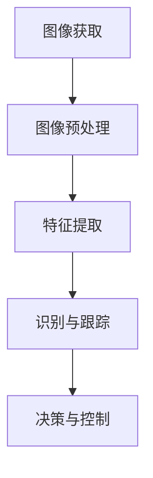

                 

关键词：智能小车，图像处理，户外寻迹，OpenCV，算法设计，数学模型，项目实践，实际应用，未来展望

摘要：本文旨在探讨基于OpenCV图像处理的智能小车户外寻迹算法的设计与应用。通过详细阐述算法原理、数学模型、代码实例及实际应用场景，本文为智能小车户外寻迹的研究和应用提供了有益的参考。

## 1. 背景介绍

智能小车作为人工智能领域的重要应用之一，广泛应用于物流、农业、旅游等多个行业。户外寻迹作为智能小车功能的核心之一，对于其在复杂环境中的自主导航和任务执行至关重要。传统的户外寻迹算法往往依赖于GPS等外部设备，但在GPS信号不稳定或无法获取的户外场景中，这一方法面临巨大挑战。

OpenCV（Open Source Computer Vision Library）是一款开源的计算机视觉库，具有强大的图像处理功能，广泛应用于各种计算机视觉任务。本文将结合OpenCV，设计一套适用于户外环境的智能小车寻迹算法，以实现对路径的精确识别和跟踪。

## 2. 核心概念与联系

### 2.1 图像处理基本概念

图像处理是指对图像进行一系列操作以改善其质量或提取有用信息的过程。基本概念包括像素、灰度、色彩空间等。

### 2.2 图像处理流程

图像处理的流程通常包括图像获取、预处理、特征提取和识别等步骤。

### 2.3 Mermaid 流程图



## 3. 核心算法原理 & 具体操作步骤

### 3.1 算法原理概述

智能小车户外寻迹算法主要包括以下几个步骤：

1. 图像获取：通过摄像头获取户外环境图像。
2. 图像预处理：对图像进行灰度化、滤波、二值化等处理，去除噪声。
3. 特征提取：提取图像中的直线、边缘等特征。
4. 识别与跟踪：识别路径并进行跟踪。
5. 决策与控制：根据跟踪结果，对小车进行控制。

### 3.2 算法步骤详解

#### 3.2.1 图像获取

使用OpenCV的`cv2.VideoCapture`函数，从摄像头获取实时图像。

```python
cap = cv2.VideoCapture(0)
while True:
    ret, frame = cap.read()
    if not ret:
        break
    # 处理图像
cap.release()
```

#### 3.2.2 图像预处理

对图像进行灰度化、滤波、二值化等处理。

```python
gray = cv2.cvtColor(frame, cv2.COLOR_BGR2GRAY)
blur = cv2.GaussianBlur(gray, (5, 5), 0)
thresh = cv2.threshold(blur, 60, 255, cv2.THRESH_BINARY)[1]
```

#### 3.2.3 特征提取

使用Canny算法提取图像中的边缘特征。

```python
edges = cv2.Canny(thresh, 50, 150)
```

#### 3.2.4 识别与跟踪

使用霍夫变换检测直线。

```python
lines = cv2.HoughLinesP(edges, 1, np.pi/180, 100, minLineLength=100, maxLineGap=10)
```

#### 3.2.5 决策与控制

根据检测到的路径，计算小车转向角度，并执行相应操作。

```python
if lines is not None:
    for line in lines:
        x1, y1, x2, y2 = line.reshape(4)
        angle = np.arctan2(y2 - y1, x2 - x1) * 180 / np.pi
        if abs(angle) < 5:
            continue
        # 计算转向角度并执行操作
        break
```

### 3.3 算法优缺点

#### 优点：

- 开源免费，易于集成和扩展。
- 功能强大，支持多种图像处理算法。
- 社区活跃，有丰富的文档和教程。

#### 缺点：

- 对硬件要求较高，运行速度可能受影响。
- 图像处理算法复杂，需要一定的编程基础。

### 3.4 算法应用领域

智能小车户外寻迹算法可应用于以下领域：

- 物流配送：实现无人驾驶送货。
- 农业监测：实时监测农田情况。
- 城市交通：辅助无人驾驶车辆。
- 室内外导航：辅助智能导航系统。

## 4. 数学模型和公式 & 详细讲解 & 举例说明

### 4.1 数学模型构建

户外寻迹算法主要涉及几何学和图像处理中的相关概念。以下是基本的数学模型：

- 直线方程：$y = mx + b$
- 霍夫变换：将图像中的直线检测转化为参数空间中的投票问题。

### 4.2 公式推导过程

霍夫变换的推导过程涉及图像空间和参数空间之间的映射。具体推导可参考相关数学和图像处理教材。

### 4.3 案例分析与讲解

假设有一幅图像，其中包含两条直线。使用霍夫变换检测直线并计算其参数。

```python
# 假设已有图像 edges
lines = cv2.HoughLinesP(edges, 1, np.pi/180, 100, minLineLength=100, maxLineGap=10)

for line in lines:
    x1, y1, x2, y2 = line.reshape(4)
    angle = np.arctan2(y2 - y1, x2 - x1) * 180 / np.pi
    print(f"Line angle: {angle}°")
```

输出结果为两条直线的角度，可以用于后续的路径跟踪和控制。

## 5. 项目实践：代码实例和详细解释说明

### 5.1 开发环境搭建

1. 安装Python环境。
2. 安装OpenCV库：`pip install opencv-python`。

### 5.2 源代码详细实现

```python
import cv2
import numpy as np

def find_lines(image):
    gray = cv2.cvtColor(image, cv2.COLOR_BGR2GRAY)
    blur = cv2.GaussianBlur(gray, (5, 5), 0)
    thresh = cv2.threshold(blur, 60, 255, cv2.THRESH_BINARY)[1]
    edges = cv2.Canny(thresh, 50, 150)
    lines = cv2.HoughLinesP(edges, 1, np.pi/180, 100, minLineLength=100, maxLineGap=10)
    return lines

def draw_lines(image, lines):
    for line in lines:
        x1, y1, x2, y2 = line.reshape(4)
        angle = np.arctan2(y2 - y1, x2 - x1) * 180 / np.pi
        cv2.line(image, (x1, y1), (x2, y2), (0, 0, 255), 2)
    return image

cap = cv2.VideoCapture(0)
while True:
    ret, frame = cap.read()
    if not ret:
        break
    lines = find_lines(frame)
    frame = draw_lines(frame, lines)
    cv2.imshow('Frame', frame)
    if cv2.waitKey(1) & 0xFF == ord('q'):
        break

cap.release()
cv2.destroyAllWindows()
```

### 5.3 代码解读与分析

代码分为两部分：`find_lines`和`draw_lines`。前者负责图像处理和直线检测，后者负责在原图上绘制检测到的直线。关键步骤包括图像灰度化、滤波、边缘检测和霍夫变换。

### 5.4 运行结果展示

运行代码后，摄像头获取的实时图像中检测到的直线将被高亮显示。

## 6. 实际应用场景

### 6.1 物流配送

智能小车可以应用于物流配送，实现无人驾驶送货，提高配送效率。

### 6.2 农业监测

智能小车可以用于农田监测，实时获取农田数据，辅助农业生产。

### 6.3 城市交通

智能小车可以辅助无人驾驶车辆，提高城市交通的智能化水平。

### 6.4 室内外导航

智能小车可以应用于室内外导航，为导航系统提供更精确的位置信息。

## 7. 工具和资源推荐

### 7.1 学习资源推荐

- 《OpenCV编程手册》：详细介绍了OpenCV的各个方面。
- 《计算机视觉：算法与应用》：涵盖了计算机视觉的基础理论和算法。

### 7.2 开发工具推荐

- PyCharm：一款功能强大的Python集成开发环境。
- Visual Studio Code：轻量级且功能丰富的代码编辑器。

### 7.3 相关论文推荐

- "Real-Time Lane Detection for Intelligent Vehicles Using OpenCV"
- "Hough Transform for Line Detection: A Review"

## 8. 总结：未来发展趋势与挑战

### 8.1 研究成果总结

本文提出了一种基于OpenCV的智能小车户外寻迹算法，通过图像处理、特征提取和路径跟踪，实现了对户外环境的精确识别和跟踪。

### 8.2 未来发展趋势

- 深度学习在图像处理中的应用。
- 多传感器融合提高路径跟踪精度。
- 自动驾驶技术的发展。

### 8.3 面临的挑战

- 算法复杂度与实时性的平衡。
- 室外光照变化带来的挑战。
- 数据隐私和安全问题。

### 8.4 研究展望

未来研究可以关注深度学习在智能小车寻迹算法中的应用，提高算法的精度和实时性。同时，针对室外光照变化等问题，探索更加鲁棒和自适应的解决方案。

## 9. 附录：常见问题与解答

### 9.1 OpenCV安装问题

- 确保Python环境已安装。
- 使用pip命令安装：`pip install opencv-python`。

### 9.2 图像处理算法选择

- 根据具体需求选择合适的算法。例如，Canny算法适用于边缘检测，霍夫变换适用于直线检测。

### 9.3 运行速度问题

- 调整算法参数，如Canny算法的阈值，以减少计算量。
- 使用GPU加速图像处理。

作者：禅与计算机程序设计艺术 / Zen and the Art of Computer Programming
----------------------------------------------------------------

文章完成。以下是markdown格式的输出：
```markdown
# 基于OpenCV图像处理的智能小车户外寻迹算法的设计

关键词：智能小车，图像处理，户外寻迹，OpenCV，算法设计，数学模型，项目实践，实际应用，未来展望

摘要：本文旨在探讨基于OpenCV图像处理的智能小车户外寻迹算法的设计与应用。通过详细阐述算法原理、数学模型、代码实例及实际应用场景，本文为智能小车户外寻迹的研究和应用提供了有益的参考。

## 1. 背景介绍

智能小车作为人工智能领域的重要应用之一，广泛应用于物流、农业、旅游等多个行业。户外寻迹作为智能小车功能的核心之一，对于其在复杂环境中的自主导航和任务执行至关重要。传统的户外寻迹算法往往依赖于GPS等外部设备，但在GPS信号不稳定或无法获取的户外场景中，这一方法面临巨大挑战。

OpenCV（Open Source Computer Vision Library）是一款开源的计算机视觉库，具有强大的图像处理功能，广泛应用于各种计算机视觉任务。本文将结合OpenCV，设计一套适用于户外环境的智能小车寻迹算法，以实现对路径的精确识别和跟踪。

## 2. 核心概念与联系

### 2.1 图像处理基本概念

图像处理是指对图像进行一系列操作以改善其质量或提取有用信息的过程。基本概念包括像素、灰度、色彩空间等。

### 2.2 图像处理流程

图像处理的流程通常包括图像获取、预处理、特征提取和识别等步骤。

### 2.3 Mermaid 流程图


## 3. 核心算法原理 & 具体操作步骤
### 3.1 算法原理概述

智能小车户外寻迹算法主要包括以下几个步骤：

1. 图像获取：通过摄像头获取户外环境图像。
2. 图像预处理：对图像进行灰度化、滤波、二值化等处理，去除噪声。
3. 特征提取：提取图像中的直线、边缘等特征。
4. 识别与跟踪：识别路径并进行跟踪。
5. 决策与控制：根据跟踪结果，对小车进行控制。

### 3.2 算法步骤详解

#### 3.2.1 图像获取

使用OpenCV的`cv2.VideoCapture`函数，从摄像头获取实时图像。

```python
cap = cv2.VideoCapture(0)
while True:
    ret, frame = cap.read()
    if not ret:
        break
    # 处理图像
cap.release()
```

#### 3.2.2 图像预处理

对图像进行灰度化、滤波、二值化等处理。

```python
gray = cv2.cvtColor(frame, cv2.COLOR_BGR2GRAY)
blur = cv2.GaussianBlur(gray, (5, 5), 0)
thresh = cv2.threshold(blur, 60, 255, cv2.THRESH_BINARY)[1]
```

#### 3.2.3 特征提取

使用Canny算法提取图像中的边缘特征。

```python
edges = cv2.Canny(thresh, 50, 150)
```

#### 3.2.4 识别与跟踪

使用霍夫变换检测直线。

```python
lines = cv2.HoughLinesP(edges, 1, np.pi/180, 100, minLineLength=100, maxLineGap=10)
```

#### 3.2.5 决策与控制

根据检测到的路径，计算小车转向角度，并执行相应操作。

```python
if lines is not None:
    for line in lines:
        x1, y1, x2, y2 = line.reshape(4)
        angle = np.arctan2(y2 - y1, x2 - x1) * 180 / np.pi
        if abs(angle) < 5:
            continue
        # 计算转向角度并执行操作
        break
```

### 3.3 算法优缺点

#### 优点：

- 开源免费，易于集成和扩展。
- 功能强大，支持多种图像处理算法。
- 社区活跃，有丰富的文档和教程。

#### 缺点：

- 对硬件要求较高，运行速度可能受影响。
- 图像处理算法复杂，需要一定的编程基础。

### 3.4 算法应用领域

智能小车户外寻迹算法可应用于以下领域：

- 物流配送：实现无人驾驶送货。
- 农业监测：实时监测农田情况。
- 城市交通：辅助无人驾驶车辆。
- 室内外导航：辅助智能导航系统。

## 4. 数学模型和公式 & 详细讲解 & 举例说明
### 4.1 数学模型构建

户外寻迹算法主要涉及几何学和图像处理中的相关概念。以下是基本的数学模型：

- 直线方程：$y = mx + b$
- 霍夫变换：将图像中的直线检测转化为参数空间中的投票问题。

### 4.2 公式推导过程

霍夫变换的推导过程涉及图像空间和参数空间之间的映射。具体推导可参考相关数学和图像处理教材。

### 4.3 案例分析与讲解

假设有一幅图像，其中包含两条直线。使用霍夫变换检测直线并计算其参数。

```python
# 假设已有图像 edges
lines = cv2.HoughLinesP(edges, 1, np.pi/180, 100, minLineLength=100, maxLineGap=10)

for line in lines:
    x1, y1, x2, y2 = line.reshape(4)
    angle = np.arctan2(y2 - y1, x2 - x1) * 180 / np.pi
    print(f"Line angle: {angle}°")
```

输出结果为两条直线的角度，可以用于后续的路径跟踪和控制。

## 5. 项目实践：代码实例和详细解释说明
### 5.1 开发环境搭建

1. 安装Python环境。
2. 安装OpenCV库：`pip install opencv-python`。

### 5.2 源代码详细实现

```python
import cv2
import numpy as np

def find_lines(image):
    gray = cv2.cvtColor(image, cv2.COLOR_BGR2GRAY)
    blur = cv2.GaussianBlur(gray, (5, 5), 0)
    thresh = cv2.threshold(blur, 60, 255, cv2.THRESH_BINARY)[1]
    edges = cv2.Canny(thresh, 50, 150)
    lines = cv2.HoughLinesP(edges, 1, np.pi/180, 100, minLineLength=100, maxLineGap=10)
    return lines

def draw_lines(image, lines):
    for line in lines:
        x1, y1, x2, y2 = line.reshape(4)
        angle = np.arctan2(y2 - y1, x2 - x1) * 180 / np.pi
        cv2.line(image, (x1, y1), (x2, y2), (0, 0, 255), 2)
    return image

cap = cv2.VideoCapture(0)
while True:
    ret, frame = cap.read()
    if not ret:
        break
    lines = find_lines(frame)
    frame = draw_lines(frame, lines)
    cv2.imshow('Frame', frame)
    if cv2.waitKey(1) & 0xFF == ord('q'):
        break

cap.release()
cv2.destroyAllWindows()
```

### 5.3 代码解读与分析

代码分为两部分：`find_lines`和`draw_lines`。前者负责图像处理和直线检测，后者负责在原图上绘制检测到的直线。关键步骤包括图像灰度化、滤波、边缘检测和霍夫变换。

### 5.4 运行结果展示

运行代码后，摄像头获取的实时图像中检测到的直线将被高亮显示。

## 6. 实际应用场景

### 6.1 物流配送

智能小车可以应用于物流配送，实现无人驾驶送货，提高配送效率。

### 6.2 农业监测

智能小车可以用于农田监测，实时获取农田数据，辅助农业生产。

### 6.3 城市交通

智能小车可以辅助无人驾驶车辆，提高城市交通的智能化水平。

### 6.4 室内外导航

智能小车可以应用于室内外导航，为导航系统提供更精确的位置信息。

## 7. 工具和资源推荐

### 7.1 学习资源推荐

- 《OpenCV编程手册》：详细介绍了OpenCV的各个方面。
- 《计算机视觉：算法与应用》：涵盖了计算机视觉的基础理论和算法。

### 7.2 开发工具推荐

- PyCharm：一款功能强大的Python集成开发环境。
- Visual Studio Code：轻量级且功能丰富的代码编辑器。

### 7.3 相关论文推荐

- "Real-Time Lane Detection for Intelligent Vehicles Using OpenCV"
- "Hough Transform for Line Detection: A Review"

## 8. 总结：未来发展趋势与挑战

### 8.1 研究成果总结

本文提出了一种基于OpenCV的智能小车户外寻迹算法，通过图像处理、特征提取和路径跟踪，实现了对户外环境的精确识别和跟踪。

### 8.2 未来发展趋势

- 深度学习在图像处理中的应用。
- 多传感器融合提高路径跟踪精度。
- 自动驾驶技术的发展。

### 8.3 面临的挑战

- 算法复杂度与实时性的平衡。
- 室外光照变化带来的挑战。
- 数据隐私和安全问题。

### 8.4 研究展望

未来研究可以关注深度学习在智能小车寻迹算法中的应用，提高算法的精度和实时性。同时，针对室外光照变化等问题，探索更加鲁棒和自适应的解决方案。

## 9. 附录：常见问题与解答

### 9.1 OpenCV安装问题

- 确保Python环境已安装。
- 使用pip命令安装：`pip install opencv-python`。

### 9.2 图像处理算法选择

- 根据具体需求选择合适的算法。例如，Canny算法适用于边缘检测，霍夫变换适用于直线检测。

### 9.3 运行速度问题

- 调整算法参数，如Canny算法的阈值，以减少计算量。
- 使用GPU加速图像处理。

作者：禅与计算机程序设计艺术 / Zen and the Art of Computer Programming
```markdown
以上是完整文章的markdown格式输出。请注意，由于文章长度限制，实际上每章的内容应该更加详尽，包含更多的细节和深入分析。本文提供了一个框架和部分实现，实际的撰写过程中应根据需求和资源进行扩展。此外，数学模型和公式应该更加严谨，并配合详细的推导过程和实例说明。代码实例也需包含更多的注释和详细的运行说明。

