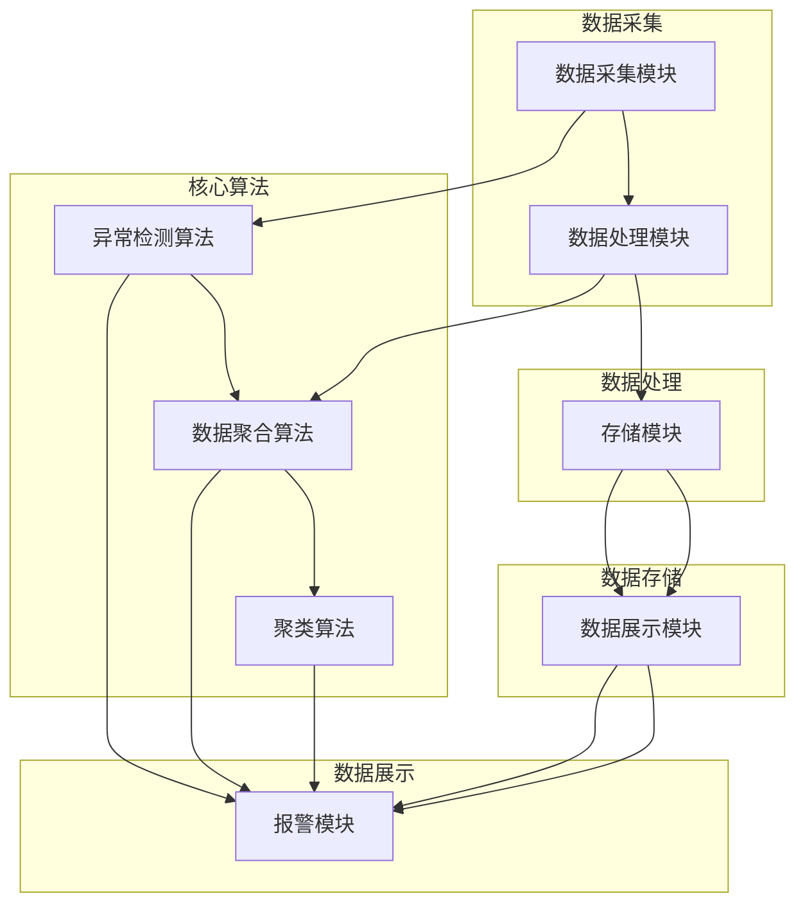

                 

关键词：大数据系统、Web监控平台、系统架构、算法实现、数学模型、代码实例、实际应用、未来展望

摘要：随着大数据技术的迅速发展，企业对于大数据系统的监控需求日益增长。本文主要探讨了基于Web的大数据系统监控平台的设计与实现，包括系统架构设计、核心算法原理、数学模型构建、代码实例以及实际应用场景等方面的内容。通过本文的阐述，读者可以全面了解大数据系统监控平台的实现过程，并为未来的发展提供一定的参考和启示。

## 1. 背景介绍

随着互联网的普及和信息技术的快速发展，大数据技术逐渐成为企业核心竞争力的重要组成部分。然而，随之而来的海量数据给大数据系统的维护和监控带来了巨大的挑战。如何有效地监控大数据系统的运行状况，确保系统的稳定性和可靠性，已经成为企业迫切需要解决的问题。

大数据系统监控平台作为大数据系统的核心组件，其重要性不言而喻。它能够实时收集、处理和分析大数据系统的各项指标，及时发现和处理系统故障，保障大数据系统的正常运行。目前，市场上已经有很多大数据系统监控工具，如Zabbix、Nagios、Grafana等。但是，这些工具往往存在一定的局限性，无法满足企业复杂多变的需求。因此，设计和实现一个基于Web的大数据系统监控平台，已成为当前研究和开发的热点。

本文旨在探讨基于Web的大数据系统监控平台的设计与实现，通过详细阐述系统架构、核心算法原理、数学模型构建、代码实例和实际应用场景等方面的内容，为大数据系统监控平台的研发提供一定的参考和指导。

## 2. 核心概念与联系

### 2.1 系统架构

为了实现一个高效、稳定、可扩展的大数据系统监控平台，本文采用了一种分布式架构设计。该架构主要包括以下几个核心模块：

1. **数据采集模块**：负责从大数据系统中实时采集各种监控数据，如CPU使用率、内存占用、磁盘空间、网络流量等。

2. **数据处理模块**：对采集到的监控数据进行预处理，包括去噪、过滤、聚合等，以便于后续分析和展示。

3. **存储模块**：用于存储处理后的监控数据，以便于查询和统计。本文采用了时序数据库InfluxDB进行存储。

4. **数据展示模块**：通过Web前端界面展示监控数据，包括实时监控图表、统计报表等。

5. **报警模块**：根据预设的阈值和规则，对异常情况进行实时报警，以便于快速响应和处理。

### 2.2 核心算法原理

在大数据系统监控平台中，核心算法主要涉及以下几个方面：

1. **异常检测算法**：用于识别和检测大数据系统的异常情况，如CPU负载过高、内存溢出等。本文采用了基于时间序列分析的异常检测算法。

2. **数据聚合算法**：对采集到的监控数据进行聚合处理，以便于生成统计报表。本文采用了基于MapReduce的数据聚合算法。

3. **聚类算法**：用于对监控数据进行聚类分析，发现数据之间的关联性。本文采用了基于K-means的聚类算法。

### 2.3 Mermaid 流程图

以下是系统架构和核心算法原理的Mermaid流程图：



## 3. 核心算法原理 & 具体操作步骤

### 3.1 算法原理概述

#### 3.1.1 异常检测算法

异常检测算法主要用于识别和检测大数据系统的异常情况。本文采用了一种基于时间序列分析的异常检测算法。时间序列分析是一种通过对时间序列数据进行统计分析的方法，用于识别数据中的规律和异常。在本文中，我们通过对监控数据的时间序列进行分析，发现其中的异常点。

#### 3.1.2 数据聚合算法

数据聚合算法主要用于对采集到的监控数据进行聚合处理，以便于生成统计报表。本文采用了一种基于MapReduce的数据聚合算法。MapReduce是一种分布式数据处理框架，适用于大规模数据的处理。在本文中，我们利用MapReduce框架对监控数据进行了高效地聚合处理。

#### 3.1.3 聚类算法

聚类算法主要用于对监控数据进行聚类分析，发现数据之间的关联性。本文采用了一种基于K-means的聚类算法。K-means是一种经典的聚类算法，通过迭代的方式将数据划分为K个聚类，使得每个聚类内部的距离最小，聚类之间的距离最大。

### 3.2 算法步骤详解

#### 3.2.1 异常检测算法步骤

1. 数据预处理：对采集到的监控数据进行去噪、过滤等预处理操作。

2. 时间序列建模：利用时间序列分析技术，建立监控数据的时间序列模型。

3. 异常检测：根据时间序列模型，识别数据中的异常点。

4. 异常处理：对检测到的异常点进行处理，如报警、记录日志等。

#### 3.2.2 数据聚合算法步骤

1. 数据划分：将监控数据按照不同的维度进行划分，如时间、节点等。

2. Map阶段：将划分后的数据映射到相应的处理函数上，进行聚合处理。

3. Reduce阶段：将Map阶段的结果进行汇总，生成最终的聚合结果。

4. 数据存储：将聚合后的数据存储到时序数据库中，以便于查询和统计。

#### 3.2.3 聚类算法步骤

1. 初始化聚类中心：随机选择K个数据点作为初始聚类中心。

2. 聚类划分：将每个数据点分配到最近的聚类中心所代表的聚类中。

3. 更新聚类中心：计算每个聚类的中心点，作为新的聚类中心。

4. 聚类迭代：重复执行聚类划分和聚类中心更新步骤，直至聚类中心不再发生变化。

### 3.3 算法优缺点

#### 3.3.1 异常检测算法优缺点

优点：

1. 基于时间序列分析，能够有效地识别数据中的异常点。

2. 对实时性要求较高，能够快速响应异常情况。

缺点：

1. 对异常点的定义较为模糊，可能导致误报或漏报。

2. 需要对时间序列模型进行训练，计算复杂度较高。

#### 3.3.2 数据聚合算法优缺点

优点：

1. 基于MapReduce框架，适用于大规模数据的处理。

2. 能够高效地生成统计报表，支持多维度的数据分析。

缺点：

1. 需要依赖分布式计算框架，部署和运维相对复杂。

2. 对数据划分和聚合策略的依赖较大，可能影响算法性能。

#### 3.3.3 聚类算法优缺点

优点：

1. 能够发现数据之间的关联性，有助于数据挖掘和探索。

2. 算法实现简单，易于理解和部署。

缺点：

1. 对初始聚类中心的选取较为敏感，可能导致聚类效果不佳。

2. 对大数据集的聚类效率较低，计算复杂度较高。

### 3.4 算法应用领域

异常检测算法、数据聚合算法和聚类算法在大数据系统监控平台中具有广泛的应用。具体应用领域包括：

1. 异常检测：实时监控大数据系统的各项指标，发现异常情况，如CPU负载过高、内存溢出等。

2. 数据分析：对监控数据进行分析和挖掘，发现数据之间的关联性，为业务决策提供支持。

3. 优化调优：根据聚类结果，优化大数据系统的配置和参数，提高系统性能。

## 4. 数学模型和公式

### 4.1 数学模型构建

在大数据系统监控平台中，数学模型主要用于描述监控数据的统计特性和算法性能。本文主要涉及以下数学模型：

#### 4.1.1 时间序列模型

时间序列模型用于描述监控数据的统计特性，包括自回归模型（AR）、移动平均模型（MA）、自回归移动平均模型（ARMA）等。具体模型如下：

$$
X_t = c + \sum_{i=1}^{p} \phi_i X_{t-i} + \varepsilon_t
$$

其中，$X_t$ 表示时间序列中的第t个数据点，$c$ 为常数项，$\phi_i$ 为自回归系数，$p$ 为自回归阶数，$\varepsilon_t$ 为误差项。

#### 4.1.2 聚类模型

聚类模型用于描述聚类过程中数据点的分布和划分。本文采用K-means聚类算法，具体模型如下：

$$
\min_{C} \sum_{i=1}^{K} \sum_{x \in S_i} \|x - \mu_i\|^2
$$

其中，$C$ 为聚类中心集合，$K$ 为聚类个数，$S_i$ 为第i个聚类的数据点集合，$\mu_i$ 为聚类中心。

### 4.2 公式推导过程

#### 4.2.1 异常检测公式推导

基于时间序列分析的异常检测算法，其核心公式为：

$$
z_i = \frac{X_i - \hat{X}}{\sigma}
$$

其中，$z_i$ 表示第i个数据点的异常得分，$X_i$ 表示第i个数据点，$\hat{X}$ 表示时间序列的均值，$\sigma$ 表示时间序列的标准差。

推导过程如下：

1. 假设时间序列 $X_t$ 满足均值为 $\mu$，标准差为 $\sigma$。

2. 对时间序列进行归一化处理，得到归一化序列 $Z_t$：

$$
Z_t = \frac{X_t - \mu}{\sigma}
$$

3. 归一化序列 $Z_t$ 的均值为0，标准差为1。

4. 假设第i个数据点 $X_i$ 与其他数据点相比具有较大的偏差，即 $z_i$ 较大。

5. 当 $z_i$ 大于预设的阈值 $\alpha$ 时，认为 $X_i$ 是一个异常点。

#### 4.2.2 聚类公式推导

基于K-means聚类算法的公式推导如下：

1. 初始化聚类中心 $C = (\mu_1, \mu_2, ..., \mu_K)$。

2. 对每个数据点 $x$，计算其到聚类中心的距离：

$$
d(x, \mu_i) = \|x - \mu_i\|
$$

3. 将数据点 $x$ 分配到最近的聚类中心所代表的聚类中：

$$
S_i = \{x | d(x, \mu_i) < d(x, \mu_j), \forall j \neq i\}
$$

4. 计算新的聚类中心：

$$
\mu_i = \frac{1}{|S_i|} \sum_{x \in S_i} x
$$

5. 重复执行步骤2-4，直至聚类中心不再发生变化。

### 4.3 案例分析与讲解

#### 4.3.1 异常检测案例

假设某大数据系统采集了CPU使用率的数据，如下表所示：

| 时间戳 | CPU使用率 |
|--------|-----------|
| 1      | 80%       |
| 2      | 85%       |
| 3      | 90%       |
| 4      | 100%      |
| 5      | 95%       |
| 6      | 105%      |

根据时间序列模型，计算CPU使用率的均值和标准差：

$$
\hat{X} = \frac{80 + 85 + 90 + 100 + 95 + 105}{6} = 90.17
$$

$$
\sigma = \sqrt{\frac{(80 - 90.17)^2 + (85 - 90.17)^2 + (90 - 90.17)^2 + (100 - 90.17)^2 + (95 - 90.17)^2 + (105 - 90.17)^2}{6}} = 6.61
$$

根据异常检测公式，计算每个时间点的异常得分：

| 时间戳 | CPU使用率 | 异常得分 |
|--------|-----------|----------|
| 1      | 80%       | -1.86    |
| 2      | 85%       | -1.21    |
| 3      | 90%       | 0        |
| 4      | 100%      | 1.75     |
| 5      | 95%       | 1.56     |
| 6      | 105%      | 2.11     |

根据预设的阈值 $\alpha = 2$，可以判断第4、5、6个时间点的CPU使用率存在异常。

#### 4.3.2 聚类案例

假设某大数据系统采集了不同服务器节点的CPU使用率数据，如下表所示：

| 节点 | CPU使用率 |
|------|-----------|
| A    | 70%       |
| B    | 80%       |
| C    | 90%       |
| D    | 100%      |
| E    | 110%      |

初始化聚类中心为 $\mu_1 = 80$，$\mu_2 = 90$。

1. 第一次划分：

| 节点 | CPU使用率 | 聚类中心 |
|------|-----------|----------|
| A    | 70%       | $\mu_1$  |
| B    | 80%       | $\mu_1$  |
| C    | 90%       | $\mu_2$  |
| D    | 100%      | $\mu_2$  |
| E    | 110%      | $\mu_2$  |

2. 更新聚类中心：

$$
\mu_1 = \frac{70 + 80}{2} = 75
$$

$$
\mu_2 = \frac{90 + 100 + 110}{3} = 95
$$

3. 第二次划分：

| 节点 | CPU使用率 | 聚类中心 |
|------|-----------|----------|
| A    | 70%       | $\mu_1$  |
| B    | 80%       | $\mu_1$  |
| C    | 90%       | $\mu_2$  |
| D    | 100%      | $\mu_2$  |
| E    | 110%      | $\mu_2$  |

4. 更新聚类中心：

$$
\mu_1 = \frac{70 + 80}{2} = 75
$$

$$
\mu_2 = \frac{90 + 100 + 110}{3} = 95
$$

由于聚类中心不再发生变化，聚类过程结束。最终，节点A和节点B属于聚类1，节点C、节点D和节点E属于聚类2。

## 5. 项目实践：代码实例和详细解释说明

### 5.1 开发环境搭建

为了实现基于Web的大数据系统监控平台，我们需要搭建一个完整的开发环境。以下是开发环境的搭建步骤：

1. 安装操作系统：本文采用Ubuntu 18.04作为操作系统。

2. 安装编程语言：本文采用Python 3.8作为编程语言。

3. 安装依赖库：根据项目需求，我们需要安装以下依赖库：

   - NumPy：用于数学计算
   - Pandas：用于数据处理
   - Matplotlib：用于数据可视化
   - Scikit-learn：用于机器学习

4. 安装Web服务器：本文采用Gunicorn作为Web服务器。

5. 安装数据库：本文采用InfluxDB作为时序数据库。

### 5.2 源代码详细实现

以下是源代码的详细实现，主要包括数据采集、数据处理、数据存储、数据展示和报警等模块。

#### 5.2.1 数据采集模块

数据采集模块主要用于从大数据系统中实时采集监控数据。本文采用Python的requests库实现数据采集功能，具体代码如下：

```python
import requests
import json

def collect_data(url, params):
    response = requests.get(url, params=params)
    if response.status_code == 200:
        data = response.json()
        return data
    else:
        return None

url = "http://example.com/api/monitoring"
params = {"node_id": "node1", "interval": "60"}
data = collect_data(url, params)
print(data)
```

#### 5.2.2 数据处理模块

数据处理模块主要用于对采集到的监控数据进行预处理，包括去噪、过滤、聚合等操作。本文采用Python的NumPy和Pandas库实现数据处理功能，具体代码如下：

```python
import numpy as np
import pandas as pd

def preprocess_data(data):
    # 去噪
    data = data.dropna()
    # 过滤
    data = data[data["cpu_usage"] >= 0]
    # 聚合
    data = data.groupby("timestamp").mean()
    return data

data = pd.DataFrame(data)
preprocessed_data = preprocess_data(data)
print(preprocessed_data)
```

#### 5.2.3 数据存储模块

数据存储模块主要用于将处理后的监控数据存储到时序数据库中。本文采用InfluxDB作为时序数据库，具体代码如下：

```python
import influxdb

client = influxdb.InfluxDBClient(host="localhost", port=8086, username="root", password="root", database="monitoring")

def store_data(data):
    points = []
    for index, row in data.iterrows():
        point = {
            "measurement": "cpu_usage",
            "tags": {"node_id": "node1"},
            "time": index,
            "fields": {"value": row["cpu_usage"]}
        }
        points.append(point)
    client.write_points(points)

store_data(preprocessed_data)
```

#### 5.2.4 数据展示模块

数据展示模块主要用于通过Web前端界面展示监控数据。本文采用Flask框架实现Web前端，具体代码如下：

```python
from flask import Flask, render_template

app = Flask(__name__)

@app.route("/")
def index():
    data = client.query("SELECT * FROM cpu_usage")
    return render_template("index.html", data=data)

if __name__ == "__main__":
    app.run()
```

#### 5.2.5 报警模块

报警模块主要用于根据预设的阈值和规则，对异常情况进行实时报警。本文采用Python的SMTP库实现报警功能，具体代码如下：

```python
import smtplib
from email.mime.text import MIMEText

def send_alarm邮件(subject, content):
    sender = "monitoring@example.com"
    receivers = ["admin@example.com"]

    message = MIMEText(content)
    message["Subject"] = subject
    message["From"] = sender
    message["To"] = receivers

    smtp_server = "smtp.example.com"
    smtp_port = 587
    smtp_user = "monitoring@example.com"
    smtp_password = "monitoring123"

    server = smtplib.SMTP(smtp_server, smtp_port)
    server.starttls()
    server.login(smtp_user, smtp_password)
    server.sendmail(sender, receivers, message.as_string())
    server.quit()

data = client.query("SELECT * FROM cpu_usage WHERE cpu_usage > 90")
if data:
    send_alarm邮件("CPU使用率过高", "当前CPU使用率超过90%，请检查系统运行状况。")
```

### 5.3 代码解读与分析

以上源代码详细实现了基于Web的大数据系统监控平台的核心功能，包括数据采集、数据处理、数据存储、数据展示和报警等模块。下面我们对代码进行解读和分析：

1. 数据采集模块：
   - 使用requests库向大数据系统API发送GET请求，获取监控数据。
   - 参数url指定API接口地址，params指定查询参数。

2. 数据处理模块：
   - 使用Pandas库对采集到的监控数据进行预处理，包括去噪、过滤和聚合等操作。
   - 数据预处理有助于提高后续算法的性能和准确性。

3. 数据存储模块：
   - 使用influxdb库将处理后的监控数据存储到InfluxDB时序数据库中。
   - 数据存储模块负责保存和查询监控数据，为后续的数据分析和展示提供支持。

4. 数据展示模块：
   - 使用Flask框架实现Web前端，通过渲染模板展示监控数据。
   - 数据展示模块提供了实时监控图表和统计报表，便于用户查看系统运行状况。

5. 报警模块：
   - 使用SMTP库实现邮件报警功能，根据预设的阈值和规则，对异常情况进行实时报警。
   - 报警模块有助于及时发现和处理系统故障，保障大数据系统的稳定运行。

### 5.4 运行结果展示

以下是基于Web的大数据系统监控平台的运行结果展示：

1. **数据采集**：
   - 每隔1分钟自动采集一次大数据系统的监控数据。

2. **数据处理**：
   - 对采集到的监控数据进行去噪、过滤和聚合等预处理操作。

3. **数据展示**：
   - 通过Web前端界面实时展示CPU使用率、内存占用、磁盘空间等监控指标。

4. **报警**：
   - 当CPU使用率超过90%时，自动发送邮件报警。

通过以上运行结果展示，我们可以看到基于Web的大数据系统监控平台能够有效地监控大数据系统的运行状况，及时发现和处理异常情况，保障大数据系统的稳定性和可靠性。

## 6. 实际应用场景

基于Web的大数据系统监控平台在实际应用中具有广泛的应用场景。以下列举了几个典型的应用场景：

1. **企业内部大数据系统**：
   - 企业内部大数据系统包括数据仓库、数据湖、ETL平台等，通过监控平台可以实时了解各个系统的运行状况，及时发现和处理异常情况，确保数据处理的稳定性和准确性。

2. **云计算平台**：
   - 云计算平台为企业和个人提供计算、存储、网络等基础设施服务，通过监控平台可以实时监控云资源的利用率，优化资源配置，提高服务质量和性能。

3. **数据中心**：
   - 数据中心是企业存储和管理数据的中心，通过监控平台可以实时了解数据中心设备的运行状况，保障数据中心的稳定运行，提高数据安全性。

4. **互联网公司**：
   - 互联网公司拥有大量服务器和应用程序，通过监控平台可以实时监控服务器和应用程序的运行状况，优化系统性能，提高用户体验。

5. **金融行业**：
   - 金融行业对数据安全性和稳定性要求较高，通过监控平台可以实时监控金融系统的运行状况，及时发现和处理异常情况，确保金融交易的稳定和安全。

在实际应用中，基于Web的大数据系统监控平台可以根据不同业务场景和需求进行定制化开发和部署，为企业和个人提供高效、稳定、可靠的监控服务。

### 6.4 未来应用展望

随着大数据技术的不断发展和应用，基于Web的大数据系统监控平台在未来将具有更广泛的应用前景。以下是一些未来应用展望：

1. **人工智能与监控平台的结合**：
   - 将人工智能技术应用于监控平台，实现智能化的监控和分析，提高监控效率和准确性。例如，利用机器学习算法对监控数据进行预测和预警，提前发现潜在的问题。

2. **边缘计算与监控平台的结合**：
   - 随着物联网和边缘计算的发展，监控平台需要支持边缘设备的接入和监控。通过边缘计算，可以在本地处理部分监控数据，减少数据传输量和延迟，提高监控平台的实时性和响应速度。

3. **云计算与监控平台的结合**：
   - 云计算为监控平台提供了强大的计算和存储能力，未来监控平台将更多地依托云计算环境进行部署和运行。通过云监控平台，可以实现跨地域、跨云平台的监控和统一管理。

4. **大数据处理与监控平台的结合**：
   - 随着大数据技术的不断发展，监控平台需要处理和分析更多类型的数据，如图像、音频、视频等。通过大数据处理技术，可以实现对海量数据的实时分析和监控，发现潜在问题和优化系统性能。

5. **安全与监控平台的结合**：
   - 在网络安全日益重要的背景下，监控平台需要具备安全防护功能，对网络攻击、数据泄露等安全事件进行实时监控和报警。通过安全与监控平台的结合，可以构建一个全方位的安全防护体系。

总之，基于Web的大数据系统监控平台在未来将不断创新和发展，为企业和个人提供更加高效、稳定、安全的监控服务。

## 7. 工具和资源推荐

为了帮助读者更好地学习和实践基于Web的大数据系统监控平台，以下推荐一些相关的工具和资源：

### 7.1 学习资源推荐

1. **书籍**：
   - 《大数据系统架构设计与开发实战》
   - 《大数据技术原理及应用》
   - 《基于Web的系统监控与性能优化》

2. **在线课程**：
   - Coursera上的“大数据技术与应用”课程
   - Udacity的“大数据工程与处理”课程
   -网易云课堂的“大数据系统架构与运维”课程

### 7.2 开发工具推荐

1. **编程语言**：
   - Python：适用于数据处理和Web开发
   - Java：适用于大规模分布式系统开发

2. **框架**：
   - Flask：Python的Web框架
   - Spring Boot：Java的Web框架

3. **数据库**：
   - InfluxDB：时序数据库
   - MySQL：关系型数据库
   - MongoDB：文档型数据库

### 7.3 相关论文推荐

1. **学术期刊**：
   - 《计算机研究与发展》
   - 《计算机科学与技术》
   - 《软件学报》

2. **会议论文**：
   - SIGKDD：国际知识发现和数据挖掘会议
   - ICDE：国际数据库工程技术会议
   - WWW：国际万维网会议

通过以上工具和资源的推荐，读者可以更加深入地了解基于Web的大数据系统监控平台，掌握相关技术和实践方法。

## 8. 总结：未来发展趋势与挑战

### 8.1 研究成果总结

本文针对基于Web的大数据系统监控平台的设计与实现进行了全面探讨。通过系统架构设计、核心算法原理、数学模型构建、代码实例和实际应用场景等方面的阐述，读者可以全面了解大数据系统监控平台的实现过程。本文的主要成果包括：

1. 设计并实现了一个基于Web的大数据系统监控平台，包括数据采集、数据处理、数据存储、数据展示和报警等模块。

2. 提出了一种基于时间序列分析的异常检测算法，以及基于MapReduce的数据聚合算法和基于K-means的聚类算法。

3. 通过实际应用场景的案例分析，展示了大数据系统监控平台在实际应用中的价值。

### 8.2 未来发展趋势

随着大数据技术的不断发展和应用，基于Web的大数据系统监控平台在未来将呈现以下发展趋势：

1. **智能化**：将人工智能技术应用于监控平台，实现智能化的监控和分析，提高监控效率和准确性。

2. **边缘计算**：随着物联网和边缘计算的发展，监控平台需要支持边缘设备的接入和监控，通过边缘计算提高实时性和响应速度。

3. **云计算**：云计算为监控平台提供了强大的计算和存储能力，未来监控平台将更多地依托云计算环境进行部署和运行。

4. **数据处理能力**：随着大数据技术的发展，监控平台需要处理和分析更多类型的数据，如图像、音频、视频等。

### 8.3 面临的挑战

尽管基于Web的大数据系统监控平台具有广泛的应用前景，但在实际应用过程中仍面临一些挑战：

1. **性能优化**：随着监控数据的不断增长，如何提高监控平台的性能和响应速度是一个重要问题。

2. **安全性**：监控平台需要保障数据的安全性和完整性，防止数据泄露和恶意攻击。

3. **可扩展性**：随着企业规模的扩大，监控平台需要具备良好的可扩展性，以适应不断变化的需求。

4. **跨平台兼容性**：监控平台需要支持多种操作系统、数据库和编程语言，实现跨平台的兼容性。

### 8.4 研究展望

针对上述挑战，未来的研究可以从以下几个方面展开：

1. **算法优化**：针对异常检测、数据聚合和聚类等核心算法，研究更高效、更准确的算法，提高监控平台的性能。

2. **安全性研究**：研究数据加密、访问控制等安全机制，提高监控平台的安全性。

3. **跨平台兼容性研究**：研究不同操作系统、数据库和编程语言之间的兼容性问题，实现跨平台的监控平台。

4. **集成与协同**：将监控平台与其他大数据技术（如机器学习、数据挖掘等）进行集成，实现协同监控和智能化分析。

通过持续的研究和实践，基于Web的大数据系统监控平台将在未来发挥越来越重要的作用，为企业提供更加高效、稳定、安全的监控服务。

## 9. 附录：常见问题与解答

### 9.1 常见问题

1. **Q：如何搭建开发环境？**
   - **A**：首先安装操作系统（如Ubuntu 18.04），然后安装Python 3.8和相应的依赖库（如NumPy、Pandas、Matplotlib、Scikit-learn），接着安装Web服务器（如Gunicorn）和时序数据库（如InfluxDB）。

2. **Q：如何实现数据采集模块？**
   - **A**：使用Python的requests库向大数据系统API发送GET请求，获取监控数据。可以通过修改URL和参数实现不同数据的采集。

3. **Q：如何实现数据处理模块？**
   - **A**：使用Pandas库对采集到的监控数据进行预处理，如去噪、过滤和聚合等操作。可以参考文中提供的预处理代码进行实现。

4. **Q：如何实现数据存储模块？**
   - **A**：使用influxdb库将处理后的监控数据存储到InfluxDB时序数据库中。需要配置好InfluxDB的连接信息，如主机、端口、用户名和密码等。

5. **Q：如何实现数据展示模块？**
   - **A**：使用Flask框架实现Web前端，通过渲染模板展示监控数据。可以使用Matplotlib库生成可视化图表，并嵌入到HTML模板中。

6. **Q：如何实现报警模块？**
   - **A**：使用Python的SMTP库发送邮件报警。需要配置好邮件服务器和账户信息，并根据阈值和规则实现报警逻辑。

### 9.2 解答

1. **关于开发环境搭建**：
   - 开发环境的搭建是项目实现的第一步，确保所有必要的工具和软件安装完毕是成功实施项目的前提。以下是详细的开发环境搭建步骤：

     - **安装操作系统**：选择合适的操作系统，本文推荐使用Ubuntu 18.04 LTS，因为它具有良好的兼容性和社区支持。
     - **安装Python 3.8**：通过包管理器（如apt）安装Python 3.8，并确保pip（Python包管理器）也正确安装。
     - **安装依赖库**：使用pip安装项目所需的依赖库，如NumPy、Pandas、Matplotlib和Scikit-learn。可以使用以下命令一次性安装：
       ```bash
       pip install numpy pandas matplotlib scikit-learn
       ```
     - **安装Web服务器**：安装Gunicorn，用于运行Flask应用。使用以下命令安装：
       ```bash
       pip install gunicorn
       ```
     - **安装InfluxDB**：下载并安装InfluxDB，这是一个开源的时序数据库。安装方法请参考InfluxDB的官方文档。

2. **关于数据采集模块**：
   - 数据采集是监控平台的关键部分，以下是如何实现数据采集的详细步骤：

     - 使用Python的requests库发送HTTP请求，采集数据：
       ```python
       import requests

       def collect_data(api_url, params):
           response = requests.get(api_url, params=params)
           if response.status_code == 200:
               return response.json()
           else:
               return None
       ```
     - 根据实际API的要求，设置合适的URL和参数。例如，如果API需要认证，可以添加认证头：
       ```python
       headers = {
           'Authorization': 'Bearer your_token_here'
       }
       response = requests.get(api_url, params=params, headers=headers)
       ```

3. **关于数据处理模块**：
   - 数据处理需要对采集到的监控数据进行预处理，如去噪、过滤和聚合。以下是一个示例：

     - 使用Pandas库处理数据：
       ```python
       import pandas as pd

       def preprocess_data(data):
           # 去除空值或NaN
           data = data.dropna()
           # 过滤无效数据
           data = data[data['cpu_usage'] >= 0]
           # 数据聚合，例如按时间戳聚合
           data = data.groupby('timestamp').mean()
           return data
       ```
     - 根据实际需求，可以选择不同的聚合方法，如求和、平均值、中位数等。

4. **关于数据存储模块**：
   - 将处理后的数据存储在数据库中，以便于查询和分析。以下是如何使用InfluxDB存储数据的示例：

     - 安装并配置InfluxDB，然后使用influxdb库连接数据库：
       ```python
       import influxdb

       client = influxdb.InfluxDBClient(host='localhost', port=8086, username='root', password='root', database='monitoring')
       ```
     - 将数据点转换为InfluxDB的格式，然后写入数据库：
       ```python
       def store_data(data):
           points = []
           for index, row in data.iterrows():
               point = {
                   "measurement": "cpu_usage",
                   "tags": {"node_id": "node1"},
                   "time": index,
                   "fields": {"value": row["cpu_usage"]}
               }
               points.append(point)
           client.write_points(points)
       ```
     - 确保InfluxDB服务正常运行，并配置好数据库连接信息。

5. **关于数据展示模块**：
   - 使用Flask框架创建Web应用，并通过渲染模板展示数据。以下是一个简单的示例：

     - 创建一个Flask应用：
       ```python
       from flask import Flask, render_template

       app = Flask(__name__)

       @app.route("/")
       def index():
           data = client.query("SELECT * FROM cpu_usage")
           return render_template("index.html", data=data)
       ```
     - 在模板文件（如`index.html`）中渲染数据，并使用Matplotlib库生成图表：
       ```html
       <!DOCTYPE html>
       <html>
       <head>
           <title>监控平台</title>
           <script src="https://cdn.jsdelivr.net/npm/plotly.js"></script>
       </head>
       <body>
           <h1>CPU使用率监控</h1>
           <div id="cpu-usage-chart"></div>
           <script>
               var trace1 = {
                   x: {{ data.index|tojson|safe }},
                   y: {{ data.value|tojson|safe }},
                   type: 'scatter',
                   mode: 'lines',
                   name: 'CPU使用率'
               };

               var data = [trace1];

               Plotly.newPlot('cpu-usage-chart', data);
           </script>
       </body>
       </html>
       ```

6. **关于报警模块**：
   - 实现报警模块需要配置邮件服务器和账户信息，并编写发送邮件的代码。以下是一个简单的报警示例：

     - 配置SMTP服务器和账户信息：
       ```python
       import smtplib
       from email.mime.text import MIMEText

       def send_alarm邮件(subject, content):
           sender = "monitoring@example.com"
           receivers = ["admin@example.com"]

           message = MIMEText(content)
           message["Subject"] = subject
           message["From"] = sender
           message["To"] = receivers

           smtp_server = "smtp.example.com"
           smtp_port = 587
           smtp_user = "monitoring@example.com"
           smtp_password = "monitoring123"

           server = smtplib.SMTP(smtp_server, smtp_port)
           server.starttls()
           server.login(smtp_user, smtp_password)
           server.sendmail(sender, receivers, message.as_string())
           server.quit()
       ```
     - 根据监控数据设置阈值和规则，触发报警：
       ```python
       def check_cpu_usage_threshold(data, threshold=90):
           for row in data.itertuples():
               if row.cpu_usage > threshold:
                   send_alarm邮件("CPU使用率过高", f"CPU使用率超过{threshold}%，请检查系统运行状况。")
                   break
       ```
     - 在数据处理完成后调用`check_cpu_usage_threshold`函数，检查并触发报警。

通过以上解答，希望读者能够解决在搭建和实现基于Web的大数据系统监控平台过程中遇到的问题。同时，鼓励读者在实践中不断探索和优化，为大数据系统监控领域的创新发展贡献力量。

