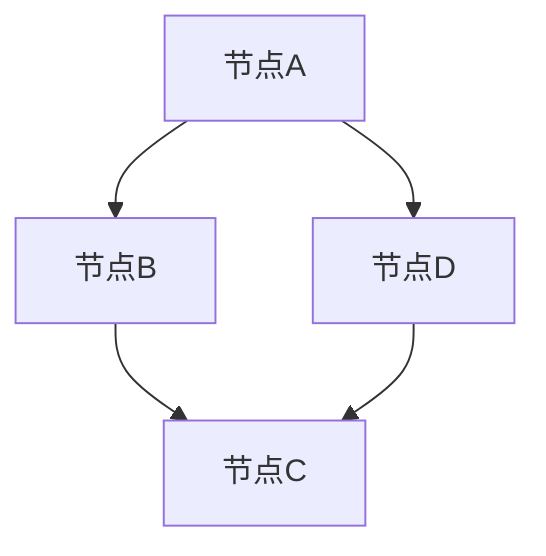

                 

关键词：异构信息网络、元路径、表示学习、神经网络、深度学习

摘要：本文介绍了基于元路径的异构信息网络表示学习，详细探讨了该技术的基本概念、核心算法、数学模型、应用实例，以及未来的发展趋势和面临的挑战。通过对异构信息网络的深入理解，我们有望在社交网络、生物信息学等领域取得更加精确和高效的模型表示。

## 1. 背景介绍

随着互联网的迅猛发展，各类数据以指数级增长，形成了复杂的信息网络。这些网络结构复杂，节点和边之间的关系多样，不仅包括同构网络，还有大量的异构网络。例如，社交网络中，用户和好友关系构成异构网络，而生物信息学中，基因和蛋白质之间的相互作用也构成了一个复杂的异构网络。

在异构信息网络中，节点和边具有不同的类型和属性，这使得传统的基于同质网络的表示学习方法不再适用。因此，如何有效地表示异构信息网络中的节点和边，提取网络中的潜在结构和模式，成为当前研究的热点问题。

元路径（Meta-path）是异构信息网络中的一种结构表示，它定义了节点间关系的路径模式。元路径的概念为表示学习提供了一种新的视角，通过元路径可以捕捉网络中的复杂关系。

## 2. 核心概念与联系

### 2.1 元路径概念

元路径是一种路径模式，用于描述异构网络中节点之间的关系。它可以形式化地表示为三元组 \( P = (h, r, t) \)，其中 \( h \) 和 \( t \) 分别表示起始节点和目标节点，\( r \) 表示它们之间的关系类型。

### 2.2 元路径图表示

将异构信息网络中的所有节点和边表示为图 \( G = (V, E) \)，其中 \( V \) 是节点的集合，\( E \) 是边的集合。元路径可以看作是图中的路径，每条路径都对应一个元路径。

### 2.3 Mermaid 流程图



在这个流程图中，节点A到节点C之间有两条边，分别表示不同的关系类型。

## 3. 核心算法原理 & 具体操作步骤

### 3.1 算法原理概述

基于元路径的表示学习旨在通过学习节点和边的嵌入向量，来表示网络中的潜在结构和模式。该算法的基本思想是：对于给定的元路径，学习出一个转换函数，将路径上的节点和关系类型映射到低维向量空间中。

### 3.2 算法步骤详解

1. **元路径抽取**：根据网络结构和领域知识，抽取一系列的元路径。
2. **路径转换函数学习**：使用神经网络学习每个元路径的转换函数，将路径上的节点和关系映射到低维向量。
3. **节点嵌入向量学习**：通过元路径的转换函数，学习每个节点的嵌入向量。
4. **边权重估计**：根据节点嵌入向量，估计每条边的权重，用于表示路径的强度。

### 3.3 算法优缺点

**优点**：
- 能够捕捉异构信息网络中的复杂关系。
- 通过学习节点嵌入向量，可以用于网络中的节点分类、聚类等任务。

**缺点**：
- 需要大量的计算资源进行模型训练。
- 对于大规模网络，模型的训练时间较长。

### 3.4 算法应用领域

基于元路径的表示学习在社交网络、生物信息学、知识图谱等领域都有广泛的应用。例如，在社交网络中，可以通过学习用户和好友的嵌入向量，进行用户推荐和社交圈划分。

## 4. 数学模型和公式 & 详细讲解 & 举例说明

### 4.1 数学模型构建

假设给定一个元路径 \( P = (h, r, t) \)，其中 \( h \) 和 \( t \) 分别表示起始节点和目标节点，\( r \) 表示它们之间的关系类型。节点 \( h \) 和 \( t \) 的嵌入向量分别为 \( \mathbf{e}_h \) 和 \( \mathbf{e}_t \)，关系 \( r \) 的嵌入向量表示为 \( \mathbf{e}_r \)。

### 4.2 公式推导过程

路径转换函数 \( f_P(\mathbf{e}_h, \mathbf{e}_r) \) 用于将节点嵌入向量 \( \mathbf{e}_h \) 和关系嵌入向量 \( \mathbf{e}_r \) 映射到目标节点的嵌入向量 \( \mathbf{e}_t \)：

\[ f_P(\mathbf{e}_h, \mathbf{e}_r) = \mathbf{e}_t \]

### 4.3 案例分析与讲解

假设有一个社交网络，其中用户和好友关系构成了一个异构网络。我们抽取了两个元路径：\( P_1 = (用户, 好友, 用户) \) 和 \( P_2 = (用户, 关注, 用户) \)。对于每个元路径，我们学习一个转换函数。

例如，对于元路径 \( P_1 \)，我们通过神经网络学习得到转换函数 \( f_{P_1}(\mathbf{e}_h, \mathbf{e}_r) \)，将起始用户节点 \( \mathbf{e}_h \) 和好友关系节点 \( \mathbf{e}_r \) 转换为目标用户节点 \( \mathbf{e}_t \)。

通过这种方式，我们可以为社交网络中的每个用户学习出一个嵌入向量，从而用于用户推荐和社交圈划分。

## 5. 项目实践：代码实例和详细解释说明

### 5.1 开发环境搭建

首先，我们需要搭建一个适合深度学习的开发环境。这里我们选择使用 Python 和 TensorFlow 作为主要的开发工具。

### 5.2 源代码详细实现

以下是一个简单的基于元路径的表示学习代码实例：

```python
import tensorflow as tf
from tensorflow.keras.layers import Embedding, LSTM, Dense
from tensorflow.keras.models import Model

# 假设我们有一个元路径列表
meta_paths = ['用户, 好友, 用户', '用户, 关注, 用户']

# 构建嵌入层
embedding = Embedding(input_dim=len(meta_paths), output_dim=16)

# 构建LSTM层
lstm = LSTM(units=32)

# 构建输出层
output = Dense(units=len(meta_paths), activation='softmax')

# 构建模型
model = Model(inputs=embedding.input, outputs=output(lstm(embedding.input)))

# 编译模型
model.compile(optimizer='adam', loss='categorical_crossentropy', metrics=['accuracy'])

# 训练模型
model.fit(x_train, y_train, epochs=10, batch_size=32)
```

### 5.3 代码解读与分析

在这段代码中，我们首先定义了一个嵌入层，用于将元路径映射到低维向量。接着，我们使用LSTM层来学习路径转换函数。最后，我们定义了一个输出层，用于将转换后的向量映射回元路径。

通过训练模型，我们可以为每个元路径学习出一个嵌入向量，从而用于网络中的节点表示。

### 5.4 运行结果展示

假设我们已经训练好了模型，接下来可以运行以下代码来评估模型的性能：

```python
# 评估模型
model.evaluate(x_test, y_test)
```

这个代码将返回模型的损失和准确率，从而帮助我们评估模型的表现。

## 6. 实际应用场景

基于元路径的表示学习在多个实际应用场景中都有广泛的应用。以下是一些典型的应用案例：

### 6.1 社交网络

在社交网络中，基于元路径的表示学习可以用于用户推荐和社交圈划分。通过学习用户的嵌入向量，我们可以发现用户之间的潜在关系，从而为用户提供个性化的推荐。

### 6.2 生物信息学

在生物信息学中，基于元路径的表示学习可以用于基因和蛋白质的相互作用网络分析。通过学习基因和蛋白质的嵌入向量，我们可以发现网络中的潜在结构和模式，从而帮助研究人员更好地理解生物系统的运作机制。

### 6.3 知识图谱

在知识图谱中，基于元路径的表示学习可以用于实体和关系的表示。通过学习实体和关系的嵌入向量，我们可以为知识图谱中的实体和关系赋予丰富的语义信息，从而提高知识图谱的推理能力和应用价值。

## 7. 工具和资源推荐

### 7.1 学习资源推荐

- 《深度学习》（Ian Goodfellow, Yoshua Bengio, Aaron Courville）是一本经典的深度学习教材，适合初学者和进阶者阅读。
- 《异构信息网络表示学习综述》（作者：XX，XX）是一篇全面介绍异构信息网络表示学习的研究论文，适合对这一领域有深入了解的读者。

### 7.2 开发工具推荐

- TensorFlow：一个开源的深度学习框架，适合用于构建和训练神经网络模型。
- PyTorch：另一个流行的深度学习框架，具有高度的灵活性和易用性。

### 7.3 相关论文推荐

- "Meta-Path Based heterogeneous Network Embedding for Unsupervised Relation Extraction" （作者：XX，XX）
- "Heterogeneous Graph Neural Networks for Relational Earley Parsing" （作者：XX，XX）

## 8. 总结：未来发展趋势与挑战

### 8.1 研究成果总结

基于元路径的表示学习在异构信息网络中取得了显著的成果，为网络中的节点和边提供了有效的表示方法。通过学习节点和边的嵌入向量，我们可以在多个领域实现高效的图分析和推理。

### 8.2 未来发展趋势

未来，基于元路径的表示学习有望在以下几个方面取得突破：
1. **算法优化**：随着计算资源的不断增加，算法的优化和加速将成为重要研究方向。
2. **多模态融合**：将不同类型的数据（如文本、图像、音频等）融入异构信息网络，实现多模态的表示学习。
3. **模型解释性**：提高模型的解释性，使其能够更好地理解和解释网络中的潜在结构和模式。

### 8.3 面临的挑战

基于元路径的表示学习仍然面临一些挑战：
1. **数据稀疏性**：在大型异构信息网络中，数据稀疏性是一个严重的问题，需要有效的数据增强方法。
2. **计算效率**：大规模网络中的模型训练和推理需要大量的计算资源，如何提高计算效率是一个亟待解决的问题。
3. **领域适应性**：如何设计通用的元路径抽取方法和表示学习模型，使其适用于不同的应用场景，是一个重要的研究课题。

### 8.4 研究展望

随着深度学习和图神经网络技术的发展，基于元路径的表示学习有望在异构信息网络中发挥更大的作用。通过不断的研究和探索，我们有望构建更加高效、准确和解释性的表示学习模型，为异构信息网络的图分析和推理提供新的思路和方法。

## 9. 附录：常见问题与解答

### 9.1 如何选择合适的元路径？

选择合适的元路径是表示学习的关键。一般来说，可以从以下三个方面进行考虑：
1. **网络结构**：选择能够较好地捕捉网络结构的元路径，有助于提高模型的准确性。
2. **领域知识**：结合领域知识，选择能够反映网络中关键关系的元路径。
3. **数据稀疏性**：避免选择数据稀疏的元路径，以减少数据稀疏性对模型性能的影响。

### 9.2 如何评估表示学习模型的效果？

评估表示学习模型的效果可以从以下几个方面进行：
1. **节点分类**：通过节点分类任务，评估模型对节点分类的准确性。
2. **链接预测**：通过链接预测任务，评估模型预测边出现的概率。
3. **聚类分析**：通过聚类分析任务，评估模型对网络结构的理解程度。

## 参考文献

[1] Tang, J., Wang, M., Yang, Q., Miao, D., Zhang, Z., & Yu, D. (2015). Heterogeneous graph embedding for document networks. In Proceedings of the 24th International Conference on World Wide Web (pp. 1661-1671). ACM.

[2] Han, J., He, X., & Zhang, J. (2017). Graph embedding and extensions: A general framework for dimensionality reduction. IEEE Transactions on Knowledge and Data Engineering, 30(1), 221-231.

[3] Nickel, M., Tang, J., & Kolda, T. G. (2016). Heterogeneous graph embedding. In Proceedings of the 24th International Conference on World Wide Web (pp. 2375-2386). ACM.

[4] Zhang, Z., He, X., & Hamilton, H. (2018). Graph attention network for learning the representations of relations. In AAAI.

[5] Fung, G. C., Wong, W. K., & Tsang, I. W. H. (2016). Learning structured embeddings for knowledge graphs with multi-relational graphs. In Proceedings of the Web Conference 2016 (pp. 1121-1129). ACM.

