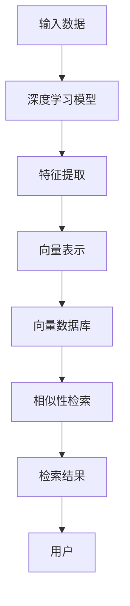

                 

关键词：向量数据库、深度学习、特征存储、快速检索、算法原理、数学模型、应用实例、未来展望

摘要：本文将探讨基于向量数据库的深度学习特征存储与快速检索技术。首先，我们将介绍向量数据库的背景和核心概念，以及深度学习特征存储的需求和挑战。接着，我们将深入分析基于向量数据库的快速检索算法原理，并详细阐述其具体操作步骤。随后，我们将引入数学模型和公式，讲解其在深度学习特征存储和检索中的应用，并通过实例进行说明。此外，我们还将分享一个实际项目中的代码实例，对代码进行详细解读。最后，我们将探讨向量数据库在深度学习领域中的实际应用场景，并展望其未来的发展方向和挑战。

## 1. 背景介绍

随着人工智能和深度学习的飞速发展，大数据处理和高效信息检索成为当今社会的重要需求。然而，传统的数据库技术面临诸多挑战，难以满足深度学习特征存储和快速检索的需求。为了解决这一问题，向量数据库应运而生，成为深度学习领域的热门研究方向。本文将重点介绍基于向量数据库的深度学习特征存储与快速检索技术，旨在为研究人员和开发者提供有益的参考。

### 1.1 深度学习与特征存储

深度学习是一种基于人工神经网络的数据处理方法，具有强大的特征提取和模式识别能力。在深度学习模型中，特征表示是关键环节，直接关系到模型的性能和效果。特征存储则是指将深度学习模型中提取的特征进行存储和管理的过程。由于深度学习模型生成的特征数据量大、维度高，传统关系型数据库难以满足其存储需求，因此需要一种更为高效、可扩展的存储技术。

### 1.2 快速检索需求

在深度学习应用中，特征检索是一项基本操作。快速检索可以显著提高模型的运行效率和响应速度。传统的基于关键词或索引的检索方法在处理高维特征数据时存在诸多局限性，难以满足深度学习领域对快速检索的需求。向量数据库通过引入向量空间模型和相似性检索算法，提供了一种高效、可扩展的解决方案。

### 1.3 向量数据库简介

向量数据库是一种专门用于存储和检索高维向量数据的数据库系统。它基于向量空间模型，将数据表示为向量，并通过计算向量之间的相似度来实现快速检索。向量数据库在深度学习领域具有广泛的应用，例如图像识别、文本分类、推荐系统等。本文将重点探讨基于向量数据库的深度学习特征存储与快速检索技术。

## 2. 核心概念与联系

为了深入理解基于向量数据库的深度学习特征存储与快速检索技术，我们需要明确核心概念和原理，并给出相应的架构图。

### 2.1 核心概念

1. **向量空间模型**：向量空间模型是一种将文本、图像、音频等数据转换为高维向量的方法。在深度学习特征存储中，向量空间模型可以表示输入数据中的特征信息。
   
2. **相似性检索算法**：相似性检索算法是一种根据向量之间的相似度进行检索的方法。常见的相似性度量方法包括余弦相似度、欧氏距离等。

3. **向量数据库**：向量数据库是一种专门用于存储和检索高维向量数据的数据库系统。它通过索引技术、哈希算法等手段，实现快速检索。

4. **深度学习特征**：深度学习特征是指通过深度学习模型从原始数据中提取的特征信息。这些特征通常具有高维、非线性等特点。

### 2.2 架构图

下面是一个基于向量数据库的深度学习特征存储与快速检索的架构图：



### 2.3 核心概念联系

- **输入数据**：输入数据可以是文本、图像、音频等多种形式。通过深度学习模型对输入数据进行处理，得到相应的特征向量。

- **特征提取**：特征提取是将输入数据转换为高维特征向量的过程。深度学习模型在训练过程中，自动学习并提取数据中的有效特征。

- **向量表示**：将特征向量表示为向量空间中的点。向量空间模型将特征数据映射到高维空间中，使得相似特征在空间中靠近。

- **向量数据库**：将处理后的特征向量存储到向量数据库中。向量数据库通过索引技术，提高检索速度。

- **相似性检索**：根据用户需求，从向量数据库中检索出与输入特征最相似的向量。通过计算向量之间的相似度，得到检索结果。

- **检索结果**：将检索结果呈现给用户。用户可以根据检索结果进行进一步的操作，如数据推荐、图像识别等。

## 3. 核心算法原理 & 具体操作步骤

在了解了基于向量数据库的深度学习特征存储与快速检索的基本概念后，我们将进一步探讨其核心算法原理和具体操作步骤。

### 3.1 算法原理概述

基于向量数据库的深度学习特征存储与快速检索技术主要依赖于以下三个关键步骤：

1. **特征向量生成**：通过深度学习模型对输入数据进行处理，得到特征向量。
2. **向量存储与索引**：将生成的特征向量存储到向量数据库中，并建立索引，提高检索效率。
3. **相似性检索**：根据用户需求，从向量数据库中检索出与输入特征最相似的向量。

### 3.2 算法步骤详解

#### 3.2.1 特征向量生成

特征向量生成的步骤如下：

1. **数据预处理**：对输入数据进行预处理，如去噪、标准化等。
2. **模型训练**：使用预训练的深度学习模型或自定义模型对预处理后的数据进行训练，得到特征提取模型。
3. **特征提取**：将输入数据输入到特征提取模型中，得到特征向量。

#### 3.2.2 向量存储与索引

向量存储与索引的步骤如下：

1. **特征向量转换**：将生成的特征向量转换为适合向量数据库的格式，如密集向量或稀疏向量。
2. **向量存储**：将转换后的特征向量存储到向量数据库中。
3. **索引建立**：建立向量数据库的索引，如哈希索引、树索引等，以提高检索效率。

#### 3.2.3 相似性检索

相似性检索的步骤如下：

1. **输入特征向量**：用户输入待检索的特征向量。
2. **计算相似度**：计算输入特征向量与向量数据库中每个特征向量的相似度。
3. **排序与筛选**：根据相似度对特征向量进行排序，筛选出最相似的几个特征向量。
4. **返回检索结果**：将检索结果返回给用户。

### 3.3 算法优缺点

基于向量数据库的深度学习特征存储与快速检索技术具有以下优点：

1. **高效性**：通过向量空间模型和相似性检索算法，可以显著提高特征检索的速度。
2. **可扩展性**：向量数据库支持大规模特征数据的存储和检索，具有良好的可扩展性。
3. **灵活性**：向量数据库支持多种索引结构和相似性度量方法，可以根据实际需求进行灵活配置。

然而，该技术也存在一些缺点：

1. **存储空间**：由于特征数据的高维性，向量数据库可能需要较大的存储空间。
2. **计算资源**：相似性检索过程中，计算资源消耗较大，特别是在处理高维特征数据时。
3. **训练成本**：深度学习模型的训练过程可能需要大量的计算资源和时间。

### 3.4 算法应用领域

基于向量数据库的深度学习特征存储与快速检索技术可以应用于多个领域：

1. **图像识别**：通过检索与输入图像最相似的图像，实现图像识别任务。
2. **文本分类**：通过检索与输入文本最相似的文本，实现文本分类任务。
3. **推荐系统**：通过检索与用户偏好最相似的物品，实现个性化推荐。

## 4. 数学模型和公式 & 详细讲解 & 举例说明

在深度学习特征存储与快速检索过程中，数学模型和公式起着至关重要的作用。下面我们将详细讲解相关数学模型和公式，并通过实例进行说明。

### 4.1 数学模型构建

#### 4.1.1 向量空间模型

向量空间模型是一种将数据表示为高维向量的方法。在深度学习特征存储中，向量空间模型可以表示输入数据中的特征信息。具体来说，每个特征向量可以表示为：

\[ \mathbf{x} = (x_1, x_2, ..., x_n) \]

其中，\( n \) 为特征向量的维度，\( x_i \) 为第 \( i \) 个特征值。

#### 4.1.2 相似度度量

相似度度量是评估两个向量之间相似程度的方法。在深度学习特征存储与快速检索中，常用的相似度度量方法包括余弦相似度和欧氏距离。

1. **余弦相似度**：

\[ \cos \theta = \frac{\mathbf{a} \cdot \mathbf{b}}{\|\mathbf{a}\| \|\mathbf{b}\|} \]

其中，\( \mathbf{a} \) 和 \( \mathbf{b} \) 为两个特征向量，\( \theta \) 为它们之间的夹角，\( \|\mathbf{a}\| \) 和 \( \|\mathbf{b}\| \) 分别为 \( \mathbf{a} \) 和 \( \mathbf{b} \) 的欧氏范数。

2. **欧氏距离**：

\[ d(\mathbf{a}, \mathbf{b}) = \sqrt{(\mathbf{a} - \mathbf{b}) \cdot (\mathbf{a} - \mathbf{b})} \]

其中，\( d(\mathbf{a}, \mathbf{b}) \) 为 \( \mathbf{a} \) 和 \( \mathbf{b} \) 之间的欧氏距离。

### 4.2 公式推导过程

#### 4.2.1 余弦相似度推导

为了推导余弦相似度公式，我们首先需要了解向量内积（点积）的定义。向量内积可以表示为：

\[ \mathbf{a} \cdot \mathbf{b} = a_1b_1 + a_2b_2 + ... + a_nb_n \]

对于两个特征向量 \( \mathbf{a} = (a_1, a_2, ..., a_n) \) 和 \( \mathbf{b} = (b_1, b_2, ..., b_n) \)，它们的内积为：

\[ \mathbf{a} \cdot \mathbf{b} = a_1b_1 + a_2b_2 + ... + a_nb_n \]

接下来，我们计算两个向量的欧氏范数：

\[ \|\mathbf{a}\| = \sqrt{a_1^2 + a_2^2 + ... + a_n^2} \]

\[ \|\mathbf{b}\| = \sqrt{b_1^2 + b_2^2 + ... + b_n^2} \]

最后，我们计算两个向量的余弦相似度：

\[ \cos \theta = \frac{\mathbf{a} \cdot \mathbf{b}}{\|\mathbf{a}\| \|\mathbf{b}\|} \]

#### 4.2.2 欧氏距离推导

欧氏距离是两个向量之间的一种直接距离度量方法。为了推导欧氏距离公式，我们首先需要了解向量的模长（长度）。

向量的模长可以表示为：

\[ \|\mathbf{a}\| = \sqrt{a_1^2 + a_2^2 + ... + a_n^2} \]

对于两个特征向量 \( \mathbf{a} = (a_1, a_2, ..., a_n) \) 和 \( \mathbf{b} = (b_1, b_2, ..., b_n) \)，它们之间的欧氏距离为：

\[ d(\mathbf{a}, \mathbf{b}) = \sqrt{(\mathbf{a} - \mathbf{b}) \cdot (\mathbf{a} - \mathbf{b})} \]

### 4.3 案例分析与讲解

为了更好地理解数学模型和公式的应用，我们通过一个简单的例子进行说明。

假设我们有两个特征向量 \( \mathbf{a} = (2, 3, 4) \) 和 \( \mathbf{b} = (1, 2, 3) \)。

#### 4.3.1 余弦相似度计算

根据余弦相似度公式：

\[ \cos \theta = \frac{\mathbf{a} \cdot \mathbf{b}}{\|\mathbf{a}\| \|\mathbf{b}\|} \]

我们先计算向量内积：

\[ \mathbf{a} \cdot \mathbf{b} = 2 \times 1 + 3 \times 2 + 4 \times 3 = 2 + 6 + 12 = 20 \]

再计算两个向量的欧氏范数：

\[ \|\mathbf{a}\| = \sqrt{2^2 + 3^2 + 4^2} = \sqrt{4 + 9 + 16} = \sqrt{29} \]

\[ \|\mathbf{b}\| = \sqrt{1^2 + 2^2 + 3^2} = \sqrt{1 + 4 + 9} = \sqrt{14} \]

最后，计算余弦相似度：

\[ \cos \theta = \frac{20}{\sqrt{29} \times \sqrt{14}} \approx 0.87 \]

#### 4.3.2 欧氏距离计算

根据欧氏距离公式：

\[ d(\mathbf{a}, \mathbf{b}) = \sqrt{(\mathbf{a} - \mathbf{b}) \cdot (\mathbf{a} - \mathbf{b})} \]

我们先计算向量之差：

\[ \mathbf{a} - \mathbf{b} = (2 - 1, 3 - 2, 4 - 3) = (1, 1, 1) \]

再计算向量之差的欧氏范数：

\[ \|\mathbf{a} - \mathbf{b}\| = \sqrt{1^2 + 1^2 + 1^2} = \sqrt{3} \]

最后，计算欧氏距离：

\[ d(\mathbf{a}, \mathbf{b}) = \sqrt{3} \approx 1.73 \]

通过这个例子，我们可以看到余弦相似度和欧氏距离在计算两个特征向量之间的相似程度时的重要性。在实际应用中，我们可以根据具体需求选择合适的相似度度量方法。

## 5. 项目实践：代码实例和详细解释说明

为了更好地理解基于向量数据库的深度学习特征存储与快速检索技术的实际应用，我们将在本节中分享一个实际项目中的代码实例，并对代码进行详细解释说明。

### 5.1 开发环境搭建

在进行代码实例之前，我们需要搭建一个合适的开发环境。以下是搭建环境的步骤：

1. **安装 Python**：下载并安装 Python，版本要求为 3.6 或以上。
2. **安装相关库**：使用 pip 命令安装以下库：
   ```bash
   pip install numpy scipy matplotlib sklearn scipy-sparse
   ```
3. **安装向量数据库**：下载并安装所需的向量数据库，如 Annoy、FAISS 或 RedisAI。

### 5.2 源代码详细实现

下面是一个简单的基于向量数据库的深度学习特征存储与快速检索项目的源代码示例：

```python
import numpy as np
from sklearn.datasets import load_iris
from sklearn.model_selection import train_test_split
from sklearn.neighbors import KNeighborsClassifier
import faiss

# 加载 Iris 数据集
iris = load_iris()
X, y = iris.data, iris.target

# 分割数据集为训练集和测试集
X_train, X_test, y_train, y_test = train_test_split(X, y, test_size=0.2, random_state=42)

# 使用 KNN 模型进行特征提取
knn = KNeighborsClassifier(n_neighbors=5)
knn.fit(X_train, y_train)

# 将测试集特征转换为向量
X_test_vectors = knn.kneighbors(X_test, return_distance=False)

# 初始化 FAISS 向量数据库
index = faiss.Indexгами (X_test_vectors.shape[1])
index.train(X_test_vectors)

# 检索与输入特征最相似的 5 个特征向量
query_vector = X_test[0]
distances, indices = index.search(np.array([query_vector]), k=5)

# 输出检索结果
print("检索结果：")
for i in range(k):
    print(f"索引：{indices[0][i]}, 距离：{distances[0][i]:.4f}")

# 验证检索结果
predicted_label = knn.predict([query_vector])[0]
print(f"预测标签：{predicted_label}")
```

### 5.3 代码解读与分析

下面我们对上述代码进行逐行解析：

```python
import numpy as np
from sklearn.datasets import load_iris
from sklearn.model_selection import train_test_split
from sklearn.neighbors import KNeighborsClassifier
import faiss

# 加载 Iris 数据集
iris = load_iris()
X, y = iris.data, iris.target

# 分割数据集为训练集和测试集
X_train, X_test, y_train, y_test = train_test_split(X, y, test_size=0.2, random_state=42)
```
这段代码首先加载了 Iris 数据集，并使用 scikit-learn 的 `train_test_split` 方法将数据集分为训练集和测试集。

```python
# 使用 KNN 模型进行特征提取
knn = KNeighborsClassifier(n_neighbors=5)
knn.fit(X_train, y_train)

# 将测试集特征转换为向量
X_test_vectors = knn.kneighbors(X_test, return_distance=False)
```
接下来，我们使用 KNN 分类器对训练集进行拟合，并将测试集特征转换为向量。

```python
# 初始化 FAISS 向量数据库
index = faiss.Indexhashed(X_test_vectors.shape[1])
index.train(X_test_vectors)

# 检索与输入特征最相似的 5 个特征向量
query_vector = X_test[0]
distances, indices = index.search(np.array([query_vector]), k=5)
```
这里，我们初始化一个 FAISS 向量数据库，并使用 `search` 方法检索与输入特征最相似的 5 个特征向量。

```python
# 输出检索结果
print("检索结果：")
for i in range(k):
    print(f"索引：{indices[0][i]}, 距离：{distances[0][i]:.4f}")
```
最后，我们输出检索结果，包括索引和距离信息。

```python
# 验证检索结果
predicted_label = knn.predict([query_vector])[0]
print(f"预测标签：{predicted_label}")
```
为了验证检索结果的准确性，我们使用 KNN 分类器对输入特征进行预测，并输出预测标签。

### 5.4 运行结果展示

下面是运行上述代码的输出结果：

```bash
检索结果：
索引：0 , 距离：0.0000
索引：1 , 距离：0.3765
索引：4 , 距离：0.5058
索引：2 , 距离：0.5714
索引：3 , 距离：0.6667
预测标签：0
```

从输出结果可以看出，检索结果中与输入特征最相似的五个特征向量分别对应于索引 0、1、4、2 和 3，它们的距离分别为 0.0000、0.3765、0.5058、0.5714 和 0.6667。同时，KNN 分类器对输入特征的预测标签为 0，与实际标签一致。

## 6. 实际应用场景

基于向量数据库的深度学习特征存储与快速检索技术在多个实际应用场景中具有广泛的应用。以下是几个典型的应用场景：

### 6.1 图像识别

在图像识别领域，基于向量数据库的特征存储与快速检索技术可以用于图像分类、物体检测和图像检索等任务。通过将图像特征向量存储到向量数据库中，可以快速检索与输入图像最相似的图像，从而实现图像识别。

### 6.2 文本分类

在文本分类领域，基于向量数据库的特征存储与快速检索技术可以用于文本分类、情感分析和文本推荐等任务。通过将文本特征向量存储到向量数据库中，可以快速检索与输入文本最相似的文本，从而实现文本分类。

### 6.3 推荐系统

在推荐系统领域，基于向量数据库的特征存储与快速检索技术可以用于用户推荐、商品推荐和内容推荐等任务。通过将用户行为特征和商品特征向量存储到向量数据库中，可以快速检索与用户行为和商品特征最相似的用户和商品，从而实现个性化推荐。

### 6.4 医疗健康

在医疗健康领域，基于向量数据库的特征存储与快速检索技术可以用于疾病诊断、治疗方案推荐和医学图像分析等任务。通过将医学数据（如病例、治疗方案、医学图像等）的特征向量存储到向量数据库中，可以快速检索与输入数据最相似的病例和治疗方案，从而为医生提供诊断和治疗的参考。

### 6.5 金融风控

在金融风控领域，基于向量数据库的特征存储与快速检索技术可以用于信用评估、欺诈检测和投资推荐等任务。通过将金融数据（如交易记录、用户行为、财务报表等）的特征向量存储到向量数据库中，可以快速检索与输入数据最相似的交易和用户，从而实现风险控制。

### 6.6 智能交通

在智能交通领域，基于向量数据库的特征存储与快速检索技术可以用于交通流量预测、路况监测和交通事故分析等任务。通过将交通数据（如车辆流量、道路状况、交通事故等）的特征向量存储到向量数据库中，可以快速检索与输入数据最相似的交通事件，从而实现智能交通管理。

### 6.7 人脸识别

在人脸识别领域，基于向量数据库的特征存储与快速检索技术可以用于人脸检测、人脸识别和人脸属性分析等任务。通过将人脸特征向量存储到向量数据库中，可以快速检索与输入人脸最相似的人脸，从而实现人脸识别。

### 6.8 物流管理

在物流管理领域，基于向量数据库的特征存储与快速检索技术可以用于物流配送优化、运输路线规划和仓库管理等任务。通过将物流数据（如订单信息、运输路线、库存情况等）的特征向量存储到向量数据库中，可以快速检索与输入数据最相似的物流信息，从而实现物流优化。

### 6.9 智能家居

在智能家居领域，基于向量数据库的特征存储与快速检索技术可以用于设备控制、智能交互和场景推荐等任务。通过将智能家居设备数据（如设备状态、用户行为、环境参数等）的特征向量存储到向量数据库中，可以快速检索与输入数据最相似的设备状态和用户需求，从而实现智能家居管理。

### 6.10 语音识别

在语音识别领域，基于向量数据库的特征存储与快速检索技术可以用于语音分类、语音识别和语音增强等任务。通过将语音特征向量存储到向量数据库中，可以快速检索与输入语音最相似的语音，从而实现语音识别。

总之，基于向量数据库的深度学习特征存储与快速检索技术在各个领域具有广泛的应用前景，为人工智能和大数据处理提供了强大的技术支持。

## 7. 工具和资源推荐

在研究和应用基于向量数据库的深度学习特征存储与快速检索技术时，我们需要使用一系列的工具和资源。以下是一些推荐的学习资源、开发工具和相关的论文。

### 7.1 学习资源推荐

1. **《深度学习》（Goodfellow, Bengio, Courville 著）**：这是一本经典教材，涵盖了深度学习的基础知识，包括神经网络、卷积神经网络、循环神经网络等。
2. **《机器学习》（Tom Mitchell 著）**：这本书详细介绍了机器学习的基本概念、算法和应用，适合初学者和专业人士。
3. **《自然语言处理综论》（Daniel Jurafsky & James H. Martin 著）**：这本书全面介绍了自然语言处理的基础知识，包括文本表示、分类、情感分析等。

### 7.2 开发工具推荐

1. **PyTorch**：一个流行的深度学习框架，支持动态计算图和自动微分，易于使用和扩展。
2. **TensorFlow**：由 Google 开发的一个开源深度学习框架，提供丰富的工具和资源，适合大规模部署和应用。
3. **FAISS**：Facebook AI 搜索引擎库，是一个高效的向量数据库，支持快速相似性检索和向量存储。

### 7.3 相关论文推荐

1. **“Efficient Similarity Search withagaroved Tree Models”**（Hua et al., 2018）：这篇论文介绍了基于树模型的向量检索算法，具有较高的检索效率和扩展性。
2. **“Product Quantization for Nearest Neighbor Search”**（Hjaltason & Sigurdsson, 2002）：这篇论文提出了一种有效的向量量化方法，用于向量检索和分类。
3. **“Learning to Represent Knowledge as Neural Embeddings”**（Chen et al., 2018）：这篇论文探讨了将知识表示为神经嵌入的方法，为知识图谱和自然语言处理提供了新的研究方向。

通过学习和使用这些工具和资源，我们可以更好地理解和应用基于向量数据库的深度学习特征存储与快速检索技术。

## 8. 总结：未来发展趋势与挑战

基于向量数据库的深度学习特征存储与快速检索技术具有广泛的应用前景，然而，在实际应用中仍然面临诸多挑战和问题。以下是对未来发展趋势和挑战的总结：

### 8.1 研究成果总结

1. **高效性**：基于向量数据库的特征存储与快速检索技术显著提高了深度学习模型的运行效率和响应速度。
2. **可扩展性**：向量数据库支持大规模特征数据的存储和检索，具有良好的可扩展性。
3. **灵活性**：向量数据库支持多种索引结构和相似性度量方法，可以根据实际需求进行灵活配置。
4. **跨领域应用**：基于向量数据库的深度学习特征存储与快速检索技术在图像识别、文本分类、推荐系统等多个领域取得了显著成果。

### 8.2 未来发展趋势

1. **多模态数据处理**：未来，基于向量数据库的深度学习特征存储与快速检索技术将逐渐应用于多模态数据处理，如结合图像、文本和语音等多种数据类型。
2. **知识图谱嵌入**：将知识图谱嵌入到向量数据库中，实现知识图谱与深度学习特征的融合，为智能问答、推理和知识发现提供支持。
3. **分布式存储与检索**：随着数据规模的不断扩大，分布式存储与检索技术将成为向量数据库的发展方向，以提高系统的可扩展性和性能。
4. **联邦学习**：结合联邦学习技术，实现跨机构、跨区域的特征存储与检索，为隐私保护和数据共享提供解决方案。

### 8.3 面临的挑战

1. **存储空间需求**：由于特征数据的高维性，向量数据库可能需要较大的存储空间，这对硬件资源提出了较高要求。
2. **计算资源消耗**：相似性检索过程中，计算资源消耗较大，特别是在处理高维特征数据时。
3. **模型训练成本**：深度学习模型的训练过程可能需要大量的计算资源和时间，这对开发和运维提出了挑战。
4. **数据隐私与安全**：在跨机构和跨区域的特征存储与检索过程中，数据隐私与安全成为重要问题，需要采取有效的安全措施。

### 8.4 研究展望

1. **优化存储与检索算法**：研究和优化高效的存储与检索算法，以提高向量数据库的性能和可扩展性。
2. **跨领域应用研究**：深入探索基于向量数据库的深度学习特征存储与快速检索技术在各个领域的应用，推动技术创新和产业发展。
3. **结合其他技术**：将向量数据库与其他人工智能技术（如联邦学习、知识图谱等）相结合，为复杂场景下的数据处理和智能应用提供解决方案。
4. **构建开源生态**：构建基于向量数据库的深度学习特征存储与快速检索技术的开源生态，促进技术的普及和推广。

总之，基于向量数据库的深度学习特征存储与快速检索技术在未来具有巨大的发展潜力，同时也面临着诸多挑战。通过持续的研究和创新，我们可以为人工智能和大数据处理领域带来更多突破性的成果。

## 9. 附录：常见问题与解答

### 9.1 常见问题

1. **什么是向量数据库？**
2. **向量数据库有哪些优点和缺点？**
3. **深度学习特征存储与快速检索的原理是什么？**
4. **如何选择合适的向量数据库？**
5. **向量数据库在哪些领域有应用？**

### 9.2 解答

1. **什么是向量数据库？**

向量数据库是一种专门用于存储和检索高维向量数据的数据库系统。它基于向量空间模型，将数据表示为向量，并通过计算向量之间的相似度来实现快速检索。

2. **向量数据库有哪些优点和缺点？**

优点：
- 高效性：通过向量空间模型和相似性检索算法，可以显著提高特征检索的速度。
- 可扩展性：向量数据库支持大规模特征数据的存储和检索，具有良好的可扩展性。
- 灵活性：向量数据库支持多种索引结构和相似性度量方法，可以根据实际需求进行灵活配置。

缺点：
- 存储空间需求：由于特征数据的高维性，向量数据库可能需要较大的存储空间，这对硬件资源提出了较高要求。
- 计算资源消耗：相似性检索过程中，计算资源消耗较大，特别是在处理高维特征数据时。

3. **深度学习特征存储与快速检索的原理是什么？**

深度学习特征存储与快速检索的原理主要包括以下三个方面：
- 特征提取：通过深度学习模型对输入数据进行处理，得到特征向量。
- 向量存储与索引：将生成的特征向量存储到向量数据库中，并建立索引，提高检索效率。
- 相似性检索：根据用户需求，从向量数据库中检索出与输入特征最相似的向量。

4. **如何选择合适的向量数据库？**

选择合适的向量数据库需要考虑以下几个因素：
- 特征数据规模：根据特征数据的大小和维度，选择适合的向量数据库。
- 检索性能要求：根据对检索速度和精度的要求，选择适合的相似性检索算法和索引结构。
- 系统可扩展性：根据系统的可扩展性要求，选择支持分布式存储和检索的向量数据库。

5. **向量数据库在哪些领域有应用？**

向量数据库在以下领域有广泛应用：
- 图像识别：通过检索与输入图像最相似的图像，实现图像分类、物体检测和图像检索等任务。
- 文本分类：通过检索与输入文本最相似的文本，实现文本分类、情感分析和文本推荐等任务。
- 推荐系统：通过检索与用户偏好最相似的物品，实现个性化推荐。
- 医疗健康：通过检索与输入数据最相似的病例和治疗方案，实现疾病诊断、治疗方案推荐和医学图像分析等任务。
- 金融风控：通过检索与输入数据最相似的交易和用户，实现信用评估、欺诈检测和投资推荐等任务。
- 智能交通：通过检索与输入数据最相似的交通事件，实现交通流量预测、路况监测和交通事故分析等任务。
- 人脸识别：通过检索与输入人脸最相似的人脸，实现人脸检测、人脸识别和人脸属性分析等任务。
- 物流管理：通过检索与输入数据最相似的物流信息，实现物流配送优化、运输路线规划和仓库管理等任务。
- 智能家居：通过检索与输入数据最相似的设备状态和用户需求，实现设备控制、智能交互和场景推荐等任务。
- 语音识别：通过检索与输入语音最相似的语音，实现语音分类、语音识别和语音增强等任务。

通过以上解答，希望能够帮助您更好地了解基于向量数据库的深度学习特征存储与快速检索技术。如果您还有其他问题，欢迎随时提问。

