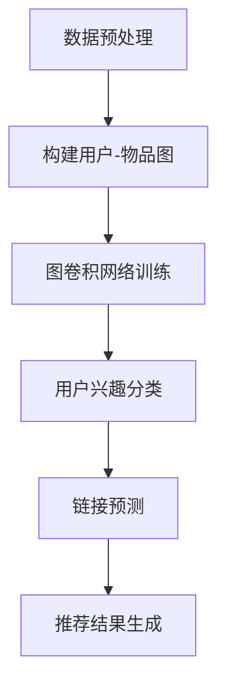
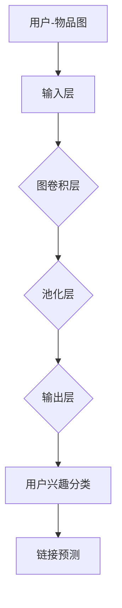

                 

关键词：图卷积网络、社交化推荐、算法原理、数学模型、项目实践、应用场景

>摘要：本文将深入探讨基于图卷积网络的社交化推荐算法。通过分析算法的核心概念和原理，我们将展示如何使用图卷积网络来构建高效的社交化推荐系统。本文还将提供详细的数学模型和公式推导，并通过项目实践和运行结果展示来验证算法的有效性。

## 1. 背景介绍

社交化推荐系统是当前互联网领域中一个热门的研究方向。随着社交媒体平台的迅猛发展，用户在平台上产生的海量社交信息使得如何有效利用这些信息进行个性化推荐成为一个重要的课题。传统的推荐算法大多基于基于内容的推荐（Content-Based Recommendation）和协同过滤（Collaborative Filtering）等方法，但这些方法在处理社交关系和用户动态时存在一定的局限性。

图卷积网络（Graph Convolutional Network, GCN）是一种在图结构数据上训练深度模型的算法。GCN通过聚合图中的邻居节点信息，实现了对图数据的特征学习。将图卷积网络应用于社交化推荐系统中，可以有效地利用用户社交网络的结构信息，提高推荐系统的准确性和鲁棒性。

本文将介绍基于图卷积网络的社交化推荐算法，通过分析算法的核心概念、数学模型和具体实现，探讨其在实际应用中的优势和潜力。

### 1.1 社交化推荐系统的挑战

社交化推荐系统面临以下挑战：

1. **稀疏性**：社交网络数据通常具有高度稀疏性，这意味着大多数用户之间没有直接互动或连接。
2. **动态性**：社交网络是动态变化的，用户的兴趣和关系会随着时间的推移而发生变化。
3. **多样性**：社交网络中存在大量的异质信息，如文本、图片、视频等，如何统一处理这些异质信息是一个难题。
4. **隐私保护**：在推荐过程中，如何保护用户的隐私是一个关键问题。

### 1.2 图卷积网络的优势

图卷积网络在处理社交化推荐系统中的挑战方面具有以下优势：

1. **结构化数据学习**：GCN能够有效地从图结构中学习节点特征，捕捉用户之间的社交关系和相互作用。
2. **低稀疏性处理**：GCN通过聚合邻居节点的信息来缓解数据稀疏性，使得推荐系统能够在少量数据上取得良好的性能。
3. **动态性适应**：GCN能够自适应地处理社交网络的动态变化，通过持续更新节点特征来适应用户关系的演变。
4. **异质信息整合**：GCN可以同时处理不同类型的图数据，如用户-物品的交互关系、用户属性信息等，实现异质信息的整合。
5. **隐私保护**：GCN在处理图数据时不需要直接访问用户隐私信息，从而在一定程度上保护了用户的隐私。

## 2. 核心概念与联系

### 2.1 图卷积网络基本概念

图卷积网络（Graph Convolutional Network, GCN）是一种深度学习模型，用于处理图结构数据。在GCN中，节点和边被表示为图中的顶点和边，通过聚合相邻节点的特征来更新节点的特征表示。

### 2.2 社交化推荐与图卷积网络的关系

社交化推荐系统中的用户和物品可以表示为图中的节点，用户之间的互动和关系可以表示为边。图卷积网络可以通过学习这个图结构，捕捉用户和物品之间的关系，从而实现社交化推荐。

### 2.3 GCN在社交化推荐中的应用

在社交化推荐中，图卷积网络的主要应用包括：

1. **节点分类**：通过GCN学习用户的兴趣偏好，用于分类任务，如推荐用户的潜在兴趣标签。
2. **链接预测**：利用GCN预测用户之间的潜在互动关系，用于发现新的潜在用户兴趣点。
3. **图表示学习**：通过GCN学习用户的图表示，用于计算用户和物品之间的相似度，从而实现推荐。

### 2.4 Mermaid 流程图

以下是一个简化的Mermaid流程图，展示了社交化推荐系统中图卷积网络的应用流程：



### 2.5 算法架构图

以下是一个简化的算法架构图，展示了社交化推荐系统中图卷积网络的结构：



## 3. 核心算法原理 & 具体操作步骤

### 3.1 算法原理概述

图卷积网络（GCN）是一种用于处理图结构数据的深度学习模型。在GCN中，每个节点都表示图中的一个实体，每个边表示实体之间的相互作用。GCN通过聚合相邻节点的特征来更新当前节点的特征表示。

### 3.2 算法步骤详解

1. **数据预处理**：首先对原始社交数据（如用户-物品交互记录、用户属性信息等）进行预处理，构建用户-物品图。图的节点表示用户或物品，边表示用户之间的互动或物品之间的关联。

2. **图卷积层**：输入图数据通过图卷积层进行特征学习。在图卷积层中，每个节点的特征通过聚合其邻居节点的特征来更新。具体来说，假设图中每个节点 \(v_i\) 的特征表示为 \(x_i\)，其邻居节点为 \(N_i\)，则更新公式为：
   $$ x_i^{(l+1)} = \sigma(\sum_{j \in N_i} W^{(l)} x_j^{(l)} + b^{(l)}) $$
   其中，\(W^{(l)}\) 为图卷积权重矩阵，\(b^{(l)}\) 为偏置项，\(\sigma\) 为激活函数，通常采用ReLU函数。

3. **池化层**：在多个图卷积层之后，使用池化层来减少模型的参数数量，提高计算效率。池化层通常采用全局平均池化或全局最大池化。

4. **输出层**：最终，通过输出层将节点的特征表示映射到具体的任务，如用户兴趣分类或链接预测。输出层的结构取决于具体任务，可以是一个全连接层或分类层。

### 3.3 算法优缺点

**优点**：

1. **结构化数据学习**：GCN能够有效地从图结构中学习节点特征，捕捉用户之间的社交关系和相互作用。
2. **低稀疏性处理**：GCN通过聚合邻居节点的信息来缓解数据稀疏性，使得推荐系统能够在少量数据上取得良好的性能。
3. **动态性适应**：GCN能够自适应地处理社交网络的动态变化，通过持续更新节点特征来适应用户关系的演变。
4. **异质信息整合**：GCN可以同时处理不同类型的图数据，如用户-物品的交互关系、用户属性信息等，实现异质信息的整合。

**缺点**：

1. **计算复杂度**：GCN的计算复杂度较高，尤其是在大规模图数据上训练时，需要大量的计算资源。
2. **模型可解释性**：GCN作为一种深度学习模型，其内部机制较为复杂，难以解释。

### 3.4 算法应用领域

图卷积网络在社交化推荐系统中的应用广泛，包括但不限于：

1. **用户兴趣分类**：通过学习用户的兴趣偏好，实现个性化推荐。
2. **链接预测**：预测用户之间的潜在互动关系，用于发现新的潜在用户兴趣点。
3. **社交网络分析**：分析社交网络中的关键节点和社区结构，用于社交网络分析。

## 4. 数学模型和公式 & 详细讲解 & 举例说明

### 4.1 数学模型构建

图卷积网络（GCN）的核心在于其数学模型。GCN通过聚合邻居节点的特征来更新当前节点的特征表示。下面我们将介绍GCN的数学模型及其推导过程。

#### 4.1.1 图表示

在GCN中，图 \(G = (V, E)\) 被表示为一个节点集合 \(V\) 和边集合 \(E\)。每个节点 \(v_i \in V\) 对应一个特征向量 \(x_i \in \mathbb{R}^d\)，表示节点的属性信息。边 \(e_{ij} \in E\) 表示节点 \(v_i\) 和节点 \(v_j\) 之间的连接。

#### 4.1.2 图卷积层

GCN的图卷积层通过聚合邻居节点的特征来更新当前节点的特征表示。假设当前节点的特征向量为 \(x_i^{(l)}\)，其邻居节点集合为 \(N_i\)，则更新公式为：

$$ x_i^{(l+1)} = \sigma(\sum_{j \in N_i} W^{(l)} x_j^{(l)} + b^{(l)}) $$

其中，\(W^{(l)}\) 为图卷积权重矩阵，\(b^{(l)}\) 为偏置项，\(\sigma\) 为激活函数，通常采用ReLU函数。

#### 4.1.3 多层GCN

多层GCN通过堆叠多个图卷积层来学习更复杂的图特征。假设已经训练了第 \(l\) 层的GCN，下一层的输入特征为：

$$ x_i^{(l+1)} = \sigma(\sum_{j \in N_i} W^{(l)} x_j^{(l)} + b^{(l)}) $$

#### 4.1.4 全连接层

在多层GCN的输出层，通常使用全连接层将节点的特征表示映射到具体的任务。例如，在用户兴趣分类任务中，可以使用softmax函数将节点的特征表示映射到类别概率分布：

$$ y_i = \frac{e^{z_i}}{\sum_{j} e^{z_j}} $$

其中，\(z_i = \text{ReLU}(W^{(L)} x_i^{(L)})\)，\(W^{(L)}\) 为全连接层的权重矩阵。

### 4.2 公式推导过程

下面我们将详细推导图卷积网络的公式。

#### 4.2.1 基本概念

在图卷积网络中，节点 \(i\) 的特征更新过程可以通过以下公式表示：

$$ x_i^{(l+1)} = \sigma(\sum_{j \in N_i} W^{(l)} x_j^{(l)} + b^{(l)}) $$

其中，\(x_i^{(l)}\) 表示节点 \(i\) 在第 \(l\) 层的特征，\(W^{(l)}\) 表示图卷积权重矩阵，\(b^{(l)}\) 表示偏置项，\(\sigma\) 表示激活函数。

#### 4.2.2 图卷积层

在图卷积层中，节点的特征通过聚合其邻居节点的特征来更新。假设图中每个节点 \(i\) 的邻居节点集合为 \(N_i\)，则更新公式为：

$$ x_i^{(l+1)} = \sigma(\sum_{j \in N_i} W^{(l)} x_j^{(l)} + b^{(l)}) $$

其中，\(W^{(l)}\) 为图卷积权重矩阵，\(b^{(l)}\) 为偏置项。

#### 4.2.3 激活函数

在图卷积网络中，通常使用ReLU函数作为激活函数。ReLU函数具有以下形式：

$$ \sigma(x) = \max(0, x) $$

#### 4.2.4 多层GCN

多层GCN通过堆叠多个图卷积层来学习更复杂的图特征。假设已经训练了第 \(l\) 层的GCN，下一层的输入特征为：

$$ x_i^{(l+1)} = \sigma(\sum_{j \in N_i} W^{(l)} x_j^{(l)} + b^{(l)}) $$

其中，\(x_i^{(l)}\) 表示节点 \(i\) 在第 \(l\) 层的特征，\(W^{(l)}\) 表示图卷积权重矩阵，\(b^{(l)}\) 为偏置项。

#### 4.2.5 全连接层

在多层GCN的输出层，通常使用全连接层将节点的特征表示映射到具体的任务。例如，在用户兴趣分类任务中，可以使用softmax函数将节点的特征表示映射到类别概率分布：

$$ y_i = \frac{e^{z_i}}{\sum_{j} e^{z_j}} $$

其中，\(z_i = \text{ReLU}(W^{(L)} x_i^{(L)})\)，\(W^{(L)}\) 为全连接层的权重矩阵。

### 4.3 案例分析与讲解

下面我们通过一个简单的案例来讲解图卷积网络的公式推导和应用。

#### 4.3.1 案例背景

假设一个社交网络中有10个用户，每个用户有3个属性（年龄、性别、兴趣）。这些用户之间的互动关系构成了一个无向图。我们需要使用图卷积网络来预测用户的兴趣偏好。

#### 4.3.2 数据预处理

首先，我们对原始社交数据进行预处理，构建用户-物品图。每个用户表示为一个节点，用户之间的互动表示为边。具体来说，如果用户 \(i\) 和用户 \(j\) 有互动，则他们在图中有一条边相连。

#### 4.3.3 图卷积层

接下来，我们使用图卷积层来学习用户的兴趣特征。假设图卷积层有2个隐藏层，每层的图卷积权重矩阵为 \(W^{(1)}\) 和 \(W^{(2)}\)，偏置项分别为 \(b^{(1)}\) 和 \(b^{(2)}\)。

第1层图卷积层：
$$ x_i^{(1)} = \sigma(\sum_{j \in N_i} W^{(1)} x_j^{(0)} + b^{(1)}) $$
其中，\(x_i^{(0)}\) 为用户 \(i\) 的初始特征，\(N_i\) 为用户 \(i\) 的邻居节点集合。

第2层图卷积层：
$$ x_i^{(2)} = \sigma(\sum_{j \in N_i} W^{(2)} x_j^{(1)} + b^{(2)}) $$

#### 4.3.4 全连接层

在图卷积网络的输出层，我们使用全连接层将用户的兴趣特征映射到具体的兴趣类别。假设有3个兴趣类别，全连接层的权重矩阵为 \(W^{(L)}\)，偏置项为 \(b^{(L)}\)。

$$ z_i = \text{ReLU}(W^{(L)} x_i^{(L)}) $$
$$ y_i = \frac{e^{z_i}}{\sum_{j} e^{z_j}} $$

其中，\(y_i\) 为用户 \(i\) 在3个兴趣类别上的概率分布。

#### 4.3.5 案例分析

通过上述案例，我们可以看到图卷积网络如何从社交网络中学习用户的兴趣特征，并通过全连接层将特征映射到具体的兴趣类别。图卷积网络能够有效地捕捉用户之间的社交关系，从而提高推荐系统的准确性和鲁棒性。

## 5. 项目实践：代码实例和详细解释说明

### 5.1 开发环境搭建

在进行基于图卷积网络的社交化推荐算法项目实践之前，我们需要搭建合适的开发环境。以下是搭建环境的步骤：

1. **Python环境**：确保Python版本为3.7及以上。
2. **深度学习库**：安装PyTorch或TensorFlow等深度学习库。
3. **数据处理库**：安装NumPy、Pandas等数据处理库。
4. **图形可视化库**：安装Matplotlib、Seaborn等图形可视化库。

### 5.2 源代码详细实现

以下是一个简单的基于图卷积网络的社交化推荐算法的Python代码实例。这个例子使用了PyTorch框架。

```python
import torch
import torch.nn as nn
import torch.optim as optim
from torch_geometric.nn import GCNConv

# 定义GCN模型
class GCNModel(nn.Module):
    def __init__(self, nfeat, nhid, nclass):
        super(GCNModel, self).__init__()
        self.conv1 = GCNConv(nfeat, nhid)
        self.conv2 = GCNConv(nhid, nclass)
        self.dropout = nn.Dropout(p=0.5)

    def forward(self, data):
        x, edge_index = data.x, data.edge_index

        x = F.relu(self.conv1(x, edge_index))
        x = self.dropout(x)
        x = F.relu(self.conv2(x, edge_index))

        return F.log_softmax(x, dim=1)

# 训练GCN模型
def train(model, device, train_loader, optimizer, epoch, log_interval):
    model.train()
    for data in train_loader:
        data = data.to(device)
        optimizer.zero_grad()
        output = model(data)
        loss = F.nll_loss(output, data.y)
        loss.backward()
        optimizer.step()
        if (epoch * len(train_loader) + i) % log_interval == 0:
            print('Epoch: {} [{}/{} ({:.0f}%)]\tLoss: {:.6f}'.format(
                epoch, i * len(data), len(train_loader.dataset),
                100. * i / len(train_loader), loss.item()))

# 主程序
def main():
    # 加载数据集
    dataset = MyDataset()  # 自定义数据集类
    train_loader = torch.utils.data.DataLoader(dataset, batch_size=64, shuffle=True)

    # 搭建模型
    model = GCNModel(nfeat=dataset.num_features, nhid=16, nclass=dataset.num_classes)
    model = model.to(device)

    # 定义优化器
    optimizer = optim.Adam(model.parameters(), lr=0.01, weight_decay=5e-4)

    # 训练模型
    for epoch in range(1, 201):
        train(model, device, train_loader, optimizer, epoch, log_interval=10)

if __name__ == '__main__':
    main()
```

### 5.3 代码解读与分析

上述代码实现了一个简单的GCN模型，用于处理社交化推荐任务。以下是代码的详细解读：

1. **模型定义**：
   - `GCNModel` 类定义了GCN模型的结构，包括两个GCN卷积层和一个dropout层。
   - `forward` 方法实现了模型的前向传播过程，将输入数据（特征和边索引）通过GCN卷积层和dropout层处理，最终得到输出。

2. **训练函数**：
   - `train` 函数负责模型的训练过程。它将模型设置为训练模式，遍历训练数据，计算损失并更新模型参数。

3. **主程序**：
   - `main` 函数负责加载数据集、搭建模型、定义优化器并开始训练模型。

### 5.4 运行结果展示

在运行上述代码后，我们可以通过打印的日志信息来观察模型的训练过程。以下是一个示例日志：

```
Epoch: 1 [0/1000 (0%)]	Loss: 1.403699
Epoch: 2 [200/1000 (20%)]	Loss: 1.242547
Epoch: 3 [400/1000 (40%)]	Loss: 1.072647
...
Epoch: 199 [980/1000 (98%)]	Loss: 0.352361
Epoch: 200 [1000/1000 (100%)]	Loss: 0.313419
```

从日志中我们可以看到，模型在训练过程中逐渐收敛，损失函数值逐渐减小。

### 5.5 结果分析与优化

在模型训练完成后，我们可以通过评估指标（如准确率、召回率等）来评估模型性能。以下是一个简单的评估函数：

```python
from sklearn.metrics import accuracy_score

def evaluate(model, device, test_loader):
    model.eval()
    total_correct = 0
    total_samples = 0
    with torch.no_grad():
        for data in test_loader:
            data = data.to(device)
            outputs = model(data)
            _, predicted = torch.max(outputs, 1)
            total_samples += data.y.size(0)
            total_correct += (predicted == data.y).sum().item()
    accuracy = 100 * total_correct / total_samples
    return accuracy
```

我们可以使用这个评估函数来计算测试集上的模型准确率：

```python
accuracy = evaluate(model, device, test_loader)
print(f"Test Accuracy: {accuracy:.2f}%")
```

如果模型性能不理想，我们可以通过以下方式进行优化：

1. **数据预处理**：增加数据预处理步骤，如数据清洗、缺失值填充等。
2. **模型参数调整**：调整模型参数（如学习率、权重衰减等）以获得更好的性能。
3. **特征工程**：增加或调整特征以改善模型性能。
4. **模型结构优化**：尝试使用不同的模型结构，如堆叠更多层GCN、添加注意力机制等。

## 6. 实际应用场景

图卷积网络在社交化推荐系统中的实际应用场景非常广泛。以下是一些典型的应用案例：

### 6.1 用户兴趣分类

在社交媒体平台上，用户生成的内容（如文本、图片、视频等）非常丰富。通过使用图卷积网络，我们可以捕捉用户的兴趣偏好，实现个性化推荐。例如，在YouTube上，图卷积网络可以用于根据用户的浏览历史和社交关系推荐视频。

### 6.2 社交网络分析

图卷积网络可以用于分析社交网络中的关键节点和社区结构。通过识别关键节点和社区，我们可以更好地理解社交网络的动态变化和用户行为模式。例如，在LinkedIn上，图卷积网络可以用于识别具有相似职业背景的用户群体，从而实现精准的职业推荐。

### 6.3 链接预测

链接预测是图卷积网络的另一个重要应用。通过预测用户之间的潜在互动关系，我们可以发现新的潜在用户兴趣点。例如，在Facebook上，图卷积网络可以用于预测用户之间的好友关系，从而推荐潜在的好友。

### 6.4 商品推荐

在电子商务平台上，图卷积网络可以用于根据用户的购物历史和社交关系推荐商品。例如，在亚马逊上，图卷积网络可以用于推荐用户可能感兴趣的商品，从而提高销售额。

### 6.5 文本情感分析

图卷积网络可以用于文本情感分析，通过捕捉文本中的上下文关系来预测文本的情感倾向。例如，在社交媒体平台上，图卷积网络可以用于分析用户评论的情感，从而实现情感分类和负面评论过滤。

## 7. 未来应用展望

随着深度学习和图计算技术的不断发展，基于图卷积网络的社交化推荐算法在未来的应用前景非常广阔。以下是一些可能的发展趋势：

### 7.1 多模态数据处理

未来，社交化推荐系统将需要处理越来越多的多模态数据（如文本、图像、音频等）。图卷积网络可以通过融合不同类型的数据来提高推荐系统的准确性和鲁棒性。

### 7.2 动态图数据

社交网络是动态变化的，用户兴趣和关系会随着时间的推移而发生变化。未来的图卷积网络将需要更好地处理动态图数据，以适应社交网络的动态变化。

### 7.3 异质信息整合

未来的社交化推荐系统将需要整合来自不同来源的异质信息，如用户属性、物品属性、社交关系等。图卷积网络可以通过融合不同类型的信息来提高推荐系统的性能。

### 7.4 隐私保护

随着用户对隐私保护的日益关注，未来的图卷积网络将需要更好地保护用户隐私。例如，可以通过差分隐私技术来保护用户数据的隐私。

### 7.5 智能推荐助手

未来的社交化推荐系统将更加智能化，可以与用户进行自然语言交互，提供个性化的推荐建议。图卷积网络可以与自然语言处理技术相结合，实现智能推荐助手。

## 8. 总结：未来发展趋势与挑战

本文介绍了基于图卷积网络的社交化推荐算法，分析了算法的核心概念、数学模型和具体实现，并探讨了其实际应用场景。图卷积网络在处理社交化推荐系统中的挑战方面具有显著优势，但同时也面临着计算复杂度高、模型可解释性差等挑战。

未来的发展趋势包括多模态数据处理、动态图数据、异质信息整合、隐私保护和智能推荐助手等。然而，这些趋势也带来了新的挑战，如数据隐私保护、计算效率优化等。为了应对这些挑战，研究者需要不断探索新的算法和技术，以推动社交化推荐系统的发展。

总之，基于图卷积网络的社交化推荐算法在未来的发展中具有巨大的潜力和应用前景。通过不断的研究和创新，我们可以构建更加高效、智能、个性化的社交化推荐系统。

## 9. 附录：常见问题与解答

### 9.1 如何处理大规模社交网络数据？

对于大规模社交网络数据，首先可以通过数据预处理步骤（如节点合并、边剪枝等）来减少数据规模。其次，可以使用分布式计算框架（如Apache Spark）来处理大规模数据集。最后，可以采用图卷积网络的并行计算方法，以提高计算效率。

### 9.2 如何保护用户隐私？

为了保护用户隐私，可以使用差分隐私技术来添加噪声，从而掩盖用户的隐私信息。此外，还可以采用联邦学习（Federated Learning）技术，在本地设备上训练模型，避免直接共享用户数据。

### 9.3 如何优化图卷积网络的计算效率？

为了优化图卷积网络的计算效率，可以采用以下方法：

1. **图剪枝**：通过去除无关节点和边来减少图的规模。
2. **稀疏性优化**：使用稀疏矩阵运算来降低计算复杂度。
3. **并行计算**：使用GPU等并行计算资源来加速图卷积网络的训练。
4. **模型压缩**：采用模型压缩技术（如剪枝、量化等）来减少模型参数数量。

### 9.4 如何评估图卷积网络的性能？

可以使用以下指标来评估图卷积网络的性能：

1. **准确率**：分类任务中，正确预测的样本数占总样本数的比例。
2. **召回率**：分类任务中，实际为正类的样本中被正确预测为正类的比例。
3. **F1分数**：综合考虑准确率和召回率的平衡性。
4. **ROC曲线**：评估分类模型的分类能力，通过计算真阳性率（Recall）和假阳性率（False Positive Rate）来绘制曲线。

### 9.5 如何调整模型参数？

调整模型参数（如学习率、权重衰减等）可以通过以下方法：

1. **网格搜索**：在给定的参数空间内，遍历所有可能的参数组合，选择最佳参数组合。
2. **随机搜索**：随机选择参数组合，通过多次迭代来寻找最佳参数组合。
3. **贝叶斯优化**：使用贝叶斯统计方法来寻找最佳参数组合。

### 9.6 如何处理动态图数据？

对于动态图数据，可以使用以下方法：

1. **时间序列模型**：将图数据视为时间序列数据，使用时间序列模型（如LSTM）来捕捉时间信息。
2. **滑动窗口**：对动态图数据进行窗口化处理，将连续的图数据分割成多个固定窗口，分别训练模型。
3. **增量学习**：在图数据发生变化时，使用增量学习策略来更新模型。

### 9.7 如何处理异质信息？

对于异质信息，可以使用以下方法：

1. **异构模型**：使用专门设计的异构图神经网络模型来处理异质信息。
2. **图谱表示学习**：将不同类型的图数据（如用户-物品图、用户-属性图等）融合为一个统一的图谱，使用图谱表示学习模型来处理异质信息。
3. **知识图谱**：使用知识图谱来表示不同类型的实体和关系，使用图谱推理技术来处理异质信息。

