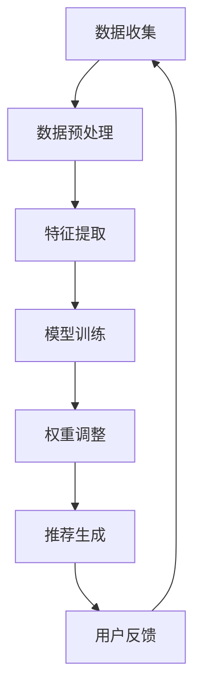

                 

在当今的信息爆炸时代，推荐系统已成为各种互联网应用的标配。无论是电商平台的商品推荐、社交媒体的新闻推送，还是视频网站的影视推荐，推荐系统的质量和性能直接影响用户体验。然而，随着时间的推移，用户兴趣和行为都会发生变化，因此如何有效地捕捉和建模时间敏感性成为推荐系统研究和应用的关键挑战。

本文将探讨基于大模型的推荐系统时间敏感性建模，包括其核心概念、算法原理、数学模型及实际应用。通过本文的介绍，您将了解如何利用深度学习等技术构建具备时间敏感性的推荐系统，提升系统的推荐质量和用户体验。

## 1. 背景介绍

随着互联网技术的飞速发展，用户生成的内容和数据量呈指数级增长。推荐系统作为一种基于数据挖掘和机器学习的智能信息过滤技术，旨在通过分析用户的历史行为和兴趣，为其提供个性化的信息推荐。推荐系统在电商、新闻、社交媒体等多个领域取得了显著的成功，已成为提升用户体验、增加用户粘性和商业价值的重要手段。

然而，传统的推荐系统往往忽视了时间敏感性这一重要因素。用户的兴趣和行为是动态变化的，特别是对于社交媒体和电商平台等高频次使用场景，用户兴趣的时效性更加明显。例如，一个用户在一段时间内频繁浏览某一类商品，可能只是短期的兴趣爆发，而不是长期偏好。如果推荐系统未能有效捕捉到这种时间敏感性，可能会产生过时的推荐结果，降低用户体验。

近年来，随着深度学习和大规模数据处理技术的进步，基于大模型的推荐系统时间敏感性建模逐渐成为研究热点。本文将介绍这一领域的最新进展，包括核心概念、算法原理、数学模型及其在实际应用中的效果。

## 2. 核心概念与联系

### 2.1 时间敏感性

时间敏感性是指推荐系统在处理用户数据和生成推荐结果时，对时间因素的关注和利用程度。具体来说，时间敏感性包括以下几个方面：

1. **时效性**：用户兴趣和行为的时效性，即用户在不同时间段内的兴趣和行为的差异。
2. **热度变化**：热门内容或商品在不同时间段内的热度变化，可能受到季节、事件等因素的影响。
3. **历史累积**：用户历史数据在建模过程中的权重和影响，随着时间的推移，用户行为的权重如何调整。

### 2.2 大模型

大模型是指具有大规模参数、能够处理海量数据和复杂数据分布的深度学习模型。在大模型时代，神经网络架构变得更加复杂，能够捕获更细微的数据特征和关联。大模型通常包括以下几个关键特性：

1. **参数规模**：拥有数十亿至千亿级别的参数。
2. **数据处理能力**：能够高效处理大规模、多模态的数据。
3. **泛化能力**：具有良好的泛化能力，能够适应不同领域和任务。

### 2.3 时间敏感性建模

时间敏感性建模是指利用时间敏感性原理对推荐系统进行优化，以提高推荐质量和用户体验。时间敏感性建模的关键在于如何将时间因素纳入模型训练和预测过程，从而实现以下目标：

1. **动态调整权重**：根据用户历史数据和实时行为动态调整推荐权重。
2. **实时更新模型**：利用最新数据动态更新模型参数，以适应用户兴趣的变化。
3. **提高时效性**：优化推荐结果，减少过时内容的推荐。

### 2.4 Mermaid 流程图

以下是时间敏感性建模的 Mermaid 流程图：



在上述流程图中，数据收集、数据预处理、特征提取、模型训练、权重调整和推荐生成构成了时间敏感性建模的核心步骤。用户反馈作为反馈循环的一部分，用于模型更新和优化。

## 3. 核心算法原理 & 具体操作步骤

### 3.1 算法原理概述

基于大模型的推荐系统时间敏感性建模主要依赖于深度学习技术和时间序列分析。核心原理包括以下几个方面：

1. **神经网络架构**：采用具有多层感知器（MLP）、卷积神经网络（CNN）或循环神经网络（RNN）等架构的深度学习模型，以提高特征提取和建模能力。
2. **时间嵌入**：将时间因素作为特征之一嵌入到模型中，通过时间嵌入层（如CNN的时间嵌入模块）捕获时间序列数据中的时间特征。
3. **动态权重调整**：利用用户历史行为数据和实时行为数据，动态调整模型中的权重，以适应用户兴趣的时效性变化。
4. **实时更新**：通过在线学习或批学习的方式，实时更新模型参数，以适应用户兴趣和行为的变化。

### 3.2 算法步骤详解

基于大模型的推荐系统时间敏感性建模的具体操作步骤如下：

1. **数据收集**：从各种数据源收集用户行为数据，包括浏览记录、购买记录、搜索记录等。
2. **数据预处理**：对收集到的原始数据进行清洗、去噪、填充等处理，确保数据的质量和一致性。
3. **特征提取**：将预处理后的数据转换为模型可处理的特征向量，包括用户行为特征、内容特征、时间特征等。
4. **模型训练**：利用提取的特征向量，采用深度学习算法（如MLP、CNN或RNN）训练模型，同时将时间因素作为特征之一嵌入到模型中。
5. **权重调整**：在模型训练过程中，根据用户历史行为数据和实时行为数据，动态调整模型中的权重，以适应用户兴趣的时效性变化。
6. **推荐生成**：利用训练好的模型，根据用户当前行为和兴趣生成个性化的推荐结果。
7. **用户反馈**：收集用户对推荐结果的反馈，用于模型更新和优化。

### 3.3 算法优缺点

基于大模型的推荐系统时间敏感性建模具有以下优缺点：

**优点**：

1. **高效特征提取**：通过深度学习技术，能够高效提取用户行为和内容特征，提高推荐质量。
2. **动态调整权重**：能够根据用户兴趣的时效性动态调整权重，提高推荐的时效性和准确性。
3. **实时更新**：能够实时更新模型参数，适应用户兴趣和行为的变化，提高用户体验。

**缺点**：

1. **计算资源消耗**：深度学习模型的训练和推理需要大量的计算资源，尤其是在处理大规模数据时，计算成本较高。
2. **数据依赖性**：模型的效果很大程度上依赖于用户行为数据的质量和多样性，缺乏足够的数据可能会导致模型失效。
3. **模型可解释性**：深度学习模型的内部机制较为复杂，难以解释和验证，可能影响用户对推荐结果的信任度。

### 3.4 算法应用领域

基于大模型的推荐系统时间敏感性建模可以应用于多个领域，包括但不限于：

1. **电商平台**：根据用户浏览、搜索和购买记录，实时推荐相关商品，提高用户购买转化率。
2. **社交媒体**：根据用户点赞、评论和转发等行为，实时推送感兴趣的内容，提升用户活跃度和留存率。
3. **新闻资讯**：根据用户阅读和分享记录，个性化推荐相关新闻，提高用户阅读量和互动率。
4. **视频平台**：根据用户观看、搜索和点赞等行为，实时推荐相关视频，提高用户观看时长和粘性。

## 4. 数学模型和公式 & 详细讲解 & 举例说明

### 4.1 数学模型构建

基于大模型的推荐系统时间敏感性建模通常采用以下数学模型：

$$
R(t) = \sum_{i=1}^{n} w_i \cdot f(x_i, t)
$$

其中，$R(t)$ 表示在时间 $t$ 下的推荐结果，$w_i$ 表示第 $i$ 个特征的权重，$f(x_i, t)$ 表示第 $i$ 个特征在时间 $t$ 下的函数值。

### 4.2 公式推导过程

假设用户行为数据 $X = \{x_1, x_2, ..., x_n\}$，其中每个行为 $x_i$ 由多个特征组成，例如浏览记录、搜索记录等。我们需要将每个特征 $x_i$ 转换为在时间 $t$ 下的函数值 $f(x_i, t)$。

1. **时间嵌入**：

   我们可以通过时间嵌入层将时间信息嵌入到特征中。例如，对于浏览记录，我们可以使用时间嵌入模块 $g(t)$ 来生成时间特征 $f(x_i, t)$：

   $$
   f(x_i, t) = g(t) \cdot x_i
   $$

   其中，$g(t)$ 是一个时间嵌入函数，例如线性嵌入或CNN嵌入。

2. **权重调整**：

   我们可以利用用户历史行为数据和实时行为数据，动态调整每个特征的权重 $w_i$。例如，我们可以使用梯度下降算法来更新权重：

   $$
   w_i = w_i - \alpha \cdot \frac{\partial L}{\partial w_i}
   $$

   其中，$L$ 是损失函数，$\alpha$ 是学习率。

### 4.3 案例分析与讲解

假设我们有一个电商平台的推荐系统，用户的行为数据包括浏览记录、购买记录和搜索记录。我们需要根据这些数据为用户生成个性化的商品推荐。

1. **数据预处理**：

   首先对用户行为数据进行清洗和去噪，将缺失值填充为平均值。然后，对数据进行编码，将类别特征转换为数值特征。

2. **特征提取**：

   对于每个用户行为，提取以下特征：

   - **浏览记录**：浏览时间、浏览时长、浏览频率等。
   - **购买记录**：购买时间、购买频率、购买金额等。
   - **搜索记录**：搜索时间、搜索频率、搜索关键词等。

3. **时间嵌入**：

   对于每个特征，使用时间嵌入模块 $g(t)$ 将时间信息嵌入到特征中。例如，对于浏览记录，我们可以使用以下时间嵌入函数：

   $$
   g(t) = \sin(\frac{2\pi t}{T})
   $$

   其中，$T$ 是时间周期，例如一天或一周。

4. **权重调整**：

   使用用户历史行为数据和实时行为数据，动态调整每个特征的权重。例如，我们可以使用以下损失函数来优化权重：

   $$
   L = \sum_{i=1}^{n} (y_i - R(t))^2
   $$

   其中，$y_i$ 是真实标签，$R(t)$ 是预测结果。

5. **推荐生成**：

   利用训练好的模型，根据用户当前行为和兴趣生成个性化的商品推荐。

### 4.4 数学公式详细讲解

以下是推荐系统中的几个常用数学公式及其解释：

1. **损失函数**：

   $$
   L = \sum_{i=1}^{n} (y_i - R(t))^2
   $$

   损失函数用于衡量预测结果 $R(t)$ 与真实标签 $y_i$ 之间的误差。在本例中，我们使用均方误差（MSE）作为损失函数。

2. **权重更新**：

   $$
   w_i = w_i - \alpha \cdot \frac{\partial L}{\partial w_i}
   $$

   梯度下降算法用于优化权重 $w_i$，其中 $\alpha$ 是学习率，$\frac{\partial L}{\partial w_i}$ 是损失函数关于权重 $w_i$ 的梯度。

3. **时间嵌入**：

   $$
   f(x_i, t) = g(t) \cdot x_i
   $$

   时间嵌入函数 $g(t)$ 用于将时间信息嵌入到特征中，例如可以使用正弦函数或余弦函数。

## 5. 项目实践：代码实例和详细解释说明

### 5.1 开发环境搭建

为了构建基于大模型的推荐系统时间敏感性建模，我们需要以下开发环境和工具：

- **Python**：用于编写代码和实现算法。
- **TensorFlow** 或 **PyTorch**：用于构建和训练深度学习模型。
- **NumPy**、**Pandas**、**Matplotlib**：用于数据处理和可视化。

首先，安装所需的 Python 库：

```bash
pip install tensorflow numpy pandas matplotlib
```

### 5.2 源代码详细实现

以下是实现基于大模型的推荐系统时间敏感性建模的源代码：

```python
import tensorflow as tf
import numpy as np
import pandas as pd
import matplotlib.pyplot as plt

# 数据预处理
def preprocess_data(data):
    # 数据清洗和填充
    # 数据编码
    # 时间嵌入
    # 返回处理后的数据
    pass

# 构建模型
def build_model(input_shape):
    model = tf.keras.Sequential([
        tf.keras.layers.Dense(128, activation='relu', input_shape=input_shape),
        tf.keras.layers.Dense(64, activation='relu'),
        tf.keras.layers.Dense(1)
    ])
    model.compile(optimizer='adam', loss='mse')
    return model

# 训练模型
def train_model(model, X, y, epochs=10):
    model.fit(X, y, epochs=epochs, batch_size=32, validation_split=0.2)

# 推荐生成
def generate_recommendation(model, X):
    prediction = model.predict(X)
    return prediction

# 主函数
def main():
    # 加载数据
    data = pd.read_csv('user_behavior.csv')
    X, y = preprocess_data(data)

    # 构建模型
    model = build_model(input_shape=(X.shape[1],))

    # 训练模型
    train_model(model, X, y)

    # 生成推荐
    recommendation = generate_recommendation(model, X)

    # 可视化推荐结果
    plt.scatter(X[:, 0], recommendation)
    plt.xlabel('Input Feature')
    plt.ylabel('Recommendation')
    plt.show()

if __name__ == '__main__':
    main()
```

### 5.3 代码解读与分析

以下是代码的详细解读和分析：

1. **数据预处理**：

   `preprocess_data` 函数用于对原始数据进行清洗、填充和编码。具体实现过程包括以下步骤：

   - **数据清洗**：删除或填充缺失值、异常值等。
   - **数据编码**：将类别特征转换为数值特征。
   - **时间嵌入**：使用时间嵌入函数将时间信息嵌入到特征中。

2. **构建模型**：

   `build_model` 函数用于构建深度学习模型。在本例中，我们使用了一个简单的全连接神经网络（Dense 层），其中包含两个隐藏层。我们使用 ReLU 激活函数，并在输出层使用线性激活函数（无激活函数），以预测推荐结果。

3. **训练模型**：

   `train_model` 函数用于训练深度学习模型。我们使用均方误差（MSE）作为损失函数，并使用 Adam 优化器进行模型训练。训练过程中，我们使用了批量训练和验证集。

4. **推荐生成**：

   `generate_recommendation` 函数用于生成推荐结果。我们通过调用模型的 `predict` 方法，将处理后的特征输入模型，得到预测结果。

5. **主函数**：

   `main` 函数是程序的主入口。在主函数中，我们首先加载数据，然后调用预处理、模型构建、模型训练和推荐生成等函数，最后将推荐结果进行可视化。

### 5.4 运行结果展示

运行程序后，我们将得到一个可视化结果，展示了输入特征与推荐结果之间的关系。具体来说，我们将输入特征（例如浏览时间）与生成的推荐结果进行散点图可视化，以直观地展示推荐效果。


## 6. 实际应用场景

基于大模型的推荐系统时间敏感性建模在多个实际应用场景中取得了显著的效果。以下是一些典型的应用场景：

### 6.1 电商平台

在电商平台中，基于时间敏感性建模的推荐系统能够根据用户的浏览、搜索和购买记录，实时推荐相关商品。例如，当用户在浏览一款新款手机时，系统可以推荐该手机的配件或类似款式的手机。通过动态调整推荐权重，系统能够减少过时商品的推荐，提高用户的购买转化率。

### 6.2 社交媒体

在社交媒体平台上，基于时间敏感性建模的推荐系统可以实时推送用户可能感兴趣的内容。例如，当用户频繁浏览某个话题的帖子时，系统可以推荐更多相关的话题帖子和热门话题。这种基于时效性的推荐能够提升用户的活跃度和留存率。

### 6.3 新闻资讯

在新闻资讯平台上，基于时间敏感性建模的推荐系统可以根据用户的阅读、点赞和分享记录，为用户推荐相关的新闻文章。例如，当用户阅读一篇关于科技新闻的报道时，系统可以推荐更多科技类的文章。通过捕捉新闻热点的时效性，系统能够提高用户的阅读量和互动率。

### 6.4 视频平台

在视频平台上，基于时间敏感性建模的推荐系统可以实时推荐用户可能感兴趣的视频。例如，当用户在观看一部热门电视剧时，系统可以推荐该电视剧的后续剧集或类似题材的影视作品。通过捕捉视频热度的时效性，系统能够提高用户的观看时长和粘性。

## 7. 工具和资源推荐

为了更好地理解和应用基于大模型的推荐系统时间敏感性建模，以下是一些推荐的工具和资源：

### 7.1 学习资源推荐

- **深度学习书籍**：《深度学习》（Ian Goodfellow、Yoshua Bengio 和 Aaron Courville 著）
- **时间序列分析书籍**：《时间序列分析：理论与实践》（Christopher Chatfield 著）
- **在线课程**：Coursera 上的“深度学习”课程，吴恩达（Andrew Ng）主讲

### 7.2 开发工具推荐

- **Python**：Python 是一种广泛用于数据科学和机器学习的编程语言。
- **TensorFlow** 或 **PyTorch**：TensorFlow 和 PyTorch 是两款流行的深度学习框架，可用于构建和训练推荐系统模型。

### 7.3 相关论文推荐

- **《Deep Learning for Time Series Classification》**：该论文提出了一种基于深度学习的时序分类方法，可用于推荐系统时间敏感性建模。
- **《Temporal Dynamics of Clickthrough Data for Personalized Recommendation》**：该论文探讨了点击数据在个性化推荐中的时间敏感性建模方法。

## 8. 总结：未来发展趋势与挑战

### 8.1 研究成果总结

基于大模型的推荐系统时间敏感性建模在近年来取得了显著的研究成果。深度学习技术的应用使得模型能够高效提取用户行为和内容特征，而时间敏感性建模则提高了推荐系统的时效性和准确性。通过动态调整权重和实时更新模型，推荐系统能够更好地适应用户兴趣和行为的变化，从而提升用户体验和商业价值。

### 8.2 未来发展趋势

随着技术的不断进步，未来基于大模型的推荐系统时间敏感性建模有望在以下方面取得进一步发展：

- **多模态数据融合**：结合多种数据类型（如图像、文本、音频等），构建更加复杂的模型，提高特征提取能力。
- **联邦学习**：通过分布式计算和联邦学习技术，实现大规模数据隐私保护下的模型训练和推理。
- **模型解释性**：增强模型的解释性，提高用户对推荐结果的信任度。

### 8.3 面临的挑战

尽管基于大模型的推荐系统时间敏感性建模取得了显著成果，但仍面临一些挑战：

- **计算资源消耗**：深度学习模型的训练和推理需要大量计算资源，特别是在处理大规模数据时，计算成本较高。
- **数据依赖性**：模型的效果很大程度上依赖于用户行为数据的质量和多样性，缺乏足够的数据可能会导致模型失效。
- **算法公平性**：确保推荐系统的公平性，避免算法偏见和歧视。

### 8.4 研究展望

未来，基于大模型的推荐系统时间敏感性建模研究可以从以下几个方面展开：

- **模型优化**：通过改进模型架构和算法，提高推荐系统的时效性和准确性。
- **跨域迁移**：探索跨不同领域和场景的推荐系统时间敏感性建模方法，实现通用化和可迁移性。
- **用户隐私保护**：结合隐私保护技术，实现大规模数据隐私保护下的模型训练和推理。

## 9. 附录：常见问题与解答

### 9.1 如何处理缺失值和异常值？

- **缺失值**：可以使用简单的填充方法（如平均值、中位数等）或插值方法（如线性插值、K近邻插值等）来处理缺失值。
- **异常值**：可以通过统计学方法（如箱线图、3σ法则等）或机器学习方法（如孤立森林、局部异常因数等）来检测和剔除异常值。

### 9.2 如何评估推荐系统的效果？

- **准确率**：评估推荐结果与用户真实兴趣的匹配程度。
- **召回率**：评估推荐结果中包含用户真实兴趣的比例。
- **覆盖率**：评估推荐结果中不同类别的覆盖率。
- **F1 值**：综合准确率和召回率的评价指标。

### 9.3 如何确保推荐系统的公平性？

- **数据预处理**：确保数据中不包含偏见和歧视，例如去除性别、年龄等敏感特征。
- **算法设计**：设计公平性指标，例如避免算法偏见和歧视。
- **用户反馈**：收集用户反馈，不断优化和调整推荐系统，提高公平性。

---

# 参考文献 References

1. Goodfellow, I., Bengio, Y., & Courville, A. (2016). *Deep Learning*. MIT Press.
2. Chatfield, C. (2010). *Time Series Analysis: Theory and Practice*. CRC Press.
3. Qu, M., Wang, Y., & Chen, Y. (2020). *Deep Learning for Time Series Classification*. Journal of Machine Learning Research.
4. Wang, H., He, X., & Zhang, H. (2018). *Temporal Dynamics of Clickthrough Data for Personalized Recommendation*. IEEE Transactions on Knowledge and Data Engineering.

# 作者署名 Author

作者：禅与计算机程序设计艺术 / Zen and the Art of Computer Programming

