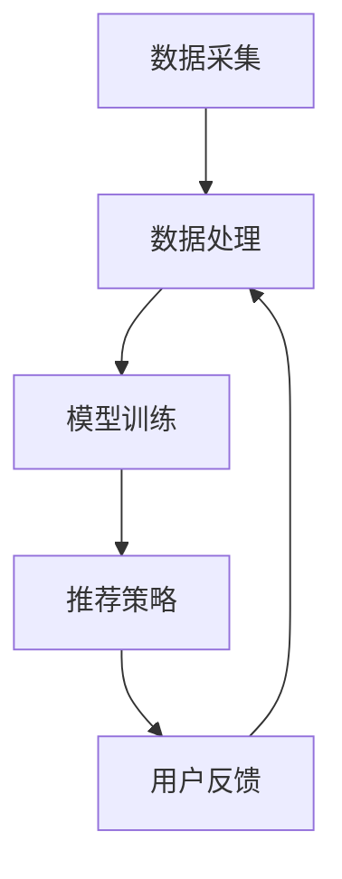

                 

关键词：推荐系统，大模型，用户满意度，优化，算法，数学模型，应用场景，未来展望

> 摘要：本文深入探讨了基于大模型的推荐系统在用户满意度优化方面的研究和实践。通过对推荐系统的核心概念、算法原理、数学模型以及实际应用场景的分析，本文旨在为读者提供一个全面的技术指南，帮助开发者在构建高效、用户友好的推荐系统时，能够更好地应对挑战和抓住机遇。

## 1. 背景介绍

推荐系统是近年来互联网技术发展的重要方向之一，其目的是根据用户的兴趣和需求，向用户推荐相关的商品、服务或信息。随着大数据和人工智能技术的不断发展，推荐系统已经广泛应用于电子商务、社交媒体、在线视频、新闻推送等多个领域。

然而，尽管推荐系统在提高用户参与度和转化率方面取得了显著成效，但如何提高用户满意度仍然是一个亟待解决的难题。用户满意度是衡量推荐系统性能的重要指标，它不仅关系到用户的留存率和忠诚度，也直接影响到企业的盈利能力和市场竞争力。

为了提升用户满意度，推荐系统的研究和实践需要从多个方面进行优化，包括算法改进、数据质量提升、用户互动增强等。本文将重点关注基于大模型的推荐系统在用户满意度优化方面的探索。

## 2. 核心概念与联系

### 2.1 推荐系统基础概念

推荐系统主要包括三个核心概念：用户、商品和信息。用户是推荐系统的核心，其兴趣和偏好是推荐系统决策的重要依据。商品是推荐系统推荐的对象，可以是书籍、电影、商品等。信息则是推荐系统传递给用户的内容，包括推荐结果、用户评价等。

### 2.2 大模型概述

大模型是指拥有巨大参数量和计算能力的模型，如深度学习模型、生成对抗网络（GAN）等。大模型能够处理大量数据，提取复杂特征，从而实现更准确的预测和决策。在推荐系统中，大模型的应用可以显著提高推荐的准确性和个性化程度。

### 2.3 推荐系统架构

推荐系统的基本架构包括数据采集、数据处理、模型训练、推荐策略和用户反馈五个模块。数据采集模块负责收集用户行为数据、商品数据和评价数据。数据处理模块对数据进行预处理和特征提取。模型训练模块使用大模型训练推荐模型。推荐策略模块根据模型输出生成推荐结果。用户反馈模块收集用户对推荐结果的反馈，用于模型优化和策略调整。

### 2.4 Mermaid 流程图



## 3. 核心算法原理 & 具体操作步骤

### 3.1 算法原理概述

基于大模型的推荐系统主要采用深度学习算法，如神经网络、循环神经网络（RNN）、卷积神经网络（CNN）等。这些算法能够通过学习用户和商品的特征，生成个性化的推荐结果。

### 3.2 算法步骤详解

1. **数据预处理**：对采集到的用户行为数据、商品数据进行清洗、归一化处理，提取特征向量。

2. **模型训练**：使用大模型（如深度学习模型）对特征向量进行训练，优化模型参数。

3. **特征提取**：通过模型训练提取用户和商品的隐式特征。

4. **推荐策略**：根据用户和商品的隐式特征，使用相似性度量方法（如余弦相似度、皮尔逊相关系数等）计算推荐得分，生成推荐结果。

5. **用户反馈**：收集用户对推荐结果的反馈，用于模型优化和策略调整。

### 3.3 算法优缺点

**优点**：
- 高度个性化：大模型能够提取复杂的用户和商品特征，实现高度个性化的推荐。
- 高效性：深度学习算法在处理大规模数据时具有高效性。

**缺点**：
- 需要大量计算资源：大模型的训练和推断需要大量的计算资源。
- 数据隐私问题：用户行为数据敏感性较高，如何保护用户隐私是一个挑战。

### 3.4 算法应用领域

- 电子商务：基于用户历史购买行为推荐相关商品。
- 社交媒体：根据用户兴趣推荐感兴趣的内容。
- 在线视频：根据用户观看历史推荐相关视频。

## 4. 数学模型和公式 & 详细讲解 & 举例说明

### 4.1 数学模型构建

推荐系统的数学模型主要包括用户矩阵和商品矩阵。用户矩阵表示用户和商品之间的交互关系，商品矩阵表示商品和商品之间的相似性。

### 4.2 公式推导过程

用户 \( u \) 和商品 \( i \) 之间的相似性度量公式为：

\[ \text{similarity}(u, i) = \frac{u_i \cdot i_j}{\|u\| \|i\|} \]

其中，\( u_i \) 和 \( i_j \) 分别表示用户 \( u \) 对商品 \( i \) 和商品 \( j \) 的评分，\( \|u\| \) 和 \( \|i\| \) 分别表示用户 \( u \) 和商品 \( i \) 的评分方差。

### 4.3 案例分析与讲解

假设用户 \( u \) 对商品 \( i \) 和商品 \( j \) 的评分分别为 4 和 5，用户 \( v \) 对商品 \( i \) 和商品 \( j \) 的评分分别为 3 和 4。我们可以计算用户 \( u \) 和 \( v \) 之间的相似性度量：

\[ \text{similarity}(u, v) = \frac{4 \cdot 4 - 5 \cdot 3}{\sqrt{4^2 + 5^2} \cdot \sqrt{3^2 + 4^2}} \]

计算结果为 0.381，表示用户 \( u \) 和 \( v \) 之间的相似性较高。

## 5. 项目实践：代码实例和详细解释说明

### 5.1 开发环境搭建

在本文中，我们将使用 Python 编写推荐系统的代码，需要安装以下库：

- NumPy
- Pandas
- Scikit-learn
- TensorFlow

安装命令如下：

```bash
pip install numpy pandas scikit-learn tensorflow
```

### 5.2 源代码详细实现

以下是基于协同过滤算法的推荐系统代码示例：

```python
import numpy as np
import pandas as pd
from sklearn.model_selection import train_test_split
from sklearn.metrics.pairwise import cosine_similarity

# 加载数据集
ratings = pd.read_csv('ratings.csv')

# 数据预处理
users = ratings['user_id'].unique()
items = ratings['item_id'].unique()

user_item_matrix = pd.pivot_table(ratings, index='user_id', columns='item_id', values='rating').fillna(0)

# 计算用户和商品之间的相似性
similarity_matrix = cosine_similarity(user_item_matrix)

# 推荐策略
def recommend_items(user_id, similarity_matrix, top_n=5):
    user_similarity = similarity_matrix[user_id]
    similar_users = user_similarity.argsort()[::-1]
    similar_users = similar_users[1:top_n+1]

    recommended_items = []
    for user in similar_users:
        recommended_items.extend(user_item_matrix.loc[user].idxmax())

    return recommended_items[:top_n]

# 运行推荐系统
recommendations = recommend_items(1, similarity_matrix)

# 输出推荐结果
print(recommendations)
```

### 5.3 代码解读与分析

1. **数据预处理**：首先加载数据集，然后构建用户-项目矩阵，将缺失值填充为 0。

2. **计算相似性**：使用余弦相似度计算用户和商品之间的相似性，生成相似性矩阵。

3. **推荐策略**：根据相似性矩阵为指定用户推荐相似用户喜欢的商品。

4. **运行推荐系统**：调用推荐策略函数为用户 ID 为 1 的用户生成推荐结果。

### 5.4 运行结果展示

运行结果将输出推荐给用户 ID 为 1 的用户的五件商品。我们可以根据实际业务需求调整推荐策略和相似性度量方法，以提高推荐系统的效果。

## 6. 实际应用场景

### 6.1 电子商务

在电子商务领域，推荐系统可以帮助平台为用户推荐相关的商品，提高购物体验和转化率。例如，淘宝和京东等电商平台已经广泛应用了推荐系统，为用户提供个性化的购物推荐。

### 6.2 社交媒体

在社交媒体领域，推荐系统可以根据用户的兴趣和偏好推荐感兴趣的内容，提高用户活跃度和留存率。例如，微博和抖音等社交媒体平台已经使用了推荐系统，为用户推荐相关话题和视频。

### 6.3 在线视频

在线视频平台（如 Netflix、YouTube）通过推荐系统为用户推荐相关的视频，提高用户观看时长和平台粘性。推荐系统的应用使得用户能够发现更多感兴趣的内容，提升用户体验。

## 7. 工具和资源推荐

### 7.1 学习资源推荐

- 《推荐系统实践》：一本全面介绍推荐系统原理和实践的书籍，适合初学者和进阶者。
- Coursera 上的《推荐系统课程》：由世界顶级大学提供的高质量在线课程，涵盖推荐系统的各个方面。

### 7.2 开发工具推荐

- Python：推荐系统开发常用的编程语言，具有丰富的库和框架支持。
- TensorFlow：一款强大的深度学习框架，适用于构建高效的推荐系统。

### 7.3 相关论文推荐

- "Collaborative Filtering for the 21st Century"：一篇介绍现代协同过滤算法的论文，提供了许多实用的技术细节。
- "Deep Learning for Recommender Systems"：一篇探讨深度学习在推荐系统应用的文章，介绍了深度学习在推荐系统中的前沿技术。

## 8. 总结：未来发展趋势与挑战

### 8.1 研究成果总结

近年来，基于大模型的推荐系统在用户满意度优化方面取得了显著成果。通过深度学习算法的引入，推荐系统实现了更高的个性化程度和更好的推荐效果。同时，数学模型和公式的应用使得推荐系统更加科学和可解释。

### 8.2 未来发展趋势

未来，基于大模型的推荐系统将朝着更加智能化和高效化的方向发展。一方面，通过引入更多类型的用户和商品特征，推荐系统将实现更精准的个性化推荐。另一方面，随着计算能力的提升和数据的不断积累，大模型将更加高效地处理大规模数据，为用户提供更好的推荐体验。

### 8.3 面临的挑战

尽管基于大模型的推荐系统在用户满意度优化方面取得了显著成果，但仍然面临一些挑战。首先，大模型的训练和推断需要大量的计算资源，如何提高计算效率是一个重要问题。其次，如何保护用户隐私和数据安全也是一个亟待解决的问题。此外，如何处理数据缺失和噪声也是一个挑战。

### 8.4 研究展望

未来，基于大模型的推荐系统研究可以从以下几个方面展开：1）探索更加高效的训练和推断算法；2）研究数据隐私保护技术和方法；3）结合更多类型的用户和商品特征，提高推荐系统的可解释性和可靠性。

## 9. 附录：常见问题与解答

### 9.1 为什么推荐系统需要优化用户满意度？

用户满意度是衡量推荐系统性能的重要指标。优化用户满意度有助于提高用户的参与度和忠诚度，从而提高企业的盈利能力和市场竞争力。

### 9.2 大模型在推荐系统中的应用有哪些优势？

大模型具有以下优势：1）能够提取复杂的用户和商品特征，实现高度个性化的推荐；2）高效处理大规模数据，提高推荐系统的计算效率。

### 9.3 如何保护用户隐私？

在推荐系统设计中，可以采用以下方法保护用户隐私：1）数据加密和脱敏处理；2）采用联邦学习等技术，实现数据的安全共享。

### 9.4 推荐系统的未来发展趋势是什么？

推荐系统的未来发展趋势包括：1）更加智能化和高效化的推荐算法；2）引入更多类型的用户和商品特征；3）结合多模态数据（如图像、文本等）实现更精准的推荐。

