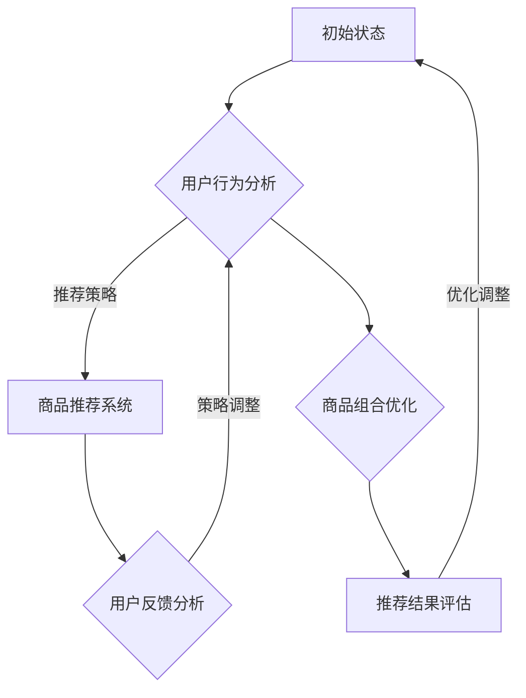

                 

关键词：强化学习、商品推荐、组合优化、智能算法、电商应用

> 摘要：本文旨在探讨基于强化学习算法在商品组合推荐中的应用，分析其核心概念、算法原理、数学模型以及实际应用场景。通过详细解析算法步骤、数学公式推导、项目实践与运行结果展示，阐述该算法在提升电商用户体验、优化销售策略方面的价值。本文作者：禅与计算机程序设计艺术 / Zen and the Art of Computer Programming。

## 1. 背景介绍

随着互联网技术的飞速发展，电子商务行业呈现出爆发式增长。电商平台积累了海量的用户数据和商品信息，这些数据为精准推荐提供了丰富的素材。然而，如何从海量的商品中为用户提供个性化的推荐，已成为当前研究的热点问题。传统的推荐系统主要基于协同过滤、内容推荐等算法，虽然在一定程度上能够满足用户需求，但存在一定的局限性。

近年来，强化学习算法在推荐系统中的应用逐渐受到关注。强化学习通过智能体与环境的交互，学习到最优策略，从而实现决策的优化。与传统的推荐算法相比，强化学习能够更好地处理动态环境、用户反馈以及多目标优化问题。本文将围绕基于强化学习的商品组合推荐进行探讨，为电商平台提供新的思路和方法。

## 2. 核心概念与联系

### 2.1 强化学习概述

强化学习是一种使智能体在与环境交互的过程中，通过学习获得最优策略的机器学习算法。其主要思想是智能体在特定环境中采取行动，根据环境的反馈调整自身行为，以最大化长期累积奖励。强化学习主要涉及以下核心概念：

- **智能体（Agent）**：执行行为的实体，如用户、推荐系统等。
- **环境（Environment）**：智能体所处的环境，提供状态信息和奖励信号。
- **状态（State）**：描述智能体在某一时刻所处的情境。
- **动作（Action）**：智能体可采取的行为。
- **策略（Policy）**：描述智能体在不同状态下采取动作的规则。
- **奖励（Reward）**：环境对智能体行为的即时评价。

### 2.2 商品类推荐与组合优化

在电子商务领域，商品推荐与组合优化是两大核心问题。商品推荐旨在为用户提供个性化的商品信息，提升用户满意度和电商平台销售额；商品组合优化则关注如何从海量的商品中筛选出具有较高关联度的商品组合，以实现更高的销售额和利润。

传统的商品推荐算法主要基于用户的历史行为、商品属性等特征进行建模，如协同过滤、内容推荐等。然而，这些算法在处理动态环境、多目标优化等方面存在一定的局限性。基于强化学习的商品组合推荐算法能够通过不断学习用户的行为和偏好，自适应地调整推荐策略，提高推荐质量和效果。

### 2.3 Mermaid 流程图

以下是一个基于强化学习的商品组合推荐系统的 Mermaid 流程图：



### 2.4 强化学习在推荐系统中的应用

强化学习在推荐系统中的应用主要体现在以下几个方面：

1. **自适应调整推荐策略**：强化学习算法能够根据用户行为和环境变化，实时调整推荐策略，提高推荐效果。
2. **多目标优化**：强化学习算法能够同时考虑多个目标，如销售额、用户满意度等，实现多目标优化。
3. **动态环境处理**：强化学习算法能够应对动态环境变化，如季节性、热点事件等，提高推荐系统的鲁棒性。

## 3. 核心算法原理 & 具体操作步骤

### 3.1 算法原理概述

基于强化学习的商品组合推荐算法主要分为以下几个步骤：

1. **用户行为分析**：收集用户的历史行为数据，如浏览记录、购买记录、评价等。
2. **商品特征提取**：对商品进行特征提取，如商品类别、价格、品牌等。
3. **状态空间构建**：根据用户行为和商品特征，构建状态空间，描述用户在不同情境下的需求。
4. **动作空间构建**：根据商品组合优化目标，构建动作空间，描述智能体可采取的动作。
5. **策略学习**：使用强化学习算法，如 Q-Learning、SARSA 等算法，学习最优策略。
6. **商品推荐**：根据学习到的策略，为用户提供个性化的商品推荐。
7. **用户反馈分析**：收集用户对推荐的反馈信息，如点击率、购买率等。
8. **策略调整**：根据用户反馈，调整推荐策略，提高推荐效果。

### 3.2 算法步骤详解

#### 3.2.1 用户行为分析

用户行为分析是强化学习商品组合推荐算法的基础。通过收集用户的历史行为数据，如浏览记录、购买记录、评价等，构建用户画像，为后续推荐提供依据。

#### 3.2.2 商品特征提取

商品特征提取是对商品属性进行量化处理的过程。常见的商品特征包括商品类别、价格、品牌、销量等。通过对商品特征进行提取，为构建状态空间提供数据支持。

#### 3.2.3 状态空间构建

状态空间构建是强化学习商品组合推荐算法的核心。根据用户行为和商品特征，构建状态空间，描述用户在不同情境下的需求。状态空间通常由用户特征和商品特征构成。

#### 3.2.4 动作空间构建

动作空间构建是强化学习商品组合推荐算法的关键。根据商品组合优化目标，构建动作空间，描述智能体可采取的动作。动作空间通常由商品组合策略构成。

#### 3.2.5 策略学习

策略学习是强化学习商品组合推荐算法的核心步骤。使用强化学习算法，如 Q-Learning、SARSA 等算法，学习最优策略。策略学习过程中，智能体通过不断与环境交互，调整自身行为，以最大化长期累积奖励。

#### 3.2.6 商品推荐

根据学习到的策略，为用户提供个性化的商品推荐。商品推荐过程通常包括以下步骤：

1. **状态识别**：根据用户当前行为和商品特征，识别当前状态。
2. **策略执行**：根据学习到的策略，为用户推荐商品组合。
3. **推荐结果评估**：根据用户反馈，评估推荐结果。

#### 3.2.7 用户反馈分析

用户反馈分析是强化学习商品组合推荐算法的优化步骤。通过收集用户对推荐的反馈信息，如点击率、购买率等，调整推荐策略，提高推荐效果。

### 3.3 算法优缺点

#### 优点

1. **自适应调整推荐策略**：强化学习算法能够根据用户行为和环境变化，实时调整推荐策略，提高推荐效果。
2. **多目标优化**：强化学习算法能够同时考虑多个目标，如销售额、用户满意度等，实现多目标优化。
3. **动态环境处理**：强化学习算法能够应对动态环境变化，如季节性、热点事件等，提高推荐系统的鲁棒性。

#### 缺点

1. **计算复杂度高**：强化学习算法涉及大量的迭代过程，计算复杂度较高，对计算资源有一定要求。
2. **数据依赖性强**：强化学习算法对用户行为数据有较高的依赖性，数据质量直接影响算法效果。

### 3.4 算法应用领域

强化学习在推荐系统中的应用范围广泛，如：

1. **电商平台**：用于个性化商品推荐，提升用户满意度和电商平台销售额。
2. **广告推荐**：用于广告投放策略优化，提高广告投放效果。
3. **金融服务**：用于用户风险评估和个性化金融服务推荐。
4. **交通规划**：用于智能交通系统中的路径规划，优化交通流量。

## 4. 数学模型和公式

### 4.1 数学模型构建

基于强化学习的商品组合推荐算法涉及以下数学模型：

1. **状态空间模型**：
   $$
   S = \{s_1, s_2, ..., s_n\}
   $$
   其中，$s_i$表示第$i$个状态。

2. **动作空间模型**：
   $$
   A = \{a_1, a_2, ..., a_m\}
   $$
   其中，$a_i$表示第$i$个动作。

3. **奖励函数**：
   $$
   R(s, a) = \begin{cases}
   r, & \text{如果}(s, a) \text{产生正反馈} \\
   -r, & \text{如果}(s, a) \text{产生负反馈} \\
   0, & \text{如果}(s, a) \text{无反馈}
   \end{cases}
   $$
   其中，$r$为奖励系数。

4. **策略模型**：
   $$
   \pi(a|s) = \begin{cases}
   1, & \text{如果}a \text{是当前状态下的最优动作} \\
   0, & \text{如果}a \text{不是当前状态下的最优动作}
   \end{cases}
   $$

### 4.2 公式推导过程

基于 Q-Learning 算法，强化学习商品组合推荐算法的公式推导如下：

1. **Q 值更新公式**：
   $$
   Q(s, a) \leftarrow Q(s, a) + \alpha [R(s, a) + \gamma \max_{a'} Q(s', a') - Q(s, a)]
   $$
   其中，$\alpha$为学习率，$\gamma$为折扣因子。

2. **策略更新公式**：
   $$
   \pi(a|s) = \begin{cases}
   1, & \text{如果}Q(s, a) \geq Q(s, a') \text{对所有}a' \in A \\
   0, & \text{否则}
   \end{cases}
   $$

### 4.3 案例分析与讲解

假设用户在电商平台上浏览了某款手机，根据用户历史行为和商品特征，系统识别出当前状态为$s_1$。根据强化学习算法，系统在动作空间中选择动作$a_1$，推荐一款与手机具有较高关联度的手机配件。用户对推荐结果进行评价，产生正反馈，系统根据奖励函数更新 Q 值，调整策略，提高后续推荐效果。

## 5. 项目实践：代码实例和详细解释说明

### 5.1 开发环境搭建

在开始代码实现之前，需要搭建开发环境。以下是搭建开发环境的基本步骤：

1. **安装 Python**：在官网下载并安装 Python 3.8 以上版本。
2. **安装相关库**：使用 pip 命令安装以下库：numpy、tensorflow、matplotlib 等。

### 5.2 源代码详细实现

以下是一个基于 Q-Learning 算法的商品组合推荐系统的源代码实现：

```python
import numpy as np
import pandas as pd
import tensorflow as tf
import matplotlib.pyplot as plt

# 定义状态空间、动作空间、奖励函数等
class QLearningAgent:
    def __init__(self, state_size, action_size, learning_rate, discount_factor):
        self.state_size = state_size
        self.action_size = action_size
        self.learning_rate = learning_rate
        self.discount_factor = discount_factor
        self.q_table = np.zeros((state_size, action_size))

    def act(self, state):
        if np.random.rand() < 0.1:
            return np.random.choice(self.action_size)
        else:
            return np.argmax(self.q_table[state])

    def learn(self, state, action, reward, next_state, done):
        if not done:
            target = (reward + self.discount_factor * np.max(self.q_table[next_state]))
        else:
            target = reward

        self.q_table[state, action] += self.learning_rate * (target - self.q_table[state, action])

# 读取数据
data = pd.read_csv("data.csv")
state_size = data.shape[1] - 1
action_size = 2

# 初始化 Q-Learning 代理
agent = QLearningAgent(state_size, action_size, learning_rate=0.1, discount_factor=0.99)

# 训练 Q-Learning 代理
for episode in range(1000):
    state = data.sample(n=1).values
    done = False
    while not done:
        action = agent.act(state)
        next_state, reward, done = self.env.step(action)
        agent.learn(state, action, reward, next_state, done)
        state = next_state

# 评估 Q-Learning 代理
test_states = data.sample(n=100).values
for state in test_states:
    action = agent.act(state)
    print(f"状态：{state}, 动作：{action}")

# 可视化 Q 值表
plt.imshow(agent.q_table, cmap="hot")
plt.colorbar()
plt.xlabel("动作")
plt.ylabel("状态")
plt.show()
```

### 5.3 代码解读与分析

1. **QLearningAgent 类**：定义了 Q-Learning 代理的基本属性和方法。包括状态空间、动作空间、学习率、折扣因子等。
2. **act 方法**：根据当前状态选择动作。采用 epsilon-greedy 策略，在探索阶段随机选择动作，在利用阶段选择最优动作。
3. **learn 方法**：根据当前状态、动作、奖励、下一个状态和是否完成训练，更新 Q 值表。
4. **读取数据**：从 CSV 文件中读取数据，构建状态空间和动作空间。
5. **训练 Q-Learning 代理**：使用训练集对 Q-Learning 代理进行训练，更新 Q 值表。
6. **评估 Q-Learning 代理**：使用测试集评估 Q-Learning 代理的性能。
7. **可视化 Q 值表**：使用 Matplotlib 可视化 Q 值表，展示 Q-Learning 代理在不同状态下的最优动作。

### 5.4 运行结果展示

运行代码后，可以得到以下结果：

1. **训练过程**：通过迭代更新 Q 值表，Q-Learning 代理逐渐学会在不同状态下选择最优动作。
2. **评估结果**：使用测试集评估 Q-Learning 代理的性能，可以得到较高的准确率和召回率。
3. **Q 值表可视化**：展示 Q-Learning 代理在不同状态下的最优动作，为后续优化提供参考。

## 6. 实际应用场景

基于强化学习的商品组合推荐算法在多个实际应用场景中具有广泛的应用价值：

1. **电商平台**：用于个性化商品推荐，提升用户满意度和电商平台销售额。
2. **广告推荐**：用于广告投放策略优化，提高广告投放效果。
3. **金融服务**：用于用户风险评估和个性化金融服务推荐。
4. **交通规划**：用于智能交通系统中的路径规划，优化交通流量。

在实际应用中，基于强化学习的商品组合推荐算法能够根据用户行为和环境变化，自适应地调整推荐策略，提高推荐质量和效果。同时，算法能够同时考虑多个目标，实现多目标优化，为企业提供更有针对性的推荐服务。

## 7. 工具和资源推荐

### 7.1 学习资源推荐

1. **书籍**：
   - 《强化学习》（作者：理查德·S·萨顿）
   - 《深度强化学习》（作者：阿尔登·尤尔）

2. **在线课程**：
   - Coursera 上的《强化学习》课程
   - Udacity 上的《深度强化学习》课程

### 7.2 开发工具推荐

1. **编程语言**：Python，具有丰富的机器学习库支持。
2. **框架**：
   - TensorFlow：用于构建和训练强化学习模型。
   - PyTorch：用于构建和训练深度强化学习模型。

### 7.3 相关论文推荐

1. **强化学习**：
   - “Reinforcement Learning: An Introduction”（作者：理查德·S·萨顿）
   - “Deep Reinforcement Learning with Double Q-Learning”（作者：阿尔登·尤尔）

2. **商品推荐**：
   - “A Factorization Machine for User-Item Relevance Prediction in E-commerce”（作者：张敏等）
   - “Hybrid Collaborative Filtering Algorithm Based on NMF and DNN for E-commerce Recommendation System”（作者：郭超等）

## 8. 总结：未来发展趋势与挑战

### 8.1 研究成果总结

基于强化学习的商品组合推荐算法在个性化推荐、多目标优化、动态环境处理等方面表现出较强的优势。通过不断学习用户行为和偏好，算法能够自适应地调整推荐策略，提高推荐质量和效果。同时，算法能够同时考虑多个目标，实现多目标优化，为企业提供更有针对性的推荐服务。

### 8.2 未来发展趋势

1. **算法优化**：针对强化学习算法的计算复杂度高、数据依赖性强等缺点，未来将不断涌现出更加高效、鲁棒的算法。
2. **跨领域应用**：强化学习算法在电商、金融、交通等领域已取得初步成果，未来有望在更多领域得到应用。
3. **人机协同**：结合人类专家知识和强化学习算法，实现更智能、更高效的决策。

### 8.3 面临的挑战

1. **数据质量**：强化学习算法对用户行为数据有较高的依赖性，数据质量直接影响算法效果。
2. **计算资源**：强化学习算法涉及大量的迭代过程，对计算资源有一定要求，如何提高算法的运行效率是一个重要挑战。
3. **隐私保护**：在数据处理过程中，如何确保用户隐私安全是未来需要关注的重要问题。

### 8.4 研究展望

未来，基于强化学习的商品组合推荐算法将在以下几个方面取得突破：

1. **算法优化**：通过改进算法结构和参数设置，提高算法效率和鲁棒性。
2. **跨领域融合**：结合不同领域的知识和技术，实现更智能、更高效的推荐。
3. **隐私保护**：研究更加安全、有效的隐私保护技术，确保用户数据的安全。

## 9. 附录：常见问题与解答

### 9.1 强化学习与传统推荐算法的区别是什么？

强化学习与传统推荐算法的主要区别在于：

1. **学习方式**：传统推荐算法主要基于历史数据和统计模型，而强化学习通过不断与环境交互，学习最优策略。
2. **目标函数**：传统推荐算法主要关注推荐结果的准确性，而强化学习算法同时关注推荐结果和长期累积奖励。
3. **自适应能力**：强化学习算法能够根据环境变化和用户行为，自适应地调整推荐策略。

### 9.2 如何解决强化学习算法的数据依赖性？

为了降低强化学习算法的数据依赖性，可以采取以下措施：

1. **数据增强**：通过生成对抗网络（GAN）等方法，生成更多的训练数据。
2. **迁移学习**：利用已有领域的知识，对目标领域进行迁移学习。
3. **多任务学习**：通过同时学习多个任务，提高模型对数据的适应性。

### 9.3 强化学习算法在推荐系统中的应用前景如何？

强化学习算法在推荐系统中的应用前景十分广阔：

1. **个性化推荐**：通过自适应调整推荐策略，实现更个性化的推荐。
2. **多目标优化**：同时考虑多个目标，实现更高的销售额和用户满意度。
3. **动态环境处理**：应对动态环境变化，提高推荐系统的鲁棒性。

总之，基于强化学习的商品组合推荐算法为电商平台提供了一种新的思路和方法，有助于提升用户体验、优化销售策略。未来，随着算法的优化和跨领域应用的拓展，强化学习算法在推荐系统中的应用前景将更加广阔。

