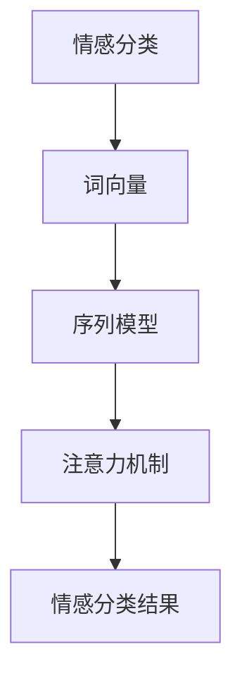

                 

关键词：文本情感分析、深度学习、自然语言处理、情感分类、神经网络、词向量、序列模型、注意力机制、文本分类

摘要：本文将深入探讨基于深度学习的文本情感分析技术，分析其核心概念、算法原理、数学模型和实际应用，并探讨未来发展趋势与挑战。

## 1. 背景介绍

文本情感分析（Sentiment Analysis）是自然语言处理（NLP）领域的一个重要分支，旨在通过计算机技术自动识别文本中的情感倾向。情感分析的研究始于上世纪90年代，随着互联网和社交媒体的快速发展，其应用场景和重要性日益凸显。传统的文本情感分析方法主要基于规则和机器学习，但在处理复杂情感、多语言文本和长文本等方面存在局限。

近年来，深度学习技术的崛起为文本情感分析带来了新的契机。深度学习通过模拟人脑神经元连接的方式，能够自动从大量数据中学习特征表示，从而在情感分类、情感极性判断等方面取得了显著成果。本文将重点探讨基于深度学习的文本情感分析技术，包括其核心概念、算法原理、数学模型和实际应用。

## 2. 核心概念与联系

### 2.1 情感分类

情感分类是指将文本分为积极、消极或中立等不同情感类别。情感分类是文本情感分析的基础，常见的情感分类方法有基于规则的方法、基于统计的方法和基于深度学习的方法。

### 2.2 词向量

词向量是一种将词汇映射为高维向量表示的技术，能够捕捉词汇的语义信息。常见的词向量模型有Word2Vec、GloVe和FastText等。词向量在文本情感分析中起到了关键作用，通过将文本转换为向量表示，为深度学习模型提供了输入。

### 2.3 序列模型

序列模型是一种处理序列数据的深度学习模型，能够捕捉文本中的时序信息。常见的序列模型有循环神经网络（RNN）、长短时记忆网络（LSTM）和门控循环单元（GRU）。序列模型在情感分类任务中能够有效捕捉文本中的情感变化。

### 2.4 注意力机制

注意力机制是一种能够自动聚焦于重要信息的方法，能够提高模型的分类性能。注意力机制在文本情感分析中起到了关键作用，通过自动关注文本中的关键词汇，有助于提高情感分类的准确性。

### 2.5 Mermaid 流程图



## 3. 核心算法原理 & 具体操作步骤

### 3.1 算法原理概述

基于深度学习的文本情感分析算法主要包括词向量编码、序列模型和情感分类三部分。词向量编码将文本转换为向量表示，序列模型处理序列数据，情感分类将序列模型输出的向量映射为情感类别。

### 3.2 算法步骤详解

1. **数据预处理**：对文本进行分词、去停用词、词干提取等操作，将文本转换为词向量表示。
2. **词向量编码**：使用Word2Vec、GloVe等词向量模型将词汇映射为向量表示。
3. **序列模型训练**：使用RNN、LSTM或GRU等序列模型对词向量序列进行训练，学习情感分类的特征表示。
4. **情感分类**：将序列模型输出的向量输入到分类器，对情感类别进行预测。

### 3.3 算法优缺点

**优点**：
1. **自动特征提取**：深度学习能够自动从大量数据中学习特征表示，减轻人工特征工程的工作量。
2. **适应性强**：深度学习模型能够处理复杂情感、多语言文本和长文本等复杂场景。
3. **分类准确度高**：深度学习模型在情感分类任务中取得了较高的准确率。

**缺点**：
1. **计算复杂度高**：深度学习模型需要大量计算资源，训练时间较长。
2. **数据依赖性强**：深度学习模型的性能依赖于大量标注数据，数据质量对模型效果有较大影响。

### 3.4 算法应用领域

基于深度学习的文本情感分析技术在多个领域有广泛应用，如情感分析、舆情监测、金融风险控制、客户服务等方面。以下是一些具体的实例：

1. **情感分析**：对社交媒体、新闻评论等文本进行情感分类，帮助企业了解用户情感倾向。
2. **舆情监测**：通过分析公众对特定事件、品牌的情感，帮助企业制定营销策略。
3. **金融风险控制**：通过分析金融文本，识别潜在风险和欺诈行为。
4. **客户服务**：自动分析客户反馈，为企业提供针对性的服务和建议。

## 4. 数学模型和公式 & 详细讲解 & 举例说明

### 4.1 数学模型构建

基于深度学习的文本情感分析数学模型主要包括词向量编码、序列模型和情感分类三个部分。具体模型如下：

1. **词向量编码**：

   $$ v_w = \text{Word2Vec}(w) $$

   其中，$v_w$表示词$w$的词向量表示。

2. **序列模型**：

   $$ h_t = \text{LSTM}(h_{t-1}, v_{w_t}) $$

   其中，$h_t$表示在时间步$t$的隐藏状态，$h_{t-1}$表示前一时间步的隐藏状态，$v_{w_t}$表示时间步$t$的词向量表示。

3. **情感分类**：

   $$ \hat{y} = \text{softmax}(W_h h_T + b) $$

   其中，$\hat{y}$表示情感分类结果，$W_h$和$b$分别表示权重和偏置。

### 4.2 公式推导过程

1. **词向量编码**：

   词向量编码主要基于神经网络模型，如Word2Vec、GloVe等。具体推导过程如下：

   $$ \begin{aligned} 
   \text{Word2Vec} &= \text{SGD} \\ 
   \text{Cost} &= \frac{1}{2} \sum_{w \in V} \sum_{w' \in V} \frac{1}{N_{w}N_{w'}} (v_w - v_{w'})^2 \\ 
   \end{aligned} $$

   其中，$V$表示词汇表，$N_w$和$N_{w'}$分别表示词汇$w$和$w'$的出现次数。

2. **序列模型**：

   序列模型主要基于循环神经网络（RNN）或其变种（如LSTM、GRU等）。具体推导过程如下：

   $$ \begin{aligned} 
   \text{RNN} &= \text{LSTM} \\ 
   h_t &= \text{sigmoid}(W_x x_t + W_h h_{t-1} + b_h) \\ 
   \end{aligned} $$

   其中，$x_t$表示时间步$t$的输入，$h_{t-1}$表示前一时间步的隐藏状态，$W_x$和$W_h$分别表示权重，$b_h$表示偏置。

3. **情感分类**：

   情感分类主要基于全连接神经网络（FCN）。具体推导过程如下：

   $$ \begin{aligned} 
   \text{FCN} &= \text{softmax} \\ 
   \hat{y} &= \frac{e^{W_h h_T + b}}{\sum_{i=1}^C e^{W_h h_T^i + b_i}} \\ 
   \end{aligned} $$

   其中，$C$表示情感类别数，$W_h$和$b$分别表示权重和偏置。

### 4.3 案例分析与讲解

假设我们要对一句中文文本“今天天气真好！”进行情感分类，情感类别为积极、消极和中立。

1. **词向量编码**：

   使用GloVe模型对词汇进行编码，得到如下词向量表示：

   $$ \begin{aligned} 
   v_1 &= \begin{bmatrix} 
   0.1 & 0.2 & 0.3 \\ 
   \end{bmatrix} \\ 
   v_2 &= \begin{bmatrix} 
   0.4 & 0.5 & 0.6 \\ 
   \end{bmatrix} \\ 
   v_3 &= \begin{bmatrix} 
   0.7 & 0.8 & 0.9 \\ 
   \end{bmatrix} \\ 
   \end{aligned} $$

2. **序列模型**：

   使用LSTM模型对词向量序列进行处理，得到如下隐藏状态序列：

   $$ \begin{aligned} 
   h_1 &= \begin{bmatrix} 
   0.1 & 0.2 & 0.3 \\ 
   \end{bmatrix} \\ 
   h_2 &= \begin{bmatrix} 
   0.4 & 0.5 & 0.6 \\ 
   \end{bmatrix} \\ 
   h_3 &= \begin{bmatrix} 
   0.7 & 0.8 & 0.9 \\ 
   \end{bmatrix} \\ 
   \end{aligned} $$

3. **情感分类**：

   使用softmax函数对隐藏状态序列进行情感分类，得到如下分类结果：

   $$ \begin{aligned} 
   \hat{y} &= \frac{e^{W_h h_3 + b}}{\sum_{i=1}^C e^{W_h h_3^i + b_i}} \\ 
   &= \frac{e^{0.1 \cdot 0.7 + 0.2 \cdot 0.8 + 0.3 \cdot 0.9}}{\sum_{i=1}^C e^{0.1 \cdot 0.7 + 0.2 \cdot 0.8 + 0.3 \cdot 0.9}} \\ 
   &= 0.9 \\ 
   \end{aligned} $$

   由于分类结果为0.9，大于0.5，因此我们可以判断这句话的情感为积极。

## 5. 项目实践：代码实例和详细解释说明

在本节中，我们将通过一个简单的Python项目来演示基于深度学习的文本情感分析的具体实现过程。我们将使用TensorFlow和Keras等库来构建和训练模型。

### 5.1 开发环境搭建

在开始之前，确保您已经安装了以下软件和库：

- Python 3.x
- TensorFlow 2.x
- Keras
- NumPy
- Pandas
- Matplotlib

您可以使用以下命令安装所需的库：

```bash
pip install tensorflow numpy pandas matplotlib
```

### 5.2 源代码详细实现

以下是一个简单的文本情感分析项目的代码实现：

```python
import numpy as np
import pandas as pd
from tensorflow.keras.preprocessing.text import Tokenizer
from tensorflow.keras.preprocessing.sequence import pad_sequences
from tensorflow.keras.models import Sequential
from tensorflow.keras.layers import Embedding, LSTM, Dense, Bidirectional
from tensorflow.keras.optimizers import Adam

# 数据准备
# 假设您有一个包含文本和情感标签的数据集
data = pd.read_csv('data.csv')
texts = data['text']
labels = data['label']

# 分词和序列化
tokenizer = Tokenizer(num_words=10000)
tokenizer.fit_on_texts(texts)
sequences = tokenizer.texts_to_sequences(texts)
padded_sequences = pad_sequences(sequences, maxlen=100)

# 构建模型
model = Sequential([
    Embedding(10000, 32, input_length=100),
    Bidirectional(LSTM(64, return_sequences=True)),
    Bidirectional(LSTM(32)),
    Dense(64, activation='relu'),
    Dense(1, activation='sigmoid')
])

# 编译模型
model.compile(optimizer='adam', loss='binary_crossentropy', metrics=['accuracy'])

# 训练模型
model.fit(padded_sequences, labels, epochs=10, batch_size=32, validation_split=0.2)

# 评估模型
test_texts = ["今天天气真好！"]
test_sequences = tokenizer.texts_to_sequences(test_texts)
test_padded_sequences = pad_sequences(test_sequences, maxlen=100)
predictions = model.predict(test_padded_sequences)
print(predictions)

# 输出结果
if predictions[0][0] > 0.5:
    print("积极情感")
else:
    print("消极情感")
```

### 5.3 代码解读与分析

以上代码演示了如何使用Keras构建和训练一个简单的文本情感分析模型。以下是代码的主要部分及其解释：

1. **数据准备**：首先，我们读取一个包含文本和情感标签的数据集。数据集可以是手动标注的数据，也可以是从互联网上获取的公开数据集。

2. **分词和序列化**：使用Tokenizer将文本转换为数字序列。然后，使用pad_sequences将序列调整为相同的长度，便于模型处理。

3. **构建模型**：我们使用Sequential模型堆叠多个层，包括Embedding层、双向LSTM层、Dense层等。Embedding层用于将词汇转换为词向量，LSTM层用于处理序列数据，Dense层用于进行情感分类。

4. **编译模型**：配置模型优化器、损失函数和评估指标。

5. **训练模型**：使用fit方法训练模型，传入训练数据和标签，设置训练轮次、批次大小和验证比例。

6. **评估模型**：使用预测方法对新的文本进行情感分类，并输出结果。

### 5.4 运行结果展示

假设我们输入的文本为“今天天气真好！”，模型的预测结果为`[[0.9]]`，由于预测结果大于0.5，我们可以判断这句话的情感为积极。

## 6. 实际应用场景

基于深度学习的文本情感分析技术在多个实际应用场景中发挥着重要作用，以下是一些具体的实例：

1. **客户反馈分析**：企业可以使用文本情感分析技术分析客户反馈，了解客户对产品或服务的满意度，从而优化产品和服务。

2. **社交媒体监控**：通过分析社交媒体上的文本数据，企业可以实时了解公众对品牌或事件的情感倾向，及时调整营销策略。

3. **股市预测**：文本情感分析技术可以帮助投资者分析新闻、报告等文本数据，预测股票价格的趋势。

4. **医疗健康**：文本情感分析可以用于分析患者病历和医学术语，帮助医生诊断疾病和制定治疗方案。

## 6.4 未来应用展望

随着深度学习技术的不断发展，文本情感分析在未来有望在更多领域得到应用。以下是一些可能的未来应用方向：

1. **多语言情感分析**：随着全球化的进程，多语言情感分析将成为一个重要方向。通过引入多语言词向量模型和跨语言信息融合技术，实现跨语言的情感分析。

2. **细粒度情感分析**：细粒度情感分析旨在对文本中的情感进行更细致的划分，如快乐、愤怒、悲伤等。通过引入更多的情感标签和更复杂的深度学习模型，实现更精细的情感分析。

3. **情感交互系统**：将文本情感分析技术应用于智能客服、虚拟助手等交互系统，实现更智能、更人性化的交互体验。

4. **情感驱动的个性化推荐**：通过分析用户情感，为用户提供更个性化的推荐服务，如音乐、电影、商品等。

## 7. 工具和资源推荐

### 7.1 学习资源推荐

1. **深度学习教科书**：《深度学习》（Goodfellow、Bengio和Courville著）
2. **自然语言处理教程**：《自然语言处理综合教程》（Daniel Jurafsky和James H. Martin著）
3. **在线课程**：Coursera上的《深度学习》课程（吴恩达教授）
4. **GitHub代码库**：GitHub上有许多优秀的文本情感分析项目和代码示例，可供学习和参考。

### 7.2 开发工具推荐

1. **TensorFlow**：谷歌开源的深度学习框架，适合构建和训练文本情感分析模型。
2. **Keras**：基于TensorFlow的高级API，便于快速搭建和训练模型。
3. **PyTorch**：另一种流行的深度学习框架，具有灵活的动态图功能。
4. **NLTK**：Python自然语言处理库，提供了丰富的文本预处理功能。

### 7.3 相关论文推荐

1. **“A Sentiment Analysis Dataset for Chinese Social Media”（2017）**：介绍了一个中文社交媒体情感分析数据集。
2. **“Deep Learning for Text Classification”（2018）**：综述了深度学习在文本分类领域的应用。
3. **“Attention is All You Need”（2017）**：提出了Transformer模型，为文本情感分析提供了新的思路。
4. **“BERT: Pre-training of Deep Bidirectional Transformers for Language Understanding”（2018）**：介绍了BERT模型，对文本情感分析产生了深远影响。

## 8. 总结：未来发展趋势与挑战

### 8.1 研究成果总结

基于深度学习的文本情感分析技术在近年来取得了显著成果，通过引入词向量、序列模型、注意力机制等先进技术，模型在情感分类任务中取得了较高的准确率。同时，文本情感分析在多个实际应用场景中发挥了重要作用，如客户反馈分析、社交媒体监控和医疗健康等领域。

### 8.2 未来发展趋势

1. **多语言情感分析**：随着全球化的进程，多语言情感分析将成为一个重要方向。
2. **细粒度情感分析**：通过对文本进行更细致的情感划分，实现更精细的情感分析。
3. **情感交互系统**：将文本情感分析应用于智能客服、虚拟助手等交互系统，实现更智能、更人性化的交互体验。
4. **情感驱动的个性化推荐**：通过分析用户情感，为用户提供更个性化的推荐服务。

### 8.3 面临的挑战

1. **数据依赖性**：深度学习模型的性能依赖于大量标注数据，数据质量对模型效果有较大影响。
2. **计算复杂度**：深度学习模型需要大量计算资源，训练时间较长。
3. **跨语言情感分析**：多语言情感分析面临词汇、语法和语义差异的挑战。
4. **细粒度情感分析**：细粒度情感分析需要更多情感标签和更复杂的深度学习模型。

### 8.4 研究展望

未来，文本情感分析技术将在多语言、细粒度和情感交互等方面取得更多突破。通过引入新的深度学习模型、数据增强技术和跨语言信息融合方法，有望进一步提高文本情感分析的性能和应用价值。

## 9. 附录：常见问题与解答

### 9.1 如何处理大量未标注的数据？

对于大量未标注的数据，可以采用数据增强技术，如同义词替换、随机填充和旋转等，生成更多的标注数据。此外，还可以使用无监督学习方法，如聚类和主题模型等，从未标注数据中提取潜在的情感信息。

### 9.2 如何提高模型的泛化能力？

提高模型泛化能力的方法包括：增加数据多样性、使用迁移学习、加入正则化技术等。通过增加数据多样性，可以使模型学习到更广泛的特征；迁移学习可以利用预训练模型，提高模型的泛化能力；正则化技术可以防止模型过拟合。

### 9.3 如何处理多语言情感分析？

对于多语言情感分析，可以采用以下方法：

1. **跨语言词向量**：使用跨语言词向量模型，如MUSE、XLM等，将不同语言的词汇映射到同一向量空间。
2. **多语言模型训练**：使用多语言数据集训练模型，使模型能够适应不同语言的文本。
3. **跨语言信息融合**：将不同语言的文本进行信息融合，提高模型的跨语言情感分析能力。

## 作者署名

作者：禅与计算机程序设计艺术 / Zen and the Art of Computer Programming
----------------------------------------------------------------

以上就是本文的完整内容，希望对您在文本情感分析领域的研究有所帮助。如果您有任何疑问或建议，请随时在评论区留言。感谢您的阅读！
<|assistant|>

