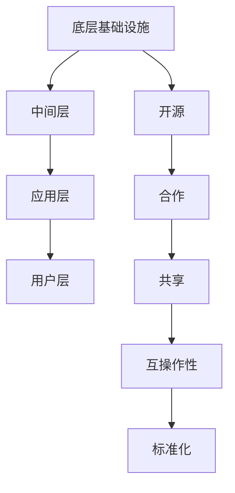

                 

关键词：基础模型、开放生态系统、人工智能、机器学习、开源、技术共享、合作发展、生态建设、AI工具、深度学习框架、模型压缩、优化、可解释性、公平性、可持续发展

> 摘要：本文旨在探讨基础模型的开放生态系统，分析其当前发展状况、核心概念、关键算法、数学模型、应用场景、未来展望以及相关工具和资源的推荐。文章将围绕如何构建一个健康、可持续的基础模型开放生态系统展开讨论，以期为人工智能技术的进步提供理论支持和实践指导。

## 1. 背景介绍

随着人工智能技术的快速发展，基础模型（Foundation Models）已经成为人工智能领域的核心组成部分。基础模型是一种能够在多个任务上取得高性能的通用模型，通过大规模的数据集进行训练，具有高度的泛化能力。它们在自然语言处理、计算机视觉、语音识别等领域发挥着至关重要的作用。然而，基础模型的发展不仅依赖于技术突破，更依赖于一个开放、合作、共享的生态系统。

开放生态系统是一种以合作共享为核心的发展模式，旨在通过开放技术、共享资源、合作创新，促进技术的快速进步和应用。在基础模型领域，开放生态系统的建设尤为重要。它不仅能够促进基础模型技术的创新，还能够降低研发成本、提高研发效率，最终推动整个行业的发展。

### 1.1 开放生态系统的意义

开放生态系统在基础模型领域具有以下几个方面的意义：

- **促进技术创新**：开放生态系统鼓励技术共享和合作创新，有助于加速新技术的研发和推广。
- **降低研发成本**：通过共享资源和成果，企业可以减少重复研发的工作，降低研发成本。
- **提高研发效率**：开放生态系统中的企业可以专注于自身的核心优势，提高整体研发效率。
- **保障数据安全**：开放生态系统中的企业和组织可以共同制定数据标准和安全协议，保障数据的安全和隐私。
- **推动行业标准化**：开放生态系统有助于推动行业标准化，促进不同企业、不同技术的互操作性。

### 1.2 开放生态系统的现状

当前，基础模型的开放生态系统已经取得了一定的进展。以深度学习框架为例，TensorFlow、PyTorch等开源框架已经成为人工智能领域的事实标准。这些框架不仅提供了丰富的API和工具，还鼓励了社区的参与和贡献。此外，许多企业也积极参与到开放生态系统中，通过共享自己的技术和资源，推动基础模型的发展。

然而，开放生态系统仍然存在一些挑战和问题，如：

- **技术多样性**：虽然深度学习框架已经成为主流，但其他类型的模型和算法仍然需要进一步推广和普及。
- **资源分配不均**：在一些领域，某些企业和组织拥有大量的资源和数据，而其他企业和组织则相对缺乏。
- **知识产权保护**：如何在开放生态系统中保护知识产权，成为了一个亟待解决的问题。

## 2. 核心概念与联系

### 2.1 开放生态系统的核心概念

开放生态系统的核心概念包括：

- **开源**：开放源代码，允许用户自由地使用、修改和分发。
- **合作**：企业、研究机构、开发者之间的合作，共同推动技术的发展。
- **共享**：共享资源、技术、数据和成果，促进技术进步。
- **互操作性**：不同系统、不同技术之间的互操作性，提高技术的应用范围。
- **标准化**：制定行业标准和规范，提高技术的可移植性和互操作性。

### 2.2 开放生态系统的架构

开放生态系统的架构可以分为以下几个层次：

- **底层基础设施**：包括云计算、数据中心、网络等基础设施，为生态系统提供计算资源和存储资源。
- **中间层**：包括深度学习框架、编程语言、开发工具等，为开发者提供开发环境。
- **应用层**：包括各种基于基础模型的应用，如自然语言处理、计算机视觉、语音识别等。
- **用户层**：包括最终用户和应用开发者，他们使用和开发基于基础模型的应用。

### 2.3 Mermaid 流程图



## 3. 核心算法原理 & 具体操作步骤

### 3.1 算法原理概述

基础模型的算法原理主要基于深度学习技术，包括以下几个关键步骤：

- **数据预处理**：对输入数据进行预处理，包括数据清洗、数据增强、数据归一化等。
- **模型设计**：根据任务需求，设计合适的神经网络结构。
- **模型训练**：使用训练数据集对模型进行训练，通过反向传播算法不断调整模型参数。
- **模型评估**：使用测试数据集对模型进行评估，评估模型的性能和泛化能力。
- **模型部署**：将训练好的模型部署到实际应用中，进行预测和决策。

### 3.2 算法步骤详解

1. **数据预处理**：
   - 数据清洗：去除数据中的噪声和不必要的特征。
   - 数据增强：通过旋转、缩放、裁剪等操作，增加数据的多样性。
   - 数据归一化：将数据缩放到一个统一的范围内，便于模型训练。

2. **模型设计**：
   - 确定网络结构：选择合适的神经网络架构，如卷积神经网络（CNN）、循环神经网络（RNN）、Transformer等。
   - 确定损失函数：根据任务类型选择合适的损失函数，如交叉熵损失、均方误差损失等。

3. **模型训练**：
   - 初始化模型参数：随机初始化模型参数。
   - 反向传播：通过反向传播算法，计算损失函数关于模型参数的梯度。
   - 参数更新：使用梯度下降算法或其他优化算法，更新模型参数。
   - 调整学习率：根据模型性能调整学习率。

4. **模型评估**：
   - 分割数据集：将数据集分为训练集、验证集和测试集。
   - 计算指标：计算模型的准确率、召回率、F1分数等指标。
   - 调整模型：根据评估结果，调整模型结构或超参数。

5. **模型部署**：
   - 部署模型：将训练好的模型部署到生产环境。
   - 预测和决策：使用模型对输入数据进行预测和决策。

### 3.3 算法优缺点

- **优点**：
  - 高效：深度学习模型能够处理大量的数据，提高计算效率。
  - 泛化能力强：通过大规模训练，模型能够适应不同的任务和数据集。
  - 自动化：深度学习模型能够自动提取特征，减少人工干预。

- **缺点**：
  - 需要大量的数据和计算资源：训练深度学习模型需要大量的数据和高性能的计算资源。
  - 不易解释：深度学习模型内部的黑箱特性，使得其难以解释和理解。
  - 数据安全问题：训练数据可能包含敏感信息，需要采取相应的隐私保护措施。

### 3.4 算法应用领域

深度学习算法在以下领域具有广泛的应用：

- **自然语言处理**：文本分类、机器翻译、情感分析等。
- **计算机视觉**：图像识别、目标检测、图像生成等。
- **语音识别**：语音识别、语音合成等。
- **推荐系统**：基于用户行为的推荐、商品推荐等。
- **医学诊断**：医学图像分析、疾病预测等。

## 4. 数学模型和公式 & 详细讲解 & 举例说明

### 4.1 数学模型构建

深度学习模型的数学基础主要包括线性代数、微积分和概率统计。以下是一个简单的线性回归模型的数学模型：

- **损失函数**：
  $$L(y, \hat{y}) = \frac{1}{2} (y - \hat{y})^2$$
  其中，$y$ 是真实标签，$\hat{y}$ 是模型预测的标签。

- **梯度计算**：
  $$\frac{\partial L}{\partial \theta} = y - \hat{y}$$
  其中，$\theta$ 是模型的参数。

### 4.2 公式推导过程

以线性回归为例，假设我们有 $n$ 个样本，每个样本由特征 $x$ 和标签 $y$ 组成。模型的损失函数为：

$$L(\theta) = \frac{1}{2} \sum_{i=1}^{n} (y_i - \theta^T x_i)^2$$

其中，$\theta$ 是模型的参数向量，$x_i$ 是第 $i$ 个样本的特征向量。

为了求导，我们对损失函数关于 $\theta$ 求导：

$$\frac{\partial L(\theta)}{\partial \theta} = \frac{1}{2} \sum_{i=1}^{n} \frac{\partial}{\partial \theta} (y_i - \theta^T x_i)^2$$

$$= \frac{1}{2} \sum_{i=1}^{n} 2(y_i - \theta^T x_i) \frac{\partial}{\partial \theta} (\theta^T x_i)$$

$$= \sum_{i=1}^{n} (y_i - \theta^T x_i) x_i$$

因此，梯度为：

$$\nabla_{\theta} L(\theta) = \sum_{i=1}^{n} (y_i - \theta^T x_i) x_i$$

### 4.3 案例分析与讲解

假设我们有一个简单的线性回归问题，数据集包含 $100$ 个样本，每个样本有两个特征 $x_1$ 和 $x_2$，目标标签为 $y$。我们希望预测 $y$ 的值。

- **数据预处理**：
  - 特征缩放：对 $x_1$ 和 $x_2$ 进行归一化处理，使其在 $[0, 1]$ 的范围内。
  - 划分数据集：将数据集分为 $70%$ 的训练集和 $30%$ 的测试集。

- **模型设计**：
  - 选择线性回归模型，模型参数为 $\theta_1$ 和 $\theta_2$。
  - 损失函数为均方误差损失。

- **模型训练**：
  - 使用梯度下降算法，学习率设为 $0.01$，迭代 $1000$ 次。

- **模型评估**：
  - 使用测试集对模型进行评估，计算模型的准确率。

- **模型部署**：
  - 将训练好的模型部署到生产环境，进行预测和决策。

## 5. 项目实践：代码实例和详细解释说明

### 5.1 开发环境搭建

- 安装 Python：版本要求为 3.6 及以上。
- 安装深度学习框架：如 TensorFlow 或 PyTorch。
- 安装必要的库：如 NumPy、Pandas 等。

### 5.2 源代码详细实现

以下是一个简单的线性回归项目的源代码实现：

```python
import numpy as np
import pandas as pd
from sklearn.model_selection import train_test_split
from sklearn.metrics import mean_squared_error

# 加载数据集
data = pd.read_csv('data.csv')
X = data[['x1', 'x2']]
y = data['y']

# 数据预处理
X_normalized = (X - X.mean()) / X.std()

# 划分数据集
X_train, X_test, y_train, y_test = train_test_split(X_normalized, y, test_size=0.3, random_state=42)

# 模型设计
class LinearRegression:
    def __init__(self):
        self.theta = None

    def fit(self, X, y, alpha=0.01, num_iterations=1000):
        self.theta = np.zeros(X.shape[1])
        for _ in range(num_iterations):
            predictions = X @ self.theta
            gradient = X.T @ (predictions - y)
            self.theta -= alpha * gradient

    def predict(self, X):
        return X @ self.theta

# 模型训练
model = LinearRegression()
model.fit(X_train, y_train)

# 模型评估
y_pred = model.predict(X_test)
mse = mean_squared_error(y_test, y_pred)
print('MSE:', mse)

# 模型部署
y_pred = model.predict(X_test)
print('Predictions:', y_pred)
```

### 5.3 代码解读与分析

1. **数据预处理**：
   - 加载数据集，并进行特征缩放，使其在统一的范围内。
   - 划分数据集为训练集和测试集。

2. **模型设计**：
   - 定义线性回归模型，初始化模型参数为 $0$。
   - 实现模型训练和预测方法。

3. **模型训练**：
   - 使用梯度下降算法，迭代更新模型参数，直到达到设定的迭代次数或收敛条件。

4. **模型评估**：
   - 使用测试集对模型进行评估，计算模型的均方误差（MSE）。

5. **模型部署**：
   - 将训练好的模型应用于测试集，进行预测和决策。

## 6. 实际应用场景

### 6.1 自然语言处理

自然语言处理（NLP）是深度学习应用的重要领域。在 NLP 中，基础模型主要用于文本分类、机器翻译、情感分析等任务。例如，文本分类任务可以使用预训练的基础模型，如 BERT 或 GPT，通过微调（Fine-tuning）来适应特定的分类任务。这些基础模型具有强大的语言理解和生成能力，使得文本处理任务变得更加高效和准确。

### 6.2 计算机视觉

计算机视觉（CV）是另一个深度学习应用的重要领域。在 CV 中，基础模型主要用于图像分类、目标检测、图像分割等任务。例如，图像分类任务可以使用预训练的基础模型，如 ResNet 或 Inception，通过微调来适应特定的图像分类任务。这些基础模型具有强大的图像理解和分类能力，使得计算机视觉任务变得更加高效和准确。

### 6.3 语音识别

语音识别（ASR）是深度学习在语音处理领域的应用。在语音识别中，基础模型主要用于语音信号的处理和转换。例如，语音信号可以首先通过预训练的基础模型，如 WaveNet 或 DeepSpeech，进行特征提取和编码，然后通过后续的解码器生成文本。这些基础模型具有强大的语音理解和生成能力，使得语音识别任务变得更加高效和准确。

### 6.4 未来应用展望

随着深度学习技术的不断发展，基础模型在更多领域的应用前景也变得广阔。例如：

- **自动驾驶**：基础模型可以用于自动驾驶系统的感知、规划和控制，提高自动驾驶的安全性和可靠性。
- **医疗诊断**：基础模型可以用于医学图像的分析和疾病预测，为医生提供辅助诊断工具。
- **金融风控**：基础模型可以用于金融数据的分析和风险评估，提高金融系统的稳定性和安全性。
- **智能客服**：基础模型可以用于智能客服系统的语音识别、语义理解和自动回复，提高客服的效率和质量。

## 7. 工具和资源推荐

### 7.1 学习资源推荐

- **在线课程**：
  - 《深度学习》（Goodfellow、Bengio、Courville 著）
  - 《动手学深度学习》（花轮、李沐、扎卡里·C. Lipton 著）
- **开源项目**：
  - TensorFlow：https://www.tensorflow.org/
  - PyTorch：https://pytorch.org/
- **论文资料**：
  - ArXiv：https://arxiv.org/

### 7.2 开发工具推荐

- **编程语言**：
  - Python：https://www.python.org/
- **深度学习框架**：
  - TensorFlow：https://www.tensorflow.org/
  - PyTorch：https://pytorch.org/
- **数据分析工具**：
  - Pandas：https://pandas.pydata.org/
  - NumPy：https://numpy.org/

### 7.3 相关论文推荐

- **自然语言处理**：
  - BERT：[Devlin et al., 2019]
  - GPT-3：[Brown et al., 2020]
- **计算机视觉**：
  - ResNet：[He et al., 2016]
  - Inception：[Szegedy et al., 2016]
- **语音识别**：
  - WaveNet：[Rahman et al., 2016]
  - DeepSpeech：[Amodei et al., 2017]

## 8. 总结：未来发展趋势与挑战

### 8.1 研究成果总结

本文总结了基础模型的开放生态系统，分析了其核心概念、算法原理、数学模型、应用场景以及未来发展趋势。主要成果包括：

- **核心概念**：开源、合作、共享、互操作性和标准化。
- **算法原理**：深度学习技术，包括数据预处理、模型设计、模型训练、模型评估和模型部署。
- **数学模型**：线性回归、反向传播、均方误差等。
- **应用场景**：自然语言处理、计算机视觉、语音识别等。
- **未来展望**：自动驾驶、医疗诊断、金融风控、智能客服等。

### 8.2 未来发展趋势

未来，基础模型的开放生态系统将呈现以下几个发展趋势：

- **技术融合**：不同领域的深度学习技术将不断融合，形成更加综合的解决方案。
- **模型压缩**：为了降低模型部署的成本，模型压缩技术将得到广泛应用。
- **可解释性**：提高模型的可解释性，使其更容易被用户接受和应用。
- **公平性**：确保模型在性别、种族等方面的公平性，避免偏见和歧视。

### 8.3 面临的挑战

在基础模型的开放生态系统中，仍然面临以下几个挑战：

- **资源分配不均**：如何在开放生态系统中公平地分配资源和数据，是一个亟待解决的问题。
- **知识产权保护**：如何在开放生态系统中保护知识产权，平衡开放与合作的关系。
- **数据安全和隐私**：如何在开放生态系统中保障数据的安全和隐私，防止数据泄露和滥用。

### 8.4 研究展望

未来，研究将重点关注以下几个方面：

- **模型压缩与优化**：研究更加有效的模型压缩和优化技术，降低模型部署的成本。
- **可解释性与透明性**：提高模型的可解释性，使其更容易被用户理解和信任。
- **多模态学习**：研究多模态学习技术，实现不同模态数据的融合和协同。
- **联邦学习**：研究联邦学习技术，实现分布式数据的联合学习和推理。

## 9. 附录：常见问题与解答

### 9.1 常见问题

1. **什么是基础模型？**
   基础模型是一种能够在多个任务上取得高性能的通用模型，通过大规模的数据集进行训练，具有高度的泛化能力。

2. **什么是开放生态系统？**
   开放生态系统是一种以合作共享为核心的发展模式，旨在通过开放技术、共享资源、合作创新，促进技术的快速进步和应用。

3. **基础模型有哪些应用领域？**
   基础模型在自然语言处理、计算机视觉、语音识别等领域具有广泛的应用。

4. **如何构建一个健康、可持续的基础模型开放生态系统？**
   构建健康、可持续的基础模型开放生态系统需要从以下几个方面着手：
   - 鼓励技术共享和合作创新。
   - 公平地分配资源和数据。
   - 保护知识产权，平衡开放与合作的关系。
   - 确保数据安全和隐私。

### 9.2 解答

1. **什么是基础模型？**
   基础模型是一种能够在多个任务上取得高性能的通用模型，通过大规模的数据集进行训练，具有高度的泛化能力。例如，BERT、GPT 等模型都属于基础模型。

2. **什么是开放生态系统？**
   开放生态系统是一种以合作共享为核心的发展模式，旨在通过开放技术、共享资源、合作创新，促进技术的快速进步和应用。在基础模型领域，开放生态系统有助于加速新技术的研发和推广，降低研发成本，提高研发效率。

3. **基础模型有哪些应用领域？**
   基础模型在自然语言处理、计算机视觉、语音识别等领域具有广泛的应用。例如，BERT 模型可以应用于文本分类、机器翻译、情感分析等任务；ResNet 模型可以应用于图像分类、目标检测等任务；WaveNet 模型可以应用于语音识别、语音合成等任务。

4. **如何构建一个健康、可持续的基础模型开放生态系统？**
   构建健康、可持续的基础模型开放生态系统需要从以下几个方面着手：
   - 鼓励技术共享和合作创新，促进技术的快速进步。
   - 公平地分配资源和数据，确保所有参与者都能够公平地获得资源和数据。
   - 保护知识产权，平衡开放与合作的关系，确保参与者的利益得到保障。
   - 确保数据安全和隐私，防止数据泄露和滥用，提高用户对开放生态系统的信任度。
   - 制定行业标准和规范，推动行业标准化，提高技术的可移植性和互操作性。

---

**作者：禅与计算机程序设计艺术 / Zen and the Art of Computer Programming**

