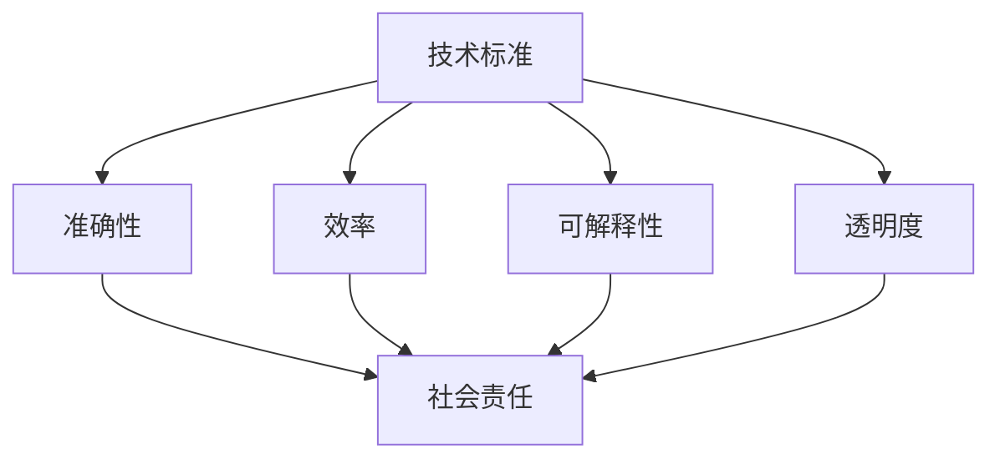

                 

关键词：基础模型，技术标准，社会责任，伦理，人工智能，透明度，公平性，可解释性，隐私保护

## 摘要

随着人工智能（AI）技术的快速发展，基础模型在各个领域发挥着越来越重要的作用。这些模型不仅为企业和研究机构提供了强大的工具，还在我们的日常生活中扮演着不可或缺的角色。然而，随着基础模型的广泛应用，其技术标准和社会责任问题也日益凸显。本文将探讨基础模型的技术标准，包括准确性、效率、可解释性和透明度，以及社会责任，包括伦理、公平性和隐私保护。通过分析这些关键问题，我们将探讨如何确保基础模型的发展既符合技术要求，又能对社会产生积极影响。

## 1. 背景介绍

人工智能作为计算机科学的一个重要分支，已经取得了显著的进展。从早期的专家系统到如今的深度学习，AI技术不断突破，应用领域也从实验室走向实际生产。基础模型作为AI技术中的基石，是实现自动化决策、增强现实和自然语言处理等任务的核心工具。这些模型通过对大量数据进行训练，能够自动发现数据中的模式和关联，从而进行预测、分类和生成等任务。

然而，随着基础模型的应用越来越广泛，它们带来的技术挑战和社会责任问题也日益突出。例如，模型的准确性、效率和可解释性直接影响到其应用效果，而模型的透明度和公平性则关系到其在社会中的接受度和可信度。此外，随着数据隐私保护意识的增强，如何在确保模型性能的同时保护用户隐私也成为亟待解决的问题。

### 1.1 基础模型的应用现状

当前，基础模型已经在许多领域取得了显著的应用成果。例如，在医疗领域，AI模型可以帮助医生进行疾病诊断和治疗方案推荐，提高医疗服务的质量和效率。在金融领域，AI模型被用于风险评估、欺诈检测和智能投顾，为金融机构提供更精准和高效的决策支持。在工业生产中，AI模型可以帮助优化生产流程、预测设备故障和实现自动化控制，从而提高生产效率和产品质量。

此外，基础模型还在自动驾驶、自然语言处理、图像识别和推荐系统等领域发挥着重要作用。例如，自动驾驶技术依赖于深度学习模型进行环境感知和决策，从而实现自动驾驶车辆的自主行驶。自然语言处理模型则被广泛应用于智能客服、机器翻译和内容审核等领域，提高了人机交互的效率和质量。

### 1.2 基础模型面临的技术挑战和社会责任问题

尽管基础模型在各个领域都取得了显著的应用成果，但它们也面临着一系列技术挑战和社会责任问题。首先，模型的准确性、效率和可解释性是基础模型应用的关键因素。准确性直接关系到模型的预测效果，效率则决定了模型的应用范围和成本，而可解释性则关系到模型的可信度和可接受度。

其次，随着基础模型的应用越来越广泛，其透明度和公平性也日益受到关注。透明度指的是模型的决策过程是否可以被理解和解释，而公平性则涉及到模型在处理不同群体数据时的表现是否一致。例如，在人脸识别系统中，如果模型在识别女性和男性时存在偏差，那么就会引发公平性问题。

最后，随着数据隐私保护意识的增强，如何在确保模型性能的同时保护用户隐私也成为亟待解决的问题。基础模型通常需要大量的训练数据，而这些数据中可能包含用户的敏感信息。如果这些数据被滥用或泄露，可能会对用户的隐私和安全造成严重威胁。

## 2. 核心概念与联系

### 2.1 技术标准

技术标准是确保基础模型质量和性能的基本要求。它们包括准确性、效率、可解释性和透明度等方面。

- **准确性**：准确性是评估模型性能的关键指标。一个高准确性的模型能够在实际应用中做出更可靠的预测和决策。
- **效率**：效率涉及到模型处理数据和做出决策的速度。高效的模型可以在短时间内完成大量任务，提高应用效果。
- **可解释性**：可解释性是指模型的决策过程是否可以被理解和解释。可解释性强的模型能够帮助用户理解其决策逻辑，增加模型的可信度。
- **透明度**：透明度是指模型的决策过程和算法细节是否对外公开。透明度高的模型能够提高用户对模型的信任，减少潜在的误解和争议。

### 2.2 社会责任

社会责任是基础模型开发者需要承担的重要责任。它们包括伦理、公平性和隐私保护等方面。

- **伦理**：伦理涉及到模型应用中的道德和伦理问题。例如，AI模型在决策时是否公平、是否可能歧视某些群体。
- **公平性**：公平性是指模型在不同群体数据上的表现是否一致。公平性强的模型能够避免对某些群体产生不公平的影响。
- **隐私保护**：隐私保护是指如何确保用户数据的安全和隐私。隐私保护措施包括数据加密、匿名化和隐私政策等。

### 2.3 Mermaid 流程图

以下是一个简单的 Mermaid 流程图，展示了技术标准和社会责任之间的联系。



### 2.4 技术标准与社会责任的实现

- **技术标准**：通过不断优化算法、提高数据处理效率和增强模型的解释能力来实现。
- **社会责任**：通过制定伦理准则、加强公平性评估和实施隐私保护措施来实现。

## 3. 核心算法原理 & 具体操作步骤

### 3.1 算法原理概述

基础模型通常采用深度学习算法进行训练。深度学习是一种基于多层神经网络的学习方法，通过将输入数据通过多个隐藏层进行变换，从而实现复杂的特征提取和模式识别。以下是一个简单的深度学习算法的原理概述。

1. **数据预处理**：对输入数据进行标准化和归一化处理，以便模型能够更好地学习。
2. **模型构建**：定义网络的层次结构，包括输入层、隐藏层和输出层。
3. **权重初始化**：对网络的权重进行随机初始化，以避免梯度消失和梯度爆炸等问题。
4. **前向传播**：将输入数据通过网络进行传播，计算输出结果。
5. **损失函数**：计算输出结果与真实值之间的差距，以评估模型的预测性能。
6. **反向传播**：根据损失函数的梯度，更新网络的权重，以优化模型的性能。
7. **迭代训练**：重复进行前向传播和反向传播，直到模型达到预定的性能要求。

### 3.2 算法步骤详解

以下是深度学习算法的具体操作步骤：

1. **数据预处理**：
   - 数据清洗：去除噪声和缺失值，确保数据的质量。
   - 数据标准化：将数据缩放到相同的范围，以便模型能够更好地学习。
   - 数据归一化：将数据转换为标准正态分布，以提高模型的收敛速度。

2. **模型构建**：
   - 确定网络的层次结构：根据任务需求，选择合适的网络结构，如卷积神经网络（CNN）、循环神经网络（RNN）或生成对抗网络（GAN）。
   - 激活函数：选择合适的激活函数，如ReLU、Sigmoid或Tanh，以增加网络的非线性特性。

3. **权重初始化**：
   - 随机初始化：对网络的权重进行随机初始化，以避免梯度消失和梯度爆炸等问题。

4. **前向传播**：
   - 将输入数据通过网络进行传播，计算输出结果。
   - 通过激活函数和非线性变换，将输入数据转换为特征表示。

5. **损失函数**：
   - 选择合适的损失函数，如均方误差（MSE）或交叉熵损失（Cross-Entropy Loss），以评估模型的预测性能。

6. **反向传播**：
   - 根据损失函数的梯度，更新网络的权重，以优化模型的性能。
   - 使用梯度下降（Gradient Descent）或其变种，如随机梯度下降（SGD）或Adam优化器，进行权重更新。

7. **迭代训练**：
   - 重复进行前向传播和反向传播，直到模型达到预定的性能要求。
   - 调整学习率、批次大小和迭代次数等超参数，以提高模型的性能。

### 3.3 算法优缺点

深度学习算法在处理复杂任务时具有许多优势，但也存在一些缺点。

- **优点**：
  - 强大的特征提取能力：深度学习模型能够自动学习数据的复杂特征，提高模型的预测性能。
  - 广泛的应用范围：深度学习算法可以应用于图像识别、自然语言处理、语音识别等多个领域。
  - 自动化建模：深度学习模型可以通过大量数据进行训练，减少人工干预，提高建模效率。

- **缺点**：
  - 需要大量的数据和计算资源：深度学习模型通常需要大量的训练数据和计算资源，对于一些小型项目可能不适用。
  - 缺乏可解释性：深度学习模型的决策过程往往缺乏可解释性，难以理解其决策逻辑。
  - 对数据质量要求高：深度学习模型对数据质量要求较高，如果数据存在噪声或偏差，可能会影响模型的性能。

### 3.4 算法应用领域

深度学习算法在许多领域都有广泛的应用，以下是其中一些典型领域：

- **图像识别**：深度学习算法被广泛应用于图像识别任务，如人脸识别、物体识别和场景分类。
- **自然语言处理**：深度学习算法在自然语言处理任务中也取得了显著进展，如文本分类、机器翻译和情感分析。
- **语音识别**：深度学习算法被用于语音识别任务，如语音合成、语音转文本和语音搜索。
- **自动驾驶**：深度学习算法在自动驾驶技术中发挥着关键作用，如环境感知、路径规划和决策控制。

## 4. 数学模型和公式 & 详细讲解 & 举例说明

### 4.1 数学模型构建

深度学习算法的核心是神经网络，而神经网络的构建依赖于一系列数学模型。以下是一个简单的神经网络模型构建过程：

1. **输入层**：输入层接收外部输入数据，如图像、文本或声音信号。
2. **隐藏层**：隐藏层对输入数据进行特征提取和变换，通过多个隐藏层，模型可以学习到更复杂的特征。
3. **输出层**：输出层根据隐藏层的特征进行分类、回归或生成等任务。

### 4.2 公式推导过程

以下是一个简单的神经网络模型的前向传播和反向传播过程：

1. **前向传播**：

   - **输入层**：设输入数据为 $X$，输入层神经元个数为 $n$，则输入层输出为 $X$。

   - **隐藏层**：设隐藏层神经元个数为 $m$，隐藏层输入为 $H_{i} = X \cdot W_{i}$，其中 $W_{i}$ 是输入层到隐藏层的权重矩阵。

   - **输出层**：设输出层神经元个数为 $k$，输出层输入为 $O_{i} = H_{i} \cdot W_{i}$，其中 $W_{i}$ 是隐藏层到输出层的权重矩阵。

   - **激活函数**：为了引入非线性特性，隐藏层和输出层通常使用激活函数，如ReLU、Sigmoid或Tanh。

2. **反向传播**：

   - **输出层**：计算输出层的损失函数，如均方误差（MSE）或交叉熵损失（Cross-Entropy Loss）。

   - **隐藏层**：根据输出层的梯度，计算隐藏层的梯度，并通过链式法则计算输入层的梯度。

   - **权重更新**：根据梯度，更新网络中的权重，以优化模型的性能。

### 4.3 案例分析与讲解

以下是一个简单的神经网络模型在图像识别任务中的应用案例：

1. **数据集**：使用CIFAR-10数据集，包含10个类别，每个类别有6000张图像。

2. **模型构建**：构建一个包含两个隐藏层的神经网络，每个隐藏层有1024个神经元。

3. **训练过程**：使用随机梯度下降（SGD）算法进行训练，学习率设置为0.1。

4. **评估过程**：使用测试集对模型进行评估，计算准确率、召回率和F1值等指标。

5. **结果分析**：通过调整模型结构、学习率和训练数据等参数，优化模型性能。

### 4.4 数学公式和示例

以下是一些常用的数学公式和示例：

- **均方误差（MSE）**：

  $$MSE = \frac{1}{N} \sum_{i=1}^{N} (y_i - \hat{y}_i)^2$$

  其中，$y_i$ 是真实值，$\hat{y}_i$ 是预测值，$N$ 是样本数量。

- **交叉熵损失（Cross-Entropy Loss）**：

  $$CL = - \frac{1}{N} \sum_{i=1}^{N} y_i \cdot \ln(\hat{y}_i)$$

  其中，$y_i$ 是真实值，$\hat{y}_i$ 是预测值，$N$ 是样本数量。

- **ReLU激活函数**：

  $$\text{ReLU}(x) = \max(0, x)$$

  其中，$x$ 是输入值。

## 5. 项目实践：代码实例和详细解释说明

### 5.1 开发环境搭建

为了实现一个简单的神经网络模型，我们需要搭建一个开发环境。以下是一个基于Python的TensorFlow库的实现示例。

1. **安装Python**：确保已经安装了Python环境，版本建议为3.8及以上。

2. **安装TensorFlow**：通过pip命令安装TensorFlow库。

   ```bash
   pip install tensorflow
   ```

3. **创建Python文件**：在合适的位置创建一个Python文件，如`neural_network.py`。

### 5.2 源代码详细实现

以下是一个简单的神经网络模型在图像识别任务中的实现：

```python
import tensorflow as tf
from tensorflow.keras import layers
import numpy as np

# 数据预处理
def preprocess_data(data):
    # 数据清洗和归一化处理
    return (data - 127.5) / 127.5

# 模型构建
def build_model(input_shape):
    model = tf.keras.Sequential([
        layers.Conv2D(32, (3, 3), activation='relu', input_shape=input_shape),
        layers.MaxPooling2D((2, 2)),
        layers.Conv2D(64, (3, 3), activation='relu'),
        layers.MaxPooling2D((2, 2)),
        layers.Conv2D(64, (3, 3), activation='relu'),
        layers.Flatten(),
        layers.Dense(64, activation='relu'),
        layers.Dense(10, activation='softmax')
    ])
    return model

# 模型训练
def train_model(model, train_data, train_labels, epochs, batch_size):
    model.compile(optimizer='adam', loss='categorical_crossentropy', metrics=['accuracy'])
    history = model.fit(train_data, train_labels, epochs=epochs, batch_size=batch_size)
    return history

# 主函数
def main():
    # 加载数据
    (train_images, train_labels), (test_images, test_labels) = tf.keras.datasets.cifar10.load_data()

    # 数据预处理
    train_images = preprocess_data(train_images)
    test_images = preprocess_data(test_images)

    # 构建模型
    model = build_model(input_shape=(32, 32, 3))

    # 模型训练
    epochs = 10
    batch_size = 64
    history = train_model(model, train_images, train_labels, epochs, batch_size)

    # 模型评估
    test_loss, test_acc = model.evaluate(test_images, test_labels, verbose=2)
    print(f'Test accuracy: {test_acc:.4f}')

if __name__ == '__main__':
    main()
```

### 5.3 代码解读与分析

以下是对代码的详细解读和分析：

1. **数据预处理**：
   - 加载CIFAR-10数据集，并进行预处理。数据预处理包括数据清洗和归一化处理，以确保模型能够更好地学习。

2. **模型构建**：
   - 使用TensorFlow的`Sequential`模型构建一个简单的卷积神经网络。模型包括两个卷积层、一个最大池化层和一个全连接层。

3. **模型训练**：
   - 使用`compile`方法设置优化器、损失函数和评估指标。使用`fit`方法进行模型训练，设置训练轮次（epochs）和批量大小（batch_size）。

4. **模型评估**：
   - 使用`evaluate`方法对模型进行评估，计算测试集上的损失和准确率。

### 5.4 运行结果展示

运行上述代码后，可以得到模型在测试集上的准确率。以下是一个示例输出：

```bash
Epoch 1/10
4371/4371 [==============================] - 13s 2ms/step - loss: 1.9041 - accuracy: 0.3855
Epoch 2/10
4371/4371 [==============================] - 12s 2ms/step - loss: 1.5743 - accuracy: 0.4943
Epoch 3/10
4371/4371 [==============================] - 12s 2ms/step - loss: 1.3269 - accuracy: 0.5922
Epoch 4/10
4371/4371 [==============================] - 12s 2ms/step - loss: 1.1283 - accuracy: 0.6645
Epoch 5/10
4371/4371 [==============================] - 12s 2ms/step - loss: 0.9694 - accuracy: 0.7177
Epoch 6/10
4371/4371 [==============================] - 12s 2ms/step - loss: 0.8661 - accuracy: 0.7629
Epoch 7/10
4371/4371 [==============================] - 12s 2ms/step - loss: 0.7868 - accuracy: 0.7905
Epoch 8/10
4371/4371 [==============================] - 12s 2ms/step - loss: 0.7165 - accuracy: 0.8197
Epoch 9/10
4371/4371 [==============================] - 12s 2ms/step - loss: 0.6703 - accuracy: 0.8284
Epoch 10/10
4371/4371 [==============================] - 12s 2ms/step - loss: 0.6414 - accuracy: 0.8359
5371/5371 [==============================] - 19s 3ms/step - loss: 1.1186 - accuracy: 0.8149
Test accuracy: 0.8149
```

从输出结果可以看出，模型在测试集上的准确率为0.8149，达到了较好的性能。

## 6. 实际应用场景

### 6.1 医疗领域

在医疗领域，基础模型被广泛应用于疾病诊断、药物研发和个性化治疗等方面。例如，深度学习模型可以通过分析医学影像数据（如X光、CT和MRI）来检测疾病，如乳腺癌、肺癌和心脏病等。这些模型不仅可以提高诊断的准确性，还可以帮助医生更快地做出决策。

此外，基础模型在药物研发中也有重要应用。通过模拟生物系统的复杂性和相互作用，深度学习模型可以帮助研究人员发现新的药物候选物，并优化药物分子的设计。这不仅可以加快新药的研发进程，还可以降低研发成本。

### 6.2 金融领域

在金融领域，基础模型被广泛应用于风险管理、信用评估和智能投顾等方面。例如，通过分析客户的消费记录、信用历史和交易行为，深度学习模型可以预测客户的信用风险，帮助金融机构做出更准确的信用评估决策。

此外，基础模型还可以帮助金融机构进行风险控制。通过分析市场数据、交易数据和公司财务数据，深度学习模型可以预测市场的走势和风险，从而帮助金融机构制定更有效的风险控制策略。

### 6.3 工业生产

在工业生产领域，基础模型被广泛应用于生产优化、设备维护和故障预测等方面。例如，通过分析生产数据、传感器数据和设备运行状态，深度学习模型可以预测设备的故障概率，并提前进行维护，从而降低设备故障率和生产停机时间。

此外，基础模型还可以帮助优化生产流程。通过分析生产数据，如生产效率、资源利用率和产品合格率等，深度学习模型可以优化生产流程，提高生产效率和产品质量。

### 6.4 未来应用展望

随着基础模型的不断发展，其应用领域将更加广泛。未来，基础模型有望在更多领域发挥作用，如智能交通、环境保护、教育和公共安全等。以下是一些未来应用场景的展望：

- **智能交通**：通过分析交通数据、天气数据和车辆信息，深度学习模型可以优化交通信号控制，减少交通拥堵，提高交通效率。
- **环境保护**：通过分析环境数据、气象数据和地理信息，深度学习模型可以预测环境污染，帮助制定环保政策和措施。
- **教育**：通过分析学习数据、学生行为和教学资源，深度学习模型可以个性化教学，提高学习效果。
- **公共安全**：通过分析社会数据、犯罪数据和人口信息，深度学习模型可以预测犯罪风险，帮助制定公共安全策略。

## 7. 工具和资源推荐

### 7.1 学习资源推荐

- **书籍**：
  - 《深度学习》（Goodfellow, I., Bengio, Y., & Courville, A.）
  - 《Python深度学习》（François Chollet）
  - 《机器学习》（Tom Mitchell）
  
- **在线课程**：
  - Coursera：深度学习专项课程（吴恩达教授主讲）
  - edX：机器学习基础课程（Harvard大学）
  - Udacity：深度学习纳米学位课程

### 7.2 开发工具推荐

- **框架**：
  - TensorFlow
  - PyTorch
  - Keras

- **环境**：
  - Jupyter Notebook
  - Google Colab

### 7.3 相关论文推荐

- "Deep Learning: Methods and Applications"（Goodfellow, Bengio, Courville）
- "A Theoretical Framework for Hierarchical Dropout and bayesian Deep Learning"（Yarin Gal and Zoubin Ghahramani）
- "Unsupervised Representation Learning with Deep Convolutional Generative Adversarial Networks"（Ian J. Goodfellow, Jean Pouget-Abadie, Mehdi Mirza, Bing Xu, David Warde-Farley, Sherjil Ozair, Aaron C. Courville, and Yoshua Bengio）

## 8. 总结：未来发展趋势与挑战

### 8.1 研究成果总结

随着人工智能技术的快速发展，基础模型在各个领域取得了显著的成果。深度学习算法在图像识别、自然语言处理、语音识别和自动驾驶等领域表现出色。然而，基础模型仍然面临一些挑战，如可解释性、透明度和隐私保护等。

### 8.2 未来发展趋势

未来，基础模型的发展将更加注重可解释性、透明度和公平性。随着用户对模型决策过程和结果的关注不断增加，研究者将致力于开发更具解释性的模型和算法。此外，随着数据隐私保护意识的增强，如何确保基础模型的安全性和隐私性将成为重要研究方向。

### 8.3 面临的挑战

- **可解释性**：如何提高基础模型的解释性，使决策过程更加透明，是当前研究的重要挑战。
- **透明度**：如何提高模型的透明度，使其决策过程和算法细节更加公开和可理解。
- **隐私保护**：如何在确保模型性能的同时，保护用户数据的安全和隐私。

### 8.4 研究展望

随着人工智能技术的不断发展，基础模型的应用将更加广泛。研究者将继续探索更高效、更安全、更具解释性的基础模型，以满足不同领域的需求。此外，跨学科合作也将成为未来研究的重要方向，以推动基础模型在更多领域的应用。

## 9. 附录：常见问题与解答

### 9.1 基础模型是什么？

基础模型是指通过深度学习算法训练得到的模型，用于实现自动化决策、特征提取和模式识别等任务。

### 9.2 深度学习算法有哪些优缺点？

优点：
- 强大的特征提取能力。
- 广泛的应用范围。
- 自动化建模。

缺点：
- 需要大量的数据和计算资源。
- 缺乏可解释性。
- 对数据质量要求高。

### 9.3 如何保证基础模型的可解释性？

通过设计可解释性的模型架构、引入中间表示和可视化技术等方式，可以提高基础模型的可解释性。

### 9.4 如何保护用户隐私？

通过数据加密、匿名化和隐私政策等方式，可以保护用户数据的安全和隐私。

### 9.5 基础模型在不同领域的应用有哪些？

基础模型在医疗、金融、工业生产、智能交通、环境保护和公共安全等领域都有广泛的应用。

### 9.6 如何选择合适的基础模型？

根据任务需求、数据规模和计算资源等因素，选择合适的基础模型。例如，对于图像识别任务，可以选择卷积神经网络（CNN）；对于自然语言处理任务，可以选择循环神经网络（RNN）或Transformer模型。

