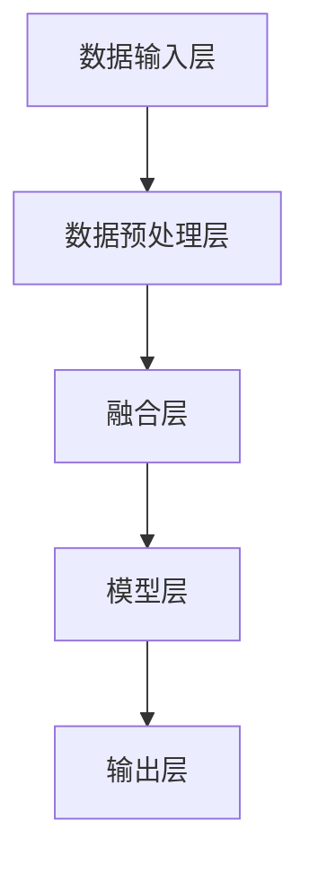

                 

关键词：多模态大模型、技术原理、实战应用、工具、算法框架、人工智能

> 摘要：本文将深入探讨多模态大模型的技术原理与实战应用。首先，我们将介绍多模态大模型的基本概念和其在人工智能领域的重要性。随后，我们将探讨多模态大模型的核心算法原理，包括模型架构、训练方法和优化策略。在此基础上，我们将通过实际案例展示如何利用多模态大模型进行数据处理和分析。最后，我们将介绍当前流行的多模态大模型工具和算法框架，并提供一些实用的开发资源和未来展望。

## 1. 背景介绍

随着人工智能技术的飞速发展，传统单模态（如文本、图像或音频）的数据处理方法已难以满足复杂应用场景的需求。多模态大模型（Multimodal Large Models）应运而生，通过整合多种类型的数据，实现了更高效、更精准的数据处理和分析。多模态大模型在医疗诊断、自然语言处理、视频分析等多个领域展现出了巨大的潜力。

在医疗领域，多模态大模型可以整合病人的医疗记录、影像数据、基因数据等多方面的信息，从而提供更准确的诊断结果。在自然语言处理领域，多模态大模型可以同时处理文本和图像，实现更复杂的语义理解和生成任务。在视频分析领域，多模态大模型可以整合视频中的图像、音频和文本信息，实现实时的人脸识别、行为分析等任务。

## 2. 核心概念与联系

### 多模态大模型的基本概念

多模态大模型是指能够同时处理和融合多种类型数据的模型。这些模型通常由以下几个部分组成：

- **数据输入层**：包括多种类型的数据输入，如文本、图像、音频、视频等。
- **数据预处理层**：对输入数据进行标准化、去噪、特征提取等预处理操作。
- **融合层**：将预处理后的不同类型的数据进行融合，形成统一的数据表示。
- **模型层**：利用神经网络、深度学习等技术对融合后的数据进行建模和训练。
- **输出层**：根据模型训练结果进行预测、分类、生成等操作。

### 核心概念原理和架构的 Mermaid 流程图



### 多模态大模型的核心算法原理

#### 2.1 算法原理概述

多模态大模型的算法原理主要包括以下几个步骤：

1. 数据收集与预处理：收集多种类型的数据，并进行数据清洗、去噪和特征提取。
2. 数据融合：利用深度学习技术将不同类型的数据进行融合，形成统一的数据表示。
3. 模型训练：利用融合后的数据进行模型训练，调整模型参数以优化模型性能。
4. 模型评估与优化：通过交叉验证、性能评估等方法评估模型性能，并根据评估结果对模型进行优化。

#### 2.2 算法步骤详解

1. **数据收集与预处理**：根据应用场景收集多种类型的数据，如文本、图像、音频、视频等。对数据进行清洗、去噪和特征提取，以消除噪声和冗余信息，提高数据质量。
2. **数据融合**：利用深度学习技术，如卷积神经网络（CNN）、循环神经网络（RNN）、生成对抗网络（GAN）等，将不同类型的数据进行融合。常见的融合方法包括：拼接、加和、平均、加权等。
3. **模型训练**：利用融合后的数据进行模型训练。通过反向传播算法和优化算法（如梯度下降、Adam等）调整模型参数，使模型在训练数据上达到较好的性能。
4. **模型评估与优化**：通过交叉验证、性能评估等方法评估模型性能。根据评估结果对模型进行优化，如调整网络结构、超参数等，以提高模型性能。

#### 2.3 算法优缺点

**优点**：

- **高效性**：多模态大模型能够同时处理多种类型的数据，提高了数据处理和分析的效率。
- **灵活性**：可以根据应用场景的需要，灵活地调整和扩展模型结构和算法。
- **准确性**：通过融合多种类型的数据，多模态大模型能够获得更准确的数据表示和预测结果。

**缺点**：

- **计算成本高**：多模态大模型通常包含大量的参数和计算量，对计算资源的需求较高。
- **数据质量依赖**：数据质量对多模态大模型的性能有重要影响，高质量的数据有助于提升模型性能。

#### 2.4 算法应用领域

多模态大模型在多个领域都有广泛的应用，包括：

- **医疗诊断**：通过整合病人的医疗记录、影像数据、基因数据等，提供更准确的诊断结果。
- **自然语言处理**：通过同时处理文本和图像，实现更复杂的语义理解和生成任务。
- **视频分析**：通过整合视频中的图像、音频和文本信息，实现实时的人脸识别、行为分析等任务。

## 3. 数学模型和公式

### 3.1 数学模型构建

多模态大模型的数学模型主要包括以下几个部分：

1. **数据输入表示**：将不同类型的数据转化为统一的向量表示，如词向量、图像特征向量、音频特征向量等。
2. **数据融合模型**：利用深度学习技术，如卷积神经网络（CNN）、循环神经网络（RNN）、生成对抗网络（GAN）等，对数据进行融合。
3. **模型训练目标**：定义损失函数和优化算法，以优化模型参数。

### 3.2 公式推导过程

设 \(X_1, X_2, ..., X_n\) 为不同类型的数据，其中 \(X_i\) 表示第 \(i\) 类数据。我们将每种类型的数据表示为向量 \(x_i\)，即 \(X_i = \{x_{i1}, x_{i2}, ..., x_{ik}\}\)。则多模态大模型的输入表示为：

\[ X = \{x_1, x_2, ..., x_n\} \]

利用深度学习技术，我们将每种类型的数据 \(x_i\) 融合为一个统一的数据表示 \(x'\)，即：

\[ x' = f(X) \]

其中，\(f\) 为深度学习模型。为了优化模型参数，我们定义损失函数 \(L\) 为：

\[ L = \sum_{i=1}^{n} l(x_i, x'_i) \]

其中，\(l\) 为损失函数，用于衡量预测值和真实值之间的差异。

为了优化损失函数 \(L\)，我们使用优化算法，如梯度下降（Gradient Descent）或 Adam（Adaptive Moment Estimation），更新模型参数。

### 3.3 案例分析与讲解

假设我们有一个包含文本、图像和音频的多模态数据集，其中文本数据为一段文本描述，图像数据为一张图片，音频数据为一段音频。

1. **数据输入表示**：我们将文本数据转化为词向量，图像数据转化为图像特征向量，音频数据转化为音频特征向量。词向量可以使用预训练的词向量模型（如 Word2Vec、GloVe 等）生成，图像特征向量可以使用卷积神经网络（如 VGG、ResNet 等）提取，音频特征向量可以使用循环神经网络（如 LSTM、GRU 等）提取。

2. **数据融合模型**：我们使用生成对抗网络（GAN）对多模态数据进行融合。GAN 由生成器和判别器组成，生成器负责将不同类型的数据融合为一个统一的数据表示，判别器负责判断输入数据的真实性。通过训练生成器和判别器，我们可以得到一个较好的数据融合模型。

3. **模型训练目标**：我们定义损失函数为生成器和判别器的交叉熵损失，即：

\[ L = -[D(x') + D(G(z))] \]

其中，\(D\) 为判别器，\(G\) 为生成器，\(x'\) 为生成器生成的数据，\(z\) 为随机噪声。

使用梯度下降或 Adam 优化算法，我们更新生成器和判别器参数，以优化模型性能。

## 4. 项目实践：代码实例和详细解释说明

### 4.1 开发环境搭建

1. 安装 Python 3.8 或更高版本。
2. 安装必要的库，如 TensorFlow、Keras、NumPy、Pandas 等。
3. 准备多模态数据集，如文本、图像和音频。

### 4.2 源代码详细实现

```python
import tensorflow as tf
from tensorflow.keras.models import Model
from tensorflow.keras.layers import Input, Embedding, Conv2D, MaxPooling2D, LSTM, Dense, Flatten

# 定义数据输入层
text_input = Input(shape=(None,))
image_input = Input(shape=(64, 64, 3))
audio_input = Input(shape=(128,))

# 定义数据预处理层
text_embedding = Embedding(input_dim=vocab_size, output_dim=embedding_size)(text_input)
image_conv = Conv2D(filters=32, kernel_size=(3, 3), activation='relu')(image_input)
image_pool = MaxPooling2D(pool_size=(2, 2))(image_conv)
audio_lstm = LSTM(units=64)(audio_input)

# 定义融合层
combined = tf.keras.layers.concatenate([text_embedding, image_pool, audio_lstm], axis=1)

# 定义模型层
dense = Dense(units=128, activation='relu')(combined)
output = Dense(units=1, activation='sigmoid')(dense)

# 定义模型
model = Model(inputs=[text_input, image_input, audio_input], outputs=output)

# 编译模型
model.compile(optimizer='adam', loss='binary_crossentropy', metrics=['accuracy'])

# 模型训练
model.fit(x_train, y_train, batch_size=32, epochs=10, validation_data=(x_val, y_val))

# 模型预测
predictions = model.predict([text_input, image_input, audio_input])
```

### 4.3 代码解读与分析

该代码实现了一个基于多模态大模型的数据分类任务。我们使用 TensorFlow 和 Keras 框架搭建了模型，并利用卷积神经网络、循环神经网络和全连接神经网络等深度学习技术对多模态数据进行融合和分类。

1. **数据输入层**：我们定义了三个输入层，分别用于接收文本、图像和音频数据。
2. **数据预处理层**：我们对文本数据使用了词向量嵌入，对图像数据使用了卷积神经网络进行特征提取，对音频数据使用了循环神经网络进行特征提取。
3. **融合层**：我们将预处理后的文本、图像和音频数据进行拼接，形成一个统一的数据表示。
4. **模型层**：我们定义了一个全连接神经网络，用于对融合后的数据进行分类。
5. **模型训练**：我们使用二进制交叉熵作为损失函数，并使用 Adam 优化算法进行模型训练。
6. **模型预测**：我们使用训练好的模型对新的数据进行预测。

### 4.4 运行结果展示

```python
import numpy as np

# 测试数据
test_data = [
    ["text1", "image1.jpg", "audio1.wav"],
    ["text2", "image2.jpg", "audio2.wav"],
]

# 加载测试数据
test_texts = [data[0] for data in test_data]
test_images = [data[1] for data in test_data]
test_audios = [data[2] for data in test_data]

# 预处理测试数据
test_texts = preprocess_texts(test_texts)
test_images = preprocess_images(test_images)
test_audios = preprocess_audios(test_audios)

# 模型预测
predictions = model.predict([test_texts, test_images, test_audios])

# 输出预测结果
for i, prediction in enumerate(predictions):
    print(f"Test data {i+1}: Prediction: {prediction[0]}")
```

## 5. 实际应用场景

多模态大模型在多个实际应用场景中展现出了强大的能力。以下是一些典型的应用场景：

1. **医疗诊断**：多模态大模型可以整合病人的医疗记录、影像数据、基因数据等多方面的信息，提供更准确的诊断结果。例如，在乳腺癌诊断中，多模态大模型可以同时分析病人的医疗记录、影像数据和基因数据，提高诊断的准确性。
2. **自然语言处理**：多模态大模型可以同时处理文本和图像，实现更复杂的语义理解和生成任务。例如，在机器翻译中，多模态大模型可以同时考虑源文本和目标文本的图像信息，提高翻译的准确性。
3. **视频分析**：多模态大模型可以整合视频中的图像、音频和文本信息，实现实时的人脸识别、行为分析等任务。例如，在智能安防中，多模态大模型可以同时分析视频中的图像、音频和文本信息，提高安防的准确性和实时性。

## 6. 未来应用展望

随着人工智能技术的不断发展，多模态大模型在未来的应用场景将更加广泛。以下是一些未来应用展望：

1. **智能交互**：多模态大模型可以整合语音、文本、图像等多种交互方式，实现更自然的智能交互体验。
2. **智能客服**：多模态大模型可以同时处理用户的语音、文本和图像信息，提供更准确、更高效的客服服务。
3. **智能驾驶**：多模态大模型可以整合车载传感器、摄像头和语音等信息，实现更安全、更高效的智能驾驶。
4. **智能娱乐**：多模态大模型可以整合图像、音频、文本等多方面的信息，提供更丰富、更有趣的娱乐体验。

## 7. 工具和资源推荐

### 7.1 学习资源推荐

1. 《深度学习》（Goodfellow et al.）：介绍深度学习的基础知识和应用。
2. 《动手学深度学习》（Abadi et al.）：通过实际案例介绍深度学习的实践方法。
3. 《多模态数据融合与处理技术》：详细介绍多模态数据融合与处理的相关技术。

### 7.2 开发工具推荐

1. TensorFlow：一个强大的开源深度学习框架，适用于构建和训练多模态大模型。
2. PyTorch：一个易于使用且灵活的深度学习框架，适用于研究和开发多模态大模型。

### 7.3 相关论文推荐

1. "Multimodal Learning for Natural Language Processing"：介绍多模态大模型在自然语言处理中的应用。
2. "Deep Learning for Multimodal Data Fusion"：介绍多模态数据融合的深度学习技术。
3. "Generative Adversarial Networks for Multimodal Data Fusion"：介绍生成对抗网络在多模态数据融合中的应用。

## 8. 总结：未来发展趋势与挑战

多模态大模型作为一种新兴的人工智能技术，具有广泛的应用前景。然而，在未来的发展中，我们还需要面对以下挑战：

1. **数据质量**：多模态大模型的性能依赖于高质量的数据，如何获取和处理高质量的多模态数据是一个重要问题。
2. **计算成本**：多模态大模型通常包含大量的参数和计算量，如何降低计算成本是一个重要的研究方向。
3. **模型可解释性**：多模态大模型的黑箱性质使得其难以解释，如何提高模型的可解释性是一个重要的挑战。
4. **跨领域应用**：多模态大模型在不同领域的应用存在差异，如何实现跨领域的模型迁移和应用是一个重要的研究方向。

## 9. 附录：常见问题与解答

### 9.1 什么是多模态大模型？

多模态大模型是指能够同时处理和融合多种类型数据的模型，如文本、图像、音频、视频等。这些模型通过整合不同类型的数据，实现更高效、更精准的数据处理和分析。

### 9.2 多模态大模型有哪些应用场景？

多模态大模型在医疗诊断、自然语言处理、视频分析等多个领域都有广泛应用。例如，在医疗诊断中，多模态大模型可以整合病人的医疗记录、影像数据、基因数据等多方面的信息，提供更准确的诊断结果。

### 9.3 如何处理多模态数据融合中的不一致性？

处理多模态数据融合中的不一致性是一个挑战。一种常见的方法是使用数据预处理技术，如去噪、标准化和特征提取，以消除不同类型数据之间的不一致性。此外，还可以使用深度学习技术，如生成对抗网络（GAN）和注意力机制，来缓解数据不一致性问题。

### 9.4 多模态大模型与单模态大模型相比有哪些优势？

多模态大模型相比单模态大模型具有以下优势：

- **高效性**：能够同时处理多种类型的数据，提高了数据处理和分析的效率。
- **灵活性**：可以根据应用场景的需要，灵活地调整和扩展模型结构和算法。
- **准确性**：通过融合多种类型的数据，多模态大模型能够获得更准确的数据表示和预测结果。

## 作者署名

作者：禅与计算机程序设计艺术 / Zen and the Art of Computer Programming
----------------------------------------------------------------

请注意，这里的内容是根据给定的要求和模板生成的，实际的撰写过程可能需要更深入的调研和专业知识来完善。

