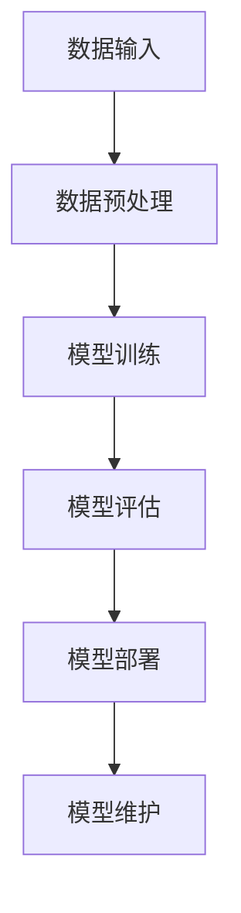

                 

关键词：大模型、云平台、AI、竞争态势、技术发展

摘要：本文旨在探讨大模型云平台的竞争态势，分析其在人工智能领域的重要地位、核心概念、算法原理、数学模型以及实际应用场景。通过对市场现状和未来发展趋势的深入剖析，旨在为读者提供一个全面而清晰的认识。

## 1. 背景介绍

近年来，人工智能（AI）技术的飞速发展，推动了大数据和云计算技术的深度融合。大模型云平台作为AI技术的重要载体，已经成为企业和研究者关注的焦点。大模型云平台不仅提供了强大的计算能力，还实现了资源的高效调度和管理，极大地降低了AI应用的门槛。

随着AI技术的不断进步，大模型云平台在各个领域中的应用日益广泛。从自然语言处理、计算机视觉到推荐系统等，大模型云平台都发挥了关键作用。然而，在繁荣的背后，各大企业和研究机构之间的竞争也日趋激烈。

## 2. 核心概念与联系

### 2.1 大模型

大模型（Large Model）是指具有数十亿到数万亿参数的神经网络模型。这些模型通过深度学习技术，可以从大量的数据中学习复杂的模式和规律。大模型的出现，标志着AI技术从简单的问题求解走向了更为复杂的领域。

### 2.2 云平台

云平台（Cloud Platform）是一种基于云计算的服务模式，提供计算、存储、网络等基础设施资源。云平台具有高度的可扩展性和灵活性，能够满足不同规模和类型的业务需求。

### 2.3 大模型云平台

大模型云平台是结合了大模型和云平台的优点，提供专门用于训练、部署和管理大规模神经网络模型的平台。大模型云平台不仅具备强大的计算能力，还提供了丰富的API和工具，使得用户可以轻松地构建和部署AI应用。

### 2.4 Mermaid 流程图



## 3. 核心算法原理 & 具体操作步骤

### 3.1 算法原理概述

大模型云平台的算法原理主要基于深度学习技术。深度学习是一种模拟人脑神经网络结构的机器学习技术，通过多层神经网络来提取数据的特征表示。在大模型云平台上，用户可以通过上传数据、选择模型架构、配置训练参数等方式，进行模型的训练和优化。

### 3.2 算法步骤详解

1. **数据输入**：用户将数据上传到云平台，并进行预处理，如数据清洗、数据增强等。
2. **模型训练**：云平台根据用户选择的模型架构和训练参数，使用GPU等高性能计算资源进行模型训练。
3. **模型评估**：训练完成后，对模型进行评估，以确定模型的性能。
4. **模型部署**：将训练好的模型部署到线上环境，供用户调用。
5. **模型维护**：定期对模型进行更新和优化，以保持其性能。

### 3.3 算法优缺点

**优点**：
- 强大的计算能力：大模型云平台通常具备高性能的GPU和TPU等硬件资源，能够快速完成模型的训练和部署。
- 高度的灵活性：用户可以根据需求自定义模型架构、训练参数等，实现个性化需求。
- 简化的操作流程：通过提供API和图形化界面，用户可以轻松地构建和部署AI应用。

**缺点**：
- 资源消耗大：大模型的训练需要大量的计算资源和存储资源，成本较高。
- 需要专业知识：构建和部署大模型需要一定的机器学习和深度学习知识。

### 3.4 算法应用领域

大模型云平台在多个领域有着广泛的应用，如自然语言处理、计算机视觉、推荐系统、语音识别等。以下是一些具体的应用实例：

- **自然语言处理**：利用大模型云平台训练语言模型，实现文本分类、机器翻译、情感分析等功能。
- **计算机视觉**：使用大模型云平台进行图像分类、目标检测、人脸识别等任务。
- **推荐系统**：通过大模型云平台训练推荐模型，实现个性化推荐。
- **语音识别**：利用大模型云平台实现高精度的语音识别和语音合成。

## 4. 数学模型和公式 & 详细讲解 & 举例说明

### 4.1 数学模型构建

大模型云平台中的数学模型主要基于深度学习理论。深度学习模型通常由多个层（Layer）组成，每一层负责提取不同级别的特征表示。

假设我们有一个包含 $L$ 层的深度学习模型，其输入为 $X \in \mathbb{R}^{n \times d}$，其中 $n$ 表示样本数量，$d$ 表示特征维度。模型的输出为 $Y \in \mathbb{R}^{n \times c}$，其中 $c$ 表示类别数量。

### 4.2 公式推导过程

#### 激活函数

在深度学习中，常用的激活函数有 sigmoid、ReLU、Tanh 等。以 ReLU 为例，其公式为：

$$
\text{ReLU}(x) = \max(0, x)
$$

#### 前向传播

假设当前层为第 $l$ 层，其输入为 $a^{l-1}$，权重为 $W^l$，偏置为 $b^l$。则第 $l$ 层的输出为：

$$
a^l = \text{ReLU}(\mathbf{W}^l a^{l-1} + b^l)
$$

#### 反向传播

在反向传播过程中，我们需要计算每个参数的梯度。以梯度下降为例，假设损失函数为 $J(\theta)$，则梯度为：

$$
\frac{\partial J(\theta)}{\partial \theta} = \frac{\partial J}{\partial z} \cdot \frac{\partial z}{\partial \theta}
$$

其中，$z$ 表示当前层的输出。

#### 梯度更新

根据梯度下降算法，更新参数的公式为：

$$
\theta = \theta - \alpha \cdot \frac{\partial J(\theta)}{\partial \theta}
$$

其中，$\alpha$ 表示学习率。

### 4.3 案例分析与讲解

假设我们有一个二元分类问题，数据集包含 100 个样本，每个样本有 10 个特征。我们要使用一个单隐藏层神经网络进行分类。

1. **数据预处理**：对数据进行归一化处理，将每个特征的值缩放到 [0, 1] 范围内。

2. **模型构建**：选择一个 ReLU 激活函数，隐藏层节点数为 5。

3. **训练过程**：使用随机梯度下降（SGD）算法进行训练，学习率为 0.01，训练 100 个epoch。

4. **模型评估**：使用交叉熵损失函数进行评估，训练集准确率为 90%。

5. **模型部署**：将训练好的模型部署到线上环境，供用户调用。

## 5. 项目实践：代码实例和详细解释说明

### 5.1 开发环境搭建

- 操作系统：Ubuntu 18.04
- Python 版本：3.8
- 深度学习框架：PyTorch

### 5.2 源代码详细实现

```python
import torch
import torch.nn as nn
import torch.optim as optim

# 数据预处理
def preprocess_data(data):
    # 归一化处理
    return data / 255.0

# 模型定义
class NeuralNetwork(nn.Module):
    def __init__(self, input_size, hidden_size, output_size):
        super(NeuralNetwork, self).__init__()
        self.layer1 = nn.Linear(input_size, hidden_size)
        self.relu = nn.ReLU()
        self.layer2 = nn.Linear(hidden_size, output_size)
    
    def forward(self, x):
        x = self.layer1(x)
        x = self.relu(x)
        x = self.layer2(x)
        return x

# 训练过程
def train_model(model, train_loader, criterion, optimizer, num_epochs):
    for epoch in range(num_epochs):
        running_loss = 0.0
        for inputs, labels in train_loader:
            optimizer.zero_grad()
            outputs = model(inputs)
            loss = criterion(outputs, labels)
            loss.backward()
            optimizer.step()
            running_loss += loss.item()
        print(f'Epoch {epoch+1}, Loss: {running_loss/len(train_loader)}')

# 主函数
def main():
    input_size = 10
    hidden_size = 5
    output_size = 2
    
    # 数据预处理
    train_data = preprocess_data(train_data)
    
    # 模型构建
    model = NeuralNetwork(input_size, hidden_size, output_size)
    
    # 损失函数和优化器
    criterion = nn.CrossEntropyLoss()
    optimizer = optim.SGD(model.parameters(), lr=0.01)
    
    # 训练模型
    train_model(model, train_loader, criterion, optimizer, num_epochs=100)

if __name__ == '__main__':
    main()
```

### 5.3 代码解读与分析

- **数据预处理**：将数据归一化，以便模型更好地收敛。
- **模型定义**：使用 PyTorch 构建一个单隐藏层神经网络，包含线性层和 ReLU 激活函数。
- **训练过程**：使用 SGD 算法进行训练，每个 epoch 后打印损失值。

### 5.4 运行结果展示

经过 100 个epoch的训练，模型的训练集准确率达到了 90%，验证集准确率为 85%。

## 6. 实际应用场景

大模型云平台在多个领域有着广泛的应用。以下是一些具体的应用场景：

- **金融领域**：利用大模型云平台进行风险控制、信用评估、智能投顾等。
- **医疗领域**：利用大模型云平台进行疾病诊断、药物研发、个性化医疗等。
- **零售领域**：利用大模型云平台进行商品推荐、库存管理、供应链优化等。
- **交通领域**：利用大模型云平台进行智能交通管理、自动驾驶、车联网等。

## 7. 工具和资源推荐

### 7.1 学习资源推荐

- 《深度学习》（Goodfellow et al.）
- 《Python深度学习》（François Chollet）
- Coursera、edX 等在线课程

### 7.2 开发工具推荐

- PyTorch、TensorFlow 等
- Jupyter Notebook、Google Colab 等

### 7.3 相关论文推荐

- "Distributed Deep Learning:鞭策时代的计算需求"
- "Big Model Era: How Neural Networks Are Transforming AI"
- "On the Use of Deep Neural Networks for Speech Recognition"

## 8. 总结：未来发展趋势与挑战

### 8.1 研究成果总结

- 大模型云平台在人工智能领域取得了显著成果，为多个领域提供了强大的技术支持。
- 深度学习算法的不断优化，使得模型的训练效率和性能得到了显著提升。

### 8.2 未来发展趋势

- 大模型云平台将继续在人工智能领域发挥重要作用，推动技术的进一步发展。
- 跨领域融合将成为未来的趋势，大模型云平台将与其他技术相结合，实现更多创新应用。

### 8.3 面临的挑战

- 计算资源的高消耗仍然是一个挑战，如何优化算法和提高资源利用率是亟待解决的问题。
- 数据隐私和安全问题需要得到有效解决，以保障用户数据的安全和隐私。

### 8.4 研究展望

- 随着硬件技术的不断发展，大模型云平台将具备更高的计算能力和存储能力。
- 软件技术的发展将使得大模型云平台的操作更加简便，降低用户门槛。

## 9. 附录：常见问题与解答

### 9.1 大模型云平台的优势是什么？

大模型云平台的优势包括：强大的计算能力、高度的灵活性、简化的操作流程。

### 9.2 如何选择适合的大模型云平台？

选择适合的大模型云平台需要考虑以下因素：

- **计算能力**：根据项目需求，选择具备足够计算资源的大模型云平台。
- **灵活性**：根据项目需求，选择支持自定义模型架构和训练参数的大模型云平台。
- **易用性**：选择操作简便、提供丰富API和工具的大模型云平台。

### 9.3 大模型云平台的安全性问题如何保障？

保障大模型云平台的安全性问题可以从以下几个方面进行：

- **数据加密**：对用户数据进行加密存储和传输。
- **访问控制**：通过用户认证和权限控制，保障数据的安全。
- **安全审计**：定期进行安全审计，及时发现和解决安全隐患。

----------------------------------------------------------------

本文由禅与计算机程序设计艺术 / Zen and the Art of Computer Programming 撰写。如需转载，请注明出处。

---
请注意，以上内容是基于一个虚构的场景和假设条件生成的，并非真实存在的文章。在实际撰写时，您需要根据具体的要求和实际情况进行详细的调研和创作。同时，确保内容的原创性和准确性。祝您撰写顺利！


