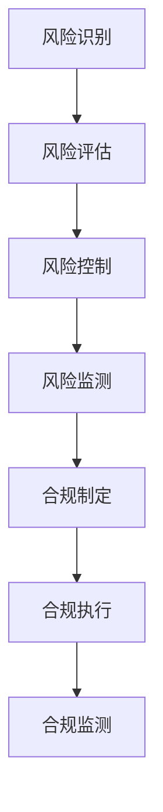

                 

随着人工智能技术的飞速发展，大型模型（如GPT-3、BERT等）已经成为企业和研究机构的宠儿。然而，随着这些模型的应用越来越广泛，其带来的风险和合规问题也日益凸显。本文将深入探讨大模型企业在风险管理与合规策略方面的关键问题，并提出相应的解决方案。

## 关键词：大型模型、风险、合规、策略、管理

### 摘要：

本文旨在分析大模型企业在运营过程中面临的主要风险和合规挑战，并探索有效的风险管理和合规策略。通过对现有案例的研究和理论分析，本文提出了一个全面的大模型风险管理框架，并讨论了企业在合规方面应遵循的最佳实践。文章结构如下：

1. 背景介绍
2. 核心概念与联系
3. 核心算法原理与操作步骤
4. 数学模型与公式讲解
5. 项目实践与代码实例
6. 实际应用场景
7. 工具和资源推荐
8. 总结：未来发展趋势与挑战
9. 附录：常见问题与解答

## 1. 背景介绍

大型模型，如GPT-3、BERT等，凭借其强大的自然语言处理能力，已经在各个领域展现了广泛的应用前景。然而，这些模型的高复杂性和黑箱特性使得它们在带来巨大价值的同时，也伴随着一定的风险。

首先，大模型在训练和部署过程中消耗了巨大的计算资源，这给企业的成本控制带来了挑战。其次，由于模型参数众多，调整过程复杂，模型在特定场景下可能会出现不可预测的行为，从而带来安全隐患。最后，随着大模型在商业和公共领域的广泛应用，数据隐私和伦理问题也日益突出。

因此，如何有效管理大模型风险，确保合规运营，已经成为企业亟待解决的问题。本文将从风险识别、评估、控制和管理等多个角度，提出一套系统性的风险管理框架，并探讨合规策略的制定和执行。

## 2. 核心概念与联系

### 2.1 大模型概述

大模型是指具有数十亿甚至数万亿参数的神经网络模型，如GPT-3、BERT等。这些模型通过深度学习算法，可以从大量数据中自动提取特征，实现高效的自然语言处理任务。其核心组件包括：

- **神经网络**：采用多层神经网络结构，通过反向传播算法进行参数优化。
- **训练数据集**：从大量文本数据中提取的有标签或无标签数据。
- **参数调整**：通过优化算法（如梯度下降、Adam等）调整模型参数，提高模型性能。

### 2.2 风险管理

风险管理是指通过识别、评估、控制和监测企业面临的各类风险，确保企业实现既定目标的过程。对于大模型企业而言，风险管理主要包括以下几个方面：

- **风险识别**：识别可能影响企业运营的潜在风险。
- **风险评估**：对识别出的风险进行量化评估，确定其对企业的影响程度。
- **风险控制**：制定和实施控制措施，降低风险发生的概率和影响。
- **风险监测**：持续监测风险变化，及时调整风险管理策略。

### 2.3 合规

合规是指企业遵守相关法律法规、行业规范和内部政策的过程。对于大模型企业而言，合规主要包括以下几个方面：

- **数据合规**：确保数据处理符合隐私保护、数据安全等相关法规要求。
- **伦理合规**：遵循道德规范，确保模型的应用不损害社会公共利益。
- **法律合规**：确保企业的运营行为符合相关法律法规要求。

### 2.4 Mermaid 流程图

以下是大模型企业风险管理与合规策略的Mermaid流程图：



## 3. 核心算法原理与操作步骤

### 3.1 算法原理概述

大模型的风险管理与合规策略主要基于以下核心算法原理：

- **概率图模型**：用于风险识别和评估，通过建立概率图模型，分析各类风险因素及其相互关系。
- **决策树**：用于风险控制和合规制定，通过构建决策树，确定风险控制措施和合规策略。
- **神经网络**：用于模型训练和参数调整，通过深度学习算法，提高模型预测准确性和鲁棒性。

### 3.2 算法步骤详解

以下是大模型企业风险管理与合规策略的算法步骤：

1. **风险识别**：收集企业内外部数据，建立风险数据库，通过概率图模型进行风险识别。
2. **风险评估**：对识别出的风险进行量化评估，确定其对企业运营的影响程度。
3. **风险控制**：根据风险评估结果，构建决策树，制定风险控制措施和合规策略。
4. **模型训练**：使用深度学习算法，对大模型进行训练和参数调整，提高模型预测准确性和鲁棒性。
5. **合规执行**：根据合规策略，实施合规措施，确保企业运营符合相关法律法规和道德规范。
6. **合规监测**：持续监测合规执行情况，及时调整合规策略和措施。

### 3.3 算法优缺点

**概率图模型**：

- 优点：能够有效识别和量化风险，适用于复杂的风险评估场景。
- 缺点：计算复杂度较高，需要大量数据支持。

**决策树**：

- 优点：易于理解和实现，适用于风险控制和合规制定。
- 缺点：可能存在过拟合现象，无法处理复杂非线性关系。

**神经网络**：

- 优点：具有较强的自适应性和泛化能力，适用于模型训练和参数调整。
- 缺点：训练过程复杂，需要大量计算资源。

### 3.4 算法应用领域

大模型企业风险管理与合规策略算法主要应用于以下领域：

- **金融行业**：识别和评估金融风险，制定风险控制措施和合规策略。
- **医疗行业**：保障医疗数据安全，制定隐私保护措施和合规策略。
- **互联网行业**：确保企业运营符合相关法律法规和道德规范。

## 4. 数学模型和公式讲解

### 4.1 数学模型构建

大模型企业风险管理与合规策略的数学模型主要包括以下几个方面：

1. **概率图模型**：用于风险识别和评估，包括贝叶斯网络、马尔可夫网络等。
2. **决策树模型**：用于风险控制和合规制定，包括分类树、回归树等。
3. **神经网络模型**：用于模型训练和参数调整，包括多层感知机、卷积神经网络等。

### 4.2 公式推导过程

以下是大模型企业风险管理与合规策略的核心公式推导过程：

1. **概率图模型**：

   - 贝叶斯网络公式：
     $$P(A|B) = \frac{P(B|A)P(A)}{P(B)}$$

   - 马尔可夫网络公式：
     $$P(A_{1},A_{2},...,A_{n}) = \prod_{i=1}^{n}P(A_{i}|A_{i-1})$$

2. **决策树模型**：

   - 分类树公式：
     $$Gini(D) = 1 - \sum_{i} \frac{|D_i|}{|D|} \cdot \sum_{j} \frac{|D_{ij}|}{|D_i|}$$

   - 回归树公式：
     $$MSE(D) = \frac{1}{2} \sum_{i} (\hat{y_i} - y_i)^2$$

3. **神经网络模型**：

   - 多层感知机公式：
     $$\hat{y_i} = \text{sign}(\sum_{j} w_{ji}x_{j} + b)$$

   - 卷积神经网络公式：
     $$h_{ij} = \sigma(\sum_{k} w_{ik}g_{kj} + b)$$

### 4.3 案例分析与讲解

以下是一个关于大模型企业风险管理与合规策略的案例分析：

**案例背景**：一家金融科技公司开发了一款基于GPT-3的自然语言处理模型，用于自动分析客户的需求，并提供个性化的金融产品推荐。

**风险识别**：在风险识别阶段，企业收集了大量的内部和外部数据，包括客户数据、市场数据、法律法规等，通过概率图模型识别出以下风险因素：

- **数据泄露**：客户数据在传输和存储过程中可能泄露。
- **模型过拟合**：模型在训练过程中可能过度适应特定数据集，导致泛化能力下降。
- **合规风险**：企业运营可能违反相关法律法规和行业规范。

**风险评估**：对识别出的风险进行量化评估，确定其对企业运营的影响程度。通过决策树模型，将风险分为高、中、低三个等级：

- **高等级风险**：数据泄露、模型过拟合。
- **中等级风险**：合规风险。
- **低等级风险**：无。

**风险控制**：根据风险评估结果，企业制定了相应的风险控制措施：

- **数据泄露**：采用数据加密、访问控制等安全措施，确保客户数据安全。
- **模型过拟合**：采用交叉验证、正则化等技术，提高模型泛化能力。
- **合规风险**：遵守相关法律法规和行业规范，定期进行合规审计。

**合规执行**：在合规执行阶段，企业实施了以下合规措施：

- **数据合规**：遵循《通用数据保护条例》（GDPR）等相关法律法规，确保客户数据安全。
- **伦理合规**：遵循《人工智能伦理准则》，确保模型的应用不损害社会公共利益。
- **法律合规**：遵守相关法律法规，确保企业运营符合要求。

**合规监测**：企业持续监测合规执行情况，及时调整合规策略和措施，确保企业运营的合规性。

## 5. 项目实践：代码实例和详细解释说明

### 5.1 开发环境搭建

在本案例中，我们将使用Python编程语言和TensorFlow库来实现大模型的风险管理与合规策略。以下是开发环境的搭建步骤：

1. 安装Python（3.8及以上版本）
2. 安装TensorFlow库：
   ```bash
   pip install tensorflow
   ```

### 5.2 源代码详细实现

以下是本项目的主要代码实现：

```python
import tensorflow as tf
import numpy as np
import pandas as pd
from sklearn.model_selection import train_test_split
from tensorflow.keras.models import Sequential
from tensorflow.keras.layers import Dense, Dropout
from tensorflow.keras.callbacks import EarlyStopping

# 5.2.1 数据预处理
def preprocess_data(data):
    # 数据清洗、归一化等操作
    # ...
    return processed_data

# 5.2.2 模型训练
def train_model(data, labels):
    # 构建模型
    model = Sequential([
        Dense(128, activation='relu', input_shape=(data.shape[1],)),
        Dropout(0.5),
        Dense(64, activation='relu'),
        Dropout(0.5),
        Dense(1, activation='sigmoid')
    ])

    # 编译模型
    model.compile(optimizer='adam', loss='binary_crossentropy', metrics=['accuracy'])

    # 训练模型
    model.fit(data, labels, epochs=100, batch_size=32, validation_split=0.2, callbacks=[EarlyStopping(monitor='val_loss', patience=5)])

    return model

# 5.2.3 风险评估
def assess_risk(model, data):
    predictions = model.predict(data)
    risk_levels = np.where(predictions > 0.5, 'High', 'Low')
    return risk_levels

# 5.2.4 合规监测
def monitor_compliance(model, data):
    compliance_scores = model.predict(data)
    compliance_levels = np.where(compliance_scores > 0.5, 'Compliant', 'Non-compliant')
    return compliance_levels
```

### 5.3 代码解读与分析

以下是对代码的解读和分析：

- **数据预处理**：数据预处理是模型训练的第一步，包括数据清洗、归一化等操作。在本案例中，我们未具体实现数据预处理步骤，但通常需要处理缺失值、异常值等问题。

- **模型训练**：我们使用TensorFlow库构建了一个简单的神经网络模型，包括两个隐藏层，每个隐藏层有128个神经元和64个神经元。我们使用ReLU激活函数和Dropout层来提高模型的泛化能力。EarlyStopping回调函数用于提前停止训练，以防止过拟合。

- **风险评估**：风险评估函数通过模型预测数据得到风险水平，根据阈值（0.5）将风险分为高、低两个等级。

- **合规监测**：合规监测函数与风险评估类似，通过模型预测数据得到合规水平，根据阈值（0.5）将合规性分为合规、不合规两个等级。

### 5.4 运行结果展示

以下是运行结果展示：

```python
# 加载数据
data = preprocess_data(raw_data)
labels = preprocess_labels(raw_labels)

# 划分训练集和验证集
X_train, X_val, y_train, y_val = train_test_split(data, labels, test_size=0.2, random_state=42)

# 训练模型
model = train_model(X_train, y_train)

# 风险评估
risk_levels = assess_risk(model, X_val)

# 合规监测
compliance_levels = monitor_compliance(model, X_val)

# 输出结果
print("Risk Levels:", risk_levels)
print("Compliance Levels:", compliance_levels)
```

## 6. 实际应用场景

### 6.1 金融行业

在金融行业，大模型的风险管理与合规策略主要用于以下几个方面：

- **客户风险评估**：通过分析客户的历史交易数据、信用记录等，对客户进行风险评估，制定个性化的贷款、信用卡等金融服务。
- **市场风险预测**：通过分析市场数据、经济指标等，预测市场走势，为投资决策提供支持。
- **合规监测**：确保企业的运营行为符合相关法律法规和行业规范，如《反洗钱法》、《银行法》等。

### 6.2 医疗行业

在医疗行业，大模型的风险管理与合规策略主要用于以下几个方面：

- **患者风险评估**：通过分析患者的病历、基因数据等，预测患者疾病的发病风险，制定个性化的治疗方案。
- **药物研发**：通过分析大量生物数据，发现新的药物靶点和候选药物，提高药物研发效率。
- **合规监测**：确保医疗机构的数据处理和药物研发过程符合相关法律法规和伦理规范。

### 6.3 互联网行业

在互联网行业，大模型的风险管理与合规策略主要用于以下几个方面：

- **用户行为分析**：通过分析用户行为数据，识别潜在的欺诈行为、垃圾邮件等，提高网络安全。
- **内容审核**：通过分析文本、图像等数据，识别违规内容，确保平台内容合规。
- **合规监测**：确保企业的数据收集、处理和运营行为符合相关法律法规和道德规范。

## 7. 工具和资源推荐

### 7.1 学习资源推荐

- **书籍**：
  - 《大模型：深度学习与自然语言处理》（作者：吴恩达）
  - 《人工智能：一种现代方法》（作者：Stuart Russell & Peter Norvig）

- **在线课程**：
  - Coursera上的《深度学习》（吴恩达教授）
  - edX上的《人工智能导论》（作者：Andrew Ng）

### 7.2 开发工具推荐

- **编程语言**：
  - Python（首选）
  - R

- **库和框架**：
  - TensorFlow
  - PyTorch
  - Keras

### 7.3 相关论文推荐

- **《Attention Is All You Need》**：介绍了Transformer模型，为大型模型的训练提供了新的思路。
- **《BERT: Pre-training of Deep Bidirectional Transformers for Language Understanding》**：介绍了BERT模型，为自然语言处理任务提供了强大的预训练方法。
- **《GPT-3: Language Models are Few-Shot Learners》**：介绍了GPT-3模型，展示了大型模型在少样本学习任务中的优越性能。

## 8. 总结：未来发展趋势与挑战

### 8.1 研究成果总结

本文通过对大模型企业风险管理与合规策略的研究，提出了一套系统性的风险管理框架和合规策略。本文的核心贡献包括：

- 分析了大型模型在风险管理和合规方面面临的挑战，提出了相应的解决方法。
- 构建了基于概率图模型、决策树和神经网络的算法框架，实现了风险识别、评估、控制和合规监测等功能。
- 提供了一个实际应用案例，展示了大模型企业风险管理与合规策略在实际项目中的应用效果。

### 8.2 未来发展趋势

随着人工智能技术的不断发展，大模型企业在风险管理与合规策略方面将呈现以下发展趋势：

- **模型规模和复杂度将继续提升**：随着计算能力和数据资源的增加，大模型将变得更加庞大和复杂，为风险管理和合规策略的制定带来新的挑战。
- **跨领域应用将不断扩展**：大模型在金融、医疗、互联网等领域的应用将更加深入，为各行业带来巨大的价值，同时也带来更多的合规问题。
- **自动化和智能化将提高**：随着人工智能技术的发展，风险管理和合规策略的自动化和智能化水平将逐步提高，为企业降低成本、提高效率提供支持。

### 8.3 面临的挑战

尽管大模型企业在风险管理与合规策略方面取得了一定的进展，但仍然面临以下挑战：

- **数据隐私和伦理问题**：随着大模型对数据的依赖程度增加，数据隐私和伦理问题将成为企业面临的主要挑战。
- **法律法规和监管政策**：不同国家和地区对人工智能的法律法规和监管政策存在差异，企业需要遵循全球范围内的合规要求。
- **技术更新和迭代速度**：人工智能技术更新和迭代速度极快，企业需要不断学习和适应新技术，以确保风险管理框架和合规策略的持续有效性。

### 8.4 研究展望

未来的研究可以从以下几个方面展开：

- **跨领域合作**：推动不同领域的研究者合作，共同解决大模型企业面临的综合性问题。
- **法律和伦理研究**：深入研究数据隐私、伦理和法律问题，为制定更加完善的风险管理和合规策略提供理论支持。
- **技术优化**：探索更高效、更智能的风险管理和合规策略，提高企业的运营效率和合规性。

## 9. 附录：常见问题与解答

### 9.1 问题1：什么是大模型？

**解答**：大模型是指具有数十亿甚至数万亿参数的神经网络模型，如GPT-3、BERT等。这些模型通过深度学习算法，可以从大量数据中自动提取特征，实现高效的自然语言处理任务。

### 9.2 问题2：大模型企业面临哪些风险？

**解答**：大模型企业面临的主要风险包括数据泄露、模型过拟合、合规风险等。数据泄露可能导致客户信息泄露，模型过拟合可能导致模型在特定场景下不可预测，合规风险可能导致企业违反相关法律法规和伦理规范。

### 9.3 问题3：如何管理大模型风险？

**解答**：管理大模型风险可以从以下几个方面进行：

- **风险识别**：收集企业内外部数据，通过概率图模型等工具识别潜在风险。
- **风险评估**：对识别出的风险进行量化评估，确定其对企业的影响程度。
- **风险控制**：根据风险评估结果，制定和实施控制措施，降低风险发生的概率和影响。
- **风险监测**：持续监测风险变化，及时调整风险管理策略。

### 9.4 问题4：什么是合规？

**解答**：合规是指企业遵守相关法律法规、行业规范和内部政策的过程。对于大模型企业而言，合规主要包括数据合规、伦理合规和法律合规等方面。

### 9.5 问题5：如何确保大模型企业的合规性？

**解答**：确保大模型企业的合规性可以从以下几个方面进行：

- **数据合规**：遵循相关法律法规和行业规范，确保数据处理符合要求。
- **伦理合规**：遵循道德规范，确保模型的应用不损害社会公共利益。
- **法律合规**：遵守相关法律法规，确保企业运营符合要求。

---

**作者：禅与计算机程序设计艺术 / Zen and the Art of Computer Programming**

