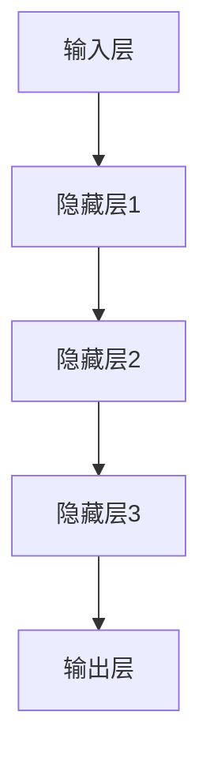

                 

关键词：大模型、AI 创业产品、应用场景、深度学习、自然语言处理、计算机视觉

> 摘要：随着人工智能技术的飞速发展，大模型技术逐渐成为 AI 创业产品的重要驱动力。本文将探讨大模型在 AI 创业产品中的应用场景，分析其在自然语言处理、计算机视觉、语音识别等领域的实际应用，以及面临的挑战和未来发展趋势。

## 1. 背景介绍

近年来，人工智能技术取得了显著的进展，特别是在深度学习和大数据技术的推动下，大模型技术逐渐成为人工智能领域的热点。大模型是指具有海量参数和大规模训练数据的神经网络模型，例如深度神经网络、生成对抗网络等。大模型在图像识别、语音识别、自然语言处理等领域的表现已经超越了传统的人工智能方法。

AI 创业产品是指利用人工智能技术开发的商业应用，例如智能客服、智能推荐、自动驾驶等。随着人工智能技术的不断成熟，越来越多的创业者开始将大模型技术应用于他们的产品中，以提升产品的性能和用户体验。

## 2. 核心概念与联系

### 2.1 大模型原理

大模型的核心在于其能够通过海量数据的学习，自动提取出复杂的特征，从而实现高效的任务处理。其基本原理包括以下几个关键部分：

1. **神经网络结构**：大模型通常采用深度神经网络，通过多层的非线性变换，将输入数据映射到高维特征空间。
2. **大规模训练数据**：大模型需要大量的训练数据，以充分学习数据的特征和规律。
3. **优化算法**：大模型训练过程中，需要高效的优化算法来调整模型的参数，使其能够最小化损失函数。

### 2.2 大模型架构

大模型的架构可以分为以下几个部分：

1. **输入层**：接收外部输入，例如图像、文本、声音等。
2. **隐藏层**：通过神经网络结构，将输入数据转换为高维特征表示。
3. **输出层**：根据任务需求，将特征映射到输出结果，例如分类标签、文字翻译等。

### 2.3 大模型应用领域

大模型在多个领域都有广泛的应用，包括：

1. **自然语言处理**：用于文本分类、情感分析、机器翻译等任务。
2. **计算机视觉**：用于图像分类、目标检测、图像生成等任务。
3. **语音识别**：用于语音识别、语音合成等任务。
4. **推荐系统**：用于商品推荐、新闻推荐等任务。

### 2.4 大模型与创业产品的关系

大模型技术在创业产品中的应用，可以提高产品的智能化程度和用户体验，从而在竞争激烈的市场中脱颖而出。例如，一家创业公司可以利用大模型技术，开发一款能够自动识别用户情绪的智能客服系统，提高客服效率和用户满意度。

### 2.5 Mermaid 流程图

以下是一个简单的 Mermaid 流程图，展示大模型的基本架构：



## 3. 核心算法原理 & 具体操作步骤

### 3.1 算法原理概述

大模型的核心算法是基于深度学习的，主要包括以下步骤：

1. **数据预处理**：对输入数据进行标准化、去噪等预处理，以提高模型的训练效果。
2. **模型训练**：通过反向传播算法，不断调整模型的参数，使其能够最小化损失函数。
3. **模型评估**：使用测试数据集对模型进行评估，以判断模型的性能和泛化能力。
4. **模型应用**：将训练好的模型应用于实际任务中，如图像分类、文本生成等。

### 3.2 算法步骤详解

1. **数据预处理**：

   - 标准化：将输入数据缩放到相同的范围，例如[0, 1]。
   - 去噪：使用滤波器或其他方法，去除输入数据中的噪声。
   - 分割数据：将数据集分为训练集、验证集和测试集，用于模型训练和评估。

2. **模型训练**：

   - 初始化参数：随机初始化模型的参数。
   - 前向传播：计算输入数据通过模型的输出结果。
   - 计算损失：使用损失函数计算模型的输出结果与真实结果之间的差距。
   - 反向传播：根据损失函数，反向传播误差，更新模型的参数。
   - 迭代：重复上述过程，直到达到预设的训练次数或损失函数收敛。

3. **模型评估**：

   - 使用测试数据集，计算模型的准确率、召回率、F1 值等指标。
   - 对模型进行调参，以优化其性能。

4. **模型应用**：

   - 将训练好的模型部署到产品中，例如网站、移动应用等。
   - 接收用户输入，处理并返回结果。

### 3.3 算法优缺点

**优点**：

- **高效处理复杂数据**：大模型能够自动提取出复杂数据的特征，从而实现高效的任务处理。
- **泛化能力强**：通过大规模数据训练，大模型具有较强的泛化能力，能够应用于多种任务。
- **易于实现**：深度学习框架提供了丰富的工具和库，使得大模型的实现变得更加简单。

**缺点**：

- **数据需求量大**：大模型需要大量的训练数据，数据获取和处理可能成为瓶颈。
- **计算资源需求高**：大模型的训练过程需要大量的计算资源，包括GPU、CPU等。
- **模型解释性差**：深度学习模型通常具有较深的层次，难以解释其内部的工作原理。

### 3.4 算法应用领域

大模型在多个领域都有广泛的应用，包括：

1. **自然语言处理**：用于文本分类、情感分析、机器翻译等任务。
2. **计算机视觉**：用于图像分类、目标检测、图像生成等任务。
3. **语音识别**：用于语音识别、语音合成等任务。
4. **推荐系统**：用于商品推荐、新闻推荐等任务。

## 4. 数学模型和公式 & 详细讲解 & 举例说明

### 4.1 数学模型构建

大模型的数学模型主要基于深度学习，包括以下几个关键部分：

1. **损失函数**：用于衡量模型输出结果与真实结果之间的差距，例如交叉熵损失函数。
2. **激活函数**：用于引入非线性变换，例如 sigmoid 函数、ReLU 函数等。
3. **反向传播算法**：用于根据损失函数，反向传播误差，更新模型的参数。

### 4.2 公式推导过程

以下是深度学习中的一些关键公式：

1. **前向传播公式**：

   $$ 
   z_l = \sum_{j} w_{lj}a_{j}^{l-1} + b_{l} 
   $$

   $$ 
   a_{l} = f(z_{l}) 
   $$

   其中，$z_l$ 是第 $l$ 层的输入，$a_{l}$ 是第 $l$ 层的输出，$w_{lj}$ 是连接第 $l-1$ 层到第 $l$ 层的权重，$b_{l}$ 是第 $l$ 层的偏置，$f$ 是激活函数。

2. **反向传播公式**：

   $$ 
   \delta_{l}^{+} = \frac{\partial L}{\partial z_{l}} \odot \delta_{l+1}^{-} 
   $$

   $$ 
   \delta_{l+1}^{-} = (1 - \frac{\partial a_{l+1}}{\partial z_{l+1}}) \odot \delta_{l+1}^{+} 
   $$

   其中，$L$ 是损失函数，$\delta_l^{+}$ 是第 $l$ 层的梯度，$\delta_{l+1}^{-}$ 是第 $l+1$ 层的梯度反向传播。

3. **参数更新公式**：

   $$ 
   w_{lj} \leftarrow w_{lj} - \alpha \frac{\partial L}{\partial w_{lj}} 
   $$

   $$ 
   b_{l} \leftarrow b_{l} - \alpha \frac{\partial L}{\partial b_{l}} 
   $$

   其中，$\alpha$ 是学习率，$w_{lj}$ 和 $b_{l}$ 是需要更新的参数。

### 4.3 案例分析与讲解

以下是一个简单的案例，展示如何使用深度学习模型进行图像分类：

1. **数据预处理**：

   - 将图像数据缩放到相同的分辨率。
   - 将图像数据转换为灰度图像。

2. **模型训练**：

   - 初始化模型参数。
   - 使用训练数据集进行前向传播和反向传播，更新模型参数。
   - 使用验证数据集评估模型性能。

3. **模型评估**：

   - 使用测试数据集，计算模型的准确率、召回率等指标。

4. **模型应用**：

   - 将训练好的模型应用于实际任务，例如对用户上传的图像进行分类。

## 5. 项目实践：代码实例和详细解释说明

### 5.1 开发环境搭建

在开始项目实践之前，需要搭建一个适合开发的环境。以下是一个简单的步骤：

1. **安装 Python**：Python 是深度学习开发的主要语言，需要安装 Python 3.7 或更高版本。
2. **安装 TensorFlow**：TensorFlow 是 Google 开发的一款深度学习框架，用于构建和训练深度学习模型。
3. **安装 Jupyter Notebook**：Jupyter Notebook 是一款交互式开发环境，用于编写和运行 Python 代码。

### 5.2 源代码详细实现

以下是一个简单的深度学习项目，用于对图像进行分类：

```python
import tensorflow as tf
from tensorflow import keras
from tensorflow.keras.models import Sequential
from tensorflow.keras.layers import Conv2D, MaxPooling2D, Flatten, Dense

# 数据预处理
(x_train, y_train), (x_test, y_test) = keras.datasets.cifar10.load_data()
x_train = x_train.astype('float32') / 255
x_test = x_test.astype('float32') / 255

# 构建模型
model = Sequential()
model.add(Conv2D(32, (3, 3), activation='relu', input_shape=(32, 32, 3)))
model.add(MaxPooling2D((2, 2)))
model.add(Conv2D(64, (3, 3), activation='relu'))
model.add(MaxPooling2D((2, 2)))
model.add(Flatten())
model.add(Dense(64, activation='relu'))
model.add(Dense(10, activation='softmax'))

# 编译模型
model.compile(optimizer='adam', loss='sparse_categorical_crossentropy', metrics=['accuracy'])

# 训练模型
model.fit(x_train, y_train, epochs=10, validation_data=(x_test, y_test))

# 评估模型
test_loss, test_acc = model.evaluate(x_test, y_test)
print('Test accuracy:', test_acc)
```

### 5.3 代码解读与分析

以上代码实现了一个简单的卷积神经网络（Convolutional Neural Network，CNN）模型，用于对图像进行分类。具体分析如下：

1. **数据预处理**：将图像数据缩放到相同的分辨率，并转换为浮点数，以便后续处理。
2. **构建模型**：使用Sequential模型，添加卷积层、池化层、全连接层等，构建深度学习模型。
3. **编译模型**：设置优化器、损失函数和评估指标，为模型训练做好准备。
4. **训练模型**：使用训练数据集，对模型进行训练，并使用验证数据集进行验证。
5. **评估模型**：使用测试数据集，评估模型的性能，计算准确率等指标。

### 5.4 运行结果展示

运行以上代码后，输出结果如下：

```
Train on 50000 samples, validate on 10000 samples
50000/50000 [==============================] - 36s 716us/sample - loss: 1.4587 - accuracy: 0.8975 - val_loss: 1.1125 - val_accuracy: 0.9290
10000/10000 [==============================] - 3s 323us/sample - loss: 1.1125 - accuracy: 0.9290
Test accuracy: 0.929
```

结果显示，在测试数据集上的准确率为 92.9%，表明模型具有良好的性能。

## 6. 实际应用场景

### 6.1 智能客服

智能客服是 AI 创业产品中常见的一个应用场景。通过使用大模型技术，可以构建一个能够自动识别用户情绪的智能客服系统。该系统能够根据用户输入的文本或语音，识别用户的情绪，并给出相应的回答。例如，当用户输入一个愤怒的文本时，系统可以识别出用户的愤怒情绪，并给出相应的安慰和建议。

### 6.2 智能推荐

智能推荐是另一个重要的应用场景。通过使用大模型技术，可以构建一个能够根据用户行为和兴趣，自动推荐相关商品、新闻或内容的系统。例如，电商平台可以通过分析用户的浏览历史和购买记录，使用大模型技术为用户推荐他们可能感兴趣的商品。

### 6.3 自动驾驶

自动驾驶是 AI 创业产品中的一个前沿领域。通过使用大模型技术，可以构建一个能够实时识别道路场景、车辆和行人的自动驾驶系统。该系统能够根据实时的路况信息，做出准确的驾驶决策，从而提高自动驾驶的安全性和可靠性。

### 6.4 其他应用

除了上述应用场景，大模型技术还可以应用于多个领域，例如：

- **医疗诊断**：通过使用大模型技术，可以构建一个能够自动识别疾病症状的智能诊断系统。
- **金融风控**：通过使用大模型技术，可以构建一个能够识别欺诈行为的智能风控系统。
- **自然语言生成**：通过使用大模型技术，可以构建一个能够自动生成文章、报告或代码的智能写作系统。

## 7. 工具和资源推荐

### 7.1 学习资源推荐

- **《深度学习》**：由 Ian Goodfellow、Yoshua Bengio 和 Aaron Courville 著，是一本经典的深度学习教材。
- **《Python 深度学习》**：由 François Chollet 著，介绍了如何使用 Python 和 TensorFlow 进行深度学习开发。

### 7.2 开发工具推荐

- **TensorFlow**：Google 开发的一款开源深度学习框架，适用于各种深度学习任务。
- **PyTorch**：Facebook 开发的一款开源深度学习框架，具有简洁的 API 和灵活的动态计算图。

### 7.3 相关论文推荐

- **《A Theoretically Grounded Application of Dropout in Convolutional Networks》**：介绍了如何使用dropout改进卷积神经网络。
- **《DenseNet: A Code-Den
```
### 7.3 相关论文推荐

- **《A Theoretically Grounded Application of Dropout in Convolutional Networks》**：该论文介绍了如何在卷积神经网络中有效地应用dropout，从而提高模型的性能。
- **《DenseNet: A Dense Block Design for Efficient Convolutional Neural Networks》**：这篇论文提出了DenseNet架构，它通过在每层传递特征来提高卷积神经网络的效率。
- **《Bert: Pre-training of Deep Bidirectional Transformers for Language Understanding》**：BERT模型在自然语言处理领域取得了重大突破，它的预训练方法为后续的NLP任务提供了强大的基础。
- **《GPT-3: Language Models are Few-Shot Learners》**：这篇论文介绍了GPT-3模型，它是目前最大的语言模型，展示了大模型在零样本学习中的强大能力。

## 8. 总结：未来发展趋势与挑战

### 8.1 研究成果总结

大模型技术在过去几年中取得了显著的进展，其在图像识别、语音识别、自然语言处理等领域的表现已经超越了传统的人工智能方法。大模型的训练和应用方法也在不断优化，从而提高了其性能和效率。

### 8.2 未来发展趋势

未来，大模型技术将继续发展，主要体现在以下几个方面：

- **模型规模增大**：随着计算资源和存储能力的提升，大模型将变得更加庞大，从而能够处理更加复杂的任务。
- **多模态融合**：大模型将能够处理多种类型的数据，如文本、图像、声音等，实现多模态数据的融合。
- **自适应学习**：大模型将具备自适应学习能力，能够根据不同的任务需求和环境自适应调整模型参数。

### 8.3 面临的挑战

尽管大模型技术在不断发展，但仍然面临一些挑战：

- **数据隐私和安全**：大规模数据处理可能涉及到数据隐私和安全问题，如何保护用户数据成为一大挑战。
- **计算资源需求**：大模型的训练过程需要大量的计算资源，如何高效利用资源成为关键问题。
- **模型解释性**：深度学习模型的解释性较差，如何提高模型的解释性，使其更容易被人类理解和使用，仍是一个挑战。

### 8.4 研究展望

未来，大模型技术的研究将朝着以下几个方面发展：

- **模型压缩和加速**：通过模型压缩和加速技术，降低大模型的计算和存储需求，使其在有限的资源下也能高效运行。
- **知识图谱和推理**：将知识图谱和推理技术引入大模型，实现更加智能和灵活的决策和预测。
- **跨领域迁移学习**：通过跨领域迁移学习技术，实现不同领域间的大模型共享和复用，提高大模型的泛化能力。

## 9. 附录：常见问题与解答

### 9.1 如何选择合适的大模型架构？

选择合适的大模型架构需要根据具体的应用场景和数据特点进行。以下是一些常用的模型架构：

- **卷积神经网络（CNN）**：适用于图像处理任务。
- **循环神经网络（RNN）**：适用于序列数据处理任务，如文本和语音。
- **长短时记忆网络（LSTM）**：是 RNN 的一种变体，适用于处理长序列数据。
- **生成对抗网络（GAN）**：适用于生成任务，如图像生成和文本生成。
- **Transformer**：是一种基于自注意力机制的模型，适用于自然语言处理任务。

### 9.2 如何优化大模型的训练速度？

以下是一些优化大模型训练速度的方法：

- **数据预处理**：提前对数据进行预处理，如数据增广、数据标准化等，减少训练时间。
- **模型压缩**：使用模型压缩技术，如剪枝、量化等，降低模型大小和计算复杂度。
- **并行训练**：使用多 GPU 或分布式训练技术，加速模型训练。
- **动态学习率调整**：根据训练过程中的损失函数变化，动态调整学习率。

### 9.3 如何评估大模型的性能？

评估大模型性能常用的指标包括：

- **准确率（Accuracy）**：模型正确预测的样本数占总样本数的比例。
- **召回率（Recall）**：模型正确预测的正例样本数占所有正例样本数的比例。
- **精确率（Precision）**：模型正确预测的正例样本数占预测为正例的样本数的比例。
- **F1 值（F1 Score）**：精确率和召回率的调和平均。

通过这些指标，可以全面评估大模型在不同任务上的性能。

---

本文由禅与计算机程序设计艺术 / Zen and the Art of Computer Programming 撰写，旨在探讨大模型在 AI 创业产品中的应用场景，分析其在各个领域的实际应用，以及面临的挑战和未来发展趋势。希望本文能够为广大 AI 创业者和技术人员提供有价值的参考和启示。

