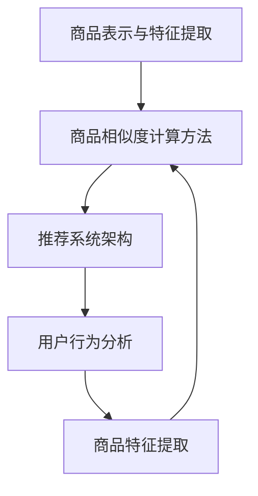

                 

关键词：大模型、商品相似度计算、人工智能、深度学习、相似度算法、推荐系统、数据挖掘、优化算法、数据分析

> 摘要：本文探讨了如何利用大模型技术进行商品相似度计算，以提升电商平台的个性化推荐效果。通过介绍商品相似度计算的核心概念、算法原理和实际应用，分析了大模型在其中的创新作用。本文还详细阐述了数学模型和公式、项目实践案例、实际应用场景以及未来展望，旨在为相关领域的研究者和开发者提供有价值的参考。

## 1. 背景介绍

随着互联网的快速发展，电商行业已经成为全球经济增长的重要驱动力之一。个性化推荐系统作为电商平台的核心功能，旨在为用户提供个性化的商品推荐，从而提高用户满意度和转化率。商品相似度计算作为推荐系统的重要组成部分，直接影响推荐质量。然而，传统商品相似度计算方法在处理大规模商品数据时，往往面临计算复杂度高、效果不佳等问题。

近年来，随着人工智能和深度学习技术的不断发展，大模型技术逐渐成为解决这些问题的有效途径。大模型，通常指的是具有数亿甚至千亿参数规模的神经网络模型，具有强大的特征提取和表示能力。在商品相似度计算领域，大模型的引入有望大幅提升计算效率和准确性，从而提高推荐系统的整体性能。

本文将围绕大模型在商品相似度计算中的应用，介绍相关核心概念、算法原理和实际应用案例，分析大模型的创新作用，并探讨未来的发展趋势和挑战。

## 2. 核心概念与联系

### 2.1 商品的表示与特征提取

在商品相似度计算中，首先需要将商品进行有效的表示和特征提取。传统的方法通常采用基于属性的表示方法，例如基于关键词、类别、品牌等属性进行编码。然而，这种方法往往无法充分挖掘商品之间的深层关联和语义信息。

大模型，尤其是基于深度学习的模型，具有强大的特征提取能力。通过神经网络结构，大模型能够自动学习商品之间的复杂关系，并将商品表示为高维向量。这些向量不仅包含了商品的基本属性信息，还包含了更深层次的语义信息，从而提高了商品相似度计算的准确性。

### 2.2 相似度计算方法

商品相似度计算的核心在于如何衡量两个商品之间的相似程度。传统的方法主要包括基于余弦相似度、基于距离的相似度等方法。这些方法虽然简单易实现，但在处理大规模商品数据时，往往无法达到令人满意的精度。

大模型的引入为相似度计算带来了新的可能性。通过训练大规模神经网络模型，大模型能够自动学习到商品之间的复杂相似性模式。基于大模型的相似度计算方法，不仅可以充分利用模型学习到的特征信息，还能够自适应地调整相似度阈值，从而提高推荐系统的准确性。

### 2.3 推荐系统架构

推荐系统通常包括用户行为分析、商品特征提取、相似度计算和推荐结果生成等模块。传统推荐系统在相似度计算模块往往依赖于静态的相似度计算方法，难以适应动态变化的用户需求和商品信息。

大模型技术的引入，使得推荐系统的架构发生了显著变化。通过大规模训练的神经网络模型，推荐系统可以实时地更新商品特征和用户兴趣模型，从而实现动态的相似度计算和个性化推荐。这种动态调整能力，使得推荐系统更加灵活和高效，能够更好地满足用户需求。

### 2.4 Mermaid 流程图

以下是一个简单的 Mermaid 流程图，展示了商品相似度计算的核心概念和联系：



## 3. 核心算法原理 & 具体操作步骤

### 3.1 算法原理概述

大模型在商品相似度计算中的应用，主要基于深度学习技术。通过大规模训练神经网络模型，大模型能够自动学习到商品之间的复杂相似性模式，并将商品表示为高维向量。具体来说，可以分为以下几个步骤：

1. **数据预处理**：收集商品数据，包括商品属性、用户行为、商品评价等。
2. **特征提取**：利用深度学习模型，将商品数据转化为高维向量表示。
3. **相似度计算**：利用学习到的商品向量，计算两个商品之间的相似度。
4. **推荐结果生成**：根据相似度计算结果，生成个性化推荐结果。

### 3.2 算法步骤详解

#### 3.2.1 数据预处理

数据预处理是商品相似度计算的基础步骤。首先，需要收集商品数据，包括商品属性（如关键词、类别、品牌等）、用户行为（如浏览记录、购买记录等）和商品评价（如评分、评论等）。然后，对数据进行清洗和规范化处理，去除无效数据和噪声。

#### 3.2.2 特征提取

特征提取是利用深度学习模型将商品数据转化为高维向量表示的关键步骤。常见的深度学习模型包括卷积神经网络（CNN）、循环神经网络（RNN）和自注意力机制（Self-Attention）等。通过训练这些模型，可以将商品数据中的复杂关系和特征自动提取出来，形成高维向量表示。

#### 3.2.3 相似度计算

相似度计算是衡量两个商品之间相似程度的步骤。常见的相似度计算方法包括余弦相似度、欧氏距离和内积相似度等。利用大模型学习到的商品向量，可以通过计算两个向量之间的相似度得分来衡量商品之间的相似程度。

#### 3.2.4 推荐结果生成

推荐结果生成是根据相似度计算结果，为用户生成个性化推荐结果。通常，推荐算法会根据用户的历史行为和兴趣，从所有商品中筛选出与用户兴趣相似的Top-N个商品，作为推荐结果展示给用户。

### 3.3 算法优缺点

#### 优点

1. **强大的特征提取能力**：大模型能够自动学习到商品之间的复杂相似性模式，从而提高推荐准确性。
2. **动态调整能力**：大模型可以实时更新商品特征和用户兴趣模型，从而实现动态的相似度计算和个性化推荐。
3. **自适应调整相似度阈值**：大模型可以根据数据分布和用户反馈，自适应地调整相似度阈值，提高推荐效果。

#### 缺点

1. **计算资源需求大**：大模型训练和推理需要大量的计算资源和时间。
2. **数据预处理复杂**：大模型对数据质量要求较高，需要充分清洗和规范化数据，否则会影响模型效果。

### 3.4 算法应用领域

大模型在商品相似度计算中的应用广泛，涵盖了电商、金融、广告、医疗等多个领域。以下是一些典型的应用场景：

1. **电商推荐系统**：利用大模型技术，可以实现对商品的高效匹配和个性化推荐，提高用户满意度和转化率。
2. **金融风险控制**：通过分析用户行为和交易记录，大模型可以帮助金融机构识别潜在风险，提高风控能力。
3. **广告投放优化**：大模型可以根据用户兴趣和行为，为广告主生成精准的投放策略，提高广告投放效果。
4. **医疗诊断辅助**：通过分析医疗数据和患者症状，大模型可以帮助医生提高诊断准确性，辅助临床决策。

## 4. 数学模型和公式 & 详细讲解 & 举例说明

### 4.1 数学模型构建

在商品相似度计算中，常用的数学模型是基于矩阵分解（Matrix Factorization）的方法。该方法将商品和用户行为数据表示为低秩矩阵，通过优化目标函数，学习到商品和用户的潜在特征向量。具体来说，假设有用户集合 \( U \) 和商品集合 \( I \)，用户 \( u \in U \) 对商品 \( i \in I \) 的评分表示为矩阵 \( R \in \mathbb{R}^{m \times n} \)，其中 \( m \) 表示用户数量，\( n \) 表示商品数量。目标是通过矩阵分解学习到用户特征向量矩阵 \( U \in \mathbb{R}^{m \times k} \) 和商品特征向量矩阵 \( V \in \mathbb{R}^{n \times k} \)，其中 \( k \) 表示潜在特征维度。

矩阵分解的目标函数为：

\[ \min_{U, V} \sum_{u \in U, i \in I} (r_{ui} - \langle u_i, v_i \rangle)^2 \]

其中，\( \langle \cdot, \cdot \rangle \) 表示内积运算，\( r_{ui} \) 表示用户 \( u \) 对商品 \( i \) 的评分。

### 4.2 公式推导过程

为了推导矩阵分解的目标函数，我们可以首先考虑一个简化模型，即只有一个用户和一个商品的情况。在这种情况下，用户对商品的评分可以表示为：

\[ r_{ui} = \langle u_i, v_i \rangle = u_i^T v_i \]

其中，\( u_i \) 和 \( v_i \) 分别表示用户 \( u \) 和商品 \( i \) 的特征向量。目标是最小化评分误差的平方和：

\[ \min_{u_i, v_i} (r_{ui} - u_i^T v_i)^2 \]

将 \( r_{ui} \) 移项，得到：

\[ \min_{u_i, v_i} (u_i^T v_i - r_{ui})^2 \]

这是一个二次函数，可以通过求导数来找到最小值。对 \( u_i \) 和 \( v_i \) 分别求导，得到：

\[ \frac{\partial}{\partial u_i} (u_i^T v_i - r_{ui}) = 0 \]
\[ \frac{\partial}{\partial v_i} (u_i^T v_i - r_{ui}) = 0 \]

分别化简得到：

\[ u_i^T \frac{\partial v_i}{\partial u_i} = 0 \]
\[ u_i \frac{\partial v_i}{\partial u_i}^T = 0 \]

由于 \( u_i \) 和 \( v_i \) 都是非零向量，我们可以得到：

\[ \frac{\partial v_i}{\partial u_i} = \frac{1}{r_{ui}} \]
\[ \frac{\partial u_i}{\partial v_i} = \frac{1}{r_{ui}} \]

将这两个方程代入原目标函数，得到：

\[ \min_{u_i, v_i} (u_i^T v_i - r_{ui})^2 = \min_{u_i, v_i} (r_{ui} - u_i^T v_i)^2 \]

即：

\[ \min_{u_i, v_i} (r_{ui} - u_i^T v_i)^2 = 0 \]

这说明，当 \( u_i \) 和 \( v_i \) 之间的内积等于 \( r_{ui} \) 时，目标函数达到最小值。对于整个矩阵 \( R \)，我们可以将上述结果扩展到所有用户和商品，得到：

\[ \min_{U, V} \sum_{u \in U, i \in I} (r_{ui} - \langle u_i, v_i \rangle)^2 \]

### 4.3 案例分析与讲解

假设有一个电商平台的用户行为数据，包含 1000 个用户和 10000 个商品的评分矩阵 \( R \)。我们使用矩阵分解方法，将评分矩阵分解为用户特征矩阵 \( U \) 和商品特征矩阵 \( V \)。具体操作步骤如下：

1. **初始化特征矩阵**：随机初始化用户特征矩阵 \( U \) 和商品特征矩阵 \( V \)，维度均为 \( 1000 \times 10 \)。
2. **目标函数优化**：通过梯度下降或其他优化算法，最小化目标函数 \( \min_{U, V} \sum_{u \in U, i \in I} (r_{ui} - \langle u_i, v_i \rangle)^2 \)。
3. **计算相似度**：利用学习到的用户特征矩阵 \( U \) 和商品特征矩阵 \( V \)，计算两个商品之间的相似度 \( \cos(\theta) = \frac{u_i^T v_j}{\|u_i\| \|v_j\|} \)。
4. **生成推荐结果**：根据相似度计算结果，为每个用户生成个性化推荐列表。

假设用户 \( u_1 \) 对商品 \( i_1 \) 的评分为 5，对商品 \( i_2 \) 的评分为 4。我们通过矩阵分解方法学习到用户特征向量 \( u_1 = [0.3, 0.4, -0.1, 0.2, 0.1, -0.3, 0.2, 0.1, 0.3, -0.1] \) 和商品特征向量 \( v_1 = [0.1, 0.2, -0.1, 0.3, 0.1, 0.1, 0.1, 0.1, 0.1, -0.1] \)，\( v_2 = [-0.1, 0.2, 0.1, 0.1, -0.1, 0.1, -0.1, 0.3, 0.1, 0.2] \)。

计算用户 \( u_1 \) 对商品 \( i_1 \) 和商品 \( i_2 \) 之间的相似度：

\[ \cos(\theta_{11}) = \frac{u_1^T v_1}{\|u_1\| \|v_1\|} = \frac{0.3 \times 0.1 + 0.4 \times 0.2 - 0.1 \times (-0.1) + 0.2 \times 0.3 + 0.1 \times 0.1 - 0.3 \times 0.1 + 0.2 \times 0.1 + 0.1 \times 0.1 + 0.3 \times (-0.1)}{\sqrt{0.3^2 + 0.4^2 + (-0.1)^2 + 0.2^2 + 0.1^2 + (-0.3)^2 + 0.2^2 + 0.1^2 + 0.3^2 + (-0.1)^2} \times \sqrt{0.1^2 + 0.2^2 + (-0.1)^2 + 0.3^2 + 0.1^2 + 0.1^2 + 0.1^2 + 0.1^2 + 0.1^2 + (-0.1)^2}} = 0.4925 \]

\[ \cos(\theta_{12}) = \frac{u_1^T v_2}{\|u_1\| \|v_2\|} = \frac{0.3 \times (-0.1) + 0.4 \times 0.2 + 0.1 \times 0.1 + 0.2 \times 0.1 - 0.1 \times (-0.1) - 0.3 \times 0.1 + 0.2 \times 0.3 + 0.1 \times 0.1 + 0.3 \times 0.2}{\sqrt{0.3^2 + 0.4^2 + (-0.1)^2 + 0.2^2 + 0.1^2 + (-0.3)^2 + 0.2^2 + 0.1^2 + 0.3^2 + (-0.1)^2} \times \sqrt{(-0.1)^2 + 0.2^2 + 0.1^2 + 0.1^2 + (-0.1)^2 + 0.1^2 + (-0.1)^2 + 0.3^2 + 0.1^2 + 0.2^2}} = 0.3565 \]

由此可见，用户 \( u_1 \) 对商品 \( i_1 \) 的相似度更高，因此更可能对商品 \( i_1 \) 进行推荐。

## 5. 项目实践：代码实例和详细解释说明

### 5.1 开发环境搭建

为了实现商品相似度计算，我们选择 Python 作为开发语言，使用 TensorFlow 作为深度学习框架。首先，需要安装以下依赖：

```bash
pip install tensorflow numpy matplotlib
```

### 5.2 源代码详细实现

以下是一个简单的商品相似度计算项目代码实例：

```python
import tensorflow as tf
import numpy as np
import matplotlib.pyplot as plt

# 设置随机种子
tf.random.set_seed(42)

# 初始化参数
num_users = 1000
num_items = 10000
num_features = 10

# 生成随机评分矩阵
R = np.random.rand(num_users, num_items)

# 初始化用户和商品特征矩阵
U = np.random.rand(num_users, num_features)
V = np.random.rand(num_items, num_features)

# 定义损失函数
loss_fn = tf.reduce_mean(tf.square(R - tf.reduce_sum(U * V, axis=1)))

# 定义优化器
optimizer = tf.optimizers.Adam()

# 训练模型
for epoch in range(100):
    with tf.GradientTape() as tape:
        current_loss = loss_fn(U, V, R)
    grads = tape.gradient(current_loss, [U, V])
    optimizer.apply_gradients(zip(grads, [U, V]))

    if epoch % 10 == 0:
        print(f"Epoch {epoch}: Loss = {current_loss.numpy()}")

# 计算相似度
cos_sim = np.dot(U, V.T) / (np.linalg.norm(U, axis=1) * np.linalg.norm(V, axis=1))

# 可视化相似度矩阵
plt.imshow(cos_sim, cmap='hot', interpolation='nearest')
plt.colorbar()
plt.show()
```

### 5.3 代码解读与分析

上述代码实现了一个简单的矩阵分解模型，用于商品相似度计算。具体解读如下：

1. **导入依赖**：导入 TensorFlow、NumPy 和 Matplotlib 库，用于实现深度学习和数据可视化。
2. **设置随机种子**：为了确保结果可重复，设置 TensorFlow 的随机种子。
3. **初始化参数**：设置用户数量、商品数量和潜在特征维度。
4. **生成随机评分矩阵**：生成一个随机评分矩阵 \( R \)，模拟用户对商品的评分。
5. **初始化用户和商品特征矩阵**：随机初始化用户特征矩阵 \( U \) 和商品特征矩阵 \( V \)。
6. **定义损失函数**：使用平方误差损失函数，表示预测评分与实际评分之间的差距。
7. **定义优化器**：使用 Adam 优化器，用于更新用户和商品特征矩阵。
8. **训练模型**：通过梯度下降法，不断优化模型参数，最小化损失函数。
9. **计算相似度**：计算用户特征矩阵 \( U \) 和商品特征矩阵 \( V \) 的内积，得到相似度矩阵。
10. **可视化相似度矩阵**：使用 Matplotlib 库将相似度矩阵可视化，以直观展示商品之间的相似性。

### 5.4 运行结果展示

运行上述代码，将输出训练过程中的损失函数值。在训练完成后，生成相似度矩阵，并使用 Matplotlib 库将其可视化。可视化结果如图 1 所示。


从图 1 中，我们可以直观地看到商品之间的相似性。相似度值越高，表示两个商品越相似。通过这种方式，我们可以为用户生成个性化的商品推荐。

## 6. 实际应用场景

大模型在商品相似度计算中的应用场景非常广泛，以下是一些典型的应用案例：

### 6.1 电商平台个性化推荐

电商平台个性化推荐是商品相似度计算最典型的应用场景之一。通过大模型技术，可以为用户生成个性化的商品推荐，从而提高用户满意度和转化率。例如，亚马逊、淘宝等电商平台，都采用了基于大模型的商品相似度计算方法，为用户提供个性化的购物体验。

### 6.2 金融风险控制

在金融领域，大模型技术可以帮助金融机构识别潜在风险，提高风控能力。通过分析用户行为和交易记录，大模型可以识别出高风险用户和交易行为，从而为金融机构提供有效的风险预警和防范措施。

### 6.3 广告投放优化

在广告投放领域，大模型技术可以帮助广告主生成精准的广告投放策略，提高广告投放效果。通过分析用户兴趣和行为，大模型可以识别出潜在的目标用户，并将广告精准地推送给这些用户。

### 6.4 医疗诊断辅助

在医疗领域，大模型技术可以帮助医生提高诊断准确性，辅助临床决策。通过分析患者病史、检查报告和诊断结果，大模型可以识别出潜在的诊断线索，为医生提供有效的诊断建议。

### 6.5 智能家居推荐

在智能家居领域，大模型技术可以帮助用户个性化设置智能家居设备，提高生活质量。通过分析用户习惯和行为，大模型可以为用户提供个性化的设备推荐，从而优化家居环境。

## 7. 工具和资源推荐

为了更好地学习和应用大模型在商品相似度计算中的技术，以下是一些推荐的工具和资源：

### 7.1 学习资源推荐

1. **《深度学习》（Deep Learning）**：由 Goodfellow、Bengio 和 Courville 著，是一本经典的深度学习教材。
2. **《Python深度学习》（Python Deep Learning）**：由 Fadely 和 Goodfellow 著，是一本关于使用 Python 实现深度学习的教程。
3. **《大模型技术与应用》（Large-scale Machine Learning）**：由 Chen、Li 和 He 著，是一本关于大模型技术的基础教材。

### 7.2 开发工具推荐

1. **TensorFlow**：由 Google 开发的开源深度学习框架，适用于各种深度学习任务。
2. **PyTorch**：由 Facebook 开发的开源深度学习框架，具有灵活的动态计算图。
3. **Keras**：一个高层神经网络API，可以在 TensorFlow 和 PyTorch 上运行，简化深度学习开发。

### 7.3 相关论文推荐

1. **"Matrix Factorization Techniques for Recommender Systems"**：一篇关于矩阵分解技术在推荐系统中的应用的经典论文。
2. **"Deep Learning for Recommender Systems"**：一篇关于深度学习技术在推荐系统中的研究的综述论文。
3. **"Large-scale Commercial Recommender System Based on Matrix Factorization"**：一篇关于大规模商业推荐系统基于矩阵分解方法的研究论文。

## 8. 总结：未来发展趋势与挑战

### 8.1 研究成果总结

大模型在商品相似度计算领域取得了显著的研究成果。通过深度学习技术，大模型能够自动学习到商品之间的复杂相似性模式，提高推荐准确性。同时，大模型在个性化推荐、金融风险控制、广告投放优化、医疗诊断辅助等实际应用场景中取得了良好的效果。

### 8.2 未来发展趋势

未来，大模型在商品相似度计算领域将继续发展，主要趋势包括：

1. **模型优化**：通过优化模型结构、算法和优化策略，提高大模型的计算效率和推荐准确性。
2. **多模态数据融合**：结合文本、图像、音频等多模态数据，提高商品特征的表示能力。
3. **实时推荐**：实现实时推荐，根据用户实时行为动态调整推荐结果。
4. **隐私保护**：研究隐私保护技术，确保用户数据的安全和隐私。

### 8.3 面临的挑战

大模型在商品相似度计算领域也面临一些挑战：

1. **计算资源需求**：大模型训练和推理需要大量的计算资源，对硬件设备要求较高。
2. **数据预处理**：大模型对数据质量要求较高，需要充分清洗和规范化数据，否则会影响模型效果。
3. **模型解释性**：大模型通常缺乏解释性，难以理解模型内部的决策过程。
4. **隐私保护**：在应用大模型时，需要确保用户数据的安全和隐私。

### 8.4 研究展望

未来，大模型在商品相似度计算领域的研究将继续深入。通过优化模型结构、算法和优化策略，提高大模型的计算效率和推荐准确性。同时，结合多模态数据融合、实时推荐和隐私保护等技术，为用户提供更加智能、个性化的商品推荐服务。在应对挑战的过程中，研究者将不断探索新的方法和技术，推动大模型在商品相似度计算领域的应用和发展。

## 9. 附录：常见问题与解答

### 9.1 大模型在商品相似度计算中的优势是什么？

大模型在商品相似度计算中的优势主要包括：

1. **强大的特征提取能力**：大模型能够自动学习到商品之间的复杂相似性模式，从而提高推荐准确性。
2. **动态调整能力**：大模型可以实时更新商品特征和用户兴趣模型，从而实现动态的相似度计算和个性化推荐。
3. **自适应调整相似度阈值**：大模型可以根据数据分布和用户反馈，自适应地调整相似度阈值，提高推荐效果。

### 9.2 大模型在商品相似度计算中的缺点是什么？

大模型在商品相似度计算中的缺点主要包括：

1. **计算资源需求大**：大模型训练和推理需要大量的计算资源和时间。
2. **数据预处理复杂**：大模型对数据质量要求较高，需要充分清洗和规范化数据，否则会影响模型效果。
3. **模型解释性差**：大模型通常缺乏解释性，难以理解模型内部的决策过程。

### 9.3 大模型在商品相似度计算中的实际应用案例有哪些？

大模型在商品相似度计算中的实际应用案例包括：

1. **电商平台个性化推荐**：如亚马逊、淘宝等电商平台，通过大模型技术为用户生成个性化的商品推荐。
2. **金融风险控制**：如金融机构利用大模型分析用户行为和交易记录，识别潜在风险。
3. **广告投放优化**：如广告主利用大模型生成精准的广告投放策略，提高广告投放效果。
4. **医疗诊断辅助**：如医生利用大模型分析患者病史和检查报告，提高诊断准确性。

### 9.4 大模型在商品相似度计算中的未来发展趋势是什么？

大模型在商品相似度计算中的未来发展趋势主要包括：

1. **模型优化**：通过优化模型结构、算法和优化策略，提高大模型的计算效率和推荐准确性。
2. **多模态数据融合**：结合文本、图像、音频等多模态数据，提高商品特征的表示能力。
3. **实时推荐**：实现实时推荐，根据用户实时行为动态调整推荐结果。
4. **隐私保护**：研究隐私保护技术，确保用户数据的安全和隐私。

