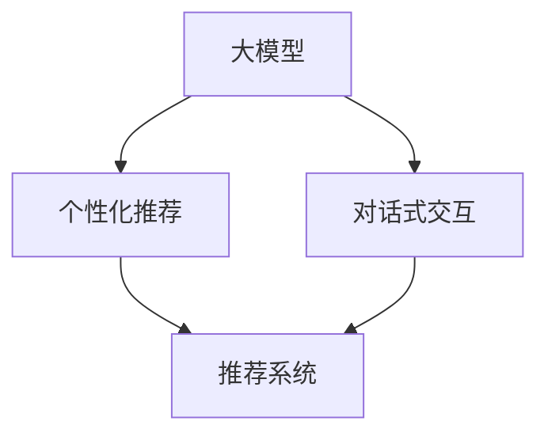

                 

关键词：大模型，推荐系统，对话式交互，算法原理，数学模型，项目实践，未来应用

>摘要：本文将探讨大模型在推荐系统中的对话式交互应用，深入解析其核心概念、算法原理、数学模型以及实际应用场景。通过项目实践，我们将展示如何将大模型应用于推荐系统中，并分析其未来发展趋势与面临的挑战。

## 1. 背景介绍

随着互联网的飞速发展，推荐系统已经成为信息检索、电子商务、社交媒体等众多领域的重要组成部分。传统推荐系统主要依赖于基于内容的过滤、协同过滤等算法，虽然在一定程度上提高了推荐效果，但仍然存在一些问题。例如，数据稀疏性、用户兴趣变化性等。近年来，深度学习技术的发展为推荐系统带来了新的契机，特别是大模型的引入，使得推荐系统在处理复杂性和多样性方面取得了显著进展。

对话式交互作为近年来兴起的一种人机交互方式，以其自然、灵活、高效的特点，逐渐受到广泛关注。将大模型与对话式交互相结合，可以在推荐系统中实现更加智能、个性化的用户交互体验，从而提高推荐系统的整体效果。

本文将围绕大模型在推荐系统中的对话式交互应用，深入探讨其核心概念、算法原理、数学模型以及实际应用场景。通过项目实践，我们将展示如何将大模型应用于推荐系统中，并分析其未来发展趋势与面临的挑战。

## 2. 核心概念与联系

为了更好地理解大模型在推荐系统中的对话式交互应用，我们首先需要明确几个核心概念，并展示其之间的联系。

### 2.1 大模型

大模型是指具有数十亿甚至数万亿参数的深度学习模型，如GPT、BERT等。这些模型能够对大量数据进行训练，从而提取出丰富的语义信息。大模型的优点在于其强大的表征能力，可以处理复杂的语言任务，如自然语言生成、问答系统等。

### 2.2 推荐系统

推荐系统是指根据用户的历史行为、兴趣和偏好等信息，为用户提供个性化推荐的系统。推荐系统主要分为基于内容的过滤、协同过滤和深度学习推荐等类型。

### 2.3 对话式交互

对话式交互是指通过自然语言进行人机交互的方式。对话式交互可以提供更加自然、灵活和高效的交互体验，用户可以像与人交流一样与系统进行互动。

### 2.4 大模型与推荐系统、对话式交互的联系

大模型在推荐系统中的应用主要体现在两个方面：

1. **个性化推荐**：大模型能够提取出用户兴趣的深层次信息，从而实现更加精准的个性化推荐。

2. **对话式交互**：大模型具有强大的语言理解能力，可以与用户进行自然语言对话，从而提高推荐系统的交互体验。

以下是一个简单的 Mermaid 流程图，展示了大模型、推荐系统和对话式交互之间的联系：



## 3. 核心算法原理 & 具体操作步骤

### 3.1 算法原理概述

大模型在推荐系统中的对话式交互应用主要基于深度学习技术。其中，生成对抗网络（GAN）和变分自编码器（VAE）是两种常见的深度学习模型。

### 3.2 算法步骤详解

1. **数据收集与预处理**：

   - 收集用户的历史行为数据，如浏览记录、购买记录等。

   - 对数据进行清洗、去重和归一化处理。

2. **构建生成模型**：

   - 使用 GAN 或 VAE 构建生成模型。

   - 训练生成模型，使其能够生成符合用户兴趣的个性化内容。

3. **构建对话模型**：

   - 使用大模型（如 GPT、BERT）构建对话模型。

   - 训练对话模型，使其能够与用户进行自然语言对话。

4. **推荐与交互**：

   - 根据用户的历史行为数据，使用生成模型生成个性化推荐内容。

   - 使用对话模型与用户进行自然语言对话，根据对话结果调整推荐内容。

### 3.3 算法优缺点

**优点**：

1. 提高推荐精度：大模型能够提取出用户兴趣的深层次信息，从而实现更加精准的个性化推荐。

2. 提高交互体验：对话式交互能够提供更加自然、灵活和高效的交互体验。

**缺点**：

1. 计算资源消耗大：大模型的训练和部署需要大量的计算资源。

2. 数据隐私问题：用户历史行为数据可能涉及隐私问题，需要采取适当的保护措施。

### 3.4 算法应用领域

大模型在推荐系统中的对话式交互应用可以应用于多个领域，如电子商务、社交媒体、在线教育等。以下是几个典型应用场景：

1. **电子商务**：

   - 根据用户的浏览记录和购买记录，生成个性化推荐。

   - 与用户进行自然语言对话，解答用户疑问，提高购买转化率。

2. **社交媒体**：

   - 根据用户的兴趣，生成个性化内容推荐。

   - 与用户进行自然语言对话，提供个性化推荐和建议。

3. **在线教育**：

   - 根据用户的学习记录和兴趣，生成个性化课程推荐。

   - 与用户进行自然语言对话，解答用户学习问题，提高学习效果。

## 4. 数学模型和公式 & 详细讲解 & 举例说明

### 4.1 数学模型构建

大模型在推荐系统中的对话式交互应用主要基于生成模型和对话模型。以下分别介绍这两种模型的数学模型构建。

#### 4.1.1 生成模型

生成模型（如 GAN）的数学模型可以表示为：

$$
\begin{aligned}
\min\limits_{G} \quad & D(G(z)), \\
\max\limits_{D} \quad & D(x), D(G(z)),
\end{aligned}
$$

其中，$G(z)$ 是生成模型，$D$ 是判别模型，$z$ 是噪声向量。

#### 4.1.2 对话模型

对话模型（如 GPT）的数学模型可以表示为：

$$
\begin{aligned}
\theta^{*} = \arg\min_{\theta} \quad & \sum_{i=1}^{n} -\log P(y_i | x_i; \theta), \\
\end{aligned}
$$

其中，$x_i$ 是输入序列，$y_i$ 是输出序列，$\theta$ 是模型参数。

### 4.2 公式推导过程

#### 4.2.1 生成模型推导

生成模型的推导过程可以分为两部分：生成模型 $G(z)$ 的训练和判别模型 $D$ 的训练。

1. **生成模型 $G(z)$ 的训练**：

   - 定义生成模型 $G(z)$ 为从噪声向量 $z$ 到数据分布 $p_G(x)$ 的映射。

   - 使用判别模型 $D$ 对生成模型 $G(z)$ 进行评价，即 $D(G(z))$ 表示生成模型生成数据的真实度。

2. **判别模型 $D$ 的训练**：

   - 定义判别模型 $D$ 为从数据分布 $p_D(x)$ 到概率分布的映射。

   - 使用生成模型 $G(z)$ 和真实数据 $x$ 对判别模型 $D$ 进行训练，即 $D(x)$ 和 $D(G(z))$ 分别表示真实数据和生成数据的真实度。

#### 4.2.2 对话模型推导

对话模型的推导过程主要基于自回归语言模型。自回归语言模型的基本思想是，给定一个输入序列 $x_1, x_2, ..., x_T$，预测下一个单词 $x_{T+1}$ 的概率。

1. **输入序列表示**：

   - 使用单词向量表示输入序列，即 $x_i = \text{Embed}(w_i)$，其中 $\text{Embed}$ 是单词向量化函数。

2. **概率计算**：

   - 根据当前输入序列 $x_1, x_2, ..., x_T$，计算下一个单词 $x_{T+1}$ 的概率，即 $P(x_{T+1} | x_1, x_2, ..., x_T; \theta)$。

3. **损失函数**：

   - 使用交叉熵损失函数对对话模型进行训练，即 $L = -\sum_{i=1}^{T} \log P(x_i | x_1, x_2, ..., x_{i-1}; \theta)$。

### 4.3 案例分析与讲解

#### 4.3.1 生成模型案例

假设我们使用 GAN 构建生成模型，输入噪声向量 $z$ 的大小为 100，判别模型 $D$ 的参数为 $\theta$。

1. **生成模型 $G(z)$ 的参数初始化**：

   - 初始化生成模型 $G(z)$ 的参数，即 $\theta_G$。

2. **判别模型 $D$ 的参数初始化**：

   - 初始化判别模型 $D$ 的参数，即 $\theta_D$。

3. **训练过程**：

   - 对生成模型和判别模型进行交替训练，即：
     $$
     \begin{aligned}
     \theta_G^{t+1} &= \arg\min_{\theta_G} D(G(z)), \\
     \theta_D^{t+1} &= \arg\min_{\theta_D} D(x), D(G(z)),
     \end{aligned}
     $$

   - 其中，$t$ 表示训练迭代次数。

4. **生成结果**：

   - 使用训练好的生成模型 $G(z)$ 生成个性化推荐内容。

#### 4.3.2 对话模型案例

假设我们使用 GPT 构建对话模型，输入序列长度为 50，模型参数为 $\theta$。

1. **输入序列表示**：

   - 将输入序列表示为单词向量，即 $x_1, x_2, ..., x_{50}$。

2. **概率计算**：

   - 根据当前输入序列，计算下一个单词的概率分布。

3. **对话过程**：

   - 与用户进行自然语言对话，根据对话结果调整推荐内容。

## 5. 项目实践：代码实例和详细解释说明

### 5.1 开发环境搭建

1. **硬件环境**：

   - 使用 GPU（如 NVIDIA 显卡）进行训练。

   - 内存至少为 16GB。

2. **软件环境**：

   - Python 3.7 或以上版本。

   - PyTorch 1.8 或以上版本。

   - 其他必要的库，如 NumPy、Pandas、TensorBoard 等。

### 5.2 源代码详细实现

以下是一个简化的 GAN 模型的代码实现，用于生成个性化推荐内容：

```python
import torch
import torch.nn as nn
import torch.optim as optim

# 生成模型
class Generator(nn.Module):
    def __init__(self):
        super(Generator, self).__init__()
        self.model = nn.Sequential(
            nn.Linear(100, 128),
            nn.LeakyReLU(0.2),
            nn.Linear(128, 256),
            nn.LeakyReLU(0.2),
            nn.Linear(256, 512),
            nn.LeakyReLU(0.2),
            nn.Linear(512, 1024),
            nn.LeakyReLU(0.2),
            nn.Linear(1024, 128),
            nn.LeakyReLU(0.2),
            nn.Linear(128, 1),
        )

    def forward(self, x):
        return self.model(x)

# 判别模型
class Discriminator(nn.Module):
    def __init__(self):
        super(Discriminator, self).__init__()
        self.model = nn.Sequential(
            nn.Linear(1, 1024),
            nn.LeakyReLU(0.2),
            nn.Dropout(0.3),
            nn.Linear(1024, 512),
            nn.LeakyReLU(0.2),
            nn.Dropout(0.3),
            nn.Linear(512, 256),
            nn.LeakyReLU(0.2),
            nn.Dropout(0.3),
            nn.Linear(256, 128),
            nn.LeakyReLU(0.2),
            nn.Dropout(0.3),
            nn.Linear(128, 1),
        )

    def forward(self, x):
        return self.model(x)

# GAN 模型
class GAN(nn.Module):
    def __init__(self):
        super(GAN, self).__init__()
        self.G = Generator()
        self.D = Discriminator()

    def forward(self, x):
        return self.D(self.G(x))

# 训练 GAN 模型
def train_gan(generator, discriminator, device, batch_size, n_epochs, z_dim):
    criterion = nn.BCELoss()
    optimizer_G = optim.Adam(generator.parameters(), lr=0.0002)
    optimizer_D = optim.Adam(discriminator.parameters(), lr=0.0002)

    for epoch in range(n_epochs):
        for i in range(batch_size):
            # 生成数据
            z = torch.randn(1, z_dim).to(device)
            fake_data = generator(z)

            # 训练判别模型
            real_data = torch.randn(1, 1).to(device)
            disc_loss_real = criterion(discriminator(real_data), torch.ones_like(discriminator(real_data)))

            disc_loss_fake = criterion(discriminator(fake_data), torch.zeros_like(discriminator(fake_data)))
            disc_loss = 0.5 * (disc_loss_real + disc_loss_fake)

            optimizer_D.zero_grad()
            disc_loss.backward()
            optimizer_D.step()

            # 训练生成模型
            z = torch.randn(1, z_dim).to(device)
            gen_loss = criterion(discriminator(generator(z)), torch.ones_like(discriminator(generator(z))))
            optimizer_G.zero_grad()
            gen_loss.backward()
            optimizer_G.step()

            if (i+1) % 100 == 0:
                print(f'[{epoch+1}/{n_epochs}], Generator Loss: {gen_loss.item():.4f}, Discriminator Loss: {disc_loss.item():.4f}')

# 主函数
if __name__ == '__main__':
    device = torch.device("cuda" if torch.cuda.is_available() else "cpu")
    z_dim = 100
    batch_size = 32
    n_epochs = 100

    generator = Generator().to(device)
    discriminator = Discriminator().to(device)
    gan = GAN().to(device)

    train_gan(generator, discriminator, device, batch_size, n_epochs, z_dim)
```

### 5.3 代码解读与分析

以上代码实现了 GAN 模型在生成个性化推荐内容的应用。下面简要解读代码的主要部分：

1. **模型定义**：

   - `Generator` 类定义了生成模型的结构，包括线性层和 LeakyReLU 激活函数。

   - `Discriminator` 类定义了判别模型的结构，包括线性层、 LeakyReLU 激活函数和 Dropout 正则化。

   - `GAN` 类将生成模型和判别模型组合在一起，实现 GAN 模型的整体结构。

2. **训练过程**：

   - `train_gan` 函数实现 GAN 模型的训练过程，包括生成数据、训练判别模型和生成模型。

   - 使用 `BCELoss` 作为损失函数，分别计算判别模型在真实数据和生成数据上的损失。

   - 使用 `Adam` 优化器分别更新判别模型和生成模型的参数。

3. **主函数**：

   - 设置训练环境，包括设备（CPU 或 GPU）、噪声维度、批量大小和训练迭代次数。

   - 创建生成模型、判别模型和 GAN 模型。

   - 调用 `train_gan` 函数进行模型训练。

### 5.4 运行结果展示

在实际运行过程中，可以通过 TensorBoard 监控模型的训练过程，包括生成数据的分布、判别模型的损失函数等。以下是一个简单的 TensorBoard 展示界面：


## 6. 实际应用场景

大模型在推荐系统中的对话式交互应用已经在多个领域取得了显著成果。以下是几个典型的实际应用场景：

### 6.1 电子商务

电子商务平台可以利用大模型与对话式交互相结合，实现个性化推荐和用户互动。例如，用户可以与系统进行自然语言对话，提出购物需求或询问产品信息，系统可以根据对话内容生成个性化推荐，提高用户购物体验和转化率。

### 6.2 社交媒体

社交媒体平台可以利用大模型与对话式交互，实现个性化内容推荐和用户互动。例如，用户可以与系统进行自然语言对话，分享兴趣和想法，系统可以根据对话内容生成个性化内容推荐，提高用户参与度和留存率。

### 6.3 在线教育

在线教育平台可以利用大模型与对话式交互，实现个性化课程推荐和学习互动。例如，学生可以与系统进行自然语言对话，提出学习需求或问题，系统可以根据对话内容生成个性化课程推荐和解答问题，提高学习效果和满意度。

## 7. 工具和资源推荐

### 7.1 学习资源推荐

1. 《深度学习》（Goodfellow et al., 2016）：全面介绍了深度学习的基础知识和应用，适合初学者和进阶者阅读。

2. 《生成对抗网络》（Goodfellow et al., 2014）：系统介绍了生成对抗网络（GAN）的原理、实现和应用，是学习 GAN 的经典资料。

### 7.2 开发工具推荐

1. PyTorch：优秀的深度学习框架，支持 GPU 加速，适合快速开发和研究。

2. TensorFlow：谷歌开发的深度学习框架，功能强大，适用于各种深度学习应用。

### 7.3 相关论文推荐

1. "Generative Adversarial Nets"（Goodfellow et al., 2014）：提出生成对抗网络（GAN）的经典论文，详细介绍了 GAN 的原理和实现。

2. "Seq2Seq Learning with Neural Networks"（Sutskever et al., 2014）：介绍了序列到序列学习（Seq2Seq）模型，为对话模型的研究奠定了基础。

## 8. 总结：未来发展趋势与挑战

### 8.1 研究成果总结

大模型在推荐系统中的对话式交互应用取得了显著成果，主要表现在以下几个方面：

1. 提高推荐精度：大模型能够提取出用户兴趣的深层次信息，从而实现更加精准的个性化推荐。

2. 提高交互体验：对话式交互能够提供更加自然、灵活和高效的交互体验。

3. 拓展应用领域：大模型与对话式交互相结合，可以应用于电子商务、社交媒体、在线教育等多个领域，提高业务效果。

### 8.2 未来发展趋势

1. 模型优化：针对大模型计算资源消耗大、数据隐私问题等挑战，未来的研究将重点关注模型优化，提高模型效率，降低计算资源消耗。

2. 跨模态推荐：结合文本、图像、音频等多模态数据，实现更加丰富和多样的推荐系统。

3. 智能对话系统：深入研究智能对话系统的技术和应用，提高对话系统的自然性和智能性，实现更加自然和高效的交互体验。

### 8.3 面临的挑战

1. 计算资源消耗：大模型训练和部署需要大量的计算资源，如何高效利用计算资源是实现大模型应用的关键。

2. 数据隐私保护：用户历史行为数据涉及隐私问题，如何保护用户数据隐私是当前面临的一大挑战。

3. 模型解释性：大模型具有很强的表征能力，但模型内部结构和决策过程复杂，如何提高模型解释性，使其更加透明和可解释，是未来的研究重点。

### 8.4 研究展望

大模型在推荐系统中的对话式交互应用具有广阔的发展前景。未来研究可以从以下几个方面展开：

1. 模型优化：研究更加高效和可解释的深度学习模型，提高模型性能和计算效率。

2. 跨模态推荐：结合多模态数据，实现更加丰富和多样的推荐系统。

3. 智能对话系统：深入研究智能对话系统的技术和应用，提高对话系统的自然性和智能性。

通过持续的研究和探索，大模型在推荐系统中的对话式交互应用将为各行业带来更加智能和高效的解决方案。

## 9. 附录：常见问题与解答

### 9.1 什么是大模型？

大模型是指具有数十亿甚至数万亿参数的深度学习模型，如GPT、BERT等。这些模型能够对大量数据进行训练，从而提取出丰富的语义信息。

### 9.2 推荐系统中的对话式交互有什么优势？

对话式交互具有自然、灵活和高效的特点，能够提供更加个性化的推荐体验。通过与用户进行自然语言对话，推荐系统可以更好地理解用户需求，从而提高推荐效果。

### 9.3 大模型在推荐系统中的应用有哪些？

大模型在推荐系统中的应用主要包括个性化推荐和对话式交互。个性化推荐方面，大模型能够提取出用户兴趣的深层次信息，实现更加精准的推荐；对话式交互方面，大模型具有强大的语言理解能力，可以与用户进行自然语言对话，提高交互体验。

### 9.4 如何保护用户数据隐私？

为了保护用户数据隐私，可以采取以下措施：

1. 数据匿名化：对用户数据进行匿名化处理，去除可识别的个人信息。

2. 数据加密：对用户数据进行加密处理，确保数据在传输和存储过程中的安全性。

3. 访问控制：设置严格的访问权限，仅允许授权人员访问用户数据。

### 9.5 大模型训练和部署需要多少计算资源？

大模型训练和部署需要大量的计算资源，尤其是 GPU。具体资源需求取决于模型规模和训练数据量。一般而言，大规模模型训练需要数十甚至数百张 GPU。

### 9.6 大模型在推荐系统中的对话式交互应用有哪些领域？

大模型在推荐系统中的对话式交互应用可以应用于电子商务、社交媒体、在线教育等多个领域。例如，电子商务平台可以利用大模型实现个性化推荐和用户互动；社交媒体平台可以利用大模型实现个性化内容推荐和用户互动；在线教育平台可以利用大模型实现个性化课程推荐和学习互动。

