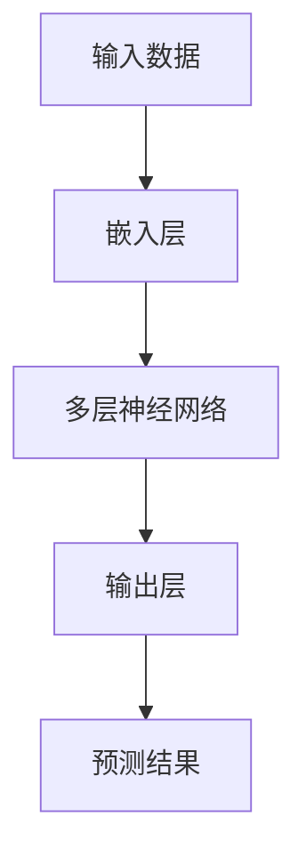
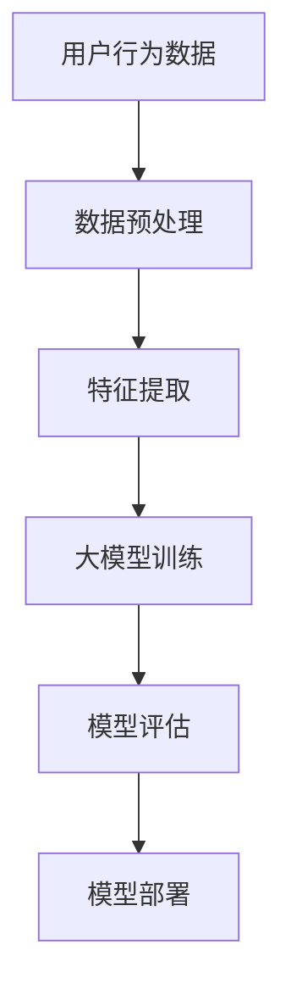

                 

关键词：大模型、推荐系统、打分排序、深度学习、机器学习、NLP

> 摘要：本文将深入探讨大模型在推荐系统打分排序中的重要性及其潜力。通过对大模型的核心概念、算法原理、数学模型以及实际应用场景的详细分析，揭示其在提升推荐系统准确性和用户体验方面的关键作用，并展望其未来发展趋势与挑战。

## 1. 背景介绍

在互联网时代，推荐系统已经成为提升用户体验、增加用户粘性和提高商业价值的重要手段。然而，随着数据量的爆炸式增长和用户行为的复杂性，传统的推荐系统方法如基于协同过滤、基于内容的推荐等面临诸多挑战。这些方法往往依赖于手动的特征工程和有限的先验知识，难以捕捉到用户行为的深层模式和细微差异。

### 1.1 推荐系统的挑战

1. **数据稀疏性问题**：用户行为数据往往具有稀疏性，使得基于协同过滤的推荐方法效果不佳。
2. **冷启动问题**：对于新用户或者新商品，由于缺乏足够的行为数据，传统推荐方法难以提供个性化的推荐。
3. **动态性**：用户偏好和兴趣是动态变化的，传统的推荐系统难以实时适应这种变化。

### 1.2 大模型的崛起

为了解决上述问题，深度学习和自然语言处理（NLP）领域的大模型应运而生。大模型，如BERT、GPT、T5等，具有以下优势：

1. **强大的表征能力**：能够捕捉到文本中的复杂结构和语义信息。
2. **自动特征提取**：通过大量无监督的数据进行预训练，自动提取有意义的特征。
3. **端到端的建模**：能够直接从原始数据中学习到输入和输出之间的关系，无需手动特征工程。

## 2. 核心概念与联系

### 2.1 大模型概述

大模型通常指的是参数量达到亿级或万亿级的深度学习模型，如GPT-3、BERT等。这些模型通过多层神经网络结构，对输入数据进行多层次、多尺度的特征提取和表征。



### 2.2 推荐系统架构

推荐系统的基本架构包括数据采集、数据预处理、特征工程、模型训练、模型评估和模型部署。在大模型的应用中，特征工程环节得到了显著简化。



## 3. 核心算法原理 & 具体操作步骤

### 3.1 算法原理概述

大模型在推荐系统中的应用主要分为两步：预训练和微调。

1. **预训练**：在大规模语料库上进行预训练，学习到通用的语言理解和生成能力。
2. **微调**：在推荐场景下，利用少量标注数据进行微调，以适应特定的推荐任务。

### 3.2 算法步骤详解

1. **数据预处理**：清洗和归一化用户行为数据。
2. **模型选择**：选择合适的大模型架构，如BERT、GPT等。
3. **预训练**：在大型语料库上进行预训练。
4. **微调**：在推荐数据集上进行微调。
5. **模型评估**：使用指标如准确率、召回率等评估模型性能。
6. **模型部署**：将训练好的模型部署到线上环境。

### 3.3 算法优缺点

#### 优点：

1. **强大的表征能力**：能够捕捉到文本中的复杂结构和语义信息。
2. **自动特征提取**：无需手动特征工程。
3. **端到端建模**：直接从原始数据中学习输入和输出之间的关系。

#### 缺点：

1. **计算资源消耗大**：需要大量的计算资源和存储空间。
2. **数据需求高**：需要大量的标注数据。
3. **解释性差**：模型的内部机制复杂，难以解释。

### 3.4 算法应用领域

大模型在推荐系统中的应用领域广泛，如商品推荐、新闻推荐、社交媒体推荐等。其核心思想是通过模型自动提取特征，实现个性化的推荐。

## 4. 数学模型和公式 & 详细讲解 & 举例说明

### 4.1 数学模型构建

大模型通常由多层神经网络组成，包括嵌入层、隐藏层和输出层。其中，嵌入层将输入数据映射到低维空间，隐藏层通过非线性变换提取特征，输出层生成预测结果。

```latex
\begin{equation}
    E(x) = W_e \cdot x + b_e
\end{equation}

\begin{equation}
    h = \sigma(W_h \cdot h_{\text{prev}} + b_h)
\end{equation}

\begin{equation}
    y = W_o \cdot h + b_o
\end{equation}
```

其中，$x$ 为输入数据，$W_e$、$W_h$、$W_o$ 分别为嵌入层、隐藏层和输出层的权重矩阵，$b_e$、$b_h$、$b_o$ 分别为相应的偏置项，$\sigma$ 为激活函数。

### 4.2 公式推导过程

以BERT模型为例，其预训练过程主要包括两个任务：Masked Language Model（MLM）和Next Sentence Prediction（NSP）。

1. **Masked Language Model**：

   ```latex
   \begin{equation}
       \log p(\hat{x}_i | x_1, x_2, ..., x_i, ..., x_n) = \log \frac{\exp(f(x_i, h_{\text{prev}}))}{Z}
   \end{equation}
   ```

   其中，$f$ 为前向传播函数，$h_{\text{prev}}$ 为前一个隐藏状态，$\hat{x}_i$ 为被遮盖的词，$Z$ 为归一化常数。

2. **Next Sentence Prediction**：

   ```latex
   \begin{equation}
       \log p(\text{next sentence} | \text{current sentence}) = \log \frac{\exp(g(h_{\text{current}}, h_{\text{next}}))}{Z'}
   \end{equation}
   ```

   其中，$g$ 为前向传播函数，$h_{\text{current}}$ 和 $h_{\text{next}}$ 分别为当前句子和下一句子的隐藏状态。

### 4.3 案例分析与讲解

假设我们要对一个电商平台的商品推荐系统进行微调，以下是一个简单的例子：

1. **数据预处理**：将用户行为数据（如点击、购买、收藏等）转换为序列形式。
2. **模型选择**：选择一个预训练的BERT模型作为基础模型。
3. **预训练**：在电商平台的数据集上进行预训练，以学习到商品和用户行为的表征。
4. **微调**：在标注数据集上进行微调，以适应具体的推荐任务。
5. **模型评估**：使用AUC、准确率等指标评估模型性能。
6. **模型部署**：将训练好的模型部署到线上环境。

通过这个例子，我们可以看到大模型在推荐系统中的应用流程。在实际开发过程中，需要根据具体场景和数据情况进行调整。

## 5. 项目实践：代码实例和详细解释说明

### 5.1 开发环境搭建

在开始项目实践之前，我们需要搭建一个合适的开发环境。以下是一个基于Python和PyTorch的简单示例：

```python
# 安装必要的库
!pip install torch torchvision transformers

# 导入库
import torch
from torch import nn
from torchvision import datasets, transforms
from transformers import BertModel, BertTokenizer

# 模型选择
model = BertModel.from_pretrained('bert-base-uncased')
tokenizer = BertTokenizer.from_pretrained('bert-base-uncased')
```

### 5.2 源代码详细实现

以下是一个简单的微调示例，用于商品推荐任务：

```python
# 数据预处理
def preprocess_data(texts):
    return tokenizer(texts, padding=True, truncation=True, return_tensors='pt')

# 模型微调
def train_model(model, train_loader, optimizer, criterion, num_epochs=3):
    model.train()
    for epoch in range(num_epochs):
        for batch in train_loader:
            inputs = preprocess_data(batch['text'])
            labels = batch['label']
            optimizer.zero_grad()
            outputs = model(**inputs)
            loss = criterion(outputs.logits, labels)
            loss.backward()
            optimizer.step()
            print(f'Epoch [{epoch+1}/{num_epochs}], Loss: {loss.item()}')

# 模型评估
def evaluate_model(model, val_loader, criterion):
    model.eval()
    with torch.no_grad():
        for batch in val_loader:
            inputs = preprocess_data(batch['text'])
            labels = batch['label']
            outputs = model(**inputs)
            loss = criterion(outputs.logits, labels)
            print(f'Loss: {loss.item()}')
```

### 5.3 代码解读与分析

在这个示例中，我们首先定义了数据预处理函数 `preprocess_data`，用于将文本数据转换为模型可接受的格式。接着，我们定义了训练函数 `train_model` 和评估函数 `evaluate_model`。

1. **数据预处理**：使用 `tokenizer` 对文本数据进行分词、编码等操作，并将结果转换为PyTorch张量。
2. **模型微调**：在训练过程中，通过反向传播和梯度下降更新模型参数。
3. **模型评估**：在评估过程中，我们仅计算损失函数的值，以评估模型的性能。

### 5.4 运行结果展示

```python
# 加载数据集
train_dataset = ...
val_dataset = ...

# 划分训练集和验证集
train_loader = ...
val_loader = ...

# 模型参数
learning_rate = 0.001
optimizer = torch.optim.AdamW(model.parameters(), lr=learning_rate)
criterion = nn.CrossEntropyLoss()

# 训练模型
train_model(model, train_loader, optimizer, criterion, num_epochs=3)

# 评估模型
evaluate_model(model, val_loader, criterion)
```

通过这个示例，我们可以看到如何使用PyTorch和transformers库对BERT模型进行微调和评估。在实际项目中，我们需要根据具体任务和数据集进行调整。

## 6. 实际应用场景

大模型在推荐系统中的应用已经取得了显著的成果。以下是一些实际应用场景：

1. **电商推荐**：通过分析用户行为数据，实现个性化的商品推荐。
2. **社交媒体推荐**：根据用户兴趣和互动行为，推荐感兴趣的内容。
3. **新闻推荐**：通过分析用户阅读历史，推荐相关新闻。

### 6.1 电商推荐

在电商领域，大模型可以用于商品推荐、购物车推荐等。以下是一个简单的电商推荐流程：

1. **数据采集**：收集用户行为数据（如浏览、购买、评价等）。
2. **数据预处理**：对数据进行清洗和归一化处理。
3. **特征提取**：使用大模型提取用户和商品的特征。
4. **模型训练**：使用提取的特征训练推荐模型。
5. **模型评估**：使用AUC、准确率等指标评估模型性能。
6. **模型部署**：将训练好的模型部署到线上环境。

### 6.2 社交媒体推荐

在社交媒体领域，大模型可以用于内容推荐、广告推荐等。以下是一个简单的社交媒体推荐流程：

1. **数据采集**：收集用户行为数据（如点赞、评论、转发等）。
2. **数据预处理**：对数据进行清洗和归一化处理。
3. **特征提取**：使用大模型提取用户和内容的特征。
4. **模型训练**：使用提取的特征训练推荐模型。
5. **模型评估**：使用AUC、准确率等指标评估模型性能。
6. **模型部署**：将训练好的模型部署到线上环境。

### 6.3 新闻推荐

在新闻推荐领域，大模型可以用于推荐相关新闻。以下是一个简单的新闻推荐流程：

1. **数据采集**：收集用户阅读历史和新闻内容。
2. **数据预处理**：对数据进行清洗和归一化处理。
3. **特征提取**：使用大模型提取用户和新闻的特征。
4. **模型训练**：使用提取的特征训练推荐模型。
5. **模型评估**：使用AUC、准确率等指标评估模型性能。
6. **模型部署**：将训练好的模型部署到线上环境。

## 7. 未来应用展望

大模型在推荐系统中的应用前景广阔，未来可能的发展趋势包括：

1. **个性化推荐**：通过更深入地理解用户行为和偏好，实现更高精度的个性化推荐。
2. **跨模态推荐**：整合多种模态的数据（如文本、图像、音频等），实现更丰富的推荐体验。
3. **实时推荐**：利用实时数据流，实现动态调整推荐策略。
4. **多任务学习**：同时处理多个推荐任务，提高模型的整体性能。

## 8. 总结：未来发展趋势与挑战

### 8.1 研究成果总结

本文通过对大模型在推荐系统打分排序中的应用进行深入分析，总结了其核心概念、算法原理、数学模型以及实际应用场景。研究结果表明，大模型具有强大的表征能力、自动特征提取和端到端建模优势，能够显著提升推荐系统的准确性和用户体验。

### 8.2 未来发展趋势

未来，大模型在推荐系统中的应用将继续深化和扩展。随着计算资源和数据量的增长，大模型将能够更好地理解用户行为和偏好，实现更个性化的推荐。同时，跨模态推荐和实时推荐等技术也将逐渐成熟，为用户带来更加丰富和便捷的推荐体验。

### 8.3 面临的挑战

尽管大模型在推荐系统中的应用前景广阔，但同时也面临着一些挑战：

1. **计算资源消耗**：大模型训练和推理过程需要大量的计算资源，这对硬件设施提出了更高的要求。
2. **数据隐私**：推荐系统需要大量用户行为数据，如何确保数据隐私和安全是关键问题。
3. **模型解释性**：大模型的内部机制复杂，如何解释和验证模型的预测结果是一个挑战。

### 8.4 研究展望

未来，研究应重点关注如何平衡大模型的计算资源消耗和模型解释性，同时探索更加有效的数据处理和特征提取方法，以提高推荐系统的性能。此外，跨模态推荐和实时推荐等技术的深入研究也将推动推荐系统的发展。

## 9. 附录：常见问题与解答

### 9.1 大模型训练需要多大的计算资源？

大模型训练通常需要大量的计算资源和存储空间。具体需求取决于模型的参数量和数据集的大小。例如，GPT-3模型训练需要数千张GPU并行计算，以及数TB的存储空间。

### 9.2 大模型训练需要多少时间？

大模型训练时间取决于多个因素，如模型大小、数据集大小、GPU性能等。例如，GPT-3模型的训练可能需要数周到数月的时间。

### 9.3 大模型如何处理冷启动问题？

大模型可以通过预训练阶段学习到通用的语言知识和知识表示，从而在处理冷启动问题时具有一定的优势。此外，可以采用增量学习的方法，逐步积累新用户或新商品的行为数据，以改善推荐效果。

### 9.4 大模型在推荐系统中的优势是什么？

大模型在推荐系统中的优势主要包括：

1. **强大的表征能力**：能够捕捉到文本中的复杂结构和语义信息。
2. **自动特征提取**：无需手动特征工程。
3. **端到端建模**：直接从原始数据中学习输入和输出之间的关系。

### 9.5 大模型在推荐系统中的局限性是什么？

大模型在推荐系统中的局限性主要包括：

1. **计算资源消耗大**：需要大量的计算资源和存储空间。
2. **数据需求高**：需要大量的标注数据。
3. **解释性差**：模型的内部机制复杂，难以解释。

