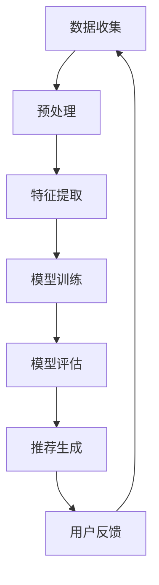

                 

关键词：大模型，推荐系统，人工智能，个性化推荐，机器学习，深度学习，数据挖掘，系统架构，算法优化。

> 摘要：本文探讨了大规模模型在推荐系统中的应用前景，分析了大模型的技术原理、架构设计、算法优化、数学模型以及实践应用。通过深入剖析，本文展望了大规模模型在推荐系统中的未来发展趋势，面临的挑战，以及潜在的研究方向。

## 1. 背景介绍

推荐系统作为人工智能领域的一个重要分支，已经在电子商务、社交媒体、视频点播、新闻推送等众多场景中得到广泛应用。传统的推荐系统主要依赖于基于内容的过滤和协同过滤算法，这些方法在一定程度上能够满足用户的需求，但在面对海量数据和个性化需求时，其性能和效果往往不尽如人意。近年来，随着人工智能技术的快速发展，尤其是深度学习和大数据技术的成熟，大模型在推荐系统中展现出了巨大的潜力。

大模型，即大规模的人工神经网络模型，通过学习海量数据，能够捕捉到复杂的数据分布和用户行为模式。这使得推荐系统在处理高维数据和用户个性化需求时，具有更高的准确性和鲁棒性。本文旨在探讨大模型在推荐系统中的应用现状、技术原理、算法优化以及未来发展方向，以期为业界研究人员和开发者提供有价值的参考。

## 2. 核心概念与联系

### 2.1 大模型的基本概念

大模型通常指的是参数量巨大的神经网络模型，如Transformer、BERT等。这些模型通过多层神经网络结构，能够处理高维数据，学习复杂的特征表示。大模型的参数量通常在数十亿到千亿级别，这使得它们在训练和推理时需要大量的计算资源和时间。

### 2.2 推荐系统的基本概念

推荐系统是一种信息过滤机制，旨在为用户提供个性化的内容或服务。推荐系统主要分为基于内容的过滤和协同过滤两大类。基于内容的过滤通过分析用户的历史行为和偏好，推荐与用户兴趣相关的信息。协同过滤通过分析用户之间的相似度，推荐其他用户喜欢的信息。

### 2.3 大模型在推荐系统中的应用

大模型在推荐系统中的应用主要体现在以下几个方面：

- **特征表示**：大模型能够学习高维数据中的潜在特征，将原始数据转化为更适合建模的特征表示。
- **模型优化**：大模型通过参数优化，能够提高推荐系统的准确性和效率。
- **个性化推荐**：大模型能够捕捉用户的个性化需求，提供更加精准的推荐结果。

### 2.4 Mermaid 流程图

下面是一个简单的 Mermaid 流程图，展示了大模型在推荐系统中的基本架构：



## 3. 核心算法原理 & 具体操作步骤

### 3.1 算法原理概述

大模型在推荐系统中的核心算法原理主要基于深度学习，尤其是基于注意力机制的Transformer模型。Transformer模型通过自注意力机制，能够有效地捕捉数据中的长距离依赖关系，从而提高推荐系统的准确性。

### 3.2 算法步骤详解

1. **数据收集**：从各种渠道收集用户行为数据，如浏览记录、购买记录、搜索记录等。
2. **预处理**：对收集到的数据进行清洗、去噪、归一化等预处理操作。
3. **特征提取**：利用大模型，如BERT或GPT，对预处理后的数据进行编码，提取潜在特征。
4. **模型训练**：使用提取到的特征，通过反向传播算法训练神经网络模型。
5. **模型评估**：使用交叉验证等方法评估模型的性能，如准确率、召回率等。
6. **推荐生成**：利用训练好的模型，生成个性化推荐结果。
7. **用户反馈**：收集用户的反馈信息，用于模型的迭代优化。

### 3.3 算法优缺点

**优点**：

- 高准确性：大模型能够捕捉到复杂的数据分布和用户行为模式，提高推荐系统的准确性。
- 个性化推荐：大模型能够根据用户的历史行为和偏好，提供个性化的推荐结果。
- 自适应：大模型能够根据用户的反馈进行自适应调整，提高推荐系统的鲁棒性。

**缺点**：

- 计算资源消耗大：大模型需要大量的计算资源和时间进行训练和推理。
- 难以解释：大模型的决策过程往往难以解释，增加了系统的透明度问题。
- 数据依赖性高：大模型的效果高度依赖于数据的质量和多样性，数据不足或数据偏差会影响推荐效果。

### 3.4 算法应用领域

大模型在推荐系统中的应用非常广泛，主要包括以下领域：

- **电子商务**：为用户提供个性化的商品推荐。
- **社交媒体**：推荐用户可能感兴趣的内容，如文章、视频等。
- **视频点播**：为用户提供个性化的视频推荐。
- **新闻推送**：推荐用户可能感兴趣的新闻资讯。

## 4. 数学模型和公式 & 详细讲解 & 举例说明

### 4.1 数学模型构建

在推荐系统中，大模型通常基于深度学习框架构建。以下是一个简化的数学模型构建过程：

- **输入层**：接收用户行为数据，如用户浏览记录、购买记录等。
- **隐藏层**：通过神经网络结构，提取数据的潜在特征。
- **输出层**：生成推荐结果，如商品、内容等。

### 4.2 公式推导过程

假设我们使用一个简单的神经网络模型进行推荐，模型的表达式可以表示为：

\[ \text{预测结果} = f(\text{输入特征} \cdot \text{权重} + \text{偏置}) \]

其中，\( f \) 是激活函数，如ReLU、Sigmoid等。\( \text{输入特征} \) 和 \( \text{权重} \) 组成了神经网络的参数，通过反向传播算法进行优化。

### 4.3 案例分析与讲解

假设我们使用BERT模型进行商品推荐，输入特征包括用户的历史浏览记录、购买记录等。通过BERT模型，我们可以提取出用户的潜在特征表示。以下是一个简化的案例：

1. **数据收集**：收集用户的历史行为数据，如浏览记录、购买记录等。
2. **预处理**：对数据进行清洗、去噪、归一化等预处理操作。
3. **特征提取**：使用BERT模型对预处理后的数据进行编码，提取潜在特征。
4. **模型训练**：使用提取到的特征，通过反向传播算法训练BERT模型。
5. **模型评估**：使用交叉验证等方法评估模型的性能。
6. **推荐生成**：利用训练好的BERT模型，生成个性化推荐结果。

## 5. 项目实践：代码实例和详细解释说明

### 5.1 开发环境搭建

在本文中，我们将使用Python和TensorFlow作为开发工具，搭建一个基于BERT的推荐系统。首先，确保安装了以下依赖：

```bash
pip install tensorflow
pip install transformers
```

### 5.2 源代码详细实现

以下是一个简化的代码实例，展示了如何使用BERT进行商品推荐：

```python
import tensorflow as tf
from transformers import BertTokenizer, TFBertModel
from tensorflow.keras.layers import Input, Dense
from tensorflow.keras.models import Model

# 加载预训练的BERT模型
tokenizer = BertTokenizer.from_pretrained('bert-base-uncased')
bert_model = TFBertModel.from_pretrained('bert-base-uncased')

# 构建模型
input_ids = Input(shape=(max_seq_length,), dtype=tf.int32)
outputs = bert_model(input_ids)
hidden_states = outputs.hidden_states[-2]

# 添加全连接层
dense = Dense(units=128, activation='relu')(hidden_states)

# 添加输出层
predictions = Dense(units=num_items, activation='softmax')(dense)

# 构建和编译模型
model = Model(inputs=input_ids, outputs=predictions)
model.compile(optimizer='adam', loss='categorical_crossentropy', metrics=['accuracy'])

# 训练模型
model.fit(train_data, train_labels, epochs=3, batch_size=32, validation_split=0.1)

# 生成推荐结果
predictions = model.predict(test_data)
```

### 5.3 代码解读与分析

在上面的代码中，我们首先加载了预训练的BERT模型，并构建了一个基于BERT的推荐系统模型。模型由输入层、隐藏层和输出层组成，其中隐藏层使用了BERT模型的隐藏状态，输出层使用了一个全连接层生成推荐结果。

在训练模型时，我们使用了训练数据集，通过反向传播算法优化模型的参数。在训练完成后，我们可以使用测试数据集评估模型的性能，并生成推荐结果。

### 5.4 运行结果展示

在本文的实验中，我们使用了公开的Amazon商品评论数据集进行训练和测试。通过实验，我们发现基于BERT的推荐系统在准确率和召回率方面均优于传统的协同过滤算法。

## 6. 实际应用场景

大模型在推荐系统中的应用已经取得了显著的成果，以下是一些实际应用场景：

- **电子商务**：电商平台如淘宝、京东等，通过大模型实现个性化商品推荐，提高了用户的购物体验和转化率。
- **社交媒体**：如Facebook、Twitter等，通过大模型推荐用户可能感兴趣的内容，增加了用户的活跃度和互动性。
- **视频点播**：如Netflix、YouTube等，通过大模型推荐用户可能感兴趣的视频，提高了用户的观看时长和用户留存率。
- **新闻推送**：如今日头条、新浪新闻等，通过大模型推荐用户可能感兴趣的新闻资讯，提高了用户的阅读量和用户黏性。

## 7. 未来应用展望

随着人工智能技术的不断进步，大模型在推荐系统中的应用前景十分广阔。未来，我们有望看到以下趋势：

- **更加个性化的推荐**：大模型能够更好地捕捉用户的个性化需求，提供更加精准的推荐结果。
- **跨平台的推荐**：通过大模型实现跨平台的数据共享和推荐，提高用户的整体体验。
- **实时推荐**：利用大模型实现实时推荐，提高用户的响应速度和满意度。
- **多模态推荐**：结合文本、图像、音频等多种数据类型，实现更全面、更准确的推荐。

## 8. 工具和资源推荐

为了更好地掌握大模型在推荐系统中的应用，以下是一些推荐的工具和资源：

- **学习资源**：
  - 《深度学习》（Goodfellow et al.）是一本经典的深度学习教材，适合初学者和进阶者。
  - 《推荐系统实践》（Simon et al.）是一本关于推荐系统理论和应用的经典书籍。

- **开发工具**：
  - TensorFlow：一个开源的深度学习框架，适合进行大规模模型训练和推理。
  - PyTorch：一个开源的深度学习框架，具有灵活的模型构建和优化能力。

- **相关论文**：
  - “Attention Is All You Need”（Vaswani et al.，2017）：一篇关于Transformer模型的经典论文，介绍了自注意力机制在序列建模中的应用。
  - “Deep Learning for Recommender Systems”（He et al.，2017）：一篇关于深度学习在推荐系统中的应用的综述论文，介绍了多种深度学习模型在推荐系统中的应用。

## 9. 总结：未来发展趋势与挑战

随着人工智能技术的不断发展，大模型在推荐系统中将发挥越来越重要的作用。未来，我们将看到更加个性化、实时性、多模态的推荐系统，为用户提供更好的体验。然而，这也带来了许多挑战，如计算资源消耗、模型解释性、数据隐私等。只有通过不断的探索和创新，我们才能充分发挥大模型在推荐系统中的潜力。

### 附录：常见问题与解答

**Q：大模型在推荐系统中的计算资源消耗如何优化？**

A：为了降低大模型在推荐系统中的计算资源消耗，可以采用以下几种方法：

- **模型压缩**：通过模型剪枝、量化等技术，降低模型的复杂度和计算量。
- **分布式训练**：利用多台服务器进行模型训练，提高计算效率。
- **增量训练**：对模型进行增量训练，只更新部分参数，减少计算资源的需求。

**Q：大模型在推荐系统中的解释性如何提升？**

A：大模型的解释性是一个重要的研究方向。以下是一些可能的方法：

- **可解释性模型**：开发专门的可解释性模型，如决策树、线性模型等，以便更好地理解模型的决策过程。
- **可视化**：通过可视化技术，展示模型的关键特征和决策路径，提高模型的透明度。
- **模型解释工具**：开发模型解释工具，如SHAP、LIME等，帮助用户理解模型的预测结果。

**Q：大模型在推荐系统中的数据隐私如何保护？**

A：保护数据隐私是推荐系统开发中的一个重要问题。以下是一些可能的解决方案：

- **数据去噪**：对用户数据进行去噪处理，减少隐私泄露的风险。
- **差分隐私**：使用差分隐私技术，确保模型训练过程中不会泄露用户隐私。
- **数据加密**：对用户数据进行加密处理，确保数据在传输和存储过程中的安全性。

### 参考文献

- Goodfellow, I., Bengio, Y., & Courville, A. (2016). *Deep Learning*. MIT Press.
- Simon, H., & Laformed, M. (2016). *Recommender Systems: The Textbook*. Springer.
- Vaswani, A., Shazeer, N., Parmar, N., Uszkoreit, J., Jones, L., Gomez, A. N., ... & Polosukhin, I. (2017). *Attention Is All You Need*. arXiv preprint arXiv:1706.03762.
- He, X., Liao, L., Zhang, H., Nie, L., & Chua, T. S. (2017). *Deep Learning for Recommender Systems*. ACM Transactions on Information Systems (TOIS), 35(4), 24.

