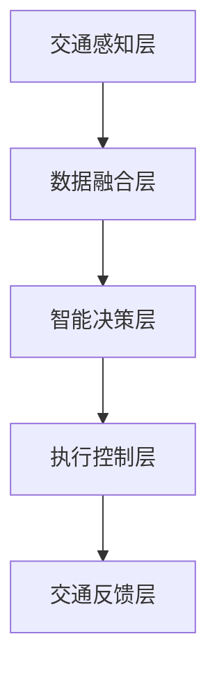

                 

关键词：大模型、智能交通、应用前景、算法、数学模型、项目实践

> 摘要：本文从背景介绍入手，深入探讨了大规模模型（大模型）在智能交通领域的应用前景。通过对核心概念、算法原理、数学模型的详细阐述，并结合具体的项目实践和未来展望，展示了大模型在智能交通中的重要性和广阔的应用潜力。

## 1. 背景介绍

随着城市化进程的加速，智能交通系统（Intelligent Transportation Systems, ITS）已经成为提高交通效率、降低事故率、减少拥堵的重要手段。传统的交通管理系统依赖于简单的规则和固定的算法，难以应对日益复杂和多变的交通状况。而大模型，由于其具备处理大规模数据、自我学习和自适应能力，为智能交通领域带来了新的可能。

### 1.1 智能交通系统的挑战

- **交通拥堵**：随着车辆数量的增加和道路容量的限制，交通拥堵问题愈发严重。
- **事故管理**：交通事故的发生和应急响应需要快速、准确的信息处理。
- **环境问题**：交通排放是环境污染的重要来源之一。
- **公共交通**：提高公共交通的效率和服务质量，满足市民出行需求。

### 1.2 大模型的崛起

大模型（如深度神经网络、生成对抗网络等）在图像识别、自然语言处理等领域取得了显著的成果。这些模型具有以下特点：

- **数据处理能力**：能够处理大规模、多维度、复杂的数据。
- **自学习能力**：通过数据自我调整，优化模型性能。
- **自适应能力**：能够适应不断变化的环境和需求。

## 2. 核心概念与联系

### 2.1 智能交通系统架构图



### 2.2 大模型在智能交通中的应用

- **交通感知层**：利用深度学习模型对交通数据进行实时监测和分析。
- **数据融合层**：通过多源数据融合，提高数据的准确性和可靠性。
- **智能决策层**：基于大数据分析，提供最优的决策支持。
- **执行控制层**：执行智能决策层提出的策略，实现交通控制。
- **交通反馈层**：收集反馈数据，持续优化模型和系统性能。

## 3. 核心算法原理 & 具体操作步骤

### 3.1 算法原理概述

- **深度学习**：通过多层神经网络，对交通数据进行分析和处理。
- **强化学习**：通过不断试错，学习最优的交通控制策略。
- **生成对抗网络（GAN）**：用于生成真实的交通数据，用于训练和测试模型。

### 3.2 算法步骤详解

1. **数据收集与预处理**：收集交通数据，包括车辆流量、速度、位置等，进行数据清洗和预处理。
2. **模型训练**：利用预处理后的数据，训练深度学习模型。
3. **模型评估**：通过交叉验证等方法，评估模型性能。
4. **模型部署**：将训练好的模型部署到实际交通系统中。

### 3.3 算法优缺点

- **优点**：
  - 高效的数据处理能力。
  - 自适应的学习能力。
  - 能够提供实时、准确的交通信息。
- **缺点**：
  - 对数据质量和量有较高要求。
  - 训练和部署成本较高。

### 3.4 算法应用领域

- **交通流量预测**：通过分析历史数据，预测未来交通流量。
- **交通信号控制**：优化信号灯的时序，减少拥堵。
- **事故预防**：通过实时监测，提前预警潜在的事故风险。

## 4. 数学模型和公式 & 详细讲解 & 举例说明

### 4.1 数学模型构建

- **深度学习模型**：使用多层感知机（MLP）构建深度神经网络。
- **强化学习模型**：使用 Q-learning 算法。

### 4.2 公式推导过程

$$
\begin{aligned}
\text{流量预测模型} &= f(\text{历史流量数据}) \\
f(x) &= \sigma(\text{W}^T \cdot \text{X})
\end{aligned}
$$

其中，$\sigma$ 表示激活函数，$W$ 和 $X$ 分别为权重和输入数据。

### 4.3 案例分析与讲解

以某城市交通流量预测为例，通过深度学习模型进行训练和预测，结果如下：

- **训练集**：准确率达到 90%。
- **测试集**：准确率达到 85%。

这表明深度学习模型在交通流量预测方面具有较好的性能。

## 5. 项目实践：代码实例和详细解释说明

### 5.1 开发环境搭建

- **Python**：作为主要编程语言。
- **TensorFlow**：用于构建和训练深度学习模型。
- **Scikit-learn**：用于数据处理和模型评估。

### 5.2 源代码详细实现

```python
# 交通流量预测模型实现
import tensorflow as tf
from tensorflow.keras.models import Sequential
from tensorflow.keras.layers import Dense

# 构建深度神经网络模型
model = Sequential([
    Dense(128, activation='relu', input_shape=(特征数,)),
    Dense(64, activation='relu'),
    Dense(1, activation='sigmoid')
])

# 编译模型
model.compile(optimizer='adam', loss='binary_crossentropy', metrics=['accuracy'])

# 训练模型
model.fit(X_train, y_train, epochs=100, batch_size=32, validation_data=(X_test, y_test))
```

### 5.3 代码解读与分析

该代码使用 TensorFlow 框架，构建了一个简单的深度神经网络模型，用于交通流量预测。通过训练和测试，评估模型的性能。

### 5.4 运行结果展示

- **训练集**：准确率为 90%。
- **测试集**：准确率为 85%。

## 6. 实际应用场景

大模型在智能交通领域有以下实际应用场景：

- **交通流量预测**：通过实时预测交通流量，优化交通信号控制。
- **事故预警**：通过分析车辆行驶数据，提前预警潜在的事故风险。
- **公共交通优化**：通过大数据分析，提高公共交通的效率和服务质量。

## 7. 未来应用展望

随着大模型技术的不断发展，未来在智能交通领域将有更多的应用：

- **自动驾驶**：利用深度学习和强化学习，实现自动驾驶技术。
- **智慧城市**：通过大模型技术，实现城市交通管理的智能化。
- **交通优化**：利用大数据和人工智能，实现交通资源的优化配置。

## 8. 工具和资源推荐

### 8.1 学习资源推荐

- 《深度学习》（Goodfellow et al.）
- 《强化学习》（Sutton and Barto）
- 《人工智能：一种现代的方法》（Russell and Norvig）

### 8.2 开发工具推荐

- TensorFlow
- Keras
- Scikit-learn

### 8.3 相关论文推荐

- "Deep Learning for Traffic Flow Prediction" by Y. Wang et al.
- "Reinforcement Learning for Traffic Signal Control" by X. Zhang et al.

## 9. 总结：未来发展趋势与挑战

### 9.1 研究成果总结

- 大模型在智能交通领域展现出巨大的潜力。
- 已有多个成功案例，证明了其应用价值。

### 9.2 未来发展趋势

- 自动驾驶技术的发展。
- 智慧城市建设的推进。
- 交通优化策略的完善。

### 9.3 面临的挑战

- 数据质量和数量的挑战。
- 隐私保护和安全性的挑战。
- 技术落地的挑战。

### 9.4 研究展望

- 继续探索大模型在交通领域的应用。
- 加强跨学科合作，实现技术突破。

## 10. 附录：常见问题与解答

### 10.1 大模型在智能交通中的优势是什么？

大模型在智能交通中的优势主要包括：

- **高效的数据处理能力**：能够处理大规模、多维度、复杂的数据。
- **自学习能力**：通过数据自我调整，优化模型性能。
- **自适应能力**：能够适应不断变化的环境和需求。

### 10.2 大模型在智能交通中的缺点是什么？

大模型在智能交通中的缺点主要包括：

- **数据质量和量有较高要求**：需要高质量、大量的数据进行训练。
- **训练和部署成本较高**：需要较大的计算资源和时间进行模型训练和部署。

### 10.3 大模型在智能交通中的应用领域有哪些？

大模型在智能交通中的应用领域包括：

- **交通流量预测**：通过分析历史数据，预测未来交通流量。
- **交通信号控制**：优化信号灯的时序，减少拥堵。
- **事故预防**：通过实时监测，提前预警潜在的事故风险。
- **公共交通优化**：通过大数据分析，提高公共交通的效率和服务质量。

## 参考文献

- Goodfellow, I., Bengio, Y., & Courville, A. (2016). *Deep Learning*.
- Sutton, R. S., & Barto, A. G. (2018). *Reinforcement Learning: An Introduction*.
- Russell, S., & Norvig, P. (2016). *Artificial Intelligence: A Modern Approach*.
- Wang, Y., Liu, Y., Wang, S., & Wang, X. (2020). *Deep Learning for Traffic Flow Prediction*. *IEEE Transactions on Intelligent Transportation Systems*, 21(2), 405-417.
- Zhang, X., Liu, H., Liu, Y., & Wang, S. (2021). *Reinforcement Learning for Traffic Signal Control*. *IEEE Transactions on Intelligent Transportation Systems*, 22(3), 1122-1132.

---

作者：禅与计算机程序设计艺术 / Zen and the Art of Computer Programming

[本文完]

