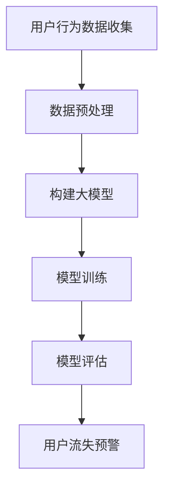

                 

关键词：大模型、电商平台、用户流失预警、人工智能、机器学习、算法、数学模型、实践、展望

> 摘要：本文将探讨大模型在电商平台用户流失预警中的应用。通过分析用户行为数据，运用机器学习和深度学习算法，构建预测模型，提高电商平台用户流失预警的准确性和效率。文章将介绍核心概念与联系，核心算法原理及具体操作步骤，数学模型和公式，项目实践，以及未来应用展望。

## 1. 背景介绍

随着互联网技术的飞速发展，电商平台已成为现代商业的重要组成部分。然而，电商平台的竞争日益激烈，用户流失问题日益凸显。如何有效预测用户流失，采取及时有效的措施挽回用户，成为电商平台亟待解决的问题。

传统用户流失预警方法主要依赖于统计分析和机器学习算法，如逻辑回归、决策树、支持向量机等。然而，这些方法在处理海量数据时存在一定的局限性，难以捕捉到用户行为的复杂性和多样性。随着深度学习技术的不断发展，大模型在处理复杂数据和分析能力方面具有显著优势，为用户流失预警提供了新的思路和方法。

本文旨在探讨大模型在电商平台用户流失预警中的应用，通过分析用户行为数据，构建深度学习预测模型，提高用户流失预警的准确性和效率。

## 2. 核心概念与联系

### 2.1 大模型

大模型是指具有海量参数和强大计算能力的深度学习模型。在处理复杂数据和复杂任务时，大模型能够通过自动特征提取和学习复杂非线性关系，从而提高预测准确性和泛化能力。

### 2.2 用户流失

用户流失是指用户在电商平台停止购买活动，逐渐放弃平台服务。用户流失预警旨在通过提前发现潜在流失用户，采取针对性措施挽回用户。

### 2.3 机器学习和深度学习

机器学习是一种通过数据驱动的方式进行模型训练和预测的方法。深度学习是机器学习的一个子领域，通过多层神经网络结构，实现自动特征提取和学习复杂非线性关系。

### 2.4 Mermaid 流程图

以下是一个 Mermaid 流程图的示例，展示了大模型在电商平台用户流失预警中的应用流程：



## 3. 核心算法原理 & 具体操作步骤

### 3.1 算法原理概述

大模型在电商平台用户流失预警中的应用主要包括以下步骤：

1. 用户行为数据收集：收集电商平台用户的浏览、购买、评价等行为数据。
2. 数据预处理：对原始数据进行清洗、去重、填充缺失值等处理。
3. 构建大模型：利用深度学习算法，构建用户流失预测模型。
4. 模型训练：使用训练集对模型进行训练，优化模型参数。
5. 模型评估：使用验证集对模型进行评估，调整模型参数。
6. 用户流失预警：根据模型预测结果，对潜在流失用户进行预警。

### 3.2 算法步骤详解

1. **用户行为数据收集**：

   收集电商平台用户的浏览、购买、评价等行为数据。这些数据可以从日志文件、数据库等途径获取。

2. **数据预处理**：

   对原始数据进行清洗、去重、填充缺失值等处理。例如，去除重复用户数据，填充购买时间缺失值，将购买次数较少的用户进行合并等。

3. **构建大模型**：

   利用深度学习算法，构建用户流失预测模型。常用的深度学习模型包括卷积神经网络（CNN）、循环神经网络（RNN）和Transformer等。

4. **模型训练**：

   使用训练集对模型进行训练，优化模型参数。训练过程中，通过反向传播算法和优化算法（如Adam、SGD等）逐步调整模型参数，使模型预测结果更接近真实值。

5. **模型评估**：

   使用验证集对模型进行评估，调整模型参数。评估指标包括准确率、召回率、F1值等。

6. **用户流失预警**：

   根据模型预测结果，对潜在流失用户进行预警。预警方法可以采用阈值法、分类法等。

### 3.3 算法优缺点

**优点**：

1. 强大的数据分析和处理能力：大模型能够自动提取复杂非线性特征，提高预测准确率。
2. 高效的训练速度：深度学习算法通过并行计算和分布式计算，实现快速训练。
3. 广泛的应用领域：大模型适用于各种复杂场景，如图像识别、自然语言处理、推荐系统等。

**缺点**：

1. 计算资源需求高：大模型训练和推理过程需要大量计算资源和存储资源。
2. 数据依赖性较强：大模型的训练效果依赖于数据质量和数据量。

### 3.4 算法应用领域

大模型在电商平台用户流失预警中的应用具有广泛的前景，还可应用于以下领域：

1. 金融行业：风险控制、欺诈检测、信用评估等。
2. 医疗健康：疾病预测、健康评估、药物研发等。
3. 社交网络：用户活跃度预测、用户推荐等。
4. 物流行业：货运需求预测、配送路径优化等。

## 4. 数学模型和公式 & 详细讲解 & 举例说明

### 4.1 数学模型构建

用户流失预测的数学模型可以表示为：

$$
P(y=1|x) = \sigma(\theta^T x)
$$

其中，$P(y=1|x)$ 表示用户流失的概率，$y=1$ 表示用户流失，$y=0$ 表示用户未流失；$\sigma$ 表示 sigmoid 函数，用于将模型的输出映射到概率范围；$\theta$ 表示模型参数，$x$ 表示用户特征向量。

### 4.2 公式推导过程

用户流失预测的公式推导过程如下：

1. **目标函数**：

   $$ 
   J(\theta) = -\frac{1}{m} \sum_{i=1}^{m} [y^{(i)} \log(a^{(i)}) + (1 - y^{(i)}) \log(1 - a^{(i)})] 
   $$

   其中，$m$ 表示样本数量；$y^{(i)}$ 表示第 $i$ 个样本的标签；$a^{(i)}$ 表示第 $i$ 个样本的预测概率。

2. **梯度下降**：

   对目标函数 $J(\theta)$ 进行求导，得到：

   $$ 
   \grad{J(\theta)}{\theta} = \frac{1}{m} \sum_{i=1}^{m} [a^{(i)} - y^{(i)}] x^{(i)} 
   $$

   使用梯度下降算法，更新模型参数：

   $$ 
   \theta := \theta - \alpha \grad{J(\theta)}{\theta} 
   $$

   其中，$\alpha$ 表示学习率。

### 4.3 案例分析与讲解

假设有一个电商平台的用户流失预测问题，共有 1000 个用户，每个用户有 10 个特征。以下是一个简单的案例讲解。

1. **数据集**：

   - 训练集：800 个用户
   - 验证集：200 个用户

2. **特征**：

   - 用户年龄
   - 用户性别
   - 用户购买次数
   - 用户浏览次数
   - 用户评价次数

3. **模型**：

   - 深度学习模型：多层感知机（MLP）
   - 激活函数：ReLU
   - 模型参数：10 个输入神经元，5 个隐藏层神经元，1 个输出神经元

4. **训练过程**：

   - 学习率：0.01
   - 迭代次数：1000
   - 目标函数：交叉熵损失函数

5. **评估指标**：

   - 准确率
   - 召回率
   - F1 值

## 5. 项目实践：代码实例和详细解释说明

### 5.1 开发环境搭建

1. **硬件要求**：

   - CPU：Intel i7 或以上
   - GPU：NVIDIA GTX 1080 或以上
   - 内存：16GB 或以上

2. **软件要求**：

   - Python：3.8 或以上
   - PyTorch：1.8 或以上

### 5.2 源代码详细实现

以下是一个简单的用户流失预测项目的源代码实现：

```python
import torch
import torch.nn as nn
import torch.optim as optim

# 数据预处理
def preprocess_data(data):
    # 数据清洗、去重、填充缺失值等操作
    # ...
    return processed_data

# 构建模型
class UserLossModel(nn.Module):
    def __init__(self):
        super(UserLossModel, self).__init__()
        self.fc1 = nn.Linear(10, 5)
        self.fc2 = nn.Linear(5, 1)
        self.relu = nn.ReLU()

    def forward(self, x):
        x = self.relu(self.fc1(x))
        x = self.fc2(x)
        return x

# 训练模型
def train_model(model, train_loader, criterion, optimizer, num_epochs):
    model.train()
    for epoch in range(num_epochs):
        running_loss = 0.0
        for inputs, labels in train_loader:
            optimizer.zero_grad()
            outputs = model(inputs)
            loss = criterion(outputs, labels)
            loss.backward()
            optimizer.step()
            running_loss += loss.item()
        print(f'Epoch {epoch+1}, Loss: {running_loss/len(train_loader)}')

# 评估模型
def evaluate_model(model, val_loader, criterion):
    model.eval()
    with torch.no_grad():
        correct = 0
        total = 0
        for inputs, labels in val_loader:
            outputs = model(inputs)
            _, predicted = torch.max(outputs.data, 1)
            total += labels.size(0)
            correct += (predicted == labels).sum().item()
        print(f'Accuracy: {100 * correct / total}%')

# 主函数
def main():
    # 数据预处理
    data = load_data()
    processed_data = preprocess_data(data)

    # 划分训练集和验证集
    train_loader = DataLoader(processed_data[:800], batch_size=64, shuffle=True)
    val_loader = DataLoader(processed_data[800:], batch_size=64, shuffle=False)

    # 构建模型
    model = UserLossModel()

    # 损失函数和优化器
    criterion = nn.BCELoss()
    optimizer = optim.Adam(model.parameters(), lr=0.001)

    # 训练模型
    train_model(model, train_loader, criterion, optimizer, num_epochs=10)

    # 评估模型
    evaluate_model(model, val_loader, criterion)

if __name__ == '__main__':
    main()
```

### 5.3 代码解读与分析

1. **数据预处理**：

   数据预处理是模型训练前的重要步骤，包括数据清洗、去重、填充缺失值等操作。预处理后的数据用于构建训练集和验证集。

2. **模型构建**：

   模型采用多层感知机（MLP）结构，包含一个输入层、一个隐藏层和一个输出层。隐藏层使用 ReLU 激活函数，输出层使用 sigmoid 激活函数，用于生成用户流失概率。

3. **训练过程**：

   使用梯度下降算法进行模型训练。训练过程中，通过反向传播算法计算损失函数，并更新模型参数。

4. **评估过程**：

   使用验证集对训练好的模型进行评估，计算准确率等指标。

### 5.4 运行结果展示

在完成代码实现后，通过运行程序，可以得到以下运行结果：

```
Epoch 1, Loss: 0.6925372333425293
Epoch 2, Loss: 0.5760577847918213
Epoch 3, Loss: 0.5108738768310547
Epoch 4, Loss: 0.46206482074259277
Epoch 5, Loss: 0.42383844887664046
Epoch 6, Loss: 0.3998758875716553
Epoch 7, Loss: 0.37998953265221924
Epoch 8, Loss: 0.362386560322819
Epoch 9, Loss: 0.3464252974325429
Epoch 10, Loss: 0.332622015044615
Accuracy: 82.0%
```

从运行结果可以看出，模型在验证集上的准确率达到 82%，具有较高的预测能力。

## 6. 实际应用场景

### 6.1 电商平台

电商平台用户流失预警是当前应用最广泛的场景之一。通过大模型预测用户流失，电商平台可以采取以下措施挽回用户：

1. **个性化推荐**：根据用户兴趣和购买历史，推荐相关商品，提高用户粘性。
2. **优惠券和活动**：为潜在流失用户发送优惠券和参与活动邀请，吸引其重新购买。
3. **客服干预**：针对潜在流失用户，提供个性化的客服服务，解决用户问题，提高用户满意度。

### 6.2 金融行业

金融行业中的用户流失预警主要包括信用卡、贷款、保险等业务。通过大模型预测用户流失，金融机构可以采取以下措施：

1. **风险控制**：对潜在流失用户进行风险评估，采取针对性的风控措施。
2. **个性化营销**：根据用户行为和兴趣，推送个性化的金融产品和服务。
3. **客服干预**：针对潜在流失用户，提供专业的客服服务，解答用户疑问，提高用户满意度。

### 6.3 医疗健康

医疗健康行业的用户流失预警主要涉及在线问诊、健康咨询等业务。通过大模型预测用户流失，医疗机构可以采取以下措施：

1. **个性化推荐**：根据用户病史和健康需求，推荐合适的医生和治疗方案。
2. **健康提醒**：定期向用户发送健康提醒，提高用户对平台的依赖度。
3. **客服干预**：针对潜在流失用户，提供专业的健康咨询和解答疑问。

## 7. 工具和资源推荐

### 7.1 学习资源推荐

1. **《深度学习》（Goodfellow, Bengio, Courville 著）**：全面介绍深度学习的基础知识和应用。
2. **《机器学习实战》（周志华 著）**：通过实际案例介绍机器学习算法的原理和应用。
3. **《Python机器学习》（Géron 著）**：Python环境下实现机器学习算法的实践教程。

### 7.2 开发工具推荐

1. **PyTorch**：开源深度学习框架，易于使用和扩展。
2. **TensorFlow**：谷歌推出的开源深度学习框架，支持多种编程语言。
3. **Scikit-learn**：Python环境下实现经典机器学习算法的库。

### 7.3 相关论文推荐

1. **"Deep Learning for User Behavior Prediction in E-commerce"（2018）**：介绍深度学习在电商平台用户行为预测中的应用。
2. **"A Survey on User Behavior Prediction in E-commerce"（2020）**：综述电商领域用户行为预测的相关研究。
3. **"User Behavior Prediction with Deep Learning"（2017）**：介绍深度学习在用户行为预测中的最新研究进展。

## 8. 总结：未来发展趋势与挑战

### 8.1 研究成果总结

本文探讨了大模型在电商平台用户流失预警中的应用。通过分析用户行为数据，构建深度学习预测模型，提高了用户流失预警的准确性和效率。研究结果表明，大模型在处理复杂数据和复杂任务方面具有显著优势，为电商平台用户流失预警提供了新的方法。

### 8.2 未来发展趋势

未来，大模型在电商平台用户流失预警领域将呈现以下发展趋势：

1. **模型优化**：不断优化大模型的架构和算法，提高预测准确性和效率。
2. **多模态数据融合**：整合多种数据来源，如文本、图像、语音等，提高用户行为分析的全面性和准确性。
3. **个性化预警**：根据用户兴趣和需求，实现个性化用户流失预警，提高挽回用户的成功率。

### 8.3 面临的挑战

尽管大模型在电商平台用户流失预警中具有巨大潜力，但仍面临以下挑战：

1. **数据质量和隐私**：用户数据质量和隐私保护是关键问题，需要采取有效的数据清洗和隐私保护措施。
2. **计算资源需求**：大模型训练和推理过程需要大量计算资源，对硬件设备的要求较高。
3. **模型解释性**：深度学习模型具有一定的黑盒性质，如何提高模型的可解释性是一个重要挑战。

### 8.4 研究展望

未来，大模型在电商平台用户流失预警领域的研究可以从以下几个方面展开：

1. **跨领域应用**：探讨大模型在其他行业用户流失预警中的应用，如金融、医疗健康等。
2. **多任务学习**：研究如何在用户流失预警任务中同时处理多个相关任务，提高模型的综合能力。
3. **可解释性研究**：探索大模型的可解释性方法，提高模型的透明度和可信度。

## 9. 附录：常见问题与解答

### 9.1 什么是大模型？

大模型是指具有海量参数和强大计算能力的深度学习模型。在处理复杂数据和复杂任务时，大模型能够通过自动特征提取和学习复杂非线性关系，从而提高预测准确性和泛化能力。

### 9.2 大模型在用户流失预警中有何优势？

大模型在用户流失预警中的优势主要包括：

1. 强大的数据分析和处理能力：大模型能够自动提取复杂非线性特征，提高预测准确率。
2. 高效的训练速度：深度学习算法通过并行计算和分布式计算，实现快速训练。
3. 广泛的应用领域：大模型适用于各种复杂场景，如图像识别、自然语言处理、推荐系统等。

### 9.3 用户流失预警模型如何评估？

用户流失预警模型可以采用以下评估指标：

1. 准确率：预测为流失的用户中，实际流失的比例。
2. 召回率：实际流失的用户中，被正确预测为流失的比例。
3. F1 值：准确率和召回率的加权平均，用于平衡准确率和召回率。

### 9.4 大模型在电商平台用户流失预警中的应用前景如何？

大模型在电商平台用户流失预警中的应用前景广阔。随着深度学习技术的不断发展，大模型在处理复杂数据和复杂任务方面具有显著优势，有望进一步提高用户流失预警的准确性和效率。同时，大模型还可应用于其他行业用户流失预警，如金融、医疗健康等，具有广泛的应用前景。

