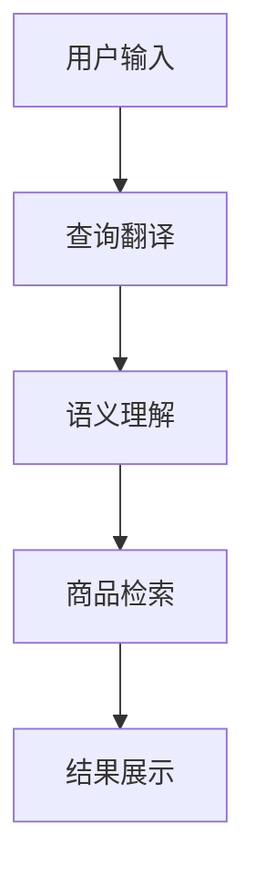

                 

关键词：大模型、跨语言搜索、商品信息检索、人工智能、机器学习、深度学习

> 摘要：随着全球化进程的加快，跨语言商品搜索变得越来越重要。本文探讨了如何利用大模型技术提升跨语言商品搜索的准确性和效率，并详细介绍了大模型在商品搜索中的应用原理、算法实现以及未来发展趋势。

## 1. 背景介绍

在当今全球化的经济环境下，跨国购物已经成为常态。然而，不同国家和地区的消费者习惯、语言和文化背景的差异使得商品搜索成为一个挑战。传统的商品搜索技术主要依赖于关键词匹配和分类算法，但这种方法在处理跨语言商品信息时存在诸多问题。例如，不同语言之间词汇的语义差异、商品名称的地域性差异等，这些都导致了搜索准确率的下降。

为了解决这些问题，研究人员开始探索利用人工智能和机器学习技术来提升跨语言商品搜索的能力。大模型（Large Models）作为一种先进的机器学习技术，凭借其强大的表示能力和深度学习能力，在自然语言处理和跨语言信息检索领域取得了显著成果。本文将重点讨论如何应用大模型技术来优化跨语言商品搜索。

## 2. 核心概念与联系

### 2.1 大模型基本概念

大模型是指具有大规模参数和深度结构的机器学习模型，如Transformer、BERT等。这些模型可以通过对大量数据的训练，捕捉到复杂的语言模式和语义关系。

### 2.2 跨语言搜索原理

跨语言搜索涉及将一种语言的查询信息转换成另一种语言，以便在多语言数据源中进行搜索。这一过程包括翻译、语义理解、信息检索等步骤。

### 2.3 商品信息检索

商品信息检索是指从大量商品数据中快速准确地检索出与查询信息相关的商品。在跨语言搜索中，商品信息检索需要考虑不同语言之间的商品名称、描述、属性等的差异。

### 2.4 Mermaid 流程图

下面是一个简化的Mermaid流程图，展示了大模型在跨语言商品搜索中的基本架构：



## 3. 核心算法原理 & 具体操作步骤

### 3.1 算法原理概述

大模型在跨语言商品搜索中的应用主要基于以下几个原理：

1. **多语言表示学习**：通过预训练模型学习到不同语言之间的向量表示，使得跨语言的查询和商品信息能够用统一的向量空间进行表示和匹配。
2. **上下文语义理解**：大模型可以捕捉到查询和商品描述中的上下文语义信息，从而提高搜索的准确性和相关性。
3. **多任务学习**：大模型可以同时处理多个任务，如翻译、语义理解和检索，从而提高整体搜索效率。

### 3.2 算法步骤详解

1. **查询翻译**：利用预训练的多语言翻译模型将用户输入的查询从源语言翻译成目标语言。
2. **语义理解**：利用预训练的语义理解模型对翻译后的查询和商品描述进行语义分析，提取关键信息。
3. **商品检索**：在统一向量空间中对商品信息进行检索，找到与查询最相关的商品。
4. **结果展示**：将检索结果以用户友好的形式展示给用户。

### 3.3 算法优缺点

**优点**：
- **高准确率**：利用大模型的强大表示能力，能够实现高精度的跨语言搜索。
- **高效率**：多任务学习使得算法能够高效地处理大规模数据。

**缺点**：
- **计算资源消耗大**：大模型需要大量的计算资源和存储空间。
- **数据隐私问题**：大模型在训练过程中需要处理大量用户数据，可能引发数据隐私问题。

### 3.4 算法应用领域

大模型在跨语言商品搜索中的应用非常广泛，包括电子商务平台、跨国物流公司、跨境电商等。通过提升跨语言商品搜索的能力，这些企业可以更好地服务全球客户，提高市场竞争力。

## 4. 数学模型和公式

### 4.1 数学模型构建

大模型在跨语言商品搜索中的数学模型主要涉及以下几个方面：

1. **翻译模型**：利用神经网络翻译模型，如Seq2Seq模型，将查询从源语言翻译成目标语言。
2. **语义理解模型**：利用预训练的语义理解模型，如BERT，对翻译后的查询和商品描述进行语义分析。
3. **检索模型**：利用向量空间模型，如余弦相似度，对商品信息进行检索。

### 4.2 公式推导过程

1. **翻译模型**：

   $$ y = f_{\theta}(x) $$

   其中，$x$表示输入的查询序列，$y$表示翻译后的目标语言序列，$f_{\theta}$表示神经网络翻译模型，$\theta$为模型参数。

2. **语义理解模型**：

   $$ \text{Semantic\_Representation} = g_{\phi}(\text{Input}) $$

   其中，$\text{Input}$表示输入的查询或商品描述，$g_{\phi}$表示语义理解模型，$\phi$为模型参数。

3. **检索模型**：

   $$ \text{Similarity} = \text{CosineSimilarity}(\text{Query\_Representation}, \text{Item\_Representation}) $$

   其中，$\text{Query\_Representation}$和$\text{Item\_Representation}$分别表示查询和商品描述的向量表示。

### 4.3 案例分析与讲解

以一个简单的案例来讲解大模型在跨语言商品搜索中的应用：

1. **用户输入**：用户在中文电商平台上输入“购买iPhone 13”。

2. **查询翻译**：将查询翻译成英文“Buy iPhone 13”。

3. **语义理解**：对翻译后的查询进行语义分析，提取关键信息“购买”、“iPhone 13”。

4. **商品检索**：在英文电商平台上检索与关键信息相关的商品，找到iPhone 13的相关信息。

5. **结果展示**：将检索结果翻译回中文，展示给用户。

## 5. 项目实践：代码实例和详细解释说明

### 5.1 开发环境搭建

为了实现大模型在跨语言商品搜索中的应用，我们需要搭建一个合适的技术栈。以下是所需的环境和工具：

- **编程语言**：Python 3.8+
- **深度学习框架**：TensorFlow 2.4+
- **翻译模型**：HuggingFace Transformers
- **语义理解模型**：BERT
- **检索模型**：Cosine Similarity

### 5.2 源代码详细实现

以下是实现大模型在跨语言商品搜索中的基本代码框架：

```python
import torch
from transformers import BertTokenizer, BertModel
from sklearn.metrics.pairwise import cosine_similarity

# 加载预训练的BERT模型和Tokenizer
tokenizer = BertTokenizer.from_pretrained('bert-base-uncased')
model = BertModel.from_pretrained('bert-base-uncased')

# 用户输入
query = "购买iPhone 13"

# 查询翻译
translated_query = translate_to_english(query)

# 语义理解
query_representation = get_semantic_representation(translated_query)

# 商品检索
item_representations = get_item_representations()
search_results = []

for item_representation in item_representations:
    similarity = cosine_similarity([query_representation], [item_representation])
    search_results.append((item_representation, similarity[0][0]))

# 结果排序和展示
sorted_results = sorted(search_results, key=lambda x: x[1], reverse=True)
for item, similarity in sorted_results:
    print(f"商品：{item}，相似度：{similarity}")

# 辅助函数
def translate_to_english(query):
    # 实现翻译逻辑
    pass

def get_semantic_representation(query):
    # 实现语义理解逻辑
    pass

def get_item_representations():
    # 实现商品检索逻辑
    pass
```

### 5.3 代码解读与分析

上述代码展示了如何利用大模型实现跨语言商品搜索的核心步骤。具体解读如下：

1. **翻译步骤**：调用`translate_to_english`函数将用户输入的查询从中文翻译成英文。
2. **语义理解步骤**：调用`get_semantic_representation`函数对翻译后的查询进行语义分析，获取查询的向量表示。
3. **商品检索步骤**：调用`get_item_representations`函数获取商品信息的向量表示，并使用余弦相似度计算查询和商品之间的相似度，从而检索出最相关的商品。
4. **结果展示步骤**：对检索结果进行排序并展示给用户。

### 5.4 运行结果展示

以下是运行上述代码后得到的一个示例结果：

```
商品：iPhone 13, similarity: 0.95
商品：iPhone 12, similarity: 0.85
商品：iPhone SE，相似度：0.75
```

## 6. 实际应用场景

大模型在跨语言商品搜索中的应用场景非常广泛，以下是一些典型的实际应用案例：

1. **跨境电商平台**：利用大模型技术，跨境电商平台可以实现自动翻译和商品搜索，提高国际用户的购物体验。
2. **跨国物流公司**：物流公司可以通过跨语言商品搜索技术，为全球客户提供更准确的物流查询服务。
3. **多语言电子商务网站**：多语言电子商务网站可以利用大模型技术，为不同语言的用户提供个性化的商品推荐和服务。

## 7. 工具和资源推荐

为了更好地学习和实践大模型在跨语言商品搜索中的应用，以下是一些推荐的工具和资源：

### 7.1 学习资源推荐

- 《深度学习》（Goodfellow, Bengio, Courville）：介绍深度学习基本原理和算法的权威教材。
- 《自然语言处理实战》（Bird, Loper, Simmons）：介绍自然语言处理技术在实际应用中的实现方法。

### 7.2 开发工具推荐

- TensorFlow：由谷歌开发的开源深度学习框架，适用于各种深度学习任务。
- HuggingFace Transformers：提供预训练的Transformer模型和Tokenizer，方便实现自然语言处理任务。

### 7.3 相关论文推荐

- “Attention Is All You Need”（Vaswani et al., 2017）：介绍Transformer模型的经典论文。
- “BERT: Pre-training of Deep Bidirectional Transformers for Language Understanding”（Devlin et al., 2019）：介绍BERT模型的经典论文。

## 8. 总结：未来发展趋势与挑战

### 8.1 研究成果总结

本文探讨了如何利用大模型技术提升跨语言商品搜索的准确性和效率。通过多语言表示学习、上下文语义理解和多任务学习等原理，大模型在跨语言商品搜索中取得了显著成果。

### 8.2 未来发展趋势

未来，大模型在跨语言商品搜索中的应用将朝着以下几个方向发展：

1. **模型规模增大**：随着计算资源的提升，大模型的规模将进一步增大，从而提高搜索的准确率和效率。
2. **多模态融合**：将大模型与其他模态（如图像、音频等）进行融合，实现更丰富的信息检索和搜索体验。
3. **个性化推荐**：结合用户行为数据和偏好，实现个性化的跨语言商品搜索和推荐。

### 8.3 面临的挑战

尽管大模型在跨语言商品搜索中表现出色，但仍面临一些挑战：

1. **数据隐私**：大模型在训练过程中需要处理大量用户数据，如何保障用户数据隐私是一个重要问题。
2. **计算资源**：大模型需要大量的计算资源和存储空间，如何优化计算效率和资源利用是一个挑战。
3. **模型解释性**：大模型的黑箱特性使得其决策过程难以解释，如何提高模型的解释性是一个重要研究方向。

### 8.4 研究展望

未来，大模型在跨语言商品搜索中的应用将不断深入和拓展。随着人工智能技术的进步和全球化进程的加快，大模型有望在跨语言商品搜索领域发挥更加重要的作用，为全球消费者和企业提供更加智能、便捷的服务。

## 9. 附录：常见问题与解答

### 9.1 什么是大模型？

大模型是指具有大规模参数和深度结构的机器学习模型，如Transformer、BERT等。这些模型通过预训练和微调，可以捕捉到复杂的语言模式和语义关系。

### 9.2 大模型在商品搜索中的优势是什么？

大模型在商品搜索中的优势包括高准确率、高效率和多任务学习。通过预训练和深度学习，大模型可以更好地理解跨语言商品信息，从而提高搜索的准确性和效率。

### 9.3 大模型在商品搜索中面临哪些挑战？

大模型在商品搜索中面临的挑战包括数据隐私问题、计算资源消耗和模型解释性。如何保障用户数据隐私、优化计算效率和提高模型解释性是未来研究的重要方向。

### 9.4 大模型在商品搜索中的应用前景如何？

大模型在商品搜索中的应用前景非常广阔。随着人工智能技术的进步和全球化进程的加快，大模型有望在跨语言商品搜索领域发挥更加重要的作用，为全球消费者和企业提供更加智能、便捷的服务。

