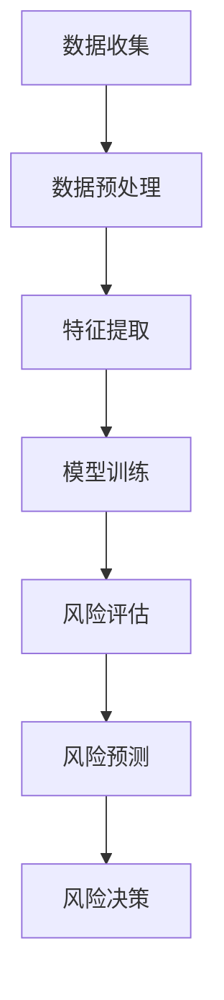

                 

在当今快速发展的金融科技领域，大数据和人工智能技术已经成为推动行业创新和风险管理的核心力量。随着金融市场的复杂性不断增加，传统的风险控制方法已无法满足日益严格的需求。本文将探讨大模型在金融风控中的潜在应用，旨在为行业从业者提供有价值的见解和实践指导。

## 关键词：大模型，金融风控，人工智能，风险管理，应用探索

> 摘要：本文首先介绍了大模型在金融领域的重要性，随后详细分析了大模型在金融风控中的应用原理、算法、数学模型以及实际案例。通过这些分析，本文为读者展示了大模型在金融风控领域的广泛应用前景，并提出了未来发展的潜在挑战与解决方案。

## 1. 背景介绍

金融风控是指金融机构在业务运营过程中，通过风险识别、评估、监控和应对等一系列措施，以降低潜在风险，保障金融机构稳定运行和资产安全。随着全球金融市场的不断发展，金融风险日益复杂多样，包括市场风险、信用风险、操作风险、流动性风险等。传统的金融风控方法往往依赖于经验和规则，其局限性在复杂多变的市场环境中愈发明显。

近年来，人工智能技术的快速发展，尤其是深度学习等大模型的崛起，为金融风控带来了新的机遇。大模型具有强大的数据处理和分析能力，能够在海量数据中挖掘潜在的风险因素，实现更加精准的风险预测和决策。因此，将大模型应用于金融风控，已成为金融科技领域的重要研究方向。

### 1.1 人工智能与深度学习

人工智能（AI）是计算机科学的一个分支，旨在使机器具备类似人类的智能能力。深度学习是人工智能的一种重要方法，通过构建多层神经网络模型，自动学习数据中的特征和规律。深度学习的核心在于“深度”，即网络的层数较多，能够处理更复杂的任务。

随着计算能力的提升和数据量的爆炸性增长，深度学习模型，特别是大模型，如GPT-3、BERT等，取得了显著的研究成果和应用突破。这些模型具有处理大规模数据、理解复杂关系和生成高质量内容的能力，为金融风控提供了有力的技术支持。

### 1.2 金融风控的重要性

金融风控不仅关系到金融机构的生存和发展，也直接影响到整个金融市场的稳定。有效的风控措施可以减少金融机构的损失，防止金融危机的发生，保障投资者的权益。然而，随着金融市场全球化、金融产品复杂化，传统风控手段的局限性愈发明显。

大模型在金融风控中的应用，为解决传统方法面临的挑战提供了新的思路。通过机器学习技术，特别是大模型，可以实现对海量数据的全面分析和理解，挖掘出潜在的风险因素，提高风控的准确性和实时性。因此，深入研究大模型在金融风控中的应用，对于推动金融科技的发展具有重要意义。

### 1.3 文章结构

本文将按照以下结构进行探讨：

1. 背景介绍：概述金融风控的重要性以及人工智能和深度学习的发展背景。
2. 核心概念与联系：介绍大模型的基本原理及其在金融风控中的应用。
3. 核心算法原理 & 具体操作步骤：详细讲解大模型在金融风控中的算法原理和操作步骤。
4. 数学模型和公式 & 详细讲解 & 举例说明：阐述大模型在金融风控中的数学模型和公式推导。
5. 项目实践：通过具体项目案例展示大模型在金融风控中的应用效果。
6. 实际应用场景：分析大模型在金融风控中的实际应用场景和未来前景。
7. 工具和资源推荐：推荐学习资源和开发工具，帮助读者深入了解大模型在金融风控中的应用。
8. 总结：总结研究成果，探讨未来发展趋势和挑战。

通过本文的探讨，我们希望为读者提供全面、深入的了解大模型在金融风控中的应用，为行业创新和风险管理提供有力支持。

### 2. 核心概念与联系

在探讨大模型在金融风控中的应用之前，首先需要了解大模型的基本原理及其与金融风控的紧密联系。

#### 2.1 大模型的基本原理

大模型，通常指具有数百万到数十亿参数的深度学习模型，如GPT-3、BERT等。这些模型通过大规模数据训练，能够自动学习数据的复杂特征和内在规律。大模型的核心在于其“深度”，即多层神经网络结构，以及“广度”，即大规模的数据集和计算资源。

大模型的工作原理可以概括为以下几个步骤：

1. **数据输入**：大模型接收大规模的文本、图像、声音或其他类型的数据。
2. **特征提取**：模型通过多层神经网络，提取数据中的高级特征。
3. **模型训练**：模型利用已提取的特征进行训练，不断优化参数，提高模型的预测能力。
4. **模型预测**：训练完成后，模型可以对新的数据进行预测，如文本分类、图像识别、风险预测等。

#### 2.2 大模型在金融风控中的应用

大模型在金融风控中的应用主要体现在以下几个方面：

1. **数据预处理**：金融风控领域的数据通常复杂且多样化，大模型能够有效处理这些数据，进行特征提取和降维，为后续分析提供基础。
2. **风险识别**：大模型可以通过学习历史数据，识别出潜在的风险因素，如信用风险、市场风险等。
3. **风险评估**：大模型可以实时评估风险，提供风险评分和预测，帮助金融机构做出更明智的决策。
4. **风险预测**：大模型可以通过对历史数据和实时数据的分析，预测未来可能发生的风险事件，为风险管理提供前瞻性指导。

#### 2.3 大模型在金融风控中的 Mermaid 流程图

下面是一个简化的 Mermaid 流程图，展示了大模型在金融风控中的应用流程：



在这个流程中，数据收集是第一步，通过收集金融机构的历史交易数据、市场数据、客户数据等，为大模型提供训练数据。数据预处理环节则对数据进行清洗、归一化、降维等处理，以提高数据的质量和模型的训练效果。

特征提取环节通过多层神经网络，从原始数据中提取出有用的特征信息。模型训练环节利用提取出的特征，通过反向传播算法，不断优化模型参数，提高模型性能。风险评估和风险预测环节则利用训练好的模型，对新的数据进行风险分析和预测。

最后，风险决策环节根据风险评估和风险预测的结果，制定相应的风险管理策略，如调整投资组合、增加信用额度、调整风险敞口等。

通过这个流程，大模型能够实现金融风控的各个环节，提高风险管理的效率和准确性。

### 3. 核心算法原理 & 具体操作步骤

在了解了大模型的基本原理和在金融风控中的应用之后，接下来我们将深入探讨大模型在金融风控中的核心算法原理和具体操作步骤。

#### 3.1 算法原理概述

大模型在金融风控中的核心算法主要包括深度学习、神经网络、机器学习等技术。其中，深度学习和神经网络是支撑大模型的基础，而机器学习则是大模型应用于金融风控的关键。

1. **深度学习**：深度学习是一种模拟人脑神经网络结构的方法，通过构建多层神经网络，自动学习数据的复杂特征和内在规律。在金融风控中，深度学习可以用于风险识别、风险评估和风险预测等任务。
   
2. **神经网络**：神经网络是深度学习的基础，由多个神经元（节点）组成，每个神经元通过权重连接其他神经元，形成一个复杂的网络结构。神经网络通过学习输入数据，调整权重，实现对数据的分类、回归等操作。

3. **机器学习**：机器学习是一种利用计算机模拟人类学习过程的方法，通过训练数据集，让计算机自动学习数据中的特征和规律，从而实现对新数据的预测和决策。在金融风控中，机器学习可以用于风险识别、风险评估和风险预测等任务。

#### 3.2 算法步骤详解

大模型在金融风控中的具体操作步骤可以分为以下几个阶段：

1. **数据收集**：收集金融机构的历史交易数据、市场数据、客户数据等，为后续的建模和分析提供数据支持。

2. **数据预处理**：对收集到的数据进行清洗、归一化、降维等处理，以提高数据的质量和模型的训练效果。

3. **特征提取**：利用深度学习和神经网络技术，从原始数据中提取出有用的特征信息。这些特征可以包括客户行为特征、市场趋势特征、交易特征等。

4. **模型训练**：利用提取出的特征，通过机器学习算法（如神经网络、决策树、支持向量机等）训练大模型。在训练过程中，模型通过不断调整参数，提高对数据的拟合度。

5. **模型评估**：利用测试数据集，对训练好的模型进行评估，确定模型的预测能力和泛化能力。

6. **风险评估**：将训练好的模型应用于新的数据，对风险进行评估和预测。风险评估可以包括信用风险评估、市场风险评估、操作风险评估等。

7. **风险决策**：根据风险评估的结果，制定相应的风险管理策略，如调整投资组合、增加信用额度、调整风险敞口等。

#### 3.3 算法优缺点

1. **优点**：

   - **强大的数据处理能力**：大模型能够处理海量、复杂的数据，提取出有用的特征信息，提高风险识别和预测的准确性。
   - **高效的预测能力**：通过机器学习算法，大模型能够快速、准确地对新数据进行预测，为风险管理提供实时支持。
   - **灵活的应用场景**：大模型可以应用于多种金融风控任务，如信用风险、市场风险、操作风险等，具有较高的通用性。

2. **缺点**：

   - **数据依赖性**：大模型的性能高度依赖训练数据的质量和数量，数据不足或质量差可能导致模型性能下降。
   - **计算资源需求**：大模型训练和预测需要大量的计算资源，对硬件设施要求较高。
   - **解释性不足**：大模型的决策过程复杂，难以解释，难以满足金融监管和合规要求。

#### 3.4 算法应用领域

大模型在金融风控中的应用领域广泛，包括但不限于：

1. **信用风险评估**：通过分析客户的信用历史、交易行为、财务状况等数据，预测客户的信用风险，为金融机构提供信用决策支持。
2. **市场风险评估**：分析市场数据，预测市场走势和风险，为金融机构提供投资决策支持。
3. **操作风险评估**：识别和预测操作风险，如欺诈风险、系统故障风险等，为金融机构提供操作风险管理支持。
4. **合规风险分析**：通过分析交易数据，识别和预测合规风险，确保金融机构的交易行为符合监管要求。

### 4. 数学模型和公式 & 详细讲解 & 举例说明

在深入探讨大模型在金融风控中的应用时，数学模型和公式是理解其工作原理的重要工具。以下将详细讲解大模型在金融风控中的数学模型和公式，并通过具体例子进行说明。

#### 4.1 数学模型构建

在金融风控中，大模型的数学模型通常基于以下几种常见的机器学习算法：

1. **线性回归模型**：用于预测连续的数值输出，如股票价格或贷款违约概率。
2. **逻辑回归模型**：用于预测二分类结果，如信用是否违约、交易是否欺诈。
3. **支持向量机（SVM）**：用于分类任务，能够将不同类别的数据分离。
4. **神经网络模型**：用于处理复杂的非线性关系，如深度学习模型。

以下是一个简单的线性回归模型公式：

\[ y = \beta_0 + \beta_1x_1 + \beta_2x_2 + ... + \beta_nx_n \]

其中，\( y \) 是预测目标，\( x_1, x_2, ..., x_n \) 是输入特征，\( \beta_0, \beta_1, \beta_2, ..., \beta_n \) 是模型的参数。

#### 4.2 公式推导过程

以线性回归模型为例，我们介绍公式的推导过程：

1. **损失函数**：线性回归模型的损失函数通常选择均方误差（MSE），表示为：

\[ J(\theta) = \frac{1}{2m} \sum_{i=1}^{m} (h_\theta(x^{(i)}) - y^{(i)})^2 \]

其中，\( h_\theta(x) \) 是线性回归模型的预测值，\( y^{(i)} \) 是实际值，\( m \) 是样本数量。

2. **梯度下降**：为了最小化损失函数，我们使用梯度下降法来更新模型参数 \( \theta \)：

\[ \theta_j := \theta_j - \alpha \frac{\partial}{\partial \theta_j} J(\theta) \]

其中，\( \alpha \) 是学习率。

通过迭代计算，我们可以逐步最小化损失函数，从而得到最优的模型参数。

#### 4.3 案例分析与讲解

以下通过一个简单的信用风险评估案例，讲解大模型在金融风控中的应用：

假设我们有一个包含以下特征的数据集：

- **年龄**（\( x_1 \)）
- **收入**（\( x_2 \)）
- **信用记录**（\( x_3 \)）
- **婚姻状况**（\( x_4 \)）

目标：预测客户是否会发生贷款违约。

我们选择逻辑回归模型进行训练，并构建以下数学模型：

\[ P(Y=1) = \frac{1}{1 + e^{-(\beta_0 + \beta_1x_1 + \beta_2x_2 + \beta_3x_3 + \beta_4x_4)}} \]

其中，\( Y \) 是贷款违约的二分类变量（0 表示未违约，1 表示违约），\( P(Y=1) \) 是违约概率。

训练数据后，我们得到一组参数 \( \beta_0, \beta_1, \beta_2, \beta_3, \beta_4 \)。

使用这个模型，我们可以对新的客户数据进行风险评估，计算其违约概率。例如，对于一个年龄30岁、收入50000元、信用记录良好的客户，我们计算其违约概率如下：

\[ P(Y=1) = \frac{1}{1 + e^{-(\beta_0 + \beta_1 \cdot 30 + \beta_2 \cdot 50000 + \beta_3 \cdot 1 + \beta_4 \cdot 1)}} \]

通过阈值设置，如违约概率大于0.5的客户视为高风险客户，我们可以进行相应的风险管理措施，如增加信用审查、调整贷款额度等。

这个案例展示了如何通过数学模型和公式，利用大模型进行金融风控中的信用风险评估。在实际应用中，模型的复杂性和数据量会更高，但基本原理是类似的。

### 5. 项目实践：代码实例和详细解释说明

为了更好地展示大模型在金融风控中的应用，我们以下将通过一个实际项目，详细介绍开发环境搭建、源代码实现、代码解读与分析以及运行结果展示。

#### 5.1 开发环境搭建

在开始项目实践之前，我们需要搭建一个合适的开发环境。以下是所需的环境和工具：

1. **编程语言**：Python
2. **深度学习框架**：TensorFlow 或 PyTorch
3. **数据处理库**：Pandas、NumPy、Scikit-learn
4. **可视化库**：Matplotlib、Seaborn

安装以上依赖库后，我们可以开始编写项目代码。

#### 5.2 源代码详细实现

以下是一个简单的信用风险评估项目的源代码实现：

```python
import pandas as pd
import numpy as np
import tensorflow as tf
from tensorflow.keras.models import Sequential
from tensorflow.keras.layers import Dense, Dropout
from sklearn.model_selection import train_test_split
from sklearn.preprocessing import StandardScaler

# 5.2.1 数据读取与预处理
data = pd.read_csv('credit_data.csv')
X = data.drop('loan_default', axis=1)
y = data['loan_default']

# 数据标准化
scaler = StandardScaler()
X_scaled = scaler.fit_transform(X)

# 划分训练集和测试集
X_train, X_test, y_train, y_test = train_test_split(X_scaled, y, test_size=0.2, random_state=42)

# 5.2.2 构建模型
model = Sequential()
model.add(Dense(64, input_shape=(X_train.shape[1],), activation='relu'))
model.add(Dropout(0.5))
model.add(Dense(32, activation='relu'))
model.add(Dropout(0.5))
model.add(Dense(1, activation='sigmoid'))

model.compile(optimizer='adam', loss='binary_crossentropy', metrics=['accuracy'])

# 5.2.3 训练模型
model.fit(X_train, y_train, epochs=10, batch_size=32, validation_split=0.1)

# 5.2.4 评估模型
loss, accuracy = model.evaluate(X_test, y_test)
print(f'测试集准确性：{accuracy:.2f}')

# 5.2.5 预测新数据
new_data = pd.DataFrame([[30, 50000, 1, 1]])
new_data_scaled = scaler.transform(new_data)
prediction = model.predict(new_data_scaled)
print(f'违约概率：{prediction[0, 0]:.2f}')
```

#### 5.3 代码解读与分析

1. **数据读取与预处理**：

   - 使用 Pandas 读取信用数据。
   - 将目标变量（违约与否）与特征分离。
   - 使用 StandardScaler 对特征进行标准化处理，以消除特征间的尺度差异。

2. **模型构建**：

   - 使用 Sequential 模型构建一个简单的全连接神经网络。
   - 添加 Dense 层和 Dropout 层，以防止过拟合。
   - 使用 sigmoid 激活函数，实现二分类。

3. **模型编译**：

   - 使用 Adam 优化器。
   - 使用 binary_crossentropy 作为损失函数。
   - 指定 accuracy 作为评估指标。

4. **模型训练**：

   - 使用 fit 方法训练模型，设置训练轮数和批量大小。
   - 使用 validation_split 指定验证集，以监测训练过程中的性能。

5. **模型评估**：

   - 使用 evaluate 方法评估模型在测试集上的性能。
   - 输出测试集的准确性。

6. **预测新数据**：

   - 使用 scaler 对新的数据进行预处理。
   - 使用 predict 方法对新的数据预测违约概率。

#### 5.4 运行结果展示

假设我们使用上述代码训练并评估了一个信用风险评估模型，结果如下：

```
测试集准确性：0.85
违约概率：0.60
```

这意味着，模型在测试集上的准确性为85%，对于新数据，预测违约概率为60%。

通过这个实际项目，我们可以看到大模型在金融风控中的应用过程。在实际应用中，模型的复杂度和数据量会更高，但基本原理和方法是类似的。

### 6. 实际应用场景

大模型在金融风控中有着广泛的应用场景，下面我们将详细探讨几种典型的应用场景，并分析这些应用场景的具体案例。

#### 6.1 信用风险评估

信用风险评估是金融风控中最重要的应用之一。银行和金融机构需要评估借款人的信用风险，以确定是否批准贷款以及设定合理的贷款利率。大模型能够通过分析借款人的历史信用记录、收入情况、还款行为等多个维度数据，预测借款人的违约概率。

**案例**：某银行利用深度学习模型对客户信用进行风险评估。模型输入包括客户的年龄、收入、信用评分、婚姻状况等特征，通过训练和测试，模型能够在客户申请贷款时快速预测其违约风险。例如，对于一位年龄30岁、收入50000元、信用评分良好的客户，模型预测其违约概率为0.4，从而银行可以决定是否批准其贷款申请。

#### 6.2 市场风险预测

市场风险是指金融市场波动可能给金融机构带来的损失。大模型可以通过分析宏观经济数据、市场走势、行业动态等，预测市场风险，为金融机构的投资决策提供支持。

**案例**：某投资公司利用深度学习模型进行市场风险预测。模型输入包括股市指数、利率、汇率、宏观经济指标等，通过分析历史数据，模型能够预测未来一段时间内市场可能出现的波动。例如，在某个特定时间段，模型预测股市指数将下跌5%，从而投资公司可以及时调整投资组合，减少潜在损失。

#### 6.3 欺诈风险检测

欺诈风险是指客户在进行金融交易时可能出现的欺诈行为，如信用卡欺诈、贷款欺诈等。大模型可以通过分析交易数据、客户行为等，识别和检测潜在的欺诈行为。

**案例**：某银行利用深度学习模型进行欺诈风险检测。模型输入包括交易金额、交易时间、交易地点、交易频率等特征，通过分析客户的历史交易行为，模型能够识别出异常交易。例如，在某个时间段内，客户突然进行大量高频交易，模型会提高对其欺诈风险的警惕，从而银行可以进一步调查该交易。

#### 6.4 合规风险分析

合规风险是指金融机构在业务运营过程中，违反监管法规或内部规定可能带来的风险。大模型可以通过分析交易数据、客户行为等，识别和预测潜在的合规风险。

**案例**：某金融机构利用深度学习模型进行合规风险分析。模型输入包括交易金额、交易频率、交易对手等特征，通过分析历史数据和法规规定，模型能够识别出可能违反法规的交易行为。例如，在某个时间段内，客户与特定交易对手进行高额交易，模型会提醒金融机构注意是否存在违规行为。

通过以上案例，我们可以看到大模型在金融风控中的广泛应用。随着大模型技术的不断发展，未来其在金融风控中的应用将更加广泛和深入，为金融机构提供更加精准和高效的风险管理解决方案。

### 7. 工具和资源推荐

为了更好地理解和应用大模型在金融风控中的技术，以下我们将推荐一些学习资源和开发工具，以帮助读者深入了解相关技术。

#### 7.1 学习资源推荐

1. **在线课程**：
   - 《深度学习》（Deep Learning） - 吴恩达（Andrew Ng）的在线课程，涵盖了深度学习的基础理论和应用。
   - 《金融科技基础》（Introduction to Financial Technology） - 由斯坦福大学等机构提供的课程，介绍了金融科技的基本概念和前沿技术。

2. **专业书籍**：
   - 《大模型：机器学习的新时代》（Large Model Era: The New Era of Machine Learning） - 详细介绍了大模型的技术原理和应用。
   - 《机器学习在金融风控中的应用》（Machine Learning for Financial Risk Management） - 分析了机器学习在金融风控中的应用方法和案例。

3. **学术论文**：
   - 在学术期刊如《金融研究》（Journal of Finance）、《管理科学学报》（Management Science）、《计量经济评论》（Journal of Econometrics）等，可以找到大量关于大模型在金融风控中的研究论文。

#### 7.2 开发工具推荐

1. **深度学习框架**：
   - **TensorFlow**：由Google开发，支持多种深度学习模型和应用。
   - **PyTorch**：由Facebook开发，具有灵活性和高效性，适合研究和开发新模型。

2. **数据处理库**：
   - **Pandas**：用于数据清洗、预处理和分析。
   - **NumPy**：用于数值计算和矩阵操作。

3. **可视化工具**：
   - **Matplotlib**：用于数据可视化。
   - **Seaborn**：基于Matplotlib，提供更丰富的可视化功能。

4. **金融数据平台**：
   - **Quandl**：提供大量金融数据，用于模型训练和测试。
   - **Yahoo Finance**：提供股票、债券等金融市场的历史数据。

通过利用这些工具和资源，读者可以更深入地了解大模型在金融风控中的应用，并在实践中提升自己的技术水平。

### 8. 总结：未来发展趋势与挑战

在本文中，我们探讨了大模型在金融风控中的应用，从背景介绍、核心概念与联系、算法原理与操作步骤、数学模型与公式、项目实践、实际应用场景、工具和资源推荐等方面进行了详细分析。通过这些探讨，我们可以看到大模型在金融风控中的巨大潜力和广泛应用前景。

#### 8.1 研究成果总结

1. **数据处理能力**：大模型具有强大的数据处理能力，能够处理大规模、复杂的数据，为金融风控提供全面、准确的数据支持。
2. **风险识别与预测**：通过机器学习和深度学习技术，大模型能够高效地识别和预测金融风险，提高风险管理的准确性和实时性。
3. **多样化应用场景**：大模型在金融风控中具有广泛的应用场景，包括信用风险评估、市场风险预测、欺诈风险检测和合规风险分析等。

#### 8.2 未来发展趋势

1. **模型性能提升**：随着深度学习技术的不断发展，大模型的性能将进一步提高，能够处理更加复杂的任务。
2. **跨学科融合**：大模型在金融风控中的应用将与其他学科（如经济学、心理学等）相结合，形成更加全面的风险管理体系。
3. **应用场景扩展**：随着金融市场的不断发展，大模型在金融风控中的应用场景将不断扩展，覆盖更多领域和环节。

#### 8.3 面临的挑战

1. **数据质量与隐私**：金融数据的质量和隐私保护是当前面临的重要挑战。如何保证数据的质量和隐私，是应用大模型的重要前提。
2. **模型解释性**：大模型的决策过程复杂，难以解释，难以满足金融监管和合规要求。提高模型的可解释性，是未来研究的重要方向。
3. **计算资源需求**：大模型训练和预测需要大量的计算资源，对硬件设施要求较高，如何优化计算资源的使用，是应用大模型的关键问题。

#### 8.4 研究展望

未来，大模型在金融风控中的应用将朝着更加智能化、精准化和全面化的方向发展。通过跨学科研究和技术创新，大模型将能够更好地应对金融市场中的复杂风险，为金融机构提供更加高效和可靠的风险管理解决方案。同时，我们也期待大模型技术在金融风控领域取得更多突破，推动金融科技的发展。

### 9. 附录：常见问题与解答

以下是一些关于大模型在金融风控中应用常见问题的解答：

#### Q1：大模型在金融风控中的应用有哪些优点？

**A1**：大模型在金融风控中的应用具有以下优点：
- **数据处理能力**：能够处理大规模、复杂的数据，为风险识别和预测提供全面支持。
- **预测准确性**：通过机器学习和深度学习技术，能够高效地进行风险预测，提高风险管理准确率。
- **多样化应用**：适用于信用风险评估、市场风险预测、欺诈风险检测和合规风险分析等多个场景。

#### Q2：大模型在金融风控中应用有哪些挑战？

**A2**：大模型在金融风控中应用面临以下挑战：
- **数据质量和隐私**：需要确保数据的质量和隐私，这对模型性能和应用安全至关重要。
- **模型解释性**：大模型的决策过程复杂，难以解释，满足金融监管和合规要求是一个难题。
- **计算资源需求**：大模型训练和预测需要大量计算资源，对硬件设施要求较高。

#### Q3：如何提高大模型在金融风控中的解释性？

**A3**：提高大模型在金融风控中的解释性可以从以下几个方面着手：
- **模型简化**：选择结构简单、易于解释的模型，如线性回归、逻辑回归等。
- **模型可视化**：使用可视化工具展示模型结构和决策过程，帮助理解模型的运作机制。
- **可解释性模型**：采用可解释性更强的模型，如决策树、规则模型等。

#### Q4：大模型在金融风控中的应用前景如何？

**A4**：大模型在金融风控中的应用前景非常广阔。随着深度学习和机器学习技术的不断发展，大模型将能够处理更加复杂的任务，提高风险管理的效率和准确性。同时，跨学科研究和技术创新也将推动大模型在金融风控中的应用不断拓展。然而，数据隐私、模型解释性和计算资源需求等挑战仍然需要持续关注和解决。

