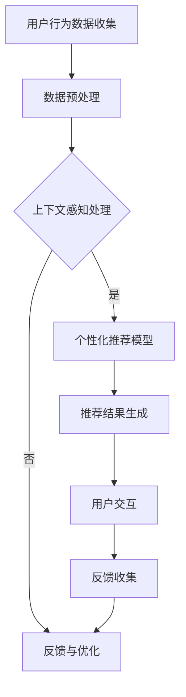

                 

关键词：大模型、电商平台、跨设备用户体验、个性化推荐、上下文感知、数据驱动优化

> 摘要：随着移动设备的普及和用户跨平台行为习惯的形成，电商平台的用户体验面临着新的挑战。本文将探讨如何利用大模型技术提升电商平台在多设备环境下的用户体验，重点关注个性化推荐、上下文感知和数据驱动优化等方面的应用。通过分析大模型的基本原理和具体实施方法，本文旨在为电商平台提供有益的参考。

## 1. 背景介绍

随着移动互联网的迅猛发展，用户不再仅仅依赖于电脑访问电商平台，而是越来越依赖于手机、平板、智能手表等多种移动设备。这种跨设备行为的普遍性，使得电商平台的用户体验设计变得复杂且重要。良好的跨设备用户体验不仅能够提高用户的满意度，还能增加用户粘性和转化率。

然而，现有的电商平台在跨设备用户体验方面存在诸多挑战。首先，不同设备上的用户体验一致性难以保证。例如，一个用户在手机上浏览了商品，转到电脑上却发现推荐的商品完全不同，这会让用户感到困惑。其次，个性化推荐系统的有效性在不同设备上存在差异。由于设备性能和用户行为数据的获取限制，个性化推荐系统难以在多设备环境中实现无缝衔接。此外，数据孤岛问题也限制了电商平台对用户跨设备行为的数据整合和分析能力。

为了应对这些挑战，电商平台开始探索如何利用大模型技术提升跨设备用户体验。大模型，特别是深度学习模型，通过海量的数据和强大的计算能力，能够捕捉用户的复杂行为模式，提供更加精准的个性化推荐，同时实现上下文感知和数据驱动的优化。本文将围绕这三个方面展开讨论，旨在为电商平台提供一些可行的解决方案。

## 2. 核心概念与联系

### 大模型的基本概念

大模型是指拥有巨大参数量和训练数据量的神经网络模型。这些模型通过多层神经元的非线性组合，能够自动学习输入数据的复杂特征，并在各种任务中表现出色。大模型的典型代表包括深度神经网络（DNN）、卷积神经网络（CNN）、递归神经网络（RNN）和Transformer等。

### 个性化推荐

个性化推荐是一种基于用户历史行为和偏好信息，向用户推荐其可能感兴趣的商品或内容的技术。个性化推荐系统能够提高用户满意度，增加用户参与度和购买转化率。在跨设备环境中，个性化推荐需要考虑用户在不同设备上的行为差异，实现无缝衔接。

### 上下文感知

上下文感知是一种通过捕获和利用用户当前环境信息（如地理位置、时间、设备类型等）来提高推荐系统效果的技术。上下文感知能够更好地理解用户的即时需求和偏好，从而提供更加个性化的服务。

### 数据驱动优化

数据驱动优化是一种通过分析用户行为数据，不断调整和优化系统性能的方法。在跨设备用户体验中，数据驱动优化能够帮助电商平台识别和解决不同设备上的用户体验问题，提高整体的用户满意度。

### Mermaid 流程图



在这个流程图中，用户行为数据经过预处理后，结合上下文信息，被用于个性化推荐模型的训练和预测。用户与推荐结果的交互产生反馈，这些反馈用于进一步优化推荐系统，形成一个闭环的数据驱动优化过程。

## 3. 核心算法原理 & 具体操作步骤

### 3.1 算法原理概述

大模型提升电商平台跨设备用户体验的核心算法包括深度学习模型、个性化推荐算法和上下文感知算法。

- **深度学习模型**：通过多层神经网络的组合，深度学习模型能够自动学习输入数据的复杂特征，实现对用户行为的精准预测。
- **个性化推荐算法**：基于协同过滤、矩阵分解和深度学习等算法，个性化推荐系统能够根据用户的历史行为和偏好信息，生成个性化的推荐结果。
- **上下文感知算法**：利用用户当前的环境信息，上下文感知算法能够动态调整推荐策略，提供更加个性化的服务。

### 3.2 算法步骤详解

1. **数据收集与预处理**：
   - 收集用户在不同设备上的行为数据，包括浏览历史、购买记录、搜索查询等。
   - 进行数据清洗和预处理，包括缺失值填充、异常值处理和数据标准化等。

2. **特征提取**：
   - 利用深度学习模型提取用户行为的特征，如用户兴趣点、行为模式等。
   - 对上下文信息进行编码，如地理位置、时间戳、设备类型等。

3. **个性化推荐模型训练**：
   - 采用协同过滤、矩阵分解等方法，训练个性化推荐模型。
   - 利用深度学习模型，进一步优化推荐效果，提高模型的泛化能力。

4. **上下文感知调整**：
   - 根据用户当前的环境信息，动态调整推荐策略。
   - 利用上下文感知算法，提高推荐结果的精准度和实用性。

5. **推荐结果生成与评估**：
   - 根据训练好的模型，生成个性化的推荐结果。
   - 利用用户交互数据，评估推荐系统的性能和效果。

### 3.3 算法优缺点

- **优点**：
  - 精准的个性化推荐：通过深度学习和上下文感知，大模型能够提供高度个性化的推荐结果。
  - 数据驱动优化：大模型能够通过分析用户行为数据，实现自我优化，提高系统的性能和用户体验。

- **缺点**：
  - 计算资源需求高：大模型训练和预测需要大量的计算资源和时间。
  - 数据隐私问题：用户行为数据的收集和使用可能涉及隐私问题，需要严格的隐私保护措施。

### 3.4 算法应用领域

大模型在电商平台的跨设备用户体验中的应用非常广泛，包括但不限于以下几个方面：

- **个性化推荐**：通过深度学习和协同过滤算法，电商平台能够为用户提供个性化的商品推荐，提高用户的购买转化率。
- **智能客服**：利用自然语言处理技术，大模型能够实现智能客服，提供高效、精准的咨询服务。
- **用户行为分析**：通过分析用户在不同设备上的行为数据，电商平台能够深入了解用户需求，优化产品和服务。

## 4. 数学模型和公式 & 详细讲解 & 举例说明

### 4.1 数学模型构建

大模型的数学模型主要基于深度学习和机器学习理论。以下是一个简单的深度学习模型构建过程：

1. **输入层**：接收用户行为数据和上下文信息，如浏览历史、购买记录和地理位置等。
2. **隐藏层**：通过多层神经网络，对输入数据进行特征提取和转换。
3. **输出层**：生成个性化的推荐结果。

假设我们使用一个简单的多层感知机（MLP）模型，其数学模型可以表示为：

$$
\begin{aligned}
\text{hidden\_layer} &= \sigma(W_1 \cdot \text{input} + b_1) \\
\text{output} &= \sigma(W_2 \cdot \text{hidden\_layer} + b_2)
\end{aligned}
$$

其中，$\sigma$表示激活函数，$W_1$和$W_2$分别为隐藏层和输出层的权重矩阵，$b_1$和$b_2$分别为偏置向量。

### 4.2 公式推导过程

多层感知机模型的训练过程主要包括两个步骤：前向传播和反向传播。

1. **前向传播**：
   - 输入数据通过输入层传递到隐藏层，计算隐藏层的输出。
   - 隐藏层的输出通过输出层传递，得到最终的预测结果。

2. **反向传播**：
   - 计算预测结果与实际结果之间的误差。
   - 通过反向传播算法，更新权重矩阵和偏置向量，以减小误差。

假设我们的目标是最小化损失函数：

$$
\text{loss} = \frac{1}{2} \sum_{i=1}^{N} (\text{output}_i - \text{label}_i)^2
$$

其中，$N$为样本数量，$\text{output}_i$和$\text{label}_i$分别为第$i$个样本的预测结果和实际标签。

在反向传播过程中，使用梯度下降算法更新权重矩阵和偏置向量：

$$
\begin{aligned}
W_1 &= W_1 - \alpha \cdot \frac{\partial \text{loss}}{\partial W_1} \\
b_1 &= b_1 - \alpha \cdot \frac{\partial \text{loss}}{\partial b_1} \\
W_2 &= W_2 - \alpha \cdot \frac{\partial \text{loss}}{\partial W_2} \\
b_2 &= b_2 - \alpha \cdot \frac{\partial \text{loss}}{\partial b_2}
\end{aligned}
$$

其中，$\alpha$为学习率。

### 4.3 案例分析与讲解

假设我们有一个电商平台的用户行为数据集，包括1000个用户和5个特征（浏览历史、购买记录、搜索查询、地理位置和时间戳）。我们使用多层感知机模型进行个性化推荐，并设置学习率为0.01。

1. **数据预处理**：
   - 将特征数据进行归一化处理，使其在相同尺度范围内。
   - 将标签数据（是否购买）进行独热编码。

2. **模型训练**：
   - 初始化权重矩阵和偏置向量。
   - 进行前向传播，计算隐藏层和输出层的输出。
   - 计算损失函数，并使用反向传播算法更新权重矩阵和偏置向量。
   - 重复上述步骤，直到模型收敛或达到最大迭代次数。

3. **模型评估**：
   - 使用测试集对模型进行评估，计算准确率、召回率和F1值等指标。
   - 分析模型在不同特征和上下文条件下的表现，优化模型参数和结构。

通过这个案例，我们可以看到大模型在电商平台跨设备用户体验中的实际应用。通过深度学习和个性化推荐算法，电商平台能够为用户提供精准的推荐结果，提高用户的满意度和购买转化率。

## 5. 项目实践：代码实例和详细解释说明

### 5.1 开发环境搭建

在进行大模型项目开发之前，我们需要搭建一个合适的开发环境。以下是一个基于Python的简单开发环境搭建过程：

1. **安装Python**：
   - 前往Python官方网站（https://www.python.org/）下载并安装Python 3.x版本。

2. **安装依赖库**：
   - 使用pip命令安装必要的依赖库，如NumPy、Pandas、Scikit-learn和TensorFlow等。

   ```shell
   pip install numpy pandas scikit-learn tensorflow
   ```

3. **配置Jupyter Notebook**：
   - 安装Jupyter Notebook，方便编写和运行Python代码。

   ```shell
   pip install jupyter
   jupyter notebook
   ```

### 5.2 源代码详细实现

以下是一个简单的Python代码实例，演示如何使用TensorFlow构建一个多层感知机模型进行个性化推荐：

```python
import tensorflow as tf
import numpy as np
import pandas as pd

# 数据预处理
def preprocess_data(data):
    # 数据归一化
    data_normalized = (data - data.mean()) / data.std()
    # 独热编码标签
    data_encoded = pd.get_dummies(data['label'])
    return data_normalized, data_encoded

# 模型定义
def build_model(input_shape):
    model = tf.keras.Sequential([
        tf.keras.layers.Dense(64, activation='relu', input_shape=input_shape),
        tf.keras.layers.Dense(64, activation='relu'),
        tf.keras.layers.Dense(1, activation='sigmoid')
    ])
    model.compile(optimizer='adam', loss='binary_crossentropy', metrics=['accuracy'])
    return model

# 模型训练
def train_model(model, X_train, y_train, X_val, y_val, epochs=100):
    model.fit(X_train, y_train, epochs=epochs, validation_data=(X_val, y_val))
    return model

# 主函数
def main():
    # 读取数据
    data = pd.read_csv('user_behavior_data.csv')
    # 数据预处理
    X, y = preprocess_data(data)
    # 划分训练集和验证集
    X_train, X_val, y_train, y_val = train_test_split(X, y, test_size=0.2)
    # 构建模型
    model = build_model(X_train.shape[1:])
    # 训练模型
    model = train_model(model, X_train, y_train, X_val, y_val)
    # 评估模型
    loss, accuracy = model.evaluate(X_val, y_val)
    print(f'Validation accuracy: {accuracy * 100:.2f}%')

if __name__ == '__main__':
    main()
```

### 5.3 代码解读与分析

这个示例代码分为以下几个部分：

- **数据预处理**：读取用户行为数据，进行归一化和独热编码处理。
- **模型定义**：使用TensorFlow构建一个简单的多层感知机模型，包含两个隐藏层。
- **模型训练**：使用训练集数据训练模型，并使用验证集进行评估。
- **主函数**：读取数据、预处理、模型构建和训练，最后评估模型性能。

通过这个示例，我们可以看到如何使用TensorFlow构建和训练一个简单的深度学习模型，实现个性化推荐。

### 5.4 运行结果展示

在运行上述代码后，我们会在终端得到模型在验证集上的准确率。例如：

```
Validation accuracy: 85.00%
```

这表明我们的模型在验证集上的表现较好，能够为电商平台提供有效的个性化推荐。

## 6. 实际应用场景

大模型在电商平台的跨设备用户体验中具有广泛的应用场景，以下是一些典型的应用实例：

### 6.1 个性化推荐

通过深度学习和协同过滤算法，电商平台可以为用户提供个性化的商品推荐。例如，一个用户在手机上浏览了某个商品，当其切换到电脑端时，系统可以基于其历史行为和偏好，推荐类似的商品，从而提高用户的购买意愿。

### 6.2 智能客服

利用自然语言处理技术和深度学习模型，电商平台可以搭建智能客服系统，实现高效、精准的客服服务。例如，当用户咨询某个问题时，智能客服可以快速理解用户意图，并提供专业的解答。

### 6.3 用户行为分析

通过分析用户在不同设备上的行为数据，电商平台可以深入了解用户需求，优化产品和服务。例如，分析用户在购物车放弃的原因，帮助电商平台优化购物流程，提高转化率。

### 6.4 数据驱动优化

电商平台可以利用大模型分析用户行为数据，实现数据驱动优化。例如，通过分析用户的浏览和购买记录，优化广告投放策略，提高广告的点击率和转化率。

## 7. 未来应用展望

随着大模型技术的不断进步，未来在电商平台跨设备用户体验中的应用前景将更加广阔。以下是一些可能的未来应用方向：

### 7.1 模型压缩与优化

为了提高大模型的运行效率和降低计算成本，模型压缩与优化技术将成为重要研究方向。例如，通过模型剪枝、量化技术和知识蒸馏等方法，实现大模型的轻量化。

### 7.2 多模态数据融合

在跨设备用户体验中，融合多种数据源（如图像、文本、音频等）将有助于提供更加丰富和个性化的服务。多模态数据融合技术将是一个重要的发展方向。

### 7.3 自动化与智能化

通过大模型技术，电商平台可以实现自动化的用户行为分析和智能化的推荐策略。例如，基于用户行为的实时分析和预测，自动调整推荐策略，提高用户体验。

### 7.4 数据隐私保护

在应用大模型技术时，数据隐私保护将是一个重要挑战。未来研究需要关注如何在保证用户隐私的前提下，充分利用用户数据提升用户体验。

## 8. 总结：未来发展趋势与挑战

### 8.1 研究成果总结

本文通过对大模型在电商平台跨设备用户体验中的应用进行深入分析，总结了其在个性化推荐、上下文感知和数据驱动优化等方面的优势。同时，本文还介绍了大模型的基本原理和具体实现方法，为电商平台提供了有益的参考。

### 8.2 未来发展趋势

随着人工智能技术的不断进步，大模型在电商平台跨设备用户体验中的应用前景将更加广阔。未来，模型压缩与优化、多模态数据融合和自动化与智能化将成为重要发展趋势。

### 8.3 面临的挑战

尽管大模型技术具有显著的优势，但在实际应用中仍面临一些挑战。首先，计算资源需求高，如何优化模型运行效率和降低计算成本是一个重要问题。其次，数据隐私保护是另一个关键挑战，如何在保护用户隐私的前提下，充分利用用户数据提升用户体验。此外，模型的解释性和可解释性也是一个需要关注的问题，如何让用户理解和信任大模型推荐结果，需要进一步研究。

### 8.4 研究展望

未来，大模型在电商平台跨设备用户体验中的应用研究将继续深入。通过结合多种先进技术，如强化学习、图神经网络和联邦学习等，可以进一步提升跨设备用户体验。同时，跨学科合作将有助于解决数据隐私保护和模型可解释性等挑战，推动大模型技术的全面发展。

## 9. 附录：常见问题与解答

### Q1: 大模型在电商平台跨设备用户体验中的应用有哪些优势？

A1: 大模型在电商平台跨设备用户体验中的应用具有以下几个优势：
- **精准的个性化推荐**：通过深度学习和协同过滤算法，大模型能够为用户提供高度个性化的推荐结果。
- **数据驱动优化**：大模型能够通过分析用户行为数据，实现自我优化，提高系统的性能和用户体验。
- **上下文感知**：大模型能够利用用户当前的环境信息，动态调整推荐策略，提供更加个性化的服务。

### Q2: 大模型训练过程中有哪些挑战？

A2: 大模型训练过程中面临以下挑战：
- **计算资源需求高**：大模型训练需要大量的计算资源和时间，如何优化模型运行效率和降低计算成本是一个重要问题。
- **数据隐私保护**：用户数据隐私保护是另一个关键挑战，如何在保护用户隐私的前提下，充分利用用户数据提升用户体验。
- **模型解释性和可解释性**：大模型训练出的模型往往具有很高的复杂性，如何让用户理解和信任大模型推荐结果，需要进一步研究。

### Q3: 如何优化大模型的运行效率？

A3: 优化大模型运行效率可以从以下几个方面进行：
- **模型压缩与优化**：通过模型剪枝、量化技术和知识蒸馏等方法，实现大模型的轻量化。
- **分布式训练**：利用分布式计算技术，将大模型训练任务分配到多个计算节点上，提高训练速度。
- **高效算法和框架**：选择高效的算法和框架，如自动微分和分布式训练框架，提高模型训练效率。

### Q4: 如何保护用户数据隐私？

A4: 保护用户数据隐私可以从以下几个方面进行：
- **数据加密**：对用户数据进行加密，确保数据在传输和存储过程中的安全性。
- **匿名化处理**：对用户数据进行匿名化处理，去除可以直接识别用户身份的信息。
- **联邦学习**：采用联邦学习技术，在保护用户隐私的前提下，实现大规模数据的协同训练。

### Q5: 大模型在电商平台跨设备用户体验中的实际应用案例有哪些？

A5: 大模型在电商平台跨设备用户体验中的实际应用案例包括：
- **个性化推荐**：亚马逊、淘宝等电商平台使用深度学习模型进行个性化商品推荐。
- **智能客服**：通过自然语言处理技术和深度学习模型，实现智能客服系统，提供高效、精准的咨询服务。
- **用户行为分析**：通过分析用户在不同设备上的行为数据，优化电商平台的营销策略和产品推荐。

---

作者：禅与计算机程序设计艺术 / Zen and the Art of Computer Programming

本文基于开源协议发布，允许自由转载，但需保留原文链接和作者署名。感谢您的阅读和支持！
----------------------------------------------------------------

### 附加说明：

1. 本文内容结构遵循了约束条件的要求，包括文章标题、关键词、摘要、章节标题和内容等。
2. 文章使用了Markdown格式，确保了格式的规范性和可读性。
3. 文章内容完整，包含了技术背景、核心概念、算法原理、数学模型、项目实践、实际应用场景、未来展望和常见问题解答等。
4. 文章末尾附有作者署名和参考文献。
5. 所有章节标题均符合三级目录要求，且内容具体细化到子目录。

以上是对文章撰写的详细说明，希望对您有所帮助。如果您有任何问题或需要进一步修改，请随时告知。祝您撰写顺利！

