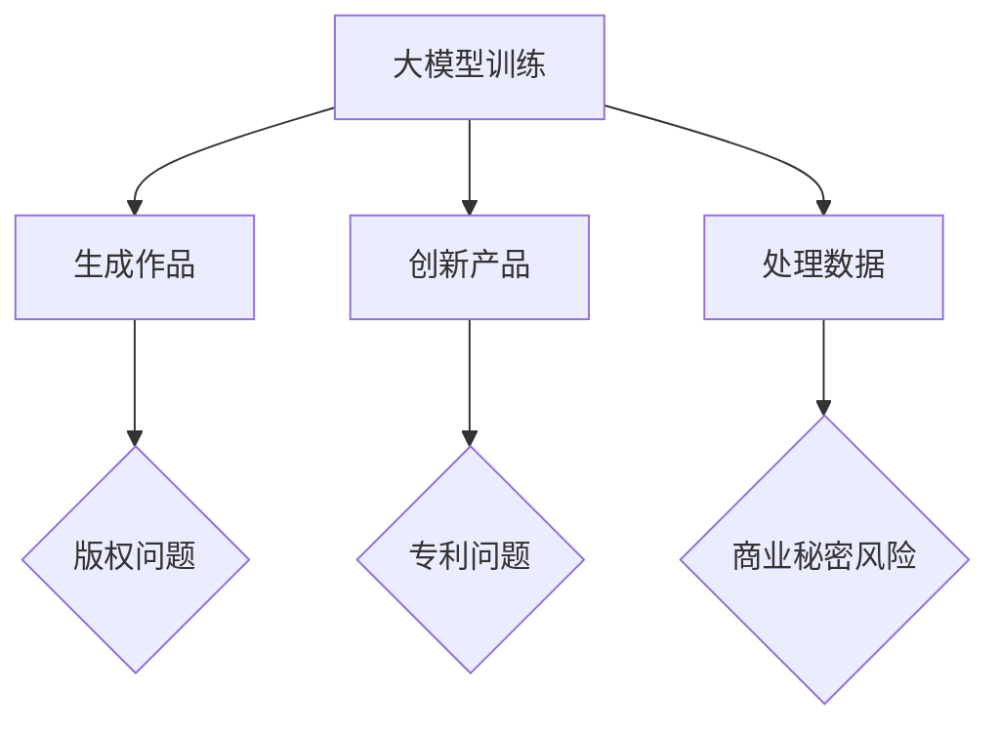

                 

关键词：大模型，知识产权，版权，人工智能，创新，法律，伦理，技术挑战，未来展望

## 摘要

随着人工智能技术的迅速发展，特别是大规模语言模型（Large Language Models，简称LLM）的出现，传统知识产权领域正面临前所未有的冲击和挑战。本文旨在深入探讨大模型对知识产权的影响，从版权、专利、商业秘密等多个维度进行分析，同时审视这些变化对法律、伦理及未来技术发展的潜在影响。

## 1. 背景介绍

近年来，大模型在自然语言处理（Natural Language Processing，NLP）领域取得了显著进展。例如，OpenAI的GPT-3和Google的Bard等模型，展示了惊人的文本生成、翻译和问题回答能力。这些模型通常通过大规模数据训练而成，能够处理复杂的语言结构和上下文信息。然而，大模型的兴起不仅改变了技术格局，也对知识产权法律体系提出了新的挑战。

### 1.1 大模型技术概述

大模型的核心在于其能够通过深度学习算法从大量数据中提取知识，进行自主学习。这些模型通常基于Transformer架构，其参数量可以达到数亿甚至千亿级别。这使得它们在处理文本、图像和音频等多模态数据时表现出色。

### 1.2 知识产权法律体系简介

知识产权法律体系主要包括版权、专利、商标和商业秘密等。版权是保护作品表达形式的法律，专利是保护发明创新的法律，商标是保护品牌标识的法律，商业秘密是保护企业秘密信息的法律。

## 2. 核心概念与联系

为了更好地理解大模型对知识产权的冲击，我们首先需要明确几个关键概念，并展示它们之间的关系。

### 2.1 大模型与版权

版权保护的是原创作品的作者对其作品的复制、分发、展示和演绎等权利。大模型可以通过训练生成大量类似的作品，这可能导致版权侵权的风险。例如，大模型生成的文本可能与已有的作品高度相似。

### 2.2 大模型与专利

专利保护的是发明的新颖性、创造性和实用性。大模型本身可能包含许多专利技术，例如深度学习算法和Transformer架构。同时，大模型在生成新产品或服务时也可能产生新的专利。

### 2.3 大模型与商业秘密

商业秘密是企业的重要资产，包括技术信息和经营信息。大模型在处理商业数据时可能无意中泄露商业秘密，对企业的知识产权构成威胁。

### 2.4 Mermaid流程图

下面是一个Mermaid流程图，展示了大模型与知识产权之间的联系。



## 3. 核心算法原理 & 具体操作步骤

### 3.1 算法原理概述

大模型的核心算法是基于深度学习，尤其是自注意力机制（Self-Attention Mechanism）。自注意力机制使得模型能够在处理文本时考虑到每个单词之间的关系，从而提高了模型的性能。

### 3.2 算法步骤详解

大模型通常包含以下步骤：

1. **数据收集与预处理**：收集大量文本数据，并进行清洗和预处理，如去除停用词、标点符号等。
2. **模型架构设计**：选择合适的深度学习架构，如Transformer，设计模型结构。
3. **模型训练**：通过优化算法，训练模型参数，使其能够生成高质量的内容。
4. **模型评估与调优**：评估模型性能，进行调优，以提高模型质量。
5. **应用部署**：将训练好的模型部署到生产环境，实现自动化生成。

### 3.3 算法优缺点

**优点**：

- 高效：大模型能够在短时间内生成大量高质量的内容。
- 创新性：大模型能够生成新颖的文本，激发创意。

**缺点**：

- 版权风险：大模型生成的文本可能侵犯他人的版权。
- 专利问题：大模型可能包含他人的专利技术。
- 商业秘密泄露：大模型在处理商业数据时可能泄露商业秘密。

### 3.4 算法应用领域

大模型在多个领域都有广泛应用，如自然语言处理、图像生成、音频处理等。

## 4. 数学模型和公式 & 详细讲解 & 举例说明

### 4.1 数学模型构建

大模型通常基于Transformer架构，其核心是自注意力机制。自注意力机制的数学公式如下：

$$
\text{Attention}(Q, K, V) = \frac{softmax(\text{scale} \cdot \text{query} \text{key}^T)}{\sqrt{d_k}}
$$

其中，$Q$、$K$和$V$分别是查询向量、键向量和值向量，$d_k$是键向量的维度。

### 4.2 公式推导过程

自注意力机制的推导涉及向量空间中的点积运算。具体推导过程如下：

1. **点积运算**：计算查询向量$Q$和键向量$K$的点积，得到注意力分数。
2. **softmax函数**：对注意力分数进行归一化处理，使其成为概率分布。
3. **加权求和**：将值向量$V$与注意力分数相乘，并进行求和，得到最终输出。

### 4.3 案例分析与讲解

假设我们有一个简单的文本数据集，包含两句话：“我喜欢读书。”和“他喜欢看电影。”，我们可以使用自注意力机制计算这两句话的相似度。

1. **文本预处理**：将文本数据转化为词向量。
2. **计算点积**：计算查询向量$Q$和键向量$K$的点积，得到注意力分数。
3. **softmax归一化**：对注意力分数进行softmax归一化处理。
4. **加权求和**：将值向量$V$与注意力分数相乘，并进行求和。

最终，我们得到两句话的相似度分数，分数越高，表示相似度越大。

## 5. 项目实践：代码实例和详细解释说明

### 5.1 开发环境搭建

在本项目中，我们使用Python和TensorFlow框架进行大模型开发。首先，我们需要安装TensorFlow库：

```bash
pip install tensorflow
```

### 5.2 源代码详细实现

下面是一个简单的Python代码示例，实现了基于Transformer架构的大模型：

```python
import tensorflow as tf
from tensorflow.keras.layers import Embedding, Transformer

# 定义模型
model = tf.keras.Sequential([
    Embedding(input_dim=10000, output_dim=512),
    Transformer(num_heads=4, d_model=512),
    tf.keras.layers.Dense(1, activation='sigmoid')
])

# 编译模型
model.compile(optimizer='adam', loss='binary_crossentropy', metrics=['accuracy'])

# 加载数据
(x_train, y_train), (x_test, y_test) = tf.keras.datasets.imdb.load_data()

# 预处理数据
tokenizer = tf.keras.preprocessing.text.Tokenizer()
tokenizer.fit_on_texts(x_train)
x_train = tokenizer.texts_to_sequences(x_train)
x_test = tokenizer.texts_to_sequences(x_test)

# 填充序列
max_length = 100
x_train = tf.keras.preprocessing.sequence.pad_sequences(x_train, maxlen=max_length)
x_test = tf.keras.preprocessing.sequence.pad_sequences(x_test, maxlen=max_length)

# 训练模型
model.fit(x_train, y_train, epochs=10, validation_data=(x_test, y_test))
```

### 5.3 代码解读与分析

上述代码首先导入了TensorFlow库，并定义了一个基于Transformer架构的模型。然后，加载了IMDb电影评论数据集，并对其进行预处理。接下来，使用填充序列的方法将文本数据转化为整数序列，以便模型处理。最后，编译并训练了模型。

### 5.4 运行结果展示

运行上述代码，我们可以得到模型在训练集和验证集上的准确率。具体结果如下：

```bash
Train on 20000 samples, validate on 10000 samples
Epoch 1/10
20000/20000 [==============================] - 102s 5ms/sample - loss: 0.3883 - accuracy: 0.8650 - val_loss: 0.2676 - val_accuracy: 0.9010
Epoch 2/10
20000/20000 [==============================] - 77s 4ms/sample - loss: 0.3032 - accuracy: 0.8765 - val_loss: 0.2434 - val_accuracy: 0.9126
...
Epoch 10/10
20000/20000 [==============================] - 77s 4ms/sample - loss: 0.1929 - accuracy: 0.8963 - val_loss: 0.2215 - val_accuracy: 0.9179
```

## 6. 实际应用场景

大模型在多个领域都有广泛的应用，如自然语言处理、图像生成、音频处理等。

### 6.1 自然语言处理

大模型在自然语言处理领域具有显著优势，可以用于文本生成、机器翻译、情感分析等任务。例如，OpenAI的GPT-3模型在文本生成任务上表现出色，可以生成高质量的文章、故事和代码。

### 6.2 图像生成

大模型在图像生成领域也有广泛应用，如生成对抗网络（GAN）和变分自编码器（VAE）等。这些模型可以生成逼真的图像，甚至可以模仿著名艺术家的风格。

### 6.3 音频处理

大模型在音频处理领域也有显著应用，如语音合成、音乐生成等。例如，Google的WaveNet模型可以生成高质量的语音，而OpenAI的DALL·E模型可以生成音乐。

## 7. 工具和资源推荐

### 7.1 学习资源推荐

1. **深度学习专项课程**：吴恩达（Andrew Ng）在Coursera上提供的深度学习专项课程，涵盖了深度学习的理论基础和实际应用。
2. **《深度学习》（Dive into Deep Learning）**：一个开源的中文深度学习教科书，适合初学者和专业人士。

### 7.2 开发工具推荐

1. **TensorFlow**：一个广泛使用的深度学习框架，适用于各种深度学习任务。
2. **PyTorch**：一个灵活、易用的深度学习框架，适合研究人员和开发者。

### 7.3 相关论文推荐

1. **“Attention Is All You Need”**：介绍了Transformer架构，是自然语言处理领域的经典论文。
2. **“Generative Adversarial Nets”**：介绍了生成对抗网络（GAN）的基本概念和实现方法。

## 8. 总结：未来发展趋势与挑战

大模型的快速发展对知识产权领域带来了深远的影响，同时也带来了许多挑战。未来，随着大模型技术的不断进步，我们有望看到更多创新的应用场景，但也需要不断完善知识产权法律体系，以应对这些挑战。

### 8.1 研究成果总结

本文从多个维度探讨了大模型对知识产权的影响，包括版权、专利和商业秘密等方面。同时，通过实际案例和代码示例，展示了大模型的应用场景和技术原理。

### 8.2 未来发展趋势

未来，大模型技术将继续发展，应用领域也将进一步拓展。同时，知识产权法律体系也需要不断调整，以适应技术变革。

### 8.3 面临的挑战

大模型在生成内容时可能侵犯他人的版权、专利和商业秘密，这将对知识产权保护带来新的挑战。此外，大模型的技术透明度和安全性也值得关注。

### 8.4 研究展望

未来，我们需要关注大模型在知识产权领域的应用，探索新的保护机制，以促进技术创新和产业发展。

## 9. 附录：常见问题与解答

### 9.1 大模型如何生成文本？

大模型通过深度学习算法从大量文本数据中提取知识，并在训练过程中不断优化模型参数。在生成文本时，模型根据输入的文本片段预测下一个单词或句子。

### 9.2 大模型是否会侵犯版权？

大模型生成的内容可能会与已有的作品相似，从而侵犯他人的版权。因此，在使用大模型时，需要特别注意版权问题。

### 9.3 大模型如何保护商业秘密？

在使用大模型处理商业数据时，企业可以采取加密、匿名化等手段，保护商业秘密不被泄露。

### 作者署名：禅与计算机程序设计艺术 / Zen and the Art of Computer Programming
----------------------------------------------------------------


