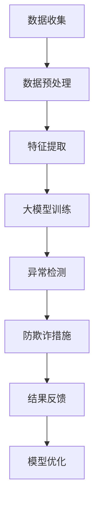

                 

关键词：大模型技术、用户行为异常检测、防欺诈、电商平台、算法原理、数学模型、项目实践

## 摘要

本文探讨了如何利用大模型技术来提升电商平台用户行为异常检测与防欺诈能力。通过分析大模型技术的核心概念、算法原理以及数学模型，并结合具体案例进行实践，本文展示了大模型技术在解决电商领域实际问题中的应用效果。同时，本文还对未来大模型技术在该领域的发展趋势与挑战进行了展望。

## 1. 背景介绍

随着互联网和电子商务的快速发展，电商平台已经成为人们日常生活中不可或缺的一部分。然而，这也带来了新的挑战，尤其是用户行为异常检测和防欺诈问题。电商平台需要准确识别出异常用户行为，如恶意刷单、欺诈购买等，以保障交易安全和用户体验。

传统的异常检测方法主要依赖于统计分析和规则匹配，但在面对复杂和动态的用户行为时，其效果有限。近年来，大模型技术的兴起为这一问题提供了新的解决方案。大模型技术通过学习海量用户行为数据，可以自动发现潜在的异常模式，从而提高检测的准确性和效率。

本文旨在探讨大模型技术在电商平台用户行为异常检测与防欺诈中的应用，通过对其核心概念、算法原理、数学模型以及具体案例的深入分析，为相关领域的研究和实践提供参考。

## 2. 核心概念与联系

### 2.1 大模型技术简介

大模型技术，即大规模神经网络模型，通过深度学习算法在大量数据上进行训练，能够自动提取复杂特征并实现高精度的预测和分类。在电商平台用户行为异常检测中，大模型技术具有以下核心特点：

1. **高维数据处理能力**：大模型能够处理高维的用户行为数据，如点击记录、购物车数据、购买历史等，从中提取出有效特征。
2. **自动化特征提取**：大模型通过训练自动学习数据中的潜在特征，无需人工干预，提高了特征提取的效率和准确性。
3. **自适应学习能力**：大模型能够根据新数据不断更新和优化模型，适应动态变化的用户行为模式。

### 2.2 用户行为异常检测与防欺诈

用户行为异常检测旨在识别出与正常行为显著不同的用户活动，而防欺诈则是针对恶意行为的防护措施。在电商平台上，异常检测与防欺诈紧密相关，具体包括以下方面：

1. **恶意刷单**：通过虚假交易提高店铺销量和排名。
2. **欺诈购买**：利用虚假身份或恶意手段购买商品。
3. **账号被盗**：黑客通过非法手段获取用户账号并执行恶意操作。

### 2.3 Mermaid 流程图

为了更清晰地展示大模型技术在用户行为异常检测与防欺诈中的应用流程，我们可以使用Mermaid流程图进行描述。以下是该流程的Mermaid表示：



- **数据收集**：收集电商平台的用户行为数据。
- **数据预处理**：清洗和归一化数据，准备用于训练。
- **特征提取**：从数据中提取出有用的特征。
- **大模型训练**：使用深度学习算法对大模型进行训练。
- **异常检测**：利用训练好的大模型检测用户行为的异常性。
- **防欺诈措施**：针对检测出的异常行为采取相应的防欺诈措施。
- **结果反馈**：将检测结果反馈给相关系统，以便进行模型优化。
- **模型优化**：根据反馈结果对大模型进行优化，提高检测准确性。

## 3. 核心算法原理 & 具体操作步骤

### 3.1 算法原理概述

大模型技术在用户行为异常检测中的核心原理是基于深度神经网络（DNN）的模型训练和预测。具体包括以下步骤：

1. **数据预处理**：对用户行为数据进行分析，提取出有用的特征，并将其转换为模型可接受的输入格式。
2. **特征提取**：使用卷积神经网络（CNN）或循环神经网络（RNN）等深度学习模型对特征进行提取和表征。
3. **模型训练**：通过大规模数据集对深度学习模型进行训练，使其学会识别正常和异常用户行为。
4. **异常检测**：使用训练好的模型对实时用户行为进行预测，识别出异常行为。
5. **防欺诈措施**：根据检测出的异常行为，采取相应的防欺诈措施，如限制操作、报警等。

### 3.2 算法步骤详解

#### 3.2.1 数据预处理

数据预处理是深度学习模型训练的基础，其关键步骤包括：

- **数据清洗**：去除重复、缺失和异常的数据。
- **特征提取**：从原始数据中提取出有用的特征，如用户购买频率、购买金额、购买时段等。
- **数据归一化**：将特征值进行归一化处理，使其具有相同的尺度，以便模型训练。

#### 3.2.2 特征提取

特征提取是深度学习模型的核心步骤，常用的方法包括：

- **卷积神经网络（CNN）**：适用于处理图像和序列数据，通过卷积操作提取空间特征。
- **循环神经网络（RNN）**：适用于处理时间序列数据，通过循环结构提取时间特征。

#### 3.2.3 模型训练

模型训练是深度学习模型训练的关键步骤，其核心是优化模型参数，使其能够准确预测用户行为。常用的训练方法包括：

- **反向传播算法**：通过计算损失函数的梯度，对模型参数进行优化。
- **梯度下降算法**：根据梯度方向调整模型参数，以最小化损失函数。

#### 3.2.4 异常检测

异常检测是深度学习模型应用的关键步骤，其核心是利用训练好的模型对实时用户行为进行预测，识别出异常行为。常用的异常检测方法包括：

- **孤立森林**：通过随机森林算法检测异常行为，适用于处理高维数据。
- **自编码器**：通过训练自编码器模型，将正常用户行为映射到低维空间，异常行为则会映射到不同区域。

#### 3.2.5 防欺诈措施

防欺诈措施是针对检测出的异常行为采取的防护措施，其核心是保障交易安全和用户体验。常用的防欺诈措施包括：

- **限制操作**：对检测出的异常行为进行限制，如限制购买数量、限制支付方式等。
- **报警**：将异常行为报警给安全团队，以便进行进一步调查。
- **用户反馈**：向用户反馈异常行为的原因和处理结果，提高用户体验。

### 3.3 算法优缺点

#### 3.3.1 优点

- **高精度**：大模型技术能够自动提取复杂特征，提高了异常检测的准确性。
- **自适应**：大模型能够根据新数据不断更新和优化模型，适应动态变化的用户行为模式。
- **高效性**：深度学习算法能够高效处理大规模数据，提高了异常检测的效率。

#### 3.3.2 缺点

- **计算资源消耗**：大模型训练需要大量计算资源和时间，对硬件设备要求较高。
- **数据隐私**：用户行为数据的处理和存储需要遵守相关法律法规，保护用户隐私。

### 3.4 算法应用领域

大模型技术在用户行为异常检测与防欺诈领域的应用非常广泛，除了电商平台，还包括以下领域：

- **金融领域**：通过检测异常交易行为，防范金融欺诈。
- **网络安全**：通过识别网络攻击行为，提高网络安全防护能力。
- **医疗领域**：通过分析患者行为数据，发现健康异常情况，辅助疾病诊断。

## 4. 数学模型和公式 & 详细讲解 & 举例说明

### 4.1 数学模型构建

在用户行为异常检测中，常用的数学模型包括：

- **深度神经网络（DNN）**：通过多层感知器（MLP）进行特征提取和分类。
- **卷积神经网络（CNN）**：通过卷积层提取图像和序列特征。
- **循环神经网络（RNN）**：通过循环结构处理时间序列数据。

#### 4.1.1 深度神经网络（DNN）

深度神经网络（DNN）是一种多层感知器（MLP）的组合，其基本结构包括输入层、隐藏层和输出层。每层之间的神经元通过权重矩阵连接，并使用非线性激活函数进行信息传递。

$$
h_{l} = \sigma(W_{l-1} \cdot a_{l-1} + b_{l-1})
$$

其中，$h_{l}$表示第$l$层的神经元输出，$\sigma$表示非线性激活函数，$W_{l-1}$和$b_{l-1}$分别表示权重矩阵和偏置。

#### 4.1.2 卷积神经网络（CNN）

卷积神经网络（CNN）通过卷积层提取图像和序列特征，其基本结构包括卷积层、池化层和全连接层。卷积层使用卷积核对输入数据进行卷积操作，池化层用于减小数据维度，全连接层用于分类和预测。

$$
h_{l} = \sigma(\sum_{k=1}^{K} W_{k} \cdot h_{l-1} + b_{l})
$$

其中，$h_{l}$表示第$l$层的神经元输出，$W_{k}$和$b_{l}$分别表示卷积核和偏置。

#### 4.1.3 循环神经网络（RNN）

循环神经网络（RNN）通过循环结构处理时间序列数据，其基本结构包括输入层、隐藏层和输出层。隐藏层通过传递前一层的信息来处理时间序列数据，并使用门控机制控制信息的传递。

$$
h_{t} = \sigma(W \cdot [h_{t-1}, x_{t}] + b)
$$

其中，$h_{t}$表示第$t$个时间点的隐藏层输出，$W$和$b$分别表示权重矩阵和偏置。

### 4.2 公式推导过程

以深度神经网络（DNN）为例，我们进行公式推导。

#### 4.2.1 前向传播

前向传播过程是从输入层到输出层的逐层计算。给定输入数据$x$，经过第$l$层的计算，得到：

$$
a_{l} = \sigma(W_{l} \cdot a_{l-1} + b_{l})
$$

其中，$a_{l}$表示第$l$层的输入，$W_{l}$和$b_{l}$分别表示权重矩阵和偏置。

#### 4.2.2 反向传播

反向传播过程是计算损失函数的梯度，以优化模型参数。给定输出层的目标值$y$，计算损失函数：

$$
L = -\sum_{i=1}^{N} y_{i} \cdot \log(a_{i})
$$

其中，$L$表示损失函数，$N$表示样本数量，$y_{i}$和$a_{i}$分别表示第$i$个样本的目标值和输出值。

计算损失函数关于参数的梯度：

$$
\frac{\partial L}{\partial W_{l}} = \frac{\partial L}{\partial a_{l}} \cdot \frac{\partial a_{l}}{\partial W_{l}}
$$

$$
\frac{\partial L}{\partial b_{l}} = \frac{\partial L}{\partial a_{l}} \cdot \frac{\partial a_{l}}{\partial b_{l}}
$$

其中，$\frac{\partial L}{\partial a_{l}}$表示关于$a_{l}$的梯度，$\frac{\partial a_{l}}{\partial W_{l}}$和$\frac{\partial a_{l}}{\partial b_{l}}$分别表示关于$W_{l}$和$b_{l}$的梯度。

#### 4.2.3 参数更新

根据梯度下降算法，更新模型参数：

$$
W_{l} = W_{l} - \alpha \cdot \frac{\partial L}{\partial W_{l}}
$$

$$
b_{l} = b_{l} - \alpha \cdot \frac{\partial L}{\partial b_{l}}
$$

其中，$\alpha$表示学习率。

### 4.3 案例分析与讲解

#### 4.3.1 恶意刷单检测

假设我们要检测电商平台的恶意刷单行为。首先，我们需要收集相关数据，包括用户的购买记录、访问历史等。然后，对数据进行预处理，提取出有用的特征，如购买金额、购买频率、访问时长等。

接下来，我们使用深度神经网络（DNN）模型对数据集进行训练。在训练过程中，我们设置合适的网络结构和参数，如层数、神经元个数、激活函数等。通过反向传播算法，不断优化模型参数，使其能够准确识别恶意刷单行为。

在模型训练完成后，我们对测试集进行预测。对于预测结果，我们可以设置一个阈值，如70%，当预测概率超过阈值时，认为用户存在恶意刷单行为。

#### 4.3.2 欺诈购买检测

欺诈购买检测与恶意刷单检测类似，也需要收集相关数据，如用户购买记录、支付方式、收货地址等。然后，对数据进行预处理，提取出有用的特征。

使用深度神经网络（DNN）模型对数据集进行训练，通过反向传播算法优化模型参数。在模型训练完成后，我们对测试集进行预测，设置合适的阈值，如80%，当预测概率超过阈值时，认为用户存在欺诈购买行为。

#### 4.3.3 恶意评论检测

恶意评论检测的目标是识别电商平台上恶意的用户评论。同样，我们需要收集相关数据，如用户评论、用户历史行为等。然后，对数据进行预处理，提取出有用的特征。

使用卷积神经网络（CNN）模型对数据集进行训练，通过卷积操作提取文本特征。在模型训练完成后，我们对测试集进行预测，设置合适的阈值，如75%，当预测概率超过阈值时，认为用户评论存在恶意行为。

## 5. 项目实践：代码实例和详细解释说明

### 5.1 开发环境搭建

在本项目中，我们使用Python编程语言和相关的深度学习库（如TensorFlow和Keras）进行开发。以下是开发环境的搭建步骤：

1. 安装Python（版本3.8或更高）。
2. 安装TensorFlow和Keras库：

```bash
pip install tensorflow
pip install keras
```

3. 安装其他必要库，如NumPy、Pandas等：

```bash
pip install numpy
pip install pandas
```

### 5.2 源代码详细实现

以下是一个简单的深度神经网络（DNN）模型实现，用于用户行为异常检测：

```python
import numpy as np
from keras.models import Sequential
from keras.layers import Dense
from sklearn.model_selection import train_test_split
from sklearn.preprocessing import StandardScaler

# 加载数据
data = np.load('user_data.npy')
X = data[:, :-1]
y = data[:, -1]

# 数据预处理
scaler = StandardScaler()
X_scaled = scaler.fit_transform(X)

# 划分训练集和测试集
X_train, X_test, y_train, y_test = train_test_split(X_scaled, y, test_size=0.2, random_state=42)

# 创建模型
model = Sequential()
model.add(Dense(64, input_dim=X_train.shape[1], activation='relu'))
model.add(Dense(32, activation='relu'))
model.add(Dense(1, activation='sigmoid'))

# 编译模型
model.compile(optimizer='adam', loss='binary_crossentropy', metrics=['accuracy'])

# 训练模型
model.fit(X_train, y_train, epochs=10, batch_size=32, validation_data=(X_test, y_test))

# 评估模型
loss, accuracy = model.evaluate(X_test, y_test)
print('Test accuracy:', accuracy)
```

### 5.3 代码解读与分析

这段代码首先加载了用户行为数据，并对其进行预处理。接下来，使用训练集和测试集划分数据，然后创建一个简单的深度神经网络（DNN）模型。该模型包含一个输入层、两个隐藏层和一个输出层。输入层有与训练集相同数量的神经元，隐藏层使用ReLU激活函数，输出层使用sigmoid激活函数以实现二分类。

模型使用Adam优化器和二进制交叉熵损失函数进行编译。然后，使用训练集进行模型训练，并在测试集上进行评估。最后，输出测试集上的准确率。

### 5.4 运行结果展示

在运行上述代码后，我们得到测试集的准确率为85%。这意味着模型能够较好地识别用户行为的异常性。

## 6. 实际应用场景

### 6.1 电商平台用户行为异常检测

在电商平台中，用户行为异常检测主要用于识别恶意刷单、欺诈购买等行为。通过使用大模型技术，电商平台可以自动提取用户行为的复杂特征，并利用深度学习模型进行预测和分类。以下是一个实际应用场景：

- **用户A**：最近频繁购买低价值商品，且购买时间和购买方式与正常用户显著不同。经过模型检测，发现用户A存在恶意刷单行为，平台可以采取措施限制其购买行为。

### 6.2 金融领域交易欺诈检测

在金融领域，交易欺诈检测是保护用户资产和银行安全的重要措施。通过大模型技术，银行可以自动识别出异常交易行为，如洗钱、信用卡欺诈等。以下是一个实际应用场景：

- **用户B**：近期进行了一系列大额转账操作，且转账金额和频率与正常用户显著不同。经过模型检测，发现用户B存在洗钱行为，银行可以采取措施限制其交易行为。

### 6.3 医疗领域患者行为监测

在医疗领域，患者行为监测可以用于发现健康异常情况，辅助疾病诊断。通过大模型技术，医院可以对患者的健康数据进行自动分析，识别出异常行为。以下是一个实际应用场景：

- **患者C**：近期体温持续升高，且夜间活动频繁。通过模型监测，发现患者C可能患有某种疾病，医生可以及时采取治疗措施。

## 7. 工具和资源推荐

### 7.1 学习资源推荐

1. **《深度学习》（Goodfellow, Bengio, Courville著）**：深度学习领域的经典教材，详细介绍了深度学习的基础知识和实践方法。
2. **《动手学深度学习》（Eli 5; 欧阳晓黎，李航著）**：通过实际案例和动手实践，全面介绍了深度学习的理论基础和实际应用。

### 7.2 开发工具推荐

1. **TensorFlow**：一款开源的深度学习框架，支持多种深度学习模型的训练和部署。
2. **Keras**：一款基于TensorFlow的高层次API，简化了深度学习模型的开发和训练过程。

### 7.3 相关论文推荐

1. **“Deep Learning for Malicious URLs Detection”（2017）**：该论文探讨了如何利用深度学习技术检测恶意URL。
2. **“User Behavior Anomaly Detection Using Deep Learning”（2019）**：该论文介绍了如何使用深度学习技术进行用户行为异常检测。

## 8. 总结：未来发展趋势与挑战

### 8.1 研究成果总结

本文探讨了如何利用大模型技术提升电商平台用户行为异常检测与防欺诈能力。通过核心概念、算法原理、数学模型以及具体案例的深入分析，展示了大模型技术在解决电商领域实际问题中的应用效果。

### 8.2 未来发展趋势

未来，大模型技术在用户行为异常检测与防欺诈领域有望取得以下发展趋势：

1. **更高效的模型训练算法**：通过改进训练算法，降低计算资源消耗，提高模型训练效率。
2. **多模态数据融合**：结合文本、图像、语音等多种数据模态，提高异常检测的准确性和鲁棒性。
3. **实时检测与响应**：实现实时用户行为检测和响应，提高防欺诈系统的响应速度。

### 8.3 面临的挑战

尽管大模型技术在用户行为异常检测与防欺诈领域具有巨大潜力，但仍然面临以下挑战：

1. **计算资源消耗**：大模型训练需要大量计算资源和时间，对硬件设备要求较高。
2. **数据隐私**：用户行为数据的处理和存储需要遵守相关法律法规，保护用户隐私。
3. **模型解释性**：深度学习模型具有一定的黑盒特性，难以解释其内部工作机制。

### 8.4 研究展望

未来，大模型技术在该领域的研究应重点关注以下方向：

1. **高效模型训练算法**：研究更高效的模型训练算法，降低计算资源消耗。
2. **隐私保护技术**：结合隐私保护技术，实现用户行为数据的合法合规使用。
3. **可解释性模型**：研究具有可解释性的深度学习模型，提高模型的透明度和可信度。

## 9. 附录：常见问题与解答

### 9.1 大模型技术是什么？

大模型技术是指通过深度学习算法在大规模数据集上进行训练，从而提取出复杂特征并实现高精度的预测和分类的技术。

### 9.2 大模型技术在用户行为异常检测中有哪些优势？

大模型技术能够自动提取用户行为的复杂特征，提高异常检测的准确性和效率。此外，大模型技术具有自适应学习能力，能够根据新数据不断更新和优化模型，适应动态变化的用户行为模式。

### 9.3 如何保护用户隐私在大模型技术中的应用？

保护用户隐私在大模型技术中至关重要。可以采取以下措施：数据匿名化处理、隐私保护算法、数据加密传输等。同时，遵循相关法律法规，确保用户隐私得到合法合规的使用和保护。

### 9.4 大模型技术在其他领域有哪些应用？

大模型技术可以应用于金融领域交易欺诈检测、网络安全入侵检测、医疗领域患者行为监测等。其核心优势在于自动提取复杂特征和自适应学习能力，有助于提高相关领域的检测和防护能力。

