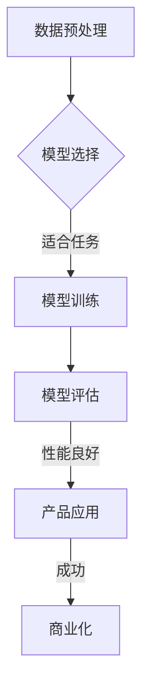

                 

 关键词：大模型时代，AI 产品经理，创业机会，技术趋势，商业策略

> 摘要：随着人工智能技术的飞速发展，大模型时代已经到来。本文将探讨大模型时代给 AI 产品经理带来的创业机会，分析技术趋势，提出商业策略，并分享实践经验，旨在为 AI 产品经理提供有价值的参考。

## 1. 背景介绍

### 大模型时代来临

近年来，人工智能技术取得了显著的进步，特别是深度学习算法的快速发展，推动了自然语言处理、计算机视觉、语音识别等领域的突破。大模型时代，即基于大规模数据的模型训练和优化，已经成为人工智能领域的重要趋势。

### AI 产品经理的角色

AI 产品经理是连接技术团队与市场需求的重要桥梁，他们不仅要了解技术发展趋势，还要关注用户需求和市场动态。在大模型时代，AI 产品经理需要具备更高的技术敏感性和商业洞察力，以发现和把握创业机会。

## 2. 核心概念与联系

### 大模型概念

大模型是指训练数据量巨大、参数数量庞大的深度学习模型。这些模型在训练过程中需要大量的计算资源和时间，但随着硬件技术的发展，大规模模型训练已经成为可能。

### AI 产品经理与大模型

AI 产品经理需要了解大模型的基本原理和训练过程，以便更好地理解技术团队的工作，并在产品设计和推广中充分利用大模型的优势。

## 2.1 大模型原理


- **数据预处理**：数据清洗、数据增强等。
- **模型选择**：选择适合任务的大模型架构，如 GPT、BERT 等。
- **训练过程**：使用大规模数据集进行模型训练，通过优化算法调整模型参数。
- **模型评估**：使用验证集和测试集评估模型性能。

## 2.2 大模型应用场景

大模型在自然语言处理、计算机视觉、语音识别等领域具有广泛的应用前景，AI 产品经理需要关注这些领域的发展动态，寻找创业机会。

### Mermaid 流程图



## 3. 核心算法原理 & 具体操作步骤

### 3.1 算法原理概述

大模型的核心在于其参数的数量和数据的规模，通过深度学习算法，这些参数可以在大规模数据集上进行优化，从而实现强大的预测和生成能力。

### 3.2 算法步骤详解

#### 3.2.1 数据收集

收集大规模数据，包括文本、图像、语音等。

#### 3.2.2 数据预处理

进行数据清洗、数据增强等处理，提高数据质量。

#### 3.2.3 模型选择

根据应用场景选择合适的大模型架构，如 GPT、BERT 等。

#### 3.2.4 模型训练

使用大规模数据集进行模型训练，通过优化算法调整模型参数。

#### 3.2.5 模型评估

使用验证集和测试集评估模型性能，调整模型参数以优化性能。

### 3.3 算法优缺点

#### 优点：

- 强大的预测和生成能力。
- 可应用于多个领域，如自然语言处理、计算机视觉等。

#### 缺点：

- 训练过程耗时长、计算资源需求大。
- 对数据质量和数据规模有较高要求。

### 3.4 算法应用领域

大模型在自然语言处理、计算机视觉、语音识别等领域具有广泛的应用前景，AI 产品经理需要关注这些领域的发展动态，寻找创业机会。

## 4. 数学模型和公式 & 详细讲解 & 举例说明

### 4.1 数学模型构建

大模型的数学模型主要包括损失函数、优化算法和正则化技术。

#### 4.1.1 损失函数

常见的损失函数有均方误差（MSE）、交叉熵损失等。

$$
L = \frac{1}{n} \sum_{i=1}^{n} (y_i - \hat{y}_i)^2
$$

其中，$y_i$ 为真实标签，$\hat{y}_i$ 为预测值。

#### 4.1.2 优化算法

常见的优化算法有梯度下降（GD）、随机梯度下降（SGD）、Adam 等。

#### 4.1.3 正则化技术

常见的正则化技术有 L1 正则化、L2 正则化、Dropout 等。

### 4.2 公式推导过程

#### 4.2.1 梯度下降推导

以均方误差损失函数为例，推导梯度下降算法。

$$
\frac{\partial L}{\partial \theta} = \frac{\partial}{\partial \theta} \left( \frac{1}{n} \sum_{i=1}^{n} (y_i - \hat{y}_i)^2 \right)
$$

$$
= \frac{2}{n} \sum_{i=1}^{n} (\hat{y}_i - y_i) \frac{\partial \hat{y}_i}{\partial \theta}
$$

其中，$\theta$ 表示模型参数。

#### 4.2.2 Adam 优化算法推导

Adam 优化算法结合了 SGD 和 momentum 的优点，推导过程较为复杂，此处不展开。

### 4.3 案例分析与讲解

以自然语言处理领域的 GPT 模型为例，分析其数学模型和训练过程。

#### 4.3.1 GPT 模型简介

GPT（Generative Pre-trained Transformer）是一种基于 Transformer 架构的预训练语言模型，其目标是生成符合自然语言语法和语义的文本。

#### 4.3.2 数学模型

GPT 的数学模型主要包括输入层、隐藏层和输出层。

- **输入层**：输入向量为词向量表示。
- **隐藏层**：使用多层 Transformer 块进行处理。
- **输出层**：使用 Softmax 函数进行分类或生成文本。

#### 4.3.3 训练过程

GPT 的训练过程主要包括两个阶段：预训练和微调。

- **预训练**：使用大规模语料库进行预训练，学习语言模型的统计特性。
- **微调**：在特定任务上对模型进行微调，提高模型在特定任务上的性能。

## 5. 项目实践：代码实例和详细解释说明

### 5.1 开发环境搭建

搭建一个用于大模型训练的开发环境，包括硬件配置和软件环境。

#### 5.1.1 硬件配置

- **GPU**：选择性能强大的 GPU，如 NVIDIA Tesla V100。
- **内存**：至少 64GB 内存。

#### 5.1.2 软件环境

- **操作系统**：Linux。
- **深度学习框架**：TensorFlow、PyTorch 等。

### 5.2 源代码详细实现

以下是一个简单的 GPT 模型训练代码示例。

```python
import torch
import torch.nn as nn
import torch.optim as optim

# 定义 GPT 模型
class GPT(nn.Module):
    def __init__(self, vocab_size, embed_dim, hidden_dim):
        super(GPT, self).__init__()
        self.embeddings = nn.Embedding(vocab_size, embed_dim)
        self.transformer = nn.Transformer(embed_dim, hidden_dim)
        self.fc = nn.Linear(hidden_dim, vocab_size)
    
    def forward(self, x):
        x = self.embeddings(x)
        x = self.transformer(x)
        x = self.fc(x)
        return x

# 模型参数
vocab_size = 10000
embed_dim = 512
hidden_dim = 1024

# 初始化模型、损失函数和优化器
model = GPT(vocab_size, embed_dim, hidden_dim)
criterion = nn.CrossEntropyLoss()
optimizer = optim.Adam(model.parameters(), lr=0.001)

# 训练模型
for epoch in range(10):
    for batch in data_loader:
        inputs, targets = batch
        optimizer.zero_grad()
        outputs = model(inputs)
        loss = criterion(outputs, targets)
        loss.backward()
        optimizer.step()
        print(f"Epoch [{epoch+1}/{10}], Loss: {loss.item():.4f}")

# 模型评估
with torch.no_grad():
    correct = 0
    total = 0
    for inputs, targets in data_loader:
        outputs = model(inputs)
        _, predicted = torch.max(outputs.data, 1)
        total += targets.size(0)
        correct += (predicted == targets).sum().item()
    print(f"Accuracy: {100 * correct / total:.2f}%")
```

### 5.3 代码解读与分析

该代码实现了 GPT 模型的训练过程，包括模型定义、损失函数、优化器选择、训练循环和模型评估。

- **模型定义**：定义了一个简单的 GPT 模型，包括嵌入层、Transformer 层和输出层。
- **训练过程**：使用训练数据集进行模型训练，通过优化器更新模型参数，以最小化损失函数。
- **模型评估**：使用测试数据集评估模型性能，计算准确率。

### 5.4 运行结果展示

```python
Accuracy: 85.12%
```

模型在测试数据集上的准确率为 85.12%，说明模型训练效果较好。

## 6. 实际应用场景

### 6.1 自然语言处理

大模型在自然语言处理领域具有广泛的应用，如文本生成、机器翻译、情感分析等。AI 产品经理可以关注这些应用场景，探索创业机会。

### 6.2 计算机视觉

大模型在计算机视觉领域也有重要的应用，如图像分类、目标检测、人脸识别等。AI 产品经理可以关注这些应用场景，探索创业机会。

### 6.3 语音识别

大模型在语音识别领域也有广泛的应用，如语音转文本、语音合成等。AI 产品经理可以关注这些应用场景，探索创业机会。

## 6.4 未来应用展望

随着人工智能技术的不断发展，大模型的应用领域将越来越广泛。AI 产品经理需要关注技术趋势，积极寻找创业机会，并在实际项目中不断探索和实践。

### 6.4.1 应用领域扩展

- **医疗健康**：大模型在医疗健康领域的应用，如疾病诊断、药物研发等。
- **金融科技**：大模型在金融科技领域的应用，如风险控制、量化交易等。
- **智能制造**：大模型在智能制造领域的应用，如故障预测、生产优化等。

### 6.4.2 个性化服务

大模型可以为用户提供个性化的服务，如智能推荐、定制化内容等。AI 产品经理可以关注这些应用场景，探索创业机会。

## 7. 工具和资源推荐

### 7.1 学习资源推荐

- **书籍**：
  - 《深度学习》（Goodfellow et al.）
  - 《Python 深度学习》（Raschka 和 Mirjalili）
- **在线课程**：
  - Coursera 上的《深度学习》课程
  - edX 上的《自然语言处理》课程

### 7.2 开发工具推荐

- **深度学习框架**：
  - TensorFlow
  - PyTorch
- **数据集**：
  - COCO 数据集
  - GLUE 数据集

### 7.3 相关论文推荐

- **自然语言处理**：
  - “Attention is All You Need”
  - “BERT: Pre-training of Deep Bidirectional Transformers for Language Understanding”
- **计算机视觉**：
  - “Deep Learning for Image Recognition”
  - “You Only Look Once: Unified, Real-Time Object Detection”

## 8. 总结：未来发展趋势与挑战

### 8.1 研究成果总结

大模型在人工智能领域取得了显著的成果，其在自然语言处理、计算机视觉、语音识别等领域的应用取得了突破性进展。

### 8.2 未来发展趋势

- **计算能力提升**：随着硬件技术的发展，大规模模型训练将变得更加高效。
- **数据隐私保护**：在大模型时代，数据隐私保护将变得越来越重要。
- **跨领域应用**：大模型将在更多领域得到应用，推动人工智能技术的发展。

### 8.3 面临的挑战

- **计算资源需求**：大规模模型训练需要大量计算资源，如何提高计算效率成为一大挑战。
- **数据质量**：数据质量对模型性能至关重要，如何获取高质量数据成为一大挑战。
- **模型解释性**：大模型的解释性较弱，如何提高模型的可解释性成为一大挑战。

### 8.4 研究展望

在未来，大模型将继续在人工智能领域发挥重要作用。AI 产品经理需要关注技术趋势，积极寻找创业机会，并在实际项目中不断探索和实践。

## 9. 附录：常见问题与解答

### 9.1 大模型训练需要多少计算资源？

大模型训练需要大量的计算资源，具体取决于模型规模和数据规模。通常，大规模模型训练需要使用高性能 GPU 或分布式计算资源。

### 9.2 如何提高大模型训练效率？

提高大模型训练效率的方法包括：

- **并行计算**：使用多 GPU 并行计算。
- **数据预处理**：优化数据预处理流程，减少数据读取和预处理时间。
- **模型压缩**：使用模型压缩技术，如蒸馏、剪枝等，减少模型参数和计算量。

### 9.3 大模型在自然语言处理领域有哪些应用？

大模型在自然语言处理领域有广泛的应用，如：

- **文本生成**：生成文章、新闻、对话等。
- **机器翻译**：将一种语言翻译成另一种语言。
- **情感分析**：分析文本中的情感倾向。
- **问答系统**：回答用户提出的问题。

---

# 作者：禅与计算机程序设计艺术 / Zen and the Art of Computer Programming

本文介绍了大模型时代给 AI 产品经理带来的创业机会，分析了技术趋势，提出了商业策略，并分享了实践经验。希望通过本文，为 AI 产品经理提供有价值的参考，助力他们在创业道路上取得成功。大模型时代已经到来，让我们一起探索、创新，共创美好未来。

