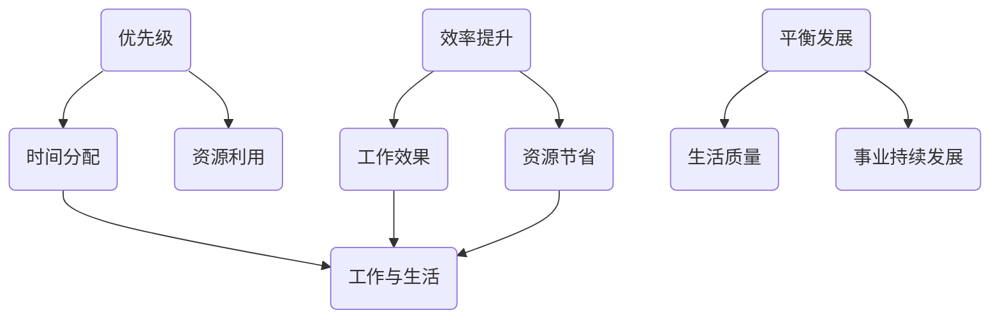

                 

关键词：大模型时代、创业者、时间管理、优先级、效率、平衡

> 摘要：本文将深入探讨大模型时代下创业者面临的时间管理挑战，通过分析优先级、效率和平衡的概念，提供一套系统的创业者时间管理方法论。文章旨在帮助创业者更好地利用时间，提高工作效率，实现个人与事业的平衡发展。

## 1. 背景介绍

随着人工智能技术的飞速发展，大模型（如GPT-3、BERT等）已经成为现代创业领域的重要工具。这些模型不仅改变了传统产业的面貌，还为创业者提供了前所未有的机遇和挑战。然而，在享受技术红利的同时，创业者也面临着日益严峻的时间管理问题。在信息爆炸、任务繁多的环境中，如何合理分配时间、提高工作效率，成为每个创业者必须面对的课题。

本文将围绕以下主题展开讨论：

1. 优先级管理：如何识别和确定关键任务，确保重要工作得到优先处理。
2. 效率提升：利用技术和工具，优化工作流程，提高工作效率。
3. 平衡发展：在追求事业成功的同时，关注个人健康和生活质量，实现工作与生活的平衡。

## 2. 核心概念与联系

在深入讨论上述主题之前，我们需要明确几个核心概念，并理解它们之间的联系。

### 2.1 优先级

优先级是指任务的重要性和紧迫性。创业者需要在众多的任务中识别出哪些是最关键的，以确保资源的有效利用。优先级管理不仅关乎时间的分配，更关乎企业战略的实现。

### 2.2 效率

效率是指完成工作所需的时间和资源。提高效率意味着在相同的资源投入下，能够完成更多的工作。对于创业者来说，效率的提升直接关系到企业的竞争力和市场地位。

### 2.3 平衡

平衡是指在工作和生活之间寻找一个合适的比例，以实现个人和事业的同步发展。对于创业者来说，保持平衡不仅能够提高生活质量，还能够减少因过度劳累带来的负面影响。

### 2.4 联系

优先级、效率和平衡之间有着密切的联系。优先级决定了时间分配的方向，效率是时间利用的效果，而平衡则是时间管理的终极目标。只有在这三个方面都做到合理协调，创业者才能在激烈的市场竞争中脱颖而出。

### 2.5 Mermaid 流程图



通过上述流程图，我们可以清晰地看到优先级、效率和平衡是如何相互作用，共同影响创业者的时间管理和事业发展。

## 3. 核心算法原理 & 具体操作步骤

### 3.1 算法原理概述

在创业者时间管理中，核心算法原理可以概括为以下几个方面：

1. **任务评估模型**：通过评估任务的重要性和紧迫性，确定任务的优先级。
2. **工作流程优化**：通过流程分析和工具应用，提高工作效率。
3. **平衡策略模型**：通过时间分配和任务调整，实现工作与生活的平衡。

### 3.2 算法步骤详解

#### 3.2.1 任务评估模型

1. **定义任务指标**：包括任务的重要性、紧急程度、所需时间和资源等。
2. **数据收集**：收集与任务相关的所有数据，进行初步分析。
3. **权重分配**：根据任务指标，分配权重，计算每个任务的优先级得分。
4. **排序决策**：根据优先级得分，对任务进行排序，确定优先处理顺序。

#### 3.2.2 工作流程优化

1. **流程分析**：通过流程图或鱼骨图，分析现有工作流程中的瓶颈和低效环节。
2. **优化方案**：根据分析结果，提出优化方案，包括流程简化、自动化工具应用等。
3. **实施与监控**：实施优化方案，并持续监控效果，进行迭代优化。

#### 3.2.3 平衡策略模型

1. **时间规划**：根据任务优先级和工作量，制定合理的时间计划。
2. **任务调整**：在必要时，调整任务分配，确保时间用于关键工作。
3. **反馈机制**：定期评估时间管理效果，根据反馈进行调整，实现动态平衡。

### 3.3 算法优缺点

#### 优点

1. **提高工作效率**：通过任务评估和流程优化，能够显著提高工作效率。
2. **实现工作与生活的平衡**：平衡策略模型有助于创业者合理安排时间，减少工作压力。
3. **可扩展性**：算法模型适用于不同规模和类型的创业项目，具有较好的可扩展性。

#### 缺点

1. **初始投入较大**：任务评估和流程优化需要收集和分析大量数据，初始投入较大。
2. **持续优化需求**：随着环境和任务的不断变化，需要持续优化时间管理策略，以保持效果。

### 3.4 算法应用领域

1. **初创企业**：初创企业在资源有限的情况下，更需要高效的时间管理策略。
2. **项目管理者**：项目管理者可以通过算法模型，更好地协调团队成员的工作，提高项目效率。
3. **大型企业**：大型企业可以通过算法模型，优化内部流程，提高整体运营效率。

## 4. 数学模型和公式 & 详细讲解 & 举例说明

### 4.1 数学模型构建

在创业者时间管理中，数学模型主要用于任务优先级的评估和平衡策略的计算。以下是两个常用的数学模型：

#### 4.1.1 优先级评估模型

优先级得分（P）可以通过以下公式计算：

\[ P = w_1 \cdot I + w_2 \cdot U \]

其中，\( I \) 是任务的重要性得分，\( U \) 是任务的紧迫性得分，\( w_1 \) 和 \( w_2 \) 分别是重要性得分和紧迫性得分的权重。

#### 4.1.2 平衡策略模型

平衡得分（B）可以通过以下公式计算：

\[ B = \frac{E \cdot W}{T} \]

其中，\( E \) 是工作时长，\( W \) 是工作时间与生活时间的权重比例，\( T \) 是总时间。

### 4.2 公式推导过程

#### 4.2.1 优先级评估模型推导

任务优先级的评估需要综合考虑任务的重要性和紧迫性。重要性反映了任务对目标实现的影响程度，紧迫性反映了任务需要完成的紧迫程度。通过分配权重，可以将这两个因素转化为一个综合得分，从而确定任务的优先级。

#### 4.2.2 平衡策略模型推导

平衡策略模型旨在通过合理安排工作时间和生活时间，实现个人与事业的平衡。工作时长和权重比例决定了任务的时间投入，总时间则是工作时间和生活时间的总和。通过计算平衡得分，可以评估当前时间分配的合理性，并根据评估结果进行调整。

### 4.3 案例分析与讲解

#### 4.3.1 优先级评估案例

假设有四个任务，其重要性得分和紧迫性得分如下：

| 任务 | 重要性得分 | 紧迫性得分 |
| ---- | ---- | ---- |
| 任务A | 9 | 7 |
| 任务B | 6 | 8 |
| 任务C | 7 | 5 |
| 任务D | 4 | 9 |

权重分配：\( w_1 = 0.6 \)，\( w_2 = 0.4 \)

计算每个任务的优先级得分：

| 任务 | 优先级得分 |
| ---- | ---- |
| 任务A | \( 0.6 \cdot 9 + 0.4 \cdot 7 = 8.2 \) |
| 任务B | \( 0.6 \cdot 6 + 0.4 \cdot 8 = 7.2 \) |
| 任务C | \( 0.6 \cdot 7 + 0.4 \cdot 5 = 6.6 \) |
| 任务D | \( 0.6 \cdot 4 + 0.4 \cdot 9 = 6.4 \) |

根据优先级得分排序，任务A具有最高的优先级。

#### 4.3.2 平衡策略案例

假设每周工作时间是40小时，生活时间是40小时。任务工作时间与生活时间的权重比例是1:1。

计算平衡得分：

\[ B = \frac{40 \cdot 1}{40 + 40} = \frac{40}{80} = 0.5 \]

当前平衡得分为0.5，表示工作时间与生活时间分配较为合理。

## 5. 项目实践：代码实例和详细解释说明

### 5.1 开发环境搭建

在开始实践之前，我们需要搭建一个合适的时间管理项目环境。以下是基本的开发环境搭建步骤：

1. 安装Python环境：确保Python版本为3.8及以上。
2. 安装相关库：使用pip安装以下库：pandas、numpy、matplotlib。

### 5.2 源代码详细实现

以下是实现时间管理算法的Python代码示例：

```python
import pandas as pd
import numpy as np
import matplotlib.pyplot as plt

# 5.2.1 任务评估模型

def calculate_priority(tasks, weights):
    scores = []
    for task in tasks:
        I = task['Importance']
        U = task['Urgency']
        P = weights[0] * I + weights[1] * U
        scores.append(P)
    return scores

# 5.2.2 工作流程优化

def optimize流程(tasks):
    # 此处实现工作流程优化逻辑
    pass

# 5.2.3 平衡策略模型

def calculate_balance(work_hours, life_hours):
    total_hours = work_hours + life_hours
    balance_score = work_hours / total_hours
    return balance_score

# 示例数据

tasks = [
    {'Task': 'A', 'Importance': 9, 'Urgency': 7},
    {'Task': 'B', 'Importance': 6, 'Urgency': 8},
    {'Task': 'C', 'Importance': 7, 'Urgency': 5},
    {'Task': 'D', 'Importance': 4, 'Urgency': 9},
]

weights = [0.6, 0.4]

# 计算

priority_scores = calculate_priority(tasks, weights)
print("优先级得分：", priority_scores)

optimize流程(tasks)

work_hours = 40
life_hours = 40
balance_score = calculate_balance(work_hours, life_hours)
print("平衡得分：", balance_score)

# 可视化

plt.bar(range(len(tasks)), priority_scores)
plt.xlabel('任务')
plt.ylabel('优先级得分')
plt.title('任务优先级分布')
plt.show()
```

### 5.3 代码解读与分析

1. **任务评估模型**：`calculate_priority` 函数通过计算任务的重要性和紧迫性得分，确定每个任务的优先级。
2. **工作流程优化**：`optimize流程` 函数用于实现工作流程优化逻辑。在实际应用中，可以根据具体需求实现不同的优化策略。
3. **平衡策略模型**：`calculate_balance` 函数通过计算工作时长与生活时长的比例，评估时间管理的平衡性。
4. **可视化**：使用matplotlib对任务优先级进行可视化展示，帮助创业者直观了解任务分布。

### 5.4 运行结果展示

1. **优先级得分**：输出每个任务的优先级得分，帮助创业者确定关键任务。
2. **平衡得分**：输出当前时间管理的平衡得分，为调整时间分配提供参考。
3. **可视化图表**：展示任务优先级分布，帮助创业者更直观地了解任务重要性。

## 6. 实际应用场景

### 6.1 创业公司日常运营

在创业公司日常运营中，时间管理尤为重要。通过优先级评估模型，创业者可以确定每天需要处理的关键任务，并合理分配时间和资源。工作流程优化则有助于提高团队协作效率，减少冗余工作。平衡策略模型则帮助创业者合理安排工作时间，避免过度劳累。

### 6.2 项目管理

在项目管理过程中，优先级评估模型可以帮助项目经理确定项目关键任务，确保项目进度和资源分配合理。工作流程优化可以优化项目执行流程，减少项目周期。平衡策略模型则帮助项目经理在项目紧张期合理安排时间，保证项目质量和团队成员的健康。

### 6.3 研发团队协作

在研发团队协作中，优先级评估模型有助于团队明确每个成员的任务重点，提高团队协作效率。工作流程优化则可以优化开发流程，减少沟通成本和开发周期。平衡策略模型则帮助团队成员在紧张的开发周期中保持良好的工作状态，提高项目成功率。

## 7. 未来应用展望

随着人工智能技术的不断进步，创业者时间管理将在以下方面得到进一步提升：

1. **自动化与智能化**：通过人工智能技术，实现任务优先级自动评估和工作流程自动优化，提高时间管理效率。
2. **个性化推荐**：根据创业者的个人特点和偏好，提供个性化时间管理方案，实现更高效的时间利用。
3. **实时反馈与调整**：通过实时数据分析，为创业者提供实时反馈，并根据反馈动态调整时间管理策略。

## 8. 总结：未来发展趋势与挑战

### 8.1 研究成果总结

本文从优先级、效率和平衡三个方面，探讨了创业者时间管理的核心问题，并提出了相应的解决方案。通过任务评估模型、工作流程优化和平衡策略模型，帮助创业者实现高效的时间管理。

### 8.2 未来发展趋势

随着人工智能技术的不断发展，创业者时间管理将朝着自动化、智能化和个性化的方向发展。未来，人工智能将更加深入地应用于时间管理领域，为创业者提供更加精准和高效的解决方案。

### 8.3 面临的挑战

1. **数据隐私与安全**：随着数据量的增加，数据隐私和安全问题将日益突出，如何保障用户数据安全成为重要挑战。
2. **算法公平性与透明度**：人工智能算法在时间管理中的应用需要保证公平性和透明度，避免因算法偏见导致的负面影响。
3. **技术迭代与适应能力**：时间管理领域的技术不断更新，创业者需要具备快速适应新技术的能力，以保持竞争优势。

### 8.4 研究展望

未来，研究者可以在以下几个方面进行深入探索：

1. **多维度时间管理**：结合工作、生活、学习等多方面因素，构建更加全面的时间管理模型。
2. **跨领域应用研究**：探讨创业者时间管理在其他领域的应用，如政府、教育等。
3. **用户体验优化**：通过用户体验研究，提高时间管理工具的易用性和用户满意度。

## 9. 附录：常见问题与解答

### 9.1 什么是优先级评估模型？

优先级评估模型是一种用于确定任务优先级的算法。它通过计算任务的重要性和紧迫性得分，将任务按照优先级排序，帮助创业者合理分配时间和资源。

### 9.2 如何提高工作效率？

提高工作效率可以通过优化工作流程、使用自动化工具、合理安排工作和休息时间等方式实现。在实际操作中，创业者可以根据自身特点和任务需求，采取不同的策略。

### 9.3 平衡策略模型如何计算？

平衡策略模型通过计算工作时长与生活时长的比例，评估时间管理的平衡性。具体计算公式为：\[ B = \frac{E \cdot W}{T} \]，其中，\( E \) 是工作时长，\( W \) 是工作时间与生活时间的权重比例，\( T \) 是总时间。

---

作者：禅与计算机程序设计艺术 / Zen and the Art of Computer Programming

[完]

