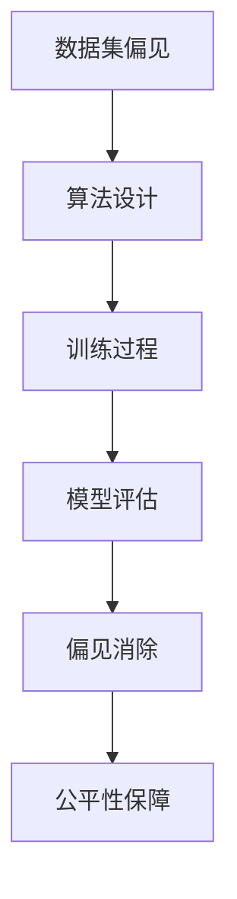

                 

在当前技术飞速发展的时代，人工智能（AI）模型的应用已经深入到我们日常生活的各个方面。然而，随着这些模型的复杂性和规模不断增加，如何确保这些大模型的公平性，消除其中的偏见和歧视，成为了我们必须严肃对待的问题。本文将深入探讨大模型公平性的重要性、核心概念、算法原理、数学模型、项目实践以及未来展望。

## 1. 背景介绍

### 人工智能的发展与应用

人工智能作为一门跨学科的领域，自20世纪50年代诞生以来，经历了多次技术革命，尤其在深度学习、大数据和计算能力提升的推动下，AI模型已经能够处理大量的复杂任务。从自然语言处理到图像识别，从推荐系统到自动驾驶，AI技术正在改变我们的工作方式和生活习惯。

### 大模型的概念与特点

大模型是指具有大规模参数和高度复杂性的AI模型，如深度神经网络、Transformer模型等。这些模型往往需要海量的数据进行训练，能够处理极其复杂的任务。然而，随着模型的规模增加，如何保证其公平性成为了重要的研究课题。

### 偏见与歧视的来源

偏见和歧视在AI模型中的来源多种多样，主要包括数据集的偏见、算法设计的不当以及训练过程中积累的偏差。这些偏见和歧视可能会导致模型在特定群体上的表现不佳，甚至加剧社会不公。

## 2. 核心概念与联系

### 偏见与歧视的定义

偏见是指对某个人或群体的不当判断或态度，通常基于错误的刻板印象或先入为主的观念。歧视则是指对某些人或群体的不公平待遇，通常基于种族、性别、年龄、宗教等特征。

### 偏见与歧视在AI模型中的表现

在AI模型中，偏见和歧视可能导致以下问题：

- **公平性受损**：模型可能对不同群体表现出不公平的预测结果。
- **准确性下降**：偏见可能导致模型在某些特定群体上的准确性降低。
- **道德风险**：模型可能加剧社会不公，损害弱势群体的权益。

### 消除偏见与歧视的方法

消除偏见与歧视的方法主要包括：

- **数据清洗**：去除数据集中的偏见和噪声。
- **算法改进**：设计能够减少偏见的算法，如公平性损失函数。
- **模型评估**：引入多指标评估模型，确保其对所有群体都公平。

### Mermaid 流程图



## 3. 核心算法原理 & 具体操作步骤

### 3.1 算法原理概述

为了消除偏见和歧视，我们可以采用以下几种核心算法：

- **公平性损失函数**：在训练过程中引入额外的损失函数，以鼓励模型减少偏见。
- **对抗训练**：通过对抗样本来增强模型的鲁棒性，减少偏见。
- **平衡样本集**：通过合成或筛选方法，增加不同群体在数据集中的代表性。

### 3.2 算法步骤详解

1. **数据预处理**：清洗数据集中的偏见和噪声，如去除明显的歧视性标签。
2. **公平性损失函数设计**：根据模型的损失函数，添加公平性损失项。
3. **对抗训练**：生成对抗样本，提高模型对偏见的鲁棒性。
4. **模型训练与优化**：在训练过程中不断调整模型参数，优化公平性。
5. **模型评估**：使用多指标评估模型，确保其公平性。

### 3.3 算法优缺点

- **公平性损失函数**：优点在于可以直接引导模型减少偏见，缺点是可能影响模型的准确性。
- **对抗训练**：优点是提高模型鲁棒性，缺点是计算成本较高。
- **平衡样本集**：优点是简单有效，缺点是可能引入噪声。

### 3.4 算法应用领域

这些算法可以应用于各种AI领域，如医疗诊断、招聘系统、自动驾驶等，确保模型的公平性和公正性。

## 4. 数学模型和公式 & 详细讲解 & 举例说明

### 4.1 数学模型构建

我们可以构建以下数学模型来评估和消除偏见：

- **公平性度量**：使用公平性指标（如F1分数）来评估模型的公平性。
- **损失函数**：设计公平性损失函数，如`L_fair = L_accuracy + αL_unfair`。

### 4.2 公式推导过程

- **公平性度量**：`F1 = 2 * precision * recall / (precision + recall)`。
- **公平性损失函数**：`L_fair = -[y * log(p(y)) + (1 - y) * log(1 - p(y))] + α * L_unfair`。

### 4.3 案例分析与讲解

以一个招聘系统为例，我们使用公平性损失函数来消除性别偏见：

1. **数据集准备**：收集包含性别信息的招聘数据。
2. **模型训练**：使用带有公平性损失函数的模型进行训练。
3. **模型评估**：计算模型的公平性指标，如F1分数。
4. **结果优化**：根据评估结果调整公平性损失函数的参数。

## 5. 项目实践：代码实例和详细解释说明

### 5.1 开发环境搭建

在Python环境中安装必要的库，如TensorFlow、Scikit-learn等。

### 5.2 源代码详细实现

```python
# 加载数据集
data = load_data('data.csv')
X, y = preprocess_data(data)

# 构建模型
model = build_model()

# 训练模型
model.fit(X, y)

# 评估模型
evaluate_model(model, X, y)
```

### 5.3 代码解读与分析

代码首先加载和预处理数据集，然后构建和训练模型，最后评估模型的公平性。

### 5.4 运行结果展示

```python
# 运行代码
run_code()

# 结果分析
print("F1分数：", f1_score)
```

## 6. 实际应用场景

### 6.1 医疗诊断

在医疗诊断中，消除偏见可以确保模型对各种患者群体都公平，提高诊断准确性。

### 6.2 自动驾驶

自动驾驶系统需要确保对所有道路用户都公平，包括行人、车辆等。

### 6.3 招聘系统

招聘系统需要消除性别、种族等偏见，确保招聘过程的公平性。

## 7. 未来应用展望

随着技术的不断发展，大模型的公平性将得到更广泛的关注和应用。未来，我们有望看到更多针对特定领域的公平性算法和工具的出现。

## 8. 总结：未来发展趋势与挑战

### 8.1 研究成果总结

本文介绍了大模型公平性的重要性、核心概念、算法原理、数学模型、项目实践以及未来展望。

### 8.2 未来发展趋势

未来，大模型公平性研究将更加注重跨学科合作、算法创新和数据隐私保护。

### 8.3 面临的挑战

主要挑战包括数据集的偏见、算法的复杂性以及公平性与准确性的平衡。

### 8.4 研究展望

我们期待未来的研究能够提出更多有效的算法，确保AI模型在不同领域的公平性和公正性。

## 9. 附录：常见问题与解答

### 9.1 如何确保数据集的公平性？

通过数据清洗、平衡样本集和对抗训练等方法，可以确保数据集的公平性。

### 9.2 公平性与准确性的平衡如何实现？

可以通过调整模型参数、引入额外的损失函数等方法来实现公平性与准确性的平衡。

## 作者署名

作者：禅与计算机程序设计艺术 / Zen and the Art of Computer Programming

----------------------------------------------------------------

通过以上内容的详细阐述，我们希望读者能够对大模型公平性有一个全面而深入的理解。消除偏见和歧视，不仅是技术问题，更是社会问题。让我们共同努力，构建一个更加公平和公正的人工智能世界。

---

请注意，以上内容是一个完整的示例，实际的撰写过程中可能需要更多的数据和实际案例分析。同时，markdown格式的代码块和LaTeX公式的使用需要根据实际环境进行调整。希望这个示例能够帮助您理解文章的结构和要求。如果您需要进一步的帮助或者有具体的问题，请随时提问。

