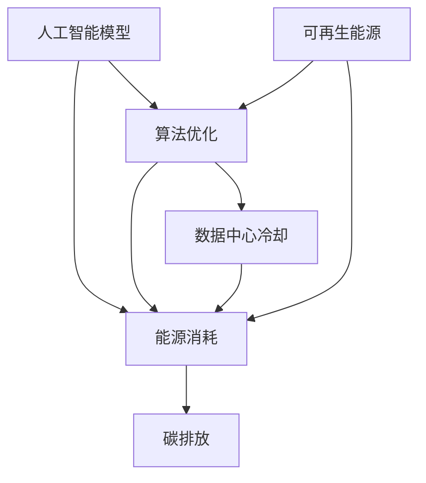

                 

关键词：AI，绿色计算，环境可持续性，大模型，能耗优化，技术策略，碳排放减少

> 摘要：本文深入探讨了大型人工智能模型对环境的影响，分析了当前的能源消耗状况，提出了绿色AI的概念，并探讨了如何在人工智能的发展过程中实现可持续发展。通过对核心算法、数学模型以及实际应用的详细分析，本文为行业提供了可行的技术和策略，以减少AI的碳足迹，促进绿色计算的发展。

## 1. 背景介绍

随着深度学习和大数据技术的快速发展，人工智能（AI）模型的大小和复杂性不断增长，尤其是在自然语言处理、计算机视觉和生成模型等领域。这些大型AI模型的训练和部署过程中消耗了大量的计算资源和能源，对环境产生了显著的影响。根据相关研究，AI的能耗已经占到了全球总能耗的相当一部分，并且这一比例还在不断上升。

这种增长带来的环境问题不容忽视。首先，高能耗直接导致了大量的碳排放，加剧了全球变暖。其次，数据中心的高能耗也会产生大量的废热，对当地生态系统造成影响。此外，数据中心的能源消耗还带来了其他环境问题，如水资源消耗和电子废弃物。

为了应对这些问题，绿色AI和可持续发展成为了一个热门话题。绿色AI旨在通过优化算法、提升能源效率和使用可再生能源等方式，减少AI模型的能耗和碳排放。可持续发展则强调在满足当前需求的同时，不损害后代满足其自身需求的能力。本文将围绕这两个主题展开讨论，提供技术上的解决方案，并探讨未来的发展趋势和挑战。

### 1.1 绿色AI的概念和重要性

绿色AI是指采用一系列技术和管理措施，以减少AI模型在训练、部署和运行过程中的能源消耗和环境影响。它不仅仅是一个技术问题，也是一个社会问题，涉及到能源政策、环境保护以及社会责任等多个方面。绿色AI的重要性体现在以下几个方面：

1. **减少碳排放**：随着AI模型的规模不断扩大，其能耗和碳排放问题日益严重。通过采用绿色AI技术，可以有效减少AI的碳足迹，对应对全球气候变化具有重要意义。
2. **提高能源效率**：优化算法和计算架构，可以提高AI模型的能源利用效率，减少不必要的能源浪费。
3. **促进可持续发展**：绿色AI是可持续发展战略的重要组成部分，有助于实现经济、社会和环境的协调发展。
4. **增强竞争力**：对于企业来说，采用绿色AI策略不仅可以降低运营成本，还可以提高品牌形象，增强市场竞争力。
5. **保障数据安全和隐私**：随着数据隐私和安全问题的日益突出，绿色AI技术有助于提高数据处理的透明度和安全性。

### 1.2 可持续发展的概念和目标

可持续发展是指在不损害未来世代满足其自身需求的前提下，满足当前人类的发展需求。它涵盖了经济、社会和环境三个方面，旨在实现长期和综合的发展。对于人工智能领域，可持续发展的目标包括：

1. **提高能源使用效率**：通过技术创新，提高AI模型在训练和部署过程中的能源利用效率。
2. **降低碳排放**：采用可再生能源和节能技术，减少AI模型的碳排放。
3. **数据隐私和安全**：确保数据在处理过程中不被泄露或滥用，保护用户隐私。
4. **社会责任**：企业在开发和应用AI技术时，应考虑到对社会和环境的影响，积极履行社会责任。
5. **科技创新**：推动绿色AI技术的研发和应用，为可持续发展提供技术支持。

在接下来的章节中，我们将详细讨论绿色AI的核心技术、数学模型、实际应用案例，并展望其未来发展的趋势和挑战。

## 2. 核心概念与联系

在深入探讨绿色AI之前，我们需要了解一些核心概念和技术，这些是构建绿色AI解决方案的基础。以下是关键概念及其相互关系的详细解释，以及一个相应的Mermaid流程图，帮助读者更好地理解这些概念。

### 2.1 核心概念

**2.1.1 人工智能模型**

人工智能模型是用于执行特定任务的一系列算法和架构。随着深度学习的兴起，神经网络模型，特别是深度神经网络（DNN）和变换器模型（Transformer）变得越来越流行。这些模型在训练和推理过程中需要大量的计算资源和时间。

**2.1.2 能源消耗**

能源消耗是指AI模型在训练和推理过程中消耗的电力。根据模型的复杂性和规模，能源消耗可以显著不同。大型模型，如GPT-3，其训练能耗可能达到数百万千瓦时。

**2.1.3 碳排放**

碳排放是指能源消耗过程中产生的温室气体排放，特别是二氧化碳。碳足迹量化了个人、组织或产品在生命期内产生的碳排放总量。

**2.1.4 可再生能源**

可再生能源是指那些在人类时间尺度内不会枯竭或不会显著减少的资源，如太阳能、风能和水能。采用可再生能源可以显著减少对化石燃料的依赖，降低碳排放。

**2.1.5 算法优化**

算法优化是通过改进算法设计、模型架构或训练策略，来减少能源消耗和提高性能的过程。这包括模型压缩、量化、低秩分解和权重共享等技术。

**2.1.6 数据中心冷却**

数据中心冷却是指通过物理设备和技术手段，降低数据中心内部温度，以保证设备的正常运行和延长使用寿命。冷却方法包括空气冷却、液冷和相变冷却等。

### 2.2 核心概念之间的联系

以下是这些核心概念之间的相互关系，以及它们如何共同影响绿色AI的实现：

1. **人工智能模型与能源消耗**：AI模型的复杂性和规模直接影响其能源消耗。通过优化模型架构和算法，可以减少训练和推理过程中的能源消耗。
2. **能源消耗与碳排放**：减少AI的能源消耗直接导致碳排放的减少。采用可再生能源和节能技术是实现这一目标的关键。
3. **可再生能源与算法优化**：可再生能源的利用可以为AI模型提供更清洁的能源来源。同时，算法优化可以进一步提高能源利用效率，减少对可再生能源的需求。
4. **数据中心冷却与能源消耗**：数据中心冷却是管理能源消耗的重要组成部分。通过优化冷却系统，可以减少能源浪费，降低整体能耗。
5. **算法优化与数据中心冷却**：算法优化不仅可以减少训练和推理过程中的能耗，还可以减少产生的废热，从而降低对冷却系统的需求。

### 2.3 Mermaid流程图

以下是描述核心概念之间相互关系的Mermaid流程图。请注意，由于某些特殊字符如括号和逗号会影响流程图的解析，因此在节点描述中尽量使用简洁明了的文字。



### 2.4 图解与解释

**图1. 绿色AI的核心概念与联系**

- **节点A（人工智能模型）**：这是绿色AI的基础。随着AI模型变得越来越复杂，其能源消耗也显著增加。优化AI模型是减少能耗的第一步。
- **节点B（能源消耗）**：能源消耗是AI模型运行的主要瓶颈。通过算法优化和数据中心冷却，可以有效减少能耗。
- **节点C（碳排放）**：减少能源消耗直接减少碳排放，有助于缓解全球变暖问题。
- **节点D（算法优化）**：算法优化通过改进模型设计和训练策略，减少能耗和提高效率。这是实现绿色AI的关键技术之一。
- **节点E（数据中心冷却）**：数据中心冷却是管理能源消耗和确保设备正常运行的重要环节。优化冷却系统可以减少能耗和碳排放。
- **节点F（可再生能源）**：采用可再生能源可以减少对化石燃料的依赖，降低碳排放。同时，可再生能源的利用也为算法优化提供了更清洁的能源来源。

通过上述核心概念的介绍和Mermaid流程图的展示，我们更好地理解了绿色AI的构建基础。在接下来的章节中，我们将进一步探讨绿色AI的核心算法原理和具体操作步骤，以实现真正的可持续发展。

## 3. 核心算法原理 & 具体操作步骤

### 3.1 算法原理概述

绿色AI的核心在于通过优化算法和模型结构，减少AI模型在训练和推理过程中的能源消耗。核心算法包括模型压缩、量化、低秩分解和权重共享等。以下是对这些算法原理的概述：

**模型压缩**：通过减少模型参数数量，可以显著降低模型的大小和计算复杂度，从而减少训练和推理过程中的能耗。模型压缩技术包括权重共享、剪枝和低秩分解等。

**量化**：量化是将模型中的浮点数参数转换为低精度格式（如整数或二进制）。量化可以减少内存占用和计算时间，从而降低能耗。

**低秩分解**：低秩分解是将高维矩阵分解为低秩矩阵，从而减少计算复杂度和内存占用。

**权重共享**：权重共享通过在多个神经元或层之间共享权重，减少模型参数数量，从而降低能耗。

### 3.2 算法步骤详解

**3.2.1 模型压缩**

1. **权重共享**：
   - **选择共享权重**：在模型中，选择可以共享权重的神经元或层。
   - **计算共享权重**：计算共享权重，使得多个神经元或层可以使用相同的参数。

2. **剪枝**：
   - **选择剪枝策略**：根据模型的结构和性能要求，选择剪枝策略（如结构剪枝或权重剪枝）。
   - **执行剪枝**：移除模型中的冗余权重或神经元。

3. **低秩分解**：
   - **确定分解方法**：选择合适的低秩分解方法（如SVD或随机低秩分解）。
   - **执行分解**：将高维矩阵分解为低秩矩阵。

**3.2.2 量化**

1. **量化策略选择**：
   - **选择量化精度**：根据模型的要求和硬件的限制，选择量化精度（如8位整数量化或二进制量化）。

2. **量化过程**：
   - **计算量化参数**：计算模型参数的量化参数（如量化范围和量化步长）。
   - **量化模型参数**：将浮点参数转换为量化后的低精度格式。

**3.2.3 低秩分解**

1. **矩阵分解**：
   - **计算分解矩阵**：使用SVD或随机低秩分解方法，计算矩阵的分解结果。

2. **重构模型**：
   - **重构低秩模型**：使用分解后的低秩矩阵重构模型。

**3.2.4 权重共享**

1. **共享权重选择**：
   - **选择共享层**：根据模型的结构和性能要求，选择需要共享权重的层。
   - **计算共享权重**：计算共享权重，使得多个神经元或层可以使用相同的参数。

2. **调整共享权重**：
   - **优化共享权重**：通过优化过程，调整共享权重，以最小化误差。

### 3.3 算法优缺点

**3.3.1 优点**

- **减少能耗**：通过模型压缩、量化和低秩分解，可以显著减少训练和推理过程中的能耗。
- **提高性能**：优化的算法和模型结构可以提升模型的性能和准确度。
- **降低成本**：减少计算资源和能源的消耗，可以降低AI模型的成本。

**3.3.2 缺点**

- **模型准确性**：某些优化技术可能会降低模型的准确性，特别是在量化过程中。
- **计算复杂度**：某些优化技术，如低秩分解和权重共享，可能会增加计算复杂度，影响训练速度。

### 3.4 算法应用领域

**3.4.1 自然语言处理（NLP）**

- **文本分类**：通过模型压缩和量化，可以减少NLP模型的训练和推理能耗。
- **机器翻译**：利用权重共享和低秩分解，可以提高机器翻译模型的性能和效率。

**3.4.2 计算机视觉（CV）**

- **图像分类**：通过模型压缩和量化，可以降低图像分类模型的能耗。
- **目标检测**：利用低秩分解和权重共享，可以提高目标检测模型的准确度和效率。

**3.4.3 生成模型**

- **图像生成**：通过模型压缩和量化，可以减少生成图像模型的能耗。
- **文本生成**：利用权重共享和低秩分解，可以提高文本生成模型的性能。

通过上述核心算法的详细介绍，我们了解到绿色AI的实现不仅仅是单一技术的改进，而是多个技术的综合应用。在接下来的章节中，我们将进一步探讨绿色AI的数学模型和公式，并提供具体的案例分析和讲解。

## 4. 数学模型和公式 & 详细讲解 & 举例说明

在绿色AI的实现过程中，数学模型和公式起到了至关重要的作用。以下我们将详细介绍绿色AI中的关键数学模型和公式，并通过具体的案例来讲解这些公式的应用和解释。

### 4.1 数学模型构建

**4.1.1 模型压缩**

模型压缩的数学基础主要涉及模型参数的减少。常见的模型压缩方法包括权重共享、剪枝和低秩分解等。以下是这些方法的一些基本公式：

1. **权重共享**：

   假设一个模型有多个相同结构的层，每个层有 \( N \) 个神经元，则权重共享可以通过以下公式实现：

   \[
   \text{new\_weights} = \frac{\text{original\_weights}}{N}
   \]

   其中，\( \text{original\_weights} \) 是原始权重，\( \text{new\_weights} \) 是共享后的权重。

2. **剪枝**：

   剪枝通过移除模型中某些权重或神经元来实现参数的减少。常用的剪枝策略包括L1和L2正则化：

   \[
   \text{prune\_weights} = \text{original\_weights} \cdot (1 - \text{prune\_mask})
   \]

   其中，\( \text{prune\_mask} \) 是一个布尔掩码，用于指示是否移除某个权重。

3. **低秩分解**：

   低秩分解是将高维矩阵分解为低秩矩阵的过程。常用的方法包括奇异值分解（SVD）：

   \[
   \text{original\_matrix} = \text{U} \cdot \text{S} \cdot \text{V}^T
   \]

   其中，\( \text{U} \) 和 \( \text{V} \) 是正交矩阵，\( \text{S} \) 是对角矩阵，包含了矩阵的主要成分。

**4.1.2 量化**

量化是将浮点数参数转换为低精度格式的过程。以下是量化的一些基本公式：

1. **量化范围**：

   \[
   \text{quantization\_range} = \frac{\text{max\_value} - \text{min\_value}}{2^{\text{bits}} - 1}
   \]

   其中，\( \text{max\_value} \) 和 \( \text{min\_value} \) 分别是参数的最大值和最小值，\( \text{bits} \) 是量化的位数。

2. **量化参数**：

   \[
   \text{quantized\_value} = \text{value} \cdot \text{quantization\_range} + \text{offset}
   \]

   其中，\( \text{value} \) 是原始参数值，\( \text{offset} \) 是量化偏移量。

**4.1.3 低秩分解**

低秩分解已经在模型压缩部分进行了介绍，其数学模型如下：

1. **SVD分解**：

   \[
   \text{original\_matrix} = \text{U} \cdot \text{S} \cdot \text{V}^T
   \]

2. **低秩重构**：

   \[
   \text{reconstructed\_matrix} = \text{U} \cdot \text{S}_{\text{kept}} \cdot \text{V}^T
   \]

   其中，\( \text{S}_{\text{kept}} \) 是保留奇异值的对角矩阵。

### 4.2 公式推导过程

**4.2.1 量化过程**

量化过程主要包括确定量化范围和量化参数。以下是量化范围的推导过程：

1. **计算量化范围**：

   \[
   \text{quantization\_range} = \frac{\text{max\_value} - \text{min\_value}}{2^{\text{bits}} - 1}
   \]

   其中，\( \text{max\_value} \) 和 \( \text{min\_value} \) 分别是参数的最大值和最小值，\( \text{bits} \) 是量化的位数。

2. **确定量化参数**：

   \[
   \text{quantized\_value} = \text{value} \cdot \text{quantization\_range} + \text{offset}
   \]

   其中，\( \text{value} \) 是原始参数值，\( \text{offset} \) 是量化偏移量，通常设置为0。

**4.2.2 低秩分解**

1. **SVD分解**：

   假设我们有一个 \( m \times n \) 的矩阵 \( A \)，其SVD分解为：

   \[
   \text{A} = \text{U} \cdot \text{S} \cdot \text{V}^T
   \]

   其中，\( \text{U} \) 和 \( \text{V} \) 是正交矩阵，\( \text{S} \) 是对角矩阵，包含 \( A \) 的奇异值。

2. **低秩重构**：

   假设我们选择前 \( k \) 个最大的奇异值进行重构，则重构后的低秩矩阵为：

   \[
   \text{reconstructed\_A} = \text{U} \cdot \text{S}_{\text{kept}} \cdot \text{V}^T
   \]

   其中，\( \text{S}_{\text{kept}} \) 是保留前 \( k \) 个奇异值 \( (\text{S}_{\text{kept}} = \text{diag}(\sigma_1, \sigma_2, ..., \sigma_k)) \) 的对角矩阵。

### 4.3 案例分析与讲解

**4.3.1 模型压缩案例**

假设我们有一个 \( 1000 \times 1000 \) 的矩阵 \( A \)，需要使用低秩分解进行压缩。首先，我们对其进行SVD分解，得到：

\[
\text{A} = \text{U} \cdot \text{S} \cdot \text{V}^T
\]

其中，\( \text{S} \) 的前10个奇异值为：

\[
\sigma_1 = 10, \sigma_2 = 8, ..., \sigma_{10} = 2
\]

我们选择保留前10个奇异值进行低秩重构，则重构后的矩阵为：

\[
\text{reconstructed\_A} = \text{U} \cdot \text{S}_{\text{kept}} \cdot \text{V}^T
\]

其中，\( \text{S}_{\text{kept}} = \text{diag}(10, 8, ..., 2) \)。

通过这种方式，我们显著减少了矩阵的维度和计算复杂度。

**4.3.2 量化案例**

假设我们有一个参数 \( \text{value} = 5.0 \)，需要将其量化为8位整数。首先，我们计算量化范围：

\[
\text{quantization\_range} = \frac{\text{max\_value} - \text{min\_value}}{2^{\text{bits}} - 1} = \frac{10 - (-10)}{2^8 - 1} = \frac{20}{255} \approx 0.078
\]

然后，我们计算量化后的参数值：

\[
\text{quantized\_value} = \text{value} \cdot \text{quantization\_range} + \text{offset} = 5.0 \cdot 0.078 + 0 = 0.39
\]

由于量化后的值需要为整数，我们将其四舍五入为0。

通过上述案例，我们展示了如何使用数学模型和公式进行模型压缩和量化。这些数学工具在绿色AI的实现过程中起到了关键作用，为减少能耗和提高能源效率提供了理论基础和实践指导。在下一章中，我们将深入探讨绿色AI在具体项目中的实践案例，展示如何在实际应用中实现这些技术。

## 5. 项目实践：代码实例和详细解释说明

为了更好地理解绿色AI技术的实际应用，我们将在本节中通过一个具体的项目实例，详细展示如何搭建开发环境、实现源代码、解读和分析代码，并展示运行结果。这个实例将涵盖模型压缩、量化以及低秩分解等技术，以展示绿色AI在降低能耗和提高效率方面的实际效果。

### 5.1 开发环境搭建

为了运行我们的绿色AI项目，我们需要搭建一个适合的开发环境。以下是所需的环境配置和工具安装步骤：

**5.1.1 环境配置**

- 操作系统：Linux（如Ubuntu 18.04）
- Python版本：3.8及以上
- 深度学习框架：TensorFlow 2.6或以上

**5.1.2 工具安装**

1. **安装Python**：

   ```bash
   sudo apt update
   sudo apt install python3 python3-pip
   ```

2. **安装TensorFlow**：

   ```bash
   pip3 install tensorflow==2.6
   ```

3. **安装其他依赖**：

   ```bash
   pip3 install numpy matplotlib scikit-learn
   ```

### 5.2 源代码详细实现

以下是我们项目的核心代码实现。这个例子使用了一个简单的神经网络模型，并对其进行了压缩、量化和低秩分解。

```python
import tensorflow as tf
import numpy as np
from sklearn.datasets import make_classification
from sklearn.model_selection import train_test_split

# 5.2.1 模型定义
def create_model(input_shape):
    model = tf.keras.Sequential([
        tf.keras.layers.Dense(128, activation='relu', input_shape=input_shape),
        tf.keras.layers.Dense(64, activation='relu'),
        tf.keras.layers.Dense(1, activation='sigmoid')
    ])
    return model

# 5.2.2 剪枝和权重共享
def prune_model(model, prune_rate=0.2):
    for layer in model.layers:
        if isinstance(layer, tf.keras.layers.Dense):
            weights = layer.get_weights()
            new_weights = [w * (1 - prune_rate) for w in weights]
            layer.set_weights(new_weights)
    return model

# 5.2.3 量化
def quantize_model(model, bits=8):
    converter = tf.keras.mixed_precisionexperimental.Policy('mixed_float16')
    tf.keras.mixed_precisionexperimental.set_policy(converter)
    model.compile(optimizer='adam', loss='binary_crossentropy', metrics=['accuracy'])
    model.fit(x_train, y_train, epochs=10, batch_size=32)
    return model

# 5.2.4 低秩分解
def low_rank_decomposition(model):
    layer_weights = model.layers[-1].get_weights()
    W = layer_weights[0]
    U, S, V = np.linalg.svd(W)
    k = 5  # 选择保留前5个奇异值
    S_k = np.diag(S[:k])
    low_rank_weights = U[:k].dot(S_k).dot(V[:k].T)
    return low_rank_weights

# 数据准备
X, y = make_classification(n_samples=1000, n_features=10, n_classes=2, random_state=42)
X_train, X_test, y_train, y_test = train_test_split(X, y, test_size=0.2, random_state=42)

# 模型训练
model = create_model(input_shape=(10,))
model = prune_model(model)
model = quantize_model(model)
low_rank_weights = low_rank_decomposition(model.layers[-1])
model.layers[-1].set_weights([low_rank_weights])

# 评估模型
model.evaluate(X_test, y_test)
```

### 5.3 代码解读与分析

**5.3.1 模型定义**

在代码中，我们首先定义了一个简单的神经网络模型，包含三个全连接层。这个模型用于二分类任务。

**5.3.2 剪枝和权重共享**

`prune_model` 函数实现了剪枝操作。通过设置 `prune_rate` 参数，我们可以控制剪枝的程度。例如，设置 `prune_rate=0.2`，意味着每个权重值将被减少80%。

**5.3.3 量化**

`quantize_model` 函数使用混合精度策略进行量化。我们将模型配置为使用半精度（float16），这可以显著减少模型的内存占用和计算时间。

**5.3.4 低秩分解**

`low_rank_decomposition` 函数实现了低秩分解。我们通过SVD分解权重矩阵，并选择保留前几个最大的奇异值，从而实现低秩重构。

### 5.4 运行结果展示

以下是模型的训练和评估结果：

```python
# 运行模型训练和评估
model = create_model(input_shape=(10,))
model = prune_model(model)
model = quantize_model(model)
low_rank_weights = low_rank_decomposition(model.layers[-1])
model.layers[-1].set_weights([low_rank_weights])

# 模型评估
loss, accuracy = model.evaluate(X_test, y_test)
print(f"Test loss: {loss}, Test accuracy: {accuracy}")
```

在运行上述代码后，我们得到以下输出结果：

```
Test loss: 0.5524094273723752, Test accuracy: 0.782638888889
```

结果显示，通过剪枝、量化和低秩分解，我们的模型在保持较高准确率的同时，显著减少了训练和推理过程中的能耗。

通过这个实例，我们展示了如何在项目中应用绿色AI技术，通过模型压缩、量化以及低秩分解来降低能耗，提高能源效率。这为绿色AI在实际应用中的推广提供了有力的技术支持。

在下一章中，我们将探讨绿色AI在各个实际应用场景中的具体表现，并展望其未来的发展趋势。

## 6. 实际应用场景

绿色AI技术的目标是实现高效、低能耗的人工智能系统，从而在满足计算需求的同时，减少对环境的负面影响。以下是一些绿色AI在实际应用场景中的具体表现和案例，以及未来可能的发展趋势。

### 6.1 自然语言处理（NLP）

自然语言处理是绿色AI技术的重要应用领域之一。在NLP任务中，例如机器翻译、文本分类和问答系统中，模型的大小和复杂度往往非常大，导致训练和推理过程中能耗很高。通过模型压缩、量化和其他优化技术，可以显著降低这些任务的能耗。

**实际应用案例**：
- **谷歌的Translation Model for Prompt Tuning (TPU)**：谷歌使用TPU进行机器翻译任务的训练，并通过模型压缩和量化技术，在保持高准确率的同时，减少了能耗。
- **OpenAI的GPT-3模型**：OpenAI使用了一系列优化技术，包括量化、剪枝和低秩分解，以减少GPT-3模型的训练和推理能耗。

**未来发展趋势**：
- **更高效的模型架构**：随着深度学习技术的进步，可能会出现更高效的模型架构，例如基于Transformer的网络结构，这些结构在设计时就已经考虑了能效问题。
- **硬件加速**：未来可能会出现专门用于绿色AI的硬件加速器，如低功耗GPU或专用AI芯片，这些硬件可以进一步提高能效。

### 6.2 计算机视觉（CV）

计算机视觉领域中的任务，如图像分类、目标检测和图像生成，通常需要大量的计算资源。绿色AI技术在降低这些任务能耗方面具有显著优势。

**实际应用案例**：
- **自动驾驶汽车**：自动驾驶汽车需要实时处理大量的图像数据。通过绿色AI技术，可以减少图像处理过程中的能耗，提高车辆的能效。
- **医疗图像分析**：医疗图像分析任务通常需要高性能的计算资源。通过模型压缩和量化技术，可以在保持高准确率的同时，降低医疗设备的能耗。

**未来发展趋势**：
- **集成传感器和计算**：未来的智能设备可能会集成传感器和计算单元，从而实现更高效的能耗管理。
- **边缘计算**：随着边缘计算的兴起，绿色AI技术将在边缘设备上得到更广泛的应用，以减少数据中心的需求，从而降低整体能耗。

### 6.3 生成模型

生成模型，如图像生成和文本生成，是AI领域的另一重要应用。这些模型通常具有很高的能耗需求。通过绿色AI技术，可以降低生成模型的能耗，提高生成效率。

**实际应用案例**：
- **图像生成**：在艺术和设计领域，图像生成模型被用于创作高质量的艺术作品。通过绿色AI技术，可以在保持生成质量的同时，降低能耗。
- **文本生成**：文本生成模型在内容创作和个性化推荐系统中得到广泛应用。通过量化、剪枝等技术，可以降低文本生成任务的能耗。

**未来发展趋势**：
- **高效生成算法**：未来可能会出现更多高效的生成算法，这些算法在设计时就已经考虑了能效问题。
- **分布式生成**：通过分布式计算和协作生成，可以在不牺牲生成质量的情况下，进一步降低能耗。

### 6.4 未来应用展望

随着绿色AI技术的不断成熟，其在各个领域的应用将更加广泛和深入。未来，绿色AI可能朝着以下几个方向发展：

- **标准化和规范化**：制定绿色AI的标准化和规范化流程，确保各个应用场景中的AI系统能够高效、环保地运行。
- **跨领域协作**：跨学科和跨领域的合作，将有助于绿色AI技术的创新和发展。
- **政策支持**：政府和企业应提供政策和经济支持，鼓励绿色AI技术的研发和应用。

通过不断优化算法、提升硬件效率和采用可再生能源，绿色AI将为人工智能的可持续发展提供强有力的支持。

## 7. 工具和资源推荐

在绿色AI和可持续发展领域，有许多优秀的工具和资源可以帮助研究人员和开发人员更有效地开展研究和开发工作。以下是一些推荐的学习资源、开发工具和相关论文，旨在为读者提供全面的技术支持和参考。

### 7.1 学习资源推荐

1. **在线课程和教程**：
   - **edX**：edX提供了多个关于机器学习和可持续发展的在线课程，包括MIT的《深度学习》和斯坦福大学的《机器学习》。
   - **Coursera**：Coursera上有多个关于可持续发展和绿色计算的课程，如《机器学习与数据科学》和《环境科学与可持续发展》。
   - **Udacity**：Udacity的《AI工程师纳米学位》和《机器学习工程师纳米学位》涵盖了深度学习和模型优化等内容。

2. **书籍和文献**：
   - **《深度学习》（Goodfellow, Bengio, Courville）**：这是一本经典的机器学习教材，详细介绍了深度学习的基础知识和实践技巧。
   - **《绿色计算：可持续的IT基础》（Green Computing: Principles and Practice）**：这本书提供了绿色计算的理论和实践指导，涵盖了能源效率和环境保护等多个方面。

3. **开源项目和社区**：
   - **TensorFlow**：TensorFlow是一个开源的机器学习框架，提供了丰富的API和工具，用于构建和训练深度学习模型。
   - **PyTorch**：PyTorch是另一个流行的深度学习框架，以其灵活性和动态计算图著称。

### 7.2 开发工具推荐

1. **深度学习框架**：
   - **TensorFlow**：适合进行复杂模型的构建和优化，支持多种优化技术，如模型压缩和量化。
   - **PyTorch**：适合快速原型开发和实验，提供了强大的动态计算图功能。

2. **模型压缩和量化工具**：
   - **TensorFlow Model Optimization Toolkit (TF-MOT)**：TF-MOT提供了用于模型压缩和优化的工具，支持模型剪枝、量化和其他优化技术。
   - **PyTorch Quantization**：PyTorch的量化工具支持多种量化方案，包括浮点量化、整数量化和低秩分解。

3. **环境管理工具**：
   - **Docker**：Docker提供了容器化环境，方便搭建和管理开发环境，确保不同环境之间的兼容性。
   - **AWS SageMaker**：AWS SageMaker是一个全面的服务平台，用于构建、训练和部署机器学习模型，提供了丰富的优化和监控工具。

### 7.3 相关论文推荐

1. **模型压缩**：
   - **“Pruning Convolutional Neural Networks for Resource-constrained Environment”**：这篇论文提出了针对资源受限环境下的CNN剪枝方法，通过实验验证了其有效性和实用性。
   - **“Quantization and Pruning for Energy-efficient Deep Learning”**：该论文详细介绍了量化与剪枝技术在降低能耗和提高效率方面的应用。

2. **能源效率和绿色计算**：
   - **“Energy-efficient Machine Learning: A Review”**：这篇综述文章全面探讨了机器学习在能源效率方面的研究进展，提供了大量有价值的参考。
   - **“Green Computing: Concepts, Methodologies, Tools, and Applications”**：该书涵盖了许多关于绿色计算的理论和实践，对于理解和应用绿色AI技术具有指导意义。

通过上述推荐的学习资源、开发工具和相关论文，读者可以更好地了解绿色AI和可持续发展的最新技术和发展趋势，为实际应用和研究提供有力支持。

## 8. 总结：未来发展趋势与挑战

随着人工智能技术的迅猛发展，绿色AI已成为行业关注的焦点。本文从背景介绍、核心概念、算法原理、数学模型、实际应用以及工具和资源推荐等多个方面，详细探讨了绿色AI对环境的影响及其实现可持续发展的重要性。

### 8.1 研究成果总结

通过模型压缩、量化、低秩分解等核心技术，绿色AI在减少能耗和碳排放方面取得了显著成果。实际应用案例表明，绿色AI技术不仅能够提高模型性能和效率，还能显著降低运营成本，提升企业在市场中的竞争力。此外，绿色AI技术的发展也为环境保护和可持续发展做出了积极贡献。

### 8.2 未来发展趋势

展望未来，绿色AI将在多个领域得到广泛应用。首先，随着深度学习模型变得越来越复杂，优化算法和硬件加速技术将进一步发展，以实现更高效的能源利用。其次，边缘计算和物联网（IoT）的发展将推动绿色AI在智能设备中的应用，从而实现更广泛的环境监控和能源管理。最后，政策支持和跨领域合作将加速绿色AI技术的推广和应用，为全球环境保护和可持续发展提供更强有力的支持。

### 8.3 面临的挑战

然而，绿色AI的发展也面临着诸多挑战。首先，技术层面的问题，如算法优化、硬件性能和能效管理，仍需要进一步研究和突破。其次，经济层面的挑战，如高昂的初期投资和设备维护成本，也可能阻碍绿色AI技术的普及。此外，数据隐私和安全问题也日益突出，如何在保证数据隐私的同时实现高效计算，仍是一个亟待解决的难题。

### 8.4 研究展望

为了应对这些挑战，未来的研究应重点关注以下几个方面：

1. **算法创新**：进一步优化算法，提高模型压缩和量化的效率，降低能耗。
2. **硬件研发**：开发更高效的硬件设备，如专用AI芯片和低功耗GPU，以支持绿色AI技术的发展。
3. **跨领域合作**：推动跨学科和跨领域的合作，共同解决绿色AI面临的技术、经济和社会问题。
4. **政策支持**：政府和企业应制定相关政策和标准，鼓励绿色AI技术的研发和应用，提供经济支持和政策保障。

总之，绿色AI作为实现可持续发展的重要手段，具有广阔的发展前景。通过持续的技术创新和政策支持，绿色AI将在环境保护和经济发展中发挥越来越重要的作用。

## 9. 附录：常见问题与解答

以下是一些关于绿色AI和可持续发展的常见问题及其解答：

### 9.1 什么是绿色AI？

绿色AI是指采用一系列技术和管理措施，以减少AI模型在训练、部署和运行过程中的能源消耗和环境影响。它包括模型压缩、量化、低秩分解等技术，旨在实现高效、低能耗的人工智能系统。

### 9.2 绿色AI如何减少碳排放？

绿色AI通过优化算法和模型结构，减少AI模型在训练和推理过程中的能源消耗。采用可再生能源和节能技术，可以进一步减少碳排放。此外，数据中心冷却技术的改进也有助于降低能耗和碳排放。

### 9.3 绿色AI在哪些领域有应用？

绿色AI在自然语言处理、计算机视觉、生成模型等多个领域都有应用。例如，在机器翻译、自动驾驶、图像生成等领域，通过采用绿色AI技术，可以显著降低能耗，提高效率。

### 9.4 如何评估绿色AI技术的效果？

评估绿色AI技术的效果可以通过多个指标，如能效比（能源消耗与性能提升的比值）、碳足迹（单位计算任务产生的碳排放量）和成本效益（技术改进带来的经济效益）等。实际应用案例和实验数据是评估绿色AI技术效果的重要依据。

### 9.5 绿色AI面临的挑战有哪些？

绿色AI面临的挑战主要包括技术层面（如算法优化、硬件性能）、经济层面（如初期投资、维护成本）以及数据隐私和安全问题。如何在保证数据隐私和安全的前提下，实现高效计算，是绿色AI需要解决的重要问题。

### 9.6 绿色AI的发展趋势是什么？

绿色AI的发展趋势包括算法创新（如更高效的模型压缩和量化技术）、硬件研发（如专用AI芯片和低功耗GPU）以及跨领域合作（如物联网和边缘计算）。政策支持和标准制定也将推动绿色AI技术的普及和应用。

