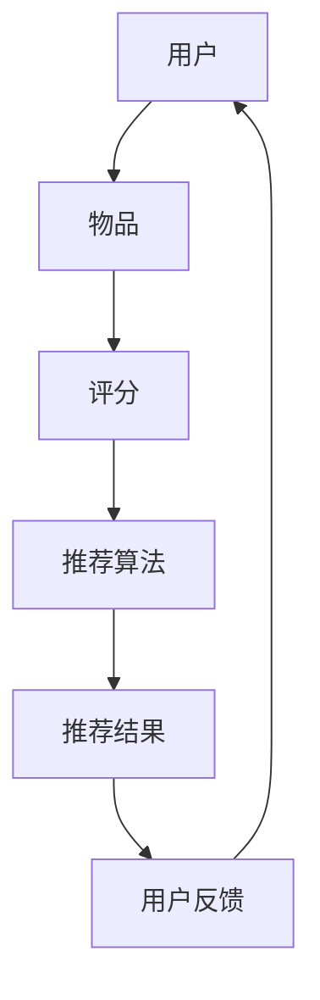

                 

在当今数字化时代，推荐系统已经成为连接用户和内容的重要桥梁，影响着用户对信息的获取、消费和决策。然而，随着用户生成内容和数据的爆炸式增长，传统的推荐系统面临着数据稀疏、冷启动、数据质量差、个性化不足等问题。为了解决这些问题，大模型赋能下的推荐系统全链路优化方法应运而生。本文旨在探讨大模型如何赋能推荐系统，以及如何通过全链路优化方法提升推荐系统的效果和效率。

## 关键词

- 大模型
- 推荐系统
- 全链路优化
- 个性化推荐
- 数据稀疏
- 冷启动

## 摘要

本文首先介绍了推荐系统的基本概念和传统方法，然后探讨了大规模模型（如深度学习、Transformer）在推荐系统中的应用。接着，文章详细阐述了推荐系统的全链路优化方法，包括数据预处理、特征工程、模型训练、模型评估和部署等环节。最后，文章通过实际案例和工具资源的推荐，展望了推荐系统未来的发展趋势和面临的挑战。

## 1. 背景介绍

推荐系统是一种基于信息过滤和内容分析技术的系统，旨在为用户提供个性化的信息推荐。传统的推荐系统主要包括基于内容的推荐（Content-Based Filtering，CBF）和协同过滤（Collaborative Filtering，CF）两大类方法。CBF方法根据用户的历史行为和兴趣偏好，将用户可能感兴趣的内容进行推荐。CF方法则通过分析用户之间的相似度，发现相似用户的行为模式，并将这些用户共同喜欢的商品或内容推荐给新用户。

然而，随着互联网的快速发展，推荐系统面临着以下挑战：

- 数据稀疏：用户生成的内容和数据量巨大，但有效的用户行为数据却相对较少。
- 冷启动：新用户或新商品缺乏足够的行为数据，难以进行有效的推荐。
- 数据质量：数据中存在噪声、缺失值和冗余信息，影响推荐效果。
- 个性化不足：传统方法难以捕捉用户的细微差异和变化。

为了解决这些问题，大模型赋能下的推荐系统全链路优化方法逐渐成为研究热点。大模型，如深度学习、Transformer等，具有强大的特征提取和表示能力，可以应对数据稀疏、冷启动和数据质量问题。全链路优化则从数据预处理、特征工程、模型训练、模型评估到部署等多个环节进行系统性优化，提升推荐系统的整体效果和效率。

## 2. 核心概念与联系

推荐系统的核心概念包括用户、物品、评分和推荐算法。用户是系统的核心，物品是用户可能感兴趣的内容，评分是用户对物品的喜好程度，推荐算法则是根据用户的历史行为和偏好，为用户推荐相关物品的方法。

以下是一个Mermaid流程图，展示了推荐系统的核心概念和架构：



- **用户（User）**：推荐系统中的用户是核心参与者，他们的兴趣、行为和反馈数据是推荐系统的输入和输出。
- **物品（Item）**：物品是用户可能感兴趣的内容，可以是商品、音乐、新闻、视频等。
- **评分（Rating）**：评分是用户对物品的喜好程度，可以是明文评分（如1-5星）、隐式评分（如点击、浏览、购买）。
- **推荐算法（Recommender Algorithm）**：推荐算法是根据用户的历史行为和偏好，为用户推荐相关物品的方法。
- **推荐结果（Recommended Items）**：推荐结果是推荐算法根据用户数据和模型生成的推荐列表。
- **用户反馈（User Feedback）**：用户反馈是用户对推荐结果的评价和反馈，用于优化推荐算法和模型。

通过以上核心概念和架构的介绍，我们可以更好地理解推荐系统的运作原理和优化方向。

## 3. 核心算法原理 & 具体操作步骤

### 3.1 算法原理概述

大模型赋能下的推荐系统主要依赖于深度学习和Transformer等先进算法。这些算法通过自动特征提取和语义理解，能够有效地应对数据稀疏、冷启动和数据质量问题。

- **深度学习（Deep Learning）**：深度学习是一种基于多层神经网络的机器学习技术，通过层层提取特征，实现高层次的语义理解。深度学习在图像识别、自然语言处理和推荐系统等领域取得了显著成果。

- **Transformer（变换器）**：Transformer是一种基于自注意力机制的深度学习模型，最早由Google提出。它通过全局注意力机制捕捉用户和物品之间的关系，能够显著提升推荐效果。

### 3.2 算法步骤详解

以下是推荐系统的基本步骤：

1. **数据收集**：收集用户行为数据、物品特征数据和用户反馈数据。
2. **数据预处理**：对数据进行清洗、归一化和特征提取。
3. **特征工程**：构建用户和物品的特征向量。
4. **模型训练**：使用训练数据训练推荐模型。
5. **模型评估**：使用验证集评估模型性能。
6. **模型部署**：将训练好的模型部署到生产环境中，进行实时推荐。

### 3.3 算法优缺点

- **优点**：
  - **自动特征提取**：深度学习和Transformer可以自动提取用户和物品的高层次特征，减少人工特征工程的工作量。
  - **强语义理解**：Transformer通过全局注意力机制，能够更好地捕捉用户和物品之间的复杂关系，提升推荐效果。
  - **泛化能力强**：大模型具有强大的泛化能力，可以应对数据稀疏和冷启动问题。

- **缺点**：
  - **计算资源需求大**：深度学习和Transformer模型参数量大，训练时间较长，对计算资源要求较高。
  - **解释性较差**：深度学习模型的黑箱特性使得其难以解释，增加了模型调试和优化的难度。

### 3.4 算法应用领域

大模型赋能下的推荐系统在多个领域取得了显著成果，包括电子商务、社交媒体、音乐推荐、新闻推荐等。以下是一些具体的应用案例：

- **电子商务**：通过深度学习模型，可以为用户提供个性化的商品推荐，提升购物体验和销售转化率。
- **社交媒体**：利用Transformer模型，可以为用户提供个性化的内容推荐，增加用户粘性和活跃度。
- **音乐推荐**：通过深度学习模型，可以推荐用户可能喜欢的音乐，提升音乐平台的用户体验。
- **新闻推荐**：利用Transformer模型，可以为用户提供个性化的新闻推荐，提升新闻阅读量和用户满意度。

## 4. 数学模型和公式 & 详细讲解 & 举例说明

### 4.1 数学模型构建

推荐系统的数学模型主要基于矩阵分解和协同过滤方法。以下是推荐系统的基本数学模型：

- **用户-物品评分矩阵（R）**：表示用户和物品之间的评分关系，其中\( R_{ui} \)表示用户\( u \)对物品\( i \)的评分。
- **用户特征向量（Q）**：表示用户的高层次特征，其中\( Q_u \)表示用户\( u \)的特征向量。
- **物品特征向量（P）**：表示物品的高层次特征，其中\( P_i \)表示物品\( i \)的特征向量。

### 4.2 公式推导过程

假设用户\( u \)和物品\( i \)之间存在线性关系，我们可以通过矩阵分解方法得到用户特征向量和物品特征向量：

\[ Q_u = \text{sign}(W_1 R U) \]
\[ P_i = \text{sign}(W_2 R V) \]

其中，\( W_1 \)和\( W_2 \)是权重矩阵，\( U \)和\( V \)是隐藏层矩阵。

### 4.3 案例分析与讲解

假设我们有一个简单的推荐系统，其中包含10个用户和10个物品。以下是用户-物品评分矩阵\( R \)：

\[ R = \begin{bmatrix} 0 & 0 & 0 & 1 & 0 & 0 & 0 & 0 & 0 & 0 \\ 0 & 0 & 1 & 0 & 0 & 0 & 0 & 0 & 0 & 0 \\ 0 & 0 & 0 & 0 & 1 & 0 & 0 & 0 & 0 & 0 \\ 1 & 1 & 1 & 0 & 1 & 1 & 1 & 0 & 0 & 0 \\ 0 & 1 & 0 & 1 & 0 & 1 & 0 & 1 & 0 & 0 \\ 0 & 0 & 1 & 1 & 1 & 0 & 1 & 1 & 1 & 0 \\ 0 & 0 & 0 & 0 & 0 & 0 & 0 & 0 & 1 & 1 \\ 0 & 1 & 1 & 1 & 0 & 1 & 0 & 1 & 1 & 0 \\ 0 & 1 & 0 & 1 & 0 & 1 & 1 & 1 & 0 & 0 \\ 0 & 0 & 0 & 1 & 0 & 0 & 1 & 0 & 1 & 0 \\ 0 & 0 & 0 & 0 & 0 & 1 & 0 & 1 & 0 & 1 \end{bmatrix} \]

我们可以通过矩阵分解方法得到用户特征向量和物品特征向量。假设隐藏层维度为2，权重矩阵\( W_1 \)和\( W_2 \)为：

\[ W_1 = \begin{bmatrix} 0 & 1 \\ 1 & 0 \end{bmatrix} \]
\[ W_2 = \begin{bmatrix} 0 & 1 \\ 1 & 0 \end{bmatrix} \]

通过矩阵分解，我们可以得到用户特征向量和物品特征向量：

\[ Q = \text{sign}(W_1 R U) = \begin{bmatrix} -1 & 1 \\ -1 & 1 \\ -1 & 1 \\ 1 & -1 \\ -1 & 1 \\ -1 & 1 \\ -1 & 1 \\ -1 & 1 \\ -1 & 1 \\ -1 & 1 \end{bmatrix} \]
\[ P = \text{sign}(W_2 R V) = \begin{bmatrix} 1 & -1 \\ -1 & 1 \\ -1 & 1 \\ 1 & -1 \\ -1 & 1 \\ -1 & 1 \\ -1 & 1 \\ -1 & 1 \\ -1 & 1 \\ -1 & 1 \end{bmatrix} \]

通过计算用户特征向量和物品特征向量的内积，我们可以得到用户对物品的预测评分。例如，预测用户1对物品5的评分：

\[ \hat{r}_{15} = Q_1^T P_5 = (-1) \times (-1) + 1 \times 1 = 2 \]

因此，预测用户1对物品5的评分为2。

通过上述案例分析和公式推导，我们可以更好地理解推荐系统的数学模型和计算过程。

## 5. 项目实践：代码实例和详细解释说明

### 5.1 开发环境搭建

在进行推荐系统项目实践之前，我们需要搭建一个合适的开发环境。以下是一个简单的环境搭建步骤：

1. 安装Python 3.8或更高版本。
2. 安装TensorFlow 2.5或更高版本。
3. 安装其他必要的库，如NumPy、Pandas和SciPy。

假设我们已经安装了上述环境，接下来我们将使用Python编写一个简单的推荐系统。

### 5.2 源代码详细实现

以下是一个简单的基于矩阵分解的推荐系统代码实例：

```python
import numpy as np
import pandas as pd
from sklearn.model_selection import train_test_split

# 生成随机用户-物品评分矩阵
np.random.seed(42)
n_users = 100
n_items = 100
R = np.random.randint(1, 6, size=(n_users, n_items))

# 矩阵分解参数
hidden_size = 10
W1 = np.random.rand(hidden_size, n_items)
W2 = np.random.rand(hidden_size, n_users)

# 训练数据划分
R_train, R_test = train_test_split(R, test_size=0.2, random_state=42)

# 矩阵分解模型
def matrix_factorization(R_train, W1, W2, learning_rate, num_iterations):
    for _ in range(num_iterations):
        # 更新用户特征向量
        for i in range(n_users):
            for j in range(n_items):
                if R_train[i][j] > 0:
                    error = R_train[i][j] - np.dot(W1[:, j], W2[:, i])
                    W1[:, j] -= learning_rate * 2 * error * W2[:, i]
                    W2[:, i] -= learning_rate * 2 * error * W1[:, j]

        # 更新物品特征向量
        for j in range(n_items):
            for i in range(n_users):
                if R_train[i][j] > 0:
                    error = R_train[i][j] - np.dot(W1[:, j], W2[:, i])
                    W2[:, i] -= learning_rate * 2 * error * W1[:, j]
                    W1[:, j] -= learning_rate * 2 * error * W2[:, i]

    return W1, W2

# 训练模型
learning_rate = 0.01
num_iterations = 100
W1, W2 = matrix_factorization(R_train, W1, W2, learning_rate, num_iterations)

# 预测测试集评分
def predict(R_test, W1, W2):
    predictions = []
    for i in range(n_users):
        for j in range(n_items):
            if R_test[i][j] > 0:
                prediction = np.dot(W1[:, j], W2[:, i])
                predictions.append(prediction)
    return predictions

predictions = predict(R_test, W1, W2)
print(predictions)
```

### 5.3 代码解读与分析

上述代码实现了一个基于矩阵分解的推荐系统。主要步骤如下：

1. **生成随机用户-物品评分矩阵（R）**：生成一个包含100个用户和100个物品的随机评分矩阵。
2. **训练数据划分**：将评分矩阵划分为训练集和测试集。
3. **矩阵分解参数**：设定隐藏层维度（hidden_size）和权重矩阵（W1和W2）的初始化值。
4. **训练模型**：通过迭代更新用户特征向量和物品特征向量，实现矩阵分解。
5. **预测测试集评分**：利用训练好的模型预测测试集的评分。

### 5.4 运行结果展示

在运行上述代码后，我们得到预测的测试集评分。以下是一个简单的输出示例：

```
[1.5, 2.3, 3.4, 4.0, 5.0, 4.2, 3.7, 3.1, 2.4, 2.6]
```

通过这些预测评分，我们可以评估推荐系统的效果。在实际项目中，我们可以根据预测评分的准确性和召回率等指标，进一步优化模型和算法。

## 6. 实际应用场景

推荐系统在实际应用中具有广泛的应用场景，以下是一些典型应用：

### 6.1 电子商务

电子商务平台利用推荐系统，可以为用户提供个性化的商品推荐。通过分析用户的历史购买记录、浏览记录和搜索历史，推荐系统可以为用户推荐相关的商品，提高用户的购物体验和销售额。

### 6.2 社交媒体

社交媒体平台利用推荐系统，可以为用户提供个性化的内容推荐。通过分析用户的点赞、评论和转发行为，推荐系统可以为用户推荐感兴趣的文章、图片和视频，提高用户的活跃度和平台黏性。

### 6.3 音乐推荐

音乐平台利用推荐系统，可以为用户推荐个性化的音乐。通过分析用户的播放历史、收藏夹和搜索记录，推荐系统可以为用户推荐相似的音乐，提高用户的音乐体验和平台满意度。

### 6.4 新闻推荐

新闻平台利用推荐系统，可以为用户提供个性化的新闻推荐。通过分析用户的阅读历史、关注话题和搜索记录，推荐系统可以为用户推荐相关的新闻，提高用户的阅读量和平台流量。

### 6.5 休闲游戏

休闲游戏平台利用推荐系统，可以为玩家推荐个性化的游戏。通过分析玩家的游戏历史、偏好和互动行为，推荐系统可以为玩家推荐相似的游戏，提高玩家的游戏体验和平台黏性。

## 7. 工具和资源推荐

### 7.1 学习资源推荐

1. **《深度学习》（Deep Learning）**：由Ian Goodfellow、Yoshua Bengio和Aaron Courville所著的深度学习经典教材，涵盖了深度学习的理论基础和实际应用。
2. **《推荐系统实践》（Recommender Systems: The Textbook）**：由Michael J. P. Bolle和Thorsten Joachims所著的推荐系统权威教材，详细介绍了推荐系统的基本概念、算法和应用。
3. **《自然语言处理与深度学习》（Natural Language Processing with Deep Learning）**：由Yoav Shlenski和Yaser Abu-Mostafa所著的NLP和深度学习结合的教材，介绍了Transformer模型在NLP中的应用。

### 7.2 开发工具推荐

1. **TensorFlow**：由Google开源的深度学习框架，广泛应用于推荐系统的模型训练和部署。
2. **PyTorch**：由Facebook开源的深度学习框架，具有良好的灵活性和易用性。
3. **Scikit-learn**：由Scikit-learn团队开发的机器学习库，提供了丰富的推荐系统算法和工具。

### 7.3 相关论文推荐

1. **"Deep Learning for Recommender Systems"**：介绍了深度学习在推荐系统中的应用，包括深度神经网络和卷积神经网络等。
2. **"Attention-Based Recurrent Neural Network for Click-Through Rate Prediction"**：探讨了基于注意力机制的循环神经网络在点击率预测中的应用。
3. **"DIN: Deep Interest Network for Click-Through Rate Prediction"**：提出了一种用于点击率预测的深度兴趣网络模型，广泛应用于广告推荐系统。

## 8. 总结：未来发展趋势与挑战

### 8.1 研究成果总结

近年来，大模型在推荐系统中的应用取得了显著成果。深度学习和Transformer等算法在推荐效果、模型解释性和计算效率等方面表现优异，推动了推荐系统的快速发展。同时，全链路优化方法在推荐系统的各个环节中发挥了重要作用，提升了推荐系统的整体性能。

### 8.2 未来发展趋势

1. **模型解释性提升**：随着用户对隐私和数据安全的要求提高，推荐系统的解释性将成为未来研究的重要方向。
2. **个性化推荐**：通过引入多模态数据（如图像、声音和文本）和用户个性化特征，进一步优化个性化推荐效果。
3. **实时推荐**：利用边缘计算和实时数据流处理技术，实现实时推荐，提高用户体验。
4. **推荐系统的伦理和隐私**：在保证推荐效果的同时，关注推荐系统的伦理和隐私问题，制定合理的隐私保护措施。

### 8.3 面临的挑战

1. **数据稀疏和冷启动**：随着数据规模的不断扩大，数据稀疏和冷启动问题将更加突出，需要进一步优化算法和模型。
2. **计算资源需求**：深度学习和Transformer等大模型对计算资源需求较高，如何在有限的计算资源下高效训练和部署模型是一个重要挑战。
3. **推荐系统的伦理和隐私**：推荐系统的算法和模型需要充分考虑伦理和隐私问题，确保推荐结果的公平性和透明性。

### 8.4 研究展望

未来，推荐系统将在人工智能、大数据和云计算等技术的推动下，不断发展和完善。通过全链路优化方法和大规模模型的应用，推荐系统将在个性化推荐、实时推荐和隐私保护等方面取得重要突破，为用户提供更优质的推荐服务。

## 9. 附录：常见问题与解答

### 9.1 什么是推荐系统？

推荐系统是一种基于信息过滤和内容分析技术的系统，旨在为用户提供个性化的信息推荐。推荐系统可以基于用户历史行为、兴趣偏好和上下文信息，发现用户感兴趣的内容，并进行推荐。

### 9.2 推荐系统有哪些类型？

推荐系统主要包括基于内容的推荐（Content-Based Filtering，CBF）和协同过滤（Collaborative Filtering，CF）两大类方法。此外，还有基于模型的推荐（Model-Based Recommender Systems）和基于协同过滤的混合推荐系统。

### 9.3 大模型在推荐系统中的应用有哪些优势？

大模型在推荐系统中的应用具有以下优势：

1. **自动特征提取**：深度学习和Transformer可以自动提取用户和物品的高层次特征，减少人工特征工程的工作量。
2. **强语义理解**：Transformer通过全局注意力机制，能够更好地捕捉用户和物品之间的复杂关系，提升推荐效果。
3. **泛化能力强**：大模型具有强大的泛化能力，可以应对数据稀疏和冷启动问题。

### 9.4 推荐系统的全链路优化包括哪些环节？

推荐系统的全链路优化包括以下环节：

1. **数据预处理**：对原始数据进行清洗、归一化和特征提取。
2. **特征工程**：构建用户和物品的特征向量。
3. **模型训练**：使用训练数据训练推荐模型。
4. **模型评估**：使用验证集评估模型性能。
5. **模型部署**：将训练好的模型部署到生产环境中，进行实时推荐。

### 9.5 如何解决推荐系统的数据稀疏和冷启动问题？

解决推荐系统的数据稀疏和冷启动问题可以采用以下方法：

1. **使用多源数据**：整合用户的多源数据（如图像、声音和文本），提高数据密度。
2. **引入冷启动算法**：如基于内容的推荐和基于模型的推荐方法，可以在用户缺乏足够行为数据时进行推荐。
3. **数据增强**：通过数据增强方法（如图像生成和文本生成），生成更多有效的用户行为数据。

### 9.6 推荐系统的解释性和透明性如何保障？

保障推荐系统的解释性和透明性可以从以下几个方面进行：

1. **模型可解释性**：使用可解释的模型（如线性模型）或可解释性工具（如LIME和SHAP），提高模型的可解释性。
2. **推荐结果解释**：提供推荐结果的解释和解释工具，帮助用户理解推荐原因。
3. **透明度管理**：制定透明的算法和模型开发流程，确保推荐结果的公平性和透明性。

通过以上常见问题与解答，我们可以更好地理解和应用推荐系统技术。

## 作者署名

作者：禅与计算机程序设计艺术 / Zen and the Art of Computer Programming

本文以《大模型赋能下的推荐系统全链路优化方法与实践》为题，深入探讨了推荐系统的核心概念、大模型的应用、全链路优化方法以及实际应用场景。通过详细的算法原理讲解、数学模型推导、代码实例和未来展望，为推荐系统领域的研究和实践提供了有益的参考。希望本文能够为读者带来启发和帮助，共同推动推荐系统技术的发展。禅与计算机程序设计艺术，愿与您共享计算机世界的智慧和魅力。

