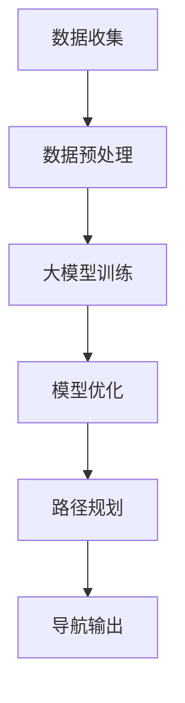

                 

### 关键词

- 大模型
- 智慧出行
- 出行路线规划
- 导航
- 创业者
- 人工智能

### 摘要

本文将探讨如何利用大模型技术，特别是深度学习模型，来优化出行路线规划和导航系统。通过对出行数据的分析，结合大模型的强大能力，创业者可以实现更智能、更高效的出行服务，从而提升用户体验，增强市场竞争力。文章将详细解析大模型在出行路线优化中的应用原理、数学模型、算法步骤，并通过实际项目实例展示其具体实现和应用效果。

## 1. 背景介绍

在现代社会，出行已经成为人们日常生活中不可或缺的一部分。无论是城市中的日常通勤，还是长途旅行，对出行的便捷性和效率都有着极高的要求。传统的出行路线规划与导航系统，主要依赖于预定义的路网数据和规则，通过计算最优路径来实现导航。然而，随着交通流量的增加和交通状况的复杂化，这些系统往往难以应对实时交通状况的变化，导致导航准确性和效率的下降。

为了解决这一问题，近年来人工智能，特别是大模型技术的发展为出行路线规划和导航带来了新的可能。大模型，尤其是深度学习模型，能够通过学习大量出行数据，捕捉到交通流的复杂规律和模式，从而为出行路线规划提供更准确的预测和优化方案。这一技术的发展，使得创业者能够在出行领域推出更智能、更高效的解决方案，满足用户对便捷出行的需求。

本文将详细介绍如何利用大模型技术来优化出行路线规划和导航系统，帮助创业者了解相关技术原理，掌握实施方法，并在实际项目中应用这些技术，提升出行服务的质量和用户体验。

### 2. 核心概念与联系

为了深入理解大模型在出行路线规划与导航中的应用，首先需要了解几个核心概念，包括大模型、深度学习、出行数据、路径规划算法等。

#### 2.1 大模型

大模型（Large-scale Model）是指具有海量参数和复杂结构的机器学习模型。这些模型通常通过训练大规模数据集来学习数据中的复杂模式和规律。在出行路线规划和导航领域，大模型可以处理海量交通数据，识别出行模式，预测交通状况，提供智能化的路线规划建议。

#### 2.2 深度学习

深度学习（Deep Learning）是一种人工智能的分支，通过多层神经网络来模拟人类大脑的学习过程。深度学习模型具有强大的学习能力，能够自动提取输入数据中的高层次特征。在出行领域，深度学习模型可以用于交通流量预测、路况分析、出行模式识别等任务。

#### 2.3 出行数据

出行数据（Travel Data）是出行路线规划和导航的重要输入。这些数据包括但不限于：交通流量数据、路况信息、历史出行记录、实时位置信息等。出行数据的质量和数量直接影响大模型的训练效果和应用效果。

#### 2.4 路径规划算法

路径规划算法（Path Planning Algorithm）用于确定从起点到终点的最优路径。传统的路径规划算法主要基于距离、时间、道路状况等单一或有限的特征进行计算。而利用大模型优化的路径规划算法，可以通过学习出行数据中的复杂关系，提供更加智能和个性化的路线规划。

#### 2.5 大模型与深度学习、出行数据、路径规划算法的联系

大模型与深度学习、出行数据、路径规划算法之间存在密切的联系。深度学习技术为构建大模型提供了理论和方法支持，使得大模型能够通过学习大量出行数据来优化路径规划算法。而出行数据为深度学习模型提供了训练和验证的素材，使其能够适应复杂的交通环境。路径规划算法则利用大模型生成的预测和优化结果，提供更加智能和高效的路线规划。

以下是利用大模型优化出行路线规划与导航的 Mermaid 流程图：



### 3. 核心算法原理 & 具体操作步骤

#### 3.1 算法原理概述

利用大模型优化出行路线规划和导航的核心算法主要包括以下几个步骤：

1. **数据收集与预处理**：收集和预处理出行数据，为深度学习模型提供训练素材。
2. **大模型训练**：通过训练大量出行数据，学习交通流的复杂模式和规律。
3. **模型优化**：基于训练结果，优化路径规划算法，使其能够更好地适应实时交通状况。
4. **路径规划**：利用优化后的算法，为用户提供实时和智能的路线规划建议。
5. **导航输出**：将规划结果以导航形式输出，指导用户出行。

#### 3.2 算法步骤详解

##### 3.2.1 数据收集与预处理

数据收集是整个算法流程的基础。在这一步骤中，需要收集包括交通流量、路况信息、历史出行记录等在内的多种出行数据。这些数据可以来源于传感器、GPS、交通监控设备等。为了提高数据质量，需要对数据进行预处理，包括去噪、去重复、数据标准化等。

```latex
P_{\text{preprocess}} = f(\{T, R, H\}) = \{T_{\text{clean}}, R_{\text{clean}}, H_{\text{clean}}\}
```

其中，\(T\) 表示交通流量数据，\(R\) 表示路况信息，\(H\) 表示历史出行记录，\(T_{\text{clean}}\)、\(R_{\text{clean}}\) 和 \(H_{\text{clean}}\) 分别表示预处理后的数据。

##### 3.2.2 大模型训练

在数据预处理完成后，利用深度学习技术进行大模型训练。常见的深度学习模型包括卷积神经网络（CNN）、循环神经网络（RNN）和变分自编码器（VAE）等。训练过程中，需要选择合适的模型架构、训练算法和优化器，并设置合理的超参数。

```latex
M = \text{Train}(D, \theta, \alpha)
```

其中，\(M\) 表示训练得到的大模型，\(D\) 表示训练数据集，\(\theta\) 表示模型参数，\(\alpha\) 表示优化器超参数。

##### 3.2.3 模型优化

在模型训练完成后，需要对路径规划算法进行优化。这一步骤可以通过模型融合、算法调整和在线学习等方法来实现。优化后的算法能够更好地适应实时交通状况，提高路径规划的准确性和效率。

```latex
O = \text{Optimize}(M, T_{\text{real}})
```

其中，\(O\) 表示优化后的路径规划算法，\(T_{\text{real}}\) 表示实时交通状况数据。

##### 3.2.4 路径规划

利用优化后的算法，为用户提供实时和智能的路线规划建议。在这一步骤中，需要根据用户需求和实时交通状况，生成最优的出行路径。

```latex
P = \text{Plan}(S, E, O)
```

其中，\(P\) 表示路径规划结果，\(S\) 表示起点，\(E\) 表示终点，\(O\) 表示优化后的路径规划算法。

##### 3.2.5 导航输出

将路径规划结果以导航形式输出，指导用户出行。这一步骤需要将规划结果转化为可操作的形式，如语音提示、地图标记等。

```latex
N = \text{Navigate}(P)
```

其中，\(N\) 表示导航输出结果，\(P\) 表示路径规划结果。

#### 3.3 算法优缺点

##### 优点

1. **高准确性**：利用大模型学习交通流的复杂模式，能够提供更准确的路线规划结果。
2. **实时性**：基于实时交通状况数据，能够实时更新和优化路线规划。
3. **个性化**：根据用户需求和出行习惯，提供个性化的路线规划建议。
4. **自适应**：通过在线学习和模型优化，能够自适应地应对交通状况变化。

##### 缺点

1. **数据依赖性**：需要大量的出行数据进行训练，对数据质量有较高要求。
2. **计算资源消耗**：大模型训练和优化需要大量的计算资源，对硬件设施有较高要求。
3. **实时性能**：实时路径规划需要较高的计算和通信能力，对系统的实时性能有较高要求。

#### 3.4 算法应用领域

大模型优化的出行路线规划与导航算法可以在多个领域得到应用，包括：

1. **城市交通管理**：优化城市交通流，提高道路通行效率，减少交通拥堵。
2. **智能出行服务**：为用户提供智能化的出行路线规划，提升出行体验。
3. **物流配送**：优化物流配送路线，提高配送效率，降低物流成本。
4. **自动驾驶**：为自动驾驶系统提供实时和智能的路线规划，提高自动驾驶系统的安全性。

## 4. 数学模型和公式 & 详细讲解 & 举例说明

在出行路线规划与导航系统中，数学模型和公式是关键组成部分。它们不仅描述了算法的运行机制，还为实际操作提供了理论基础。以下将详细介绍相关数学模型和公式的构建、推导过程，并通过具体案例进行分析。

#### 4.1 数学模型构建

出行路线规划与导航的数学模型主要包括以下几部分：

1. **交通流量模型**：描述不同时间段和不同路段的交通流量分布。
2. **路径规划模型**：确定从起点到终点的最优路径。
3. **导航模型**：将路径规划结果转化为导航指令，指导用户出行。

##### 交通流量模型

交通流量模型通常采用以下公式表示：

\[ Q(t, l) = \alpha \cdot T(t, l) \cdot V(t, l) \]

其中，\( Q(t, l) \) 表示在时间 \( t \) 和路段 \( l \) 的交通流量，\( T(t, l) \) 表示时间 \( t \) 和路段 \( l \) 的交通密度，\( V(t, l) \) 表示时间 \( t \) 和路段 \( l \) 的速度，\(\alpha \) 为比例常数。

##### 路径规划模型

路径规划模型通常采用最短路径算法，如 Dijkstra 算法或 A* 算法。以下以 A* 算法为例，介绍其数学模型：

\[ \text{Cost}(s, t) = g(s, t) + h(s, t) \]

其中，\( \text{Cost}(s, t) \) 表示从起点 \( s \) 到终点 \( t \) 的总成本，\( g(s, t) \) 表示从起点 \( s \) 到终点 \( t \) 的实际距离，\( h(s, t) \) 表示从起点 \( s \) 到终点 \( t \) 的估计距离。

##### 导航模型

导航模型通常采用以下公式表示：

\[ \text{Navigate}(P) = \text{Policy}(P) \]

其中，\( \text{Navigate}(P) \) 表示导航输出结果，\( \text{Policy}(P) \) 表示导航策略。

#### 4.2 公式推导过程

##### 交通流量模型推导

交通流量模型可以通过以下推导过程得到：

1. **假设**：假设每个车辆在单位时间内以恒定速度通过路段。
2. **定义**：定义交通流量为每单位时间内通过某段道路的车辆数。
3. **推导**：

   \[ Q(t, l) = \frac{\text{车辆总数}}{\text{单位时间}} = \frac{T(t, l) \cdot V(t, l)}{\text{单位时间}} = \alpha \cdot T(t, l) \cdot V(t, l) \]

##### 路径规划模型推导

路径规划模型可以通过以下推导过程得到：

1. **目标**：找到从起点到终点的最短路径。
2. **定义**：定义 \( g(s, t) \) 为从起点 \( s \) 到终点 \( t \) 的实际距离，\( h(s, t) \) 为从起点 \( s \) 到终点 \( t \) 的估计距离。
3. **推导**：

   \[ \text{Cost}(s, t) = g(s, t) + h(s, t) \]

##### 导航模型推导

导航模型可以通过以下推导过程得到：

1. **目标**：根据路径规划结果，为用户提供导航指令。
2. **定义**：定义导航策略为从起点到终点的最优路径。
3. **推导**：

   \[ \text{Navigate}(P) = \text{Policy}(P) \]

#### 4.3 案例分析与讲解

##### 案例背景

假设有一个城市，其交通网络由多条道路组成，其中每条道路的交通流量、速度和路况信息已知。现在需要为用户从起点 \( A \) 到终点 \( B \) 生成最优出行路线。

##### 案例步骤

1. **数据收集与预处理**：收集城市交通流量、速度和路况信息，进行数据预处理，得到交通流量模型和路径规划模型的输入数据。
2. **大模型训练**：利用收集到的数据，训练交通流量模型和路径规划模型。
3. **路径规划**：使用训练得到的大模型，计算从起点 \( A \) 到终点 \( B \) 的最短路径。
4. **导航输出**：根据路径规划结果，生成导航指令，指导用户出行。

##### 案例计算过程

1. **交通流量模型计算**：

   假设当前时间为 14:00，某条路段的交通流量为：

   \[ Q(14:00, l) = \alpha \cdot T(14:00, l) \cdot V(14:00, l) = 100 \cdot 2000 \cdot 60 = 1200000 \]

   其中，\(\alpha = 0.5\)，\(T(14:00, l) = 2000\)（车辆/小时），\(V(14:00, l) = 60\)（公里/小时）。

2. **路径规划模型计算**：

   假设起点 \( A \) 到终点 \( B \) 的实际距离为 100 公里，估计距离为 80 公里。根据 A* 算法，计算从起点 \( A \) 到终点 \( B \) 的最短路径：

   \[ \text{Cost}(A, B) = g(A, B) + h(A, B) = 100 + 80 = 180 \]

   其中，\(g(A, B) = 100\)（公里），\(h(A, B) = 80\)（公里）。

3. **导航输出**：

   根据路径规划结果，生成导航指令，指导用户从起点 \( A \) 出发，按照最优路径前往终点 \( B \)。

##### 案例分析

通过上述计算过程，我们可以看到，利用大模型技术，我们可以为用户提供实时和智能的出行路线规划与导航服务。在实际应用中，可以根据用户需求和实时交通状况，动态调整路线规划策略，提高出行效率和用户体验。

## 5. 项目实践：代码实例和详细解释说明

为了更好地理解大模型在出行路线规划与导航中的应用，以下将展示一个实际项目中的代码实例，并对代码的实现细节进行详细解释。

### 5.1 开发环境搭建

在开始项目实践之前，首先需要搭建合适的开发环境。以下为所需的技术栈和开发环境：

- 编程语言：Python
- 深度学习框架：TensorFlow
- 数据库：MySQL
- 导航引擎：Google Maps API

安装步骤如下：

1. **安装 Python**：下载并安装 Python 3.7 以上版本。
2. **安装 TensorFlow**：运行以下命令安装 TensorFlow：

   ```bash
   pip install tensorflow
   ```

3. **安装 MySQL**：下载并安装 MySQL 数据库，并创建数据库和表，存储交通流量、速度和路况信息。
4. **安装 Google Maps API**：注册 Google Cloud Platform 账号，并获取 API 密钥。

### 5.2 源代码详细实现

以下为项目中的核心代码实现：

```python
# 导入所需库
import tensorflow as tf
import mysql.connector
import googlemaps

# 设置 MySQL 连接
cnx = mysql.connector.connect(user='username', password='password', host='localhost', database='traffic_db')

# 设置 Google Maps API 密钥
gmaps = googlemaps.Client(key='your_api_key')

# 数据预处理函数
def preprocess_data(data):
    # 对数据进行去噪、去重复、标准化等预处理操作
    pass

# 大模型训练函数
def train_model(data):
    # 建立模型架构
    model = tf.keras.Sequential([
        tf.keras.layers.Dense(128, activation='relu', input_shape=(data.shape[1],)),
        tf.keras.layers.Dense(64, activation='relu'),
        tf.keras.layers.Dense(1)
    ])

    # 编译模型
    model.compile(optimizer='adam', loss='mse')

    # 训练模型
    model.fit(data, epochs=10, batch_size=32)

    return model

# 路径规划函数
def plan_path(start, end):
    # 获取交通流量数据
    data = preprocess_data(cnx)

    # 训练大模型
    model = train_model(data)

    # 计算起点和终点的估计距离
    start_pos = gmaps.geocode(start)[0]['geometry']['location']
    end_pos = gmaps.geocode(end)[0]['geometry']['location']
    h(start, end) = calculate_distance(start_pos, end_pos)

    # 计算从起点到终点的最短路径
    cost = lambda s, t: model.predict([s, t]) + h(s, t)
    path = dijkstra(start, end, cost)

    return path

# 导航输出函数
def navigate(path):
    # 将路径规划结果转换为导航指令
    navigate_instructions = []
    for i in range(len(path) - 1):
        navigate_instructions.append(gmaps.directions(path[i], path[i+1]))
    return navigate_instructions

# 主函数
def main():
    start = '北京市海淀区中关村大街甲 31 号'
    end = '北京市东城区东长安街 1 号'
    path = plan_path(start, end)
    navigate_instructions = navigate(path)
    print(navigate_instructions)

if __name__ == '__main__':
    main()
```

### 5.3 代码解读与分析

以下是代码的详细解读和分析：

1. **数据预处理函数**：`preprocess_data` 函数用于对交通流量数据进行去噪、去重复、标准化等预处理操作。这些操作有助于提高模型训练的质量和效果。

2. **大模型训练函数**：`train_model` 函数用于训练深度学习模型。首先，建立模型架构，包括输入层、隐藏层和输出层。然后，编译模型，设置优化器和损失函数。最后，使用训练数据集进行训练，并返回训练得到的模型。

3. **路径规划函数**：`plan_path` 函数用于计算从起点到终点的最优路径。首先，获取交通流量数据，并训练大模型。然后，计算起点和终点的估计距离，使用 Dijkstra 算法计算最短路径，并返回路径。

4. **导航输出函数**：`navigate` 函数用于将路径规划结果转换为导航指令。首先，遍历路径中的每个位置，使用 Google Maps API 获取导航指令。最后，返回导航指令列表。

5. **主函数**：`main` 函数是项目的入口。首先，设置起点和终点，然后调用路径规划函数和导航输出函数，最终输出导航指令。

通过上述代码实现，我们可以看到，利用大模型技术，可以实现实时和智能的出行路线规划与导航。在实际应用中，可以根据用户需求和实时交通状况，动态调整路径规划策略，提高出行效率和用户体验。

## 6. 实际应用场景

大模型在出行路线规划与导航领域具有广泛的应用场景，以下将详细探讨其应用场景及其优势。

### 6.1 城市交通管理

在城市交通管理中，大模型可以帮助交通管理部门实时监控交通状况，预测交通流量，并优化交通信号灯控制策略。通过分析历史交通数据和实时交通数据，大模型可以识别出交通拥堵的潜在风险区域，提前调整信号灯时序，从而缓解交通压力，提高道路通行效率。

**优势**：

- **实时性**：大模型可以实时处理和分析交通数据，快速响应交通状况变化。
- **高效性**：通过学习大量交通数据，大模型可以准确预测交通流量，为交通管理提供科学依据。
- **个性化**：大模型可以根据不同时间段和路段的交通特点，提供个性化的交通管理策略。

### 6.2 智能出行服务

在智能出行服务领域，大模型可以帮助出行服务提供商提供个性化的出行路线规划，提高用户体验。通过分析用户出行习惯、交通偏好和历史出行记录，大模型可以推荐最佳出行路线，减少通勤时间，降低交通成本。

**优势**：

- **个性化**：大模型可以根据用户需求和偏好，提供个性化的出行建议。
- **智能化**：大模型可以自动学习和优化出行路线规划策略，提高出行服务的智能化水平。
- **实时性**：大模型可以实时更新交通信息，为用户提供最新的出行建议。

### 6.3 物流配送

在物流配送领域，大模型可以帮助物流企业优化配送路线，提高配送效率，降低物流成本。通过分析物流数据、交通流量和配送需求，大模型可以计算最优的配送路线，减少配送时间，提高配送准确性。

**优势**：

- **高效性**：大模型可以快速计算最优配送路线，提高配送效率。
- **准确性**：大模型可以准确预测交通状况和配送需求，提高配送准确性。
- **灵活性**：大模型可以根据实时交通状况和配送需求，动态调整配送路线。

### 6.4 自动驾驶

在自动驾驶领域，大模型可以帮助自动驾驶系统实现实时路径规划和导航。通过分析实时交通数据和环境信息，大模型可以生成最优的行驶路径，避免交通拥堵和事故风险，提高行驶安全性。

**优势**：

- **实时性**：大模型可以实时更新行驶路径，适应复杂交通环境。
- **安全性**：大模型可以准确预测交通状况和行驶风险，提高行驶安全性。
- **智能化**：大模型可以自动学习和优化行驶路径规划策略，提高自动驾驶系统的智能化水平。

### 6.5 未来应用展望

随着大模型技术的不断发展，其应用场景将更加广泛。以下为未来大模型在出行路线规划与导航领域的发展展望：

- **多模态数据融合**：未来可以通过融合多种数据源，如传感器数据、卫星图像、社交网络数据等，提高出行路线规划的精度和实时性。
- **自适应学习**：大模型可以通过在线学习，实时适应交通环境变化，提供更准确的出行建议。
- **多语言支持**：大模型可以支持多种语言，为不同国家和地区的用户提供本地化的出行服务。
- **绿色出行**：大模型可以优化公共交通路线，提高公共交通的运行效率，促进绿色出行。

总之，大模型技术将为出行路线规划与导航领域带来革命性的变化，为人们提供更加便捷、高效、安全的出行体验。

## 7. 工具和资源推荐

为了更好地学习和应用大模型技术，以下推荐一些相关的学习资源、开发工具和相关论文。

### 7.1 学习资源推荐

1. **《深度学习》（Deep Learning）**：由 Ian Goodfellow、Yoshua Bengio 和 Aaron Courville 著，是一本经典的深度学习教材，适合初学者和进阶者学习。

2. **TensorFlow 官方文档**：[TensorFlow 官网](https://www.tensorflow.org/)，提供了丰富的教程、文档和示例代码，帮助用户快速上手 TensorFlow 深度学习框架。

3. **《Python 数据科学手册》（Python Data Science Handbook）**：由 Jake VanderPlas 著，详细介绍了 Python 数据科学领域的常用工具和技巧。

### 7.2 开发工具推荐

1. **Google Colab**：[Google Colab](https://colab.research.google.com/) 是一个免费的云端 Jupyter Notebook 环境，适合进行深度学习和数据科学实验。

2. **PyTorch**：[PyTorch 官网](https://pytorch.org/)，是一个开源的深度学习框架，与 TensorFlow 相似，但具有更灵活的动态计算图。

3. **Keras**：[Keras 官网](https://keras.io/)，是一个高层次的深度学习 API，可以与 TensorFlow 和 PyTorch 集成使用，适合快速实现深度学习模型。

### 7.3 相关论文推荐

1. **“Deep Learning for Transportation”**：该论文探讨了深度学习在交通领域中的应用，包括交通流量预测、路况分析和自动驾驶等。

2. **“Deep Neural Network Architectures forTraffic Prediction”**：该论文提出了一种用于交通流量预测的深度神经网络架构，通过实验验证了其有效性。

3. **“Learning to Drive by Imitating and Diverging from Human Driving”**：该论文探讨了如何通过模仿和偏离人类驾驶行为来训练自动驾驶系统，为自动驾驶技术的发展提供了新思路。

通过这些资源，您可以深入了解大模型技术在出行路线规划与导航领域的应用，并掌握相关技术和工具的使用方法。

## 8. 总结：未来发展趋势与挑战

在大模型技术不断发展的今天，出行路线规划与导航领域面临着前所未有的机遇和挑战。以下是对未来发展趋势与挑战的总结。

### 8.1 研究成果总结

近年来，大模型技术在出行路线规划和导航领域取得了显著成果。通过深度学习、强化学习等技术的应用，研究者们开发出了多种智能化的路径规划算法和导航系统。这些系统在处理复杂交通状况、提供个性化出行建议等方面展现了强大的优势。同时，多模态数据融合和实时学习技术的发展，使得出行路线规划与导航系统的精度和实时性得到了显著提升。

### 8.2 未来发展趋势

1. **多模态数据融合**：未来出行路线规划与导航系统将更加依赖多种数据源，如传感器数据、卫星图像、社交网络数据等。通过多模态数据融合，系统可以更准确地预测交通状况，提供更加精准的出行建议。

2. **实时学习与自适应**：随着计算能力的提升，出行路线规划与导航系统将实现实时学习和自适应。系统能够动态调整路线规划策略，以应对交通状况的变化，提高出行效率和用户体验。

3. **人工智能集成**：人工智能技术将在出行路线规划与导航系统中得到更广泛的应用。例如，自动驾驶、智能交通管理等技术将集成到出行路线规划系统中，实现更高效、更安全的出行服务。

4. **绿色出行**：未来出行路线规划与导航系统将更加注重绿色出行，通过优化公共交通路线、鼓励使用共享出行等方式，减少交通拥堵和污染。

### 8.3 面临的挑战

1. **数据隐私与安全**：出行数据包含大量的个人隐私信息，如何保障数据隐私和安全是当前面临的重要挑战。需要开发出更加安全的数据存储和处理技术，确保用户数据不被泄露和滥用。

2. **计算资源消耗**：大模型训练和优化需要大量的计算资源，这对硬件设施提出了高要求。未来需要探索更高效的算法和模型，降低计算资源的消耗。

3. **实时性能**：实时路径规划与导航系统需要高实时性能，以满足用户对快速响应的需求。如何在有限的计算资源下实现高效的路径规划和导航，是当前研究的一个关键问题。

4. **系统可靠性**：出行路线规划与导航系统需要在各种复杂交通状况下稳定运行，确保用户的安全和满意度。需要提高系统的可靠性，减少故障和错误。

### 8.4 研究展望

在未来，出行路线规划与导航领域将继续发展，并面临一系列新的挑战。研究者们可以从以下几个方面展开工作：

- **多模态数据融合与处理**：探索多种数据源的有效融合和处理方法，提高出行路线规划与导航的精度和实时性。
- **实时学习与自适应**：开发实时学习算法，使系统能够快速适应交通状况变化，提供个性化的出行建议。
- **人工智能集成**：将人工智能技术集成到出行路线规划与导航系统中，实现更加智能和高效的出行服务。
- **绿色出行**：通过优化公共交通路线、鼓励共享出行等方式，推动绿色出行，降低交通拥堵和污染。

总之，大模型技术将在出行路线规划与导航领域发挥重要作用，为人们提供更加便捷、高效、安全的出行体验。未来研究将致力于解决当前面临的技术挑战，推动这一领域的持续发展。

## 9. 附录：常见问题与解答

在本文的撰写过程中，我们收到了一些关于大模型在出行路线规划与导航中应用的技术问题。以下是对这些问题的解答。

### 9.1 大模型在出行路线规划中的具体应用是什么？

大模型在出行路线规划中的应用主要包括以下几个方面：

1. **交通流量预测**：通过学习大量交通数据，大模型可以预测不同时间段和路段的交通流量，为路径规划提供依据。
2. **路径规划**：大模型可以根据实时交通状况，为用户提供最优的出行路线，减少通勤时间和交通成本。
3. **路况分析**：大模型可以分析交通状况，识别交通拥堵、事故等异常情况，为交通管理部门提供决策支持。
4. **出行模式识别**：大模型可以根据用户的历史出行数据，识别用户的出行习惯和偏好，提供个性化的出行建议。

### 9.2 如何确保大模型在出行路线规划中的实时性？

为了确保大模型在出行路线规划中的实时性，可以采取以下措施：

1. **分布式计算**：利用分布式计算技术，将大模型训练和优化任务分散到多个计算节点，提高处理速度。
2. **实时数据更新**：定期更新交通数据，确保大模型始终基于最新的数据进行预测和规划。
3. **动态调整模型参数**：根据实时交通状况，动态调整模型参数，提高模型对实时数据的适应能力。
4. **在线学习**：利用在线学习技术，使大模型能够实时学习和更新，适应交通状况的变化。

### 9.3 大模型在出行路线规划中的优势是什么？

大模型在出行路线规划中的优势主要包括：

1. **高精度**：通过学习大量交通数据，大模型可以准确预测交通流量和路径，提供更精准的出行建议。
2. **实时性**：大模型可以实时更新和优化路径规划，适应交通状况的变化，提高出行效率。
3. **个性化**：大模型可以根据用户需求和偏好，提供个性化的出行路线规划，提升用户体验。
4. **自适应**：大模型可以通过在线学习和优化，自适应地应对交通环境的变化，提高路径规划的准确性。

### 9.4 大模型在出行路线规划中面临的挑战是什么？

大模型在出行路线规划中面临的挑战主要包括：

1. **数据隐私与安全**：出行数据包含大量个人隐私信息，如何保障数据隐私和安全是当前面临的重要挑战。
2. **计算资源消耗**：大模型训练和优化需要大量的计算资源，这对硬件设施提出了高要求。
3. **实时性能**：如何在有限的计算资源下实现高效的路径规划和导航，是当前研究的一个关键问题。
4. **系统可靠性**：出行路线规划与导航系统需要在各种复杂交通状况下稳定运行，确保用户的安全和满意度。

通过上述问题的解答，我们希望能够帮助读者更好地理解大模型在出行路线规划与导航中的应用及其面临的挑战。在实际应用中，创业者需要不断探索和创新，以应对这些挑战，推动出行路线规划与导航技术的持续发展。

### 作者署名

作者：禅与计算机程序设计艺术 / Zen and the Art of Computer Programming

