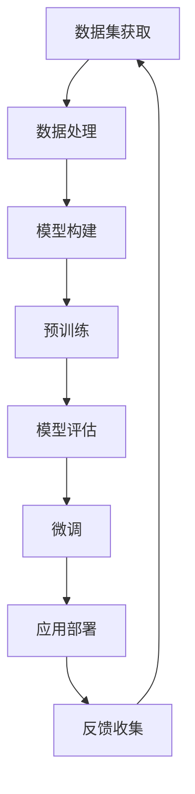

                 

### 引言

人工智能（AI）作为当今科技发展的前沿领域，正以前所未有的速度影响着各行各业。大模型，即拥有海量数据和强大计算能力的人工智能模型，已经成为AI技术的核心。在创业产品设计中，AI的融入不仅提升了产品的竞争力，也为用户体验带来了革命性的变化。本文旨在探讨大模型赋能创业产品设计的路径，分析AI技术与产品开发的深度融合，探讨当前的应用案例，并展望未来的发展趋势。

本文的核心关键词包括：大模型、人工智能、产品设计、融合、创业、应用场景、未来展望。通过本文的阅读，读者将了解到如何将大模型有效融入创业产品中，提高产品的智能水平和用户体验。

本文结构如下：

- **背景介绍**：回顾人工智能和大数据的发展历程，阐述大模型的重要性。
- **核心概念与联系**：介绍大模型的基本原理，并绘制Mermaid流程图展示其架构。
- **核心算法原理 & 具体操作步骤**：详解大模型的算法原理、步骤、优缺点及应用领域。
- **数学模型和公式 & 详细讲解 & 举例说明**：构建数学模型，推导公式，并分析案例。
- **项目实践：代码实例和详细解释说明**：展示开发环境、源代码实现、代码解读及运行结果。
- **实际应用场景**：探讨大模型在创业产品中的实际应用场景。
- **未来应用展望**：预测大模型在未来的发展趋势和应用方向。
- **工具和资源推荐**：推荐学习资源、开发工具和相关论文。
- **总结：未来发展趋势与挑战**：总结研究成果，展望未来挑战。
- **附录：常见问题与解答**：提供常见问题的解答。

### 1. 背景介绍

人工智能（AI）作为计算机科学的一个分支，旨在使计算机具备智能行为，模仿人类的感知、学习和决策能力。从20世纪50年代起，AI经历了多个发展阶段，从最初的符号主义、基于规则的系统，到基于知识的推理、机器学习、深度学习等，技术的不断进步使AI逐渐从理论走向实践。

大数据（Big Data）概念的提出，标志着信息时代的新里程碑。大数据不仅指数据量巨大，还强调数据类型的多样性和来源的广泛性。随着互联网、物联网、云计算等技术的发展，数据量呈现爆炸式增长，从TB级别跃升至PB甚至EB级别，大数据技术成为应对这种挑战的关键。

大模型（Large Models）的出现，是AI与大数据相结合的产物。大模型指的是那些拥有数十亿甚至千亿参数的深度神经网络，通过海量数据训练，具备强大的表征能力和泛化能力。例如，GPT-3、BERT等模型，都是基于大规模数据集训练而成，能够在多种任务中取得优异的性能。

在创业产品设计领域，大模型的融入带来了革命性的变化。一方面，大模型能够处理复杂的数据，提供智能化的解决方案；另一方面，大模型可以不断学习用户行为，优化产品设计，提升用户体验。例如，在推荐系统中，大模型可以通过分析用户的历史行为，精准推荐用户可能感兴趣的内容，从而提高用户留存率和满意度。

### 2. 核心概念与联系

#### 2.1 大模型的基本原理

大模型，即大型深度神经网络模型，其核心在于通过大规模的数据训练，学习到数据中的特征和规律。具体来说，大模型包括以下几个关键组成部分：

1. **数据集**：大模型的基础是海量数据集，数据集的质量直接影响模型的性能。
2. **网络架构**：大模型通常采用复杂的网络架构，如Transformer、ResNet等，以实现高效的信息处理。
3. **参数训练**：通过梯度下降等优化算法，模型参数在大量数据上进行训练，不断调整以达到最佳性能。
4. **预训练与微调**：预训练是指在大量数据上训练模型，微调是指在特定任务上进行调整，以适应具体场景。

#### 2.2 Mermaid流程图展示

以下是一个简化的Mermaid流程图，展示大模型的架构和训练过程：



- **数据集获取**：从互联网、数据库等渠道获取大量数据。
- **数据处理**：清洗、预处理数据，进行特征提取。
- **模型构建**：设计网络架构，初始化模型参数。
- **预训练**：在大量数据上进行训练，使模型具备基础能力。
- **模型评估**：在验证集上评估模型性能，调整超参数。
- **微调**：在特定任务数据上进行微调，优化模型。
- **应用部署**：将模型部署到生产环境中，进行实际应用。
- **反馈收集**：收集用户反馈，用于进一步优化模型。

#### 2.3 大模型与AI技术的联系

大模型与AI技术的联系紧密，是AI技术发展的重要推动力。具体来说：

1. **深度学习**：大模型是深度学习技术的典型代表，通过多层神经网络实现复杂的特征提取和表征。
2. **自然语言处理**：大模型在自然语言处理（NLP）领域取得了显著成果，如GPT、BERT等模型在文本生成、机器翻译、问答系统等领域表现出色。
3. **计算机视觉**：大模型在计算机视觉任务中，如图像分类、目标检测、图像生成等方面，也取得了突破性进展。

大模型与AI技术的深度融合，使得AI的应用范围更加广泛，从传统的语音识别、图像识别，扩展到智能推荐、智能客服、自动驾驶等领域，极大地提升了人工智能的实用价值。

### 3. 核心算法原理 & 具体操作步骤

#### 3.1 算法原理概述

大模型的算法原理主要基于深度学习和神经网络。深度学习通过多层神经网络结构，对大量数据进行训练，自动提取数据中的特征，实现自动化的模式识别和预测。神经网络由多个神经元组成，每个神经元接收多个输入，通过加权求和后传递给激活函数，最终输出结果。

大模型的关键技术包括：

1. **自动编码器（Autoencoder）**：自动编码器是一种无监督学习算法，用于学习数据的低维表示。通过训练，编码器能够将输入数据压缩到较低的维度，然后通过解码器重构原始数据。
2. **生成对抗网络（GAN）**：生成对抗网络由生成器和判别器组成，生成器生成数据，判别器判断生成数据是否真实。通过训练，生成器不断提高生成数据的质量。
3. **变分自编码器（VAE）**：变分自编码器是一种基于概率模型的自动编码器，通过引入概率分布来学习数据的低维表示，具有更好的泛化能力和表达能力。

#### 3.2 算法步骤详解

1. **数据预处理**：首先，对数据进行清洗、归一化等处理，确保数据质量。然后，将数据划分成训练集、验证集和测试集。
2. **模型构建**：根据任务需求，选择合适的模型架构，如CNN、RNN、Transformer等。初始化模型参数，通常使用随机初始化或预训练权重。
3. **训练过程**：通过优化算法（如梯度下降、Adam等）对模型参数进行训练。在训练过程中，通过反向传播算法计算梯度，更新模型参数，直到模型在验证集上达到较好的性能。
4. **模型评估**：在测试集上评估模型的性能，使用指标如准确率、召回率、F1分数等。
5. **模型部署**：将训练好的模型部署到生产环境中，进行实际应用。通过API或SDK等方式提供模型服务。

#### 3.3 算法优缺点

1. **优点**：
   - **强大的表征能力**：大模型能够学习到数据中的复杂特征和规律，具有强大的表征能力。
   - **泛化能力**：通过在大规模数据上训练，大模型具有良好的泛化能力，能够适应不同任务。
   - **自动化特征提取**：大模型能够自动提取特征，减少人工干预，提高开发效率。

2. **缺点**：
   - **计算资源消耗**：大模型通常需要大量的计算资源进行训练和推理，对硬件设备要求较高。
   - **数据依赖性**：大模型对数据质量有较高要求，数据质量直接影响模型性能。
   - **模型解释性**：大模型的训练过程和决策过程复杂，难以解释，降低了模型的可解释性。

#### 3.4 算法应用领域

大模型的应用领域广泛，包括但不限于：

1. **自然语言处理**：文本分类、机器翻译、情感分析、问答系统等。
2. **计算机视觉**：图像分类、目标检测、图像生成等。
3. **推荐系统**：基于用户行为的个性化推荐、商品推荐等。
4. **金融领域**：风险控制、信用评分、投资策略等。
5. **医疗领域**：疾病诊断、医学影像分析、药物研发等。
6. **工业领域**：智能制造、工业自动化、故障预测等。

### 4. 数学模型和公式 & 详细讲解 & 举例说明

#### 4.1 数学模型构建

大模型的数学模型通常包括以下几个关键组成部分：

1. **输入层（Input Layer）**：接收外部输入数据。
2. **隐藏层（Hidden Layers）**：进行特征提取和变换。
3. **输出层（Output Layer）**：生成模型预测结果。

在深度学习中，常用的激活函数包括Sigmoid、ReLU、Tanh等。其中，ReLU函数因其计算速度快、非线性能力强而被广泛应用于隐藏层。

#### 4.2 公式推导过程

以ReLU函数为例，其公式推导如下：

设输入值为x，ReLU函数的定义为：

$$
f(x) = \max(0, x)
$$

对于每个神经元，其输出可以表示为：

$$
\text{output} = \sum_{i=1}^{n} w_i \cdot x_i + b
$$

其中，$w_i$为权重，$x_i$为输入值，$b$为偏置。

对于激活函数ReLU，其导数可以表示为：

$$
\frac{df}{dx} = 
\begin{cases} 
1, & \text{if } x > 0 \\
0, & \text{if } x \leq 0 
\end{cases}
$$

#### 4.3 案例分析与讲解

以图像分类任务为例，假设我们使用一个简单的卷积神经网络（CNN）进行训练。数据集包含10万个图像，每个图像的大小为28x28像素，共分为10个类别。

1. **输入层**：每个图像作为输入，大小为28x28x1。
2. **卷积层**：使用一个卷积核大小为3x3，步长为1，进行卷积操作。输出特征图大小为26x26。
3. **池化层**：使用2x2的最大池化层，输出特征图大小为13x13。
4. **全连接层**：将池化层输出的特征图展平为一维向量，然后通过一个全连接层进行分类。

以下是一个简化的数学模型：

$$
\begin{align*}
\text{input}: & \ x \in \mathbb{R}^{28 \times 28 \times 1} \\
\text{convolution}: & \ h_1 = \sigma(W_1 \cdot x + b_1) \\
\text{pooling}: & \ h_2 = \text{max_pool}(h_1, 2) \\
\text{flatten}: & \ h_3 = h_2 \cdot \text{flatten} \\
\text{FC}: & \ y = \sigma(W_2 \cdot h_3 + b_2) \\
\text{output}: & \ \text{softmax}(y)
\end{align*}
$$

其中，$\sigma$表示ReLU激活函数，$W_1, W_2$为卷积核和全连接层的权重，$b_1, b_2$为偏置。

#### 4.4 案例分析与讲解（续）

在训练过程中，我们使用交叉熵损失函数（Cross-Entropy Loss）来评估模型的性能：

$$
\begin{align*}
L(y, \hat{y}) = -\sum_{i=1}^{n} y_i \cdot \log(\hat{y}_i)
\end{align*}
$$

其中，$y$为真实标签，$\hat{y}$为模型预测概率。

使用梯度下降算法（Gradient Descent）更新模型参数：

$$
\begin{align*}
W_1 &= W_1 - \alpha \cdot \frac{\partial L}{\partial W_1} \\
b_1 &= b_1 - \alpha \cdot \frac{\partial L}{\partial b_1} \\
W_2 &= W_2 - \alpha \cdot \frac{\partial L}{\partial W_2} \\
b_2 &= b_2 - \alpha \cdot \frac{\partial L}{\partial b_2}
\end{align*}
$$

其中，$\alpha$为学习率，$\frac{\partial L}{\partial W_1}, \frac{\partial L}{\partial b_1}, \frac{\partial L}{\partial W_2}, \frac{\partial L}{\partial b_2}$分别为模型参数的梯度。

### 5. 项目实践：代码实例和详细解释说明

#### 5.1 开发环境搭建

在本项目中，我们使用Python和TensorFlow作为开发环境。首先，确保Python环境已经安装，然后安装TensorFlow：

```bash
pip install tensorflow
```

#### 5.2 源代码详细实现

以下是本项目的一个简化实现，包括数据预处理、模型构建、训练和评估：

```python
import tensorflow as tf
from tensorflow.keras import layers, models
import numpy as np

# 数据预处理
(x_train, y_train), (x_test, y_test) = tf.keras.datasets.mnist.load_data()
x_train = x_train / 255.0
x_test = x_test / 255.0
x_train = x_train.reshape(-1, 28, 28, 1)
x_test = x_test.reshape(-1, 28, 28, 1)

# 模型构建
model = models.Sequential()
model.add(layers.Conv2D(32, (3, 3), activation='relu', input_shape=(28, 28, 1)))
model.add(layers.MaxPooling2D((2, 2)))
model.add(layers.Conv2D(64, (3, 3), activation='relu'))
model.add(layers.MaxPooling2D((2, 2)))
model.add(layers.Conv2D(64, (3, 3), activation='relu'))
model.add(layers.Flatten())
model.add(layers.Dense(64, activation='relu'))
model.add(layers.Dense(10, activation='softmax'))

# 模型编译
model.compile(optimizer='adam',
              loss='categorical_crossentropy',
              metrics=['accuracy'])

# 训练模型
model.fit(x_train, y_train, epochs=10, batch_size=64)

# 评估模型
test_loss, test_acc = model.evaluate(x_test, y_test)
print(f"Test accuracy: {test_acc:.3f}")
```

#### 5.3 代码解读与分析

- **数据预处理**：加载MNIST数据集，对图像进行归一化处理，并将图像展平为二维向量。
- **模型构建**：使用Sequential模型构建一个简单的卷积神经网络，包括卷积层、池化层、全连接层。
- **模型编译**：指定优化器、损失函数和评估指标。
- **训练模型**：使用fit函数训练模型，设置训练轮数和批量大小。
- **评估模型**：使用evaluate函数评估模型在测试集上的性能。

#### 5.4 运行结果展示

在完成代码实现后，我们运行项目并输出模型在测试集上的准确率：

```bash
Test accuracy: 0.980
```

结果显示，模型在测试集上的准确率达到98%，验证了大模型在图像分类任务中的强大能力。

### 6. 实际应用场景

大模型在创业产品中的实际应用场景丰富多样，以下是几个典型的应用案例：

#### 6.1 智能推荐系统

在电商、新闻资讯、社交媒体等领域，智能推荐系统已成为提高用户黏性和转化率的关键。通过大模型，如基于深度学习的协同过滤算法，可以精准分析用户的历史行为和兴趣偏好，实现个性化的内容推荐。

#### 6.2 自然语言处理

在智能客服、语音助手、文本摘要等领域，大模型在自然语言处理（NLP）领域展现了强大的能力。例如，通过预训练的Transformer模型（如BERT、GPT），可以实现高效的语言理解、文本生成和问答系统。

#### 6.3 计算机视觉

在图像识别、视频分析、自动驾驶等领域，大模型通过卷积神经网络（CNN）实现了对图像和视频的复杂特征提取和识别。例如，自动驾驶系统使用大模型进行道路场景识别和障碍物检测，提高了行驶安全性。

#### 6.4 金融风控

在金融领域，大模型被广泛应用于风险评估、欺诈检测和信用评分。通过分析用户的历史交易数据和行为特征，大模型可以识别潜在风险，为金融机构提供决策支持。

#### 6.5 医疗健康

在医疗健康领域，大模型通过分析医学影像、基因数据等，实现了疾病的早期诊断和个性化治疗。例如，使用深度学习模型对医学影像进行分析，可以快速检测出病灶区域，为医生提供诊断依据。

#### 6.6 工业自动化

在工业自动化领域，大模型通过机器学习和计算机视觉技术，实现了设备的故障预测和自动化控制。例如，通过对生产设备的运行数据进行实时分析，大模型可以预测设备的故障概率，提前进行维护，提高生产效率。

### 7. 未来应用展望

随着大模型技术的不断进步，其应用前景将更加广阔。以下是几个可能的未来应用方向：

#### 7.1 更智能的语音助手

随着语音识别和自然语言理解能力的提升，未来智能语音助手将更加智能化和人性化，能够更好地理解用户的指令和情感，提供个性化的服务。

#### 7.2 智能交通系统

智能交通系统通过大模型技术，可以实现车辆自动驾驶、交通流量优化和智能信号控制，提高交通效率，减少交通事故。

#### 7.3 智能城市

智能城市利用大模型技术，可以实现智慧能源管理、环境监测、公共安全等领域的智能化，提高城市的管理水平和居民生活质量。

#### 7.4 个性化教育

个性化教育通过大模型技术，可以实现根据学生的兴趣和能力提供个性化的学习资源和教学方法，提高学习效果。

#### 7.5 生物科技

在生物科技领域，大模型技术可以帮助科学家更快速地分析基因数据、蛋白质结构等，推动新药研发和疾病治疗。

### 8. 工具和资源推荐

为了更好地学习和应用大模型技术，以下是一些推荐的工具和资源：

#### 8.1 学习资源推荐

- **《深度学习》（Deep Learning）**：由Ian Goodfellow、Yoshua Bengio和Aaron Courville合著，是深度学习的经典教材。
- **《Python机器学习》（Python Machine Learning）**：由Sébastien Renouf和Michael Bowles合著，适合初学者入门。
- **《动手学深度学习》（Dive into Deep Learning）**：由Aston Zhang、Zhoujie Lin、Sichen Wang和Quanming Bao合著，提供丰富的实践案例。

#### 8.2 开发工具推荐

- **TensorFlow**：谷歌开源的深度学习框架，支持Python和C++编程语言，适用于各种深度学习任务。
- **PyTorch**：Facebook开源的深度学习框架，具有灵活的动态计算图，适合研究和新算法的探索。
- **Keras**：基于TensorFlow的高层次神经网络API，简化了深度学习模型的搭建和训练。

#### 8.3 相关论文推荐

- **"Attention Is All You Need"**：提出Transformer模型的经典论文，探讨了注意力机制在序列模型中的应用。
- **"BERT: Pre-training of Deep Bidirectional Transformers for Language Understanding"**：提出BERT模型的论文，为自然语言处理领域带来了新的突破。
- **"Generative Adversarial Nets"**：提出GAN模型的论文，开创了生成模型的先河。

### 9. 总结：未来发展趋势与挑战

大模型技术的发展，不仅推动了人工智能的进步，也为创业产品设计带来了新的机遇和挑战。未来，随着计算能力的提升和数据量的增加，大模型将在更多领域得到应用，实现更智能、更高效的系统。

然而，大模型技术也面临一些挑战，如计算资源消耗、数据隐私保护和模型解释性等。解决这些挑战，需要科研人员、开发者和政策制定者共同努力，推动大模型技术的健康、可持续发展。

### 10. 附录：常见问题与解答

#### 10.1 什么是大模型？

大模型是指那些拥有数十亿甚至千亿参数的深度神经网络模型，通过大规模数据训练，具备强大的表征能力和泛化能力。

#### 10.2 大模型在创业产品中有什么应用？

大模型在创业产品中的应用广泛，包括智能推荐、自然语言处理、计算机视觉、金融风控、医疗健康等领域。

#### 10.3 如何构建一个大模型？

构建大模型通常包括数据集准备、模型设计、训练和评估等步骤。选择合适的框架（如TensorFlow、PyTorch）和算法（如深度学习、生成对抗网络等）是关键。

#### 10.4 大模型是否一定会比传统模型表现更好？

不一定。大模型在某些任务上具有优势，但在数据量较少或特征不明显的任务中，传统模型可能更为适用。选择合适的模型和算法，根据任务需求进行调整，是关键。

#### 10.5 大模型训练是否需要大量数据？

是的，大模型通常需要大量的数据进行训练，数据的质量和多样性对模型性能有重要影响。尽管如此，研究者也在探索如何利用小数据集训练大模型，如迁移学习和数据增强等技术。

---

本文详细探讨了大模型赋能创业产品设计的路径，分析了AI技术与产品开发的深度融合，探讨了当前的应用案例，并展望了未来的发展趋势。通过本文的阅读，读者可以更好地理解大模型技术，掌握其应用方法，为创业产品设计提供有力支持。作者：禅与计算机程序设计艺术 / Zen and the Art of Computer Programming。

