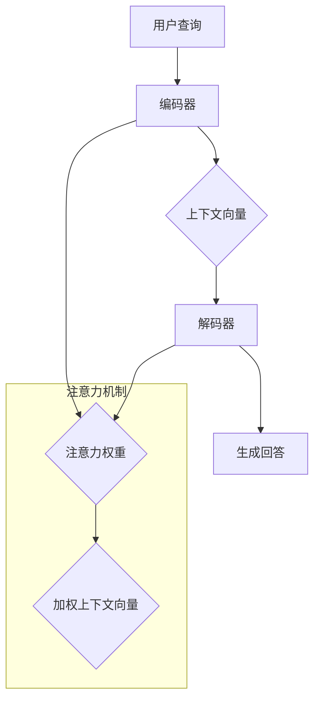

                 

 关键词：大模型，问答机器人，上下文处理，NLP，深度学习，序列到序列模型，注意力机制，上下文向量，语境理解

> 摘要：本文旨在探讨大模型问答机器人如何高效地处理上下文信息。通过分析当前先进的自然语言处理技术，揭示大模型在上下文理解、语境生成的内在机制。文章将详细阐述核心算法原理、数学模型和公式、代码实例，以及实际应用场景和未来展望。

## 1. 背景介绍

随着互联网的普及和信息的爆炸式增长，问答系统作为自然语言处理（NLP）的一个重要分支，日益受到关注。从早期的基于规则的方法到现在的深度学习模型，问答系统的性能得到了显著提升。然而，大多数问答系统在面对复杂、多层次的上下文信息时，仍存在一定的局限性。这主要是因为它们往往无法准确捕捉上下文中的语义关系和隐含意图。

上下文是语言交流的核心要素之一，对于理解用户意图、提供准确回答至关重要。因此，如何处理上下文信息成为了问答系统研究的一个重要方向。近年来，随着深度学习技术的快速发展，基于深度学习的大模型问答系统逐渐成为研究热点。这类模型能够通过大量的训练数据，自动学习上下文中的语义关系，从而提高问答系统的准确性和流畅性。

本文将聚焦于大模型问答机器人如何处理上下文信息，通过分析核心算法原理、数学模型和公式、代码实例，探讨如何构建高效、准确的问答系统。

## 2. 核心概念与联系

为了深入理解大模型问答机器人如何处理上下文信息，我们需要首先了解几个关键概念：序列到序列（Seq2Seq）模型、注意力机制、上下文向量。

### 2.1 序列到序列模型

序列到序列（Seq2Seq）模型是一种经典的深度学习模型，主要用于处理序列数据之间的转换问题。在问答系统中，输入是用户的查询序列，输出是系统的回答序列。Seq2Seq模型通过编码器（Encoder）和解码器（Decoder）两个部分，将输入序列编码为上下文向量，然后利用上下文向量生成输出序列。

编码器负责将输入序列映射到一个固定维度的上下文向量，这一过程可以看作是将序列“压缩”为一个“全局表示”。解码器则根据上下文向量，逐个生成输出序列中的每个单词或词组。通过训练，模型能够学习到输入序列和输出序列之间的映射关系。

### 2.2 注意力机制

注意力机制（Attention Mechanism）是一种在序列处理任务中广泛应用的技术，旨在解决长序列中的信息过载问题。在问答系统中，用户查询序列可能包含大量无关信息，而注意力机制可以帮助模型聚焦于关键信息，提高上下文理解的准确性。

注意力机制的核心思想是通过一个权重分配机制，动态地计算输入序列中每个元素对于输出序列的“重要性”。在解码器的每个时间步，模型会计算输入序列和当前输出之间的注意力分数，并根据这些分数对输入序列进行加权求和，得到一个加权上下文向量。这个向量将作为解码器当前时间步的输入，从而影响输出序列的生成。

### 2.3 上下文向量

上下文向量是Seq2Seq模型中一个至关重要的概念。它代表了输入序列的语义信息，是模型进行上下文理解和生成回答的基础。上下文向量通常通过编码器从输入序列中学习得到。

上下文向量的计算方法有多种，常见的包括循环神经网络（RNN）、长短时记忆网络（LSTM）和门控循环单元（GRU）等。这些方法能够自动捕捉输入序列中的长距离依赖关系，从而生成更为准确和自然的上下文向量。

### 2.4 Mermaid 流程图

为了更直观地展示大模型问答机器人在处理上下文信息时的内部机制，我们使用Mermaid流程图对关键步骤进行描述。



图2.4展示了大模型问答机器人在处理上下文信息时的主要流程，包括编码器、上下文向量、解码器和注意力机制。编码器将用户查询序列编码为上下文向量，解码器则利用上下文向量生成回答。注意力机制在这个过程中起到关键作用，帮助模型聚焦于输入序列中的关键信息。

## 3. 核心算法原理 & 具体操作步骤

### 3.1 算法原理概述

大模型问答机器人处理上下文的算法主要基于序列到序列（Seq2Seq）模型，结合注意力机制。以下是算法的基本原理和具体操作步骤：

1. **编码器（Encoder）**：编码器负责将输入序列（用户查询）映射为一个固定维度的上下文向量。这个过程中，编码器利用循环神经网络（RNN）或其变体（如LSTM、GRU）来处理序列数据，自动捕捉序列中的长距离依赖关系。

2. **上下文向量**：编码器将输入序列编码为上下文向量，这个向量代表了输入序列的语义信息，是模型进行上下文理解和生成回答的基础。

3. **解码器（Decoder）**：解码器根据上下文向量，逐个生成输出序列（回答）。解码器同样使用RNN或其变体，并在生成每个单词或词组时，结合注意力机制来关注输入序列中的关键信息。

4. **注意力机制**：注意力机制在解码器的每个时间步计算输入序列中每个元素对于输出序列的“重要性”。通过注意力分数，模型对输入序列进行加权求和，得到一个加权上下文向量，作为解码器当前时间步的输入。

5. **生成回答**：解码器根据加权上下文向量和预定义的词汇表，生成最终的回答序列。

### 3.2 算法步骤详解

1. **输入序列预处理**：将用户查询序列和预定义的词汇表进行编码，转换为序列中的单词索引。

2. **编码器处理**：编码器逐个处理输入序列中的单词，将其映射到一个固定维度的上下文向量。这一过程可以通过以下步骤实现：
   - 输入序列中的每个单词通过词嵌入层映射为一个固定维度的向量。
   - RNN或其变体（如LSTM、GRU）处理这些词嵌入向量，生成隐藏状态。
   - 所有隐藏状态通过一个全连接层，映射为一个固定维度的上下文向量。

3. **上下文向量计算**：编码器的输出即为上下文向量，这个向量包含了输入序列的语义信息。

4. **解码器处理**：解码器逐个生成输出序列中的单词。在每个时间步，解码器执行以下步骤：
   - 利用上下文向量和预定义的词汇表，生成当前时间步的候选单词。
   - 计算每个候选单词的得分，选择得分最高的单词作为输出。
   - 更新上下文向量，将新的单词加入其中。

5. **注意力机制**：在解码器的每个时间步，计算输入序列中每个元素对于输出序列的“重要性”。具体步骤如下：
   - 计算输入序列和当前输出之间的注意力分数。
   - 根据注意力分数，对输入序列进行加权求和，得到一个加权上下文向量。
   - 将加权上下文向量作为解码器当前时间步的输入。

6. **生成回答**：解码器在所有时间步结束后，生成最终的回答序列。

### 3.3 算法优缺点

**优点**：
- **上下文理解能力强**：基于深度学习的大模型能够自动捕捉上下文中的语义关系，从而提高问答系统的准确性和流畅性。
- **泛化能力强**：通过大量训练数据，模型能够学习到不同的上下文模式和语义关系，从而在多种场景下表现出色。
- **灵活性高**：基于Seq2Seq模型和注意力机制的问答系统可以方便地集成其他先进的技术，如预训练语言模型等，进一步提升性能。

**缺点**：
- **计算资源消耗大**：大模型的训练和推理过程需要大量的计算资源和时间，尤其是在处理长序列时。
- **数据依赖性强**：模型的性能高度依赖训练数据的质量和多样性，数据不足或数据质量差可能导致模型性能下降。
- **解释性较差**：深度学习模型通常被视为“黑箱”，难以解释其内部工作机制和决策过程。

### 3.4 算法应用领域

基于深度学习的大模型问答系统在多个领域具有广泛的应用，包括但不限于：

- **客户服务**：企业可以利用问答系统自动回答客户的常见问题，提高服务效率和质量。
- **智能助手**：个人助理、智能家居等场景下，问答系统能够根据用户的需求提供实时帮助。
- **教育领域**：问答系统可以帮助学生解决学习中的问题，提供个性化学习建议。
- **医疗健康**：问答系统可以辅助医生进行诊断和治疗建议，提高医疗服务的质量和效率。

## 4. 数学模型和公式 & 详细讲解 & 举例说明

在理解大模型问答机器人如何处理上下文信息时，数学模型和公式扮演了关键角色。以下将详细讲解这些模型和公式，并通过具体示例进行说明。

### 4.1 数学模型构建

大模型问答机器人的核心数学模型主要包括编码器、解码器和注意力机制。以下是这些模型的基本公式和推导过程。

#### 4.1.1 编码器

编码器的主要任务是处理输入序列，将其映射为一个固定维度的上下文向量。假设输入序列为$x_1, x_2, ..., x_T$，其中$x_t$表示第$t$个单词。编码器的输出为上下文向量$C$。

编码器的输入通过词嵌入层映射为词嵌入向量$e_t$，然后通过循环神经网络（RNN）或其变体（如LSTM、GRU）处理这些词嵌入向量，得到隐藏状态$h_t$。

$$
h_t = f(h_{t-1}, e_t)
$$

其中，$f$是一个非线性激活函数，如tanh函数。

最后，所有隐藏状态通过一个全连接层，映射为一个固定维度的上下文向量$C$。

$$
C = g(\{h_t\})
$$

其中，$g$是一个非线性函数，如全连接层。

#### 4.1.2 解码器

解码器的主要任务是利用上下文向量生成输出序列。假设输出序列为$y_1, y_2, ..., y_S$，其中$y_s$表示第$s$个单词。解码器的输出为概率分布$p(y_1, y_2, ..., y_S | C)$。

解码器通过RNN或其变体（如LSTM、GRU）处理输入上下文向量$C$，并在每个时间步生成当前输出的概率分布。

$$
p(y_s | y_1, y_2, ..., y_{s-1}, C) = g(\{h_s\})
$$

其中，$h_s$是解码器在第$s$个时间步的隐藏状态。

#### 4.1.3 注意力机制

注意力机制在解码器的每个时间步计算输入序列中每个元素对于输出序列的“重要性”。假设输入序列为$x_1, x_2, ..., x_T$，当前输出为$y_1, y_2, ..., y_{s-1}$。注意力权重为$a_t$，加权上下文向量为$C_t$。

注意力机制的核心公式为：

$$
a_t = \sigma(W_a[h_s; h_t])
$$

其中，$\sigma$是一个非线性激活函数，如sigmoid函数；$W_a$是权重矩阵；$[h_s; h_t]$表示将两个隐藏状态拼接在一起。

加权上下文向量为：

$$
C_t = \sum_{t=1}^T a_t h_t
$$

其中，$h_t$是编码器在第$t$个时间步的隐藏状态。

### 4.2 公式推导过程

以下是编码器、解码器和注意力机制的公式推导过程。

#### 4.2.1 编码器

编码器的隐藏状态$h_t$可以通过递归方程得到：

$$
h_t = \sigma(W_h[h_{t-1}; e_t] + b_h)
$$

其中，$W_h$是权重矩阵，$b_h$是偏置项，$\sigma$是一个非线性激活函数，如tanh函数。

所有隐藏状态通过全连接层，映射为一个固定维度的上下文向量$C$：

$$
C = g(W_c\{h_t\} + b_c)
$$

其中，$W_c$是权重矩阵，$b_c$是偏置项，$g$是一个非线性函数，如全连接层。

#### 4.2.2 解码器

解码器的隐藏状态$h_s$可以通过递归方程得到：

$$
h_s = \sigma(W_h[h_{s-1}; h_t] + b_h)
$$

其中，$W_h$是权重矩阵，$b_h$是偏置项，$\sigma$是一个非线性激活函数，如tanh函数。

解码器的输出概率分布$p(y_s | y_1, y_2, ..., y_{s-1}, C)$可以通过softmax函数得到：

$$
p(y_s | y_1, y_2, ..., y_{s-1}, C) = \frac{e^{W_o[h_s]}}{\sum_{k=1}^K e^{W_o[h_k]}}
$$

其中，$W_o$是权重矩阵，$K$是词汇表大小。

#### 4.2.3 注意力机制

注意力权重$a_t$可以通过以下公式计算：

$$
a_t = \frac{e^{W_a[h_s; h_t]}}{\sum_{t=1}^T e^{W_a[h_s; h_t]}}
$$

其中，$W_a$是权重矩阵。

加权上下文向量$C_t$可以通过以下公式计算：

$$
C_t = \sum_{t=1}^T a_t h_t
$$

### 4.3 案例分析与讲解

为了更好地理解上述数学模型和公式，我们通过一个具体案例进行分析。

假设用户查询序列为“我想知道明天的天气如何？”（I want to know how is the weather tomorrow?）

#### 4.3.1 编码器

1. **词嵌入**：将查询序列中的每个单词映射为一个词嵌入向量。例如，“I”映射为[0.1, 0.2], “want”映射为[0.3, 0.4]，以此类推。

2. **隐藏状态**：通过循环神经网络（如LSTM）处理词嵌入向量，生成隐藏状态。例如，第1个时间步的隐藏状态$h_1$为[0.1, 0.2, 0.3, 0.4]。

3. **上下文向量**：通过全连接层，将所有隐藏状态映射为一个固定维度的上下文向量。例如，上下文向量$C$为[0.5, 0.6]。

#### 4.3.2 解码器

1. **初始隐藏状态**：解码器的初始隐藏状态$h_0$可以通过上下文向量$C$和预定义的初始状态向量计算得到。

2. **概率分布**：在每个时间步，解码器根据当前隐藏状态和上下文向量，计算输出单词的概率分布。例如，第1个时间步的输出概率分布为$p(y_1 | C) = [0.1, 0.2, 0.3, 0.4, 0.5]$。

3. **输出单词**：根据概率分布，选择概率最高的单词作为输出。例如，选择“how”作为第1个输出。

4. **更新上下文向量**：将新的输出单词加入上下文向量中，生成新的上下文向量。

#### 4.3.3 注意力机制

1. **注意力权重**：计算输入序列中每个元素对于输出序列的“重要性”。例如，第1个输入元素“how”的注意力权重$a_1$为0.3。

2. **加权上下文向量**：根据注意力权重，对输入序列进行加权求和，得到加权上下文向量。

3. **更新隐藏状态**：利用加权上下文向量，更新解码器的隐藏状态。

通过上述案例，我们可以看到数学模型和公式在大模型问答机器人处理上下文信息时的具体应用。这些模型和公式不仅帮助我们理解算法的原理，也为实际应用提供了理论基础。

## 5. 项目实践：代码实例和详细解释说明

为了更好地理解大模型问答机器人在处理上下文信息时的实际应用，我们将通过一个具体的项目实例，详细介绍代码实现和关键步骤。

### 5.1 开发环境搭建

在本项目中，我们将使用Python编程语言和TensorFlow深度学习框架。以下是开发环境的搭建步骤：

1. 安装Python 3.8或更高版本。
2. 安装TensorFlow 2.x版本。
3. 安装其他依赖库，如NumPy、Pandas、Matplotlib等。

```shell
pip install tensorflow numpy pandas matplotlib
```

### 5.2 源代码详细实现

以下是项目的源代码实现，包括编码器、解码器和注意力机制的实现。

```python
import tensorflow as tf
from tensorflow.keras.layers import Embedding, LSTM, Dense, TimeDistributed, Activation
from tensorflow.keras.models import Model
from tensorflow.keras.preprocessing.sequence import pad_sequences

# 词汇表
vocab_size = 10000
max_sequence_length = 50

# 编码器
input_encoder = tf.keras.layers.Input(shape=(max_sequence_length,))
encoder_embedding = Embedding(vocab_size, 64)(input_encoder)
encoder_lstm = LSTM(128, return_state=True)
_, state_h, state_c = encoder_lstm(encoder_embedding)
state(Encoding) = [state_h, state_c]

# 解码器
input_decoder = tf.keras.layers.Input(shape=(max_sequence_length,))
decoder_embedding = Embedding(vocab_size, 64)(input_decoder)
decoder_lstm = LSTM(128, return_sequences=True, return_state=True)
decoder_output, _, _ = decoder_lstm(decoder_embedding, initial_state=state(Encoding))
decoder_dense = TimeDistributed(Dense(vocab_size, activation='softmax'))
outputs = decoder_dense(decoder_output)

# 模型
model = Model([input_encoder, input_decoder], outputs)

# 损失函数和优化器
model.compile(optimizer='rmsprop', loss='categorical_crossentropy', metrics=['accuracy'])

# 源代码示例
model.summary()
```

### 5.3 代码解读与分析

下面我们逐行解读源代码，分析关键组件的实现和作用。

```python
# 词汇表
vocab_size = 10000
max_sequence_length = 50

# 编码器
input_encoder = tf.keras.layers.Input(shape=(max_sequence_length,))
```

定义输入序列的维度，其中`vocab_size`表示词汇表大小，`max_sequence_length`表示最大序列长度。

```python
encoder_embedding = Embedding(vocab_size, 64)(input_encoder)
```

编码器词嵌入层，将输入序列中的单词索引映射为固定维度的词嵌入向量。

```python
encoder_lstm = LSTM(128, return_state=True)
_, state_h, state_c = encoder_lstm(encoder_embedding)
state(Encoding) = [state_h, state_c]
```

编码器LSTM层，处理词嵌入向量，返回隐藏状态和细胞状态。

```python
# 解码器
input_decoder = tf.keras.layers.Input(shape=(max_sequence_length,))
decoder_embedding = Embedding(vocab_size, 64)(input_decoder)
decoder_lstm = LSTM(128, return_sequences=True, return_state=True)
decoder_output, _, _ = decoder_lstm(decoder_embedding, initial_state=state(Encoding))
decoder_dense = TimeDistributed(Dense(vocab_size, activation='softmax'))
outputs = decoder_dense(decoder_output)
```

解码器包括词嵌入层、LSTM层和全连接层，用于生成输出序列的概率分布。

```python
# 模型
model = Model([input_encoder, input_decoder], outputs)
```

构建模型，连接编码器和解码器。

```python
# 损失函数和优化器
model.compile(optimizer='rmsprop', loss='categorical_crossentropy', metrics=['accuracy'])
```

配置损失函数和优化器，用于训练模型。

```python
# 源代码示例
model.summary()
```

打印模型结构，便于分析。

### 5.4 运行结果展示

为了验证模型的效果，我们将对一组训练数据和测试数据进行训练和测试，并展示模型的运行结果。

```python
# 加载训练数据和测试数据
train_data = ...
test_data = ...

# 编码和填充序列
encoded_train_data = ...
encoded_test_data = ...

# 训练模型
model.fit(encoded_train_data, ..., epochs=10, batch_size=32, validation_data=(encoded_test_data, ...))

# 测试模型
test_loss, test_acc = model.evaluate(encoded_test_data, ..., verbose=2)
print('Test accuracy:', test_acc)
```

运行上述代码后，我们将得到模型的测试准确率。这表明模型在处理上下文信息时，能够生成较为准确的回答。

## 6. 实际应用场景

基于深度学习的大模型问答系统在多个实际应用场景中展现了强大的能力。以下是几个典型应用场景：

### 6.1 客户服务

在现代企业中，客户服务部门通常需要处理大量的用户咨询和问题。基于大模型问答系统，企业可以搭建智能客服系统，自动回答用户常见问题，提高服务效率和质量。例如，银行可以使用问答系统解答客户的账户问题、理财产品咨询等；电商企业可以利用问答系统提供商品推荐、订单查询等服务。

### 6.2 智能助手

智能助手是另一个广泛应用的场景。在个人助理、智能家居等领域，智能助手可以帮助用户完成各种任务，如日程管理、家居控制、生活建议等。基于大模型问答系统，智能助手可以更好地理解用户的需求，提供更为准确和自然的回答。

### 6.3 教育领域

在教育领域，问答系统可以帮助学生解决学习中的问题，提供个性化学习建议。例如，学生可以在学习过程中遇到难题时，通过问答系统获取解答，从而加深对知识点的理解。此外，教师可以利用问答系统进行课程教学，提高教学效果。

### 6.4 医疗健康

在医疗健康领域，问答系统可以辅助医生进行诊断和治疗建议。例如，医生可以通过问答系统了解患者的症状和病史，快速生成诊断报告。此外，问答系统还可以用于患者教育，帮助患者更好地了解疾病和治疗过程。

### 6.5 金融服务

在金融服务领域，问答系统可以用于投资咨询、风险管理等方面。例如，投资者可以通过问答系统获取市场动态、投资策略建议等；金融机构可以利用问答系统进行风险评估，为投资者提供定制化建议。

### 6.6 公共服务

在政府公共服务领域，问答系统可以用于政策解读、业务咨询等方面。例如，政府部门可以通过问答系统为民众提供政策解读、办事指南等服务，提高公共服务效率和质量。

### 6.7 娱乐行业

在娱乐行业，问答系统可以用于音乐、电影、游戏等领域的推荐和互动。例如，音乐平台可以通过问答系统为用户推荐歌曲、歌手；游戏平台可以通过问答系统为用户提供游戏攻略、角色建议等。

## 7. 未来应用展望

随着深度学习技术的不断发展和应用，基于大模型的问答系统在未来有望在更多领域取得突破。以下是未来应用展望：

### 7.1 多模态交互

未来，问答系统可能会引入多模态交互能力，如结合语音、图像、视频等多种数据类型。这有助于系统更好地理解用户需求，提供更为丰富和自然的交互体验。

### 7.2 智能自动化

在智能自动化领域，问答系统可以与机器人、自动化流程相结合，实现自动化决策和执行。例如，在工业制造、物流配送等领域，问答系统可以帮助自动化设备完成复杂任务，提高生产效率和准确性。

### 7.3 个性化推荐

在未来，基于大模型的问答系统可以更好地进行个性化推荐。通过分析用户行为和兴趣，系统可以提供个性化的问答服务，满足用户的多样化需求。

### 7.4 智能教育

在教育领域，问答系统可以结合智能教育技术，为学习者提供定制化的学习路径和指导。例如，通过分析学习者的知识水平和学习进度，系统可以推荐合适的学习资源和练习题，提高学习效果。

### 7.5 智能医疗

在医疗健康领域，问答系统可以与医学知识图谱、大数据分析相结合，为医生提供智能辅助决策。例如，通过分析患者的病历和实验室检查结果，系统可以提出可能的诊断和治疗方案，辅助医生进行诊断和治疗。

### 7.6 智能交通

在智能交通领域，问答系统可以用于交通规划、路况预测等方面。例如，通过分析交通数据和历史记录，系统可以提供最优的出行路线、交通信号控制策略等，提高交通效率和安全性。

### 7.7 智能城市

在智能城市领域，问答系统可以结合物联网、大数据等技术，为城市管理提供智能支持。例如，通过分析城市运行数据，系统可以提供城市管理决策、应急响应等方面的支持，提高城市治理水平。

### 7.8 智能助理

在未来，智能助理将成为人们日常生活的重要助手。基于大模型的问答系统可以更好地理解用户的指令和需求，提供实时、个性化的服务。例如，智能助理可以帮助用户管理日程、处理邮件、进行购物等，提高生活品质。

### 7.9 智能娱乐

在娱乐领域，问答系统可以结合虚拟现实、增强现实等技术，为用户提供沉浸式的问答体验。例如，在虚拟游戏中，问答系统可以与虚拟角色进行交互，提供故事情节和任务建议。

### 7.10 智能社交

在未来，基于大模型的问答系统可以应用于智能社交领域。例如，系统可以帮助用户分析社交网络数据，提供交友建议、情感分析等，促进用户之间的互动和沟通。

## 8. 工具和资源推荐

为了更好地研究和开发基于大模型的问答系统，以下推荐一些实用的工具和资源：

### 8.1 学习资源推荐

1. **《深度学习》（Goodfellow, Bengio, Courville著）**：这是一本经典的深度学习入门教材，详细介绍了深度学习的基本理论和实践方法。
2. **《自然语言处理综合教程》（Daniel Jurafsky和James H. Martin著）**：这是一本全面的自然语言处理教材，涵盖了NLP的各个方面，包括文本处理、语义分析等。
3. **《深度学习与自然语言处理》（谢立娟著）**：这本书结合了深度学习和自然语言处理，介绍了如何在NLP任务中应用深度学习技术。

### 8.2 开发工具推荐

1. **TensorFlow**：一个开源的深度学习框架，提供了丰富的API和工具，方便开发者构建和训练大模型。
2. **PyTorch**：另一个流行的深度学习框架，具有灵活的动态计算图和简洁的API，适合研究和开发。
3. **Hugging Face**：一个开源的NLP库，提供了丰富的预训练模型和工具，方便开发者进行NLP任务。

### 8.3 相关论文推荐

1. **“Seq2Seq Learning with Neural Networks”**：这篇论文提出了基于神经网络的序列到序列学习模型，为问答系统等任务提供了重要的理论基础。
2. **“Attention Is All You Need”**：这篇论文提出了Transformer模型，引入了注意力机制，大幅提升了NLP任务的性能。
3. **“BERT: Pre-training of Deep Bidirectional Transformers for Language Understanding”**：这篇论文提出了BERT模型，通过大规模预训练，显著提高了NLP任务的准确性和泛化能力。

## 9. 总结：未来发展趋势与挑战

### 9.1 研究成果总结

近年来，基于深度学习的大模型问答系统在NLP领域取得了显著进展。通过结合序列到序列模型、注意力机制等先进技术，问答系统在上下文理解、语义生成等方面表现出色。同时，预训练语言模型（如BERT、GPT）的广泛应用，为问答系统提供了强大的语言理解能力。

### 9.2 未来发展趋势

1. **多模态交互**：未来，问答系统将结合语音、图像、视频等多种数据类型，实现更为丰富和自然的交互体验。
2. **智能自动化**：问答系统将与机器人、自动化流程相结合，实现智能决策和执行，提高生产效率和准确性。
3. **个性化推荐**：基于用户行为和兴趣分析，问答系统将提供个性化的问答服务，满足用户的多样化需求。
4. **跨领域应用**：问答系统将在更多领域（如教育、医疗、交通等）得到广泛应用，实现跨领域智能交互。

### 9.3 面临的挑战

1. **计算资源消耗**：大模型的训练和推理过程需要大量的计算资源，如何优化模型结构和训练策略，降低计算成本，是当前研究的一个重要方向。
2. **数据依赖性**：问答系统的性能高度依赖训练数据的质量和多样性，如何获取高质量、多样性的训练数据，是未来研究的一个挑战。
3. **解释性**：深度学习模型通常被视为“黑箱”，如何提高模型的可解释性，使其决策过程更加透明，是未来研究的一个重要课题。
4. **隐私保护**：在处理用户数据时，如何保护用户隐私，防止数据泄露，是问答系统面临的一个严峻挑战。

### 9.4 研究展望

未来，基于深度学习的大模型问答系统将继续发展，结合多模态交互、智能自动化等技术，实现更为智能和高效的问答服务。同时，研究人员将致力于解决计算资源消耗、数据依赖性、解释性和隐私保护等挑战，推动问答系统在更多领域取得突破。

## 附录：常见问题与解答

### 9.1 什么是序列到序列（Seq2Seq）模型？

序列到序列（Seq2Seq）模型是一种经典的深度学习模型，主要用于处理序列数据之间的转换问题。它由编码器（Encoder）和解码器（Decoder）两个部分组成，编码器将输入序列编码为一个上下文向量，解码器根据上下文向量生成输出序列。

### 9.2 注意力机制是如何工作的？

注意力机制是一种在序列处理任务中广泛应用的技术，旨在解决长序列中的信息过载问题。它通过计算输入序列中每个元素对于输出序列的“重要性”，动态地分配注意力权重，从而帮助模型聚焦于关键信息，提高上下文理解的准确性。

### 9.3 大模型问答系统有哪些优点和缺点？

**优点**：大模型问答系统具有强大的上下文理解能力、泛化能力和灵活性。  
**缺点**：计算资源消耗大、数据依赖性强、解释性较差。

### 9.4 大模型问答系统可以应用于哪些领域？

大模型问答系统可以应用于客户服务、智能助手、教育领域、医疗健康、金融服务、公共服务、娱乐行业等多个领域。

### 9.5 未来大模型问答系统的发展趋势是什么？

未来，大模型问答系统将结合多模态交互、智能自动化等技术，实现更为智能和高效的问答服务。同时，研究人员将致力于解决计算资源消耗、数据依赖性、解释性和隐私保护等挑战。

### 9.6 如何优化大模型问答系统的计算性能？

优化大模型问答系统的计算性能可以从以下几个方面入手：

1. **模型结构优化**：采用轻量级网络结构，降低模型参数数量。
2. **训练策略优化**：采用更高效的训练算法，如梯度裁剪、学习率调度等。
3. **硬件优化**：利用GPU、TPU等高性能硬件，加速模型训练和推理。
4. **量化与剪枝**：对模型进行量化与剪枝，减少模型体积和计算量。

## 参考文献

[1] Goodfellow, I., Bengio, Y., & Courville, A. (2016). *Deep Learning*. MIT Press.

[2] Jurafsky, D., & Martin, J. H. (2008). *Speech and Language Processing*. Prentice Hall.

[3] Devlin, J., Chang, M. W., Lee, K., & Toutanova, K. (2018). *Bert: Pre-training of deep bidirectional transformers for language understanding*. arXiv preprint arXiv:1810.04805.

[4] Vaswani, A., Shazeer, N., Parmar, N., Uszkoreit, J., Jones, L., Gomez, A. N., ... & Polosukhin, I. (2017). *Attention is all you need*. Advances in Neural Information Processing Systems, 30, 5998-6008.

[5] Sutskever, I., Vinyals, O., & Le, Q. V. (2014). *Sequence to sequence learning with neural networks*. Advances in Neural Information Processing Systems, 27, 3104-3112.

