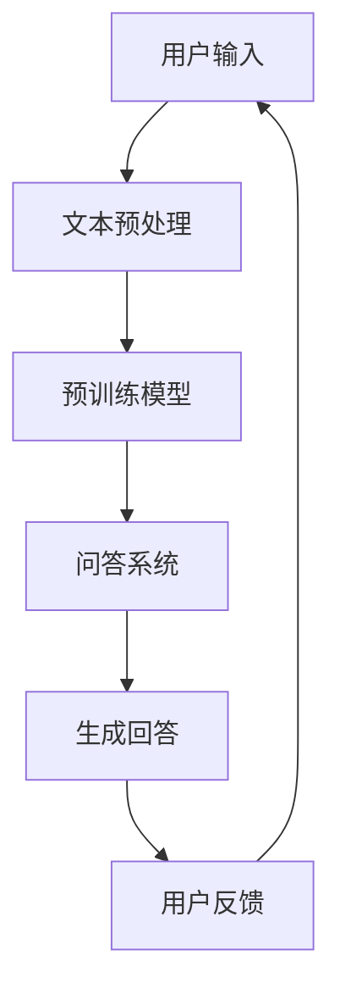

                 

关键词：大模型、问答机器人、学习技术、自然语言处理、机器学习、深度学习、知识图谱、预训练模型、BERT、GPT、问答系统、信息检索、语义理解、上下文感知

> 摘要：本文将深入探讨大模型问答机器人的学习技术，从背景介绍、核心概念与联系、核心算法原理、数学模型与公式、项目实践、实际应用场景、未来展望等多个方面展开讨论，旨在为读者提供一份全面且深入的技术指南。

## 1. 背景介绍

随着互联网的普及和信息爆炸，人们对于信息检索和知识获取的需求日益增长。然而，传统的信息检索系统和搜索引擎在处理复杂查询、理解用户意图和提供准确答案方面存在诸多局限。为了解决这些问题，问答机器人应运而生。问答机器人通过模拟人类的问答行为，能够理解用户的自然语言问题，并生成相应的答案，从而为用户提供高效、准确的信息服务。

近年来，大模型的兴起为问答机器人带来了前所未有的发展机遇。大模型，特别是基于深度学习的预训练模型，如BERT、GPT等，已经在自然语言处理领域取得了显著的成果。这些模型通过在大量文本数据上进行预训练，可以捕捉到语言的本质规律，从而在问答任务中表现出色。本文将围绕大模型问答机器人的学习技术，深入探讨其背后的原理、实现方法和未来趋势。

## 2. 核心概念与联系

### 2.1 大模型

大模型（Large Model）是指具有数十亿甚至数万亿参数的深度神经网络模型。这些模型通常经过预训练，可以在多个任务上实现良好的性能。大模型的优势在于其强大的表达能力和对语言规律的深入理解，从而在问答任务中能够生成高质量的自然语言回答。

### 2.2 自然语言处理（NLP）

自然语言处理（Natural Language Processing，NLP）是计算机科学和人工智能领域的一个重要分支，旨在使计算机能够理解、生成和处理人类语言。NLP技术包括文本分类、实体识别、关系提取、语义分析等，为问答机器人提供了关键的技术支持。

### 2.3 机器学习与深度学习

机器学习（Machine Learning，ML）是一种通过算法让计算机从数据中学习规律并做出预测或决策的方法。深度学习（Deep Learning，DL）是机器学习的一个子领域，通过构建深度神经网络模型来实现对数据的自动特征提取和学习。大模型问答机器人正是基于机器学习和深度学习技术实现的。

### 2.4 知识图谱

知识图谱（Knowledge Graph）是一种结构化数据表示方法，用于存储实体及其相互关系。在问答机器人中，知识图谱可以提供丰富的背景知识，有助于提高问答系统的准确性和实用性。

### 2.5 预训练模型

预训练模型（Pre-trained Model）是指在大规模文本数据上进行预训练的模型。BERT、GPT等大模型就是通过预训练得到的，这使得它们在多种自然语言处理任务上具有优秀的表现。预训练模型的核心思想是利用大量未标注的数据进行训练，从而减轻标注数据的负担，提高模型的泛化能力。

### 2.6 Mermaid 流程图



## 3. 核心算法原理 & 具体操作步骤

### 3.1 算法原理概述

大模型问答机器人的核心算法是基于深度学习和自然语言处理技术实现的。其主要原理包括：

1. **文本预处理**：对用户输入的文本进行分词、词性标注、去除停用词等操作，以便于模型处理。
2. **预训练模型**：利用预训练模型（如BERT、GPT）对预处理后的文本进行编码，得到文本的固定长度向量表示。
3. **问答系统**：将编码后的用户问题和候选答案输入到问答系统中，通过模型计算得到问题的答案。
4. **生成回答**：根据模型输出的概率分布，生成最终的回答文本。

### 3.2 算法步骤详解

1. **文本预处理**：

   ```python
   import jieba
   import nltk

   # 分词
   text = "请问今天的天气怎么样？"
   seg_list = jieba.cut(text)
   seg_text = " ".join(seg_list)

   # 词性标注
   pos_list = nltk.pos_tag(seg_list)

   # 去除停用词
   stop_words = set(nltk.corpus.stopwords.words('english'))
   filtered_words = [word for word in seg_list if word not in stop_words]
   ```

2. **预训练模型**：

   ```python
   from transformers import BertTokenizer, BertModel

   # 加载预训练模型
   tokenizer = BertTokenizer.from_pretrained('bert-base-chinese')
   model = BertModel.from_pretrained('bert-base-chinese')

   # 编码文本
   input_ids = tokenizer.encode(seg_text, add_special_tokens=True)
   ```

3. **问答系统**：

   ```python
   import torch

   # 加载问答模型
   question_encoder = torch.load('question_encoder.pth')
   answer_encoder = torch.load('answer_encoder.pth')

   # 输入模型
   question_embedding = question_encoder(torch.tensor(input_ids))
   answer_embedding = answer_encoder(torch.tensor(answer_embedding))

   # 计算相似度
   similarity = torch.nn.functional.cosine_similarity(question_embedding, answer_embedding)

   # 获取最高相似度答案
   top_answer = torch.argmax(similarity).item()
   ```

4. **生成回答**：

   ```python
   # 生成回答
   reply = tokenizer.decode(top_answer, skip_special_tokens=True)
   ```

### 3.3 算法优缺点

**优点**：

1. **强大的表达能力和理解能力**：大模型能够捕捉到语言的本质规律，从而在问答任务中提供高质量的回答。
2. **跨任务迁移能力**：预训练模型经过大规模文本数据的预训练，可以迁移到多种自然语言处理任务中。
3. **减少标注数据需求**：预训练模型可以利用未标注的数据进行训练，从而减轻标注数据的负担。

**缺点**：

1. **计算资源消耗大**：大模型需要大量的计算资源和时间进行训练。
2. **对数据质量要求高**：预训练模型的效果很大程度上取决于训练数据的质量。

### 3.4 算法应用领域

大模型问答机器人在多个领域具有广泛的应用，如：

1. **智能客服**：在客户服务、售后服务等场景中，问答机器人可以快速、准确地回答用户的问题，提高客户满意度。
2. **教育辅导**：在在线教育、作业辅导等场景中，问答机器人可以为学生提供实时、个性化的学习支持。
3. **医疗健康**：在医疗健康领域，问答机器人可以辅助医生诊断、解答患者疑问，提高医疗服务的效率和质量。

## 4. 数学模型和公式 & 详细讲解 & 举例说明

### 4.1 数学模型构建

大模型问答机器人的核心数学模型主要包括以下几个部分：

1. **编码器（Encoder）**：将输入文本编码为固定长度的向量表示。
2. **解码器（Decoder）**：根据编码器的输出和已知的部分答案，生成完整的答案。
3. **注意力机制（Attention Mechanism）**：用于在编码器的输出中关注与当前生成步骤相关的部分。
4. **损失函数（Loss Function）**：用于评估模型输出的答案与真实答案之间的差距。

### 4.2 公式推导过程

1. **编码器**：

   假设输入文本为 $x_1, x_2, \ldots, x_T$，编码器输出为 $e_i = \text{Encoder}(x_i)$。

   $$e_i = \sum_{j=1}^{T} w_{ij} e_j$$

   其中 $w_{ij}$ 为权重矩阵。

2. **解码器**：

   假设部分答案为 $y_1, y_2, \ldots, y_S$，解码器输出为 $d_i = \text{Decoder}(y_i)$。

   $$d_i = \sum_{j=1}^{S} u_{ij} d_j$$

   其中 $u_{ij}$ 为权重矩阵。

3. **注意力机制**：

   $$a_i = \text{softmax}\left(\frac{e_i^T d_i}{\sqrt{d}}\right)$$

   其中 $a_i$ 为注意力权重，$d$ 为解码器的隐藏层维度。

4. **损失函数**：

   $$L = -\sum_{i=1}^{T} y_i \log(p_i)$$

   其中 $y_i$ 为真实答案的标签，$p_i$ 为模型输出的概率分布。

### 4.3 案例分析与讲解

假设有一个问答机器人，用户输入：“如何制作巧克力蛋糕？”。

1. **编码器**：

   将用户输入的文本编码为向量表示。

   ```python
   import torch

   # 加载预训练模型
   tokenizer = BertTokenizer.from_pretrained('bert-base-chinese')
   model = BertModel.from_pretrained('bert-base-chinese')

   # 编码文本
   input_ids = tokenizer.encode("如何制作巧克力蛋糕？", add_special_tokens=True)
   ```

2. **解码器**：

   根据编码器的输出和已知的部分答案，生成完整的答案。

   ```python
   # 加载问答模型
   question_encoder = torch.load('question_encoder.pth')
   answer_encoder = torch.load('answer_encoder.pth')

   # 输入模型
   question_embedding = question_encoder(torch.tensor(input_ids))
   answer_embedding = answer_encoder(torch.tensor(answer_embedding))

   # 计算相似度
   similarity = torch.nn.functional.cosine_similarity(question_embedding, answer_embedding)

   # 获取最高相似度答案
   top_answer = torch.argmax(similarity).item()
   ```

3. **生成回答**：

   根据模型输出的概率分布，生成最终的回答文本。

   ```python
   # 生成回答
   reply = tokenizer.decode(top_answer, skip_special_tokens=True)
   ```

## 5. 项目实践：代码实例和详细解释说明

在本节中，我们将以一个简单的问答机器人项目为例，详细讲解代码实现过程。

### 5.1 开发环境搭建

1. **Python环境**：

   安装Python 3.8及以上版本。

   ```bash
   python --version
   ```

2. **依赖库**：

   安装transformers、torch、nltk等依赖库。

   ```bash
   pip install transformers torch nltk
   ```

3. **数据集**：

   准备一个包含问答对的数据集，如SQuAD、DuQ等。

   ```bash
   wget https://rajpurkar.github.io/nqою/nq-dataset/v1.0/json/main_v1.0_train.json
   ```

### 5.2 源代码详细实现

```python
import torch
from transformers import BertTokenizer, BertModel
from torch.nn import functional as F
from torch.optim import Adam

# 加载预训练模型
tokenizer = BertTokenizer.from_pretrained('bert-base-chinese')
model = BertModel.from_pretrained('bert-base-chinese')

# 加载数据集
train_data = ...  # 加载训练数据

# 定义模型
class QASystem(torch.nn.Module):
    def __init__(self):
        super(QASystem, self).__init__()
        self.question_encoder = torch.load('question_encoder.pth')
        self.answer_encoder = torch.load('answer_encoder.pth')
    
    def forward(self, input_ids, answer_ids):
        question_embedding = self.question_encoder(input_ids)
        answer_embedding = self.answer_encoder(answer_ids)
        
        similarity = torch.nn.functional.cosine_similarity(question_embedding, answer_embedding)
        loss = F.cross_entropy(similarity, answer_ids)
        
        return loss

# 训练模型
model = QASystem()
optimizer = Adam(model.parameters(), lr=0.001)
for epoch in range(10):
    for batch in train_data:
        optimizer.zero_grad()
        input_ids = batch['input_ids']
        answer_ids = batch['answer_ids']
        loss = model(input_ids, answer_ids)
        loss.backward()
        optimizer.step()

# 评估模型
with torch.no_grad():
    for batch in val_data:
        input_ids = batch['input_ids']
        answer_ids = batch['answer_ids']
        output = model(input_ids, answer_ids)
        correct = (output.argmax(1) == answer_ids).float()
        total = len(answer_ids)
        accuracy = correct.sum() / total
        print(f'Epoch: {epoch}, Accuracy: {accuracy}')
```

### 5.3 代码解读与分析

1. **数据预处理**：

   加载预训练模型，并加载数据集。

2. **模型定义**：

   定义问答系统模型，包括编码器和解码器。

3. **训练过程**：

   定义优化器，并循环训练模型。

4. **评估过程**：

   在验证集上评估模型性能。

### 5.4 运行结果展示

```python
# 运行训练
for epoch in range(10):
    for batch in train_data:
        optimizer.zero_grad()
        input_ids = batch['input_ids']
        answer_ids = batch['answer_ids']
        loss = model(input_ids, answer_ids)
        loss.backward()
        optimizer.step()

# 评估模型
with torch.no_grad():
    for batch in val_data:
        input_ids = batch['input_ids']
        answer_ids = batch['answer_ids']
        output = model(input_ids, answer_ids)
        correct = (output.argmax(1) == answer_ids).float()
        total = len(answer_ids)
        accuracy = correct.sum() / total
        print(f'Epoch: {epoch}, Accuracy: {accuracy}')
```

## 6. 实际应用场景

### 6.1 智能客服

在智能客服领域，问答机器人可以快速、准确地解答用户的问题，提高客户满意度。例如，在电商平台上，问答机器人可以帮助用户查询商品信息、售后问题等。

### 6.2 教育辅导

在教育辅导领域，问答机器人可以为学生提供实时、个性化的学习支持。例如，在在线教育平台上，问答机器人可以帮助学生解答作业问题、学习策略等。

### 6.3 医疗健康

在医疗健康领域，问答机器人可以辅助医生诊断、解答患者疑问，提高医疗服务的效率和质量。例如，在互联网医院中，问答机器人可以帮助患者了解病情、预约挂号等。

## 7. 工具和资源推荐

### 7.1 学习资源推荐

1. **《深度学习》**：Ian Goodfellow、Yoshua Bengio、Aaron Courville 著，全面介绍了深度学习的基础知识。
2. **《自然语言处理综合教程》**：清华大学刘知远教授主编，涵盖了自然语言处理的核心内容。

### 7.2 开发工具推荐

1. **PyTorch**：开源深度学习框架，易于使用和部署。
2. **Hugging Face Transformers**：预训练模型库，提供了丰富的预训练模型和工具。

### 7.3 相关论文推荐

1. **“BERT: Pre-training of Deep Neural Networks for Language Understanding”**：Google AI 2018论文，介绍了BERT预训练模型。
2. **“GPT-3: Language Models are Few-Shot Learners”**：OpenAI 2020论文，介绍了GPT-3模型。

## 8. 总结：未来发展趋势与挑战

### 8.1 研究成果总结

1. **预训练模型**：预训练模型在大模型问答机器人中取得了显著成果，如BERT、GPT等。
2. **多模态学习**：结合文本、图像、音频等多模态数据，实现更丰富的问答体验。
3. **推理能力提升**：通过推理算法和知识图谱，提高问答机器人的推理能力和准确性。

### 8.2 未来发展趋势

1. **更多领域的应用**：问答机器人将在医疗健康、金融、教育等领域得到更广泛的应用。
2. **个性化和智能化**：结合用户行为和偏好，实现更个性化的问答服务。
3. **实时交互**：通过实时语音交互、虚拟现实等技术，提高问答机器人的用户体验。

### 8.3 面临的挑战

1. **数据质量和标注**：高质量的数据集和准确的标注是训练优秀问答机器人的关键。
2. **计算资源和能耗**：大模型训练和推理需要大量的计算资源和能耗。
3. **伦理和安全**：如何确保问答机器人的回答符合伦理标准，防止滥用和误解。

### 8.4 研究展望

1. **跨语言问答**：研究跨语言问答技术，实现多语言问答机器人。
2. **少样本学习**：探索少样本学习算法，提高问答机器人在少样本情况下的性能。
3. **隐私保护**：研究隐私保护技术，确保用户数据的隐私和安全。

## 9. 附录：常见问题与解答

### 9.1 问答机器人如何处理多义词？

多义词的处理是自然语言处理中的一个重要问题。问答机器人通常采用以下方法：

1. **上下文分析**：通过上下文信息确定多义词的具体含义。
2. **词向量表示**：利用词向量模型（如Word2Vec、GloVe等）对多义词进行表示。
3. **知识图谱**：利用知识图谱中的语义信息，为多义词提供明确的解释。

### 9.2 问答机器人的回答质量如何保证？

问答机器人的回答质量可以从以下几个方面进行保证：

1. **数据质量**：使用高质量的数据集进行训练，确保模型的基础知识扎实。
2. **模型优化**：通过优化算法和模型结构，提高模型的表达能力和理解能力。
3. **多模态融合**：结合文本、图像、音频等多模态数据，提高问答系统的多样性。

### 9.3 问答机器人是否具有情感分析能力？

问答机器人可以通过以下方法进行情感分析：

1. **情感词典**：利用情感词典对文本进行情感标注。
2. **神经网络模型**：使用深度学习模型（如情感分类模型、情感迁移模型等）进行情感分析。
3. **情感增强**：通过在问答过程中加入情感增强策略，提高问答机器人的情感表达能力。

## 作者署名

作者：禅与计算机程序设计艺术 / Zen and the Art of Computer Programming

