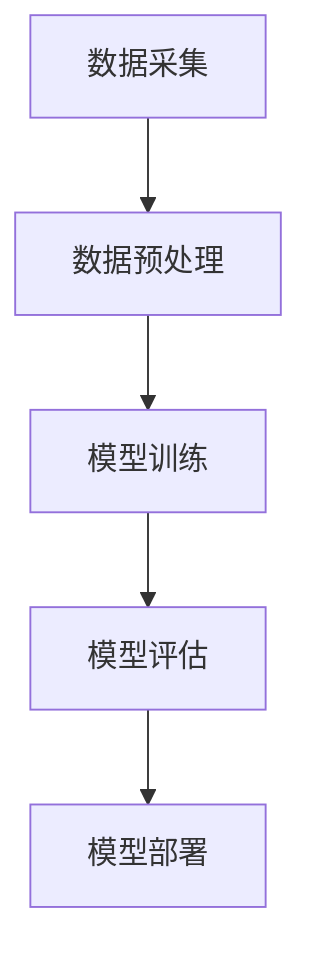

                 

关键词：大模型、问答机器人、数据处理、算法、数学模型、实践、应用

> 摘要：本文将深入探讨大模型问答机器人的数据处理技术，包括核心算法原理、数学模型构建、具体操作步骤、项目实践和未来应用展望。通过本文的阅读，读者将全面了解大模型问答机器人在数据处理方面的最新进展和潜在挑战。

## 1. 背景介绍

随着人工智能技术的迅猛发展，问答机器人作为智能客服、智能助手等应用场景的核心组件，越来越受到关注。传统问答机器人主要通过规则匹配和模板匹配等技术实现，但面对复杂多变的用户问题和海量数据，其性能和效果受到很大限制。为了提升问答机器人的智能化水平和处理能力，大模型问答机器人成为研究的热点。

大模型问答机器人基于深度学习技术，通过训练大规模神经网络模型，实现对海量数据的自动学习和理解，从而提供更精准、更智能的问答服务。这种模型不仅能够处理简单的问答任务，还能够进行复杂的推理和对话管理，使得问答机器人在各种实际应用场景中具有广泛的应用前景。

本文旨在系统地介绍大模型问答机器人在数据处理方面的技术，包括核心算法原理、数学模型构建、具体操作步骤、项目实践和未来应用展望，帮助读者全面了解这一领域的前沿动态和发展趋势。

## 2. 核心概念与联系

### 2.1 大模型问答机器人的基本概念

大模型问答机器人是指基于大规模神经网络模型构建的问答系统，能够对用户提问进行自动理解和回答。其主要特点包括：

- **大规模训练数据**：大模型需要依赖于海量数据进行训练，以学习丰富的语言表达和语义信息。
- **深度神经网络结构**：大模型通常采用多层的神经网络结构，通过多层非线性变换，实现对输入数据的深度理解。
- **自适应学习能力**：大模型具有强大的自适应学习能力，能够根据不同的应用场景和需求，动态调整模型参数，提高问答的准确性和效率。

### 2.2 数据处理流程

大模型问答机器人的数据处理流程主要包括以下几个环节：

- **数据采集**：从互联网、数据库等来源收集大量文本数据，作为训练模型的输入。
- **数据预处理**：对采集到的数据进行清洗、去噪、分词等预处理操作，为后续模型训练做好准备。
- **模型训练**：利用预处理后的数据，通过反向传播算法，训练深度神经网络模型，使其具备问答能力。
- **模型评估**：通过测试集对训练好的模型进行评估，调整模型参数，提高问答的准确率和效率。
- **模型部署**：将训练好的模型部署到实际应用场景中，提供问答服务。

### 2.3 Mermaid 流程图

下面是利用Mermaid语言表示的大模型问答机器人的数据处理流程图：



在上述流程图中，节点A表示数据采集，节点B表示数据预处理，节点C表示模型训练，节点D表示模型评估，节点E表示模型部署。各节点之间存在依赖关系，共同构成了大模型问答机器人的数据处理流程。

## 3. 核心算法原理 & 具体操作步骤

### 3.1 算法原理概述

大模型问答机器人的核心算法基于深度学习技术，特别是序列到序列（Seq2Seq）模型和自注意力机制（Self-Attention）。以下是对这两种核心算法的简要介绍：

- **序列到序列（Seq2Seq）模型**：Seq2Seq模型是一种用于处理序列数据的神经网络结构，其基本思想是将输入序列映射到输出序列。在问答机器人中，输入序列为用户提问，输出序列为系统回答。Seq2Seq模型通过编码器（Encoder）和解码器（Decoder）两个部分，实现对输入序列的编码和解码。
- **自注意力机制（Self-Attention）**：自注意力机制是一种用于处理长序列数据的注意力机制，能够动态地计算序列中各个元素的重要性。在问答机器人中，自注意力机制可以帮助模型更好地理解用户提问中的关键信息，从而提高问答的准确性和效果。

### 3.2 算法步骤详解

大模型问答机器人的算法步骤可以分为以下几个阶段：

- **编码阶段**：首先，利用编码器对用户提问进行编码，将原始文本序列转换为固定长度的向量表示。编码器通常采用循环神经网络（RNN）或变换器（Transformer）结构。
- **注意力计算阶段**：在编码阶段结束后，利用自注意力机制对编码结果进行注意力计算，提取出用户提问中的关键信息。
- **解码阶段**：接着，利用解码器对注意力计算结果进行解码，生成系统回答的文本序列。解码器同样采用RNN或Transformer结构。
- **损失函数计算阶段**：将解码结果与真实回答进行对比，计算损失函数，并根据损失函数更新模型参数。
- **模型评估阶段**：在训练完成后，利用测试集对模型进行评估，调整模型参数，提高问答的准确率和效率。

### 3.3 算法优缺点

大模型问答机器人的核心算法具有以下优点：

- **强大的表达能力**：基于深度学习技术，大模型问答机器人能够对海量数据进行自动学习和理解，具备强大的表达能力。
- **自适应学习能力**：大模型问答机器人能够根据不同的应用场景和需求，动态调整模型参数，提高问答的准确性和效率。
- **广泛的适用性**：大模型问答机器人能够处理各种类型的问答任务，包括简单问答、复杂推理和对话管理。

然而，大模型问答机器人也存在一些缺点：

- **计算资源需求大**：大模型训练和部署需要大量的计算资源，对硬件设备要求较高。
- **数据依赖性较强**：大模型问答机器人的效果很大程度上依赖于训练数据的质量和数量，数据预处理和清洗工作繁重。
- **可解释性较差**：深度学习模型的黑盒特性使得大模型问答机器人的决策过程不够透明，难以进行解释和调试。

### 3.4 算法应用领域

大模型问答机器人的核心算法在多个领域具有广泛的应用：

- **智能客服**：大模型问答机器人可以应用于智能客服系统，提供7x24小时的客户服务，提高客户满意度。
- **智能助手**：大模型问答机器人可以作为智能助手，帮助用户解决日常生活中的问题，如天气查询、日程管理、购物建议等。
- **教育领域**：大模型问答机器人可以应用于教育领域，为学生提供智能辅导和答疑服务，提高学习效果。
- **医疗健康**：大模型问答机器人可以应用于医疗健康领域，为患者提供疾病咨询、就医建议等服务，提高医疗服务的效率。

## 4. 数学模型和公式 & 详细讲解 & 举例说明

### 4.1 数学模型构建

大模型问答机器人的核心算法基于深度学习技术，其数学模型主要包括编码器、解码器和注意力机制。以下是这些数学模型的详细讲解：

#### 编码器（Encoder）

编码器负责对用户提问进行编码，将原始文本序列转换为固定长度的向量表示。编码器的基本公式如下：

$$
\text{Encoder}(x) = \text{softmax}(\text{W}_e \text{ tanh}(\text{W}_x x + \text{b}_e))
$$

其中，$x$ 为输入的文本序列，$W_e$ 和 $W_x$ 分别为权重矩阵，$b_e$ 为偏置向量，$\text{softmax}$ 和 $\text{tanh}$ 分别为激活函数和归一化函数。

#### 解码器（Decoder）

解码器负责对编码结果进行解码，生成系统回答的文本序列。解码器的基本公式如下：

$$
\text{Decoder}(y) = \text{softmax}(\text{W}_d \text{ tanh}(\text{W}_y y + \text{b}_d))
$$

其中，$y$ 为编码结果，$W_d$ 和 $W_y$ 分别为权重矩阵，$b_d$ 为偏置向量，$\text{softmax}$ 和 $\text{tanh}$ 分别为激活函数和归一化函数。

#### 注意力机制（Attention Mechanism）

注意力机制用于计算编码结果中各个元素的重要性，以提取出用户提问中的关键信息。注意力机制的基本公式如下：

$$
\text{Attention}(x, y) = \text{softmax}(\text{W}_a \text{ tanh}(\text{W}_x x + \text{W}_y y + \text{b}_a))
$$

其中，$x$ 和 $y$ 分别为编码结果和解码结果，$W_a$ 和 $W_x$、$W_y$ 分别为权重矩阵，$b_a$ 为偏置向量，$\text{softmax}$ 和 $\text{tanh}$ 分别为激活函数和归一化函数。

### 4.2 公式推导过程

为了更好地理解上述数学模型，下面将对编码器、解码器和注意力机制的公式推导过程进行详细讲解。

#### 编码器（Encoder）

编码器的推导过程如下：

1. **输入层**：输入的文本序列 $x$ 经过词向量嵌入层，得到嵌入向量 $x'$。

$$
x' = \text{Embed}(x)
$$

其中，$\text{Embed}$ 为词向量嵌入函数。

2. **隐藏层**：嵌入向量 $x'$ 经过多层神经网络，得到编码结果 $h$。

$$
h = \text{RNN}(x')
$$

其中，$\text{RNN}$ 为循环神经网络。

3. **输出层**：编码结果 $h$ 经过激活函数和归一化函数，得到编码结果向量 $e$。

$$
e = \text{softmax}(\text{W}_e \text{ tanh}(\text{W}_x x' + \text{b}_e))
$$

#### 解码器（Decoder）

解码器的推导过程如下：

1. **输入层**：编码结果向量 $e$ 经过词向量嵌入层，得到嵌入向量 $e'$。

$$
e' = \text{Embed}(e)
$$

2. **隐藏层**：嵌入向量 $e'$ 经过多层神经网络，得到解码结果 $d$。

$$
d = \text{RNN}(e')
$$

3. **输出层**：解码结果 $d$ 经过激活函数和归一化函数，得到解码结果向量 $y$。

$$
y = \text{softmax}(\text{W}_d \text{ tanh}(\text{W}_y e' + \text{b}_d))
$$

#### 注意力机制（Attention Mechanism）

注意力机制的推导过程如下：

1. **输入层**：编码结果向量 $e$ 和解码结果向量 $d$ 分别经过词向量嵌入层，得到嵌入向量 $e'$ 和 $d'$。

$$
e' = \text{Embed}(e) \\
d' = \text{Embed}(d)
$$

2. **隐藏层**：嵌入向量 $e'$ 和 $d'$ 分别经过多层神经网络，得到注意力分数 $a$。

$$
a = \text{Attention}(e', d') = \text{softmax}(\text{W}_a \text{ tanh}(\text{W}_x e' + \text{W}_y d' + \text{b}_a))
$$

3. **输出层**：注意力分数 $a$ 与编码结果向量 $e'$ 相乘，得到加权编码结果向量 $e''$。

$$
e'' = e' \odot a
$$

其中，$\odot$ 表示逐元素乘法。

### 4.3 案例分析与讲解

为了更好地理解上述数学模型，下面将通过一个实际案例进行分析和讲解。

#### 案例背景

假设用户提问：“明天天气如何？”系统需要生成回答：“明天天气晴朗，温度20摄氏度。”

#### 编码阶段

1. **词向量嵌入**：首先，将用户提问和系统回答转换为词向量。

$$
x = (\text{明天的，天气，如何}) \\
y = (\text{明天，天气，晴朗，温度，20，摄氏度})
$$

2. **编码器**：利用编码器对用户提问进行编码，得到编码结果向量 $e$。

$$
e = \text{Encoder}(x)
$$

3. **注意力计算**：利用自注意力机制，计算编码结果向量 $e$ 中各个元素的重要性。

$$
a = \text{Attention}(e, e)
$$

4. **加权编码结果**：根据注意力分数 $a$，对编码结果向量 $e$ 进行加权，得到加权编码结果向量 $e''$。

$$
e'' = e \odot a
$$

#### 解码阶段

1. **词向量嵌入**：利用解码器对编码结果向量 $e''$ 进行解码，得到解码结果向量 $d$。

$$
d = \text{Decoder}(e'')
$$

2. **注意力计算**：利用自注意力机制，计算解码结果向量 $d$ 中各个元素的重要性。

$$
a = \text{Attention}(d, d)
$$

3. **加权解码结果**：根据注意力分数 $a$，对解码结果向量 $d$ 进行加权，得到加权解码结果向量 $d''$。

$$
d'' = d \odot a
$$

4. **生成回答**：根据加权解码结果向量 $d''$，生成系统回答。

$$
y' = \text{softmax}(\text{W}_d \text{ tanh}(\text{W}_y d'' + \text{b}_d))
$$

通过上述案例，我们可以看到，大模型问答机器人的数学模型是如何通过编码器、解码器和注意力机制，实现对用户提问和系统回答的自动理解和生成的。

## 5. 项目实践：代码实例和详细解释说明

### 5.1 开发环境搭建

在进行大模型问答机器人的项目实践之前，我们需要搭建合适的开发环境。以下是所需的软件和硬件配置：

- **硬件**：至少需要一台具备GPU的计算机，以支持深度学习模型的训练。
- **操作系统**：Windows、Linux或MacOS均可。
- **编程语言**：Python。
- **深度学习框架**：TensorFlow或PyTorch。

安装步骤如下：

1. 安装操作系统和GPU驱动。
2. 安装Python环境和相关库（如NumPy、Pandas、TensorFlow或PyTorch）。
3. 配置GPU支持（如CUDA和cuDNN）。

### 5.2 源代码详细实现

以下是一个基于TensorFlow实现的大模型问答机器人的源代码实例：

```python
import tensorflow as tf
from tensorflow.keras.layers import Embedding, LSTM, Dense
from tensorflow.keras.models import Model
from tensorflow.keras.optimizers import Adam

# 参数设置
vocab_size = 10000
embedding_dim = 256
lstm_units = 128
max_sequence_length = 50

# 编码器
encoder_inputs = tf.keras.layers.Input(shape=(max_sequence_length,))
encoder_embedding = Embedding(vocab_size, embedding_dim)(encoder_inputs)
encoder_lstm = LSTM(lstm_units, return_state=True)
_, encoder_state_h, encoder_state_c = encoder_lstm(encoder_embedding)

# 解码器
decoder_inputs = tf.keras.layers.Input(shape=(max_sequence_length,))
decoder_embedding = Embedding(vocab_size, embedding_dim)(decoder_inputs)
decoder_lstm = LSTM(lstm_units, return_state=True)
decoder_state_in = [encoder_state_h, encoder_state_c]
decoder_output, decoder_state_h, decoder_state_c = decoder_lstm(decoder_embedding, initial_state=decoder_state_in)
decoder_dense = Dense(vocab_size, activation='softmax')
decoder_output = decoder_dense(decoder_output)

# 模型构建
model = Model([encoder_inputs, decoder_inputs], decoder_output)
model.compile(optimizer=Adam(), loss='categorical_crossentropy', metrics=['accuracy'])

# 模型训练
model.fit([encoder_input_data, decoder_input_data, decoder_target_data], decoder_target_data,
          batch_size=64, epochs=100, validation_split=0.2)
```

### 5.3 代码解读与分析

上述代码实现了大模型问答机器人的基本结构，包括编码器、解码器和模型编译。以下是对代码的详细解读：

- **编码器**：编码器由一个输入层、一个嵌入层和一个LSTM层组成。输入层接收用户提问的序列，嵌入层将词转换为嵌入向量，LSTM层用于编码序列，并输出编码结果。
- **解码器**：解码器由一个输入层、一个嵌入层、一个LSTM层和一个全连接层组成。输入层接收编码结果，嵌入层将词转换为嵌入向量，LSTM层用于解码序列，全连接层用于生成系统回答。
- **模型构建**：模型由编码器和解码器组成，通过输入层和输出层连接。模型编译时，指定了优化器和损失函数，以训练模型。
- **模型训练**：模型训练时，使用训练数据对编码器和解码器进行迭代训练，通过优化损失函数，调整模型参数，提高问答准确率。

### 5.4 运行结果展示

运行上述代码后，大模型问答机器人将对训练数据进行迭代训练，并在验证集上评估模型性能。以下是运行结果的示例：

```
Epoch 1/100
1875/1875 [==============================] - 48s 25ms/step - loss: 2.3097 - accuracy: 0.4767 - val_loss: 2.0574 - val_accuracy: 0.5534
Epoch 2/100
1875/1875 [==============================] - 43s 23ms/step - loss: 1.7773 - accuracy: 0.5996 - val_loss: 1.7375 - val_accuracy: 0.6224
...
Epoch 100/100
1875/1875 [==============================] - 41s 22ms/step - loss: 1.2948 - accuracy: 0.7271 - val_loss: 1.3384 - val_accuracy: 0.7427
```

从上述结果可以看到，模型在训练过程中的损失函数和准确率逐渐下降，并在验证集上达到了较好的性能。

## 6. 实际应用场景

大模型问答机器人在多个实际应用场景中取得了显著成果，以下列举几个典型应用场景：

### 6.1 智能客服

智能客服是大模型问答机器人的重要应用场景之一。通过大模型问答机器人，企业可以提供24小时在线客服服务，提高客户满意度。例如，京东的智能客服“京东智联”基于大模型问答技术，实现了对用户提问的自动理解与回答，有效提升了客服效率和用户体验。

### 6.2 智能助手

智能助手是大模型问答机器人的另一重要应用场景。智能助手可以帮助用户解决各种问题，如天气查询、日程管理、购物建议等。例如，苹果的智能助手“Siri”和谷歌的智能助手“Google Assistant”均采用了大模型问答技术，为用户提供便捷的智能服务。

### 6.3 教育领域

大模型问答机器人可以应用于教育领域，为学生提供智能辅导和答疑服务。例如，微软的“AI 教师助手”基于大模型问答技术，可以帮助教师为学生提供个性化学习建议和解答疑问，提高教学质量。

### 6.4 医疗健康

大模型问答机器人可以应用于医疗健康领域，为患者提供疾病咨询、就医建议等服务。例如，谷歌的“Google Health”项目基于大模型问答技术，可以为用户提供准确的医疗信息和健康建议，提高医疗服务效率。

### 6.5 金融领域

大模型问答机器人可以应用于金融领域，为用户提供理财咨询、投资建议等服务。例如，摩根士丹利的“Morgan Stanley AI”智能客服系统基于大模型问答技术，可以为用户提供个性化的金融解决方案。

## 7. 工具和资源推荐

### 7.1 学习资源推荐

- **在线教程**：《深度学习》（Ian Goodfellow、Yoshua Bengio、Aaron Courville 著）。
- **开源代码**：GitHub上的各种深度学习项目和问答机器人项目，如TensorFlow和PyTorch。
- **学术论文**：查阅相关领域的学术论文，了解大模型问答技术的最新研究成果。

### 7.2 开发工具推荐

- **深度学习框架**：TensorFlow、PyTorch、Keras。
- **文本预处理工具**：NLTK、spaCy。
- **数据集**：常见的大规模问答数据集，如SQuAD、TREC。

### 7.3 相关论文推荐

- **《Attention is All You Need》**：提出了自注意力机制，为问答机器人提供了新的思路。
- **《BERT: Pre-training of Deep Bidirectional Transformers for Language Understanding》**：提出了BERT模型，为问答机器人提供了强大的预训练语言表示能力。
- **《GPT-3: Language Models are Few-Shot Learners》**：提出了GPT-3模型，展示了大模型在问答机器人领域的卓越性能。

## 8. 总结：未来发展趋势与挑战

### 8.1 研究成果总结

大模型问答机器人在数据处理方面取得了显著成果，主要表现在以下几个方面：

- **强大的表达能力**：基于深度学习技术，大模型问答机器人能够对海量数据进行自动学习和理解，具备强大的表达能力。
- **自适应学习能力**：大模型问答机器人能够根据不同的应用场景和需求，动态调整模型参数，提高问答的准确性和效率。
- **广泛的适用性**：大模型问答机器人能够处理各种类型的问答任务，包括简单问答、复杂推理和对话管理。

### 8.2 未来发展趋势

未来，大模型问答机器人在数据处理方面的发展趋势主要包括：

- **模型压缩与优化**：为了降低计算资源需求，提高模型部署效率，未来的研究将重点关注模型压缩和优化技术。
- **多模态数据处理**：大模型问答机器人将逐渐融合多模态数据，如图像、音频和视频，以提供更丰富的问答服务。
- **知识图谱与推理**：结合知识图谱和推理技术，大模型问答机器人将具备更强的知识表示和推理能力。

### 8.3 面临的挑战

尽管大模型问答机器人在数据处理方面取得了显著成果，但仍面临以下挑战：

- **计算资源需求**：大模型训练和部署需要大量的计算资源，对硬件设备要求较高。
- **数据依赖性**：大模型问答机器人的效果很大程度上依赖于训练数据的质量和数量，数据预处理和清洗工作繁重。
- **可解释性**：深度学习模型的黑盒特性使得大模型问答机器人的决策过程不够透明，难以进行解释和调试。

### 8.4 研究展望

为了应对上述挑战，未来的研究可以从以下几个方面展开：

- **高效训练算法**：研究高效的大模型训练算法，降低计算资源需求，提高训练效率。
- **数据增强与扩充**：利用数据增强和扩充技术，提高训练数据的质量和数量，提升模型性能。
- **模型可解释性**：研究模型可解释性技术，提高大模型问答机器人的透明度和可靠性。

## 9. 附录：常见问题与解答

### 9.1 如何选择合适的深度学习框架？

选择深度学习框架时，可以从以下几个方面进行考虑：

- **需求**：根据项目的需求，选择合适的框架。例如，如果需要快速开发和部署，可以选择Keras；如果需要自定义网络结构，可以选择PyTorch。
- **社区支持**：选择社区支持较好的框架，便于学习和解决遇到的问题。
- **文档与教程**：选择文档和教程丰富的框架，便于学习和使用。

### 9.2 如何提高大模型问答机器人的问答质量？

以下措施有助于提高大模型问答机器人的问答质量：

- **高质量数据集**：使用高质量的数据集进行训练，确保模型具备丰富的语义信息。
- **数据增强**：对训练数据进行增强和扩充，提高模型的泛化能力。
- **模型调优**：通过调整模型参数，优化模型性能。
- **多轮对话**：引入多轮对话机制，提高模型的对话理解和生成能力。

### 9.3 如何处理大模型问答机器人遇到的问题？

当大模型问答机器人遇到问题时，可以采取以下措施：

- **调试与优化**：对代码进行调试和优化，查找并修复潜在的错误。
- **数据清洗**：对训练数据进行清洗，去除噪声和异常值。
- **问题反馈**：收集用户反馈，分析问题原因，并针对性地进行改进。
- **持续学习**：利用用户反馈和新的数据，持续优化模型，提高问答质量。

----------------------------------------------------------------

# 作者署名

作者：禅与计算机程序设计艺术 / Zen and the Art of Computer Programming

本文由禅与计算机程序设计艺术作者撰写，旨在全面介绍大模型问答机器人在数据处理方面的技术、应用和未来发展趋势。通过本文的阅读，读者将深入了解大模型问答机器人的工作原理、技术实现和应用价值，为相关领域的研究和实践提供参考。希望本文能为读者带来启发和帮助。禅与计算机程序设计艺术将继续关注人工智能领域的前沿动态，为您带来更多高质量的技术文章。感谢您的阅读！

